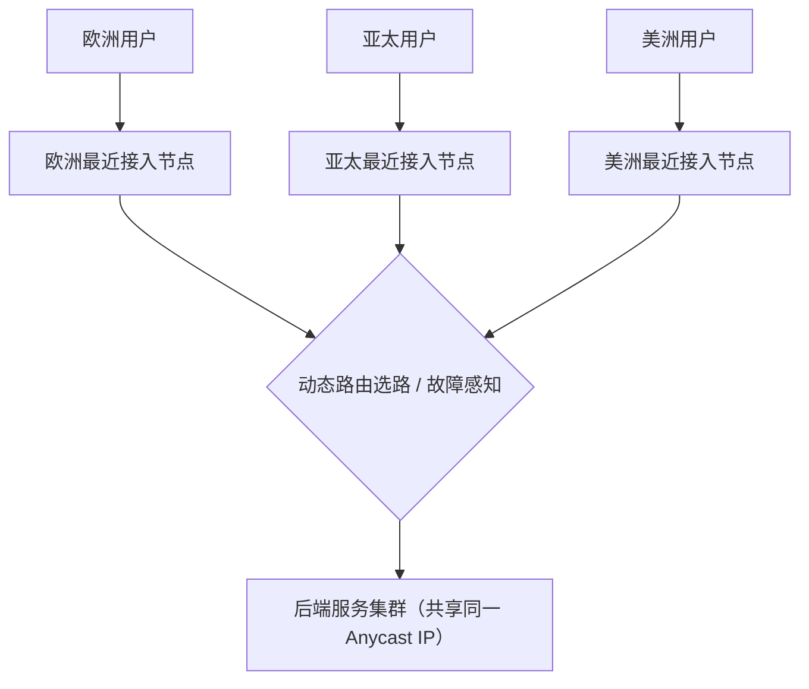
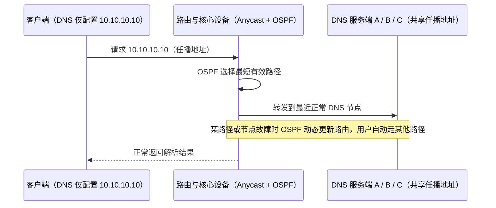
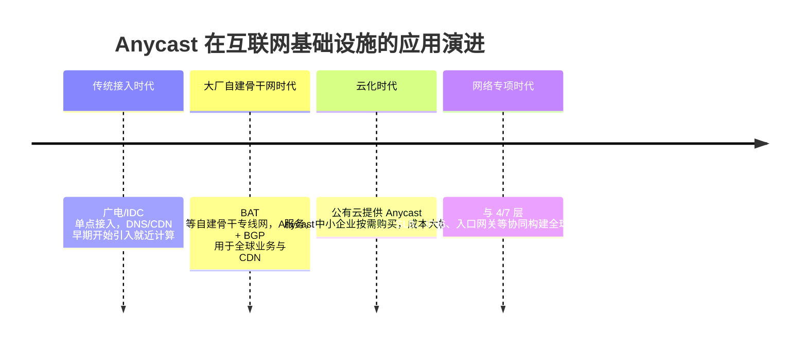

# ① 模块介绍

**Anycast（任播）** 是大型公网与大规模网络架构中常用的接入方式，它让不同地区的用户都能就近访问、自动容灾。本文先对比常见的四种通信模式，再介绍 Anycast 的核心优势与两个典型应用案例（分布式 DNS、全球游戏接入），并给出其应用程度与行业演进脉络，属网络专项里的接入层方案。

## ② 核心方法论

### 2.1 四种通信模式对比

| 模式 | 关系 | 例子 |
|------|------|------|
| 单播（Unicast） | 一对一 | 两个人对话 |
| 组播（Multicast） | 一对多（特定组） | 街上喊一声，一群人回头 |
| 广播（Broadcast） | 一对所有 | 公司全员通知 |
| 任播（Anycast） | 地址一对多、通信时一对一 | 多节点共享同一地址，请求落在最近节点 |

任播的特点是：网络地址和网络节点存在一对多关系，但同一时刻通信保持一对一，结合了单播与组播两者的特点，通常应用在大公网或大规模网络架构中。

### 2.2 Anycast 四大优势

- **就近访问**：多组接入地址，用户基于接入入口选择最近的接入节点，减少请求延迟；
- **分担流量**：不同地区用户接入不同地区的节点，天然实现负载均衡（Load Balancing）；
- **容灾调度**：结合 BGP（Border Gateway Protocol，边界网关协议）等全局路由动态协议，单个节点故障时自动切换到其他正常节点；
- **防大流量攻击**：后端防护大流量攻击很难，即使流量清洗也有局限；在贴近用户的接入层使用 Anycast 能有效防御并阻止大流量攻击（DDoS）。

## ③ 关键流程

### 图：Anycast 任播的就近接入原理

文字说明：多个接入节点对外共享同一个 Anycast 地址，不同地区用户发送请求时，网络层按其接入入口就近选择最近的节点接入（如欧洲用户接入欧洲节点、亚太用户接入亚太节点）；任一路径或节点故障时，BGP/OSPF 动态路由感知并更新路由，用户自动切换其他路径，同时各区域访问天然分摊流量。这实现了「一个地址、多个节点、就近响应」。

#### 图：分布式 DNS 基于 Anycast + OSPF 的容灾流程

文字说明：企业部署三套 DNS 服务端 A、B、C，对外发布同一个任播地址（如 10.10.10.10），客户端 DNS 只配置这个地址。用户请求经过路由与核心设备时有多条访问路径，网络层通过 Anycast + OSPF（Open Shortest Path First，开放最短路径优先，一种最短路径优先协议）自动选择最近的一条；某条路径或 DNS 节点故障时，OSPF 动态感知并更新路由，用户自动走其他路径，不影响访问。

## ④ 工具与实践

### 4.1 案例一：分布式 DNS 系统（Anycast + OSPF）

DNS 是企业核心业务应用，一旦故障绝大部分业务都会受影响。自建分布式 DNS 结合 **Anycast + OSPF**，既能提供动态路由，又能给用户分配最短有效请求路径。部署方式同上一节示意：三套 DNS 服务端共享同一任播地址，路由层自动选路与容灾。

### 4.2 案例二：全球游戏业务接入（Anycast + BGP）

游戏业务分布全球、要求低延迟，且容易成为黑客与黑产 DDoS 攻击对象，适合结合**全局性 Anycast 接入**。部署方式：对外发布 Anycast IP（如 203.0.113.10，示例地址），在香港、美西、日本、韩国四个地区发布。不同地区用户访问同一地址，运营商自动接入最近节点（如香港用户接入香港节点），随后数据链路进入公司内部骨干专线网络，走最优路径直达后端服务节点，降低延迟的同时增强数据包安全性。

**成本与生态**：这种模式结合 Anycast + BGP。大公司（如国内 BAT，即百度、阿里、腾讯）通常自建骨干专线网；小公司使用第三方服务或购买公有云，便捷地获取 Anycast + 骨干网接入能力——成本远低于自建。

### 4.3 应用程度与演进（时间线）

#### 图：Anycast 应用程度的演进脉络

文字说明：Anycast 从早期的分布式 DNS/CDN 就近计算，演进到大厂自建骨干网承载全球业务，再到云厂商直接提供 Anycast 接入服务，已从"少数巨头的专属能力"逐步普及为按需购买的通用云能力，并与 SLB、IPv6、入口网关等网络专项协同。

## ⑤ 常见坑点

- **后端抗大流量攻击能力弱**：即使有流量清洗也有局限；真正的防御应放在贴近用户的接入层用 Anycast 拦截，而不是单纯依赖后端清洗。
- **自建依赖骨干网与路由协议能力**：要同时具备 BGP/OSPF 路由编排与骨干专线网络资源，小公司自建成本高、收益低。
- **就近选路依赖协议收敛**：故障时的路由收敛依赖 BGP/OSPF 动态感知，收敛不及时会导致短暂延迟或丢包。
- **不要和单播混淆**：Anycast 是「地址一对多、通信一对一」，部分场景（如对固定主机回连）不适合用 Anycast。

## ⑥ 进阶扩展与参考

- **本质总结**：Anycast 的本质是「一个地址、多个节点、就近响应」：通过 BGP/OSPF 动态路由配合，天然获得就近加速、负载分担、故障容灾与抗 DDoS 四重能力。典型应用是分布式 DNS（局域网 OSPF 或公网 BGP）与全球业务接入（游戏、CDN 等）。自建需骨干网与路由协议能力，小团队可购买公有云 Anycast 服务。
- **关联章节**：网络层接入与 4/7 层入口负载均衡协同见本目录《04-4、7 层入口负载均衡 SLB 如何作才是最佳姿势》；下一代网络协议见本目录《07-IPv6 特性及当前应用程度介绍》。
- **基础配置**：接入层之上的 Nginx / SLB 基础配置参考相邻 Nginx 专题，见本库 `docs/运维/04-Nginx/`。