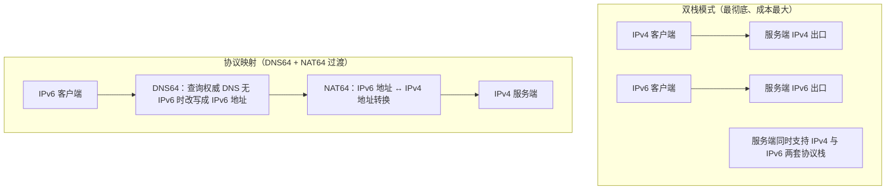
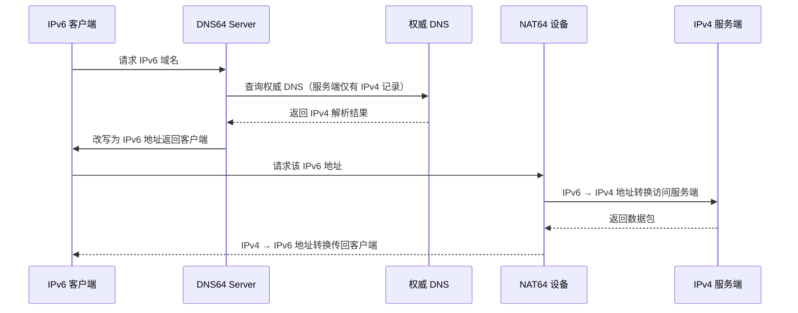
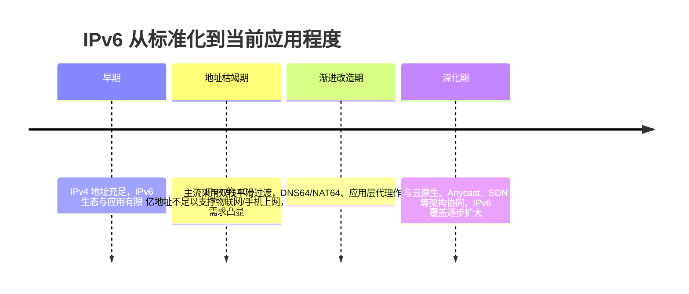

# ① 模块介绍

IPv4 地址约 40 亿个，已无法满足互联网与物联网高速发展的需求。**IPv6（Internet Protocol version 6，互联网协议第 6 版）** 以 128 位地址大幅扩充地址空间。本文先梳理 IPv4 与 IPv6 的差异与 IPv6 地址结构，再系统讲解三种 IPv6 改造方案（双栈、协议映射、应用层代理）的原理与取舍，并介绍当前应用程度与演进，属网络专项里的下一代协议主题。

## ② 核心方法论

### 2.1 IPv4 协议回顾

IPv4 是互联网通信协议第 4 版，也是当前最广泛应用的版本。数据包报头包含源地址、目的地址、TTL（Time To Live，生存时间）、数据包校验、总长度、偏移量等信息。

- **地址长度**：32 位二进制，以十进制 x.x.x.x 标识，每个 x 占 8 位；
- **地址分类**：A、B、C、D、E 五类，D 类用于组播、E 类用于实验，真正可用的是 A/B/C 三类；地址由网络号 + 主机号组成，掩码划分子网后变为网络号 + 子网号 + 主机号；
- **特殊地址**：含私有地址（如 A 类 10.0.0.0-10.255.255.255）、广播地址、回环地址等，公网不可用。

### 2.2 IPv6 特性与差异

| 维度 | IPv4 | IPv6 |
|------|------|------|
| 地址长度 | 32 位，十进制书写 | 128 位，十六进制书写 |
| 网络划分 | 子网掩码、网络号 + 主机号 | 前缀长度 + 网络接口 ID |
| 回环地址 | 127.0.0.1 | ::1 |
| 浏览器访问 | IP + 端口直接访问 | 地址需用中括号括起来再加端口 |

**IPv6 地址结构**：前 48 位为前缀 ID（相当于 IPv4 子网掩码的作用），中间 16 位为子网 ID，最后为主机接口 ID（可由主机 MAC 地址直接生成）。由于 IPv6 地址难以记忆，实际使用中更依赖域名解析。

### 2.3 改造的四种访问关系

IPv6 推广需要硬件到应用的整体调整，必须支持四种访问关系：IPv4 客户端访问 IPv4/IPv6 服务端、IPv6 客户端访问 IPv6/IPv4 服务端。三种改造方案：

| 方案 | 原理 | 特点 |
|------|------|------|
| 双栈（Dual Stack） | 应用、链路、支撑、终端系统同时支持并处理 IPv4 与 IPv6 两套协议栈 | 改造最彻底，成本最大 |
| 协议映射 | DNS64 + NAT64 做地址转换 | 满足部分需求，属过渡方案 |
| 应用层代理 | 通过代理层转发 | 有场景局限，属过渡方案 |

## ③ 关键流程

### 图：IPv6 双栈与过渡方案总览

文字说明：双栈模式下服务端同时支持 IPv4 与 IPv6 两套协议栈，IPv6 客户端通过 DNS 获取 IPv6 地址访问服务端出口，IPv4 客户端维持原有请求响应模式、DNS 返回 IPv4 地址，最彻底但人力、技术与资源成本都高；协议映射模式是过渡方案，以 DNS64 改写解析、NAT64 做地址转换，满足部分需求。

#### 图：IPv6 客户端访问 IPv4 服务端的协议映射时序

文字说明：以 IPv6 客户端访问 IPv4 服务端为例：客户端请求 IPv6 域名，DNS64 Server 先查询权威 DNS 是否有 IPv6 地址；因服务端只支持 IPv4，DNS64 Server 取得 IPv4 解析结果后改写成 IPv6 地址返回客户端；客户端请求该 IPv6 地址，流量先经过 NAT64 接入设备把 IPv6 地址转换为 IPv4 地址访问服务端；服务端返回的数据包再由 NAT64 转换成 IPv6 传回客户端。对用户无感知，但服务端侧做了两层数据包转换，链路较长。

## ④ 工具与实践

### 4.1 双栈模式

服务端同时支持 IPv4 与 IPv6：IPv6 客户端通过 DNS 获取 IPv6 地址访问服务端出口；IPv4 客户端维持原有请求响应模式，DNS 返回 IPv4 地址。这是最彻底的方案，但人力、技术与资源成本都很高。

### 4.2 协议映射（DNS64 + NAT64）

以 IPv6 客户端访问 IPv4 服务端为例（时序见上文图）：

1. 客户端请求 IPv6 域名，DNS64 Server 先查询权威 DNS 是否有 IPv6 地址；
2. 服务端只支持 IPv4，DNS64 Server 取得 IPv4 解析结果后，改写成 IPv6 地址返回给客户端；
3. 客户端请求该 IPv6 地址，流量先经过 NAT64 接入设备，把 IPv6 地址转换为 IPv4 地址访问服务端；
4. 服务端返回的数据包再由 NAT64 转换成 IPv6 传回客户端。

对用户无感知，但服务端侧做了两层数据包转换，链路较长。

### 4.3 应用层代理模式

通过**应用层代理层**转发流量，可实现 IPv4/IPv6 之间的互通，但有场景局限（如仅适用于 HTTP 等应用层协议、性能与兼容性受限），属于过渡方案。

### 4.4 应用程度与演进（时间线）

#### 图：IPv6 推广与应用程度演进

文字说明：IPv6 的核心价值是解决地址枯竭。其推广受限于全链路改造成本，经历从"标准化但应用少"到"地址枯竭催生需求"再到"双栈平滑过渡 + 过渡方案补齐"的过程，当前主流做法是双栈平滑过渡，协议映射（DNS64/NAT64）与应用层代理作为过渡方案解决特定场景。

## ⑤ 常见坑点

- **全链路改造成本高**：IPv6 改造需硬件到应用整体调整（应用、链路、支撑、终端系统），双栈彻底但成本最大。
- **IPv6 地址难记忆**：实际使用更依赖域名解析；浏览器访问 IPv6 地址需用中括号括起来再加端口，勿按 IPv4 写法访问。
- **协议映射链路长**：DNS64 + NAT64 做两层数据包转换，服务端侧链路较长，只能满足部分需求，非长期方案。
- **改造前梳理 IP 依赖**：需先梳理应用对 IP 的硬编码、日志分析、安全策略等依赖，再选择渐进式过渡路径。

## ⑥ 进阶扩展与参考

- **本质总结**：IPv6 的核心价值是解决地址枯竭——128 位地址空间、前缀 + 接口 ID 的简化结构、可自动生成的接口 ID。当前主流是双栈平滑过渡，协议映射（DNS64/NAT64）与应用层代理作为过渡方案解决特定场景。
- **关联章节**：网络层接入方案与 IPv6 协同见本目录《06-分析 Anycast 应用程度及场景》；4/7 层入口负载均衡见本目录《04-4、7 层入口负载均衡 SLB 如何作才是最佳姿势》。
- **基础配置**：入口网关/负载均衡的 IPv4/v6 监听与转发基础配置参考相邻 Nginx 专题，见本库 `docs/运维/04-Nginx/`。