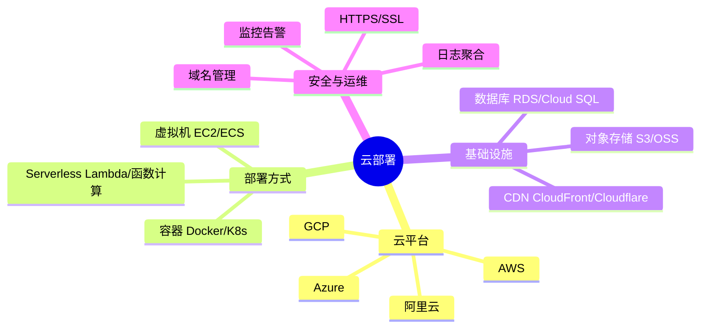
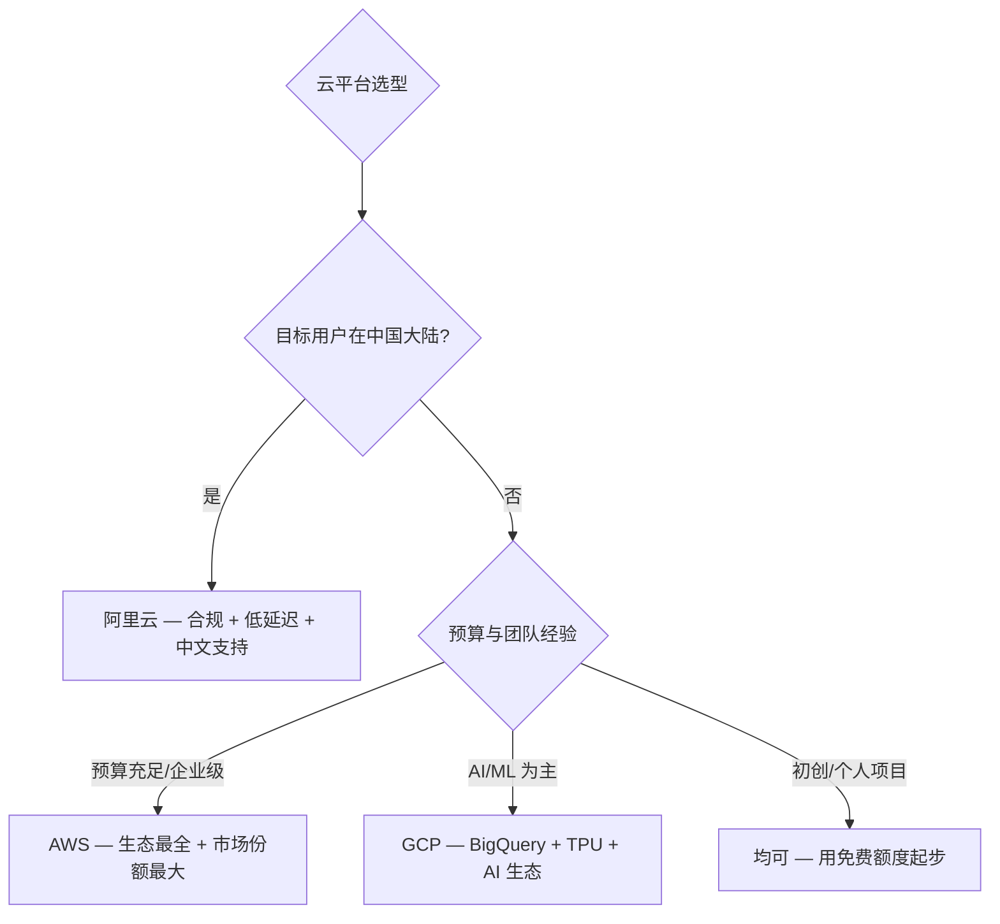
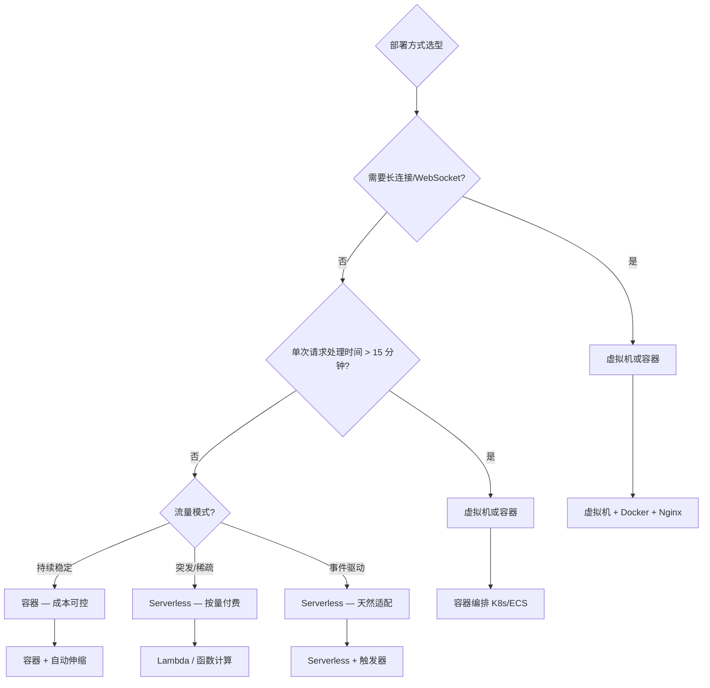
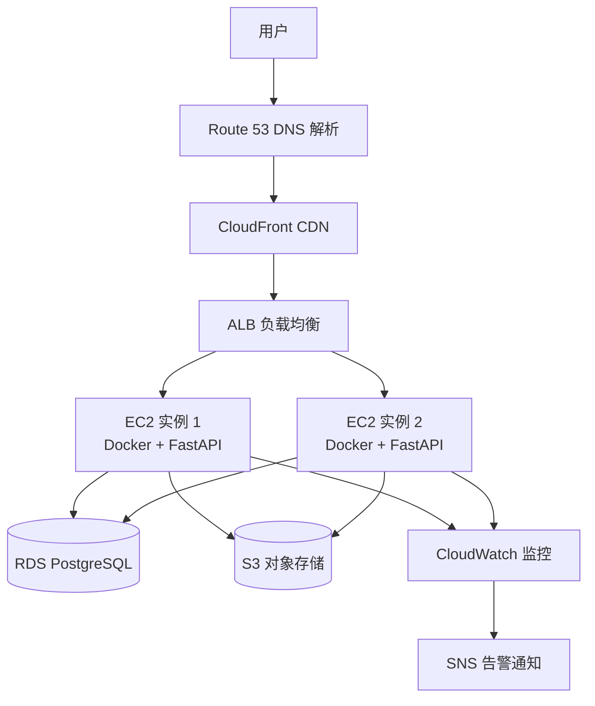
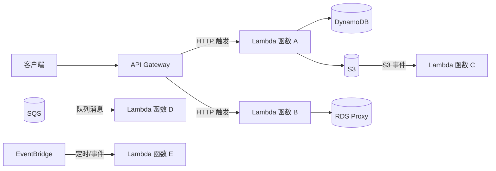

# 云部署实战

**云部署是将应用从本地开发环境推向全球用户的关键一步。** 选择合适的云平台、部署方式和运维策略，直接决定了服务的稳定性、成本和可扩展性。

> 阅读提示

- 如果你想快速了解三大云平台的差异，直接看 [云平台选择对比](#云平台选择对比)
- 如果你纠结于 VM / 容器 / Serverless 的选型，跳到 [部署方式对比](#部署方式对比)
- 如果你要在 AWS 上部署 FastAPI 服务，看 [场景一：FastAPI 部署到 AWS EC2](#场景一fastapi-部署到-aws-ec2)
- 如果你想尝试 Serverless，看 [场景二：Python 函数部署到 AWS Lambda](#场景二python-函数部署到-aws-lambda)
- 本文所有代码基于 **Python 3.10+**，AWS CLI **v2**，Docker **24+**

## 云部署全景



## 云平台选择对比

### 三大云平台总览

| 维度 | AWS | GCP | 阿里云 |
|------|-----|-----|--------|
| 全球区域 | 33 个区域 | 40 个区域 | 28 个区域（含中国优势） |
| 中国大陆可用性 | 需合作方（光环新网/西云数据） | 有限 | 原生支持，合规完善 |
| Python 生态 | Lambda、Elastic Beanstalk、SageMaker | Cloud Functions、App Engine、AI Platform | 函数计算、SAE、PAI |
| 计费模式 | 按需 + 预留实例 + Savings Plans | 按需 + 承诺使用折扣 | 按需 + 包年包月 + 抢占式实例 |
| 学习曲线 | 陡峭（服务数量庞大） | 中等 | 较平缓（中文文档完善） |
| 免费额度 | 12 个月免费层 | 90 天试用 + 永久免费层 | 3 个月试用 |
| IaC 支持 | CloudFormation / CDK | Deployment Manager | ROS / Terraform |
| 对象存储 | S3 | Cloud Storage | OSS |
| 关系型数据库 | RDS（MySQL/PostgreSQL/Aurora） | Cloud SQL | RDS（MySQL/PostgreSQL/PolarDB） |
| Serverless | Lambda | Cloud Functions | 函数计算 |
| 容器服务 | ECS / EKS | GKE | ACK |
| CDN | CloudFront | Cloud CDN | CDN |

> 注：区域数量随云厂商扩张持续变化，上表数字仅为示例参考，请以各云官方最新公告为准。

### 选型决策



### 核心服务对照表

| 服务类别 | AWS | GCP | 阿里云 |
|---------|-----|-----|--------|
| 虚拟机 | EC2 | Compute Engine | ECS |
| 容器编排 | ECS / EKS | GKE | ACK |
| Serverless | Lambda | Cloud Functions | 函数计算 |
| 对象存储 | S3 | Cloud Storage | OSS |
| 关系数据库 | RDS / Aurora | Cloud SQL | RDS / PolarDB |
| NoSQL | DynamoDB | Firestore / Bigtable | Table Store / Lindorm |
| 缓存 | ElastiCache | Memorystore | Redis / Memcache |
| 消息队列 | SQS / SNS | Pub/Sub | MQ / MNS |
| 负载均衡 | ALB / NLB | Cloud Load Balancing | SLB / ALB |
| DNS | Route 53 | Cloud DNS | 云解析 DNS |
| CDN | CloudFront | Cloud CDN | CDN |
| 监控 | CloudWatch | Cloud Monitoring | 云监控 |
| 日志 | CloudWatch Logs | Cloud Logging | SLS |
| IAM | IAM | IAM | RAM |
| 密钥管理 | KMS | Cloud KMS | KMS |

## 部署方式对比

### 三种部署模式

```mermaid
flowchart TD
    subgraph VM[虚拟机部署]
        V1[购买 EC2/ECS 实例] --> V2[SSH 登录安装环境]
        V2 --> V3[部署代码]
        V3 --> V4[配置 Nginx 反向代理]
        V4 --> V5[手动/脚本运维]
    end

    subgraph Container[容器部署]
        C1[编写 Dockerfile] --> C2[构建镜像]
        C2 --> C3[推送到镜像仓库]
        C3 --> C4[ECS/EKS/K8s 拉取运行]
        C4 --> C5[声明式配置管理]
    end

    subgraph Serverless[Serverless 部署]
        S1[编写函数代码] --> S2[配置触发器]
        S2 --> S3[部署到 Lambda/函数计算]
        S3 --> S4[按请求自动扩缩容]
        S4 --> S5[零运维]
    end

```



### 部署方式详细对比

| 维度 | 虚拟机（VM） | 容器（Container） | Serverless |
|------|-------------|-------------------|------------|
| 启动速度 | 分钟级 | 秒级 | 毫秒级（冷启动秒级） |
| 运维负担 | 高（OS 补丁、安全更新） | 中（镜像维护） | 极低（平台托管） |
| 扩缩容 | 手动或自动伸缩组 | 手动或 HPA | 自动、按请求 |
| 成本模型 | 按运行时间计费（不管是否处理请求） | 按运行时间计费 | 按请求次数 + 执行时间 |
| 适合场景 | 长连接、持久化服务、复杂依赖 | 微服务、CI/CD、可移植部署 | 事件驱动、API 接口、定时任务 |
| 冷启动 | 无 | 无 | 有（Python 约 500ms-3s） |
| 最大执行时间 | 无限制 | 无限制 | 15 分钟（Lambda）/ 10 分钟（函数计算） |
| 本地开发一致性 | 低（环境差异大） | 高（容器隔离） | 中（需模拟触发器） |
| 端口/协议 | 任意 | 任意 | 仅 HTTP/事件触发 |
| 状态管理 | 自行管理 | 自行管理 | 无状态（需外部存储） |
| Python 限制 | 无 | 无 | 运行时版本限制、包体积限制 |

### 选型决策流程



## AWS 部署实战

### AWS 核心服务架构



### EC2 实例选型

| 实例族 | 适用场景 | 代表型号 | vCPU | 内存 | 价格（美东/按需） |
|--------|---------|---------|------|------|------------------|
| T3/T4g | 通用/突发 | t3.medium | 2 | 4 GB | ~$0.04/h |
| M5/M6i | 均衡计算 | m5.large | 2 | 8 GB | ~$0.10/h |
| C5/C6i | 计算密集 | c5.large | 2 | 4 GB | ~$0.09/h |
| R5/R6i | 内存密集 | r5.large | 2 | 16 GB | ~$0.13/h |
| Graviton | ARM 高性价比 | t4g.medium | 2 | 4 GB | ~$0.03/h |

::: tip ARM 实例节省成本
AWS Graviton（ARM）实例比同等 x86 实例便宜约 20%-40%，Python 3.10+ 对 ARM 支持良好。如果你的依赖库都支持 ARM，优先选择 T4g/M6g 系列。
:::

### RDS 数据库配置

```python
# config/database.py — FastAPI 数据库配置
from dataclasses import dataclass
import os


@dataclass
class DatabaseConfig:
    """RDS 数据库连接配置"""
    host: str = os.getenv("RDS_HOST", "localhost")
    port: int = int(os.getenv("RDS_PORT", "5432"))
    user: str = os.getenv("RDS_USER", "postgres")
    password: str = os.getenv("RDS_PASSWORD", "")
    database: str = os.getenv("RDS_DATABASE", "app_db")

    @property
    def dsn(self) -> str:
        """SQLAlchemy 连接字符串"""
        return (
            f"postgresql+asyncpg://{self.user}:{self.password}"
            f"@{self.host}:{self.port}/{self.database}"
        )

    @property
    def dsn_sync(self) -> str:
        """同步连接字符串（用于迁移）"""
        return (
            f"postgresql+psycopg2://{self.user}:{self.password}"
            f"@{self.host}:{self.port}/{self.database}"
        )


# 生产环境推荐配置
# - 实例类型: db.t3.medium（开发）/ db.r6g.large（生产）
# - 多可用区部署: 启用 Multi-AZ
# - 自动备份: 保留 7-30 天
# - 加密: 启用存储加密（KMS）
# - 安全组: 仅允许 EC2 实例安全组访问 5432 端口
```

### S3 对象存储操作

```python
# storage/s3_client.py — S3 文件上传/下载
import os

import boto3
from botocore.config import Config as BotoConfig
from dataclasses import dataclass
from pathlib import Path


@dataclass
class S3Config:
    bucket: str = os.getenv("S3_BUCKET", "my-app-uploads")
    region: str = os.getenv("AWS_REGION", "us-east-1")
    endpoint_url: str | None = os.getenv("S3_ENDPOINT_URL")  # 本地开发用 MinIO


class S3Client:
    """S3 文件操作封装"""

    def __init__(self, config: S3Config | None = None) -> None:
        self.config = config or S3Config()
        self.client = boto3.client(
            "s3",
            region_name=self.config.region,
            endpoint_url=self.config.endpoint_url,
            config=BotoConfig(
                retries={"max_attempts": 3, "mode": "standard"},
                connect_timeout=5,
                read_timeout=30,
            ),
        )

    def upload_file(self, local_path: str, s3_key: str) -> str:
        """上传文件到 S3，返回公开 URL"""
        extra_args = {
            "ContentType": self._guess_content_type(local_path),
        }

        self.client.upload_file(
            local_path,
            self.config.bucket,
            s3_key,
            ExtraArgs=extra_args,
        )

        return f"https://{self.config.bucket}.s3.{self.config.region}.amazonaws.com/{s3_key}"

    def upload_bytes(self, data: bytes, s3_key: str, content_type: str = "application/octet-stream") -> str:
        """上传二进制数据到 S3"""
        self.client.put_object(
            Bucket=self.config.bucket,
            Key=s3_key,
            Body=data,
            ContentType=content_type,
        )
        return f"https://{self.config.bucket}.s3.{self.config.region}.amazonaws.com/{s3_key}"

    def download_file(self, s3_key: str, local_path: str) -> None:
        """从 S3 下载文件"""
        Path(local_path).parent.mkdir(parents=True, exist_ok=True)
        self.client.download_file(self.config.bucket, s3_key, local_path)

    def generate_presigned_url(self, s3_key: str, expires_in: int = 3600) -> str:
        """生成预签名 URL（临时访问）"""
        return self.client.generate_presigned_url(
            "get_object",
            Params={"Bucket": self.config.bucket, "Key": s3_key},
            ExpiresIn=expires_in,
        )

    def delete_file(self, s3_key: str) -> None:
        """删除 S3 文件"""
        self.client.delete_object(Bucket=self.config.bucket, Key=s3_key)

    @staticmethod
    def _guess_content_type(path: str) -> str:
        """根据扩展名推断 Content-Type"""
        import mimetypes
        content_type, _ = mimetypes.guess_type(path)
        return content_type or "application/octet-stream"
```

### CloudWatch 监控与日志

```python
# monitoring/cloudwatch.py — CloudWatch 指标上报与日志
import boto3
import logging
from datetime import datetime, timezone
from typing import Any


logger = logging.getLogger(__name__)


class CloudWatchMetrics:
    """CloudWatch 自定义指标上报"""

    def __init__(self, namespace: str = "MyApp") -> None:
        self.client = boto3.client("cloudwatch")
        self.namespace = namespace

    def put_metric(
        self,
        metric_name: str,
        value: float,
        unit: str = "Count",
        dimensions: dict[str, str] | None = None,
    ) -> None:
        """上报单个指标"""
        metric_data = {
            "MetricName": metric_name,
            "Value": value,
            "Unit": unit,
            "Timestamp": datetime.now(timezone.utc),
        }

        if dimensions:
            metric_data["Dimensions"] = [
                {"Name": k, "Value": v} for k, v in dimensions.items()
            ]

        try:
            self.client.put_metric_data(
                Namespace=self.namespace,
                MetricData=[metric_data],
            )
        except Exception as e:
            logger.error(f"CloudWatch 上报失败: {e}")

    def put_metrics_batch(self, metrics: list[dict[str, Any]]) -> None:
        """批量上报指标（最多 20 个）"""
        try:
            self.client.put_metric_data(
                Namespace=self.namespace,
                MetricData=metrics[:20],
            )
        except Exception as e:
            logger.error(f"CloudWatch 批量上报失败: {e}")


class CloudWatchLogger:
    """CloudWatch Logs 日志推送"""

    def __init__(self, log_group: str, log_stream: str) -> None:
        self.client = boto3.client("logs")
        self.log_group = log_group
        self.log_stream = log_stream
        self._sequence_token: str | None = None
        self._ensure_log_stream()

    def _ensure_log_stream(self) -> None:
        """确保日志流存在"""
        try:
            self.client.create_log_stream(
                logGroupName=self.log_group,
                logStreamName=self.log_stream,
            )
        except self.client.exceptions.ResourceAlreadyExistsException:
            pass

    def log(self, message: str) -> None:
        """发送日志到 CloudWatch"""
        try:
            kwargs = {
                "logGroupName": self.log_group,
                "logStreamName": self.log_stream,
                "logEvents": [
                    {
                        "timestamp": int(datetime.now(timezone.utc).timestamp() * 1000),
                        "message": message,
                    }
                ],
            }

            if self._sequence_token:
                kwargs["sequenceToken"] = self._sequence_token

            response = self.client.put_log_events(**kwargs)
            self._sequence_token = response.get("nextSequenceToken")
        except Exception as e:
            logger.error(f"CloudWatch 日志推送失败: {e}")
```

## Serverless 方案

### AWS Lambda + API Gateway



### Lambda 函数模板

```python
# lambda/handler.py — AWS Lambda 处理函数
import json
import logging
from dataclasses import dataclass
from typing import Any

logger = logging.getLogger()
logger.setLevel(logging.INFO)


@dataclass
class APIResponse:
    """API Gateway 响应封装"""
    status_code: int = 200
    body: dict | list | str = ""
    headers: dict[str, str] | None = None

    def to_dict(self) -> dict[str, Any]:
        default_headers = {
            "Content-Type": "application/json",
            "Access-Control-Allow-Origin": "*",
            "Access-Control-Allow-Methods": "GET, POST, OPTIONS",
            "Access-Control-Allow-Headers": "Content-Type, Authorization",
        }
        if self.headers:
            default_headers.update(self.headers)

        body = self.body if isinstance(self.body, str) else json.dumps(self.body, ensure_ascii=False)

        return {
            "statusCode": self.status_code,
            "body": body,
            "headers": default_headers,
        }


def lambda_handler(event: dict[str, Any], context: Any) -> dict[str, Any]:
    """Lambda 入口函数

    event 结构取决于触发器类型：
    - API Gateway: event['httpMethod'], event['pathParameters'], event['body']
    - S3: event['Records'][0]['s3']
    - SQS: event['Records'][0]['body']
    - EventBridge: event['detail']
    """
    logger.info(f"收到事件: {json.dumps(event, default=str)}")

    try:
        http_method = event.get("httpMethod", "GET")
        path = event.get("path", "/")
        body = event.get("body", "{}")

        # 解析请求体
        if isinstance(body, str):
            try:
                request_data = json.loads(body)
            except json.JSONDecodeError:
                request_data = {}
        else:
            request_data = body

        # 路由分发
        if path == "/api/hello" and http_method == "GET":
            return _handle_hello(request_data)
        elif path == "/api/data" and http_method == "POST":
            return _handle_create_data(request_data)
        elif path == "/api/data" and http_method == "GET":
            return _handle_list_data(event)
        else:
            return APIResponse(status_code=404, body={"error": "Not Found"}).to_dict()

    except Exception as e:
        logger.exception("处理请求异常")
        return APIResponse(
            status_code=500,
            body={"error": "Internal Server Error", "detail": str(e)},
        ).to_dict()


def _handle_hello(data: dict) -> dict[str, Any]:
    """GET /api/hello"""
    name = data.get("name", "World")
    return APIResponse(body={"message": f"Hello, {name}!"}).to_dict()


def _handle_create_data(data: dict) -> dict[str, Any]:
    """POST /api/data"""
    # 实际项目中这里会写入 DynamoDB 或 RDS
    logger.info(f"创建数据: {data}")
    return APIResponse(
        status_code=201,
        body={"message": "Created", "data": data},
    ).to_dict()


def _handle_list_data(event: dict) -> dict[str, Any]:
    """GET /api/data"""
    # 实际项目中这里会从数据库查询
    query_params = event.get("queryStringParameters") or {}
    page = int(query_params.get("page", "1"))
    size = int(query_params.get("size", "10"))

    return APIResponse(body={
        "items": [],
        "page": page,
        "size": size,
        "total": 0,
    }).to_dict()
```

### 阿里云函数计算

```python
# fc/handler.py — 阿里云函数计算入口
import json
import logging
import os

logger = logging.getLogger()

# 阿里云函数计算使用 WSGI 兼容接口（自定义运行时）
# 或事件触发接口（事件函数）


def handler(event: dict, context: dict) -> dict:
    """阿里云函数计算 — 事件触发入口

    event: 触发器传入的事件数据
    context: 运行时上下文，包含 request_id, credentials 等
    """
    logger.info(f"FC 收到事件: {json.dumps(event, default=str)}")

    # 获取运行时信息
    request_id = context.get("requestId", "unknown")
    region = os.getenv("FC_REGION", "cn-hangzhou")

    # 解析触发器类型
    trigger_type = _detect_trigger(event)

    if trigger_type == "http":
        return _handle_http(event, request_id)
    elif trigger_type == "oss":
        return _handle_oss_event(event, request_id)
    elif trigger_type == "timer":
        return _handle_timer(event, request_id)
    else:
        return {"statusCode": 200, "body": json.dumps({"message": "OK"})}


def _detect_trigger(event: dict) -> str:
    """检测触发器类型"""
    if "httpMethod" in event or "method" in event:
        return "http"
    elif "events" in event:
        return "oss"
    elif "triggerName" in event:
        return "timer"
    return "unknown"


def _handle_http(event: dict, request_id: str) -> dict:
    """处理 HTTP 触发"""
    method = event.get("method", event.get("httpMethod", "GET"))
    path = event.get("path", "/")
    query = event.get("queries", {})
    body = event.get("body", "{}")

    if isinstance(body, str):
        try:
            data = json.loads(body)
        except json.JSONDecodeError:
            data = {}
    else:
        data = body

    logger.info(f"HTTP {method} {path} [request_id={request_id}]")

    return {
        "isBase64Encoded": False,
        "statusCode": 200,
        "headers": {"Content-Type": "application/json"},
        "body": json.dumps({
            "message": "Hello from Alibaba Cloud FC!",
            "method": method,
            "path": path,
            "request_id": request_id,
        }, ensure_ascii=False),
    }


def _handle_oss_event(event: dict, request_id: str) -> dict:
    """处理 OSS 事件触发"""
    for evt in event.get("events", []):
        bucket = evt.get("oss", {}).get("bucket", {}).get("name")
        key = evt.get("oss", {}).get("object", {}).get("key")
        logger.info(f"OSS 事件: bucket={bucket}, key={key}, request_id={request_id}")

    return {"statusCode": 200, "body": "OK"}


def _handle_timer(event: dict, request_id: str) -> dict:
    """处理定时触发"""
    trigger_name = event.get("triggerName", "unknown")
    logger.info(f"定时触发: {trigger_name}, request_id={request_id}")
    return {"statusCode": 200, "body": "OK"}
```

### Serverless Framework 配置

```yaml
# serverless.yml — Serverless Framework 部署配置
service: python-api

frameworkVersion: "3"

provider:
  name: aws
  runtime: python3.12
  region: us-east-1
  stage: ${opt:stage, "dev"}
  timeout: 30            # 函数超时（秒）
  memorySize: 256        # 内存（MB）
  logRetentionInDays: 14 # CloudWatch 日志保留天数

  # 环境变量
  environment:
    STAGE: ${self:provider.stage}
    RDS_HOST: ${env:RDS_HOST}
    RDS_PORT: "5432"
    RDS_DATABASE: app_db

  # IAM 权限
  iam:
    role:
      statements:
        - Effect: Allow
          Action:
            - s3:GetObject
            - s3:PutObject
          Resource: "arn:aws:s3:::my-app-uploads/*"
        - Effect: Allow
          Action:
            - dynamodb:GetItem
            - dynamodb:PutItem
            - dynamodb:Query
          Resource: "arn:aws:dynamodb:${self:provider.region}:*:table/app-*"

functions:
  api:
    handler: lambda/handler.lambda_handler
    events:
      - http:
          path: /api/{proxy+}
          method: ANY
          cors: true

  # S3 事件触发函数
  processUpload:
    handler: lambda/process_upload.handler
    events:
      - s3:
          bucket: my-app-uploads
          event: s3:ObjectCreated:*
          existing: true

  # 定时任务
  scheduledCleanup:
    handler: lambda/cleanup.handler
    events:
      - schedule:
          rate: cron(0 2 * * ? *)
          description: "每天凌晨 2 点清理过期数据"

# 资源（CloudFormation）
resources:
  Resources:
    # DynamoDB 表
    AppTable:
      Type: AWS::DynamoDB::Table
      Properties:
        TableName: app-data-${self:provider.stage}
        BillingMode: PAY_PER_REQUEST
        AttributeDefinitions:
          - AttributeName: pk
            AttributeType: S
          - AttributeName: sk
            AttributeType: S
        KeySchema:
          - AttributeName: pk
            KeyType: HASH
          - AttributeName: sk
            KeyType: RANGE

plugins:
  - serverless-python-requirements

custom:
  pythonRequirements:
    dockerizePip: true    # 非 Linux 环境用 Docker 打包依赖
    slim: true            # 移除 .pyc 和 dist-info
    layer: true           # 依赖作为 Lambda Layer
```

### Lambda vs 函数计算对比

| 维度 | AWS Lambda | 阿里云函数计算 |
|------|-----------|---------------|
| 运行时 | Python 3.8-3.12 | Python 3.9-3.12 |
| 内存范围 | 128 MB - 10 GB | 128 MB - 32 GB |
| 超时上限 | 15 分钟 | 10 分钟（默认 60 秒） |
| 冷启动 | 约 500ms-3s | 约 200ms-2s |
| 部署包大小 | 50 MB（直接上传）/ 250 MB（S3） | 100 MB（直接上传）/ 500 MB（OSS） |
| Layer/层 | 5 层，每层 50 MB | 5 层，每层 200 MB |
| 触发器 | API GW / S3 / SQS / DynamoDB / EventBridge | HTTP / OSS / Table Store / MNS / CDN |
| 并发限制 | 默认 1000（可申请提升） | 默认 300（可申请提升） |
| VPC 支持 | 支持 | 支持 |
| 预留实例 | Provisioned Concurrency | 预留实例 |
| 免费额度 | 100 万请求/月 + 400,000 GB-秒 | 100 万请求/月 + 400,000 GB-秒 |

## 域名与 HTTPS

### HTTPS 证书方案对比

| 方案 | 适用场景 | 费用 | 自动续期 | 通配符 |
|------|---------|------|---------|--------|
| Let's Encrypt + Certbot | 自有服务器 / EC2 | 免费 | 支持（certbot renew） | 支持（DNS 验证） |
| AWS Certificate Manager | AWS 服务（ALB/CloudFront） | 免费 | 自动 | 支持（DNS 验证） |
| 阿里云 SSL | 阿里云服务（SLB/CDN） | 免费 DV 可用 | 免费版需手动续期 | 免费版不支持 |
| Cloudflare Origin Cert | Cloudflare 代理 | 免费 | 15 年有效期 | 支持 |
| 商业证书（DigiCert 等） | 企业合规需求 | 付费 | 取决于 CA | 支持 |

### Let's Encrypt + Certbot 配置

```bash
#!/bin/bash
# scripts/setup-https.sh — EC2 上配置 Let's Encrypt HTTPS

set -euo pipefail

DOMAIN="${1:?用法: $0 <domain>}"
EMAIL="${2:?用法: $0 <domain> <email>}"

echo "=== 为 ${DOMAIN} 配置 HTTPS ==="

# 1. 安装 Certbot
echo "[1/4] 安装 Certbot..."
sudo apt-get update -qq
sudo apt-get install -y certbot python3-certbot-11-Nginx基础概述

# 2. 获取证书（Nginx 插件）
echo "[2/4] 获取 SSL 证书..."
sudo certbot --11-Nginx基础概述 \
  --domain "${DOMAIN}" \
  --domain "www.${DOMAIN}" \
  --non-interactive \
  --agree-tos \
  --email "${EMAIL}" \
  --redirect

# 3. 配置自动续期
echo "[3/4] 配置自动续期..."
# 注意：追加而非覆盖 root 的 crontab（certbot 安装后通常自带 systemd 定时器，此处为显式兜底）
(sudo crontab -l 2>/dev/null | grep -v certbot; \
 echo "0 3 * * * certbot renew --quiet --post-hook 'systemctl reload 11-Nginx基础概述'") | sudo crontab -

# 4. 验证
echo "[4/4] 验证证书..."
sudo certbot certificates

echo ""
echo "=== HTTPS 配置完成 ==="
echo "访问 https://${DOMAIN} 验证"
echo "自动续期: 每天凌晨 3 点检查"
```

### Cloudflare DNS + CDN 配置

```bash
#!/bin/bash
# scripts/setup-cloudflare.sh — Cloudflare DNS 代理配置

# Cloudflare 提供:
# 1. 免费 DNS 解析（Anycast 全球节点）
# 2. 免费 SSL（Universal SSL）
# 3. 免费 CDN 缓存
# 4. DDoS 防护
# 5. WAF（付费）

# 配置步骤:

# 步骤1: 在 Cloudflare 添加域名
# 通过 Cloudflare Dashboard 或 API:

CF_API_TOKEN="${CF_API_TOKEN:?请设置 CF_API_TOKEN}"
CF_ZONE_ID="${CF_ZONE_ID:?请设置 CF_ZONE_ID}"
DOMAIN="example.com"
EC2_IP="192.0.2.1"

# 步骤2: 添加 DNS A 记录（橙色云朵 = 代理模式）
curl -s -X POST "https://api.cloudflare.com/client/v4/zones/${CF_ZONE_ID}/dns_records" \
  -H "Authorization: Bearer ${CF_API_TOKEN}" \
  -H "Content-Type: application/json" \
  --data "{
    \"type\": \"A\",
    \"name\": \"${DOMAIN}\",
    \"content\": \"${EC2_IP}\",
    \"ttl\": 1,
    \"proxied\": true
  }" | jq .

# 步骤3: 添加 www CNAME
curl -s -X POST "https://api.cloudflare.com/client/v4/zones/${CF_ZONE_ID}/dns_records" \
  -H "Authorization: Bearer ${CF_API_TOKEN}" \
  -H "Content-Type: application/json" \
  --data "{
    \"type\": \"CNAME\",
    \"name\": \"www.${DOMAIN}\",
    \"content\": \"${DOMAIN}\",
    \"ttl\": 1,
    \"proxied\": true
  }" | jq .

# 步骤4: 设置 SSL 模式为 Full (Strict)
# Dashboard: SSL/TLS → Overview → Full (Strict)
# 或通过 API:
curl -s -X PATCH "https://api.cloudflare.com/client/v4/zones/${CF_ZONE_ID}/settings/ssl" \
  -H "Authorization: Bearer ${CF_API_TOKEN}" \
  -H "Content-Type: application/json" \
  --data '{"value": "strict"}' | jq .

echo "Cloudflare 配置完成"
echo "DNS 生效通常需要几分钟到 24 小时"
```

### Nginx HTTPS 配置

```11-Nginx基础概述
# /etc/11-Nginx基础概述/sites-available/fastapi-app — Nginx HTTPS 反向代理配置

# HTTP → HTTPS 重定向
server {
    listen 80;
    server_name example.com www.example.com;
    return 301 https://$host$request_uri;
}

# HTTPS 服务
server {
    listen 443 ssl http2;
    server_name example.com www.example.com;

    # SSL 证书（Let's Encrypt）
    ssl_certificate /etc/letsencrypt/live/example.com/fullchain.pem;
    ssl_certificate_key /etc/letsencrypt/live/example.com/privkey.pem;

    # SSL 安全配置
    ssl_protocols TLSv1.2 TLSv1.3;
    ssl_ciphers ECDHE-ECDSA-AES128-GCM-SHA256:ECDHE-RSA-AES128-GCM-SHA256:ECDHE-ECDSA-AES256-GCM-SHA384:ECDHE-RSA-AES256-GCM-SHA384;
    ssl_prefer_server_ciphers off;

    # HSTS（强制 HTTPS，有效期 1 年）
    add_header Strict-Transport-Security "max-age=31536000; includeSubDomains" always;

    # 安全头
    add_header X-Frame-Options "SAMEORIGIN" always;
    add_header X-Content-Type-Options "nosniff" always;
    add_header X-XSS-Protection "1; mode=block" always;

    # 日志
    access_log /var/log/11-Nginx基础概述/fastapi_access.log;
    error_log /var/log/11-Nginx基础概述/fastapi_error.log;

    # 反向代理到 FastAPI（Docker 容器）
    location / {
        proxy_pass http://127.0.0.1:8000;
        proxy_http_version 1.1;

        # WebSocket 支持
        proxy_set_header Upgrade $http_upgrade;
        proxy_set_header Connection "upgrade";

        # 传递真实客户端信息
        proxy_set_header Host $host;
        proxy_set_header X-Real-IP $remote_addr;
        proxy_set_header X-Forwarded-For $proxy_add_x_forwarded_for;
        proxy_set_header X-Forwarded-Proto $scheme;

        # 超时设置
        proxy_connect_timeout 60s;
        proxy_send_timeout 60s;
        proxy_read_timeout 300s;  # 长轮询/大文件上传需要更长超时
    }

    # 静态文件缓存
    location /static/ {
        alias /app/static/;
        expires 30d;
        add_header Cache-Control "public, immutable";
    }

    # 健康检查端点（不记日志）
    location /health {
        proxy_pass http://127.0.0.1:8000/health;
        access_log off;
    }
}
```

## 实战场景

### 场景一：FastAPI 部署到 AWS EC2

完整的 Docker + Nginx + HTTPS 部署流程。

#### 项目结构

```
my-fastapi-app/
├── app/
│   ├── __init__.py
│   ├── main.py           # FastAPI 应用
│   ├── config.py         # 配置
│   ├── models.py         # 数据模型
│   ├── routers/
│   │   ├── __init__.py
│   │   └── api.py
│   └── database.py       # 数据库连接
├── Dockerfile
├── docker-compose.yml
├── 11-Nginx基础概述/
│   └── 11-Nginx基础概述.conf
├── scripts/
│   ├── deploy.sh         # 部署脚本
│   └── setup-https.sh    # HTTPS 配置
├── .env.example
├── requirements.txt
└── pyproject.toml
```

#### FastAPI 应用

```python
# app/main.py — FastAPI 应用入口
from fastapi import FastAPI
from fastapi.middleware.cors import CORSMiddleware
from contextlib import asynccontextmanager
import logging

from app.database import init_db, close_db
from app.routers import api

logger = logging.getLogger(__name__)


@asynccontextmanager
async def lifespan(app: FastAPI):
    """应用生命周期管理"""
    logger.info("应用启动中...")
    await init_db()
    yield
    logger.info("应用关闭中...")
    await close_db()


app = FastAPI(
    title="My FastAPI App",
    version="1.0.0",
    lifespan=lifespan,
)

# CORS 中间件
app.add_middleware(
    CORSMiddleware,
    allow_origins=["https://example.com"],  # 生产环境限制具体域名
    allow_credentials=True,
    allow_methods=["*"],
    allow_headers=["*"],
)

# 路由
app.include_router(api.router, prefix="/api/v1")


@app.get("/health")
async def health_check():
    """健康检查端点（供 ALB/CloudWatch 探测）"""
    return {"status": "healthy", "version": "1.0.0"}
```

#### Dockerfile

```dockerfile
# Dockerfile — 多阶段构建，优化镜像大小

# ---- 构建阶段 ----
FROM python:3.12-slim AS builder

WORKDIR /build

# 安装构建依赖
RUN apt-get update && apt-get install -y --no-install-recommends \
    build-essential \
    && rm -rf /var/lib/apt/lists/*

# 先复制依赖文件（利用 Docker 缓存层）
COPY requirements.txt .

# 安装 Python 依赖到虚拟环境
RUN python -m venv /opt/venv
ENV PATH="/opt/venv/bin:$PATH"
RUN pip install --no-cache-dir -r requirements.txt

# ---- 运行阶段 ----
FROM python:3.12-slim AS runtime

# 安装运行时依赖
RUN apt-get update && apt-get install -y --no-install-recommends \
    curl \
    && rm -rf /var/lib/apt/lists/*

# 创建非 root 用户
RUN groupadd -r appuser && useradd -r -g appuser appuser

# 从构建阶段复制虚拟环境
COPY --from=builder /opt/venv /opt/venv
ENV PATH="/opt/venv/bin:$PATH"

# 复制应用代码
WORKDIR /app
COPY app/ ./app/

# 切换到非 root 用户
USER appuser

# 健康检查
HEALTHCHECK --interval=30s --timeout=5s --start-period=10s --retries=3 \
    CMD curl -f http://localhost:8000/health || exit 1

# 暴露端口
EXPOSE 8000

# 启动命令（生产环境用 uvicorn，多 worker）
CMD ["uvicorn", "app.main:app", \
     "--host", "0.0.0.0", \
     "--port", "8000", \
     "--workers", "4", \
     "--loop", "uvloop", \
     "--http", "httptools", \
     "--log-level", "info", \
     "--access-log"]
```

#### docker-compose.yml

```yaml
# docker-compose.yml — 本地开发与生产部署
services:
  app:
    build:
      context: .
      dockerfile: Dockerfile
    container_name: fastapi-app
    restart: unless-stopped
    ports:
      - "127.0.0.1:8000:8000"  # 仅绑定 localhost，Nginx 代理
    env_file:
      - .env
    environment:
      - RDS_HOST=${RDS_HOST}
      - RDS_PORT=5432
      - RDS_USER=${RDS_USER}
      - RDS_PASSWORD=${RDS_PASSWORD}
      - RDS_DATABASE=${RDS_DATABASE}
      - S3_BUCKET=${S3_BUCKET}
      - AWS_REGION=${AWS_REGION:-us-east-1}
    volumes:
      - app-logs:/app/logs
    healthcheck:
      test: ["CMD", "curl", "-f", "http://localhost:8000/health"]
      interval: 30s
      timeout: 5s
      retries: 3
      start_period: 10s
    deploy:
      resources:
        limits:
          cpus: "2.0"
          memory: 1G
        reservations:
          cpus: "0.5"
          memory: 256M
    logging:
      driver: json-file
      options:
        max-size: "50m"
        max-file: "5"

volumes:
  app-logs:
```

#### 一键部署脚本

```bash
#!/bin/bash
# scripts/deploy.sh — EC2 一键部署脚本

set -euo pipefail

STAGE="${1:-prod}"
COMMIT_SHA="${2:-$(git rev-parse --short HEAD)}"
TIMESTAMP=$(date +%Y%m%d_%H%M%S)

echo "============================================"
echo "  部署 FastAPI 应用"
echo "  阶段: ${STAGE}"
echo "  版本: ${COMMIT_SHA}"
echo "  时间: ${TIMESTAMP}"
echo "============================================"

# 1. 拉取最新代码
echo "[1/6] 拉取最新代码..."
cd /opt/app
git fetch origin main
git checkout main
git pull origin main

# 2. 备份当前版本
echo "[2/6] 备份当前版本..."
if [ -f docker-compose.yml ]; then
    cp docker-compose.yml "docker-compose.yml.bak.${TIMESTAMP}"
fi

# 3. 构建新镜像
echo "[3/6] 构建 Docker 镜像..."
docker compose build --no-cache app
docker tag my-fastapi-app-app:latest "my-fastapi-app:${COMMIT_SHA}"

# 4. 停止旧容器
echo "[4/6] 停止旧容器..."
docker compose down --timeout 30

# 5. 启动新容器
echo "[5/6] 启动新容器..."
docker compose up -d

# 6. 健康检查
echo "[6/6] 健康检查..."
MAX_RETRIES=30
RETRY_COUNT=0
while [ $RETRY_COUNT -lt $MAX_RETRIES ]; do
    if curl -sf http://localhost:8000/health > /dev/null 2>&1; then
        echo "✓ 健康检查通过！"
        break
    fi
    RETRY_COUNT=$((RETRY_COUNT + 1))
    echo "  等待应用启动... ($RETRY_COUNT/$MAX_RETRIES)"
    sleep 2
done

if [ $RETRY_COUNT -eq $MAX_RETRIES ]; then
    echo "✗ 健康检查失败！回滚到上一版本..."
    docker compose down --timeout 10
    if [ -f "docker-compose.yml.bak.${TIMESTAMP}" ]; then
        cp "docker-compose.yml.bak.${TIMESTAMP}" docker-compose.yml
        docker compose up -d
    fi
    exit 1
fi

# 清理旧镜像
docker image prune -f --filter "until=168h"

echo ""
echo "============================================"
echo "  部署完成！"
echo "  版本: ${COMMIT_SHA}"
echo "  访问: https://example.com/health"
echo "============================================"
```

#### IAM 安全策略（最小权限）

```json
{
  "Version": "2012-10-17",
  "Statement": [
    {
      "Sid": "S3UploadAccess",
      "Effect": "Allow",
      "Action": [
        "s3:GetObject",
        "s3:PutObject",
        "s3:DeleteObject"
      ],
      "Resource": "arn:aws:s3:::my-app-uploads/*"
    },
    {
      "Sid": "S3ListBucket",
      "Effect": "Allow",
      "Action": "s3:ListBucket",
      "Resource": "arn:aws:s3:::my-app-uploads",
      "Condition": {
        "StringLike": {
          "s3:prefix": ["uploads/*"]
        }
      }
    },
    {
      "Sid": "CloudWatchMetrics",
      "Effect": "Allow",
      "Action": [
        "cloudwatch:PutMetricData"
      ],
      "Resource": "*",
      "Condition": {
        "StringEquals": {
          "cloudwatch:namespace": "MyApp"
        }
      }
    },
    {
      "Sid": "KMSDecrypt",
      "Effect": "Allow",
      "Action": [
        "kms:Decrypt",
        "kms:DescribeKey"
      ],
      "Resource": "arn:aws:kms:us-east-1:123456789012:key/abcd1234"
    }
  ]
}
```

### 场景二：Python 函数部署到 AWS Lambda

使用 Serverless Framework 部署 Python 函数到 Lambda。

#### 项目结构

```
serverless-api/
├── src/
│   ├── handlers/
│   │   ├── __init__.py
│   │   ├── users.py      # 用户相关接口
│   │   ├── orders.py     # 订单相关接口
│   │   └── events.py     # 事件处理函数
│   ├── models/
│   │   ├── __init__.py
│   │   └── user.py
│   ├── services/
│   │   ├── __init__.py
│   │   ├── user_service.py
│   │   └── dynamodb.py
│   └── utils/
│       ├── __init__.py
│       ├── response.py    # 统一响应格式
│       └── logger.py
├── serverless.yml
├── requirements.txt
└── pyproject.toml
```

#### 统一响应与日志工具

```python
# src/utils/response.py — Lambda 统一响应格式
import json
from dataclasses import dataclass, field
from typing import Any


@dataclass
class LambdaResponse:
    """API Gateway Lambda 代理集成响应"""
    status_code: int = 200
    data: Any = None
    message: str = "success"
    errors: list[str] = field(default_factory=list)
    headers: dict[str, str] = field(default_factory=dict)

    def to_api_gateway_response(self) -> dict[str, Any]:
        """转换为 API Gateway 代理集成响应格式"""
        default_headers = {
            "Content-Type": "application/json",
            "Access-Control-Allow-Origin": "*",
            "Access-Control-Allow-Credentials": "true",
        }
        default_headers.update(self.headers)

        body = {
            "success": 200 <= self.status_code < 300,
            "message": self.message,
        }

        if self.data is not None:
            body["data"] = self.data
        if self.errors:
            body["errors"] = self.errors

        return {
            "statusCode": self.status_code,
            "headers": default_headers,
            "body": json.dumps(body, ensure_ascii=False, default=str),
        }


def success_response(data: Any = None, message: str = "success") -> dict[str, Any]:
    """成功响应快捷方法"""
    return LambdaResponse(data=data, message=message).to_api_gateway_response()


def error_response(
    status_code: int = 500,
    message: str = "Internal Server Error",
    errors: list[str] | None = None,
) -> dict[str, Any]:
    """错误响应快捷方法"""
    return LambdaResponse(
        status_code=status_code,
        message=message,
        errors=errors or [],
    ).to_api_gateway_response()
```

```python
# src/utils/logger.py — Lambda 结构化日志
import json
import logging
import os
from datetime import datetime, timezone


class JSONFormatter(logging.Formatter):
    """JSON 格式日志（适合 CloudWatch Logs Insights 查询）"""

    def format(self, record: logging.LogRecord) -> str:
        log_entry = {
            "timestamp": datetime.now(timezone.utc).isoformat(),
            "level": record.levelname,
            "message": record.getMessage(),
            "module": record.module,
            "function": record.funcName,
            "line": record.lineno,
            "request_id": getattr(record, "request_id", None),
            "stage": os.getenv("STAGE", "dev"),
        }

        if record.exc_info and record.exc_info[0] is not None:
            log_entry["exception"] = self.formatException(record.exc_info)

        # 附加自定义字段
        for attr in ["user_id", "duration_ms", "aws_request_id"]:
            value = getattr(record, attr, None)
            if value is not None:
                log_entry[attr] = value

        return json.dumps(log_entry, ensure_ascii=False)


def get_logger(name: str) -> logging.Logger:
    """获取配置好的 Logger"""
    logger = logging.getLogger(name)
    if not logger.handlers:
        handler = logging.StreamHandler()
        handler.setFormatter(JSONFormatter())
        logger.addHandler(handler)
    logger.setLevel(logging.INFO)
    return logger
```

#### DynamoDB 服务层

```python
# src/services/dynamodb.py — DynamoDB 操作封装
import boto3
import os
from typing import Any
from botocore.exceptions import ClientError
from src.utils.logger import get_logger

logger = get_logger(__name__)


class DynamoDBService:
    """DynamoDB CRUD 操作封装"""

    def __init__(self, table_name: str | None = None) -> None:
        self.dynamodb = boto3.resource("dynamodb")
        self.table_name = table_name or os.getenv("DYNAMODB_TABLE", "app-data")
        self.table = self.dynamodb.Table(self.table_name)

    async def get_item(self, pk: str, sk: str) -> dict[str, Any] | None:
        """根据主键获取条目"""
        try:
            response = self.table.get_item(Key={"pk": pk, "sk": sk})
            return response.get("Item")
        except ClientError as e:
            logger.error(f"DynamoDB GetItem 失败: {e}")
            return None

    async def put_item(self, item: dict[str, Any]) -> bool:
        """写入条目"""
        try:
            self.table.put_item(Item=item)
            return True
        except ClientError as e:
            logger.error(f"DynamoDB PutItem 失败: {e}")
            return False

    async def query_by_pk(
        self,
        pk: str,
        sk_prefix: str | None = None,
        limit: int = 20,
    ) -> list[dict[str, Any]]:
        """根据分区键查询"""
        try:
            key_condition = boto3.dynamodb.conditions.Key("pk").eq(pk)
            if sk_prefix:
                key_condition &= boto3.dynamodb.conditions.Key("sk").begins_with(sk_prefix)

            response = self.table.query(
                KeyConditionExpression=key_condition,
                Limit=limit,
            )
            return response.get("Items", [])
        except ClientError as e:
            logger.error(f"DynamoDB Query 失败: {e}")
            return []

    async def delete_item(self, pk: str, sk: str) -> bool:
        """删除条目"""
        try:
            self.table.delete_item(Key={"pk": pk, "sk": sk})
            return True
        except ClientError as e:
            logger.error(f"DynamoDB DeleteItem 失败: {e}")
            return False
```

#### 用户接口处理器

```python
# src/handlers/users.py — 用户 CRUD 接口
import json
import uuid
from datetime import datetime, timezone

from src.services.dynamodb import DynamoDBService
from src.utils.response import success_response, error_response
from src.utils.logger import get_logger

logger = get_logger(__name__)
db = DynamoDBService()


def create_user(event: dict, context: dict) -> dict:
    """POST /api/v1/users — 创建用户"""
    try:
        body = json.loads(event.get("body", "{}"))
        name = body.get("name")
        email = body.get("email")

        if not name or not email:
            return error_response(
                status_code=400,
                message="缺少必填字段",
                errors=["name 和 email 为必填"],
            )

        user_id = str(uuid.uuid4())
        now = datetime.now(timezone.utc).isoformat()

        item = {
            "pk": f"USER#{user_id}",
            "sk": "PROFILE",
            "user_id": user_id,
            "name": name,
            "email": email,
            "created_at": now,
            "updated_at": now,
        }

        import asyncio
        success = asyncio.get_event_loop().run_until_complete(db.put_item(item))

        if not success:
            return error_response(status_code=500, message="创建用户失败")

        logger.info(f"用户创建成功: {user_id}", extra={"user_id": user_id})
        return success_response(data={"user_id": user_id, "name": name}, message="用户创建成功")

    except json.JSONDecodeError:
        return error_response(status_code=400, message="请求体格式错误")
    except Exception as e:
        logger.exception("创建用户异常")
        return error_response(status_code=500, message=str(e))


def get_user(event: dict, context: dict) -> dict:
    """GET /api/v1/users/{user_id} — 获取用户"""
    try:
        path_params = event.get("pathParameters") or {}
        user_id = path_params.get("user_id")

        if not user_id:
            return error_response(status_code=400, message="缺少 user_id")

        import asyncio
        item = asyncio.get_event_loop().run_until_complete(
            db.get_item(pk=f"USER#{user_id}", sk="PROFILE")
        )

        if not item:
            return error_response(status_code=404, message="用户不存在")

        return success_response(data=item)

    except Exception as e:
        logger.exception("获取用户异常")
        return error_response(status_code=500, message=str(e))


def list_users(event: dict, context: dict) -> dict:
    """GET /api/v1/users — 列出用户"""
    try:
        query = event.get("queryStringParameters") or {}
        limit = int(query.get("limit", "20"))

        import asyncio
        items = asyncio.get_event_loop().run_until_complete(
            db.query_by_pk(pk="USERS", sk_prefix="USER#", limit=limit)
        )

        return success_response(data={"items": items, "count": len(items)})

    except Exception as e:
        logger.exception("列出用户异常")
        return error_response(status_code=500, message=str(e))
```

#### 部署与管理命令

```bash
#!/bin/bash
# scripts/serverless-deploy.sh — Serverless Framework 部署

set -euo pipefail

STAGE="${1:-dev}"

echo "=== 部署 Serverless API (${STAGE}) ==="

# 1. 安装 Serverless Framework
npm install -g serverless

# 2. 安装 Python 插件
npm install --save-dev serverless-python-requirements

# 3. 部署
echo "[1/3] 部署到 AWS Lambda (${STAGE})..."
serverless deploy --stage "${STAGE}"

# 4. 查看部署信息
echo "[2/3] 部署信息:"
serverless info --stage "${STAGE}"

# 5. 验证
API_URL=$(serverless info --stage "${STAGE}" | grep "endpoint:" | awk '{print $2}')
echo "[3/3] 验证部署..."
if curl -sf "${API_URL}/api/v1/users" > /dev/null; then
    echo "✓ 部署验证通过"
else
    echo "✗ 部署验证失败，请检查日志"
    serverless logs --stage "${STAGE}" --function api
fi

echo ""
echo "=== 部署完成 ==="
echo "API 地址: ${API_URL}"
```

```bash
# 常用 Serverless 命令

# 部署
serverless deploy --stage prod

# 查看日志
serverless logs --function api --stage prod --tail

# 调用函数
serverless invoke --function api --stage prod --data '{"httpMethod":"GET","path":"/api/v1/users"}'

# 回滚（回退到上一个部署版本）
serverless rollback --stage prod

# 查看指标
serverless metrics --stage prod

# 删除所有资源
serverless remove --stage prod
```

## 常见陷阱

| 陷阱 | 现象 | 原因 | 解决方案 |
|------|------|------|----------|
| EC2 安全组未放行端口 | 外部无法访问服务 | 安全组默认拒绝所有入站流量 | 在安全组中添加对应端口的入站规则（仅限必要 IP） |
| RDS 公网访问 | 数据库暴露在公网 | 创建时启用了公网访问 | 禁用公网访问，使用 VPC 内网连接，安全组仅允许应用服务器 |
| Lambda 冷启动延迟 | 首次请求响应慢 | 函数需加载运行时和依赖 | 使用 Provisioned Concurrency；减小部署包；Layer 分离依赖 |
| Lambda 部署包超限 | 部署失败 | 解压后超过 250 MB | 使用 Lambda Layer；将大依赖放 Layer；移除不必要的文件 |
| S3 Bucket 公开读写 | 数据泄露 | Bucket 策略配置错误 | 启用 Block Public Access；使用预签名 URL 代替公开访问 |
| HTTPS 证书过期 | 浏览器安全警告 | 证书未自动续期 | 配置 certbot 自动续期；使用 ACM 自动续期；设置证书过期告警 |
| Docker 镜像过大 | 构建和拉取缓慢 | 使用完整基础镜像；未清理缓存 | 多阶段构建；使用 slim/alpine 基础镜像；.dockerignore 排除不必要文件 |
| 环境变量泄露 | 密钥出现在日志或代码仓库 | 硬编码密钥；.env 提交到 Git | 使用 AWS Secrets Manager / SSM Parameter Store；.gitignore 排除 .env |
| 未配置健康检查 | 负载均衡器将流量发送到异常实例 | Docker/EC2 无健康检查端点 | 添加 /health 端点；配置 ALB 目标组健康检查；Docker HEALTHCHECK |
| Nginx 代理超时 | 大文件上传或长请求 504 | 默认代理超时 60 秒 | 调整 proxy_read_timeout / proxy_send_timeout |
| 未限制 CORS | 安全漏洞 | Allow-Origin 设为 * | 生产环境限制具体域名；仅允许可信来源 |
| 日志未集中管理 | 排查困难 | 各服务日志分散在多台服务器 | 使用 CloudWatch Logs / SLS 集中收集；结构化日志（JSON） |
| AWS 凭证硬编码 | 安全风险 | 代码中写死 Access Key | 使用 IAM Role（EC2 实例角色）；STS 临时凭证 |
| VPC Lambda 无外网 | Lambda 无法访问外网 API | Lambda 在 VPC 中无 NAT 网关 | 配置 NAT Gateway；或使用 VPC Endpoint 访问 AWS 服务 |

### 陷阱详解：Lambda 冷启动优化

```python
# ❌ 问题：每次冷启动都要重新初始化全局资源

import boto3

def handler(event, context):
    # 每次调用都创建新的客户端（冷启动 + 热启动都创建）
    dynamodb = boto3.resource("dynamodb")
    table = dynamodb.Table("my-table")
    s3 = boto3.client("s3")
    # ... 业务逻辑


# ✅ 解决：在全局作用域初始化（只冷启动时执行一次，热启动复用）

import boto3

# 全局初始化（容器复用时不会重新执行）
dynamodb = boto3.resource("dynamodb")
TABLE = dynamodb.Table("my-table")
S3_CLIENT = boto3.client("s3")


def handler(event, context):
    # 热启动时直接使用已初始化的客户端
    response = TABLE.get_item(Key={"pk": "123"})
    # ... 业务逻辑
```

```python
# ❌ 问题：导入沉重的库导致冷启动慢

# handler.py — 包含所有依赖，冷启动加载所有模块
import pandas        # ~100ms
import numpy         # ~80ms
import sqlalchemy    # ~150ms
from my_app import everything  # 全量导入


# ✅ 解决：按需导入 + Lambda Layer 分离

# handler.py — 只导入必要的轻量模块
import json
import boto3

def handler(event, context):
    path = event.get("path", "")

    if path.startswith("/api/analytics"):
        # 仅在需要时导入重型依赖
        import pandas as pd  # noqa: F811
        return _handle_analytics(event)

    # 常规接口不需要 pandas
    return _handle_default(event)
```

## 最佳实践速查表

| 场景 | 推荐做法 | 避免 |
|------|---------|------|
| EC2 安全 | IAM Role + 安全组最小权限 + 密钥登录 | root 登录 + 安全组全开 + 密码登录 |
| 数据库连接 | RDS 内网 + 安全组限制 + 连接池 | 公网暴露 + 硬编码密码 + 无连接池 |
| Docker 镜像 | 多阶段构建 + slim 基础镜像 + .dockerignore | 完整基础镜像 + root 运行 + 无健康检查 |
| HTTPS | Let's Encrypt 自动续期 + TLS 1.2+ | HTTP 明文传输 + 自签名证书 + 过期证书 |
| 环境变量 | Secrets Manager / SSM / .env（不入库） | 硬编码密钥 + .env 提交到 Git |
| 日志 | 结构化 JSON 日志 + CloudWatch/SLS 集中收集 | print 输出 + 分散在各服务器 |
| 监控 | CloudWatch 自定义指标 + 告警 + Dashboard | 无监控 + 出了问题才知道 |
| Lambda 优化 | 全局初始化 + 按需导入 + Layer 分离 + Provisioned Concurrency | 每次调用重建客户端 + 全量导入 + 大部署包 |
| 成本控制 | Reserved Instance / Savings Plans + 按需 + 自动关停开发环境 | 全部按需 + 开发环境 7x24 运行 |
| 备份 | RDS 自动备份 + S3 版本控制 + 跨区域复制 | 无备份 + 单区域存储 |
| CI/CD | GitHub Actions 自动部署 + 健康检查 + 自动回滚 | 手动 SSH 部署 + 无回滚机制 |
| 域名 | Route 53 / Cloudflare DNS + CDN 缓存 | 直接暴露源站 IP + 无 CDN |

## 术语表

| 术语 | 英文 | 定义 |
|------|------|------|
| 云计算 | Cloud Computing | 通过互联网按需提供计算资源（服务器、存储、数据库等）的交付模式 |
| EC2 | Elastic Compute Cloud | AWS 提供的可弹性伸缩的虚拟机服务 |
| ECS | Elastic Container Service | AWS 提供的容器编排服务 |
| EKS | Elastic Kubernetes Service | AWS 提供的托管 Kubernetes 服务 |
| Lambda | AWS Lambda | AWS 的 Serverless 计算服务，按请求执行代码 |
| API Gateway | Amazon API Gateway | AWS 的 API 管理服务，可触发 Lambda |
| RDS | Relational Database Service | AWS 的托管关系型数据库服务 |
| Aurora | Amazon Aurora | AWS 的高性能托管数据库（兼容 MySQL/PostgreSQL） |
| S3 | Simple Storage Service | AWS 的对象存储服务 |
| CloudFront | Amazon CloudFront | AWS 的 CDN 服务 |
| CloudWatch | Amazon CloudWatch | AWS 的监控与日志服务 |
| IAM | Identity and Access Management | AWS 的身份与访问管理服务 |
| VPC | Virtual Private Cloud | 虚拟私有云，逻辑隔离的云网络 |
| 安全组 | Security Group | 虚拟防火墙，控制实例的入站/出站流量 |
| ALB | Application Load Balancer | 应用层负载均衡器（HTTP/HTTPS） |
| NLB | Network Load Balancer | 网络层负载均衡器（TCP/UDP） |
| Serverless | Serverless | 无服务器架构，开发者无需管理服务器，按请求执行 |
| 冷启动 | Cold Start | Serverless 函数首次调用时的初始化延迟 |
| Provisioned Concurrency | Provisioned Concurrency | Lambda 预置并发，消除冷启动延迟 |
| IaC | Infrastructure as Code | 用代码定义和管理基础设施（如 Terraform、CloudFormation） |
| CDN | Content Delivery Network | 内容分发网络，通过边缘节点加速内容访问 |
| SSL/TLS | Secure Sockets Layer / Transport Layer Security | 网络通信加密协议 |
| HSTS | HTTP Strict Transport Security | 强制浏览器使用 HTTPS 的安全头 |
| ACM | AWS Certificate Manager | AWS 的 SSL/TLS 证书管理服务 |
| DynamoDB | Amazon DynamoDB | AWS 的全托管 NoSQL 数据库 |
| SSM | AWS Systems Manager | AWS 的运维管理服务（含 Parameter Store） |
| Secrets Manager | AWS Secrets Manager | AWS 的密钥管理服务 |
| 函数计算 | Function Compute | 阿里云的 Serverless 计算服务 |
| OSS | Object Storage Service | 阿里云的对象存储服务 |
| SLB | Server Load Balancer | 阿里云的负载均衡服务 |
| ROS | Resource Orchestration Service | 阿里云的资源编排服务（类似 CloudFormation） |

## 延伸阅读

### 官方文档

- [AWS Python SDK (boto3) 文档](https://boto3.amazonaws.com/v1/documentation/api/latest/index.html)
- [AWS Lambda 开发者指南](https://docs.aws.amazon.com/lambda/latest/dg/lambda-python.html)
- [AWS ECS 文档](https://docs.aws.amazon.com/ecs/)
- [阿里云函数计算文档](https://help.aliyun.com/product/50980.html)
- [Serverless Framework 文档](https://www.serverless.com/framework/docs)

### 架构与实践

- [AWS Well-Architected Framework](https://aws.amazon.com/architecture/well-architected/)
- [AWS 架构中心](https://aws.amazon.com/architecture/)
- [Serverless Land — AWS Serverless 模式库](https://serverlessland.com/)
- [The Twelve-Factor App](https://12factor.net/zh_cn/) — 云原生应用方法论

### 推荐阅读

- [Amazon Builders' Library](https://aws.amazon.com/builders-library/) — AWS 工程团队关于可靠部署与运行的一手实践
- [Google SRE Workbook](https://sre.google/workbook/) — SRE 视角的发布、监控与应急响应方法论
- [CNCF Cloud Native Landscape](https://landscape.cncf.io/) — 云原生技术全景图，辅助选型

