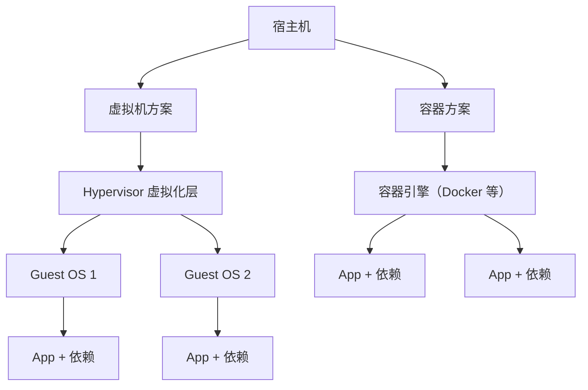
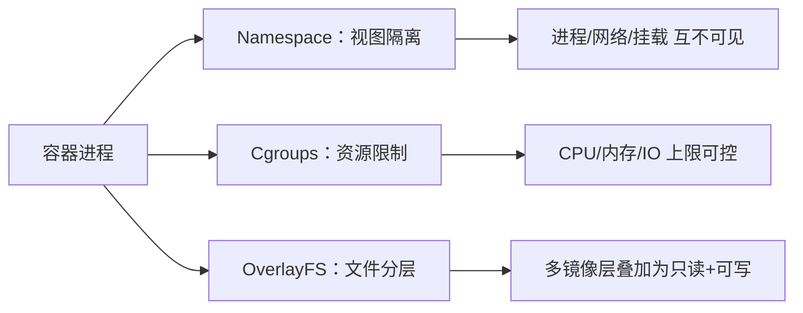
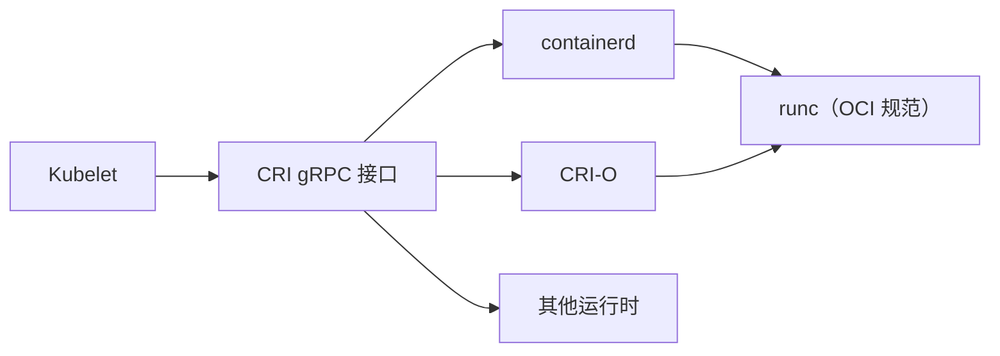

# 容器化技术与虚拟机对比

## 0. 引言

部署应用的演进史，本质上是一部"环境隔离"与"资源利用"的博弈史：物理机时代资源浪费严重，虚拟机时代隔离彻底但开销巨大，容器时代则在两者之间找到了平衡点。**容器不是更轻的虚拟机，而是基于操作系统内核特性的进程级隔离方案**——理解这一本质区别，是后续学习 Dockerfile、镜像分层与编排的基础。

本章将从部署形态的演进出发，对比容器与虚拟机的核心差异，拆解容器的三大底层支柱（Namespace、Cgroups、OverlayFS），并梳理 Docker 运行时从 Dockershim 走向 CRI 的演进脉络与选型建议。

---

## 1. 部署形态演进：从物理机到容器

### 1.1 四个阶段的递进

| 阶段 | 隔离粒度 | 资源密度 | 启动速度 | 典型问题 |
|------|----------|----------|----------|----------|
| 物理机 | 无隔离 | 单应用独占 | 分钟级 | 资源浪费、环境冲突 |
| 虚拟机 | 虚拟硬件 | 单虚机多应用 | 分钟级 | 占用大、启动慢 |
| 容器 | 进程级 | 单机数百容器 | 秒级 | 隔离弱于虚拟机 |
| Serverless | 函数级 | 极致弹性 | 毫秒级 | 冷启动与厂商绑定 |

虚拟机通过 Hypervisor 虚拟化**硬件**，每个虚机内部运行完整操作系统（Guest OS），占据数 GB 内存；容器则直接共享宿主机内核，只隔离**进程的视图**，开销以 MB 计。

### 1.2 虚拟机时代的两大痛点

- **资源空转**：虚机内操作系统、系统服务、依赖库层层冗余，CPU 与内存利用率低；
- **交付鸿沟**：同一应用在开发、测试、生产环境依赖库版本不一致，出现"我机器上能跑"的经典问题。

容器的价值恰恰在于：**把应用连同其运行环境一起打包交付**，从根源上消除环境差异。

---

## 2. 容器与虚拟机的核心差异

### 2.1 架构对比

虚拟机多一层 Hypervisor 与 Guest OS，容器则直接调度宿主机内核资源。

### 2.2 关键维度对比表

| 维度 | 虚拟机 | 容器 |
|------|--------|------|
| 隔离层级 | 硬件级（完整 Guest OS） | 进程级（Namespace/Cgroups） |
| 内核 | 独立内核 | 共享宿主机内核 |
| 镜像大小 | GB 级（含 OS） | MB 级（仅应用+依赖） |
| 启动时间 | 分钟级 | 秒级 |
| 单机密度 | 个位数 | 数百个 |
| 资源开销 | 高（虚机常驻） | 低（进程级） |
| 安全边界 | 强（硬件隔离） | 弱（内核共享） |
| 迁移性 | 虚机镜像，跨平台一般 | 镜像随处运行，生态统一 |

### 2.3 性能差异

- **CPU/内存**：容器无虚拟化损耗，接近原生性能；虚机有 Hypervisor 与设备模拟开销；
- **磁盘 IO**：旧式虚拟化磁盘 IO 损耗明显，容器共享宿主文件系统，配合 OverlayFS 分层后 IO 表现更好；
- **网络**：虚机走虚拟网桥/vNIC，容器走 veth 对 + 网桥，延迟均低，但容器方案更轻量。

> **一句话总结**：虚拟机隔离的是"机器"，容器隔离的是"进程视图"；前者防的是内核级风险，后者追求的是密度与速度。

---

## 3. 容器的三大底层支柱

### 3.1 Namespace：看到的隔离

Namespace 让容器内的进程"看不见"宿主机的进程、网络、文件系统等资源视图：

| Namespace | 隔离内容 | 作用 |
|-----------|----------|------|
| PID | 进程编号 | 容器内进程从 1 开始，看不到宿主进程 |
| Mount | 挂载点 | 容器拥有独立的文件系统视图 |
| Network | 网络栈 | 独立 IP、端口、路由 |
| UTS | 主机名 | 独立 hostname |
| IPC | 进程间通信 | 独立消息队列/共享内存 |
| User | 用户 ID | 容器内 root 与宿主 root 解耦 |

### 3.2 Cgroups：资源的限制

Cgroups（Control Groups）负责**限制与统计**资源用量：容器可设置 CPU 份额、内存上限、IO 带宽，防止单个容器耗尽宿主机资源拖垮其他进程。

### 3.3 OverlayFS：文件的分层

镜像由多层只读层叠加而成，容器启动时在最上层增加一个可写层，写操作走 Copy-on-Write（写时复制）机制：

- 多个容器共享同一份镜像只读层，**磁盘占用极小**；
- 容器删除后仅丢弃可写层，镜像本身不受影响；
- 分层结构让镜像构建可以增量缓存，是 Dockerfile 缓存机制的基础。

---

## 4. 容器运行时演进：从 Dockershim 到 CRI

### 4.1 演进时间线

Kubernetes 早期直接调用 Docker 的 Dockershim 适配层；随着容器运行时生态多样化，K8s 定义了标准接口 **CRI（Container Runtime Interface）**：

### 4.2 演进的关键节点

| 时间 | 事件 | 影响 |
|------|------|------|
| 2016 | Kubernetes 1.5 引入 CRI | 运行时接口标准化 |
| 2017 | Docker 拆出 containerd 捐给 CNCF | 轻量运行时独立发展 |
| 2020 | K8s 1.20 宣布弃用 Dockershim | 生态转向 containerd/CRI-O |
| 2021 | K8s 1.24 移除 Dockershim | Docker 不再直接作为 K8s 运行时 |

> 对普通开发者而言，**Docker CLI 与 Docker 引擎依旧可用**，变化只发生在 K8s 集群内部如何与容器运行时交互的层面。

### 4.3 运行时选型建议

- **单机开发/CI**：Docker Engine 最成熟，生态工具链最全；
- **K8s 生产集群**：containerd 为默认首选，轻量且稳定；
- **安全敏感场景**：可叠加 gVisor、Kata Containers 等沙箱运行时增强隔离。

---

## 5. 选型建议：容器还是虚拟机？

| 场景 | 推荐 | 理由 |
|------|------|------|
| Web 应用、微服务、CI/CD | 容器 | 交付一致、密度高、启动快 |
| 多租户强隔离、异质 OS 需求 | 虚拟机 | 内核级隔离更安全 |
| 混合部署 | 两者共存 | 容器跑应用、虚机做边界 |
| 本地开发环境 | 容器 | 一条命令拉起整套依赖 |

现实生产环境往往是"**虚机兜底 + 容器承载**"的组合：虚机提供租户边界，容器承载业务负载。

---

## 6. 小结

- **容器是进程级隔离**：基于 Namespace（视图）、Cgroups（资源）、OverlayFS（文件）三大机制，并非轻量虚拟机；
- **交付一致性**：镜像打包应用与运行环境，消除环境差异，启动秒级、密度数百；
- **运行时标准化**：Docker 从 K8s 唯一运行时退位为 CRI 生态中的工具链一环，containerd 成为生产默认；
- **选型理性化**：隔离需求高用虚拟机，密度与交付效率优先用容器，两者可组合使用。

下一章讲解 Docker 的安装步骤与三大核心概念——镜像、容器、仓库。