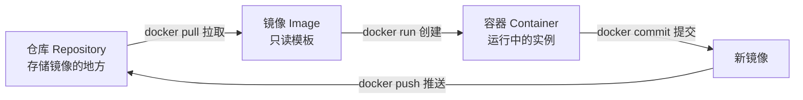
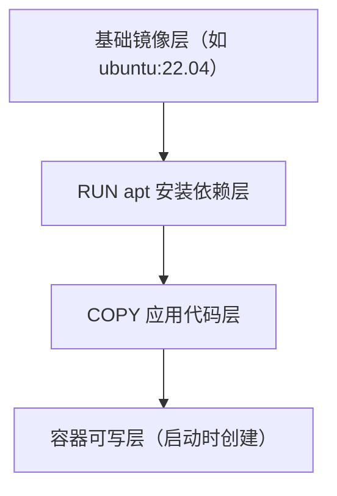

# Docker 安装与核心概念详解

## 0. 引言

使用 Docker 之前，先要理解它的三个核心概念：**镜像（Image）、容器（Container）、仓库（Repository）**。三者构成一个闭环：从仓库拉取镜像，由镜像创建容器，容器运行后提交为新的镜像，再推送回仓库。本章将从安装出发，逐一拆解这三个概念，并深入镜像的分层存储原理——这是理解 Dockerfile 缓存与镜像瘦身的前提。

---

## 1. 安装 Docker

### 1.1 Linux 快速安装

官方提供一键脚本，适用于绝大多数 Linux 发行版（截至 2026-09，Docker Engine 稳定版本线为 29.x）：

```bash
curl -fsSL https://get.docker.com | bash
```

安装完成后启动服务并验证：

```bash
systemctl enable --now docker
docker version        # 查看 Client 与 Server 版本
docker run hello-world   # 拉取测试镜像验证守护进程
```

### 1.2 安装后的三项配置

| 配置项 | 说明 |
|--------|------|
| 用户组授权 | `usermod -aG docker $USER`，让普通用户免 sudo 执行 docker（需重新登录） |
| 镜像加速 | 配置 `/etc/docker/daemon.json` 的 registry-mirrors，加速国内拉取 |
| 开机自启 | `systemctl enable docker`，生产环境按需决定 |

> 国产服务器（阿里云、腾讯云等）通常自带镜像加速地址，按云厂商文档配置即可。

### 1.3 macOS 与 Windows

- **macOS**：安装 Docker Desktop（基于虚拟机运行 Linux 内核），配置里可调内存与 CPU 配额；
- **Windows**：Docker Desktop 依赖 WSL2，需在控制面板启用"适用于 Linux 的 Windows 子系统"；
- 两者均内置 Docker Compose，无需单独安装。

---

## 2. 三大核心概念

### 2.1 概念闭环



### 2.2 镜像与容器：类与实例

- **镜像**是只读模板，包含操作系统层、运行环境与应用代码，相当于"类"；
- **容器**是镜像的运行实例，可启动、停止、删除，相当于"对象"；
- 一个镜像可以同时创建多个互不影响的容器。

### 2.3 仓库：镜像的中转站

| 仓库 | 说明 |
|------|------|
| Docker Hub | 官方公共仓库，默认拉取源 |
| 私有仓库 | Harbor、Registry、云厂商镜像仓库 |
| 命名规则 | `仓库地址/命名空间/镜像名:标签`，如 `registry.example.com/team/app:v1.0` |

---

## 3. 镜像分层存储

### 3.1 分层结构

镜像由多个**只读层**叠加而成，每一层对应 Dockerfile 中的一条指令：



### 3.2 写时复制（Copy-on-Write）

- 容器启动时在最上层叠加**可写层**，对文件的修改先复制到可写层再写入；
- 删除容器即丢弃可写层，**镜像保持不变**；
- 多个容器共享底层只读层，磁盘占用极小。

### 3.3 分层带来的工程收益

- **拉取加速**：只下载本地缺失的层，相同基础镜像的多个项目共享缓存；
- **构建加速**：Dockerfile 中未变化的层直接命中缓存，改动越靠后构建越快；
- **体积可控**：合理分层（如依赖层与应用层分离）是镜像瘦身的基本功。

---

## 4. 容器生命周期管理

### 4.1 核心命令

| 命令 | 作用 |
|------|------|
| `docker run -d --name web 11-Nginx基础概述` | 后台运行新容器 |
| `docker ps` / `docker ps -a` | 查看运行中/全部容器 |
| `docker exec -it web bash` | 进入容器执行命令 |
| `docker logs -f web` | 实时查看日志 |
| `docker stop` / `docker start` | 停止 / 启动 |
| `docker rm` | 删除容器（需先停止） |
| `docker rmi` | 删除镜像 |

### 4.2 run 的常用参数

```bash
# -p：端口映射（宿主机:容器）；-v：数据卷持久化
# -e：环境变量；--restart：异常退出自动重启
docker run -d \
  --name mysql-db \
  -p 3306:3306 \
  -v mysql_data:/var/lib/mysql \
  -e MYSQL_ROOT_PASSWORD=secret \
  --restart=always \
  mysql:8.0
```

### 4.3 数据持久化三兄弟

| 方式 | 说明 | 适用 |
|------|------|------|
| 命名卷（volume） | Docker 管理，`docker volume ls` 可见 | 数据库等核心数据 |
| 绑定挂载（bind mount） | 挂载宿主机目录，`./conf:/etc/11-Nginx基础概述/conf.d` | 配置文件热更新 |
| tmpfs | 仅内存，重启即失 | 临时缓存 |

---

## 5. 小结

- **安装**：Linux 一键脚本 + 用户组授权 + 镜像加速是标准三步；
- **三大概念**：镜像（只读模板）→ 容器（运行实例）→ 仓库（分发中转），pull/run/commit/push 构成闭环；
- **分层存储**：只读层 + 可写层 + 写时复制机制，带来缓存共享与镜像瘦身空间；
- **生命周期**：run/exec/logs/stop/rm 是日常最高频命令，数据持久化优先使用命名卷。

下一章介绍 Docker 图形化管理工具——Portainer 与 lazydocker，让容器管理告别黑屏命令行。