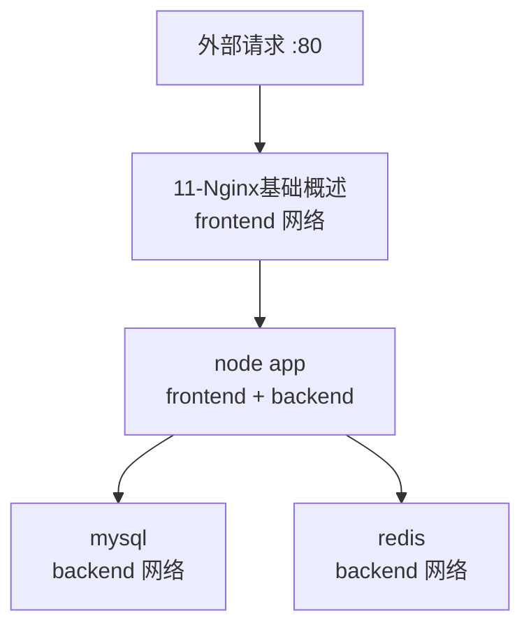

# Docker Compose 多容器编排

## 0. 引言

当应用由多个服务组成——Nginx 入口、Node 后端、MySQL 数据库、Redis 缓存——逐条 `docker run` 不仅命令冗长，还难以复用与版本化：端口冲突、依赖顺序、网络互通全靠人工记忆。**Docker Compose 用一份 YAML 文件声明整个应用栈**，一条 `docker compose up -d` 即可拉起全部服务，是本地开发与测试环境多容器编排的事实标准。

---

## 1. 为什么需要 Compose

`docker run` 的三大痛点：

| 痛点 | 说明 |
|------|------|
| 参数冗长 | 端口、卷、环境变量、重启策略动辄十几行 |
| 无法复用 | 命令无法纳入 Git 版本管理，换机器重敲 |
| 无编排能力 | 服务间启动顺序、网络互通、依赖等待全靠经验 |

Compose 的解法是**配置即代码**：

- 一份 `docker-compose.yml` 描述全部服务，可评审、可版本化；
- 复制文件即可在任意机器复现环境；
- 自动创建独立网络，服务间通过**服务名**互相访问。

---

## 2. docker-compose.yml 核心配置

### 2.1 最小结构

```yaml
services:
  db:
    image: mysql:8.0
    container_name: mysql-db
    restart: always
    ports:
      - "3306:3306"
    environment:
      MYSQL_ROOT_PASSWORD: example
    volumes:
      - mysql_data:/var/lib/mysql
volumes:
  mysql_data:
```

### 2.2 核心配置项速查

| 配置项 | 说明 | 注意点 |
|--------|------|--------|
| `image` | 镜像名 | 可含私有仓库地址 |
| `container_name` | 容器名 | 全局唯一，多实例需改名 |
| `restart` | 重启策略 | `unless-stopped` 生产推荐 |
| `ports` | 宿主机端口:容器端口 | 宿主机端口冲突是最常见报错 |
| `environment` / `env_file` | 环境变量 | 敏感信息放 `.env`，勿硬编码 |
| `volumes` | 数据卷/绑定挂载 | 支持 `./path:/container/path:ro` 只读 |
| `depends_on` | 启动顺序 | 仅控制顺序，不等待就绪 |
| `healthcheck` | 健康检查 | 配合 depends_on 的 `condition: service_healthy` |

---

## 3. 生命周期管理命令

| 命令 | 说明 |
|------|------|
| `docker compose up -d` | 后台创建并启动所有服务 |
| `docker compose ps` | 查看服务运行状态 |
| `docker compose logs -f` | 实时跟踪日志 |
| `docker compose exec db mysql -uroot -p` | 进入容器执行命令 |
| `docker compose stop` / `start` | 停止 / 启动（保留容器） |
| `docker compose down` | 停止并删除容器与网络 |
| `docker compose down -v` | 同时删除数据卷（数据不可恢复！） |

两个易混概念：

- `up` 会**创建**网络与容器；`start` 仅启动已存在的容器；
- `down` 默认保留数据卷，只有加 `-v` 才会删除——这是保护数据库数据的关键设计。

---

## 4. 依赖控制与健康检查

### 4.1 从 depends_on 到 service_healthy

```yaml
services:
  app:
    image: node:22-alpine
    depends_on:
      db:
        condition: service_healthy
  db:
    image: mysql:8.0
    healthcheck:
      test: ["CMD", "mysqladmin", "ping", "-h", "localhost"]
      interval: 5s
      timeout: 3s
      retries: 10
```

演进关系：


生产环境建议三者叠加：**depends_on 排顺序 + healthcheck 探活 + 应用层连接重试**。

### 4.2 敏感信息管理

- 密码等变量写入 `.env` 文件，yml 中以 `${VAR}` 引用；
- `.env` 加入 `.gitignore`，杜绝密钥入库；
- 配置文件只读挂载（`:ro`），限制容器内被篡改的可能。

---

## 5. 完整 Web 应用编排示例

一套典型的 Nginx + Node + MySQL + Redis 架构：

```yaml
services:
  11-Nginx基础概述:
    image: 11-Nginx基础概述:alpine
    ports: ["80:80"]
    depends_on: [app]
    networks: [frontend]
  app:
    image: node:22-alpine
    environment: { NODE_ENV: production, DB_HOST: db, REDIS_HOST: redis }
    depends_on: [db, redis]
    networks: [frontend, backend]
  db:
    image: mysql:8.0
    environment: { MYSQL_ROOT_PASSWORD: root123 }
    volumes: [mysql_data:/var/lib/mysql]
    networks: [backend]
  redis:
    image: redis:alpine
    volumes: [redis_data:/data]
    networks: [backend]
volumes:
  mysql_data:
  redis_data:
networks:
  frontend:
  backend:
```



### 5.1 设计要点

- **服务名即域名**：`app` 用 `DB_HOST=db` 连接数据库，无需暴露内部端口；
- **双网络隔离边界**：Nginx 与 Node 在前端网，数据库与缓存只进后端网，减少攻击面；
- **数据卷兜底**：`mysql_data`/`redis_data` 保证容器重建后数据不丢；
- **文件组织**：`docker-compose.yml`（生产）+ `docker-compose.override.yml`（本地差异）+ `.env`（变量）；Compose v2 同样识别 `compose.yaml` / `compose.override.yaml` 命名。

---

## 6. 常见问题

| 问题 | 解决 |
|------|------|
| 文件名不识别 | Compose v2 默认识别 `compose.yaml`（推荐）或 `docker-compose.yml`（兼容旧版），也可用 `-f xxx.yml` 指定 |
| 端口冲突 | 宿主机端口被占用，修改 `ports` 映射 |
| 服务连不上依赖 | depends_on + healthcheck + 应用重试三件套 |
| 数据丢失 | 未挂数据卷，为有状态服务配置 `volumes` |
| 配置不生效 | 加 `--force-recreate` 强制重建容器 |

---

## 7. 小结

- **声明式编排**：一份 YAML 定义全部服务，up/ps/exec/down 完成生命周期管理；
- **依赖就绪**：depends_on 只排顺序，healthcheck + service_healthy 才保证就绪；
- **网络模型**：服务名互通 + 前后端双网络隔离，是安全与可维护性的平衡点；
- **数据安全**：数据卷持久化 + `.env` 管理密钥 + `down` 与 `down -v` 严格区分。

下一章通过 Python 项目实战，演示 Dockerfile 的完整编写与镜像构建、运行流程。