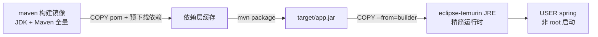

# Docker 镜像与部署（Java）

## 0. 引言

Docker 的核心价值，是把"应用运行所需环境"与"应用本身"一起打包，从而提升交付一致性。对 Java 项目来说，它解决的是本地、测试、生产三套环境不一致的老大难问题。但 Java 项目的容器化有一层独特复杂性：**构建需要完整 JDK 与 Maven，运行只需要精简 JRE**，若不分层处理，镜像动辄一两个 GB。本章给出 Java 项目 Docker 化的标准姿势：多阶段构建 + 精简运行时 + 非 root 用户 + JVM 参数适配。

---

## 1. 多阶段构建：构建与运行分离

### 1.1 为什么需要多阶段构建

- **构建环境**：需要 Maven + JDK 完整工具链，体积数 GB；
- **运行环境**：只需要 JRE 与打包产物 jar，几十 MB 即可；
- 单阶段构建会把 Maven 依赖、编译缓存全部带进镜像，**又大又不安全**。

多阶段构建把两个阶段写进同一个 Dockerfile：第一阶段产出 jar，第二阶段只拷贝 jar 与精简 JRE。

### 1.2 标准 Dockerfile 示例

```dockerfile
# 阶段一：构建
FROM maven:3.9.9-eclipse-temurin-21 AS builder
WORKDIR /workspace
COPY pom.xml .
# 预下载依赖，利用层缓存
RUN mvn -B dependency:go-offline
COPY src ./src
RUN mvn -B -DskipTests package

# 阶段二：运行
FROM eclipse-temurin:21-jre
WORKDIR /app
# 创建非 root 用户
RUN useradd -r -u 1001 spring
COPY --from=builder /workspace/target/*.jar app.jar
# 切换非 root 运行
USER spring
EXPOSE 8080
ENTRYPOINT ["java", "-jar", "/app/app.jar"]
```



### 1.3 关键设计点

| 设计 | 原因 |
|------|------|
| `COPY pom.xml` 与 `COPY src` 分开 | 依赖变更频率远低于源码，最大化层缓存命中 |
| `dependency:go-offline` | 构建阶段预下载依赖，避免每次全量解析 |
| `COPY --from=builder` | 只拷贝产物，构建工具链不进运行镜像 |
| `USER spring` | 非 root 运行，降低容器逃逸风险 |

---

## 2. 镜像瘦身三板斧

### 2.1 基础镜像选择

| 基础镜像 | 体积 | 适用 |
|----------|------|------|
| `eclipse-temurin:21-jre` | 中等 | 生产默认，兼容性好 |
| `eclipse-temurin:21-jre-alpine` | 最小 | 极致瘦身，需注意 musl 兼容性 |
| `amazoncorretto` / `liberica` | 中等 | 厂商定制 JDK 场景 |

### 2.2 .dockerignore

```dockerfile
# .dockerignore
.git
target
*.iml
.idea
```

排除源码、测试依赖与本地构建缓存，避免构建上下文臃肿与敏感文件误入镜像。

### 2.3 层合并与裁剪

- 构建命令合并：`RUN apt-get update && apt-get install -y xxx && apt-get clean`，减少中间层；
- 清理工具链：构建阶段结束后删除不需要的缓存目录；
- 使用 `jlink` 裁剪 JDK 模块（高级方案）：只保留运行所需模块，可再瘦身上百 MB。

---

## 3. 容器化后的 JVM 参数适配

### 3.1 内存参数

容器共享宿主机内核，JVM 默认按宿主机物理内存计算堆大小，**必须显式限制**：

```bash
ENTRYPOINT ["java", "-XX:MaxRAMPercentage=75", "-Xms256m", "-jar", "/app/app.jar"]
```

- `-XX:MaxRAMPercentage=75`：按容器内存限额的 75% 分配堆，适配 cgroup 限制；
- 避免硬编码 `-Xmx4g`，否则容器限额调整后需要同步改参数。

### 3.2 其他生产必备参数

| 参数 | 作用 |
|------|------|
| `-XX:+UseContainerSupport` | JDK 10+ 默认开启，确保识别容器限额 |
| `-XX:+HeapDumpOnOutOfMemoryError` | OOM 时自动 dump，配合挂载卷收集 |
| `-XX:HeapDumpPath=/dumps` | 指定 dump 落盘目录（需挂卷） |
| `-Djava.security.egd=file:/dev/./urandom` | 规避低熵环境下 TLS 握手卡顿 |

---

## 4. 常见误区与排查

### 4.1 误区清单

- **镜像包含源码与构建缓存**：jar 镜像里躺着 pom.xml 和 target 目录，体积失控；
- **写死数据库账号密码**：环境变量或 Secret 注入，勿进镜像层；
- **启动脚本过度复杂**：入口脚本越长越难排障，默认 `java -jar` 即可；
- **以为"用了 Docker 等于会部署"**：忽略了日志收集、健康检查与资源限制三件事。

### 4.2 排障三板斧

```bash
docker build --progress=plain .   # 查看构建全过程输出
docker run --rm --entrypoint sh app.jar  # 覆盖入口进容器排查
docker history <镜像ID>           # 逐层检查镜像内容
```

---

## 5. 小结

- **多阶段构建**：构建与运行分离，`COPY --from=builder` 只带产物，镜像从 GB 级降到百 MB 级；
- **安全基线**：非 root 用户 + `.dockerignore` + 密钥不落地；
- **JVM 适配**：`MaxRAMPercentage` 拥抱容器限额，OOM dump 落卷可排查；
- **工程闭环**：镜像瘦身是持续优化，配合 CI 流水线做镜像构建与安全扫描。

下一章讲解 Node.js 项目的 Docker 部署实践，对照 Java 方案理解不同语言生态的容器化差异。