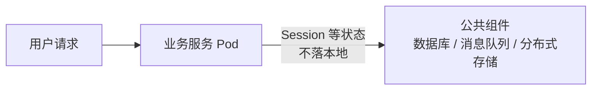
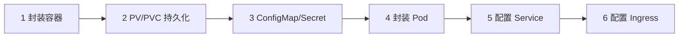

# 服务向 Kubernetes 容器平台迁移必须了解的事情

## 0. 引言

把一套跑在虚拟机或裸机上的传统服务迁上 Kubernetes，绝不是"打个镜像、建个 Deployment"这么简单。K8s 的调度模型会**随时迁移、销毁、重建 Pod**，这直接冲击传统部署的三大假设：数据存在本地、日志留在本机、出了故障可以登录排查。本章分两个模块：先梳理迁移前必须解决的五大问题（有状态数据、日志收集、Java OOM 排查、配置管理、资源自适应），再给出从容器化到 Ingress 的通用迁移六步骤。

---

## 1. 迁移前必须关注的问题

### 1.1 程序中有状态的内容：无状态化

传统服务常把状态存在本地：用户登录的 Session 数据保存在业务节点内存中。迁移到 K8s 后，Pod 会被弹性扩缩与重新调度，**新 Pod 无法读取旧 Pod 上的本地数据**，原 Pod 一销毁，数据随之丢失。


解法是**本地无状态化**：请求到达业务服务后，把有状态信息写入公共组件——数据库、消息队列或分布式存储，业务节点自身不再保存任何必须持久的状态。



### 1.2 业务日志收集：从 Rsyslog 到 EFK

传统 Linux 环境用 Syslog 协议 + Rsyslog 收集日志，收集节点**固定**。而 K8s 中容器日志会随 Pod 飘移，节点上的日志路径动态增减，固定节点收集模式失效。


K8s 场景的标准方案是 **EFK**：

| 组件 | 角色 |
|------|------|
| Elasticsearch | 日志存储与检索引擎 |
| Filebeat | 节点侧日志采集器，支持路径通配 |
| Kibana | 日志可视化界面 |


关键差异在采集端：Filebeat 通过 **PVC 挂载**把容器日志目录落到 node 节点本地，并支持通配 `*.log`、`<namespace>`、`<workload-name>` 等路径模式，无需关心具体日志文件，天然适配 K8s 的弹性调度。

### 1.3 Java 内存溢出排查：Pod 销毁前的取证

K8s 会自动销毁故障 Pod，内存溢出后**无法登录容器分析**——这是容器化 Java 服务最常见的排查痛点。解决思路是"提前把证据落到 Pod 之外"：

1. 为容器挂载 node 节点存储空间的 **PVC**；
2. JVM 配置 `-XX:HeapDumpOnOutOfMemoryError -XX:HeapDumpPath=<共享路径>`；
3. OOM 时堆 dump 自动写入共享盘，Pod 销毁后仍可拉取，用 MAT 等工具离线分析。

> 同理，业务日志也应通过 PVC 或 Filebeat 及时外置，避免"人走茶凉"。

### 1.4 配置文件管理：ConfigMap 与 Secret

应用配置在 K8s 中统一交给两类对象管理（两者同一套存储机制，Secret 以 Base64 编码存储——注意 Base64 只是编码而非加密，需配合 RBAC、etcd 静态加密等手段保障安全）：

| 对象 | 适用内容 | 示例 |
|------|----------|------|
| ConfigMap | 普通配置文件 | 数据库主机名、端口、库名等初始化配置 |
| Secret | 敏感信息 | 数据库口令、用户名、密码、Token |

以 MySQL 为例：连接主机、端口、库名写入 ConfigMap，账号密码写入 Secret，两者以 key-value 形式注入容器，容器启动时生成初始化配置。

### 1.5 开发库配置自适应：JVM 感知容器限额

OpenJDK 10+ 的 JVM 默认支持容器感知（8u191+ 已回移），可自动检测容器资源并动态限制自身堆大小，配置：

```bash
-XX:+UseContainerSupport -XX:MaxRAMPercentage=75
```

JVM 会根据容器 cgroup 限额自适应设置堆与栈，不再需要为每个环境硬编码 `-Xmx` 固定值——这是容器化 Java 服务的标配参数。

---

## 2. 通用迁移六步骤



### 步骤一：封装应用容器


镜像自底向上三层：**OS 层**（CentOS/Ubuntu/Alpine，Alpine 最小）→ **环境层**（Java 服务依赖 OpenJDK、Tomcat 等）→ **代码层**。整体打包为容器镜像。

### 步骤二：PV/PVC 持久化数据


容器内都是临时数据，Pod 重启即丢。用户上传的图片、多程序共享的数据文件、日志文件，都要通过 **PV（存储资源）+ PVC（使用声明）** 持久化到容器外部存储。

### 步骤三：ConfigMap/Secret 配置

应用配置以 key-value 形式注入容器：普通配置走 ConfigMap，敏感信息走 Secret（如 1.4 节所述）。

### 步骤四：封装 Pod


封装 Pod 要考虑三点：

- **多副本**：避免单 Pod 故障，Deployment 保证副本数与滚动更新；
- **健康检查**：提前定义 Liveness（存活）与 Readiness（就绪）探针，让 K8s 准确判断 Pod 状态；
- **耦合性**：通常一 Pod 一容器，但耦合紧密的业务（如业务进程 + 本地缓存）可双容器共享同一 Namespace。

同时按业务形态选择 Controller：Deployment（无状态）、StatefulSet（有状态）、DaemonSet（节点级）、Job/CronJob（任务型）。

### 步骤五：配置 Service


Service 把一组 Pod 抽象为稳定访问对象：集群内部通过 **Service Name** 通信，Pod IP 变化不影响调用方。

### 步骤六：配置 Ingress


Ingress 负责把内部服务暴露到集群外部，承担 7 层反向代理与负载均衡职责，是公网访问的入口网关。

---

## 3. 小结

- **五大迁移问题**：状态数据无状态化（落到公共组件）、日志收集切换 EFK（Filebeat 通配 + PVC 挂载）、Java OOM 提前 dump 到共享盘、配置统一 ConfigMap/Secret、JVM 用容器感知参数自适应限额；
- **六步迁移法**：容器化 → 持久化 → 配置注入 → Pod 封装（副本/探针/Controller）→ Service 抽象 → Ingress 暴露；
- **核心思维**：一切可能随 Pod 消失的东西（数据、日志、内存证据）都必须提前外置，是 K8s 迁移的设计主线。

下一章进入 Git 版本控制模块，从版本控制系统的核心概念讲起，理解分布式版本控制的设计。