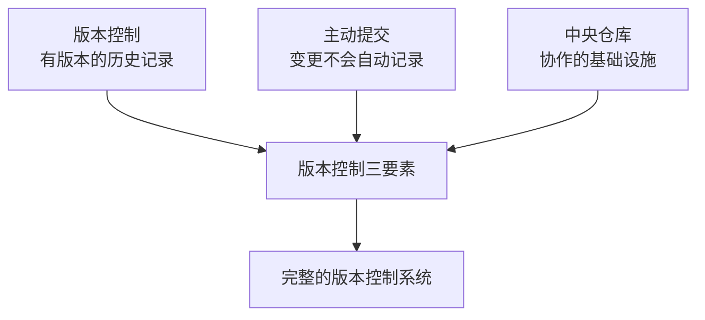
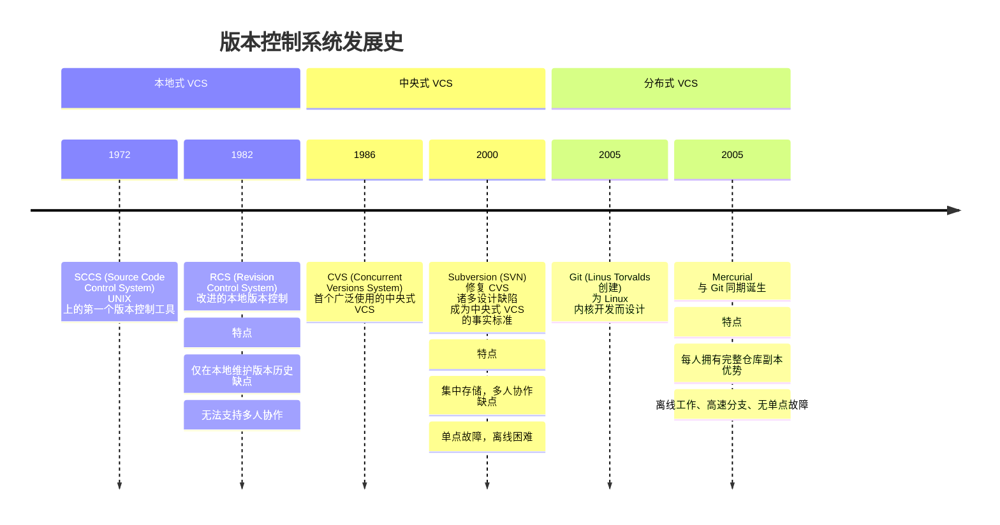
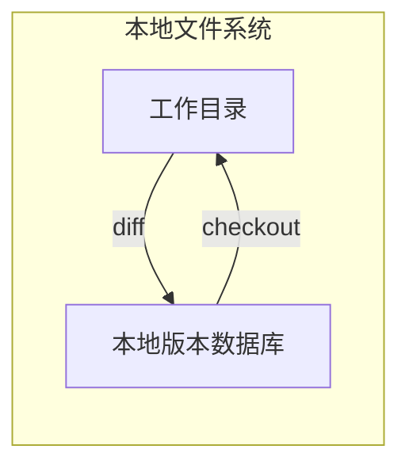
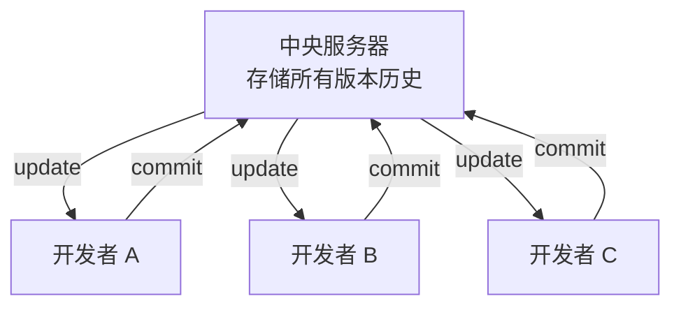
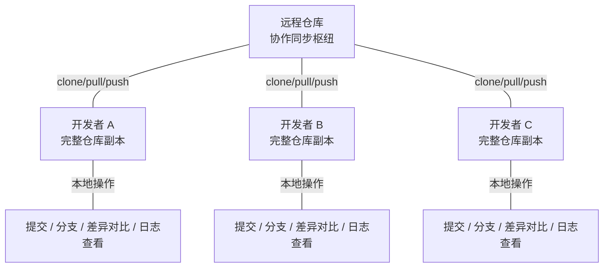
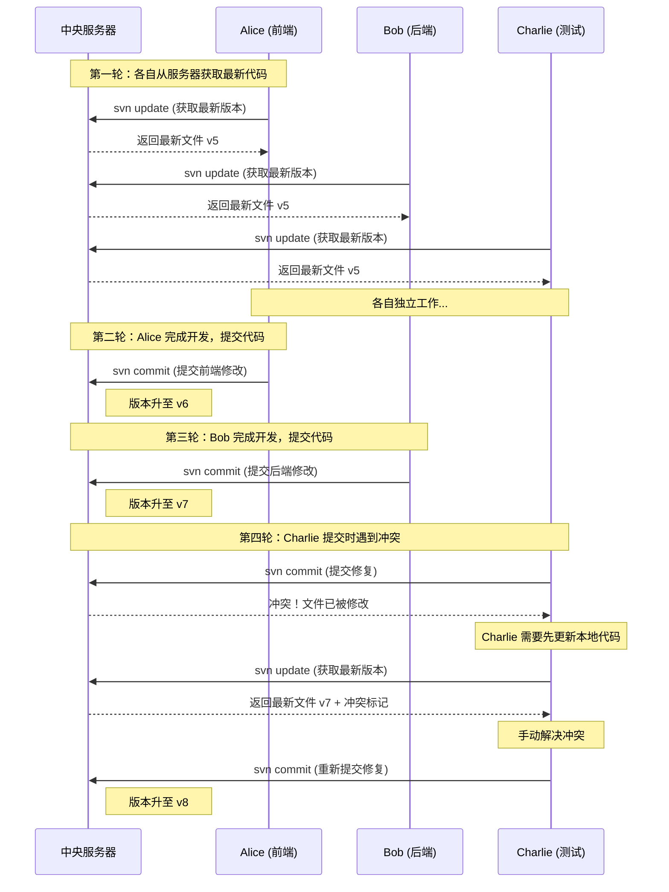
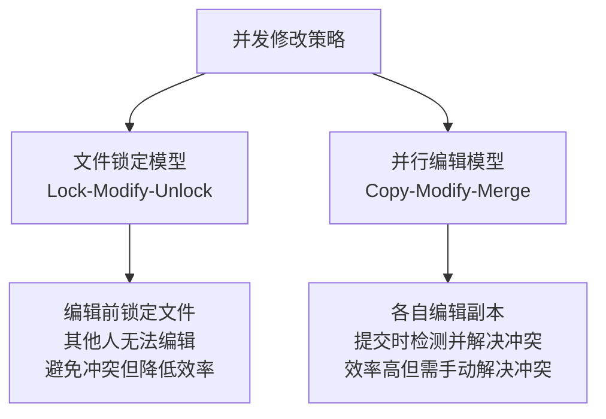
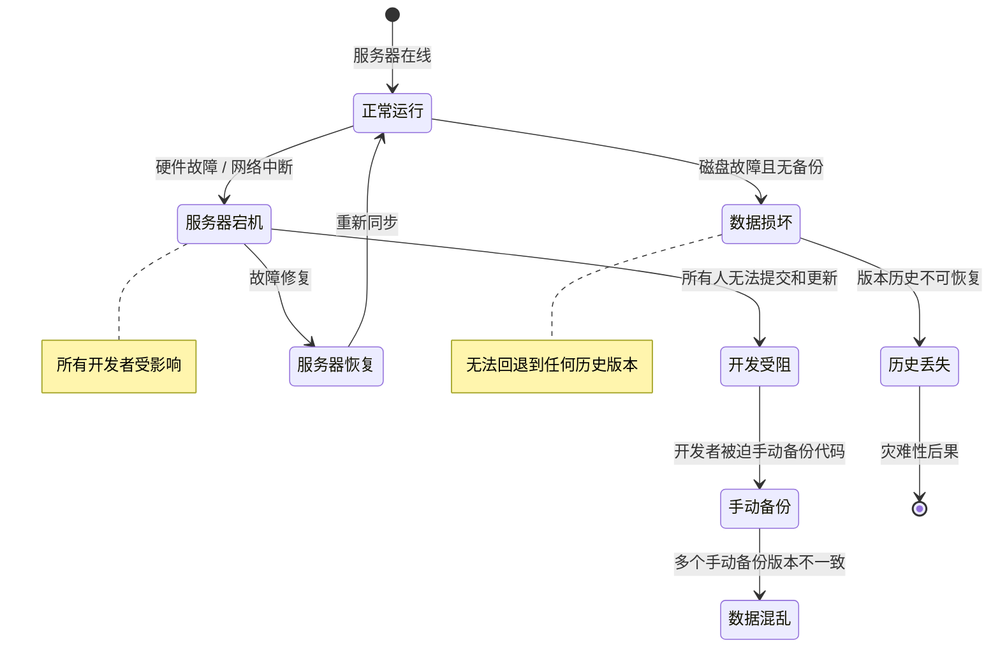

# 什么是版本控制系统

## 定义与核心功能

版本控制系统（Version Control System，简称 VCS）是一种记录文件内容变化，以便将来查阅特定版本修订情况的系统。它的本质是**对变更的管理**——不仅仅是"保存"，而是让每一次变更都可追溯、可回退、可协作。

在最基本的层面上，VCS 解决的核心问题是：**如何安全地、有序地管理文件的演进历史，并在多人协作时保持一致性。**

一个成熟的版本控制系统通常具备以下核心功能：

| 核心功能 | 说明 |
|---------|------|
| **变更记录** | 记录每一次文件修改的内容、时间、作者及变更说明 |
| **版本回退** | 能够将文件恢复到任意历史版本的状态 |
| **差异比较** | 对比不同版本之间的具体变化内容 |
| **分支管理** | 支持从主线开发中分出独立的工作线，互不干扰 |
| **合并集成** | 将不同分支的工作成果合并到一起 |
| **冲突检测与解决** | 当多人修改同一处内容时，识别冲突并提供解决机制 |
| **协作同步** | 多人之间共享和同步最新的工作成果 |
| **历史审计** | 完整的变更日志，支持溯源与追责 |

> **思考题**：如果没有版本控制系统，一个 10 人团队共同维护一个项目时，最可能出现的灾难性场景是什么？

---

## 版本控制三要素

理解版本控制系统，关键在于理解它的三个基本要素。这三个要素缺一不可，共同构成了版本控制的理论基础。

### 1. 版本控制——有版本的历史记录

"版本控制"这个词本身就说明了一切：系统必须维护一份**有版本的**历史记录。

这意味着文件不是简单地被"覆盖保存"，而是每一次修改都被完整地记录下来，形成一条有向的历史时间线。你可以将任何一个历史节点检出来查看，也可以从任何一个历史节点重新出发。

```
v1 ──→ v2 ──→ v3 ──→ v4 ──→ v5 (当前)
```

与之相对的是**无版本控制的保存**——每次保存都是覆盖式的，历史信息丢失，无法回退。这在个人项目中尚可通过手动备份弥补，但在团队协作中则是不可接受的。

### 2. 主动提交——变更不会自动记录

版本控制系统不会自动记录你的每一次文件修改。你必须**主动发起提交（commit）**，告诉系统"请把当前的变更记录下来"。

这个设计看似增加了操作负担，实则是深思熟虑的结果：

- **提交是原子操作**：一次提交应该是一个逻辑上完整的变更，而不是零散的修改碎片。主动提交让你有机会把相关的修改组织在一起。
- **提交附带元信息**：每次提交时，你通常会附加一条提交信息（commit message），说明这次修改做了什么、为什么做。这是未来回溯历史时的重要线索。
- **提交是检查点**：每次提交相当于创建一个可以回退的安全节点。如果后续修改出了问题，你可以精确地回到上一次提交的状态。

```
# 错误理解：VCS 会自动追踪所有文件变化
文件修改 → 自动记录 

# 正确理解：VCS 只在你主动提交时记录
文件修改 → 暂存(staging) → 主动提交(commit) → 记录到版本历史 
```

### 3. 中央仓库——协作的基础设施

中央仓库（Repository）是所有版本历史的**权威存储中心**，也是多人协作时的**同步枢纽**。

- 对于**中央式 VCS**（如 SVN），中央仓库是唯一的版本历史存储地，所有操作都必须与中央仓库交互。
- 对于**分布式 VCS**（如 Git），每个开发者都有一个完整的仓库副本，但仍然需要一个共享的远程仓库来作为协作的中转站。

中央仓库的存在保证了：**团队中所有成员最终都指向同一个权威的版本历史**，避免了各自为政导致的混乱。

### 三要素的关系



三要素之间的关系可以总结为：

- **版本控制**提供的是能力——能够记录和回退历史
- **主动提交**提供的是精度——确保每次记录都是有意义的
- **中央仓库**提供的是秩序——确保所有人在同一个版本体系中协作

缺少任何一个要素，系统都无法有效地支撑团队协作开发：

| 缺少的要素 | 后果 |
|-----------|------|
| 缺少版本控制 | 无法回退历史，无法对比差异，变更不可追溯 |
| 缺少主动提交 | 版本历史充满噪音，每次按键都被记录，无法形成有意义的检查点 |
| 缺少中央仓库 | 每个人各自维护自己的版本，无法保证一致性，协作无从谈起 |

---

## VCS 发展史

版本控制系统并非一蹴而就，它经历了几十年的演进，每个阶段的系统形态都是对前一代不足的回应。理解这段历史，有助于我们更深刻地理解 Git 为何被设计成今天这个样子。



### 第一代：本地式 VCS

本地式 VCS 的核心思想非常简单：**在本地机器上维护一个数据库，记录文件的变更差异（delta）**。



典型代表是 RCS（Revision Control System）。它的工作方式是：

1. 在项目目录下创建一个 `RCS/` 子目录
2. 每次提交时，计算当前版本与前一版本的差异（delta）
3. 将差异以反向补丁的形式存储（即"从当前版本如何回到前一版本"）
4. 回退时，从最新版本开始，依次应用反向补丁

**本地式 VCS 的根本局限**在于：它只能管理本地的文件版本，天然不具备多人协作的能力。当另一个开发者需要你的代码时，你只能手动拷贝文件——而手动拷贝恰恰是版本控制要解决的问题。

### 第二代：中央式 VCS

中央式 VCS 的出现，正是为了解决本地式 VCS 无法协作的问题。它的核心改进是引入了**中央服务器**，所有版本历史集中存储，所有开发者与中央服务器交互。



典型代表是 CVS 和 Subversion（SVN）。关于它们的工作模型，我们将在下一节详细展开。

### 第三代：分布式 VCS

分布式 VCS 对中央式 VCS 做了一次根本性的架构变革：**每个开发者的本地不再只是一个工作副本，而是一个完整的仓库（repository），包含全部的版本历史**。



这意味着：提交、分支、差异比较、日志查看等操作全部在本地完成，不需要网络连接。只有在需要与他人同步时，才需要与远程仓库交互。

Git 是分布式 VCS 最典型的代表，也是当今软件行业的事实标准。关于 Git 的深入原理，我们将在后续章节详细展开。

---

## 中央式 VCS 的工作模型

为了直观理解中央式 VCS 的运作方式，我们用一个三人团队协作的场景来说明。

### 场景设定

- **中央服务器**：运行 SVN 服务，维护项目的权威版本历史
- **开发者 Alice**：负责前端功能开发
- **开发者 Bob**：负责后端 API 开发
- **开发者 Charlie**：负责测试与 Bug 修复


### 工作流程



### 关键步骤解析

**1. 更新（Update）**

在开始工作前，开发者必须先从中央服务器获取最新版本。这是中央式 VCS 的铁律——如果你不是在最新版本上工作，你的修改很可能与他人的工作产生冲突。

**2. 修改（Modify）**

开发者在本地修改文件。此时，这些修改仅存在于本地，中央服务器和其他开发者完全不知道。

**3. 提交（Commit）**

修改完成后，开发者将变更提交到中央服务器。这里有一个关键点：**提交前，通常要求先执行一次更新操作**，确保本地是基于最新版本的修改。如果本地版本落后于服务器版本，提交会被拒绝。

**4. 冲突解决（Conflict Resolution）**

当两个开发者修改了同一个文件的同一处内容时，后提交的人会遇到冲突。此时必须先更新本地代码、手动解决冲突后，才能再次提交。

### 文件锁定模型 vs 并行编辑模型

中央式 VCS 在处理并发修改时，有两种典型策略：



- **文件锁定模型（Lock-Modify-Unlock）**：早期的版本控制工具（如 Visual SourceSafe、PVCS）采用这种方式。编辑前必须先"锁定"文件，获得独占编辑权；编辑完成后"解锁"，其他人才能编辑。这种方式简单粗暴地避免了冲突，但严重降低了团队并行开发的效率——如果 Alice 长时间锁定了一个文件，Bob 和 Charlie 只能等待。

- **并行编辑模型（Copy-Modify-Merge）**：CVS 和 SVN 默认采用这种方式。所有人都可以同时编辑任何文件，提交时由系统检测冲突，有冲突则要求手动解决。这种方式效率更高，但要求团队有良好的沟通和冲突解决能力。

> 现代 VCS 普遍采用并行编辑模型，Git 也不例外。

---

## 中央式 VCS 的优缺点

### 优点

| 优点 | 说明 |
|------|------|
| **概念模型简单** | 中央仓库 = 唯一的版本历史来源，学习成本低 |
| **权限控制容易** | 所有操作经过中央服务器，便于实施细粒度的访问控制 |
| **目录级操作支持** | SVN 支持对目录进行版本控制，可以追踪目录的重命名、移动等操作 |
| **大文件处理** | SVN 对大型二进制文件的处理相对高效，不需要每个开发者都保存完整历史 |
| **集中审计** | 所有操作日志集中存储在服务器上，审计和合规需求容易满足 |
| **适合线性开发** | 对于不需要复杂分支的工作流，中央式 VCS 简单直接 |

### 缺点

| 缺点 | 说明 |
|------|------|
| **单点故障** | 中央服务器宕机 = 全员无法提交、无法协作。如果服务器数据损坏且无备份，所有历史记录丢失 |
| **严重依赖网络** | 几乎所有操作（提交、更新、日志查看、差异比较）都需要与服务器通信。网络不稳定时，开发体验极差 |
| **分支操作笨重** | SVN 的分支本质上是目录拷贝，创建慢、切换慢、合并更慢。这直接导致开发者不愿使用分支 |
| **离线工作困难** | 没有网络连接时，几乎无法做任何版本控制操作。出差、通勤等场景下开发效率骤降 |
| **性能瓶颈** | 所有请求集中到一台服务器，团队规模增长时服务器压力增大，响应变慢 |
| **提交粒度受限** | 一次提交涉及的所有文件变更要么全部成功、要么全部失败，难以实现跨仓库的原子提交 |

### 单点故障——最致命的问题

中央式 VCS 的所有缺点中，**单点故障**是最致命的。我们可以用一个状态图来直观理解：



正是单点故障这一根本性缺陷，催生了分布式 VCS 的诞生。在分布式 VCS 中，每个开发者都持有完整的仓库副本，即使中央服务器彻底失效，任何一个开发者的本地仓库都可以用来恢复整个项目。

---

## 小结

版本控制系统是现代软件开发的基础设施，它围绕三个核心要素构建：

1. **版本控制**——维护有版本的历史记录，而非简单的覆盖保存
2. **主动提交**——变更不会自动记录，每次提交都是一个有意义的检查点
3. **中央仓库**——协作的权威来源和同步枢纽

从发展历程看，VCS 经历了三个阶段：

| 阶段 | 代表工具 | 核心架构 | 核心优势 | 核心缺陷 |
|------|---------|---------|---------|---------|
| 本地式 | SCCS, RCS | 本地版本数据库 | 简单轻量 | 无法协作 |
| 中央式 | CVS, SVN | 集中式服务器 | 支持多人协作 | 单点故障，依赖网络 |
| 分布式 | Git, Mercurial | 分布式完整副本 | 离线工作，无单点故障 | 概念模型更复杂 |

中央式 VCS 解决了本地式的协作问题，但引入了单点故障和网络依赖的致命缺陷。分布式 VCS——以 Git 为代表——通过让每个开发者持有完整的仓库副本，从根本上解决了这些问题。

在下一篇文章中，我们将深入了解分布式版本控制系统，理解以 Git 为代表的 DVCS 是如何解决这些问题的。

