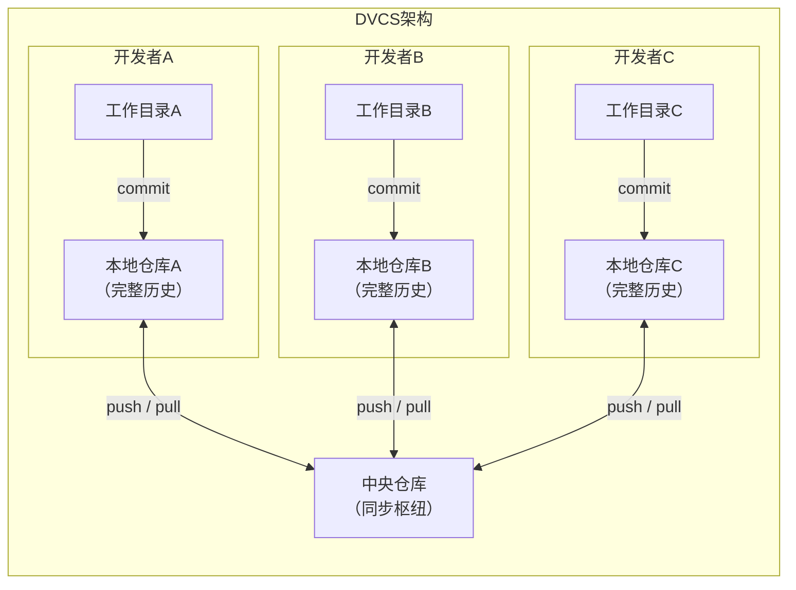
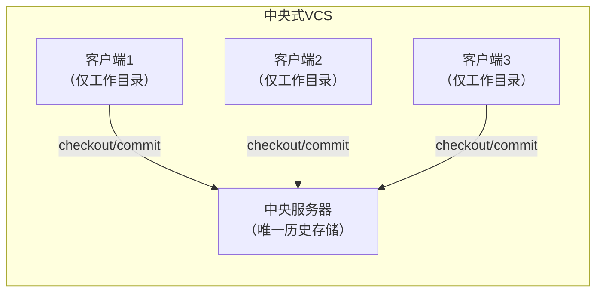
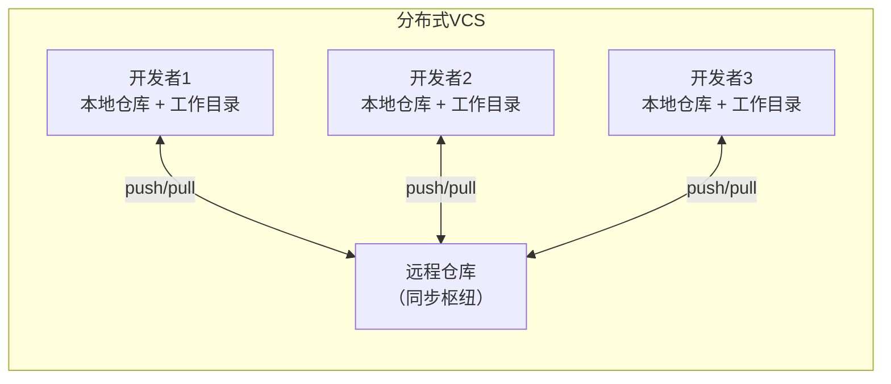
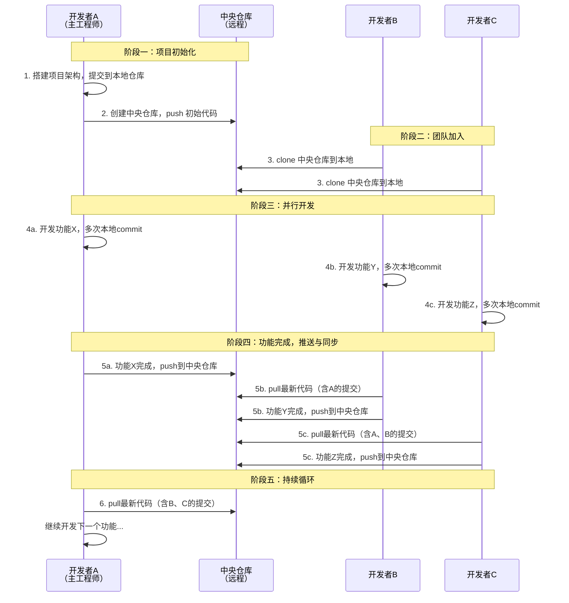
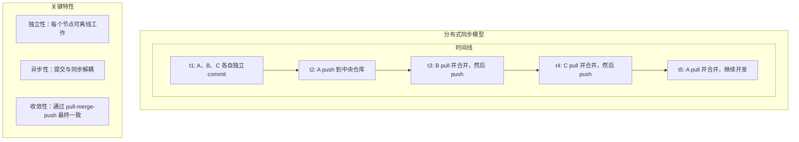
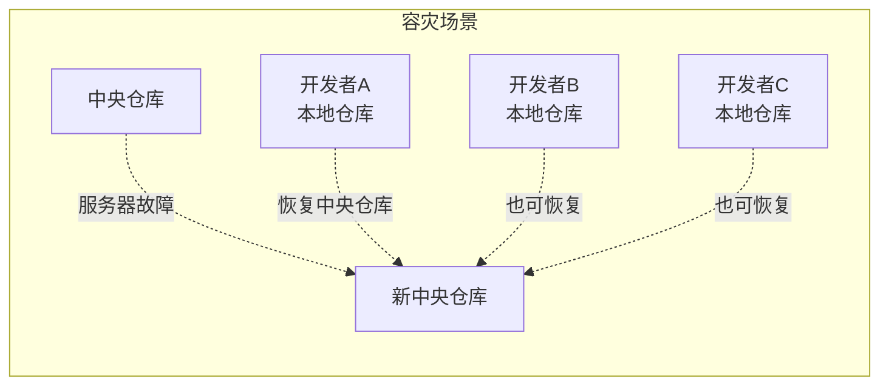

# 分布式版本控制系统

在上一节中，我们了解了版本控制系统（VCS）的基本概念以及中央式 VCS 的工作模型。本节将深入探讨版本控制领域的重大范式转变——分布式版本控制系统（Distributed Version Control System，DVCS），并剖析其架构原理、工作模型以及与中央式 VCS 的本质区别。

## 分布式 VCS 的定义

分布式版本控制系统的核心思想是：**每个开发者的机器上都拥有完整的仓库副本，包括全部的版本历史**。这与中央式 VCS 形成了根本性的差异——在中央式 VCS 中，版本历史仅保存在中央服务器上，开发者本地只有工作目录中的当前文件快照。

在 DVCS 的架构中，存在两种仓库角色：

- **本地仓库（Local Repository）**：存在于每个开发者的机器上，保存了项目的完整版本历史。开发者可以在本地独立完成 commit、branch、merge、log、diff 等几乎所有版本控制操作，无需与任何远程服务器通信。
- **中央仓库（Remote Repository）**：部署在服务器上（如 GitHub、GitLab、Bitbucket），主要承担团队间代码同步的中转站角色。它同样保存了完整的版本历史，但其核心职责已从"唯一的历史存储中心"转变为"协作同步枢纽"。

关键认知：中央式 VCS 的中央仓库同时承担**保存版本历史**和**同步团队代码**两大职责；而在 DVCS 中，保存版本历史的职责被分散到了每个开发者的本地仓库，中央仓库的主要任务简化为**同步团队代码**。中央仓库虽然也保存历史版本，但这份历史更多是作为团队协作的同步基准。

## DVCS vs 中央式 VCS 的核心区别

理解分布式与中央式的区别，不能仅停留在"多了一个本地仓库"的表面，而应从架构模型、数据存储、操作模式、网络依赖等多个维度进行系统对比。

### 架构模型对比

### 多维度对比表

| 维度 | 中央式 VCS | 分布式 VCS |
|------|-----------|-----------|
| **历史存储** | 仅中央服务器保存完整历史 | 每个节点都保存完整历史 |
| **网络依赖** | 几乎所有操作都需要联网 | 大多数操作在本地完成，仅同步时需联网 |
| **提交方式** | commit 即上传到中央服务器 | commit 到本地，push 才上传到远程 |
| **单点故障** | 中央服务器故障则全员无法工作 | 中央服务器故障不影响本地开发 |
| **分支操作** | 通常较慢，需与服务器交互 | 极快，纯本地操作 |
| **离线工作** | 基本不可能 | 完全支持 commit、branch、merge、log 等 |
| **首次克隆** | 较快（仅获取最新快照） | 较慢（获取全部历史） |
| **本地存储** | 较小（仅工作目录） | 较大（完整历史 + 工作目录） |
| **权限控制** | 天然支持路径级权限控制 | 需额外工具实现细粒度权限 |
| **学习曲线** | 相对简单 | 概念较多，曲线较陡 |

### 核心差异的本质

中央式 VCS 的 commit 操作是一个**原子性的网络操作**——提交即上传，两者不可分割。而 DVCS 将"提交"和"上传"解耦为两个独立操作：

- **commit**：将改动记录到本地仓库的历史中
- **push**：将本地仓库的提交上传到远程仓库

这种解耦带来了深远的影响：开发者可以按照自己的节奏频繁地创建细粒度的本地提交，而不必每次提交都考虑"这个改动是否足够完整到可以展示给团队"。只有当一个功能或一组改动真正完成时，才需要 push 到远程仓库与团队共享。

## 分布式 VCS 工作模型

### 三人团队场景

假设一个三人团队（开发者 A、B、C）使用分布式 VCS 协作开发，其工作流程如下：

### 工作流程详解

**阶段一：项目初始化**

主工程师 A 独立搭建项目架构，并将代码提交到本地仓库。随后在服务器上创建中央仓库，将本地提交 push 上去。此时中央仓库成为团队的唯一同步基准。

**阶段二：团队加入**

开发者 B 和 C 分别从中央仓库 clone 项目到本地。clone 操作不仅获取了最新的文件，还复制了完整的版本历史。从此刻起，三人各自拥有独立的本地仓库，开始并行开发。

**阶段三：并行开发**

三人各自独立负责一个功能。在开发过程中，每个人将每一步改动 commit 到本地仓库。由于本地 commit 无需立即上传，每次提交不必是一个完整功能，而可以是功能中的一个步骤或逻辑块。这种细粒度提交使得代码的 review 和回溯更加容易。

**阶段四：推送与同步**

当某人完成功能开发后，他将相关提交 push 到中央仓库。其他人在 push 之前需要先 pull 最新代码并与本地代码合并，确保本地包含远程的所有提交后才能成功 push。如果出现冲突，则需要在本地解决冲突后再推送。

**阶段五：持续循环**

上述过程持续循环，形成"开发 → commit → pull → merge → push"的协作节奏。

### 与中央式 VCS 工作模型的对比

分布式 VCS 的工作模型与中央式 VCS 看似相似，但存在一个关键区别：**提交与上传的解耦**。在中央式 VCS 中，commit 就是上传，开发者必须联网才能记录改动；而在 DVCS 中，commit 是本地操作，push 才是网络操作，两者可以独立进行。

> 这只是分布式 VCS 最基本的工作模型。实际开发中会涉及分支管理、代码审查、冲突解决等更复杂的场景，但这个核心模型是理解一切高级工作流的基础。

## DVCS 的优点与缺点

### 优点

**1. 离线工作能力**

大多数操作在本地完成，无需联网即可 commit、查看历史、创建分支、合并代码、比较差异等。这极大地减小了开发者的网络条件和物理位置限制——你可以在飞机上提交代码、在地铁上切换分支、在无网络的环境中完成整个功能的开发。

**2. 细粒度提交**

由于 commit 是本地操作，无需考虑"这个改动是否适合展示给团队"，开发者可以按照逻辑步骤频繁提交，而不是将大量改动打包成一个粗粒度的提交。细粒度提交带来的好处包括：

- 更容易进行 code review（每个提交的改动范围小、逻辑清晰）
- 更精确的回溯能力（可以定位到具体哪一步引入了问题）
- 更安全的实验（每一步都有检查点，随时可以回退）

**3. 操作速度**

本地操作不涉及网络通信，速度远快于需要与远程服务器交互的中央式 VCS。Git 的 commit、diff、log、branch 等操作通常在毫秒级完成，而 SVN 等中央式 VCS 的对应操作往往需要数秒甚至更长时间。

**4. 数据安全性**

每个开发者的本地仓库都是完整的历史副本，这意味着即使中央服务器发生故障，也可以从任意一个本地仓库恢复全部历史。这天然地实现了数据的冗余备份，消除了中央式 VCS 的单点故障风险。

**5. 灵活的协作模式**

DVCS 不强制要求所有协作都通过中央仓库进行。开发者之间可以直接交换提交（例如通过 `git send-email`、patch 文件或直接添加对方的仓库为 remote），这在开源社区和特殊网络环境中非常有用。

**6. 强大的分支与合并能力**

由于分支是本地操作，DVCS（尤其是 Git）鼓励频繁使用分支。创建和切换分支的成本极低，使得 Feature Branching、Topic Branch 等工作流成为可能，而这类工作流在中央式 VCS 中往往因操作成本过高而难以实施。

### 缺点

**1. 首次克隆耗时**

由于 clone 操作需要复制完整的版本历史，对于历史悠久的仓库，首次克隆可能非常耗时。而中央式 VCS 的 checkout 仅获取最新快照，速度更快。

**2. 本地存储占用**

每个本地仓库都保存完整历史，存储占用高于中央式 VCS。对于大多数代码项目，由于文本文件的可压缩性，这个问题并不严重。但对于包含大量二进制文件的项目（如游戏开发中的美术资源），仓库体积可能非常庞大。

**3. 权限控制困难**

DVCS 的设计哲学是"每个人拥有完整历史"，这与细粒度的路径级权限控制天然矛盾。在中央式 VCS 中，可以轻松控制某个目录只有特定人员可读写；而在 DVCS 中，clone 就意味着获取全部内容，需要借助 Gitolite、Gerrit 等外部工具或平台级功能来实现权限管理。

**4. 学习曲线陡峭**

DVCS 的概念模型比中央式 VCS 复杂得多。本地仓库与远程仓库的分离、commit 与 push 的解耦、merge 与 rebase 的选择、工作区/暂存区/仓库的三层结构——这些概念对初学者构成了较高的认知门槛。

**5. 大文件与二进制文件处理不佳**

Git 等主流 DVCS 对大文件和频繁变动的二进制文件处理效率较低。虽然 Git LFS（Large File Storage）等扩展方案可以缓解这一问题，但本质上仍是补丁方案，不如中央式 VCS 的原生支持来得自然。

> 对于一般的程序项目而言，由于项目的大多数内容都是文本形式的代码，工程的体积通常不大，再加上文本内容自身的特点，VCS 可以利用算法极大地压缩仓库体积。因此，Git 等分布式 VCS 的仓库体积并不大，初次克隆的耗时和本地存储占用都很小，"尺寸大、初次下载慢"的问题并不严重。
>
> 不过也有一些例外，比如游戏开发。游戏的开发中有大量的大尺寸数据和媒体文件，并且这些文件的格式也不容易压缩，如果用分布式 VCS 会导致仓库体积非常庞大。所以一些大型游戏的开发会选择中央式的 VCS 来管理代码。

## Git 与其他版本控制系统的对比

### Git vs SVN vs Mercurial vs Bazaar

| 特性 | Git | SVN (Subversion) | Mercurial (Hg) | Bazaar (Bzr) |
|------|-----|-------------------|----------------|--------------|
| **架构** | 分布式 | 中央式 | 分布式 | 分布式 |
| **首创年份** | 2005 | 2000 | 2005 | 2005 |
| **创始者** | Linus Torvalds | CollabNet | Matt Mackall | Canonical |
| **开发语言** | C | C | Python | Python |
| **性能（大仓库）** | 优秀 | 中等 | 良好 | 较差 |
| **分支模型** | 轻量级，极快 | 目录级分支，较慢 | 轻量级，快 | 轻量级，快 |
| **学习曲线** | 陡峭 | 平缓 | 中等 | 中等 |
| **Windows 支持** | 良好 | 优秀 | 优秀 | 优秀 |
| **大文件支持** | 需 Git LFS | 原生支持 | 需扩展 | 原生支持 |
| **权限控制** | 需外部工具 | 原生路径级权限 | 需外部工具 | 需外部工具 |
| **社区活跃度** | 极高 | 中等 | 低（已趋停滞） | 极低（已停止维护） |
| **GitHub/GitLab 支持** | 原生 | 部分支持 | 无（Bitbucket 已于 2020 年移除支持） | 无 |
| **部分检出** | sparse-checkout | 原生支持 | 不支持 | 部分支持 |
| **空目录支持** | 不支持 | 支持 | 不支持 | 支持 |
| **提交原子性** | 单个提交原子 | 跨文件原子 | 单个提交原子 | 单个提交原子 |

### 深入对比分析

**Git 的独特优势**

Git 之所以能在版本控制领域占据主导地位，源于其独特的设计决策：

1. **内容寻址存储（Content-Addressable Storage）**：Git 的底层存储基于 SHA-1 哈希，每个对象由其内容决定唯一标识。这意味着相同内容只存储一份，天然支持去重和完整性校验。
2. **快照而非差异**：Git 记录的是每次提交的完整文件快照（对未修改的文件则引用上一次的快照），而非文件间的差异。这使得查看任意历史版本的速度几乎恒定，不受历史深度影响。
3. **极简的内部对象模型**：Git 仅有四种对象类型（blob、tree、commit、tag），却足以表达复杂的版本历史和分支结构。

**SVN 的持续价值**

尽管 DVCS 已成为主流，SVN 在以下场景中仍有其价值：

- 需要严格路径级权限控制的企业环境
- 管理大型二进制资源的项目（如游戏、影视制作）
- 需要部分检出（只获取仓库的某个子目录）的场景
- 遗留系统的维护

**Mercurial 的历史地位**

Mercurial 曾是 Git 的有力竞争者，尤其在 Python 社区和一些大型项目（如 Mozilla Firefox）中广泛使用。其设计哲学强调易用性和一致性，命令行接口比 Git 更规整。但随着 GitHub 的崛起和 Git 生态的爆发式增长，Mercurial 逐渐边缘化。Mozilla 自 2007 年起用 Mercurial 托管 Firefox，2023 年宣布迁移计划，并于 2025 年将 Firefox 开发正式迁移至 Git，这标志着 Mercurial 最后一个大型应用场景的终结。

**Bazaar 的兴衰**

Bazaar 由 Canonical 公司（Ubuntu 的母公司）开发，曾是 Ubuntu 项目的官方 VCS。其独特之处在于同时支持分布式和中央式工作流，且对 Windows 支持较好。但由于性能问题和社区萎缩，Bazaar 在 2016 年发布最后的 2.7 版本后便再无官方维护，社区其后以 Breezy 项目延续，Canonical 也已将 Ubuntu 的源码包托管迁移到了 Git。

## 分布式架构详解

### 仓库的内部结构

在 DVCS 中，每个本地仓库都是一个功能完整的版本控制节点。以 Git 为例，本地仓库的内部结构如下：

```mermaid
graph TB
    subgraph 本地仓库内部结构
        direction TB
        WD["工作目录<br/>（Working Directory）<br/>实际编辑的文件"]
        SA["暂存区<br/>（Staging Area / Index）<br/>下次提交的快照"]
        LR["本地仓库<br/>（Local Repository）<br/>所有提交的历史"]
        RR["远程仓库<br/>（Remote Repository）<br/>中央同步枢纽"]

        WD -->|"git add"| SA
        SA -->|"git commit"| LR
        LR -->|"git push"| RR
        RR -->|"git fetch / pull"| LR
        LR -->|"git checkout"| WD
        SA -.->|"git diff --staged"| LR
        WD -.->|"git diff"| SA
    end
```

### 分布式同步模型

DVCS 的同步模型基于"最终一致性"的思想——各个本地仓库可以独立演进，通过 push 和 pull 操作在需要时进行同步。这种模型的核心特征是：

### 数据流向与操作映射

| 操作 | 数据流向 | 网络需求 |
|------|---------|---------|
| `git add` | 工作目录 → 暂存区 | 无 |
| `git commit` | 暂存区 → 本地仓库 | 无 |
| `git push` | 本地仓库 → 远程仓库 | 需要 |
| `git fetch` | 远程仓库 → 本地仓库（远程分支） | 需要 |
| `git pull` | 远程仓库 → 本地仓库 → 工作目录 | 需要 |
| `git merge` | 本地仓库内分支合并 | 无 |
| `git rebase` | 本地仓库内提交重排 | 无 |
| `git checkout` | 本地仓库 → 工作目录 | 无 |
| `git log` | 读取本地仓库历史 | 无 |
| `git diff` | 比较工作目录/暂存区/仓库 | 无 |

从上表可以看出，Git 的日常开发中，绝大多数操作都是纯本地操作，只有 push、fetch、pull 涉及网络通信。这是 DVCS 相对于中央式 VCS 的核心优势之一。

### 分布式架构的容灾能力

在中央式 VCS 中，中央服务器故障意味着全员停工，且如果备份丢失则历史永久丢失。而在 DVCS 中，每个本地仓库都是完整的历史副本，任意一个本地仓库都可以用来恢复中央仓库。这种天然的冗余机制使得 DVCS 在数据安全性方面远优于中央式 VCS。

## 小结

分布式版本控制系统的核心思想是**将版本历史的存储从中央服务器分散到每个开发者的本地机器**，中央仓库的角色从"唯一的历史权威"转变为"团队协作的同步枢纽"。这一范式转变带来了以下关键变化：

1. **提交与上传解耦**：commit 是本地操作，push 是网络操作，两者独立进行，使得细粒度提交和离线工作成为可能。
2. **操作速度提升**：绝大多数操作在本地完成，无需网络通信，速度远快于中央式 VCS。
3. **数据安全性增强**：每个本地仓库都是完整的历史副本，消除了单点故障风险。
4. **协作灵活性**：不强制要求所有协作都通过中央仓库，支持点对点的提交交换。
5. **学习成本增加**：概念模型更复杂，本地仓库与远程仓库的分离、工作区/暂存区/仓库的三层结构等概念对初学者构成较高门槛。

Git 作为 DVCS 的代表，凭借其内容寻址存储、快照式版本记录、极简对象模型等设计决策，在性能、灵活性和社区生态方面全面超越了 SVN、Mercurial、Bazaar 等竞争者，成为当今最主流的版本控制系统。理解分布式架构的原理，是掌握 Git 的第一步，也是后续理解分支、合并、远程操作等高级主题的基础。

