# Git 对象模型

Git 的核心不是差异（delta），不是补丁（patch），而是一个**内容寻址文件系统**（content-addressable filesystem）。理解了 Git 的对象模型，你就掌握了 Git 最底层的运行逻辑——分支、合并、回退、远程协作，无一不是建立在这套对象体系之上的。

本章将从最底层的存储原语出发，逐层拆解 Git 的四种对象类型，并最终手动从零构建一次完整的提交，让你亲眼看到每一次 `git add` 和 `git commit` 背后究竟发生了什么。

---

## 1 内容寻址存储：Git 的哲学根基

### 1.1 什么是内容寻址

大多数文件系统是**按名寻址**的：你通过路径 `/src/main.c` 找到文件。路径变了，文件就"变"了——即使内容一模一样。

Git 采用了完全不同的策略：**按内容寻址**（content-addressable storage）。Git 不关心文件叫什么、放在哪里，它只关心文件**内容是什么**。给定一段内容，Git 用 SHA-1 哈希算法计算出一个 40 位十六进制指纹，这个指纹就是该内容在 Git 数据库中的"键"（key）。

```
内容 ──SHA-1──▶ 哈希值（键）
```

核心规则只有一条：

> **相同的内容，永远产生相同的哈希；不同的内容，永远产生不同的哈希。**

这意味着：

- 你在项目 A 和项目 B 中有完全相同的 `LICENSE` 文件——Git 只存一份。
- 你修改了文件中的一个字节——哈希彻底改变，Git 存为新对象，旧对象不受影响。
- 有人篡改了仓库中的某个对象——哈希对不上，立刻被检测到。

### 1.2 键值对数据库的本质

Git 的对象库（object database），本质上就是一个**键值对存储**：

| 键（Key）                     | 值（Value）              |
| ----------------------------- | ------------------------ |
| `e69de29bb2d1d6434b8b29ae7...` | 空文件的内容             |
| `b7aec520dec0a7516c18eb4c...` | `"Hello, Git\n"` 的内容  |
| `0e9b4d498f8c028c1f8c4b8e1...` | 一个 tree 对象的序列化数据 |
| `a1b2c3d4e5f6...`              | 一个 commit 对象的序列化数据 |

你可以把 Git 的 `.git/objects/` 目录想象成一个巨大的哈希表，键是 SHA-1 哈希，值是经过 zlib 压缩的二进制数据。

---

## 2 四种对象类型详解

Git 只有四种对象类型：**blob**、**tree**、**commit**、**tag**。这四种对象构成了 Git 表达一切版本信息的完整词汇表。

### 2.1 blob 对象：文件内容的快照

blob（Binary Large OBject）是 Git 中最基础的对象类型，它存储的是**文件的纯内容**——注意，仅仅是内容，不包含文件名，不包含权限，不包含任何元数据。

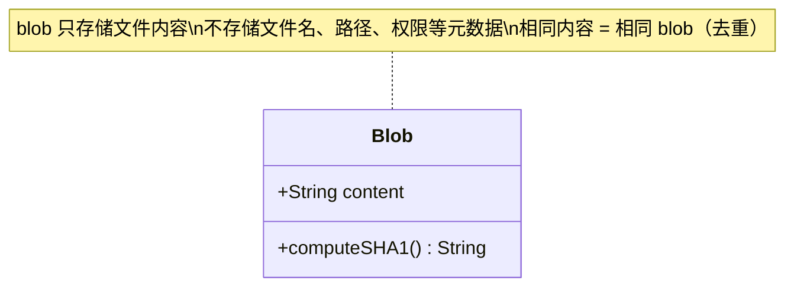

**关键特性：**

- **无文件名**：blob 不知道自己叫什么名字。文件名存储在 tree 对象中。
- **无权限**：blob 不记录可执行、只读等属性。权限也存储在 tree 对象中。
- **去重天然支持**：两个内容完全相同的文件，无论叫什么名字、在哪个目录下，都指向同一个 blob 对象。

**示例：**

假设你有一个文件 `hello.txt`，内容为 `Hello, Git\n`：

```
$ echo "Hello, Git" | git hash-object --stdin
b7aec520dec0a7516c18eb4c68b64ae1eb9b5a5e
```

这个 `b7aec520...` 就是该内容对应的 blob 对象的 SHA-1 哈希。无论你把这个内容放在哪个文件里，哈希值永远不变。

**blob 的存储格式（原始二进制）：**

```
blob 11\0Hello, Git\n
```

即：`类型 空格 大小 \0 内容`。Git 对这个头部+内容的整体计算 SHA-1，然后用 zlib 压缩后存入 `.git/objects/` 目录。

### 2.2 tree 对象：目录结构的映射

如果说 blob 是"文件内容"，那么 tree 就是"目录"。tree 对象存储的是一个**目录条目列表**，每个条目包含：

- **模式（mode）**：类似 Unix 文件权限，但 Git 只使用有限的几种模式
- **文件名（name）**：该条目在目录中的名字
- **对象引用（SHA-1）**：指向一个 blob（文件）或另一个 tree（子目录）

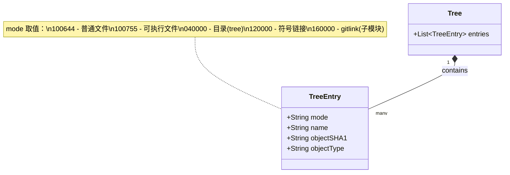

**一个 tree 对象的具体示例：**

假设项目根目录结构如下：

```
.
├── LICENSE
├── README.md
└── src/
    └── main.c
```

对应的 tree 对象内容（用 `git ls-tree` 查看）类似：

```
100644 blob e69de29bb2d1d6434b8b29ae775ad8c2e48c5391    LICENSE
100644 blob b7aec520dec0a7516c18eb4c68b64ae1eb9b5a5e    README.md
040000 tree 0e9b4d498f8c028c1f8c4b8e1a3b7c9d0f2e4a6b    src
```

其中 `src` 条目指向另一个 tree 对象，该 tree 对象又包含：

```
100644 blob a1b2c3d4e5f6789012345678901234567890abcd    main.c
```

**tree 的递归结构：**

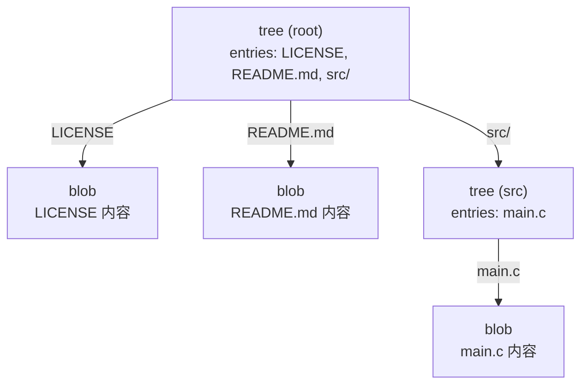

**关键特性：**

- tree 将**文件名和目录结构**与 blob 内容关联起来，弥补了 blob 不含文件名的"缺陷"。
- tree 可以引用 blob（文件）和其他 tree（子目录），形成树状递归结构。
- 一个 tree 对象完整地描述了**某一时刻某个目录的完整快照**。

### 2.3 commit 对象：快照的锚点

commit 对象是 Git 历史的基石。它不存储差异，而是存储一个**指向 tree 的引用**——即项目在某一时刻的完整快照。同时，它还记录了谁创建了这次快照、为什么创建、以及它的"前驱"是谁。

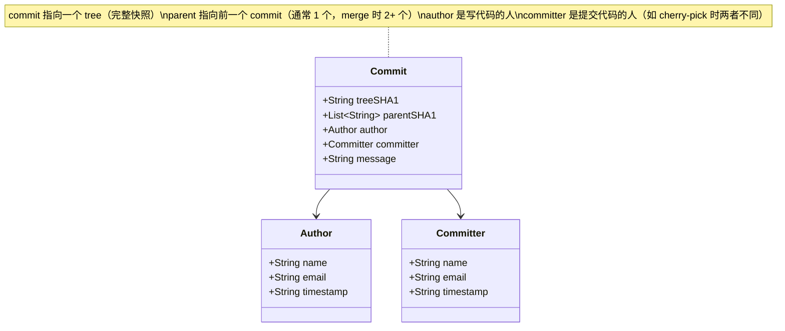

**一个 commit 对象的具体内容：**

```
tree 0e9b4d498f8c028c1f8c4b8e1a3b7c9d0f2e4a6b
parent a1b2c3d4e5f6789012345678901234567890abcd
author Zhang Zhengyang <zhang@example.com> 1700000000 +0800
committer Zhang Zhengyang <zhang@example.com> 1700000000 +0800

Add feature X to main module
```

**commit 链的形成：**

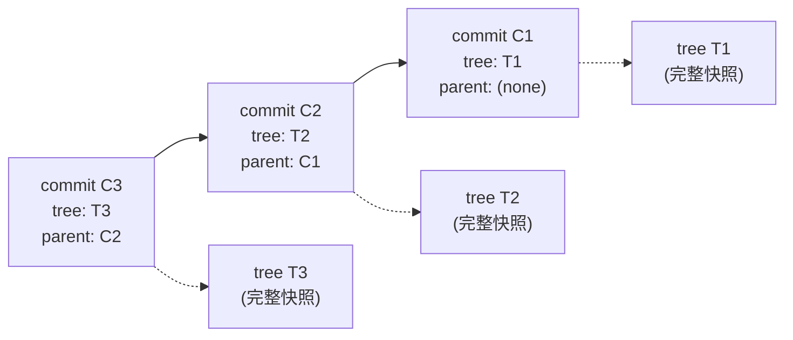

**关键特性：**

- **每个 commit 指向一个完整的 tree 快照**，而非差异。这意味着你可以直接从任何一个 commit 还原出完整的项目状态，无需回溯历史。
- **parent 字段构成历史链**：普通提交有一个 parent，合并提交（merge commit）有两个或更多 parent。
- **author 与 committer 可以不同**：author 是代码的原始编写者，committer 是实际执行提交操作的人。例如 `cherry-pick` 时，author 不变，committer 变为执行 cherry-pick 的人。
- **commit 本身也是不可变的**：一旦创建，其 SHA-1 哈希就固定了。修改任何字段（哪怕只是提交消息中的一个字符），都会产生一个全新的 commit 对象。


### 2.4 tag 对象：不可变的命名锚

Git 的标签分为两种：**轻量标签**（lightweight tag）和**标注标签**（annotated tag）。轻量标签只是一个指向 commit 的可变引用（类似分支），而标注标签则是一个真正的 Git 对象。

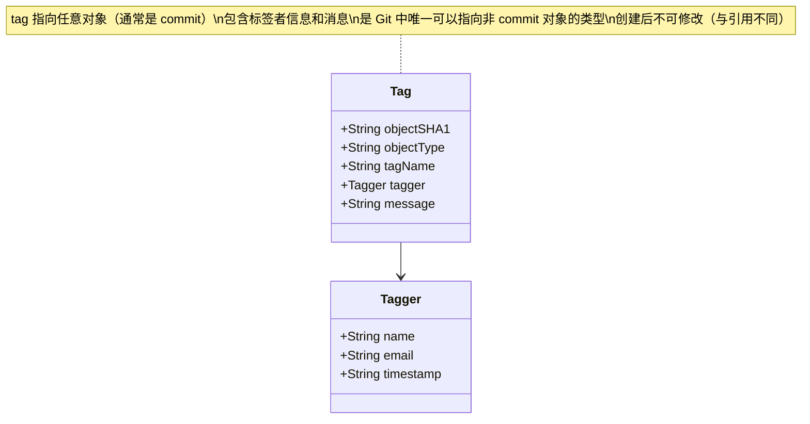

**一个 tag 对象的具体内容：**

```
object a1b2c3d4e5f6789012345678901234567890abcd
type commit
tag v1.0.0
tagger Zhang Zhengyang <zhang@example.com> 1700000000 +0800

Release version 1.0.0
```

**关键特性：**

- tag 通常指向 commit，但理论上可以指向任何 Git 对象（blob、tree、甚至另一个 tag）。
- 标注标签包含创建者信息（tagger）和消息，具有不可变性，适合发布版本标记。
- 轻量标签不是对象，只是一个引用文件（存储在 `.git/refs/tags/` 中），不包含额外元数据。

---

## 3 对象间引用关系的完整类图

四种对象类型通过 SHA-1 引用相互关联，形成如下引用关系：

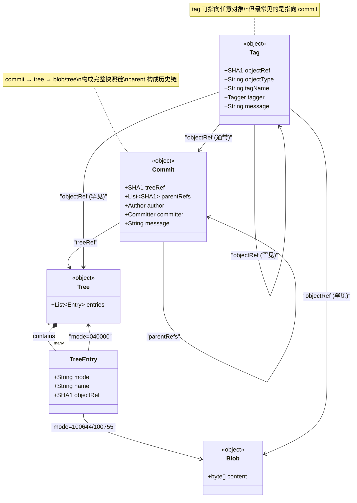

**引用链总结：**

| 引用方   | 被引用方         | 含义                       |
| -------- | ---------------- | -------------------------- |
| tree     | blob             | 目录中的文件               |
| tree     | tree             | 目录中的子目录             |
| commit   | tree             | 该提交的完整项目快照       |
| commit   | commit           | 父提交（历史链）           |
| tag      | commit（最常见） | 标签指向的提交             |
| tag      | blob/tree/tag    | 标签指向的其他对象（罕见） |

**注意**：blob 是引用链的末端——blob 不引用任何其他对象，它是纯粹的叶子节点。

---

## 4 手动构建一次提交：从零到完整快照

这是理解 Git 对象模型最有效的方式：不用 `git add`，不用 `git commit`，只用最底层的 plumbing 命令，从零手动构建一次完整的提交。

### 4.1 准备工作

```bash
# 创建一个空仓库
mkdir git-objects-demo && cd git-objects-demo
git init
```

此时 `.git/objects/` 目录为空，数据库中没有任何对象。

### 4.2 第一步：创建 blob 对象

使用 `git hash-object` 将文件内容存入对象库：

```bash
# 创建文件内容并生成 blob 对象
echo "Hello, Git" | git hash-object -w --stdin
# 输出：b7aec520dec0a7516c18eb4c68b64ae1eb9b5a5e

# 再创建一个 blob
echo "int main() { return 0; }" | git hash-object -w --stdin
# 输出：7b5f0f0c5e8c8e7a6d4b3c2d1e0f9a8b7c6d5e4f（示例，实际哈希取决于内容）
```

`-w` 标志告诉 Git 不仅计算哈希，还要将对象写入 `.git/objects/` 目录。验证一下：

```bash
# 查看对象库
find .git/objects -type f
# 输出：
# .git/objects/b7/aec520dec0a7516c18eb4c68b64ae1eb9b5a5e
# .git/objects/7b/5f0f0c5e8c8e7a6d4b3c2d1e0f9a8b7c6d5e4f

# 查看对象类型
git cat-file -t b7aec520dec0a7516c18eb4c68b64ae1eb9b5a5e
# 输出：blob

# 查看对象内容
git cat-file -p b7aec520dec0a7516c18eb4c68b64ae1eb9b5a5e
# 输出：Hello, Git
```

**此时的对象库状态：**

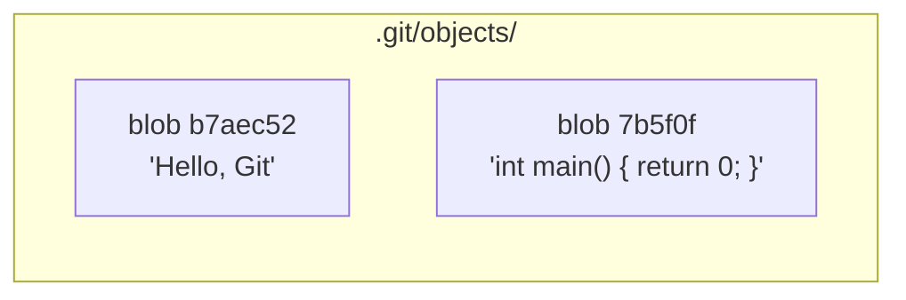

### 4.3 第二步：创建 tree 对象

blob 对象只存储了内容，没有文件名。我们需要用 tree 对象将文件名与 blob 关联起来。

首先，将 blob 添加到暂存区（index）：

```bash
# 将 blob 添加到暂存区，指定文件名
git update-index --add --cacheinfo 100644 \
  b7aec520dec0a7516c18eb4c68b64ae1eb9b5a5e hello.txt

git update-index --add --cacheinfo 100644 \
  7b5f0f0c5e8c8e7a6d4b3c2d1e0f9a8b7c6d5e4f main.c
```

`--cacheinfo` 参数的格式为 `mode SHA-1 文件名`。此时暂存区（index）记录了文件名与 blob 的映射关系。

然后将暂存区写入 tree 对象：

```bash
git write-tree
# 输出：f0d3f7c6e5a4b3c2d1e0f9a8b7c6d5e4f3a2b1c0（示例哈希）
```

验证 tree 对象：

```bash
# 查看类型
git cat-file -t f0d3f7c6e5a4b3c2d1e0f9a8b7c6d5e4f3a2b1c0
# 输出：tree

# 查看内容
git cat-file -p f0d3f7c6e5a4b3c2d1e0f9a8b7c6d5e4f3a2b1c0
# 输出：
# 100644 blob b7aec520dec0a7516c18eb4c68b64ae1eb9b5a5e    hello.txt
# 100644 blob 7b5f0f0c5e8c8e7a6d4b3c2d1e0f9a8b7c6d5e4f    main.c
```

**此时的对象库状态：**

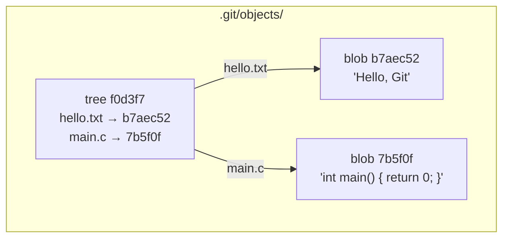


### 4.4 第三步：创建 commit 对象

有了 tree 对象，我们就可以创建 commit 了：

```bash
# 创建 commit 对象，指定 tree 和提交消息
git commit-tree f0d3f7c6e5a4b3c2d1e0f9a8b7c6d5e4f3a2b1c0 \
  -m "Initial commit"
# 输出：a1c2d3e4f5a6b7c8d9e0f1a2b3c4d5e6f7a8b9c0（示例哈希）
```

验证 commit 对象：

```bash
# 查看类型
git cat-file -t a1c2d3e4f5a6b7c8d9e0f1a2b3c4d5e6f7a8b9c0
# 输出：commit

# 查看内容
git cat-file -p a1c2d3e4f5a6b7c8d9e0f1a2b3c4d5e6f7a8b9c0
# 输出：
# tree f0d3f7c6e5a4b3c2d1e0f9a8b7c6d5e4f3a2b1c0
# author Zhang Zhengyang <zhang@example.com> 1700000000 +0800
# committer Zhang Zhengyang <zhang@example.com> 1700000000 +0800
#
# Initial commit
```

注意：这是第一个 commit，没有 parent 字段。

**此时的对象库状态：**

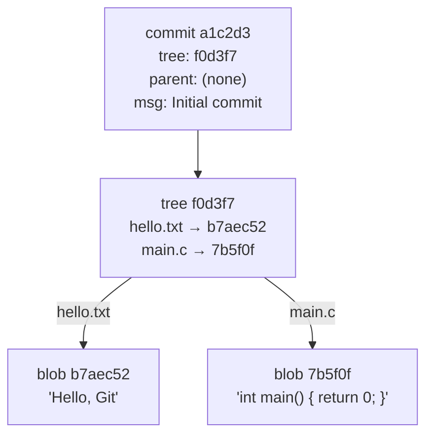

### 4.5 第四步：构建第二次提交（含 parent）

现在修改文件，创建新的 blob 和 tree，然后构建第二个 commit：

```bash
# 修改 hello.txt 的内容
echo "Hello, Git World" | git hash-object -w --stdin
# 输出：c3d4e5f6a7b8c9d0e1f2a3b4c5d6e7f8a9b0c1d2（示例）

# 更新暂存区
git update-index --add --cacheinfo 100644 \
  c3d4e5f6a7b8c9d0e1f2a3b4c5d6e7f8a9b0c1d2 hello.txt

# 写入新的 tree
git write-tree
# 输出：d4e5f6a7b8c9d0e1f2a3b4c5d6e7f8a9b0c1d2e3（示例）

# 创建第二个 commit，指定 parent
git commit-tree d4e5f6a7b8c9d0e1f2a3b4c5d6e7f8a9b0c1d2e3 \
  -p a1c2d3e4f5a6b7c8d9e0f1a2b3c4d5e6f7a8b9c0 \
  -m "Update greeting"
# 输出：b2d3e4f5a6b7c8d9e0f1a2b3c4d5e6f7a8b9c0d1（示例）
```

**完整的对象关系图：**

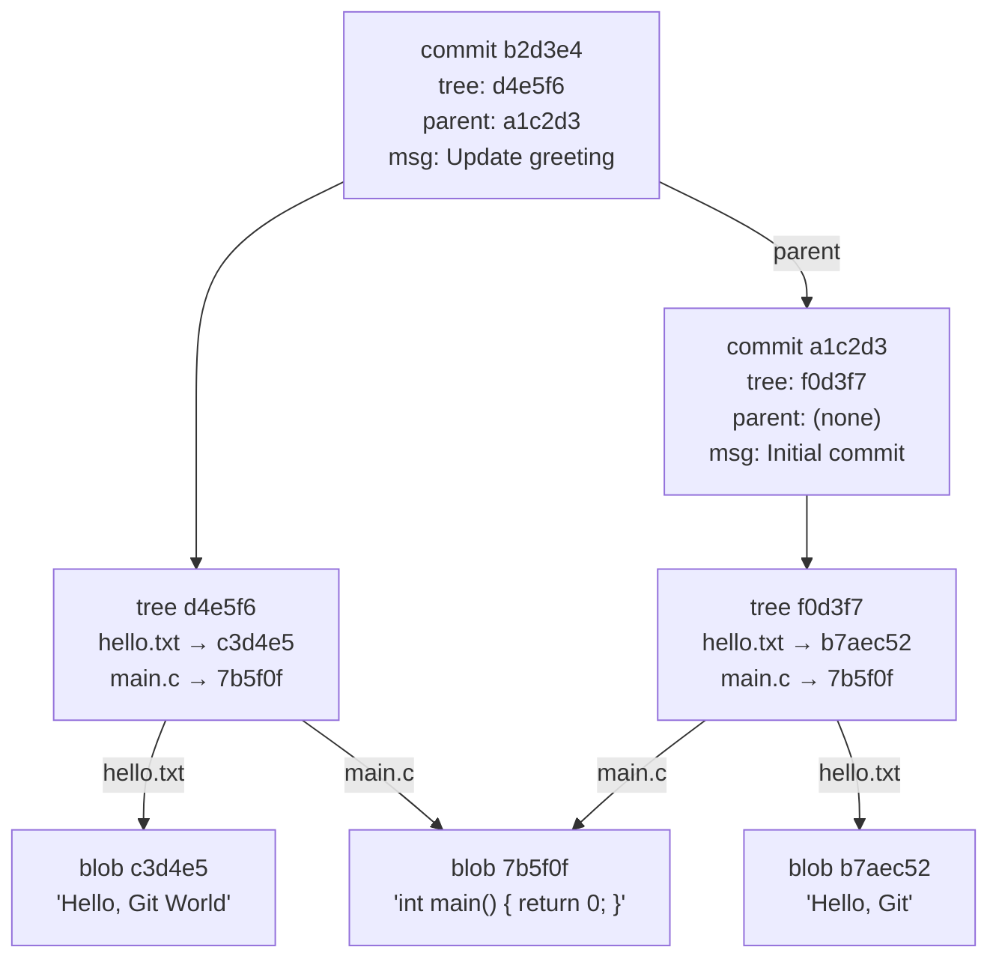

**注意一个关键细节**：`main.c` 的内容没有变化，所以两个 tree 都指向同一个 blob `7b5f0f`。这就是内容寻址存储的去重效果——Git 天然只存储变化的部分，未变化的 blob 被自动复用。

### 4.6 命令对照表

将上述底层命令与日常使用的 Porcelain 命令对照：

| 底层命令（Plumbing）            | 等价的高级命令（Porcelain） | 作用                     |
| ------------------------------- | --------------------------- | ------------------------ |
| `git hash-object -w`            | `git add`（部分功能）       | 将内容存为 blob 对象     |
| `git update-index --add`        | `git add`（部分功能）       | 将 blob 加入暂存区       |
| `git write-tree`                | `git add`（隐含步骤）       | 将暂存区写入 tree 对象   |
| `git commit-tree`               | `git commit`                | 创建 commit 对象         |
| `git cat-file -t`               | —                           | 查看对象类型             |
| `git cat-file -p`               | —                           | 查看对象内容             |
| `git ls-tree`                   | `git ls-files -s`（近似）   | 查看 tree 的条目         |

---

## 5 SHA-1 哈希的生成方式

### 5.1 头信息格式

Git 计算 SHA-1 时，并不是对原始内容直接哈希，而是先构造一个**头信息**（header），拼接后再计算：

```
<type> <size>\0<content>
```

其中：

- `<type>`：对象类型，即 `blob`、`tree`、`commit`、`tag` 之一
- `<size>`：内容的字节长度（ASCII 数字）
- `\0`：空字节（null byte），作为头部与内容的分隔符
- `<content>`：实际内容

### 5.2 手动计算 blob 的 SHA-1

以 `Hello, Git\n`（10 个字符 + 1 个换行 = 11 字节）为例：

```bash
# 方法一：用 Git 命令
echo "Hello, Git" | git hash-object --stdin
# 输出：b7aec520dec0a7516c18eb4c68b64ae1eb9b5a5e

# 方法二：手动构造头部并计算
# 头部 = "blob 11\0"
# 完整数据 = "blob 11\0Hello, Git\n"
printf "blob 11\0Hello, Git\n" | shasum
# 输出：b7aec520dec0a7516c18eb4c68b64ae1eb9b5a5e
```

两者结果完全一致！这证明了 Git 的 SHA-1 计算方式。


### 5.3 SHA-1 计算流程

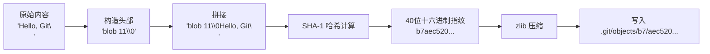

### 5.4 为什么头信息很重要

头信息确保了**不同类型的对象即使内容相同，哈希也不同**。例如：

- 一个内容为 `"test"` 的 blob：`blob 4\0test`
- 一个 tag 消息为 `"test"` 的 tag 对象：其序列化数据以 `object ...` 开头

两者的原始内容部分相同，但因为头信息中包含了类型标识，SHA-1 哈希绝不会冲突。

---

## 6 为什么 Git 用内容寻址

内容寻址并非 Git 的独创——它源自密码学中的哈希思想，也被 IPFS、Bitcoin、Nix 等系统采用。Git 选择内容寻址，带来了三大核心优势：

### 6.1 去重：相同内容只存一份

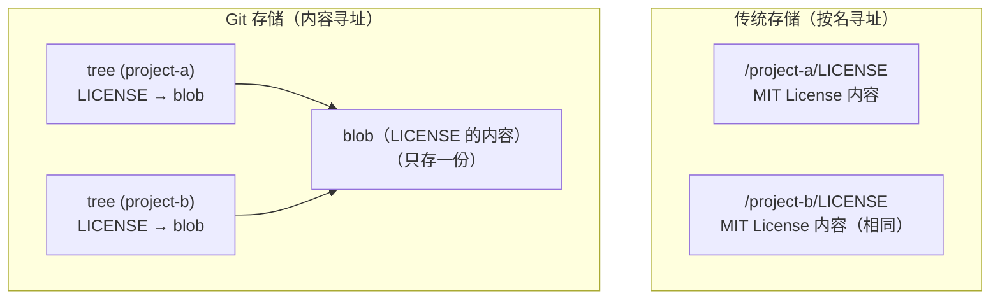

在传统文件系统中，100 个项目有 100 份相同的 `LICENSE` 文件，占用 100 份空间。在 Git 中，100 个 tree 条目指向同一个 blob，只占用 1 份空间。

这种去重不仅发生在跨项目层面，也发生在同一项目的版本历史中：如果某个文件在 10 个版本中都没有变化，那么 10 个 tree 都指向同一个 blob。

### 6.2 完整性：篡改 = 哈希变化

内容寻址天然提供了**数据完整性校验**：

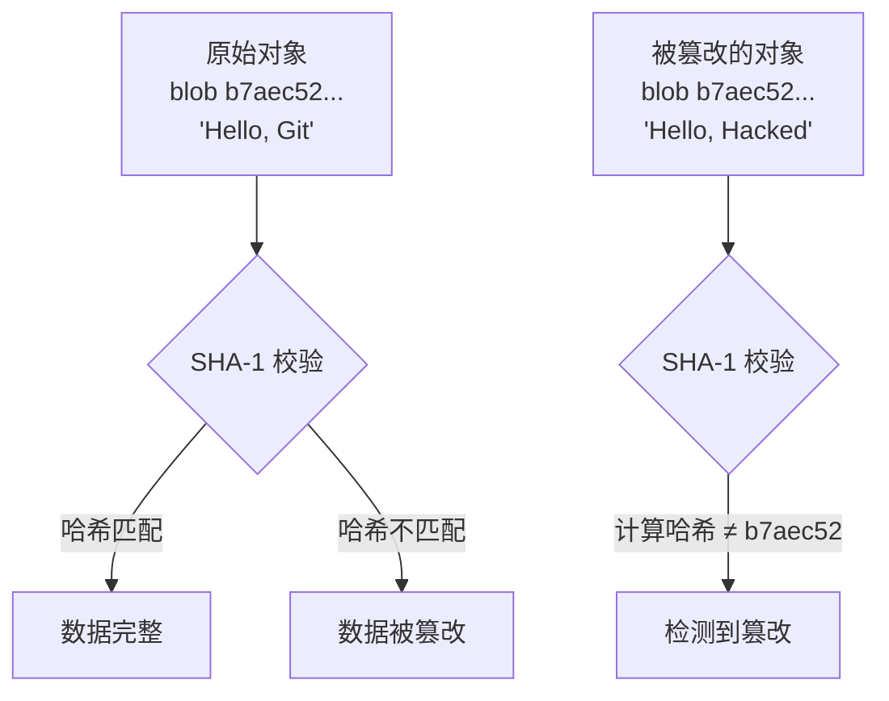

因为对象的"名字"（SHA-1 哈希）是由其内容决定的，所以：

- 你无法在不改变哈希的情况下修改内容。
- 你无法在不改变内容的情况下伪造哈希（SHA-1 的抗碰撞性）。
- 任何对 `.git/objects/` 中文件的篡改，都会在 Git 读取时被自动检测到。

这就是为什么 Git 可以自信地说：**它存储的历史是不可篡改的**。这不是靠权限控制，而是靠数学保证。

> 补充说明：密码学研究（如 2017 年的 SHAttered 攻击）已经证明可以为 SHA-1 构造碰撞。为此 Git 从 2.13 版本起内置了针对已知碰撞攻击的检测（检测到碰撞对象会拒绝接收），并从 2.29 版本起支持基于 SHA-256 的仓库对象格式（`git init --object-format=sha256`）。截至 2026 年，SHA-1 仍是新建仓库的默认哈希算法。

### 6.3 不可变：对象创建后永不改变

Git 对象一旦写入 `.git/objects/`，就**永远不会被修改**。这是内容寻址的必然结果：

- 对象的"名字"是内容的哈希，修改内容 = 新对象。
- 旧对象不会被覆盖，也不会被删除（除非执行 `git gc` 且确认无引用）。
- 这意味着 Git 的每一次提交、每一个文件快照，都是**永恒的**——只要对象还在，你就可以回到任何一个历史状态。

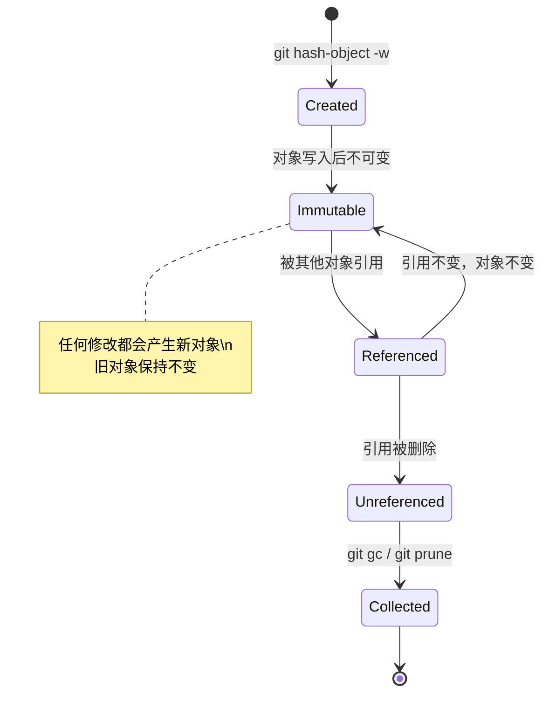

**三大优势的协同效应：**

| 优势   | 机制             | 效果                           |
| ------ | ---------------- | ------------------------------ |
| 去重   | 相同内容 = 相同哈希 | 节省存储空间，跨版本/跨项目复用 |
| 完整性 | 哈希 = 内容指纹   | 篡改必被检测，数据可信         |
| 不可变 | 修改 = 新对象     | 历史不可篡改，可随时回溯       |

---

## 7 小结

Git 的对象模型可以用一句话概括：**Git 是一个以 SHA-1 为键、以四种不可变对象为值的内容寻址数据库。**

回顾本章的核心要点：

1. **内容寻址**是 Git 的哲学根基：内容决定身份，相同内容产生相同哈希，不同内容产生不同哈希。

2. **四种对象类型**各司其职：
   - **blob**：纯文件内容，不含文件名和权限
   - **tree**：目录结构，将文件名/权限与 blob/tree 引用关联
   - **commit**：指向 tree 快照 + 父提交 + 元数据，构成历史链
   - **tag**：指向任意对象（通常是 commit）+ 标签元数据，提供不可变的命名锚

3. **引用链**：`tag → commit → tree → blob/tree`，从标签到文件内容，层层递进。

4. **手动构建提交**的流程：`hash-object`（创建 blob）→ `update-index`（暂存）→ `write-tree`（创建 tree）→ `commit-tree`（创建 commit），这正是 `git add` + `git commit` 的底层实现。

5. **SHA-1 的计算方式**：`<type> <size>\0<content>`，头信息确保不同类型对象不会哈希冲突。

6. **内容寻址的三大优势**：去重（省空间）、完整性（防篡改）、不可变（保历史）。

理解了对象模型，你就拥有了透视 Git 的 X 光眼。当你执行 `git log`、`git diff`、`git merge` 时，你看到的不再是黑盒操作，而是对象之间的引用、遍历与重组。下一章我们将深入 Git 的引用机制（分支、HEAD、远程引用），看看这些"指针"是如何让不可变的对象模型支撑起灵活的版本控制工作流的。

