# 仓库目录结构

在之前的章节中，我们从概念层面了解了 HEAD、branch、commit 等核心对象。这一节，我们打开 `.git/` 目录的大门，深入 Git 仓库的物理存储结构，看看这些概念在文件系统中到底长什么样。

理解 `.git/` 的目录结构，是从「会使用 Git」迈向「真正理解 Git」的关键一步。当你读完这一节，`git` 将不再是一个黑盒，而是一个由文本文件、压缩对象和索引二进制文件构成的透明系统。

## .git/ 目录全貌

当你执行 `git init` 或 `git clone` 时，Git 会在项目根目录下创建一个 `.git/` 文件夹。这个文件夹就是 Git 仓库的全部——Git 的所有版本信息、配置、历史记录，统统存储在这里。删掉 `.git/`，项目就不再是 Git 仓库了。

下面是一个典型的 `.git/` 目录结构：

```mermaid
graph TD
    GIT[".git/"]
    GIT --> HEAD["HEAD"]
    GIT --> CONFIG["config"]
    GIT --> DESCRIPTION["description"]
    GIT --> COMMIT_EDITMSG["COMMIT_EDITMSG"]
    GIT --> INDEX["index"]
    GIT --> PACKED_REFS["packed-refs"]
    GIT --> ORIG_HEAD["ORIG_HEAD"]
    GIT --> MERGE_HEAD["MERGE_HEAD"]
    GIT --> CHERRY_HEAD["CHERRY_PICK_HEAD"]
    GIT --> REVERT_HEAD["REVERT_HEAD"]

    GIT --> OBJECTS["objects/"]
    OBJECTS --> OBJ_LOOSE["00/ ... ff/<br>松散对象子目录"]
    OBJECTS --> OBJ_PACK["pack/"]
    OBJ_PACK --> PACK_FILE["*.pack<br>打包文件"]
    OBJ_PACK --> IDX_FILE["*.idx<br>索引文件"]
    OBJECTS --> OBJ_INFO["info/"]

    GIT --> REFS["refs/"]
    REFS --> REFS_HEADS["heads/"]
    REFS_HEADS --> MASTER["master"]
    REFS_HEADS --> FEATURE["feature1"]
    REFS --> REFS_TAGS["tags/"]
    REFS_TAGS --> V1["v1.0"]
    REFS --> REFS_REMOTES["remotes/"]
    REFS_REMOTES --> ORIGIN["origin/"]
    ORIGIN --> ORIGIN_MASTER["master"]

    GIT --> LOGS["logs/"]
    LOGS --> LOGS_HEAD["HEAD"]
    LOGS --> LOGS_REFS["refs/"]
    LOGS_REFS --> LOGS_HEADS["heads/"]
    LOGS_HEADS --> LOGS_MASTER["master"]

    GIT --> HOOKS["hooks/"]
    HOOKS --> PRE_COMMIT["pre-commit.sample"]
    HOOKS --> COMMIT_MSG["commit-msg.sample"]
    HOOKS --> CUSTOM_HOOK["..."]

    GIT --> INFO["info/"]
    INFO --> EXCLUDE["exclude"]
    INFO --> REFS_INFO["refs"]

```

接下来，我们逐一深入每个文件和目录。

---

## HEAD 文件：你在哪里

HEAD 是 Git 中最核心的引用。在文件系统中，它就是 `.git/` 目录下的一个纯文本文件——`HEAD`。

HEAD 的内容只有两种格式：

### 1. 符号引用（Symbolic Reference）——最常见的情况

```
ref: refs/heads/master
```

这是 HEAD 的常态。它表示 HEAD 并不直接指向某个 commit，而是指向一个分支（branch），再由分支指向具体的 commit。当你执行 `git commit` 时，HEAD 不会改变内容（依然指向同一个分支），而是分支引用向前移动，间接带动 HEAD 指向新的 commit。

当你用 `git checkout master` 切换分支时，HEAD 的内容会变成：

```
ref: refs/heads/master
```

而当你 `git checkout feature1` 时，HEAD 的内容就会变成：

```
ref: refs/heads/feature1
```

### 2. 直接引用（Detached HEAD）——分离头指针状态

```
a3f2b9c1d4e5f6a7b8c9d0e1f2a3b4c5d6e7f8a9
```

当 HEAD 的内容是一个 40 位的 SHA-1 哈希值时，说明 HEAD 直接指向了一个 commit，而不是通过分支间接指向。这种情况被称为 **分离头指针（Detached HEAD）** 状态。

进入分离头指针状态的常见方式：

```shell
# 检出某个具体的 commit
git checkout a3f2b9c1

# 检出某个标签
git checkout v1.0
```

在分离头指针状态下，如果你创建新的 commit，HEAD 会向前移动，但没有任何分支跟着移动。一旦你切换到别的分支，这些「无家可归」的 commit 可能会被 Git 的垃圾回收机制清除。

> **提示**：可以用 `git checkout --detach` 显式进入分离头指针状态，也可以用 `git switch --detach` （Git 2.23+）。

下面的流程图展示了 HEAD 的两种状态及其切换：

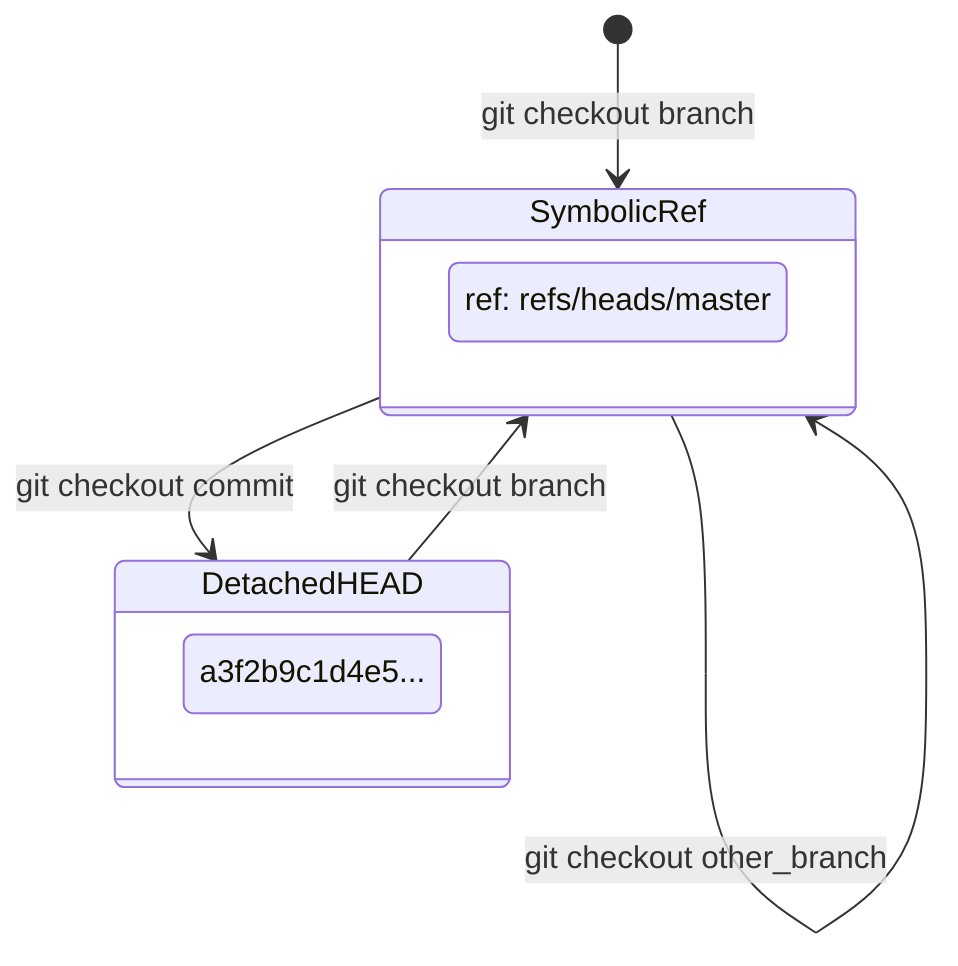

---

## config 文件：仓库级配置

`.git/config` 是当前仓库的配置文件，采用 INI 格式。它只影响当前仓库，优先级高于全局配置 `~/.gitconfig`，低于命令行参数。

一个典型的 `.git/config` 内容如下：

```ini
[core]
    repositoryformatversion = 0
    filemode = true
    bare = false
    logallrefupdates = true
    ignorecase = true
    precomposeunicode = true

[remote "origin"]
    url = git@github.com:user/repo.git
    fetch = +refs/heads/*:refs/remotes/origin/*

[branch "master"]
    remote = origin
    merge = refs/heads/master
```

几个关键配置项的含义：

| 配置项 | 含义 |
|--------|------|
| `repositoryformatversion` | 仓库格式版本号，当前为 0 |
| `bare` | 是否为裸仓库（没有工作目录的仓库） |
| `logallrefupdates` | 是否记录所有引用的 reflog |
| `remote "origin".url` | 远程仓库的 URL |
| `remote "origin".fetch` | fetch 时的引用映射规则 |
| `branch "master".remote` | 该分支跟踪的远程名称 |
| `branch "master".merge` | 该分支跟踪的远程分支引用 |

Git 配置的优先级从低到高为：

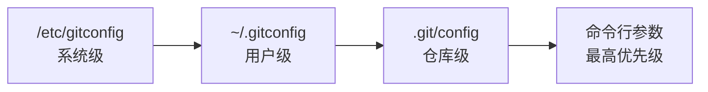

你可以通过命令操作仓库级配置：

```shell
# 查看仓库级配置
git config --local --list

# 设置仓库级配置
git config --local user.name "Your Name"

# 移除仓库级配置
git config --local --unset user.name
```

---

## objects/ 目录：Git 的对象数据库

`objects/` 是 Git 存储所有内容的核心目录。Git 是一个内容寻址文件系统——它把所有数据（文件内容、目录结构、提交信息）都存储为对象，每个对象通过其内容的 SHA-1 哈希值来索引。


### 松散对象（Loose Objects）

当你创建新对象时，Git 首先以松散格式存储。存储规则如下：

- SHA-1 哈希值的前 2 位作为子目录名
- SHA-1 哈希值的后 38 位作为文件名

例如，一个 SHA-1 为 `3b18e512dba79e4c8300dd08aeb37f8e728b8dad` 的对象，会存储在：

```
.git/objects/3b/18e512dba79e4c8300dd08aeb37f8e728b8dad
```

松散对象文件的内容是经过 zlib 压缩的原始数据，无法直接阅读。你可以用底层命令来查看：

```shell
# 查看对象类型
git cat-file -t 3b18e51

# 查看对象内容
git cat-file -p 3b18e51

# 查看对象大小
git cat-file -s 3b18e51
```

Git 有四种对象类型：

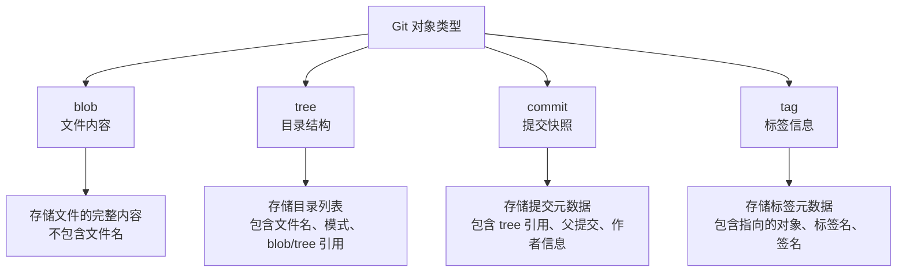

下面用一个具体的例子来展示对象之间的关系：

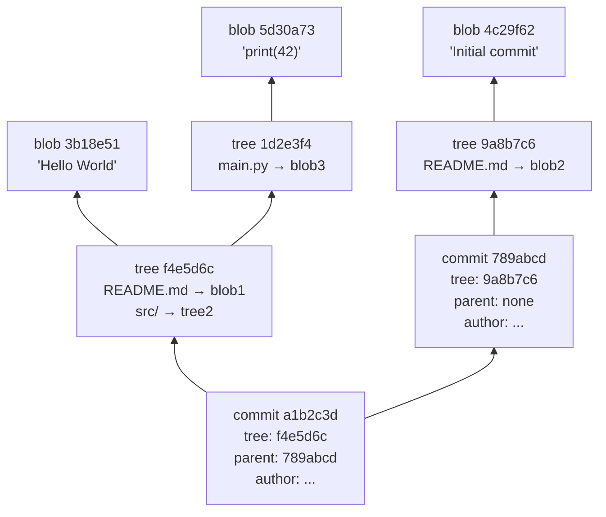

### Packfile 存储（打包文件）

随着仓库中对象数量增加，松散对象会占用大量磁盘空间和 inode。Git 通过 `git gc`（垃圾回收）或自动触发的打包机制，将松散对象压缩为 packfile 格式，存放在 `objects/pack/` 目录下。

打包后会产生两个文件：

- **`.pack` 文件**：存储打包后的对象数据，使用增量压缩（delta compression），只存储与前一版本的差异部分
- **`.idx` 文件**：packfile 的索引，用于快速定位 pack 中的对象

```
.git/objects/pack/
    pack-1a2b3c4d5e6f7a8b9c0d1e2f3a4b5c6d7e8f9a0b.idx
    pack-1a2b3c4d5e6f7a8b9c0d1e2f3a4b5c6d7e8f9a0b.pack
```

松散对象与 packfile 的对比：

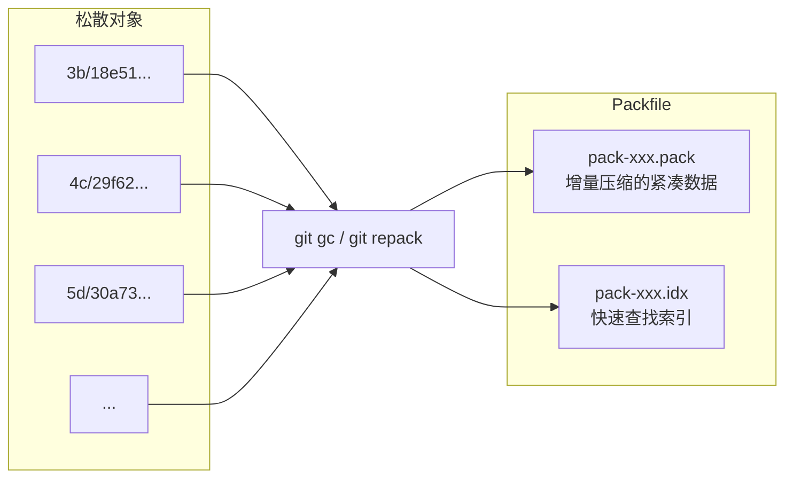

你可以手动触发打包和解包：

```shell
# 手动打包松散对象
git gc

# 手动解包所有 packfile 为松散对象（调试用）
git unpack-objects < .git/objects/pack/pack-xxx.pack

# 查看 packfile 统计信息
git verify-pack -v .git/objects/pack/pack-xxx.idx
```

> **深度提示**：Git 的增量压缩算法会自动选择一个基础对象（base object），然后存储当前对象与基础对象之间的差异。对于同一文件的历史版本，这种压缩方式可以将存储空间缩减到原来的数十分之一甚至更少。当 Git 需要访问某个打包对象时，会先通过 `.idx` 索引定位到 packfile 中的位置，然后逐层应用 delta 还原出完整内容。

---

## refs/ 目录：引用的世界

`refs/` 目录存储了 Git 中所有的引用（references）。引用本质上就是一个文件，文件内容是一个 40 位的 SHA-1 哈希值，指向某个 commit（或 tag 对象）。

```
.git/refs/
    heads/           ← 本地分支
        master       ← 内容：a1b2c3d4...
        feature1     ← 内容：e5f6a7b8...
    tags/            ← 标签
        v1.0         ← 内容：c9d0e1f2...
    remotes/         ← 远程分支
        origin/
            master   ← 内容：a1b2c3d4...
```

### heads/ —— 本地分支

每个本地分支对应 `refs/heads/` 下的一个文件，文件名即分支名，文件内容是该分支指向的 commit 的 SHA-1 哈希值。

```shell
# 查看 master 分支指向的 commit
cat .git/refs/heads/master
# 输出：a1b2c3d4e5f6a7b8c9d0e1f2a3b4c5d6e7f8a9b0

# 等价命令
git rev-parse master
```

当你在 `master` 分支上执行 `git commit` 时，Git 实际上做了两件事：

1. 创建一个新的 commit 对象
2. 将 `.git/refs/heads/master` 的内容更新为新 commit 的 SHA-1 哈希值

如果分支名包含 `/`（如 `feature/login`），Git 会创建对应的子目录：`refs/heads/feature/login`。

### tags/ —— 标签

标签分为轻量标签（lightweight tag）和附注标签（annotated tag）：

- **轻量标签**：`refs/tags/v1.0` 文件内容直接指向一个 commit 的 SHA-1
- **附注标签**：`refs/tags/v1.0` 文件内容指向一个 tag 对象的 SHA-1，tag 对象再指向 commit

```shell
# 创建轻量标签
git tag v1.0

# 创建附注标签
git tag -a v1.0 -m "Version 1.0 release"
```

### remotes/ —— 远程跟踪分支

`refs/remotes/` 存储的是远程仓库的分支引用。每次 `git fetch` 或 `git pull` 时，这些引用会被更新。

```shell
# 查看远程 master 分支指向的 commit
cat .git/refs/remotes/origin/master
```

远程跟踪分支是只读的——你不应该直接修改它们，只能通过 `git fetch` 来更新。

---

## packed-refs 文件：引用的压缩存储

当一个仓库存在大量分支和标签时，`refs/` 目录下会产生大量小文件。为了效率，Git 会将引用打包到一个文件中——`.git/packed-refs`。

`packed-refs` 的格式如下：

```
# pack-refs with: peeled fully-peeled sorted
a1b2c3d4e5f6a7b8c9d0e1f2a3b4c5d6e7f8a9b0 refs/heads/master
e5f6a7b8c9d0e1f2a3b4c5d6e7f8a9b0c1d2e3f4 refs/heads/feature1
f1a2b3c4d5e6f7a8b9c0d1e2f3a4b5c6d7e8f9a0b refs/tags/v1.0
^c9d0e1f2a3b4c5d6e7f8a9b0c1d2e3f4a5b6c7d8
```

格式解读：

- `#` 开头的是注释行，`pack-refs with:` 后面的关键词表示打包时启用的特性
- 每行由 SHA-1 哈希值 + 空格 + 引用路径组成
- `^` 开头的行表示前一个引用指向的附注标签所指向的 commit（即「剥皮」后的 commit）

**重要规则**：当同一个引用同时存在于 `refs/` 目录和 `packed-refs` 文件中时，`refs/` 目录下的文件优先级更高。Git 在更新引用时，会先写入 `refs/` 目录，只有在执行 `git gc` 或 `git pack-refs` 时才会将松散引用合并到 `packed-refs` 中。

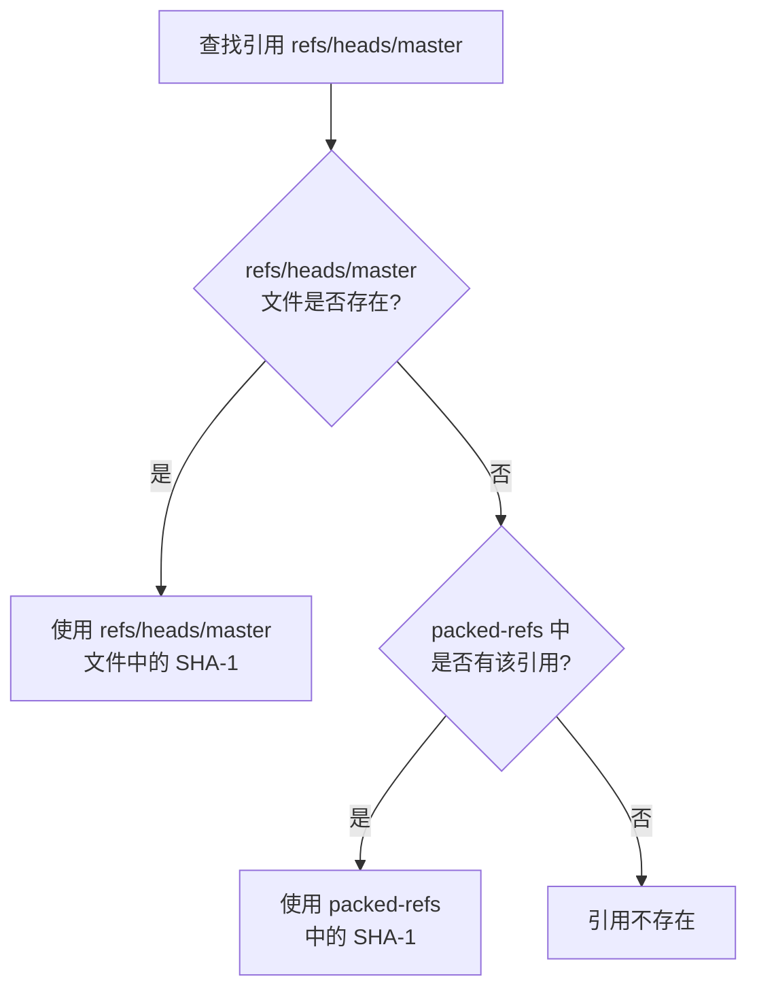

---

## index 文件：暂存区的真身

`.git/index` 是暂存区（staging area）的物理载体。它是一个二进制文件，记录了下一次 commit 将要包含的文件快照。


### 二进制格式概览

index 文件的结构可以概括为以下几部分：

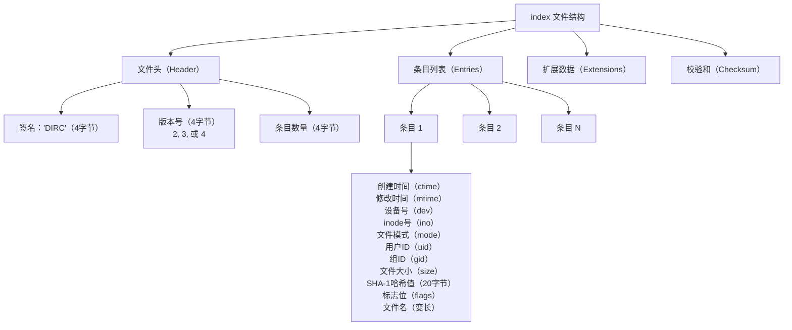

### 关键字段解读

| 字段 | 大小 | 说明 |
|------|------|------|
| 签名（Signature） | 4 字节 | 固定为 `DIRC`（Directory Cache 的缩写） |
| 版本号（Version） | 4 字节 | 支持 2、3、4 三个版本。版本 3 增加了对扩展标志的支持，版本 4 引入了路径名压缩 |
| 条目数量 | 4 字节 | 暂存区中的文件条目总数 |
| ctime | 8 字节 | 文件属性最后变更时间（秒数 + 纳秒数） |
| mtime | 8 字节 | 文件内容最后修改时间（秒数 + 纳秒数） |
| dev | 4 字节 | 文件所在设备号 |
| ino | 4 字节 | 文件的 inode 号 |
| mode | 4 字节 | 文件模式（普通文件 100644、可执行文件 100755、符号链接 120000 等） |
| uid | 4 字节 | 文件所有者的用户 ID |
| gid | 4 字节 | 文件所有者的组 ID |
| size | 4 字节 | 文件大小（字节数） |
| SHA-1 | 20 字节 | 对应 blob 对象的 SHA-1 哈希值 |
| flags | 2 字节 | 包含名字长度（低 12 位）和扩展标志 |
| 文件名 | 变长 | 文件的相对路径（以 NUL 结尾） |

> **深度提示**：index 文件中存储了大量的 stat 信息（ctime、mtime、dev、ino 等），这是 Git 判断文件是否被修改的快速途径。Git 在执行 `git status` 时，会先用 stat 信息快速比对：如果文件的 mtime、dev、ino 等都没有变化，就直接认为文件未被修改，避免读取文件内容并计算 SHA-1 带来的性能开销。只有当 stat 信息发生变化时，Git 才会真正读取文件内容进行比对。

你可以用底层命令查看 index 文件的内容：

```shell
# 显示暂存区的详细信息
git ls-files --stage

# 显示暂存区文件的 stat 信息
git ls-files --debug

# 查看 HEAD 提交的 tree 内容（可与暂存区对比）
git ls-tree -r HEAD
```

---

## logs/ 目录：reflog 的存储

`logs/` 目录存储了 reflog（Reference Log）数据。reflog 记录了引用（HEAD、分支等）的变更历史，是 Git 的「安全网」——即使你误删了分支或做了破坏性的 reset，只要 reflog 中还有记录，就可以找回丢失的 commit。

```
.git/logs/
    HEAD                 ← HEAD 的 reflog
    refs/
        heads/
            master       ← master 分支的 reflog
            feature1     ← feature1 分支的 reflog
```

reflog 文件每行一条记录，格式如下：

```
a1b2c3d4 e5f6a7b8 Author Name <email@example.com> 1698765432 +0800    commit: Add login feature
e5f6a7b8 789abcde Author Name <email@example.com> 1698765123 +0800    checkout: moving from master to feature1
```

每行包含四个部分：

1. **旧 SHA-1**：引用变更前指向的 commit
2. **新 SHA-1**：引用变更后指向的 commit
3. **操作者和时间戳**：谁在什么时候执行了操作
4. **操作描述**：什么操作导致了这次变更（commit、checkout、reset、merge 等）

查看 reflog 的命令：

```shell
# 查看 HEAD 的 reflog
git reflog

# 查看某个分支的 reflog
git reflog show master

# 查看 reflog 的详细日期
git reflog --date=iso
```

reflog 有过期机制。默认情况下：

- 对于可达的 commit，reflog 保留 90 天
- 对于不可达的 commit，reflog 保留 30 天

过期后，reflog 条目会被 `git gc` 清除，对应的不可达 commit 也可能被真正删除。

```shell
# 修改 reflog 过期时间（90天改为180天）
git config gc.reflogExpire 180.days

# 修改不可达 reflog 的过期时间
git config gc.reflogExpireUnreachable 60.days
```

---

## hooks/ 目录：自动化钩子

`.git/hooks/` 目录存放着钩子脚本。钩子是在特定 Git 事件发生时自动执行的脚本，用于实现自定义的自动化流程。

Git 初始化时会创建一系列 `.sample` 后缀的示例钩子，去掉 `.sample` 后缀即可激活：

```
.git/hooks/
    applypatch-msg.sample
    commit-msg.sample
    fsmonitor-watchman.sample
    post-update.sample
    pre-applypatch.sample
    pre-commit.sample
    pre-merge-commit.sample
    pre-push.sample
    pre-rebase.sample
    pre-receive.sample
    prepare-commit-msg.sample
    update.sample
```

按执行时机，钩子分为两大类：

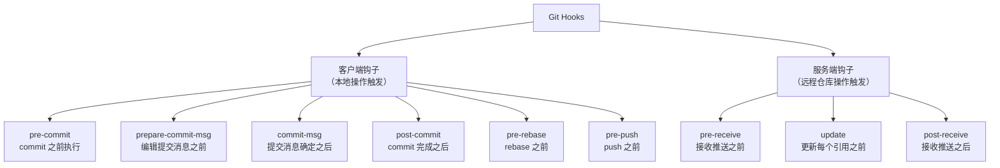

几个常用钩子的用途：

| 钩子 | 触发时机 | 典型用途 |
|------|---------|---------|
| `pre-commit` | `git commit` 执行前 | 代码风格检查、运行测试 |
| `commit-msg` | 编辑提交消息后 | 校验提交消息格式 |
| `pre-push` | `git push` 执行前 | 运行完整测试套件 |
| `pre-rebase` | `git rebase` 执行前 | 防止 rebase 已推送的 commit |

> **注意**：客户端钩子不会被 `git clone` 复制到其他仓库。如果需要团队共享钩子，通常需要借助 Husky、lefthook 等工具，或将钩子脚本放在仓库的其他目录中，再通过构建脚本安装到 `.git/hooks/`。

---

## info/ 目录：辅助信息

`.git/info/` 存储仓库的一些辅助信息：

### exclude 文件

`.git/info/exclude` 的格式和作用与 `.gitignore` 完全相同，但它不会被提交到版本库中，属于仓库级的本地忽略规则。

典型使用场景：你的 IDE 生成了 `.idea/` 目录，但团队没有在 `.gitignore` 中统一忽略它。你不想每次 `git status` 都看到它，也不想修改团队的 `.gitignore`——这时就可以把它加到 `info/exclude` 中。

忽略规则的优先级（从高到低）：

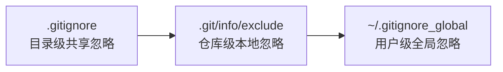

### refs 文件

`.git/info/refs` 在使用哑传输协议（dumb HTTP）时提供引用信息。现代 Git 通常使用智能传输协议，此文件一般不存在。

---

## 特殊引用文件

`.git/` 目录下还有一些特殊引用文件，它们记录了某些操作的关键 commit，用于支持撤销和恢复操作。

### COMMIT_EDITMSG

`.git/COMMIT_EDITMSG` 保存了最后一次提交的 commit 消息文本。当你执行 `git commit` 时，Git 会将编辑器中的提交消息保存到这个文件中。即使提交失败（如 pre-commit 钩子拒绝），消息也会保留在此，方便你下次提交时复用。

```shell
# 查看最后一次提交消息
cat .git/COMMIT_EDITMSG
```

### ORIG_HEAD

`.git/ORIG_HEAD` 记录了进行「危险操作」之前 HEAD 的位置。以下操作会更新 ORIG_HEAD：

- `git merge`
- `git rebase`
- `git reset`
- `git pull`

它的主要用途是提供一条「后悔药」——当你执行了 merge 或 reset 后发现搞错了：

```shell
# 撤销最近一次 merge 或 reset
git reset --hard ORIG_HEAD
```


### MERGE_HEAD

`.git/MERGE_HEAD` 在合并冲突时出现，记录了正在合并的另一个分支的 commit SHA-1。当冲突解决并提交后，此文件会被删除。

```
# 合并冲突时，MERGE_HEAD 的内容
e5f6a7b8c9d0e1f2a3b4c5d6e7f8a9b0c1d2e3f4
```

Git 在创建 merge commit 时，会同时使用 HEAD 和 MERGE_HEAD 作为父 commit。

### CHERRY_PICK_HEAD

`.git/CHERRY_PICK_HEAD` 在 cherry-pick 冲突时出现，记录了正在拣选的 commit 的 SHA-1。冲突解决后此文件会被删除。

```shell
# cherry-pick 冲突时继续
git cherry-pick --continue

# 放弃 cherry-pick
git cherry-pick --abort
```

### REVERT_HEAD

`.git/REVERT_HEAD` 在 revert 冲突时出现，记录了正在回退的 commit。与 CHERRY_PICK_HEAD 逻辑类似。

### 各特殊引用的生命周期

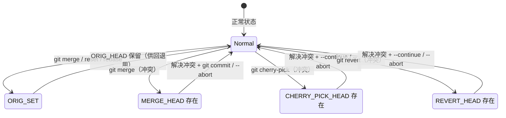

---

## 全景图：.git/ 目录与 Git 命令的交互

最后，让我们用一张全景图来展示 `.git/` 目录中各组件是如何与常见的 Git 命令交互的：

```mermaid
graph TD
    subgraph Git命令
        INIT["git init"]
        ADD["git add"]
        COMMIT["git commit"]
        CHECKOUT["git checkout"]
        MERGE["git merge"]
        FETCH["git fetch / pull"]
        PUSH["git push"]
        RESET["git reset"]
        REFLOG["git reflog"]
        GC["git gc"]
        STATUS["git status"]
        LOG["git log"]
        TAG["git tag"]
    end

    subgraph ".git/ 目录结构"
        HEAD_FILE["HEAD"]
        INDEX_FILE["index"]
        OBJECTS_DIR["objects/"]
        REFS_DIR["refs/"]
        PACKED_REFS_FILE["packed-refs"]
        LOGS_DIR["logs/"]
        CONFIG_FILE["config"]
        HOOKS_DIR["hooks/"]
        COMMIT_MSG["COMMIT_EDITMSG"]
        ORIG_HEAD_FILE["ORIG_HEAD"]
        MERGE_HEAD_FILE["MERGE_HEAD"]
        CHERRY_HEAD_FILE["CHERRY_PICK_HEAD"]
    end

    INIT --> HEAD_FILE
    INIT --> OBJECTS_DIR
    INIT --> REFS_DIR
    INIT --> HOOKS_DIR

    ADD --> INDEX_FILE
    ADD --> OBJECTS_DIR

    COMMIT --> HEAD_FILE
    COMMIT --> INDEX_FILE
    COMMIT --> OBJECTS_DIR
    COMMIT --> REFS_DIR
    COMMIT --> LOGS_DIR
    COMMIT --> COMMIT_MSG
    COMMIT --> HOOKS_DIR

    CHECKOUT --> HEAD_FILE
    CHECKOUT --> INDEX_FILE

    MERGE --> HEAD_FILE
    MERGE --> OBJECTS_DIR
    MERGE --> REFS_DIR
    MERGE --> LOGS_DIR
    MERGE --> ORIG_HEAD_FILE
    MERGE --> MERGE_HEAD_FILE

    FETCH --> OBJECTS_DIR
    FETCH --> REFS_DIR
    FETCH --> PACKED_REFS_FILE

    PUSH --> REFS_DIR
    PUSH --> OBJECTS_DIR

    RESET --> HEAD_FILE
    RESET --> INDEX_FILE
    RESET --> ORIG_HEAD_FILE
    RESET --> LOGS_DIR

    REFLOG --> LOGS_DIR

    GC --> OBJECTS_DIR
    GC --> PACKED_REFS_FILE

    STATUS --> INDEX_FILE
    STATUS --> HEAD_FILE

    LOG --> HEAD_FILE
    LOG --> REFS_DIR

    TAG --> REFS_DIR
    TAG --> OBJECTS_DIR

```

---

## 小结

这一节我们深入了 `.git/` 目录的每一个角落。以下是核心要点：

1. **HEAD**：一个纯文本文件，内容要么是符号引用（`ref: refs/heads/xxx`），要么是直接的 SHA-1 哈希值（分离头指针状态）。

2. **config**：仓库级 INI 格式配置文件，优先级高于全局配置，低于命令行参数。

3. **objects/**：Git 的对象数据库，存储 blob、tree、commit、tag 四种对象。松散对象以「前 2 位 SHA-1 作子目录、后 38 位作文件名」的方式存储；大量对象会被 `git gc` 打包为 packfile，使用增量压缩节省空间。

4. **refs/**：引用目录，heads/ 存本地分支、tags/ 存标签、remotes/ 存远程跟踪分支。每个引用是一个内容为 SHA-1 哈希值的文本文件。

5. **packed-refs**：当引用过多时，Git 将它们打包到一个文件中。松散引用（refs/ 目录下的文件）优先级高于 packed-refs 中的记录。

6. **index**：暂存区的二进制文件，包含文件头（签名 DIRC + 版本号 + 条目数）、条目列表（stat 信息 + SHA-1 + 文件名）和校验和。其中存储的 stat 信息是 `git status` 快速判断文件变更的依据。

7. **logs/**：reflog 存储目录，记录引用的变更历史，可达引用默认保留 90 天，是找回丢失 commit 的重要安全网。

8. **hooks/**：钩子脚本目录，支持客户端和服务端两类钩子，实现自动化流程。示例脚本以 `.sample` 后缀提供，去掉后缀即可激活。

9. **info/**：辅助信息目录，其中 `exclude` 文件是仓库级的本地 `.gitignore`。

10. **特殊引用文件**：`COMMIT_EDITMSG` 保存最后一次提交消息；`ORIG_HEAD` 记录危险操作前的 HEAD 位置；`MERGE_HEAD`、`CHERRY_PICK_HEAD`、`REVERT_HEAD` 分别在对应操作冲突时出现，记录操作目标的 commit。

理解了 `.git/` 的物理结构，你就拥有了解读 Git 行为的底层密码——任何 Git 命令的执行结果，最终都体现为这些文件和目录的变化。

