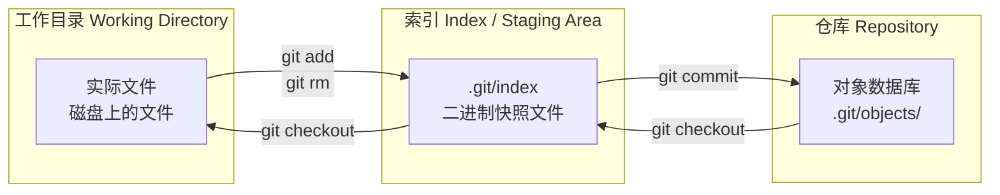
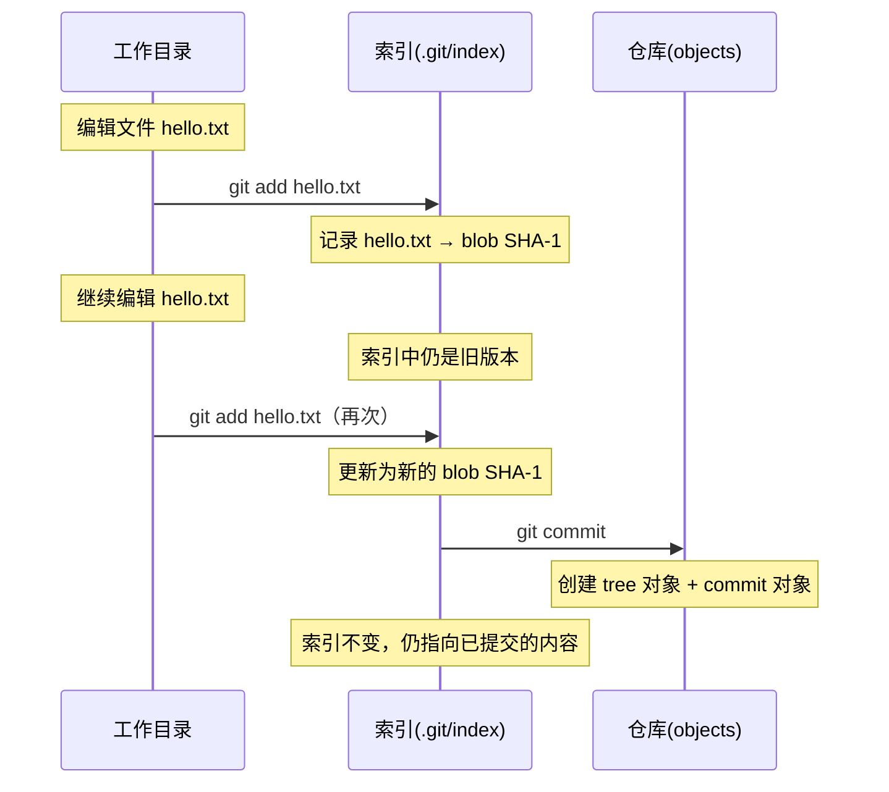
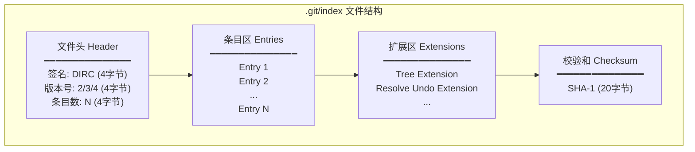
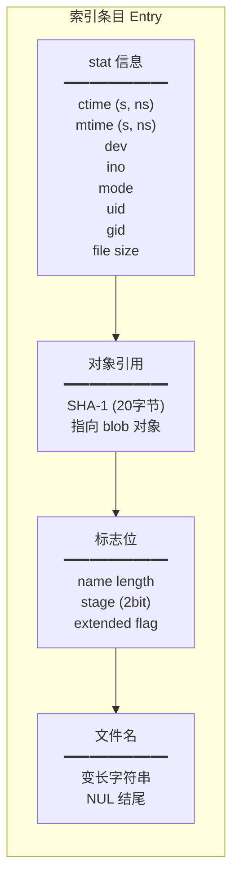
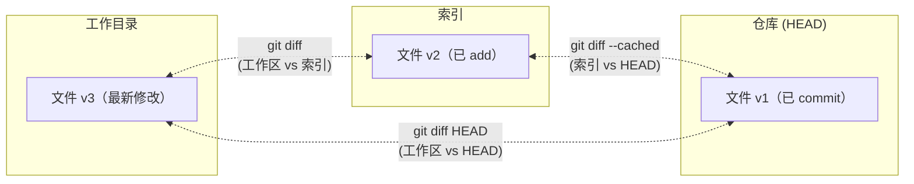
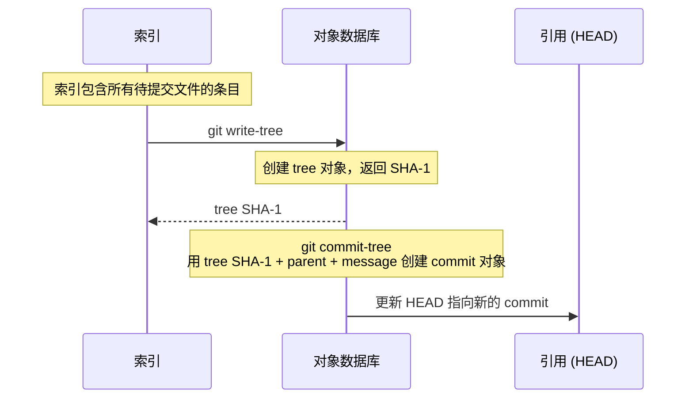
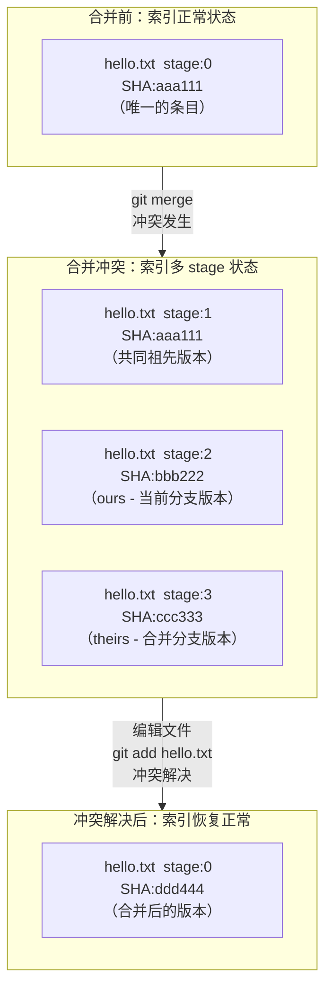
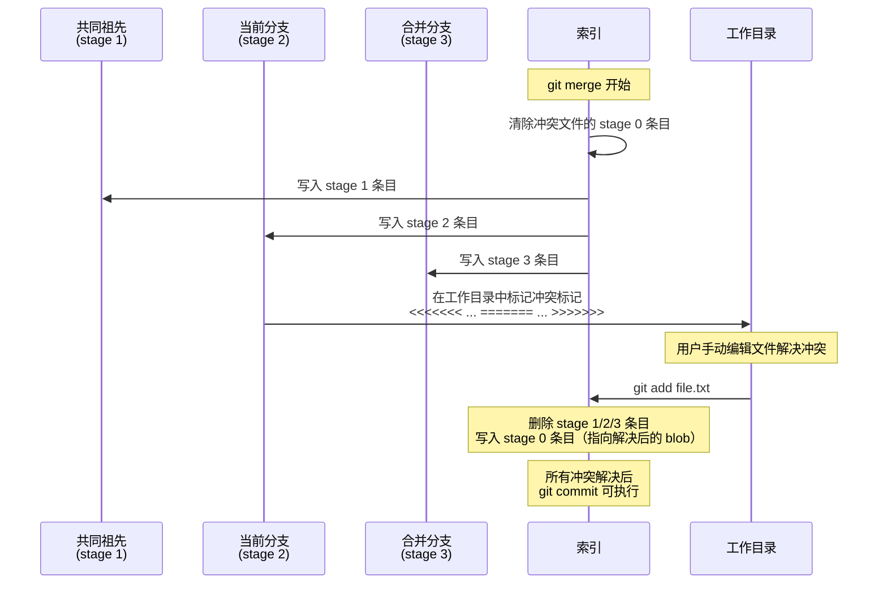
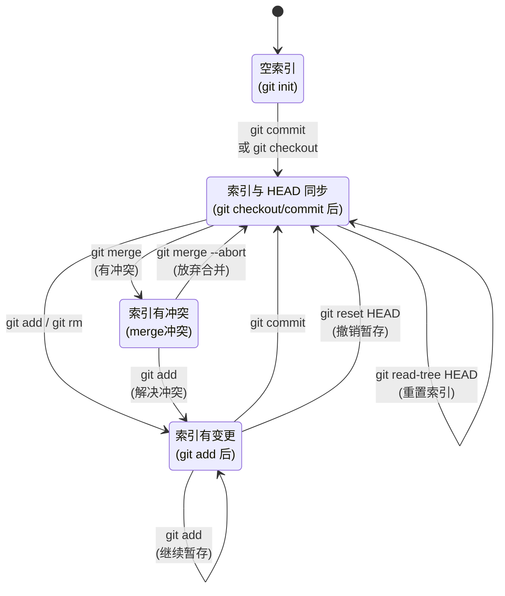

# 索引（Index）详解：Git 暂存区的底层机制

## 引言

在日常使用 Git 时，我们频繁执行 `git add` 和 `git commit`，却很少深入思考它们之间的那个中间层——**索引（Index）**，也称为**暂存区（Staging Area）**或**缓存（Cache）**。大多数教程将暂存区简化为"下一次要提交的内容"，这固然正确，却远未触及它的本质。

索引是 Git 架构中最精妙的设计之一。它不仅仅是一个"中转站"，而是一个结构化的二进制文件，承载着工作目录快照、冲突状态管理、目录树构建等多重职责。理解索引，是理解 Git 内部工作机制的关键一步。

---

## 一、索引的本质：`.git/index` 二进制文件

索引是一个位于 `.git/index` 的二进制文件。它**不是**一个 Git 对象（不存储在 `.git/objects/` 中），而是一个独立的数据结构，记录了**工作目录在某一时刻的快照信息**。

```bash
# 查看索引文件
ls -l .git/index
# -r--r--r--  1 user  staff  1234 May 28 10:00 .git/index
```

索引的核心特征：

| 特征 | 说明 |
|------|------|
| **位置** | `.git/index`（可通过 `GIT_INDEX_FILE` 环境变量覆盖） |
| **格式** | 二进制格式，有明确的文件头和条目结构 |
| **性质** | 不是 Git 对象，不进入对象数据库 |
| **内容** | 一组路径与 blob SHA-1 的映射，加上文件元信息 |
| **语义** | 代表"下一次 `git commit` 将要提交的内容" |

> **命名溯源**：Git 源码和文档中，索引有三种称呼——"index"（索引）是数据结构层面的名称，"staging area"（暂存区）是工作流层面的名称，"cache"（缓存）是历史遗留名称（早期 Git 用它缓存 stat 信息以加速 `git diff`）。三者指同一个东西。

---

## 二、索引在三区模型中的位置

Git 的核心工作模型由三个区域构成：工作目录（Working Directory）、索引（Index/Staging Area）、仓库（Repository）。索引处于中间位置，是工作目录与仓库之间的缓冲层。



索引的核心作用是**解耦**工作目录与仓库：

- 没有 `git add`，工作目录的修改不会自动进入索引
- 没有 `git commit`，索引的内容不会自动进入仓库
- 这种两层解耦让你可以精细地控制哪些修改被提交、哪些被暂存、哪些被忽略



---

## 三、索引的内部结构

索引文件是一个格式严格的二进制文件。理解其内部结构，有助于深刻把握 Git 的行为逻辑。

### 3.1 整体布局



### 3.2 文件头（Header）

文件头共 12 字节，包含三个字段：

| 字段 | 大小 | 值 | 说明 |
|------|------|----|------|
| 签名（Signature） | 4 字节 | `DIRC` | "Dir Cache"的缩写，标识这是一个索引文件 |
| 版本号（Version） | 4 字节 | 2、3 或 4 | 索引格式版本。版本 2 是基础格式，版本 3 支持扩展标志位，版本 4 支持路径名压缩 |
| 条目数（Number of entries） | 4 字节 | N | 索引中条目的数量 |

```bash
# 用 hexdump 查看索引文件头
hexdump -C .git/index | head -2
# 00000000  44 49 52 43 00 00 00 02  00 00 00 03  ...
#           D  I  R  C  版本=2      条目数=3
```

### 3.3 条目（Entry）结构

每个条目对应一个被追踪的文件，记录了该文件的元数据和对应的 blob 对象引用。这是索引最核心的部分。



各字段详细说明：

#### 3.3.1 stat 信息（32 字节）

这些信息来自操作系统底层的 `stat` 系统调用，Git 用它们来快速判断文件是否被修改：

| 字段 | 大小 | 说明 |
|------|------|------|
| `ctime` 秒 | 4 字节 | 文件状态最后改变的时间（秒部分） |
| `ctime` 纳秒 | 4 字节 | 文件状态最后改变的时间（纳秒部分） |
| `mtime` 秒 | 4 字节 | 文件内容最后修改的时间（秒部分） |
| `mtime` 纳秒 | 4 字节 | 文件内容最后修改的时间（纳秒部分） |
| `dev` | 4 字节 | 文件所在设备的设备号 |
| `ino` | 4 字节 | 文件的 inode 号 |
| `mode` | 4 字节 | 文件模式（权限位 + 对象类型） |
| `uid` | 4 字节 | 文件所有者的用户 ID |
| `gid` | 4 字节 | 文件所有者的组 ID |
| `file size` | 4 字节 | 文件大小（字节数） |

> **为什么需要 stat 信息？** 当你执行 `git status` 时，Git 需要判断工作目录中的文件是否与索引中记录的一致。最朴素的方式是对每个文件计算 SHA-1 并与索引中的值比较，但这对于大文件非常耗时。Git 的优化策略是：先比较 stat 信息（ctime、mtime、dev、ino、size），如果 stat 信息完全一致，则认为文件未被修改，跳过 SHA-1 计算。这极大加速了 `git status` 和 `git diff` 的执行。

#### 3.3.2 SHA-1（20 字节）

该条目对应的 blob 对象的 SHA-1 哈希值。这是索引与对象数据库之间的桥梁——索引通过这个字段指向实际的文件内容。

```
索引条目: hello.txt → SHA-1: a5825c...
                            ↓
对象数据库: .git/objects/a5/825c...  (blob 对象，存储 hello.txt 的内容)
```

#### 3.3.3 标志位（flags，2 字节）

标志位是一个 16 位的位域，结构如下：

```
  15        14        13    12    11                             0
┌─────────┬─────────┬───────────┬─────────────────────────────────┐
│assume-  │extended │   stage   │         name length             │
│ valid   │  flag   │  (2 bit)  │         (12 bits)               │
└─────────┴─────────┴───────────┴─────────────────────────────────┘
```

| 位段 | 位范围 | 说明 |
|------|--------|------|
| assume-valid | bit 15 | "假定有效"标志。对应 `git update-index --assume-unchanged` 设置的标记，提示 Git 跳过对该文件的检查 |
| extended flag | bit 14 | 扩展标志位。版本 2 的索引中必须为 0；版本 3+ 中表示该条目带有额外的扩展标志字节 |
| stage | bit 13-12 | 阶段标记（0-3）。正常文件为 0，合并冲突时为 1/2/3 |
| name length | bit 11-0 | 文件名的长度（字节数，12 位）。如果文件名长度 >= 0xFFF，则此值存储为 0xFFF |

#### 3.3.4 文件名（变长）

文件名以变长字符串存储，NUL 字节填充到 8 字节对齐。文件名的长度由 flags 中的 name length 字段指示。

### 3.4 扩展区（Extensions）

索引文件的扩展区位于条目区之后，用于存储额外的元数据。每个扩展有一个 4 字节的签名和 4 字节的大小字段，后跟扩展数据。

#### Tree Extension（签名：`TREE`）

存储索引对应的目录树信息，使得 `git stash`、`git read-tree` 等操作可以快速重建目录结构，而不需要遍历所有条目重新计算。

#### Resolve Undo Extension（签名：`REUC`）

记录合并冲突的解决信息。当冲突被解决后，各 stage 的 blob SHA-1 被保存在此扩展中，以便在需要时恢复冲突状态。

#### Split Index Extension（签名：`link`）

用于分离索引（split index）机制，将索引分为基础索引和修改索引，减少大仓库中索引文件的读写开销。

### 3.5 校验和（Checksum）

索引文件末尾是一个 20 字节的 SHA-1 校验和，覆盖文件头、所有条目和扩展区的全部内容。任何对索引文件的篡改都会导致校验失败，保证了索引的完整性。

---


## 四、索引与 diff 的关系

理解索引在三区模型中的位置后，`git diff` 家族命令的含义就非常清晰了：



| 命令 | 比较对象 | 含义 |
|------|----------|------|
| `git diff` | 工作目录 vs 索引 | "还有哪些修改没有 `git add`？" |
| `git diff --cached` | 索引 vs HEAD | "已经 `git add` 但还没 `git commit` 的变更有哪些？" |
| `git diff HEAD` | 工作目录 vs HEAD | "从上次提交到现在，工作目录的所有变更（含已暂存和未暂存）" |

具体示例：

```bash
# 初始状态：工作目录、索引、HEAD 一致
echo "hello" > file.txt
git add file.txt
git commit -m "initial"

# 修改文件，但不 add
echo "world" >> file.txt
git diff          # 有输出：工作目录 vs 索引（v1 → v2）
git diff --cached # 无输出：索引 vs HEAD 一致

# add 之后
git add file.txt
git diff          # 无输出：工作目录 vs 索引一致
git diff --cached # 有输出：索引 vs HEAD（v1 → v2）
```

```mermaid
stateDiagram-v2
    [*] --> 一致: git commit 后

    一致 --> 工作区修改: 编辑文件
    工作区修改 --> 已暂存: git add
    已暂存 --> 一致: git commit

    工作区修改 --> 工作区_暂存区均不同: 编辑已暂存的文件
    已暂存 --> 工作区_暂存区均不同: 继续编辑文件
    工作区_暂存区均不同 --> 已暂存: git add

    state 一致 {
        工作目录 == 索引 == HEAD
    }
    state 工作区修改 {
        工作目录 ≠ 索引 == HEAD
        git diff 有输出
        git diff --cached 无输出
    }
    state 已暂存 {
        工作目录 == 索引 ≠ HEAD
        git diff 无输出
        git diff --cached 有输出
    }
    state 工作区_暂存区均不同 {
        工作目录 ≠ 索引 ≠ HEAD
        git diff 有输出
        git diff --cached 有输出
    }
```

---

## 五、底层命令操作索引

Git 提供了一系列底层命令（plumbing commands）来直接操作索引，这些命令是 `git add`、`git rm` 等高层命令的底层实现。

### 5.1 `git ls-files`——查看索引内容

```bash
# 列出索引中的所有文件
git ls-files

# 显示详细信息（包括 stage、mode、SHA-1）
git ls-files --stage
# 100644 a5825c6... 0       hello.txt
# 100644 3b18e51... 0       world.txt
#  ↑模式    ↑SHA-1    ↑stage  ↑文件名

# 只显示被修改的文件（与 HEAD 比较）
git ls-files -m

# 只显示被删除的文件
git ls-files -d

# 显示冲突文件
git ls-files -u
```

`--stage` 输出格式为：`<mode> <SHA-1> <stage>\t<filename>`

### 5.2 `git update-index`——修改索引条目

```bash
# 将文件添加到索引（相当于 git add 的底层操作）
git update-index --add hello.txt

# 从索引中删除条目（相当于 git rm --cached 的底层操作）
git update-index --force-remove hello.txt

# 强制更新索引中已有条目的 stat 信息
git update-index hello.txt

# 重新计算索引中所有条目的 stat 信息
git update-index --refresh

# 假设文件未修改（assume-unchanged 标记）
git update-index --assume-unchanged config.local

# 取消假设未修改
git update-index --no-assume-unchanged config.local

# 设置 skip-worktree 标记（比 assume-unchanged 更可靠的"忽略本地修改"机制）
git update-index --skip-worktree config.local
```

> **`assume-unchanged` vs `skip-worktree`**：两者都告诉 Git 忽略工作目录中对文件的修改，但语义不同。`assume-unchanged` 是性能优化提示（"我保证这个文件没变，不要检查"），Git 在某些情况下可能忽略此标记；`skip-worktree` 是更强的语义声明（"我知道这个文件可能变了，但不要追踪变化"），更适合本地配置文件场景。

### 5.3 `git read-tree`——将树对象读入索引

```bash
# 将 HEAD 对应的树读入索引（清空索引后填入 HEAD 的内容）
git read-tree HEAD

# 将树读入索引，但保留工作目录不变
git read-tree --reset HEAD

# 合并模式：将另一个树合并进索引（用于 merge 的底层实现）
git read-tree -m HEAD <other-branch>

# 三方合并模式
git read-tree -m <base> <ours> <theirs>
```

`git read-tree` 是 `git checkout`、`git merge`、`git reset` 等命令的底层支撑。它操作的是索引，而非工作目录——工作目录的更新需要额外的 `git checkout-index` 或 `git merge` 完成。

### 5.4 `git write-tree`——将索引写入树对象

```bash
# 将当前索引的内容写入对象数据库，返回树的 SHA-1
git write-tree
# 4b825dc642cb6eb9a060e54bf8d69288fbee4904

# 如果索引中有未合并的冲突条目，write-tree 会失败
git write-tree
# fatal: git write-tree: error building trees
```

这是 `git commit` 的关键步骤之一。`git commit` 的底层流程是：



### 5.5 其他相关底层命令

| 命令 | 说明 |
|------|------|
| `git checkout-index` | 将索引中的文件复制到工作目录 |
| `git hash-object -w` | 将文件写入对象数据库，返回 blob SHA-1（不修改索引） |
| `git diff-index` | 比较索引与树或提交的差异 |
| `git diff-files` | 比较工作目录与索引的差异 |

---

## 六、索引的阶段（Stages）：冲突状态管理

索引的 stage 机制是 Git 合并冲突处理的核心。正常情况下，索引中每个文件只有一条 stage 0 的条目；当发生合并冲突时，同一文件会同时存在多条不同 stage 的条目。

### 6.1 Stage 编号含义

| Stage | 名称 | 来源 | 说明 |
|-------|------|------|------|
| 0 | 正常 | 无 | 文件无冲突，正常状态 |
| 1 | 共同祖先（common ancestor） | merge base | 双方分叉前的文件版本 |
| 2 | 我们的（ours） | 当前分支 | 当前分支上的文件版本 |
| 3 | 他们的（theirs） | 合并分支 | 被合并分支上的文件版本 |


### 6.2 冲突时的索引状态

当合并发生冲突时，索引中同一文件会同时存在 stage 1/2/3 三条条目：



实际操作示例：

```bash
# 模拟冲突场景
git init -b main && echo "base" > file.txt && git add . && git commit -m "base"
git checkout -b feature && echo "feature" >> file.txt && git commit -am "feature"
git checkout main && echo "main" >> file.txt && git commit -am "main"
git merge feature  # 冲突！

# 查看冲突时索引的状态
git ls-files -u
# 100644 aaa111... 1       file.txt    ← stage 1: 共同祖先
# 100644 bbb222... 2       file.txt    ← stage 2: ours (main)
# 100644 ccc333... 3       file.txt    ← stage 3: theirs (feature)

# 解决冲突：编辑文件，然后 git add
echo -e "base\nmain\nfeature\nmerged" > file.txt
git add file.txt

# 冲突解决后，索引恢复正常
git ls-files --stage
# 100644 ddd444... 0       file.txt    ← stage 0: 合并后的版本
```

### 6.3 `git add` 解决冲突的本质

当你对冲突文件执行 `git add` 时，Git 做了以下操作：

1. 为工作目录中解决后的文件创建新的 blob 对象
2. 将索引中该文件的 stage 1/2/3 条目全部删除
3. 插入一条 stage 0 的新条目，SHA-1 指向新创建的 blob

这就是为什么 `git add` 在冲突场景下不仅仅是"暂存文件"，更是"标记冲突已解决"。

### 6.4 多 stage 的合并流程



---

## 七、索引的完整生命周期

将索引置于 Git 完整工作流中观察，可以更清晰地理解它的角色：



---

## 八、索引的常见误区与注意事项

### 8.1 "暂存区是工作目录的副本"

**错误**。索引中存储的不是文件内容的副本，而是文件的**元信息 + blob SHA-1 引用**。文件内容存储在对象数据库（`.git/objects/`）中，索引通过 SHA-1 指向它们。

### 8.2 "`git add` 会修改仓库"

**错误**。`git add` 做了两件事：
1. 为文件内容创建 blob 对象并写入 `.git/objects/`
2. 更新 `.git/index` 中的条目

blob 对象确实被写入了对象数据库，但此时没有任何 commit 对象引用它——这些 blob 是"悬空"的，不会影响仓库的版本历史。只有 `git commit` 才会创建 commit 对象，使这些 blob 真正成为仓库历史的一部分。

### 8.3 "索引始终与工作目录一致"

**错误**。索引是工作目录在某一时刻的快照。`git add` 之后如果继续编辑文件，索引中的 SHA-1 仍指向 `add` 时的版本，工作目录中的文件已经不同。这正是 `git diff`（工作目录 vs 索引）有输出的原因。

### 8.4 "`git add .` 和 `git add -A` 完全一样"

**不完全正确**。在 Git 2.0 以后，两者在项目根目录执行时效果相同，都会暂存所有变更（新增、修改、删除）。但在子目录中执行时，`git add .` 只暂存当前目录及子目录的变更，而 `git add -A` 暂存整个仓库的变更。

---

## 九、小结

索引是 Git 架构中连接工作目录与对象仓库的核心枢纽。本文从底层机制出发，揭示了它的本质：

| 维度 | 核心要点 |
|------|---------|
| **本质** | `.git/index` 二进制文件，不是 Git 对象，记录工作目录的快照信息 |
| **结构** | 文件头（DIRC签名 + 版本 + 条目数）+ 条目区（stat信息 + SHA-1 + flags + 文件名）+ 扩展区 + 校验和 |
| **角色** | 工作目录与仓库之间的缓冲层，实现两层解耦 |
| **与 diff** | `git diff` = 工作区 vs 索引；`git diff --cached` = 索引 vs HEAD |
| **Stage** | 正常文件 stage 0；冲突时 stage 1(祖先)/2(ours)/3(theirs)；`git add` 删除冲突 stage 并写入 stage 0 |
| **底层命令** | `git ls-files` 查看、`git update-index` 修改、`git read-tree` 读入、`git write-tree` 写出 |
| **stat 优化** | 索引中的 stat 信息让 Git 可以快速判断文件是否被修改，避免每次都计算 SHA-1 |

理解索引的底层机制，不仅有助于解决日常工作中的疑难问题（如合并冲突的处理、暂存区的精细控制），更是深入理解 Git 内部工作原理的必经之路。索引将工作目录的文件系统世界与 Git 的对象数据库世界连接起来，是 Git 高效、灵活的版本控制能力的基石。

