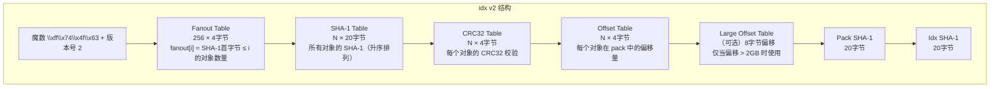
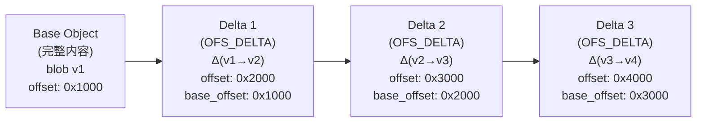
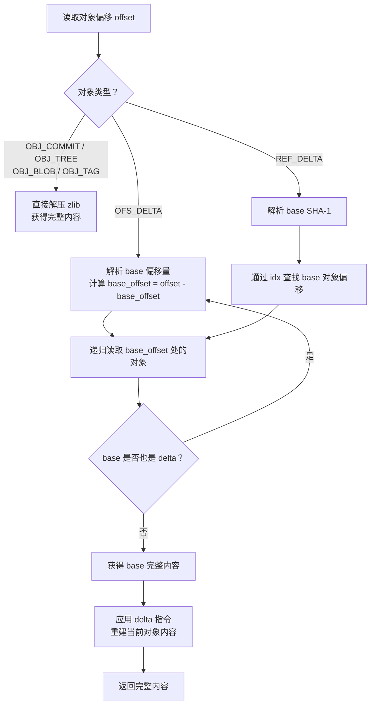
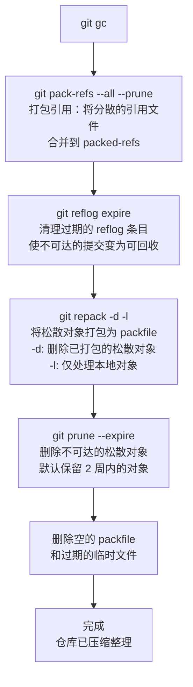
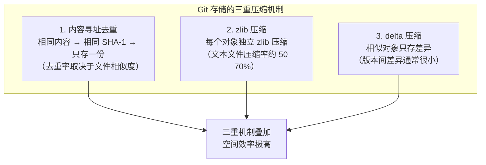
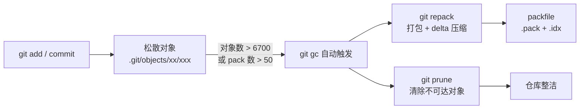

# 存储与压缩

在前面的章节中，我们已经了解了 Git 的四种基本对象（blob、tree、commit、tag）以及它们如何构成版本快照。但一个关键问题尚未回答：Git 是如何将这些对象**持久化到磁盘**的？为什么一个拥有数万个提交、数万个文件的仓库，其 `.git` 目录的大小通常仍然只有几十 MB？

答案藏在本章要讨论的三重机制中：**内容寻址去重**、**zlib 压缩**和 **delta 压缩**。这三重机制层层叠加，构成了 Git 存储引擎的效率根基。理解它们，不仅是理解 Git 性能特征的关键，也是理解 `git gc`、`git repack` 等维护命令以及 Git LFS 存在意义的必要前提。

---

## 1. 松散对象（Loose Objects）

### 1.1 对象的磁盘布局

当你执行 `git add` 或 `git commit` 时，Git 会将新产生的对象写入 `.git/objects/` 目录。每个对象以**松散（loose）**的形式单独存储为一个文件。文件的路径由对象的 SHA-1 哈希值决定——前两个字符作为目录名，剩余 38 个字符作为文件名：

```
.git/objects/
├── 3b/                    # 前 2 位：3b
│   └── 18e512dba79e4c8300dd08aeb37f8e728b8dad  # 后 38 位
├── 8b/
│   └── 6c0f8b0f3e6a3d0e2b1a4c5d6e7f8a9b0c1d2e
├── pack/                  # packfile 目录（稍后讨论）
│   └── ...
└── info/
    └── ...
```

以哈希值 `3b18e512dba79e4c8300dd08aeb37f8e728b8dad` 为例，它对应的文件路径就是 `.git/objects/3b/18e512dba79e4c8300dd08aeb37f8e728b8dad`。

这种两层目录结构并非偶然——它将前两位作为桶（bucket），避免了在 `objects/` 目录下产生数以万计的文件条目，从而保证文件系统在遍历目录时的效率。

### 1.2 zlib 压缩

松散对象并非以原始内容直接写入磁盘，而是经过 **zlib 压缩**后存储。zlib 是一种基于 DEFLATE 算法的无损压缩库，Git 使用它对每一个对象的内容进行压缩后再写入文件。

文件的实际内容格式如下：

```
[对象类型] [空格] [内容长度] \0 [内容]
```

例如，一个内容为 `hello world\n` 的 blob 对象，其压缩前的原始数据为：

```
blob 12\0hello world\n
```

这段头部信息 + 内容经过 zlib 压缩后，才写入磁盘文件。你可以用以下命令验证：

```bash
# 查看松散对象的类型
$ git cat-file -t 3b18e51
blob

# 查看松散对象的内容（自动解压）
$ git cat-file -p 3b18e51
hello world

# 直接用 python 解压查看原始格式
$ python3 -c "
import zlib
with open('.git/objects/3b/18e512dba79e4c8300dd08aeb37f8e728b8dad', 'rb') as f:
    data = zlib.decompress(f.read())
    print(data)
"
b'blob 12\x00hello world\n'
```

zlib 压缩为松散对象提供了第一层压缩。对于文本文件，压缩率通常可达 50%-70%；但对于已经很小的对象（几十字节），压缩效果有限，甚至压缩后的体积可能略大于原始内容（zlib 头部开销）。

### 1.3 松散对象的问题

松散对象的存储方式简单直接，但随着仓库使用时间的增长，会产生两个严重问题：

1. **文件数量膨胀**：每次提交都会产生新的对象文件。一个活跃的仓库可能有数万甚至数十万个松散对象文件，每个文件占用一个 inode，严重影响文件系统性能。
2. **磁盘空间浪费**：每个松散对象都是独立压缩的，无法利用对象之间的相似性进行跨对象压缩。两个内容几乎相同的 blob（例如只改了一行的文件），会各自完整存储一份。

为了解决这两个问题，Git 引入了 **packfile** 机制。

---

## 2. Packfile 机制

### 2.1 概述

Packfile 是 Git 将多个松散对象**合并打包**为一个文件的机制。一个 packfile 由两个文件组成：

| 文件 | 作用 |
|------|------|
| `pack-<hash>.pack` | **数据文件**，按顺序存储所有打包的对象 |
| `pack-<hash>.idx` | **索引文件**，记录每个对象的 SHA-1 及其在 pack 文件中的偏移量 |

它们位于 `.git/objects/pack/` 目录下：

```
.git/objects/pack/
├── pack-a1b2c3d4e5f6...pack
└── pack-a1b2c3d4e5f6...idx
```

两个文件的哈希后缀相同，表示它们是一对。

### 2.2 pack 数据文件

`.pack` 文件的内部结构如下：


每个对象的编码格式为：

```
[类型(3bit)] [长度(变长编码)] [zlib压缩的数据]
```

对象类型使用 3 bit 编码，共有以下几种：

| 类型编码 | 类型名称 | 说明 |
|---------|---------|------|
| 1 | OBJ_COMMIT | commit 对象 |
| 2 | OBJ_TREE | tree 对象 |
| 3 | OBJ_BLOB | blob 对象 |
| 4 | OBJ_TAG | tag 对象 |
| 6 | OBJ_OFS_DELTA | 偏移引用的 delta 对象 |
| 7 | OBJ_REF_DELTA | SHA-1 引用的 delta 对象 |

类型 1-4 是完整存储的对象，类型 6-7 是 delta 对象（下一节详述）。

### 2.3 pack 索引文件

`.idx` 文件是 packfile 的索引，其结构经历了两个版本，当前使用的是 v2 格式：



**查找对象的过程**采用二分查找：

1. **Fanout 定位范围**：取目标 SHA-1 的首字节作为索引，从 Fanout Table 中得到该首字节对应的对象在 SHA-1 Table 中的起止范围。
2. **二分查找 SHA-1**：在 SHA-1 Table 的对应范围内进行二分查找，定位到目标对象。
3. **获取偏移量**：找到对象在 SHA-1 Table 中的序号后，用该序号在 Offset Table 中查到对象在 `.pack` 文件中的偏移量。
4. **读取对象**：根据偏移量从 `.pack` 文件中读取对象数据。

这种设计的查询时间复杂度为 O(log N)，即使 pack 中包含数百万个对象，查找也极为高效。

---

## 3. Delta 链：差异压缩

### 3.1 为什么需要 delta

仅靠 zlib 压缩和合并打包，无法解决一个核心问题：**相似对象之间的冗余**。

考虑一个常见场景——你修改了 `main.py` 中的一个函数，然后提交。这次修改产生了一个新的 blob 对象，但新 blob 和旧 blob 之间可能只有几行不同，其余数百行完全一样。如果两个 blob 各自独立压缩存储，大部分数据被重复保存了两次。

Delta 压缩的思想是：不存储对象的完整内容，而是**只存储它和另一个对象（base object）之间的差异**。

### 3.2 OFS_DELTA 与 REF_DELTA

Git 的 packfile 中有两种 delta 编码方式：

| 类型 | 引用方式 | 说明 |
|------|---------|------|
| **OFS_DELTA** (OBJ_OFS_DELTA, 类型码 6) | 偏移量引用 | delta 对象通过一个**相对于自身在 pack 中位置的负偏移量**来引用 base object |
| **REF_DELTA** (OBJ_REF_DELTA, 类型码 7) | SHA-1 引用 | delta 对象通过 base object 的 **20 字节 SHA-1 哈希**来引用 |

两者的关键区别：

- **OFS_DELTA** 更紧凑：偏移量使用变长编码，通常只需几个字节，远小于 20 字节的 SHA-1。但它要求 base object 必须在**同一个 packfile** 中，且偏移量小于当前对象。
- **REF_DELTA** 更灵活：base object 可以在任意位置（甚至不在同一个 pack 中），但 20 字节的 SHA-1 引用占用更多空间。

由于 OFS_DELTA 更节省空间，Git 在本地打包时**优先使用 OFS_DELTA**；REF_DELTA 主要用于网络传输协议中（当发送方不知道对象在 pack 中的确切偏移时）。

### 3.3 Delta 链的结构

Delta 可以链式叠加——一个 delta 的 base object 本身也可以是一个 delta，从而形成 **delta 链**：



上图展示了一条长度为 3 的 delta 链：

- **Base Object**（blob v1）：存储完整内容，是 delta 链的起点。
- **Delta 1**：存储从 v1 到 v2 的差异（Δ(v1→v2)），通过偏移量引用 base object。
- **Delta 2**：存储从 v2 到 v3 的差异（Δ(v2→v3)），通过偏移量引用 Delta 1。
- **Delta 3**：存储从 v3 到 v4 的差异（Δ(v3→v4)），通过偏移量引用 Delta 2。

> **注意**：delta 链的方向不一定是"从旧到新"。Git 在选择 base object 时，会挑选与当前对象最相似的对象作为 base，而不论其时间先后。因此 delta 链可能指向任意方向。


### 3.4 Delta 的编码格式

一个 delta 对象的数据部分由两部分组成：

```
[base 对象大小（变长编码）] [result 对象大小（变长编码）] [指令序列]
```

指令序列包含两种类型的指令：

1. **COPY 指令**（从 base 对象复制一段数据）：
   - 格式：`[指令字节] [偏移量] [长度]`
   - 含义：从 base 对象的指定偏移量处，复制指定长度的数据到结果中

2. **INSERT 指令**（插入新数据）：
   - 格式：`[指令字节] [数据...]`
   - 含义：将指定的新数据直接插入到结果中

例如，假设 base 对象的内容为 `"Hello, world!"`，而目标对象的内容为 `"Hello, Git!"`，则 delta 指令可以编码为：

```
COPY  offset=0, length=7    # 复制 "Hello, "
INSERT "Git!"               # 插入 "Git!"
```

### 3.5 Delta 链的重建过程

读取一个 delta 对象时，Git 需要从 base object 开始，逐步应用 delta 指令来还原完整内容：



重建过程的关键点：

- **递归展开**：如果 base object 本身也是 delta，需要递归地先重建 base object，然后再应用当前 delta。
- **链深度限制**：delta 链越长，读取一个对象所需的计算量就越大。Git 默认将 delta 链深度限制在 **50 层**（由 `pack.depth` 配置项控制），在空间效率和访问速度之间取得平衡。
- **缓存**：Git 会在内存中缓存最近重建的对象，避免对同一链的重复展开。

---

## 4. git gc：垃圾回收机制

### 4.1 为什么需要垃圾回收

在 Git 的日常操作中，会产生各种"孤儿"对象——它们不再被任何引用（分支、标签、reflog）可达，却仍然占据磁盘空间：

- 被废弃的分支提交
- `git reset` 后不再被引用的提交
- `git rebase` 产生的旧提交
- 失败的合并产生的临时对象
- `git add` 后又修改但未提交的暂存对象

此外，随着松散对象数量增长，仓库的文件系统开销也会增大。`git gc` 就是用来解决这些问题的。

### 4.2 自动触发条件

Git 会在许多命令执行后自动检查是否需要运行 `git gc --auto`。自动触发的条件由以下配置项控制：

| 配置项 | 默认值 | 含义 |
|--------|--------|------|
| `gc.auto` | 6700 | 松散对象数量超过此值时触发打包 |
| `gc.autoPackLimit` | 50 | packfile 数量超过此值时触发合并 |
| `gc.autoDetach` | true | 自动 gc 是否在后台运行 |

也就是说，当松散对象超过约 6700 个，或 packfile 超过 50 个时，Git 会自动在后台执行垃圾回收。这就是为什么你可能从未手动运行过 `git gc`，但仓库依然保持整洁的原因。

### 4.3 gc 的完整流程



以下是各步骤的详细说明：

#### 步骤 1：打包引用（pack-refs）

Git 的引用（分支、标签）存储在 `.git/refs/` 目录下，每个引用一个文件。当引用数量增多时，目录遍历变慢。`git pack-refs` 将所有引用合并写入一个 `packed-refs` 文件中，并删除原始的单独引用文件。

```
# 打包前
.git/refs/
├── heads/
│   ├── main
│   ├── feature-a
│   └── feature-b
└── tags/
    └── v1.0

# 打包后
.git/packed-refs    # 包含所有引用的文本文件
```

#### 步骤 2：过期 reflog

reflog 记录了引用的变更历史，它使得即使提交不再被任何分支指向，仍然可以通过 reflog 找回。`git reflog expire` 会删除过期的 reflog 条目（默认 90 天），使得这些提交真正变为"不可达"对象，从而可以在后续步骤中被清除。

#### 步骤 3：重新打包（repack）

`git repack` 是 gc 的核心步骤，它将所有松散对象打包为新的 packfile，并删除已打包的松散对象。如果存在多个 packfile，还会将它们合并为一个。这一步会自动应用 delta 压缩。

#### 步骤 4：清除不可达对象（prune）

`git prune` 删除所有不被任何引用可达的松散对象。为了安全，它默认有一个 2 周的宽限期——即只删除超过 2 周的不可达对象，防止误删刚被操作但仍有可能被恢复的对象。

#### 步骤 5：清理碎片

删除空的 packfile、过期的临时文件等。

### 4.4 手动执行 gc

```bash
# 手动执行完整的垃圾回收
git gc

# 更激进的 delta 优化（强制重算 delta 并增大 window，耗时更长）
git gc --aggressive

# 仅在满足条件时执行（与自动 gc 相同）
git gc --auto

# 只清理，不打包（调试用）
git prune --expire=now
```

`--aggressive` 选项会花费更多时间来优化 delta 压缩——它会重新计算所有对象的 delta 链，寻找更优的 base object 选择。通常在克隆一个仓库后执行一次 `git gc --aggressive` 可以获得更好的压缩效果，但日常使用不必加此选项。

---

## 5. git repack：手动重组 packfile

### 5.1 基本用法

`git repack` 可以在不运行完整 gc 的情况下重组 packfile：

```bash
# 将所有松散对象打包为一个新的 packfile
git repack

# 打包松散对象，并将所有 packfile 合并为一个
git repack -a

# 同 -a，但额外删除冗余的 packfile
git repack -a -d

# 仅处理本地独有的对象（不涉及从远程获取的 pack）
git repack -l

# 更激进的 delta 压缩（等同于 gc --aggressive 的打包策略）
git repack -a -d --depth=50 --window=250
```

### 5.2 repack 的 delta 优化参数

`git repack`（以及 `git gc`）的 delta 压缩质量受两个关键参数影响：

| 参数 | 默认值 | 含义 |
|------|--------|------|
| `pack.depth` | 50 | delta 链的最大深度 |
| `pack.window` | 10 | 搜索 base object 的窗口大小 |

**window** 的含义是：对于每个待打包的对象，Git 会将它与排序后的候选对象中取出的 window 个对象进行比较，从中选择差异最小的作为 base object。增大 window 可以找到更好的 base（更好的压缩率），但打包时间也会显著增加。

**depth** 的含义是：delta 链的最大长度。增大 depth 允许更长的 delta 链（更好的压缩率），但读取对象时需要更多的展开步骤（更慢的访问速度）。

```bash
# 日常使用默认值即可
# 以下仅在需要极致压缩时使用（例如发布仓库前）
git repack -a -d --depth=50 --window=250
```

### 5.3 repack 与 gc 的关系

`git gc` 内部调用了 `git repack`，可以理解为 `git gc` = `git pack-refs` + `git reflog expire` + `git repack -a -d` + `git prune`。因此，如果你只需要重组 packfile 而不想执行完整的 gc 流程，可以单独使用 `git repack`。

---


## 6. 为什么 Git 仓库通常很小

理解了上述机制后，我们可以总结出 Git 仓库保持小巧的三重保障：



### 6.1 内容寻址去重

由于 Git 使用 SHA-1 哈希作为对象地址，**内容相同的对象只会在仓库中存储一份**。这意味着：

- 多个目录中引用的同一个文件（内容完全相同），只产生一个 blob 对象。
- 文件没有被修改的提交中，该文件对应的 blob 被复用，不会创建新对象。

一个典型例子：仓库中有 100 个提交，其中 `README.md` 只在 3 个提交中被修改过。那么这 100 个提交中，`README.md` 只产生了 3 个 blob 对象，其余 97 次都复用了已有的 blob。

### 6.2 zlib 压缩

每个对象（无论是松散对象还是 packfile 中的对象）都经过 zlib 压缩。对于源代码等文本内容，压缩率通常在 50%-70% 之间。

### 6.3 delta 压缩

在 packfile 中，相似对象之间通过 delta 只存储差异。对于版本迭代频繁的文件，delta 压缩的效果极为显著——一个 100KB 的文件修改了一行，delta 可能只需要几十个字节。

### 6.4 综合效果

三重机制叠加后，效果惊人。以 Linux 内核为例：

| 指标 | 数值 |
|------|------|
| 仓库提交数 | 100 万+ |
| 源文件数 | 7 万+ |
| 检出大小（工作区） | ~3 GB |
| `.git` 目录大小 | ~3 GB |
| 如果不做 delta 压缩 | ~30 GB+ |
| 如果不做任何压缩 | ~100 GB+ |

delta 压缩贡献了约 10 倍的空间节省，zlib 压缩又贡献了约 3 倍，内容去重进一步减少了冗余。三层叠加后，Git 仓库的磁盘占用远小于原始数据量。

> 注：上表为示意数值（非精确实测数据），仅用于说明各机制的量级差异。

---

## 7. 大文件的问题：为什么 Git 仓库也会膨胀

三重压缩机制对**文本文件**极为有效，但对**大文件**（尤其是二进制文件）却力不从心：

### 7.1 delta 压缩失效

Delta 压缩的前提是"两个对象之间有大量相似内容"。对于二进制文件（图片、视频、编译产物等），即使只做了微小修改（如修改了一张图片的一个像素），二进制层面的差异也可能非常大，甚至遍布整个文件。此时 delta 压缩几乎无法产生有意义的压缩效果，每个版本都需要完整存储。

### 7.2 zlib 压缩有限

许多二进制格式本身就是压缩的（JPEG、PNG、MP4、zip 等），zlib 对它们几乎无能为力——压缩后的体积和原始体积相差无几。

### 7.3 内容去重无用

如果每次提交大文件都有变化，不同版本之间内容不同，SHA-1 哈希也不同，内容去重就无法发挥作用。

### 7.4 膨胀的例子

假设仓库中有一个 50MB 的 PSD 文件，每次提交修改了一点内容：

| 提交次数 | 存储 delta（文本） | 存储 delta（二进制 PSD） |
|---------|-------------------|----------------------|
| 1 次 | 50 MB | 50 MB |
| 10 次 | ~50 MB + 几 KB delta | ~500 MB（每次完整存储） |
| 100 次 | ~50 MB + 几十 KB delta | ~5 GB（每次完整存储） |

### 7.5 解决方案：Git LFS

Git LFS（Large File Storage）是解决大文件问题的标准方案。其核心思路是：

- 在 Git 仓库中只存储一个**轻量的指针文件**（几百字节），记录大文件的哈希和大小。
- 大文件的实际内容存储在**独立的 LFS 服务器**上。
- 检出时，Git LFS 根据指针文件从远程服务器下载实际文件。

这样，大文件的每个版本不会导致仓库膨胀——仓库中只有指针文件，而指针文件之间可以高效地进行 delta 压缩。

```bash
# 安装 Git LFS
git lfs install

# 跟踪大文件类型
git lfs track "*.psd"
git lfs track "*.mp4"

# 提交 .gitattributes
git add .gitattributes
git commit -m "Configure Git LFS"

# 之后正常 add/commit，LFS 会自动处理
git add large-image.psd
git commit -m "Add design file"
```

---

## 8. 小结

| 机制 | 作用 | 效果 |
|------|------|------|
| **内容寻址去重** | 相同内容只存一份 | 消除跨文件、跨提交的冗余 |
| **zlib 压缩** | 每个对象独立压缩 | 文本文件压缩率 50-70% |
| **delta 压缩** | 相似对象只存差异 | 版本间差异极小时效果显著 |
| **packfile** | 合并松散对象为单个文件 | 减少文件数量，支持 delta |
| **git gc** | 自动整理仓库 | 打包 + 清除 + 重组 |
| **Git LFS** | 大文件指针存储 | 避免二进制文件膨胀 |

Git 存储引擎的核心设计哲学是：**用 CPU 时间换取磁盘空间**。delta 压缩在写入时需要计算差异、在读取时需要重建内容，但这些计算开销在大多数场景下是值得的——磁盘空间更昂贵，而 CPU 重建 delta 的速度对人类感知来说仍然极快。

然而，当 delta 链过长或仓库中存在大量二进制文件时，这种权衡就会失衡。理解这些机制的边界条件，才能在遇到仓库性能问题时做出正确的诊断和决策。



