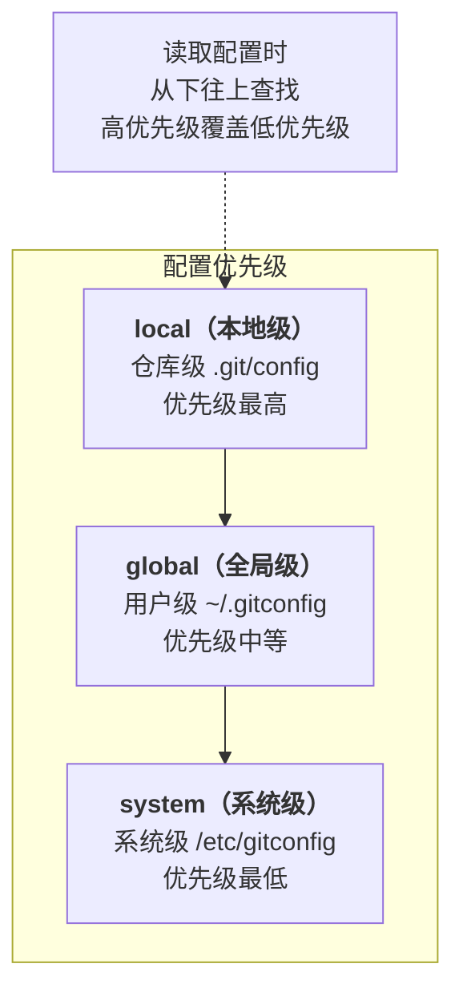
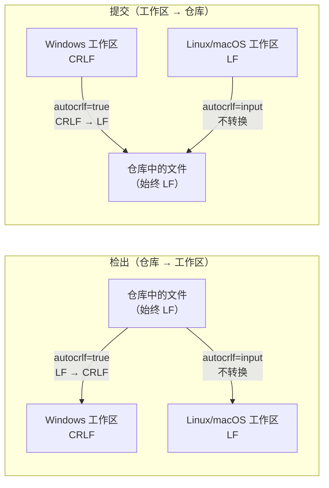
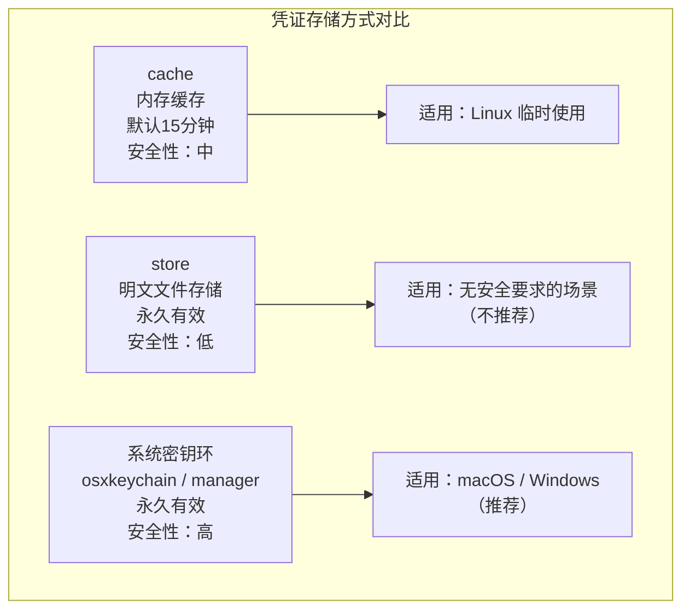

# Git 安装与初始配置

在理解了版本控制系统的基本概念之后，下一步就是亲手搭建 Git 的工作环境。Git 的安装本身并不复杂，但初始配置却大有讲究——一个合理的配置不仅能避免后续使用中的诸多坑（比如跨平台换行符冲突、中文文件名乱码），还能显著提升日常工作效率。本章将从安装到配置，系统性地完成 Git 环境的搭建。

## 各平台安装方式

Git 是跨平台的工具，在 macOS、Linux 和 Windows 上均可运行，但各平台的安装方式和附带工具略有差异。

### macOS

macOS 上安装 Git 主要有两种方式：

**方式一：Xcode Command Line Tools（推荐入门用户）**

macOS 并没有预装 Git，但 Apple 提供的 Command Line Tools 包含了 Git。只需在终端执行：

```bash
xcode-select --install
```

系统会弹出安装对话框，按提示完成即可。这种方式安装的 Git 版本由 Apple 维护，通常略滞后于官方最新版，但对大多数用户已经足够。

**方式二：Homebrew（推荐开发者）**

Homebrew 是 macOS 上最流行的包管理器，通过它安装的 Git 版本更新更及时：

```bash
# 如果尚未安装 Homebrew，先执行：
/bin/bash -c "$(curl -fsSL https://raw.githubusercontent.com/Homebrew/install/HEAD/install.sh)"

# 安装 Git
brew install git
```

Homebrew 的优势在于后续可以方便地升级：

```bash
brew upgrade git
```

> **两种方式的冲突问题**：如果同时安装了 Xcode Command Line Tools 和 Homebrew 的 Git，系统默认使用的可能是 Xcode 版本。可以用 `which git` 查看当前使用的是哪个，用 `brew link --overwrite git` 将 Homebrew 版本设为默认。

### Linux

Linux 发行版众多，但主流的包管理器都能直接安装 Git。

**Debian/Ubuntu（apt）**：

```bash
sudo apt update
sudo apt install git
```

**Fedora/RHEL/CentOS（dnf/yum）**：

```bash
# Fedora / RHEL 8+ / CentOS 8+
sudo dnf install git

# RHEL 7 / CentOS 7
sudo yum install git
```

**Arch Linux（pacman）**：

```bash
sudo pacman -S git
```

> **源码编译安装**：如果需要特定版本或官方仓库中的版本过旧，可以从 [git-scm.com](https://git-scm.com/) 下载源码自行编译。编译依赖 `libcurl`、`zlib`、`openssl`、`expat`、`libiconv` 等库，具体步骤请参考源码中的 `INSTALL` 文档。对于大多数用户，包管理器安装已经足够。

### Windows

Windows 上安装 Git 的标准方式是使用 **Git for Windows**，它是一个独立的安装包，内含：

- Git 核心程序
- MinGW（Minimalist GNU for Windows），提供类 Unix 的 bash 终端环境
- Git Bash：一个仿 bash 的命令行终端
- Git GUI：图形化界面工具
- Shell 集成：右键菜单快捷入口

**安装步骤**：

1. 从 [gitforwindows.org](https://gitforwindows.org/) 或 [git-scm.com](https://git-scm.com/download/win) 下载安装包
2. 运行安装程序，关键选项说明：
   - **安装路径**：建议保持默认，路径中避免中文和空格
   - **组件选择**：建议勾选 "Git Bash Here" 和 "Git GUI Here" 以获得右键菜单集成
   - **默认编辑器**：可选择 Vim、Nano、VS Code 等（后续可通过配置修改）
   - **PATH 环境**：推荐选择 "Git from the command line and also from 3rd-party software"，这样既能在 Git Bash 中使用，也能在 CMD/PowerShell 中使用
   - **SSH 可执行文件**：推荐使用 OpenSSH
   - **换行符转换**：这个选项至关重要，后文会深入分析

**替代方案：winget / Chocolatey / Scoop**

```powershell
# winget（Windows 10 1709+ 自带）
winget install Git.Git

# Chocolatey
choco install git

# Scoop
scoop install git
```

## 验证安装

安装完成后，打开终端（macOS/Linux 为 Terminal，Windows 为 Git Bash 或 PowerShell），执行：

```bash
git --version
```

如果安装成功，会输出类似以下信息：

```
git version 2.47.0
```

如果提示 `command not found` 或 `git 不是内部或外部命令`，说明 Git 未被正确加入 PATH 环境变量，需要检查安装过程或手动添加。

还可以进一步验证 Git 的安装路径和来源：

```bash
# 查看 Git 可执行文件的位置
which git        # macOS / Linux
where git        # Windows PowerShell

# 查看 Git 的详细构建信息
git --build-options
```

## git config 三级配置体系

Git 的配置系统采用三级层次结构，不同层级的配置具有不同的作用范围和优先级。理解这个体系是掌握 Git 配置的关键。

### 三个层级

| 层级 | 选项 | 存储位置 | 作用范围 | 适用场景 |
|------|------|----------|----------|----------|
| 系统级 | `--system` | `/etc/gitconfig`（Linux/macOS）或 `C:\Program Files\Git\etc\gitconfig`（Windows） | 对本机所有用户的所有仓库生效 | 系统管理员统一设置 |
| 全局级 | `--global` | `~/.gitconfig` 或 `~/.config/git/config` | 对当前用户的所有仓库生效 | 个人通用配置 |
| 本地级 | `--local` | 仓库根目录下的 `.git/config` | 仅对当前仓库生效 | 项目特定配置 |

### 优先级规则

当不同层级的配置项发生冲突时，**优先级从高到低为：local > global > system**。即本地级配置会覆盖全局级，全局级会覆盖系统级。



这个优先级设计遵循了"就近原则"——越具体的范围拥有越高的决定权。一个实际的使用场景是：你全局配置了 `user.name = 张三`，但在某个公司项目中需要使用英文名，就可以在该项目的本地配置中设置 `user.name = Zhang San`，这样在这个项目中的提交就会使用英文名，而不影响其他项目。

### 配置操作命令

```bash
# 查看所有配置（合并三个层级，显示最终生效值）
git config --list

# 查看某个配置项的值
git config user.name

# 查看配置的来源（哪个层级设置的）
git config --show-origin user.name

# 设置系统级配置（需要管理员权限）
git config --system core.quotepath false

# 设置全局级配置（最常用）
git config --global user.name "Zhang San"

# 设置本地级配置（仅对当前仓库生效）
git config --local user.name "San Zhang"

# 删除某个配置项
git config --global --unset user.name
```

> **提示**：`git config --list` 可能会显示重复的键名，这是因为不同层级设置了同名配置。此时最终生效值以最高优先级的为准。使用 `git config <key>` 查看单项时，Git 会自动返回最终生效值。

## 必要配置项详解

安装 Git 后，有几项配置是必须或强烈建议设置的，它们直接影响你的日常使用体验。

### user.name 和 user.email

这是最重要的两项配置。Git 的每一次提交都会记录作者信息，而作者信息就来自这两项配置：

```bash
git config --global user.name "Zhang San"
git config --global user.email "zhangsan@example.com"
```

> **关键注意**：`user.email` 必须与你 GitHub/GitLab 账号绑定的邮箱一致，否则你的提交将无法与你的账号关联，在平台上会显示为未知贡献者。如果你在 GitHub 上使用了邮箱隐私保护功能（noreply 邮箱），则应配置 GitHub 提供的 noreply 地址。


### core.editor

Git 在执行 commit、rebase 等操作时需要打开文本编辑器让你编写提交信息。默认编辑器取决于系统环境（通常是 Vi/Vim），你可以修改为自己习惯的编辑器：

```bash
# 使用 VS Code
git config --global core.editor "code --wait"

# 使用 Vim
git config --global core.editor "vim"

# 使用 Nano
git config --global core.editor "nano"

# macOS 上使用 Sublime Text
git config --global core.editor "subl -n -w"

# Windows 上使用 Notepad++
git config --global core.editor "'C:/Program Files/Notepad++/notepad++.exe' -multiInst -notabbar -nosession -noPlugin"
```

`--wait`（或 `-w`）参数的作用是让终端等待编辑器关闭后再继续执行 Git 命令。如果不加这个参数，Git 会在编辑器启动后立即认为编辑已完成，导致提交失败。

### core.autocrlf —— 跨平台换行符问题深入分析

这是跨平台协作中最容易踩坑的配置项，值得深入理解。

**问题根源**：不同操作系统使用不同的换行符：

| 操作系统 | 换行符 | 表示 | ASCII |
|----------|--------|------|-------|
| Windows | CRLF（回车+换行） | `\r\n` | 0x0D 0x0A |
| macOS/Linux | LF（换行） | `\n` | 0x0A |
| 旧版 macOS（9 及之前） | CR（回车） | `\r` | 0x0D |

当 Windows 用户和 Linux/macOS 用户协作时，如果不做处理，就会出现：仓库中混杂着 CRLF 和 LF 的文件，`git diff` 显示每行都有差异（即使内容实际相同），甚至引发难以排查的 bug。

**core.autocrlf 的工作机制**：



**各平台推荐配置**：

```bash
# Windows 用户
git config --global core.autocrlf true
# 效果：提交时 CRLF → LF，检出时 LF → CRLF

# macOS/Linux 用户
git config --global core.autocrlf input
# 效果：提交时 CRLF → LF（如有），检出时不转换
```

**更精细的控制：.gitattributes**

`core.autocrlf` 是全局性的粗粒度控制，而 `.gitattributes` 文件可以做到按文件类型精确控制，且配置随仓库提交，确保所有协作者行为一致：

```gitattributes
# 文本文件：自动规范化换行符（入库 LF，出库按平台）
* text=auto

# 明确指定文件类型
*.c text
*.h text
*.py text
*.js text
*.html text
*.css text
*.md text
*.txt text
*.json text
*.yml text
*.xml text
*.sh text eol=lf        # Shell 脚本必须使用 LF
*.bat text eol=crlf     # Windows 批处理必须使用 CRLF

# 二进制文件：不做任何转换
*.png binary
*.jpg binary
*.gif binary
*.pdf binary
*.zip binary
*.exe binary
*.woff binary
*.woff2 binary
```

> **最佳实践**：在项目中使用 `.gitattributes` 而非依赖每个人的 `core.autocrlf` 配置。`.gitattributes` 被纳入版本控制，能确保团队所有成员的行为一致，从根本上消除换行符问题。

### 其他推荐配置

```bash
# 让 git log 正确显示中文路径（而非 \xxx 转义形式）
git config --global core.quotepath false

# 在 git log 中使用更易读的日期格式
git config --global log.date iso8601

# 推送时只推送当前分支（而非所有跟踪分支）
git config --global push.default simple

# 拉取时使用 rebase 而非 merge，保持提交历史线性
git config --global pull.rebase true

# 设置默认分支名为 main（而非 master）
git config --global init.defaultBranch main
```

## .gitconfig 文件结构解析

`git config` 命令本质上是在读写 INI 格式的配置文件。直接编辑配置文件有时比逐条命令更高效。全局配置文件位于 `~/.gitconfig`，其结构如下：

```ini
# ===== 用户信息 =====
[user]
    name = Zhang San
    email = zhangsan@example.com

# ===== 核心设置 =====
[core]
    editor = code --wait
    autocrlf = input
    quotepath = false
    # 忽略文件权限变更（适用于 Windows 挂载的 Linux 文件系统等场景）
    filemode = false

# ===== 别名 =====
[alias]
    st = status
    co = checkout
    br = branch
    ci = commit
    lg = log --color --graph --pretty=format:'%Cred%h%Creset -%C(yellow)%d%Creset %s %Cgreen(%cr) %C(bold blue)<%an>%Creset' --abbrev-commit

# ===== 推送设置 =====
[push]
    default = simple

# ===== 拉取设置 =====
[pull]
    rebase = true

# ===== 初始化设置 =====
[init]
    defaultBranch = main

# ===== 凭证管理 =====
[credential]
    helper = osxkeychain    # macOS
    # helper = manager      # Windows
    # helper = cache --timeout=3600  # Linux（缓存1小时）

# ===== 差异比较工具 =====
[diff]
    tool = vscode

[difftool "vscode"]
    cmd = code --wait --diff $LOCAL $REMOTE

# ===== 合并工具 =====
[merge]
    tool = vscode

[mergetool "vscode"]
    cmd = code --wait $MERGED

# ===== 颜色输出 =====
[color]
    ui = auto

[color "branch"]
    current = yellow reverse
    local = green
    remote = cyan

[color "diff"]
    meta = yellow bold
    frag = magenta bold
    old = red bold
    new = green bold

[color "status"]
    added = green bold
    changed = yellow bold
    untracked = red bold
```

> **技巧**：你可以使用 `git config --global --edit` 直接在编辑器中打开并编辑全局配置文件，也可以用 `cat ~/.gitconfig` 查看其内容。本地配置文件 `.git/config` 的格式完全相同，只是作用范围限于当前仓库。

## SSH 密钥配置

与远程仓库通信有两种方式：HTTPS 和 SSH。SSH 方式配置一次后无需每次输入密码，是开发者的首选。


### 生成 SSH 密钥

```bash
# 使用 Ed25519 算法（推荐，更安全、密钥更短）
ssh-keygen -t ed25519 -C "zhangsan@example.com"

# 如果系统不支持 Ed25519（极少数旧系统），使用 RSA
ssh-keygen -t rsa -b 4096 -C "zhangsan@example.com"
```

执行后会提示：

```
Generating public/private ed25519 key pair.
Enter file in which to save the key (/Users/you/.ssh/id_ed25519):
```

按 Enter 使用默认路径即可。接着会提示设置密码短语（passphrase）：

```
Enter passphrase (empty for no passphrase):
Enter same passphrase again:
```

> **关于密码短语**：设置密码短语后，每次使用 SSH 密钥时都需要输入该短语。如果追求便捷可以留空，但更安全的做法是设置密码短语并配合 ssh-agent 使用（ssh-agent 只需在会话开始时输入一次密码短语）。

生成完成后，会在 `~/.ssh/` 目录下产生两个文件：

| 文件 | 说明 | 安全性 |
|------|------|--------|
| `id_ed25519` | 私钥 | **绝不能泄露**，不能离开本机 |
| `id_ed25519.pub` | 公钥 | 可以公开，需要添加到远程仓库 |

### 添加公钥到 GitHub / GitLab

**GitHub**：

1. 复制公钥内容：
   ```bash
   pbcopy < ~/.ssh/id_ed25519.pub     # macOS
   cat ~/.ssh/id_ed25519.pub          # Linux（手动复制输出）
   clip < ~/.ssh/id_ed25519.pub       # Windows Git Bash
   ```
2. 登录 GitHub → Settings → SSH and GPG keys → New SSH key
3. 粘贴公钥内容，设置一个便于识别的标题，点击 Add SSH key

**GitLab**：

流程类似：Preferences → SSH Keys → Add new key。

### 配置 SSH Agent

ssh-agent 是一个管理 SSH 密钥的守护进程，配置后可以避免每次使用密钥时都输入密码短语：

```bash
# 启动 ssh-agent
eval "$(ssh-agent -s)"

# 将私钥添加到 ssh-agent
ssh-add ~/.ssh/id_ed25519

# macOS 用户可以配置 Keychain 集成，将密码短语存储到 macOS 钥匙串
# 在 ~/.ssh/config 中添加：
# Host *
#   AddKeysToAgent yes
#   UseKeychain yes
#   IdentityFile ~/.ssh/id_ed25519
```

### 验证 SSH 连接

```bash
# 测试与 GitHub 的连接
ssh -T git@github.com

# 成功时会看到：
# Hi zhangsan! You've successfully authenticated, but GitHub does not provide shell access.

# 测试与 GitLab 的连接
ssh -T git@gitlab.com
```

如果首次连接会提示确认服务器指纹：

```
The authenticity of host 'github.com (20.205.243.166)' can't be established.
ED25519 key fingerprint is SHA256:xxxxx.
Are you sure you want to continue connecting (yes/no/[fingerprint])?
```

输入 `yes` 即可，之后服务器的指纹会被记录到 `~/.ssh/known_hosts`，后续连接不再提示。

### 多密钥管理

当你同时使用 GitHub、GitLab、公司内部 Git 服务器时，可能需要为不同服务配置不同的密钥。通过 `~/.ssh/config` 文件实现：

```sshconfig
# GitHub 个人账号
Host github.com
    HostName github.com
    User git
    IdentityFile ~/.ssh/id_ed25519_github

# GitLab 个人账号
Host gitlab.com
    HostName gitlab.com
    User git
    IdentityFile ~/.ssh/id_ed25519_gitlab

# 公司内部 Git 服务器
Host git.company.com
    HostName git.company.com
    User git
    Port 2222
    IdentityFile ~/.ssh/id_ed25519_company

# GitHub 工作账号（使用别名区分）
Host github-work
    HostName github.com
    User git
    IdentityFile ~/.ssh/id_ed25519_work
```

使用别名后，克隆工作仓库时需要将域名替换为别名：

```bash
# 原本：git clone git@github.com:company/project.git
# 改为：git clone git@github-work:company/project.git
```

## HTTPS 凭证管理

如果使用 HTTPS 方式与远程仓库通信，每次 push/pull 都需要输入用户名和密码（或 Personal Access Token），这非常繁琐。Git 提供了凭证管理器（credential helper）来自动处理认证。

### 各平台凭证管理器



**macOS —— osxkeychain**：

Git for macOS 通常自带 osxkeychain 支持，凭证会存储在 macOS 钥匙串中：

```bash
# 检查是否已支持 osxkeychain
git credential-osxkeychain

# 设置凭证管理器
git config --global credential.helper osxkeychain
```

**Windows —— Git Credential Manager**：

Git for Windows 2.x 自带 Git Credential Manager for Windows（新版为 Git Credential Manager Core），安装时默认启用。它会将凭证存储在 Windows Credential Manager 中：

```bash
# 查看当前凭证管理器
git config --global credential.helper

# 如果未设置，手动指定
git config --global credential.helper manager
```

**Linux —— cache 或 libsecret**：

```bash
# 方式一：内存缓存（默认缓存 15 分钟，可自定义时长）
git config --global credential.helper 'cache --timeout=3600'   # 缓存1小时

# 方式二：使用系统密钥环（需要 libsecret 支持）
# 先安装依赖
sudo apt install libsecret-1-0 libsecret-1-dev    # Debian/Ubuntu
sudo dnf install libsecret-devel                    # Fedora

# 编译 git-credential-libsecret
cd /usr/share/doc/git/contrib/credential/libsecret
sudo make

# 配置使用
git config --global credential.helper /usr/share/doc/git/contrib/credential/libsecret/git-credential-libsecret
```

### Personal Access Token（PAT）

GitHub 自 2021 年 8 月起不再接受账户密码进行 Git 操作认证，必须使用 Personal Access Token（PAT）替代密码：

1. 登录 GitHub → Settings → Developer settings → Personal access tokens → Generate new token
2. 选择所需的权限范围（scope），推荐最小权限原则
3. 生成并复制 token（**只显示一次**，务必保存）
4. 在 Git 操作需要密码时，粘贴 token 作为密码

配置了凭证管理器后，只需在第一次输入 token，之后凭证管理器会自动记住。


## 常用别名配置

Git 别名（alias）可以为常用命令创建简写，大幅减少键盘输入量。以下是经过实践验证的高效别名配置：

### 基础简写

```bash
git config --global alias.st status
git config --global alias.co checkout
git config --global alias.br branch
git config --global alias.ci commit
```

这四个别名源自 SVN 的习惯用法，是 Git 社区最广泛使用的别名。

### 增强型别名

```bash
# 简短状态（单行显示，含分支信息）
git config --global alias.sst 'status -sb'

# 美化的 log
git config --global alias.lg "log --color --graph --pretty=format:'%Cred%h%Creset -%C(yellow)%d%Creset %s %Cgreen(%cr) %C(bold blue)<%an>%Creset' --abbrev-commit"

# 查看最近 n 条提交（用法：git ln 5）
git config --global alias.ln '!git log -n'

# 单行显示所有提交
git config --global alias.oneline 'log --oneline'

# 查看某个文件的修改历史
git config --global alias.filelog 'log --follow -p'

# 查看暂存区和工作区的差异
git config --global alias.d diff
git config --global alias.ds 'diff --staged'
git config --global alias.dt 'difftool'

# 撤销上次提交（保留修改）
git config --global alias.undo 'reset HEAD~1 --mixed'

# 修改上次提交信息
git config --global alias.amend 'commit --amend'

# 查看所有别名
git config --global alias.aliases 'config --get-regexp alias'

# 查看仓库 URL
git config --global alias.remoteurl 'remote get-url origin'
```

### 外部命令别名

以 `!` 开头的别名可以执行外部 Shell 命令，这极大地扩展了别名的可能性：

```bash
# 查看当前分支的最近提交
git config --global alias.last '!git log -1 HEAD'

# 列出所有已合并到当前分支的本地分支（可安全删除）
git config --global alias.branches-merged '!git branch --merged'

# 删除所有已合并的本地分支
git config --global alias.clean-merged '!git branch --merged | grep -v "\\*\\|master\\|main\\|develop" | xargs -n 1 git branch -d'

# 查看仓库总行数统计
git config --global alias.linecount '!git ls-files | xargs wc -l'
```

> **注意**：外部命令别名中的 `!` 告诉 Git 这不是 Git 子命令，而是 Shell 命令。在 Shell 命令中引用 Git 子命令时需要写完整的 `git` 命令。

### 完整别名配置一览

将以上别名汇总到 `~/.gitconfig` 中：

```ini
[alias]
    # 基础简写
    st = status
    co = checkout
    br = branch
    ci = commit

    # 增强查看
    sst = status -sb
    lg = log --color --graph --pretty=format:'%Cred%h%Creset -%C(yellow)%d%Creset %s %Cgreen(%cr) %C(bold blue)<%an>%Creset' --abbrev-commit
    oneline = log --oneline
    filelog = log --follow -p

    # 差异比较
    d = diff
    ds = diff --staged
    dt = difftool

    # 操作快捷
    undo = reset HEAD~1 --mixed
    amend = commit --amend

    # 信息查询
    aliases = config --get-regexp alias
    remoteurl = remote get-url origin
```

## 小结

本章完成了 Git 从安装到配置的全过程，核心要点如下：

1. **安装**：macOS 推荐 Homebrew，Linux 使用系统包管理器，Windows 使用 Git for Windows。安装后务必用 `git --version` 验证。

2. **三级配置体系**：system / global / local 三级配置，优先级 local > global > system。日常使用以 global 为主，项目特殊需求用 local 覆盖。

3. **必要配置**：`user.name` 和 `user.email` 是必须项，`core.editor` 影响交互体验，`core.autocrlf` 解决跨平台换行符问题。推荐使用 `.gitattributes` 替代 `core.autocrlf` 做更精细的换行符控制。

4. **SSH 密钥**：推荐 Ed25519 算法，公钥添加到远程仓库，多密钥场景通过 `~/.ssh/config` 管理。

5. **HTTPS 凭证**：macOS 用 osxkeychain，Windows 用 Credential Manager，Linux 用 cache 或 libsecret。GitHub 需使用 PAT 替代密码。

6. **别名**：合理配置别名可以显著提升效率，从基础简写到外部命令别名，按需逐步添加。

配置完成后，你的 Git 环境已经就绪。下一章将正式进入 Git 的基本操作，开始用 Git 管理你的第一个项目。

