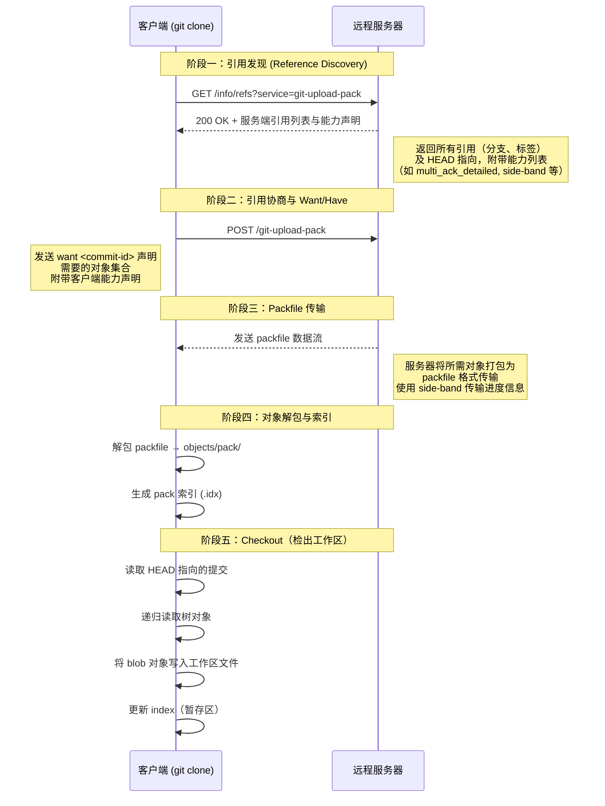
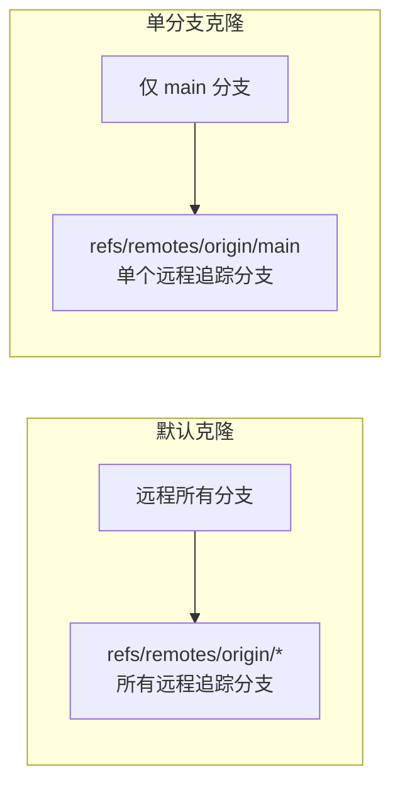
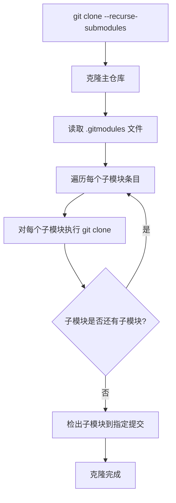
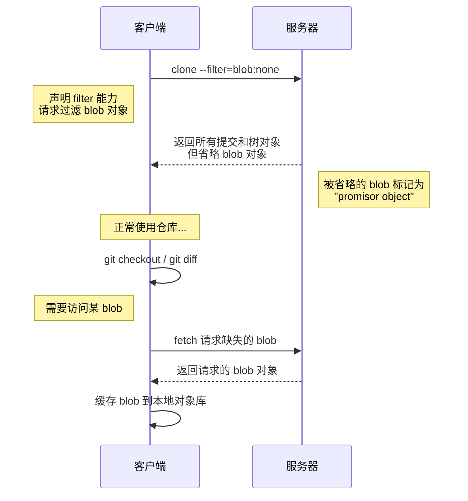
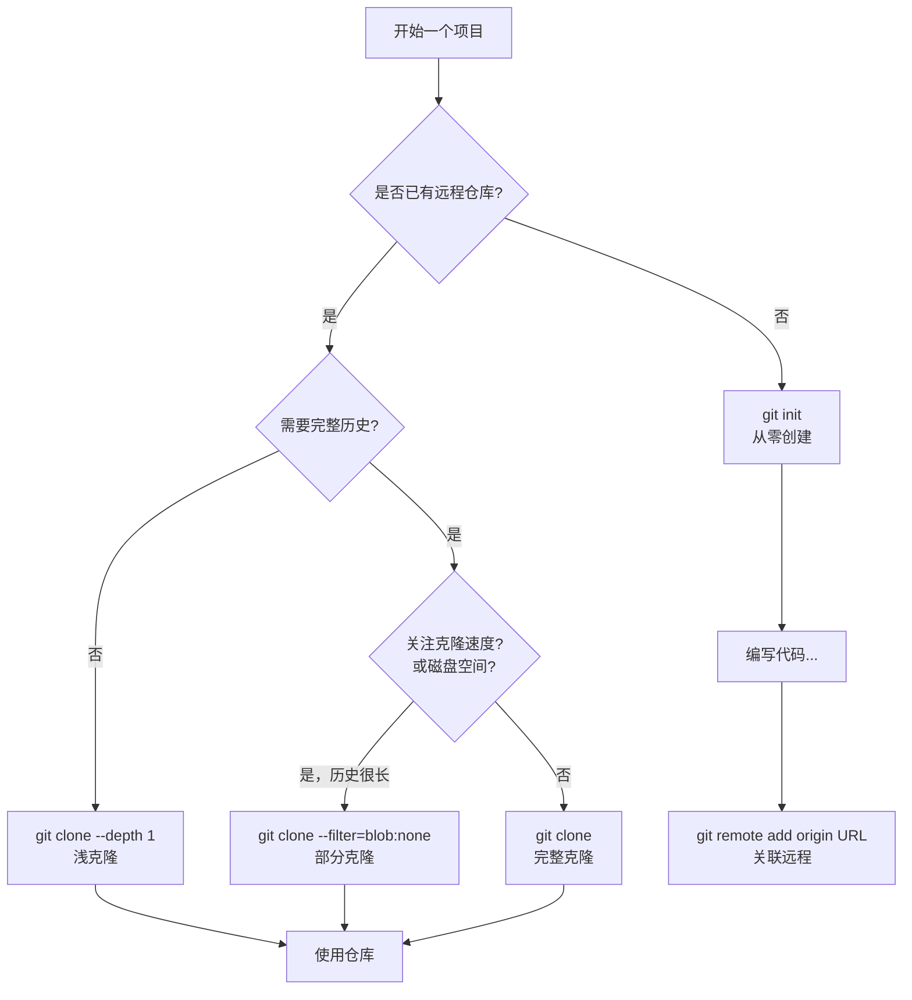

# 创建与克隆仓库

一切 Git 项目的起点，无非两种方式：从零开始创建一个全新的仓库（`git init`），或者从已有仓库克隆一份副本（`git clone`）。看似简单的两条命令，其背后涉及的机制却值得深入理解——尤其是 `git clone`，它不仅仅是一个"下载文件"的过程，而是一次完整的引用协商、对象传输与工作区构建的协议交互。

---

## 1. git init：从零创建仓库

### 1.1 基本用法

```bash
# 在当前目录创建 Git 仓库
git init

# 在指定目录创建 Git 仓库（目录不存在会自动创建）
git init /path/to/project

# 创建裸仓库（无工作区，通常用于服务器端）
git init --bare /path/to/repo.git
```

执行 `git init` 后，Git 会在当前目录下创建一个 `.git` 隐藏目录，并将该目录标记为一个 Git 仓库的根。此时仓库是**完全空的**——没有任何提交、没有任何分支（甚至没有 `master`/`main` 分支），HEAD 指向一个尚不存在的引用。

### 1.2 init 做了什么

`git init` 的操作极为轻量，其核心工作就是构建 `.git` 目录的初始骨架：

```bash
$ git init my-project
Initialized empty Git repository in /path/to/my-project/.git/
```

让我们查看它创建的完整结构：

```
.git/
├── HEAD                # 指向当前分支的符号引用
├── config              # 仓库级别的配置文件
├── description         # 仓库描述（仅供 GitWeb 使用，通常忽略）
├── hooks/              # 钩子脚本目录
│   ├── applypatch-msg.sample
│   ├── commit-msg.sample
│   ├── fsmonitor-watchman.sample
│   ├── post-update.sample
│   ├── pre-applypatch.sample
│   ├── pre-commit.sample
│   ├── pre-merge-commit.sample
│   ├── pre-push.sample
│   ├── pre-rebase.sample
│   ├── pre-receive.sample
│   ├── prepare-commit-msg.sample
│   ├── push-to-checkout.sample
│   └── update.sample
├── info/               # 附加信息
│   └── exclude         # 与 .gitignore 类似，但不会被提交到仓库
├── objects/            # 对象存储目录（Git 的核心数据库）
│   ├── pack/           # 打包对象目录（初始为空）
│   └── info/           # 对象信息目录（初始为空）
└── refs/               # 引用目录（指向提交的指针）
    ├── heads/          # 分支引用（初始为空）
    └── tags/           # 标签引用（初始为空）
```

几个关键文件的初始内容：

**HEAD** — 决定当前工作在哪个分支上：

```
ref: refs/heads/main
```

注意：此时 `refs/heads/main` 这个文件还不存在，HEAD 指向的是一个"尚未出生"的分支。直到第一次提交后，该引用文件才会被创建。

**config** — 仓库级别的 Git 配置：

```ini
[core]
    repositoryformatversion = 0
    filemode = true
    bare = false
    logallrefupdates = true
    ignorecase = true
    precomposeunicode = true
```

其中 `repositoryformatversion = 0` 表示使用最初的仓库格式版本。`logallrefupdates = true` 启用引用日志（reflog），记录分支的变更历史。`bare = false` 标识这是一个非裸仓库（拥有工作区）。

**info/exclude** — 本地忽略规则：

与 `.gitignore` 功能相同，但此文件不会被纳入版本控制，适合存放个人本地的忽略偏好。

### 1.3 裸仓库（Bare Repository）

普通仓库的 `.git` 目录和工作区共存于同一位置，而裸仓库**只有 `.git` 目录中的内容，没有工作区**。裸仓库通常用作远程仓库（中心仓库），供多人 push/pull：

```bash
git init --bare /path/to/repo.git
```

裸仓库的目录结构与 `.git/` 内部结构完全一致，只不过直接暴露在顶层目录中（而非嵌套在 `.git/` 子目录下）。裸仓库目录习惯以 `.git` 后缀命名。

> **为什么远程仓库需要裸仓库？** 如果远程仓库有工作区，当有人 push 时，Git 不知道该如何处理工作区中的文件——是覆盖？还是合并？还是拒绝？裸仓库消除了这个歧义，因为它只存储 Git 对象和引用，不存在工作区冲突的问题。

### 1.4 init 的模板机制

`git init` 支持通过模板目录自动初始化 `.git` 的部分内容。默认模板目录通常位于 `/usr/share/git-core/templates/`：

```bash
# 查看自定义模板目录配置（未设置时使用内置默认路径）
git config --get init.templateDir

# 使用自定义模板
git init --template=/path/to/template project
```

模板目录中的文件和目录会被直接复制到新建的 `.git/` 中。常见的用途包括：预置团队统一的钩子脚本、默认的 exclude 规则等。

---

## 2. git clone：克隆远程仓库

### 2.1 基本用法

```bash
# 克隆远程仓库到同名目录
git clone https://github.com/user/repo.git

# 克隆到指定目录
git clone https://github.com/user/repo.git my-directory

# 克隆到当前目录
git clone https://github.com/user/repo.git .
```

`git clone` 并非简单的"下载文件"，它执行的是一次完整的仓库复制，包括：所有对象（提交、树、blob）、所有引用（分支、标签）、以及远程追踪配置。克隆完成后，你获得的是一个功能完整的本地仓库，可以独立进行提交、分支、合并等操作。


### 2.2 clone 的底层过程详解

理解 `git clone` 的底层过程，需要了解 Git 的传输协议。以 HTTP 协议为例，一次完整的 clone 流程如下：



下面对每个阶段进行详细说明：

#### 阶段一：引用发现（Reference Discovery）

客户端首先向服务器的 `/info/refs?service=git-upload-pack` 端点发起请求（HTTP 协议），或通过 SSH 执行 `git-upload-pack` 命令。服务器返回的内容包含：

- **引用列表**：所有分支、标签的完整列表，以及每个引用指向的提交哈希
- **HEAD 引用**：服务端当前默认分支的指向
- **能力声明**：服务器支持的协议扩展能力，例如 `multi_ack_detailed`、`side-band-64k`、`thin-pack`、`ofs-delta`、`shallow` 等

典型的服务端响应片段：

```
001e# service=git-upload-pack
0000
00a767234abc... HEAD\0multi_ack_detailed side-band-64k thin-pack ofs-delta
003f67234abc... refs/heads/main
003f891def01... refs/heads/develop
003f34567890... refs/tags/v1.0.0
```

客户端根据引用列表，决定需要获取哪些对象。

#### 阶段二：引用协商（Reference Negotiation）

因为是全新克隆（客户端没有任何对象），客户端只能发送 `want` 声明，无法发送 `have` 声明（`have` 用于增量传输，告诉服务器"我已有这些对象"）。客户端在 POST 请求体中发送：

```
want 67234abc...\0multi_ack_detailed side-band-64k thin-pack ofs-delta
want 891def01...
want 34567890...
done
```

`want` 声明告诉服务器：我需要这些提交及其所有可达对象。`done` 表示协商结束。

#### 阶段三：Packfile 传输

服务器收到 `want` 请求后，遍历所有被请求提交的可达对象图，收集所有需要的对象（提交、树、blob），将它们打包成一个 packfile 流式传输给客户端。

Packfile 的格式：

```
PACK                    # 4 字节魔数
<version>               # 4 字节版本号（通常为 2）
<num-objects>           # 4 字节对象数量
<object-entry>*         # N 个对象条目
<checksum>              # 20 字节 SHA-1 校验和
```

每个对象条目使用 deflate 压缩，并通过 delta 编码（ofs-delta / ref-delta）减小传输体积。服务器如果声明了 `thin-pack` 能力，还会发送"薄包"——即 delta 引用的基础对象可能不在包中（因为客户端后续会从已有对象中解析），进一步减小传输量。

如果启用了 `side-band` 或 `side-band-64k`，服务器还会在数据流中穿插进度信息（band 2）和错误信息（band 3），主数据在 band 1 传输。

#### 阶段四：对象解包与索引

客户端接收到 packfile 后：

1. **校验**：验证 packfile 的 SHA-1 校验和
2. **解包**：将 packfile 保存到 `.git/objects/pack/pack-<hash>.pack`
3. **构建索引**：生成 `.git/objects/pack/pack-<hash>.idx`，加快对象查找速度
4. **解析 delta**：对 delta 编码的对象进行解析，还原为完整对象

#### 阶段五：Checkout（检出工作区）

对象全部就位后，Git 执行 checkout 操作：

1. 读取 `refs/remotes/origin/HEAD`（或直接根据远程 HEAD 的指向）确定默认分支
2. 创建本地分支（如 `main`），指向该提交
3. 设置本地分支追踪远程分支
4. 读取该提交对应的树对象
5. 递归遍历树对象，将所有 blob 写入工作区
6. 更新索引（`.git/index`），记录工作区文件的状态

### 2.3 clone 后的仓库结构

克隆完成后，本地仓库相比 `git init` 创建的空仓库多了以下内容：

| 路径 | 说明 |
|------|------|
| `objects/` | 所有从远程获取的对象 |
| `refs/remotes/origin/` | 远程追踪分支 |
| `refs/heads/main` | 本地默认分支 |
| `packed-refs` | 打包的引用文件（如果引用较多） |
| `config` | 包含远程仓库配置 `[remote "origin"]` 和 `[branch "main"]` |
| `logs/` | reflog 记录 |
| `index` | 暂存区文件 |

其中 `config` 文件新增的关键配置：

```ini
[remote "origin"]
    url = https://github.com/user/repo.git
    fetch = +refs/heads/*:refs/remotes/origin/*

[branch "main"]
    remote = origin
    merge = refs/heads/main
```

`fetch` 的 refspec `+refs/heads/*:refs/remotes/origin/*` 含义：将远程的所有分支引用映射到本地的 `refs/remotes/origin/` 命名空间下，`+` 表示允许强制更新。

---

## 3. clone 的常用选项

### 3.1 浅克隆：--depth

```bash
# 只克隆最近 1 次提交的历史
git clone --depth 1 https://github.com/user/repo.git
```

浅克隆只获取指定深度范围内的提交历史，而非完整历史。这在大型仓库中可以显著减少传输量和克隆时间。

**原理**：客户端在协商阶段发送 `deepen 1` 声明，服务器只返回从指定引用回溯 depth 代的提交及所需对象，并附带 `.git/shallow` 文件记录浅提交边界。

`.git/shallow` 文件内容示例：

```
a1b2c3d4e5f6...
f6e5d4c3b2a1...
```

这些哈希值标记了历史被截断的提交——它们的父提交未被获取。

**浅克隆的限制**：

- 无法查看完整提交历史
- 很多 Git 操作（如 `blame`、`log --follow`）结果不完整
- 无法直接 push（某些服务器支持）
- 子模块操作可能受限

**深化浅克隆**：

```bash
# 将浅克隆深度扩展到 50
git fetch --depth=50

# 完全深化（获取全部历史）
git fetch --unshallow
```

### 3.2 单分支克隆：--single-branch

```bash
# 只克隆 main 分支及其历史
git clone --single-branch --branch main https://github.com/user/repo.git
```

默认情况下 `git clone` 会获取远程所有分支的引用。`--single-branch` 只克隆指定分支（由 `--branch` 指定，默认为远程 HEAD 指向的分支）的历史和引用。

**对配置的影响**：

```ini
[remote "origin"]
    fetch = +refs/heads/main:refs/remotes/origin/main
```

注意 fetch refspec 只包含单一分支，而非 `refs/heads/*` 通配符。

**与默认行为的对比**：



如果后续需要获取其他分支，需要修改 refspec：

```bash
# 修改配置，获取所有分支
git config remote.origin.fetch "+refs/heads/*:refs/remotes/origin/*"
git fetch origin
```


### 3.3 递归克隆子模块：--recurse-submodules

```bash
# 克隆时自动初始化并更新所有子模块
git clone --recurse-submodules https://github.com/user/repo.git

# 等价于克隆后再执行
git submodule init && git submodule update
```

子模块仓库的克隆过程是一个递归操作：



**更精细的控制**：

```bash
# 仅初始化子模块，不更新（不检出内容）
git clone --recurse-submodules=no https://github.com/user/repo.git

# 初始化并更新子模块，深度为 1
git clone --recurse-submodules --shallow-submodules --depth 1 \
    https://github.com/user/repo.git

# 只初始化特定路径的子模块
git clone --recurse-submodules=path/to/sub https://github.com/user/repo.git
```

### 3.4 部分克隆：--filter

部分克隆（Partial Clone）是 Git 2.19 引入的重要特性，允许在克隆时按条件过滤某些对象，仅按需获取。

```bash
# 不获取任何 blob（树级过滤），后续按需获取
git clone --filter=blob:none https://github.com/user/repo.git

# 只获取最近 n 次提交中的 blob
git clone --filter=blob:limit=1m https://github.com/user/repo.git

# 不获取树和 blob（仅获取提交）
git clone --filter=tree:0 https://github.com/user/repo.git
```

**工作原理**：



**关键概念**：

- **Promisor Remote**：承诺在需要时提供缺失对象的远程仓库。部分克隆中，`origin` 就是 promisor remote。
- **Promisor Pack**：标记为"承诺包"的 packfile，其中的缺失对象被认为是暂时缺失（而非损坏）。Git 会在需要时从 promisor remote 按需获取。
- **Lazy Fetch**：当 Git 操作需要访问缺失对象时，自动触发从 promisor remote 的获取。

**各过滤模式对比**：

| 过滤器 | 获取的对象 | 适用场景 | 后续按需获取 |
|--------|-----------|---------|-------------|
| `blob:none` | 所有提交 + 树 | 需要完整历史但不需要文件内容 | checkout/diff 时按需获取 blob |
| `blob:limit=<n>` | 提交 + 树 + 小于 n 字节的 blob | 大文件仓库，保留小文件 | 需要大文件时按需获取 |
| `tree:0` | 仅提交 | 只需查看历史/元数据 | 需要文件时按需获取树和 blob |

**部分克隆 vs 浅克隆**：

| 特性 | 浅克隆 | 部分克隆 |
|------|--------|---------|
| 截断维度 | 提交历史（时间维度） | 对象类型/大小（空间维度） |
| 历史完整性 | 不完整（截断） | 完整（所有提交） |
| 文件内容 | 完整 | 可能缺失（按需获取） |
| 后续补全 | `git fetch --unshallow` | 自动按需获取（lazy fetch） |
| CI/CD 适用性 | 一般 | 优秀（可快速获取完整历史） |

### 3.5 其他常用选项

```bash
# 指定分支后检出
git clone --branch v2.0.0 https://github.com/user/repo.git
# 会导致检出一个分离 HEAD 状态（因为 v2.0.0 是标签）

# 指定远程名称（默认为 origin）
git clone --origin upstream https://github.com/user/repo.git

# 只克隆，不检出工作区
git clone --no-checkout https://github.com/user/repo.git

# 使用特定协议
git clone git@github.com:user/repo.git          # SSH
git clone https://github.com/user/repo.git       # HTTPS
git clone /path/to/local/repo                    # 本地
git clone file:///path/to/local/repo             # 本地（强制走协议层）
```

本地克隆的两种形式值得区分：

- **`/path/to/repo`**：使用硬链接或直接复制对象，效率极高，共享对象存储
- **`file:///path/to/repo`**：强制通过 Git 传输协议，如同远程克隆，获取的是独立副本

---


## 4. .git 目录结构概览

`.git` 目录是 Git 仓库的核心，几乎所有 Git 的奥秘都藏在这里。以下是一个典型仓库的 `.git` 目录全貌：

```
.git/
├── HEAD                    # 当前 HEAD 指向（符号引用或直接提交哈希）
├── config                  # 仓库级配置（覆盖 ~/.gitconfig）
├── description             # 仓库描述（GitWeb 使用）
├── index                   # 暂存区（staging area）的二进制文件
├── packed-refs             # 打包引用文件（当引用较多时出现）
│
├── objects/                # 对象数据库（Git 的核心）
│   ├── ab/                 # 以哈希前2字符为目录
│   │   └── c3d4e5...      # 剩余38字符为文件名（松散对象）
│   ├── pack/               # 打包对象
│   │   ├── pack-<hash>.idx # pack 索引文件
│   │   └── pack-<hash>.pack# pack 数据文件
│   └── info/               # 对象信息
│       └── packs           # 可用 pack 文件列表
│
├── refs/                   # 引用（指向对象的指针）
│   ├── heads/              # 分支
│   │   ├── main            # main 分支指向的提交哈希
│   │   └── develop         # develop 分支指向的提交哈希
│   ├── tags/               # 标签
│   │   └── v1.0.0          # v1.0.0 标签指向的对象哈希
│   └── remotes/            # 远程追踪引用
│
├── logs/                   # 引用日志（reflog）
│   ├── HEAD                # HEAD 的变更历史
│   └── refs/               # 各引用的变更历史
│       └── heads/
│           └── main        # main 分支的变更历史
│
├── hooks/                  # 钩子脚本
│   ├── pre-commit          # 提交前钩子
│   ├── pre-push            # 推送前钩子
│   └── ...
│
├── info/                   # 附加信息
│   ├── exclude             # 本地忽略规则
│   └── refs                # 引用的附加信息
│
├── modules/                # 子模块数据（使用子模块时出现）
│
└── shallow                 # 浅克隆边界文件（浅克隆时出现）
```

**核心组件速览**：

| 组件 | 路径 | 作用 |
|------|------|------|
| HEAD | `.git/HEAD` | 指向当前分支或直接指向提交（分离 HEAD） |
| 对象库 | `.git/objects/` | 存储所有 Git 对象（blob、tree、commit、tag） |
| 引用 | `.git/refs/` | 指向提交的命名指针（分支、标签） |
| 索引 | `.git/index` | 暂存区的二进制表示 |
| 配置 | `.git/config` | 仓库级配置 |
| 钩子 | `.git/hooks/` | 事件触发的脚本 |
| 日志 | `.git/logs/` | reflog，记录引用的变更历史 |

> 以上只是概览，关于 `.git` 目录的深层机制——对象格式、packfile 编码、索引文件结构等——已在"02-对象模型与原理"章节中详细展开。

---

## 5. init vs clone：如何选择



**选择 init 的场景**：

- 创建全新的本地项目，尚无远程仓库
- 初始化一个将作为远程仓库的裸仓库（`git init --bare`）
- 将已有项目纳入 Git 管理
- 快速创建临时仓库用于实验或测试

**选择 clone 的场景**：

- 加入已有项目，需要获取代码
- 贡献开源项目
- 在新机器上获取工作环境
- CI/CD 流水线中获取代码

**典型的工作流**：

```bash
# 场景一：全新项目
git init my-project
cd my-project
# ... 编写代码 ...
git add .
git commit -m "Initial commit"
git remote add origin https://github.com/user/my-project.git
git push -u origin main

# 场景二：参与已有项目
git clone https://github.com/user/existing-project.git
cd existing-project
# ... 修改代码 ...
git add .
git commit -m "Fix: resolve issue #42"
git push

# 场景三：大型仓库快速获取
git clone --filter=blob:none https://github.com/torvalds/linux.git
# 获取完整提交历史，但文件内容按需下载
```

**一个常见误区**：有人认为 `git init` + `git remote add` 等同于 `git clone`。事实上，`git clone` 做了更多工作——它不仅设置远程，还会 fetch 所有对象、创建远程追踪分支、创建本地默认分支并设置追踪关系、检出工作区。手动完成这些步骤需要：

```bash
git init my-project
cd my-project
git remote add origin https://github.com/user/repo.git
git fetch origin
git checkout -b main origin/main     # 创建本地分支并追踪
```

---

## 6. 小结

| 操作 | 命令 | 核心作用 |
|------|------|---------|
| 创建空仓库 | `git init` | 构建 `.git` 骨架（HEAD、config、objects、refs） |
| 克隆仓库 | `git clone` | 引用发现 → 协商 → packfile 传输 → 解包 → checkout |
| 浅克隆 | `git clone --depth N` | 只获取最近 N 层提交，节省时间和空间 |
| 单分支克隆 | `git clone --single-branch` | 只克隆指定分支，减少不必要的历史 |
| 递归子模块 | `git clone --recurse-submodules` | 同时克隆所有子模块仓库 |
| 部分克隆 | `git clone --filter=...` | 按条件过滤对象，按需获取 |

**关键要点**：

1. `git init` 的本质是创建 `.git` 目录骨架，操作极轻量，不涉及任何网络交互。
2. `git clone` 是一个多阶段的协议交互过程，核心是引用协商和 packfile 传输——理解这个过程有助于排查网络问题、优化克隆速度。
3. 浅克隆（`--depth`）在时间维度上截断历史，部分克隆（`--filter`）在空间维度上过滤对象，两者可以组合使用。
4. `.git` 目录是 Git 的核心——对象库存储所有数据，引用提供命名访问，索引桥接工作区和对象库。
5. 选择 `init` 还是 `clone` 取决于项目是否已有远程仓库；两者后续的工作流殊途同归，都会进入正常的 commit/push/pull 循环。

