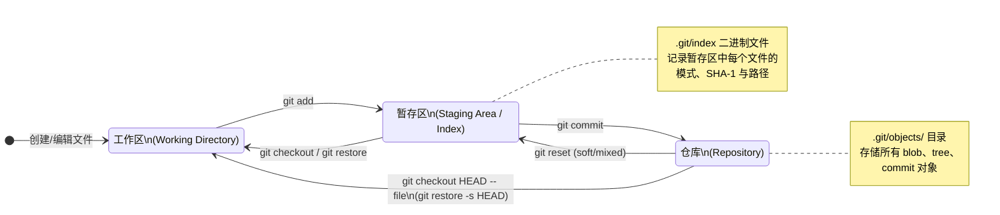
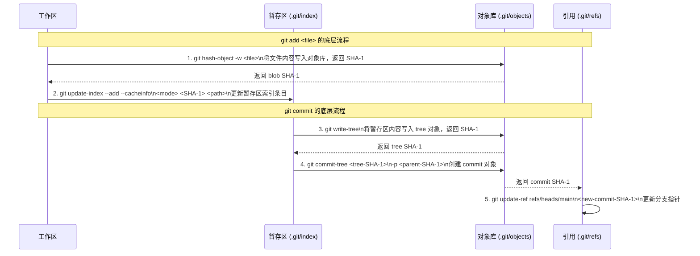
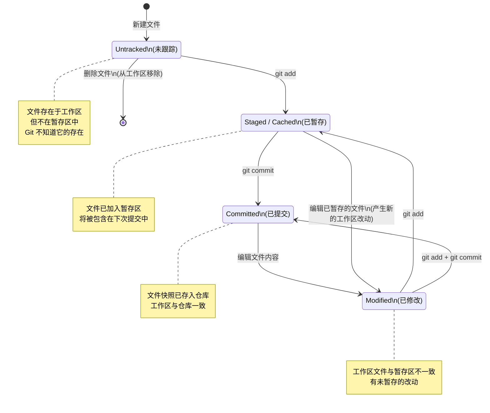
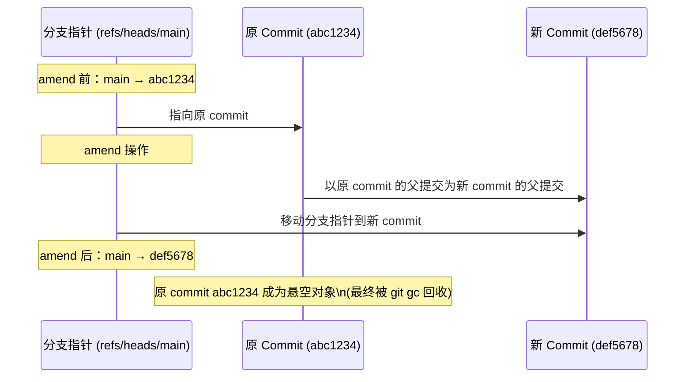
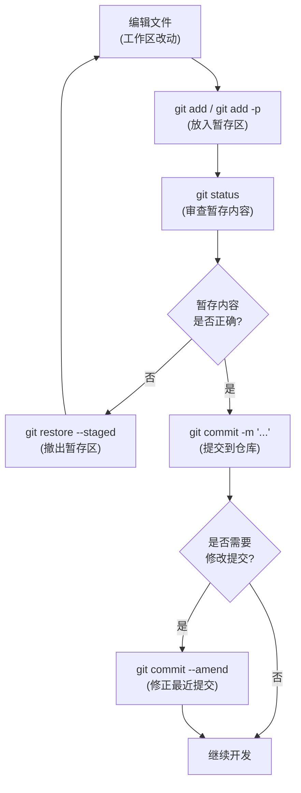

# 工作区、暂存区与提交

Git 的核心设计哲学之一，是将文件的变更过程拆分为多个可控的阶段，而非"一步到位"地提交所有改动。这种分阶段机制赋予了开发者精细化的版本控制能力——你可以选择性地提交部分改动、审查即将入库的内容、甚至在最后一刻撤回误操作。理解这三区模型，是从"会用 Git 命令"迈向"理解 Git 原理"的关键一步。

---

## 一、三区模型总览

Git 将项目的文件状态划分为三个逻辑区域：

| 区域 | 英文名 | 别名 | 存储位置 | 核心职责 |
|------|--------|------|----------|----------|
| 工作区 | Working Directory | Worktree | 磁盘上的项目目录 | 开发者实际编辑文件的地方 |
| 暂存区 | Staging Area | Index | `.git/index` 文件 | 记录下一次提交将要包含的文件快照 |
| 仓库 | Repository | Object Store / `.git` | `.git/objects/` 目录 | 永久存储所有已提交的快照与历史 |

三区之间的数据流转关系如下：



### 1.1 工作区（Working Directory）

工作区就是你在文件管理器中看到的项目目录。它是从仓库的某个版本检出到磁盘上的实际文件集合。工作区中的文件可以被自由编辑、创建或删除，这些操作不会直接影响仓库中的历史记录。

从底层看，工作区是某个 commit 所对应的 tree 对象在磁盘上的"展开"。当你执行 `git checkout` 或 `git switch` 时，Git 会根据目标 commit 的 tree 对象，将文件写入工作区。

### 1.2 暂存区（Staging Area / Index）

暂存区是 Git 最独特的设计之一，也是许多初学者感到困惑的地方。它的本质是一个**索引文件**——`.git/index`，记录了"下一次 commit 将要包含哪些文件的哪些版本"。

暂存区并非简单地存储文件差异，而是维护一份**完整的文件快照清单**。每一条索引记录包含：

- **文件模式**（mode）：普通文件（100644）、可执行文件（100755）、符号链接（120000）等
- **SHA-1 哈希**：指向 `.git/objects/` 中对应的 blob 对象
- **文件路径**：相对于仓库根目录的路径

你可以通过底层命令直接查看暂存区的内容：

```bash
# 查看暂存区的详细条目
git ls-files --stage

# 输出示例：
# 100644 3b18e512dba79e4c8300dd08aeb37f8e728b8dad 0   README.md
# 100644 83baae6183e5fb8b8e6c7e4e0a5c1f3d2e0a5c1f 0   src/main.py
```

暂存区的关键特性：

- **非差异模型**：暂存区记录的是文件的完整快照引用，而非"相对上一次提交的增量"。这意味着即使你只修改了文件的一行，`git add` 也会将整个文件的新版本存入对象库，并更新暂存区中该文件的 SHA-1 引用。
- **可累积**：你可以多次执行 `git add`，逐步构建下一次提交的内容。
- **可部分更新**：通过 `git add -p` 等方式，你可以将同一个文件的不同部分分批放入暂存区。

### 1.3 仓库（Repository）

仓库是 Git 的持久化存储层，位于 `.git/` 目录中。所有已提交的快照、历史记录、分支指针等都存储在这里。仓库的核心是**对象数据库**（Object Store），其中包含四类对象：

| 对象类型 | 标识前缀 | 作用 |
|----------|----------|------|
| blob | 无目录前缀 | 存储文件内容 |
| tree | 无目录前缀 | 存储目录结构（文件名 → blob/tree 的映射） |
| commit | 无目录前缀 | 存储提交元数据（作者、时间、父提交、tree 引用） |
| tag | 无目录前缀 | 存储标签信息 |

---

## 二、文件在三区之间的流转——底层视角

理解了三区模型后，我们深入底层，看看 `git add` 和 `git commit` 分别触发了哪些底层操作。



### 2.1 `git add` 的底层操作

`git add` 表面上只是"把文件加入暂存区"，但底层实际执行了两步操作：

**第一步：`git hash-object -w`**

将工作区文件的内容计算 SHA-1 哈希，并以 blob 对象的形式写入 `.git/objects/` 目录。

```bash
# 手动模拟 git add 的第一步
echo "Hello, Git" | git hash-object --stdin -w
# 输出：b7aec520dec0a7516c18eb4c68b64ae1eb9b5a5e

# 验证对象已存入
git cat-file -p b7aec520dec0a7516c18eb4c68b64ae1eb9b5a5e
# 输出：Hello, Git
```

**第二步：`git update-index`**

将暂存区中对应路径的条目更新为新的 blob SHA-1 和文件模式。

```bash
# 手动模拟 git add 的第二步
git update-index --add --cacheinfo 100644 \
  b7aec520dec0a7516c18eb4c68b64ae1eb9b5a5e hello.txt
```

> **关键洞察**：`git add` 是一个"快照"操作，而非"差异"操作。即使文件只改了一个字符，`git add` 也会将文件的完整新版本存为一个新的 blob 对象。Git 的去重机制（相同内容共享同一个 blob）确保这不会造成空间浪费。

### 2.2 `git commit` 的底层操作

`git commit` 同样可以拆解为多个底层步骤：

**第一步：`git write-tree`**

将当前暂存区的所有条目递归地构建为 tree 对象，写入对象库。一个 tree 对象代表一个完整的目录快照。

```bash
# 将暂存区写入 tree 对象
git write-tree
# 输出：d8329fc1cc938780ffdd9f94e0d364e0ea74f579
```

**第二步：`git commit-tree`**

基于上一步生成的 tree SHA-1，创建一个 commit 对象。commit 对象包含：

- 指向 tree 对象的引用
- 父 commit 的引用（首次提交无父节点）
- 作者信息（name + email + timestamp）
- 提交者信息（name + email + timestamp）
- 提交消息

```bash
# 手动创建 commit
git commit-tree d8329fc1 -p <parent-commit-sha> -m "Initial commit"
# 输出：1a410efbd13591db07496601ebc7a059dd55cfe9
```

**第三步：`git update-ref`**

将当前分支的指针更新为新的 commit SHA-1。

```bash
# 更新 main 分支指针
git update-ref refs/heads/main 1a410efbd13591db07496601ebc7a059dd55cfe9
```

> **关键洞察**：`git commit` 并不直接操作工作区文件。它只关心暂存区的状态——将暂存区的快照固化为一个 commit 对象，并移动分支指针。工作区中任何未被 `git add` 的改动，都不会进入这次提交。

---


## 三、文件的生命周期状态

在工作区中，每个文件相对于暂存区和仓库，都处于某种确定的状态。Git 用一套清晰的状态机来描述文件的生命周期：



### 3.1 状态详解

**Untracked（未跟踪）**

文件存在于工作区，但 Git 的暂存区中没有它的记录。这通常是你新创建的文件，或者是在 `.gitignore` 之外但从未 `git add` 过的文件。Git 知道它存在，但不会主动管理它的版本。

**Staged / Cached（已暂存）**

文件已被 `git add` 放入暂存区，其当前版本将被包含在下一次 `git commit` 中。注意：暂存区记录的是 `git add` 时刻的文件快照。如果你在 `git add` 之后又修改了文件，那么该文件会同时处于 Staged（旧版本在暂存区）和 Modified（新版本在工作区）两种状态。

**Committed（已提交）**

文件的当前版本已经通过 `git commit` 存入仓库。此时工作区、暂存区和仓库中该文件的内容完全一致。

**Modified（已修改）**

文件已被提交过（暂存区中有记录），但工作区中的内容与暂存区不一致。这意味着你编辑了文件但尚未 `git add`。

### 3.2 特殊状态：同时处于 Staged 和 Modified

这是一个容易混淆的场景。假设你有一个已跟踪的文件 `config.yaml`：

```bash
# 1. 编辑文件（第一次修改）
echo "debug: true" >> config.yaml
# 此时：Modified（工作区 ≠ 暂存区）

# 2. 暂存第一次修改
git add config.yaml
# 此时：Staged（暂存区已更新，工作区 = 暂存区）

# 3. 再次编辑文件（第二次修改）
echo "port: 8080" >> config.yaml
# 此时：Staged + Modified
#   - 暂存区中是第一次修改后的版本（Staged）
#   - 工作区中是第二次修改后的版本（Modified）
```

`git status` 会清晰地显示这种双重状态：

```
Changes to be committed:
  (use "git restore --staged <file>..." to unstage)
        modified:   config.yaml

Changes not staged for commit:
  (use "git add <file>..." to update what will be committed)
  (use "git restore <file>..." to discard changes in working directory)
        modified:   config.yaml
```

同一个文件同时出现在"Changes to be committed"和"Changes not staged for commit"两个区域中。这正是因为暂存区记录的是 `git add` 时刻的快照，而非工作区的实时状态。

---

## 四、`git status`：三区状态诊断

`git status` 是日常使用频率最高的 Git 命令之一，它为你提供工作区和暂存区相对于最近一次提交（HEAD）的差异报告。

### 4.1 输出解读

```bash
git status
```

典型输出：

```
On branch main
Your branch is up to date with 'origin/main'.

Changes to be committed:
  (use "git restore --staged <file>..." to unstage)
        new file:   feature.py
        modified:   core/engine.py

Changes not staged for commit:
  (use "git add <file>..." to update what will be committed)
  (use "git restore <file>..." to discard changes in working directory)
        modified:   README.md
        deleted:    old_module.py

Untracked files:
  (use "git add <file>..." to include in what will be committed)
        notes.txt
        tmp/
```

三个区域分别对应：

| `git status` 区域 | 含义 | 对应状态 |
|-------------------|------|----------|
| Changes to be committed | 暂存区与 HEAD 之间的差异 | Staged |
| Changes not staged for commit | 工作区与暂存区之间的差异 | Modified |
| Untracked files | 工作区中存在但暂存区中没有的文件 | Untracked |

### 4.2 精简输出

在脚本或快速浏览时，精简模式更为实用：

```bash
# 短格式
git status -s

# 输出示例：
A  feature.py          # A = Added to index (Staged new file)
M  core/engine.py      # M = Modified in index (Staged modified)
 M README.md           # M = Modified in worktree (Modified, not staged)
 D old_module.py       # D = Deleted in worktree (Deleted, not staged)
?? notes.txt           # ?? = Untracked
!! secret.key          # !! = Ignored
```

短格式中，左栏表示暂存区状态，右栏表示工作区状态。两栏可以同时有值（如 `MM` 表示暂存区和工作区都有修改）。

### 4.3 底层视角

`git status` 的底层实现涉及三次比较：

1. **HEAD vs 暂存区**：比较 HEAD commit 的 tree 与暂存区的 tree，得出"Changes to be committed"
2. **暂存区 vs 工作区**：比较暂存区记录的 SHA-1 与工作区文件的实际 SHA-1，得出"Changes not staged for commit"
3. **工作区扫描**：遍历工作区目录，找出暂存区中没有记录的文件，得出"Untracked files"


---

## 五、`git add` 详解

### 5.1 基本用法

```bash
# 添加单个文件
git add README.md

# 添加多个文件
git add file1.py file2.py file3.py

# 添加整个目录
git add src/

# 添加所有改动（工作区全部）
git add .
```

> **注意**：`git add .` 添加的是当前目录及其子目录下的所有改动。`git add -A`（或 `git add --all`）添加的是整个仓库的改动，无论你当前在哪个目录。在仓库根目录下两者等价，在子目录中则不同。


### 5.2 `-p`（patch）模式详解

`-p`（`--patch`）是 `git add` 最强大的选项之一，它允许你**交互式地选择文件的局部改动**放入暂存区，而非整个文件。

```bash
git add -p <file>
```

进入交互模式后，Git 会将文件的改动拆分为若干个"hunk"（代码块），逐个询问你是否暂存：

```
diff --git a/src/app.py b/src/app.py
index 3b18e51..83baae6 100644
--- a/src/app.py
+++ b/src/app.py
@@ -12,6 +12,10 @@ def process(data):
     validate(data)
     transform(data)
+    if config.debug:
+        log.debug(f"Processing: {data}")
+        log.debug(f"Config: {config}")
+
     return data

Stage this hunk [y,n,q,a,d,j,J,g,/,s,e,?]?
```

各选项的含义：

| 选项 | 全称 | 作用 |
|------|------|------|
| `y` | yes | 暂存当前 hunk |
| `n` | no | 不暂存当前 hunk |
| `q` | quit | 退出，不再暂存后续 hunk |
| `a` | all | 暂存当前及后续所有 hunk |
| `d` | do not | 不暂存当前及后续所有 hunk |
| `s` | split | 将当前 hunk 拆分为更小的 hunk |
| `e` | edit | 手动编辑 hunk（最精细的控制） |
| `j` | - | 跳到下一个未决定的 hunk |
| `J` | - | 跳到下一个 hunk |
| `g` | goto | 跳到指定编号的 hunk |
| `/` | regex | 搜索匹配正则的 hunk |
| `?` | help | 显示帮助 |

#### `-p` 模式的典型应用场景

**场景一：分离逻辑变更**

一次开发过程中，你可能同时修改了功能代码和调试代码。使用 `git add -p` 可以只暂存功能代码，将调试代码留到以后处理或直接丢弃。

**场景二：拆分大改动为多个提交**

当你完成了一个大功能但希望拆分为多个逻辑清晰的提交时：

```bash
# 第一次：只暂存核心逻辑
git add -p src/core.py
git commit -m "feat: add core processing logic"

# 第二次：暂存辅助函数
git add -p src/core.py
git commit -m "feat: add helper functions for processing"

# 第三次：暂存测试代码
git add -p tests/test_core.py
git commit -m "test: add unit tests for core processing"
```

**场景三：紧急修复与进行中工作的分离**

你正在开发新功能，突然需要修复一个线上 bug。但工作区中混杂了功能代码和 bug 修复：

```bash
# 只暂存 bug 修复相关的改动
git add -p bugfix_related_file.py
git commit -m "fix: resolve critical null pointer in auth flow"

# 功能代码继续留在工作区，稍后继续开发
```

#### `e`（edit）模式详解

选择 `e` 会打开编辑器，让你手动编辑 hunk 的内容。你可以精确地删除不想暂存的行：

```
# Manual hunk edit mode -- see bottom for a quick guide.
@@ -12,6 +12,10 @@ def process(data):
     validate(data)
     transform(data)
+    if config.debug:            # 删除此行 → 不暂存
+        log.debug(f"Processing: {data}")  # 删除此行 → 不暂存
+        log.debug(f"Config: {config}")    # 删除此行 → 不暂存
+
     return data

# ---
# To remove '-' lines, make them ' ' lines (context).
# To remove '+' lines, delete them.
# Lines starting with # will be removed.
```

规则：
- 以 `+` 开头的行：删除整行 = 不暂存此新增内容
- 以 `-` 开头的行：将 `-` 替换为空格 = 保留原内容（不暂存删除操作）
- 不要删除以空格开头的上下文行

---

## 六、`git commit` 详解

### 6.1 基本用法

```bash
# 打开编辑器撰写提交消息
git commit

# 通过 -m 直接指定提交消息
git commit -m "feat: add user authentication module"

# 跳过暂存区，直接提交所有已跟踪文件的改动（相当于 git add + git commit）
git commit -a -m "fix: correct off-by-one error in loop"

# 仅提交暂存区中指定文件的改动
git commit -m "feat: update config" -- config.yaml
```

> **注意**：`git commit -a` 不会添加 Untracked 文件。它只对已跟踪（Tracked）文件的修改和删除生效。新文件仍需显式 `git add`。

### 6.2 `--amend` 选项

`--amend` 用于修改最近一次提交，它有两种典型用途：

**用途一：修改提交消息**

```bash
# 提交后发现消息写错了
git commit -m "fxi typo in auth"   # 消息有拼写错误

# 修正提交消息
git commit --amend -m "fix: correct typo in authentication module"
```

**用途二：补充遗漏的改动**

```bash
# 提交后发现遗漏了一个文件
git commit -m "feat: add user profile page"

# 补充遗漏的文件
git add forgotten_file.py
git commit --amend --no-edit   # --no-edit 表示不修改提交消息
```

#### `--amend` 的底层原理

`--amend` 并非"修改"已有的 commit 对象——Git 中的对象是不可变的。它的实际操作是：

1. 以当前暂存区的内容构建一个新的 tree 对象
2. 创建一个新的 commit 对象，其父提交与原 commit 相同
3. 将分支指针从原 commit 移动到新 commit



> **重要警告**：由于 `--amend` 会改变 commit 的 SHA-1，如果该 commit 已经推送到远程仓库，`--amend` 后再推送需要使用 `--force`，这会覆盖远程历史。**永远不要 amend 已推送到公共分支的 commit**，除非你确信没有其他人基于它进行了开发。


### 6.3 提交消息规范（Conventional Commits）

良好的提交消息是项目可维护性的基石。[Conventional Commits](https://www.conventionalcommits.org/) 是目前最广泛采用的提交消息规范，其核心格式为：

```
<type>(<scope>): <subject>

<body>

<footer>
```

#### Type（类型）

| Type | 含义 | 是否触发版本号变更 |
|------|------|-------------------|
| `feat` | 新功能 | 是（MINOR） |
| `fix` | Bug 修复 | 是（PATCH） |
| `docs` | 文档变更 | 否 |
| `style` | 代码格式调整（不影响逻辑） | 否 |
| `refactor` | 重构（非新功能、非修复） | 否 |
| `perf` | 性能优化 | 否 |
| `test` | 测试相关 | 否 |
| `build` | 构建系统或外部依赖变更 | 否 |
| `ci` | CI 配置变更 | 否 |
| `chore` | 其他不修改 src 或 test 的变更 | 否 |
| `revert` | 回退之前的 commit | 视情况而定 |

#### Scope（范围，可选）

表示改动影响的模块或组件：

```
feat(auth): add OAuth2 login support
fix(api): handle null response from payment gateway
docs(readme): update installation instructions
```

#### Subject（主题）

- 使用祈使句、现在时态："add feature" 而非 "added feature" 或 "adds feature"
- 首字母小写
- 末尾不加句号
- 简洁明确，通常不超过 50 个字符

#### Body（正文，可选）

- 与 subject 空一行
- 解释"为什么"而非"是什么"（代码本身已经说明了"是什么"）
- 每行不超过 72 个字符

#### Footer（脚注，可选）

- 用于关联 Issue：`Closes #123`、`Fixes #456`
- 用于标记 Breaking Change：`BREAKING CHANGE: API endpoint /users renamed to /accounts`

#### 完整示例

```
feat(payment): add Stripe payment integration

Implement Stripe Checkout Session flow for handling one-time
payments. This replaces the legacy PayPal-only flow and provides
better support for international currencies.

Closes #287
BREAKING CHANGE: PaymentResponse format has changed from
{paypal_id} to {session_id, provider}
```

#### 工具支持

使用 commitlint + husky 可以在提交时自动校验消息格式：

```bash
# 安装
npm install --save-dev @commitlint/cli @commitlint/config-conventional husky

# 配置 commitlint
echo "module.exports = {extends: ['@commitlint/config-conventional']}" > commitlint.config.js

# 配置 husky hook
npx husky add .husky/commit-msg 'npx --no -- commitlint --edit "$1"'
```

---

## 七、完整工作流示例

以下是一个从编辑到提交的完整流程，展示三区之间的数据流转：



对应的命令序列：

```bash
# 1. 编辑文件
vim src/app.py

# 2. 查看改动
git status
git diff                    # 工作区 vs 暂存区
git diff --cached           # 暂存区 vs HEAD（暂存后查看）

# 3. 选择性暂存
git add -p src/app.py       # 交互式选择 hunk

# 4. 审查暂存内容
git status
git diff --cached           # 确认即将提交的内容

# 5. 提交
git commit -m "feat(app): add request validation middleware"

# 6. 查看提交
git log -1 --stat
git show HEAD
```

---

## 八、小结

| 概念 | 核心要点 |
|------|----------|
| 三区模型 | 工作区（编辑）→ 暂存区（选择）→ 仓库（持久化），数据在各区之间单向流转 |
| 暂存区本质 | `.git/index` 文件，记录下次提交的文件快照清单（mode + SHA-1 + path） |
| `git add` 底层 | `hash-object -w`（存 blob）+ `update-index`（更新索引） |
| `git commit` 底层 | `write-tree`（构建 tree）+ `commit-tree`（创建 commit）+ `update-ref`（移动指针） |
| 文件生命周期 | Untracked → Staged → Committed → Modified → Staged → ... 循环往复 |
| `git add -p` | 交互式选择 hunk 暂存，实现同一文件不同改动的分离提交 |
| `git commit --amend` | 替换最近一次提交（创建新 commit，移动分支指针），切勿对已推送的 commit 使用 |
| Conventional Commits | `type(scope): subject` 格式，配合工具链实现自动化版本管理与 changelog 生成 |

**核心认知**：Git 的三区模型并非多余的复杂度，而是精心设计的"缓冲层"。暂存区让你在"改动"与"提交"之间拥有了一个审查和筛选的关口——你可以精确控制哪些改动进入版本历史，哪些暂时搁置。这种精细化控制能力，正是 Git 区别于早期版本控制系统（如 SVN 的"全量提交"模式）的核心优势之一。

理解了三区模型和文件流转机制后，后续的 `git reset`（回退暂存区）、`git checkout`/`git restore`（恢复工作区）、`git stash`（暂存工作区改动）等命令，本质上都是在三区之间移动数据，其底层逻辑将变得清晰可预测。

