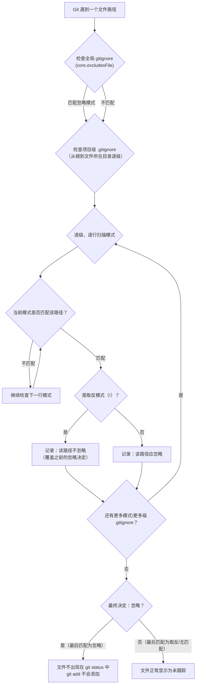
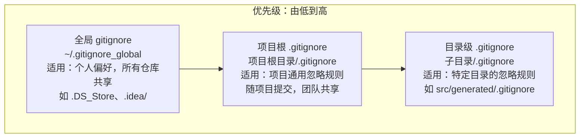
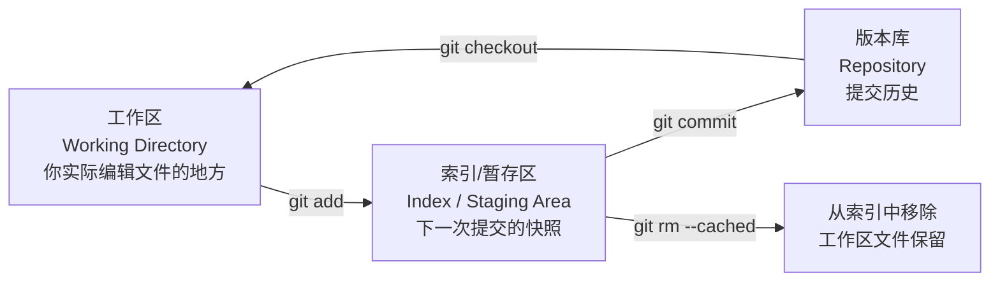
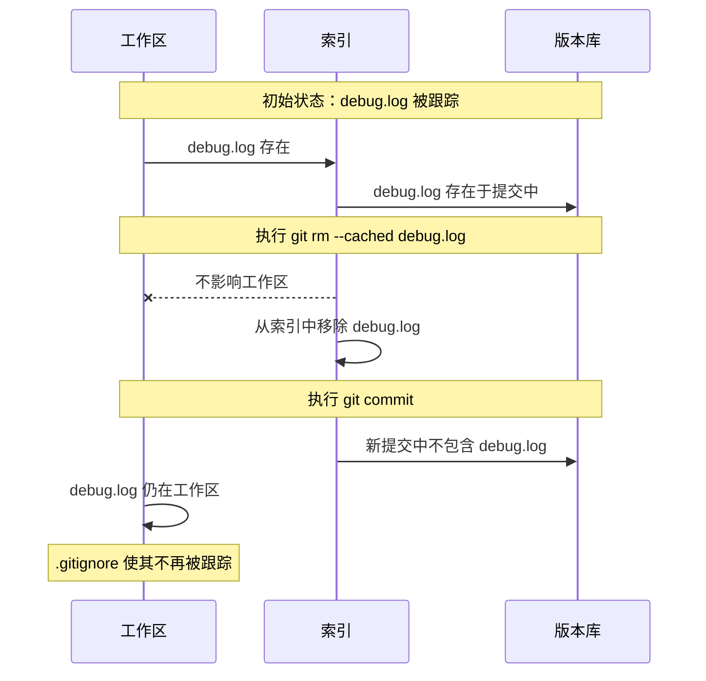
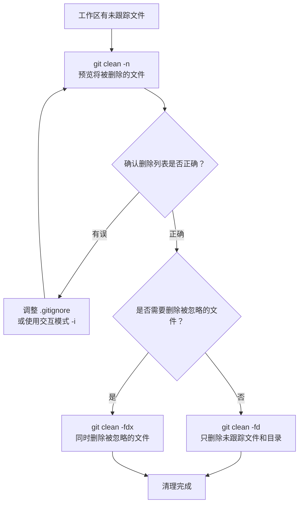

# .gitignore 与文件管理

在真实项目中，工作区里总会产生一些不应该进入版本库的文件：编译产物、依赖缓存、IDE 配置、操作系统生成的隐藏文件、包含敏感信息的 `.env` 等。Git 提供了 `.gitignore` 机制来声明"哪些文件不需要被跟踪"，同时配合 `git rm --cached` 和 `git clean` 等命令完成对未跟踪文件的精细管理。理解这些机制的工作原理，是保持仓库干净、协作顺畅的关键。

---

## 1. .gitignore 的作用与核心语义

### 1.1 为什么需要 .gitignore

Git 的设计哲学是"工作区中的一切都值得关注"——任何未被忽略的文件都会出现在 `git status` 的未跟踪列表中。但在实际开发中，大量文件属于以下类别：

| 类别 | 示例 | 不应入库的原因 |
|------|------|----------------|
| 编译产物 | `*.o`、`*.class`、`build/` | 可从源码重建，入库会膨胀仓库体积 |
| 依赖目录 | `node_modules/`、`venv/` | 体积巨大且可由包管理器恢复 |
| IDE/编辑器配置 | `.idea/`、`.vscode/` | 因人而异，不属于项目本身 |
| 操作系统文件 | `.DS_Store`、`Thumbs.db` | 与项目无关，跨平台协作时产生噪音 |
| 敏感信息 | `.env`、`credentials.json` | 泄露密钥/密码，安全风险极高 |
| 日志与临时文件 | `*.log`、`*.tmp` | 运行时产物，无版本价值 |

`.gitignore` 的作用就是告诉 Git：**这些路径不要出现在 `git status` 中，也不要被 `git add` 意外加入**。

### 1.2 核心语义：忽略的是"未跟踪"文件

一个关键概念——`.gitignore` 只对**未被 Git 跟踪的文件**生效。如果一个文件已经被提交到版本库（即存在于索引/提交历史中），那么后续将其加入 `.gitignore` 不会产生任何效果，Git 仍然会继续跟踪它的变更。这一点是初学者最常遇到的困惑，后文会详细讨论解决方案。

---

## 2. .gitignore 语法规则详解

`.gitignore` 文件采用逐行匹配的模式，每一行是一个 glob 模式（glob pattern），用于匹配相对于 `.gitignore` 文件所在目录的路径。

### 2.1 基本规则速览

```
# 这是注释——以 # 开头的行被忽略
# 空行也被忽略

# 直接匹配文件名（匹配任何目录层级下的同名文件）
debug.log

# 匹配特定扩展名
*.o
*.class

# 匹配目录（末尾的 / 表示只匹配目录，不匹配同名文件）
build/
node_modules/

# 匹配根目录下的文件/目录（开头的 / 表示相对于 .gitignore 所在目录的根）
/TODO
/dist

# 取反（!）——即使前面被忽略，也重新纳入跟踪
!important.log

# 双星号（**）——跨目录匹配
src/**/temp/
```

### 2.2 通配符详解

| 符号 | 含义 | 示例 | 匹配 | 不匹配 |
|------|------|------|------|--------|
| `*` | 匹配任意数量字符（不含 `/`） | `*.log` | `error.log`、`debug.log` | `logs/error.log` |
| `?` | 匹配单个字符（不含 `/`） | `file?.txt` | `file1.txt`、`fileA.txt` | `file10.txt` |
| `[abc]` | 匹配方括号内任一字符 | `file[123].txt` | `file1.txt` | `file4.txt` |
| `[0-9]` | 匹配范围内任一字符 | `file[0-9].txt` | `file5.txt` | `fileA.txt` |
| `**` | 匹配任意数量目录层级 | `src/**/test.js` | `src/test.js`、`src/a/b/test.js` | `test.js` |

**关键细节**：`*` 不会跨目录匹配。`*.log` 只匹配当前目录层级的 `.log` 文件，不会匹配 `subdir/error.log`。但 Git 有一个特殊行为——**不以 `/` 开头的模式会在任何目录层级下匹配**。也就是说 `*.log` 虽然不匹配跨目录路径中的 `/`，但 Git 会在每一层目录都尝试匹配，因此 `logs/error.log` 中的 `error.log` 部分会被匹配到，最终该文件被忽略。

### 2.3 目录匹配（尾随 `/`）

```
build/          # 只忽略名为 build 的目录，不忽略名为 build 的文件
build           # 同时忽略名为 build 的目录和文件
```

尾随 `/` 的意义在于**精确区分目录和文件**。在大型项目中，可能存在同名文件和目录（如 `doc/` 目录和 `doc` 文件），使用尾随 `/` 可以避免误忽略。

### 2.4 根路径匹配（前导 `/`）

```
/TODO           # 只忽略 .gitignore 所在目录根下的 TODO 文件
TODO            # 忽略任何目录层级下的 TODO 文件
```

前导 `/` 不是指系统根目录，而是指 `.gitignore` 文件自身所在目录的根。这是一个常见的误解。

### 2.5 取反模式（`!`）

```
# 忽略所有 .log 文件
*.log

# 但 important.log 除外——不要忽略它
!important.log
```

取反模式用于"先忽略一大类，再排除其中少数例外"的场景。这在实践中非常常见：

```
# 忽略 build 目录下的一切
build/

# 但保留 build/essential/ 目录的内容
!build/essential/
```

**重要限制**：如果父目录已被忽略，则无法用 `!` 重新纳入其子目录中的文件。这是因为 Git 的忽略逻辑会先判断父目录——如果父目录被忽略，Git 甚至不会进入该目录去检查其子项。例如：

```
# 这组规则不会按预期工作
build/           # 忽略 build 目录
!build/essential/ # 试图恢复——但 Git 不会进入 build/ 去检查子项
```

解决方案是逐级取反：

```
build/*
!build/essential/
```

这里 `build/*` 忽略的是 build 目录下的**内容**而非 build 目录本身，因此 Git 仍会进入 build 目录检查其子项，`!build/essential/` 就能生效。

### 2.6 双星号（`**`）跨目录匹配

`**` 匹配零个或多个目录层级，是 `.gitignore` 中最强大的通配符：

```
src/**/test.js       # 匹配 src 下任何层级中的 test.js
                      # 如 src/test.js、src/a/test.js、src/a/b/c/test.js

**/logs              # 匹配任何层级下的 logs 目录或文件
                      # 如 logs/、a/logs/、a/b/logs/

logs/**              # 匹配 logs 目录下的任何内容（任意深度）
```

`**` 必须独立作为路径段使用，即前后必须有 `/` 或位于行首/行尾。`a**b` 这样的用法是无效的，`**` 会被当作普通的 `*` 处理。

---

## 3. .gitignore 的匹配算法

理解匹配算法是正确编写 `.gitignore` 的关键。Git 对一个路径的忽略判断遵循以下规则：

### 3.1 核心规则

1. **从上到下逐行匹配**：`.gitignore` 文件中的模式按行序依次检查。
2. **最后匹配生效**（last matching pattern wins）：如果多个模式匹配同一个路径，以**最后一个匹配的模式**为准。这意味着后面的 `!` 取反可以覆盖前面的忽略。
3. **多级 .gitignore 叠加**：项目中可以存在多个 `.gitignore` 文件（根目录、子目录），它们共同生效。较深层级 `.gitignore` 中的模式优先级更高。
4. **全局 gitignore 优先级最低**：`~/.gitignore_global` 中的模式优先级低于项目级 `.gitignore`。

### 3.2 匹配流程图



### 3.3 匹配示例分析

假设项目根目录的 `.gitignore` 内容如下：

```gitignore
# 忽略所有 .log 文件
*.log

# 但保留 important.log
!important.log

# 忽略 debug 目录下的一切
debug/*

# 但保留 debug/config.json
!debug/config.json
```

对以下文件的判断结果：

| 文件路径 | 匹配过程 | 最终结果 |
|----------|----------|----------|
| `error.log` | 匹配 `*.log`（忽略）→ 不匹配 `!important.log` → 最后匹配为忽略 | **忽略** |
| `important.log` | 匹配 `*.log`（忽略）→ 匹配 `!important.log`（取反）→ 最后匹配为取反 | **不忽略** |
| `debug/output.log` | 匹配 `debug/*`（忽略）→ 不匹配 `!debug/config.json` → 最后匹配为忽略 | **忽略** |
| `debug/config.json` | 匹配 `debug/*`（忽略）→ 匹配 `!debug/config.json`（取反）→ 最后匹配为取反 | **不忽略** |

---

## 4. 多级 .gitignore 体系

Git 的忽略机制由三个层级组成，各有不同的适用场景和优先级。


### 4.1 三级体系概览



### 4.2 全局 gitignore（core.excludesFile）

全局 gitignore 适用于**与个人开发环境相关**的忽略规则，对所有仓库生效。

**配置方式**：

```bash
# 设置全局 gitignore 文件路径
git config --global core.excludesFile ~/.gitignore_global

# 编辑全局 gitignore
cat > ~/.gitignore_global << 'EOF'
# macOS
.DS_Store
.AppleDouble
.LSOverride

# IDE
.idea/
.vscode/
*.swp
*.swo

# Linux
*~
.fuse_hidden*

# Windows
Thumbs.db
ehthumbs.db
Desktop.ini
EOF
```

**适用场景**：操作系统生成的文件、个人 IDE 配置——这些与项目无关，不应出现在项目的 `.gitignore` 中。

### 4.3 项目根 .gitignore

位于项目根目录的 `.gitignore`，是**最重要的忽略文件**，随项目一起提交到版本库，对整个团队生效。

```gitignore
# 依赖
node_modules/
vendor/

# 构建产物
dist/
build/
*.min.js
*.min.css

# 环境配置（含敏感信息）
.env
.env.local
.env.*.local

# 日志
*.log
npm-debug.log*

# 测试覆盖率
coverage/
```

**适用场景**：项目级别的通用忽略规则——编译产物、依赖目录、敏感配置等。

### 4.4 目录级 .gitignore

项目子目录中也可以放置 `.gitignore`，其规则只对该目录及其子目录生效。

```
project/
├── .gitignore              # 项目级——对整个项目生效
├── src/
│   ├── .gitignore          # 目录级——只对 src/ 及其子目录生效
│   ├── generated/
│   │   └── .gitignore      # 更深层级——只对 generated/ 生效
│   └── main.py
└── docs/
    └── ...
```

`src/generated/.gitignore` 的内容可能很简单：

```gitignore
# 忽略此目录下所有自动生成的文件
*
```

**适用场景**：特定子目录有特殊的忽略需求，如代码生成目录、文档构建目录等。

### 4.5 优先级规则

当多个层级的 `.gitignore` 对同一文件有冲突规则时：

1. **深层级优先于浅层级**：`src/.gitignore` 中的规则优先于根目录 `.gitignore`。
2. **同一文件内，后出现的规则优先于先出现的**：即"最后匹配生效"原则。
3. **全局 gitignore 优先级最低**：项目级规则可以覆盖全局规则。


### 4.6 .git/info/exclude——第四种忽略方式

除了上述三种 `.gitignore`，还有 `.git/info/exclude` 文件，其语法与 `.gitignore` 完全相同，但：

- **不会被提交到版本库**（位于 `.git/` 目录内）
- **只对当前仓库生效**
- **优先级低于项目 `.gitignore`，高于全局 gitignore**

适用场景：你有一些个人专属的忽略需求（如调试用的临时文件），但不想修改项目的 `.gitignore` 影响其他协作者。

---

## 5. .gitignore 不生效的常见原因与解决方案

### 5.1 最常见原因：文件已被跟踪

这是初学者遇到最多的问题。场景如下：

```bash
# 1. 不小心提交了 debug.log
git add debug.log
git commit -m "add debug log"

# 2. 后来意识到不该跟踪它，加入 .gitignore
echo "debug.log" >> .gitignore

# 3. 但修改 debug.log 后，git status 仍然显示它被修改！
git status
# Changes not staged for commit:
#   modified:   debug.log
```

**原因**：`.gitignore` 只影响未跟踪的文件。`debug.log` 已经存在于 Git 的索引（暂存区）和提交历史中，Git 会继续跟踪它的变更。

### 5.2 解决方案：git rm --cached

```bash
# 从索引中移除文件，但保留工作区文件
git rm --cached debug.log

# 现在再查看状态
git status
# Deleted:   debug.log        （索引中已删除）
# Untracked: debug.log        （工作区仍存在，但被 .gitignore 忽略）

# 提交这个变更
git commit -m "stop tracking debug.log"
```

此后 `debug.log` 就会被 `.gitignore` 正确忽略。

### 5.3 批量移除已跟踪的忽略文件

如果之前已经提交了大量应该被忽略的文件：

```bash
# 先确保 .gitignore 已正确配置
# 然后从索引中移除所有被 .gitignore 匹配的文件
git rm -r --cached .

# 重新添加（此时 .gitignore 会生效，被忽略的文件不会被加入）
git add .

# 提交
git commit -m "apply .gitignore rules, remove tracked ignored files"
```

> **注意**：`git rm --cached` 只从索引中移除文件，工作区文件不受影响。但这次提交会让该文件从版本库中消失——其他协作者 pull 后，他们工作区中对应的文件也会被删除。如果文件包含敏感信息，还需要进一步清理历史（见下文）。

### 5.4 其他不生效原因

| 原因 | 现象 | 解决方案 |
|------|------|----------|
| 文件已被跟踪 | 修改 `.gitignore` 后文件仍出现在 `git status` | `git rm --cached <file>` |
| 模式写错 | 预期忽略的文件未被忽略 | 检查 glob 语法，注意 `/` 和 `**` 的用法 |
| 路径不匹配 | `.gitignore` 在子目录中但路径写成了根目录相对路径 | 确认模式是相对于 `.gitignore` 所在目录的 |
| 父目录被忽略后取反无效 | `!subdir/file` 不生效 | 改用 `dir/*` + `!dir/subdir/` 逐级取反 |
| 全局 gitignore 冲突 | 项目 `.gitignore` 的 `!` 取反不生效 | 检查 `~/.gitignore_global` 是否有冲突规则 |

### 5.5 调试 .gitignore

Git 提供了专门的命令来检查某个文件为什么被忽略或未被忽略：

```bash
# 检查特定文件被哪条规则忽略
git check-ignore -v debug.log
# 输出：.gitignore:3:*.log    debug.log
# 含义：.gitignore 文件第 3 行的 *.log 规则匹配了 debug.log

# 如果文件未被任何规则匹配（如 main.py），该命令无输出
git check-ignore -v main.py
# （无输出——说明该文件未被任何忽略规则匹配）
```

`-v`（verbose）选项会显示匹配的规则来源、行号和模式，是排查 `.gitignore` 问题的利器。

---

## 6. git rm --cached 的原理


### 6.1 Git 的三层结构回顾

要理解 `git rm --cached`，需要先理解 Git 的三层数据结构：



### 6.2 git rm 的三种变体

| 命令 | 工作区 | 索引 | 效果 |
|------|--------|------|------|
| `git rm file` | 删除 | 删除 | 工作区和索引都移除文件 |
| `git rm --cached file` | 保留 | 删除 | 只从索引移除，工作区文件不受影响 |
| `git rm -f file` | 删除 | 删除 | 强制删除（用于已修改未暂存的文件） |

### 6.3 --cached 的内部机制

当执行 `git rm --cached debug.log` 时：

1. Git 从索引（`.git/index`）中移除 `debug.log` 的条目。
2. 工作区中的 `debug.log` 文件保持不变。
3. 此次变更被记录为"删除"操作，出现在暂存区中。
4. 提交后，`debug.log` 从版本库的该提交开始不再存在。
5. 但由于工作区文件仍在，且 `.gitignore` 已配置忽略它，Git 不再跟踪该文件。



### 6.4 敏感文件泄露后的处理

如果已经提交了包含敏感信息（如 API 密钥、密码）的文件，仅用 `git rm --cached` 是不够的——该文件仍然存在于 Git 历史中，任何人都可以通过 `git log` 找到它。此时需要：

```bash
# 使用 git filter-branch（传统方式，较慢）
git filter-branch --force --index-filter \
  'git rm --cached --ignore-unmatch secrets.env' \
  --prune-empty --tag-name-filter cat -- --all

# 或使用 git filter-repo（推荐，更快更安全）
# 需要先安装：pip install git-filter-repo
git filter-repo --path secrets.env --invert-paths

# 清理引用和垃圾回收
rm -rf .git/refs/original/
git reflog expire --expire=now --all
git gc --prune=now --aggressive
```

> **重要**：如果敏感文件已推送到远程仓库，必须立即轮换相关密钥/密码，因为即使重写历史，他人可能已经克隆了包含敏感信息的仓库。

---

## 7. git clean：清理未跟踪文件

`git clean` 用于删除工作区中未被 Git 跟踪的文件和目录。这是一个**不可逆**的操作，使用时需格外谨慎。

### 7.1 命令选项详解

| 选项 | 含义 | 说明 |
|------|------|------|
| `-n` / `--dry-run` | 预览模式 | 只显示将被删除的文件，不实际删除 |
| `-f` / `--force` | 强制删除 | 实际执行删除操作（Git 默认要求此选项以防止误删） |
| `-d` | 包含目录 | 同时删除未跟踪的目录（连同其中的未跟踪内容） |
| `-x` | 包含被忽略的文件 | 同时删除 `.gitignore` 中匹配的文件 |
| `-i` | 交互模式 | 逐个确认是否删除 |

### 7.2 典型使用流程



### 7.3 使用示例

```bash
# 1. 预览：哪些未跟踪文件将被删除
git clean -n
# Would remove debug.log
# Would remove temp/

# 2. 预览：包含目录
git clean -n -d
# Would remove debug.log
# Would remove temp/
# Would remove build/    （未跟踪的目录）

# 3. 实际删除未跟踪文件和目录
git clean -fd
# Removing debug.log
# Removing temp/

# 4. 同时删除被 .gitignore 忽略的文件（危险！）
git clean -fdx
# Removing node_modules/   （被 .gitignore 忽略的目录也会被删除）
# Removing dist/           （被 .gitignore 忽略的构建产物）

# 5. 交互模式——逐个确认
git clean -i
# Would remove the following items:
#   debug.log  temp/
# *** Commands ***
#   1: clean    2: filter by pattern    3: select by numbers
#   4: ask each    5: quit
# What now> 4
# Remove debug.log? y
# Remove temp/? n
```

### 7.4 -x 选项的典型场景

`-x` 选项最常见的用途是**完全重置工作区**，回到干净的状态：

```bash
# 场景：构建出现问题，想完全从头开始
# 1. 重置所有已跟踪文件的修改
git reset --hard

# 2. 删除所有未跟踪文件（包括被忽略的构建产物和依赖）
git clean -fdx

# 现在工作区与最新提交完全一致
# 3. 重新安装依赖、重新构建
npm install   # 或 pip install、mvn install 等
```

### 7.5 安全提示

- **永远先运行 `-n` 预览**，确认删除列表后再执行实际删除。
- `-x` 选项会删除 `.gitignore` 忽略的文件，包括 `node_modules/`、`venv/` 等依赖目录——删除后需要重新安装。
- `git clean` 删除的文件**不会进入回收站**，无法通过 Git 恢复。
- 如果不确定，使用 `-i` 交互模式逐个确认。

---

## 8. 常见语言的 .gitignore 模板


### 8.1 Python

```gitignore
# Byte-compiled / optimized / DLL files
__pycache__/
*.py[cod]
*$py.class

# C extensions
*.so

# Distribution / packaging
.Python
build/
develop-eggs/
dist/
downloads/
eggs/
.eggs/
lib/
lib64/
parts/
sdist/
var/
wheels/
pip-wheel-metadata/
share/python-wheels/
*.egg-info/
.installed.cfg
*.egg
MANIFEST

# PyInstaller
*.manifest
*.spec

# Installer logs
pip-log.txt
pip-delete-this-directory.txt

# Unit test / coverage reports
htmlcov/
.tox/
.nox/
.coverage
.coverage.*
nosetests.xml
coverage.xml
*.cover
*.py,cover
.hypothesis/
.pytest_cache/

# Translations
*.mo
*.pot

# Environments
.env
.venv
env/
venv/
ENV/
env.bak/
venv.bak/

# Spyder project settings
.spyderproject
.spyproject

# Rope project settings
.ropeproject

# mkdocs documentation
/site

# mypy
.mypy_cache/
.dmypy.json
dmypy.json

# Pyre type checker
.pyre/

# Jupyter Notebook
.ipynb_checkpoints
```

### 8.2 Node.js

```gitignore
# Dependencies
node_modules/
jspm_packages/

# Build output
dist/
build/
.next/
out/
.nuxt/

# Logs
logs/
*.log
npm-debug.log*
yarn-debug.log*
yarn-error.log*
pnpm-debug.log*

# Runtime data
pids/
*.pid
*.seed
*.pid.lock

# Directory for instrumented libs generated by jscoverage/JSCover
lib-cov/

# Coverage directory used by tools like Istanbul
coverage/
*.lcov

# nyc test coverage
.nyc_output/

# Dependency directories
node_modules/

# TypeScript cache
*.tsbuildinfo

# Optional npm cache directory
.npm

# Optional eslint cache
.eslintcache

# Optional REPL history
.node_repl_history

# Output of 'npm pack'
*.tgz

# Yarn Integrity file
.yarn-integrity

# dotenv environment variables file
.env
.env.local
.env.development.local
.env.test.local
.env.production.local

# parcel-bundler cache
.cache/
.parcel-cache/

# Vite
.vite/

# Docusaurus
.docusaurus/
```


### 8.3 Java

```gitignore
# Compiled class file
*.class

# Log file
*.log

# BlueJ files
*.ctxt

# Mobile Tools for Java (J2ME)
.mtj.tmp/

# Package Files
*.jar
*.war
*.nar
*.ear
*.zip
*.tar.gz
*.rar

# Virtual machine crash logs
hs_err_pid*
replay_pid*

# Maven
target/
pom.xml.tag
pom.xml.releaseBackup
pom.xml.versionsBackup
pom.xml.next
release.properties

# Gradle
.gradle/
**/build/
!src/**/build/

# Ignore Gradle GUI config
gradle-app.setting

# Avoid ignoring Gradle wrapper jar file
!gradle-wrapper.jar

# Cache of project
.gradletasknamecache

# IntelliJ IDEA
.idea/
*.iws
*.iml
*.ipr

# Eclipse
.apt_generated/
.classpath
.factorypath
.project
.settings/
.springBeans
.sts4-cache/

# NetBeans
/nbproject/private/
/nbbuild/
/dist/
/nbdist/
/.nb-gradle/

# VS Code
.vscode/
```

### 8.4 C/C++

```gitignore
# Prerequisites
*.d

# Compiled Object files
*.slo
*.lo
*.o
*.obj

# Precompiled Headers
*.gch
*.pch

# Compiled Dynamic libraries
*.so
*.dylib
*.dll

# Fortran module files
*.mod
*.smod

# Compiled Static libraries
*.lai
*.la
*.a
*.lib

# Executables
*.exe
*.out
*.app

# Debug files
*.dSYM/
*.su
*.idb
*.pdb

# Kernel Module Compile Results
*.mod*
*.cmd
.tmp_versions/
modules.order
Module.symvers
Mkfile.old
dkms.conf

# CMake
CMakeLists.txt.user
CMakeCache.txt
CMakeFiles/
CMakeScripts/
cmake_install.cmake
install_manifest.txt
compile_commands.json
CTestTestfile.cmake
_deps/

# Make
*.d
*.depend
```

### 8.5 获取模板的最佳实践

GitHub 维护了一个 [gitignore 模板仓库](https://github.com/github/gitignore)，包含几乎所有语言和框架的模板。推荐做法：

```bash
# 创建新项目时，直接合并对应模板
curl -o .gitignore https://raw.githubusercontent.com/github/gitignore/main/Python.gitignore

# 或使用更完整的组合模板（如 Python + JetBrains + macOS）
# 注意：EOF 不加引号，让 $(curl ...) 在写入时被执行
cat > .gitignore << EOF
# ===== Python =====
$(curl -s https://raw.githubusercontent.com/github/gitignore/main/Python.gitignore)

# ===== JetBrains =====
$(curl -s https://raw.githubusercontent.com/github/gitignore/main/Global/JetBrains.gitignore)

# ===== macOS =====
$(curl -s https://raw.githubusercontent.com/github/gitignore/main/Global/macOS.gitignore)
EOF
```

---

## 9. 小结

### 核心知识回顾

| 主题 | 要点 |
|------|------|
| `.gitignore` 作用 | 声明不需要 Git 跟踪的文件，只对未跟踪文件生效 |
| 匹配语法 | `*`（不含 `/` 的任意字符）、`?`、`[abc]`、`**`（跨目录）、`/`（根路径）、尾随 `/`（仅目录）、`!`（取反） |
| 匹配算法 | 从上到下逐行匹配，**最后匹配生效**；多级 `.gitignore` 叠加，深层优先 |
| 三级体系 | 全局 gitignore（个人偏好）→ 项目 `.gitignore`（团队共享）→ 目录级 `.gitignore`（局部规则） |
| 不生效排查 | 文件已被跟踪？→ `git rm --cached`；模式写错？→ `git check-ignore -v` |
| `git rm --cached` | 从索引移除文件但保留工作区文件，使 `.gitignore` 对该文件重新生效 |
| `git clean` | 清理未跟踪文件；`-n` 预览、`-f` 强制、`-d` 含目录、`-x` 含忽略文件、`-i` 交互 |

### 最佳实践清单

1. **项目初始化时就配置 `.gitignore`**——在第一次 `git add` 之前就写好，避免误提交。
2. **全局 gitignore 管个人偏好，项目 gitignore 管项目规则**——不要把 IDE 配置写进项目 `.gitignore`。
3. **使用 `git check-ignore -v` 排查问题**——比猜测和试错高效得多。
4. **`git clean` 前永远先 `-n` 预览**——这是不可逆操作，养成习惯。
5. **敏感文件一旦提交，仅 `git rm --cached` 不够**——需要重写历史并轮换密钥。
6. **善用 GitHub 的 gitignore 模板**——不要从零手写，站在社区经验的基础上。
7. **取反模式注意父目录限制**——如果父目录被忽略，子目录的 `!` 取反无效，需用 `dir/*` + `!dir/sub/` 逐级处理。

