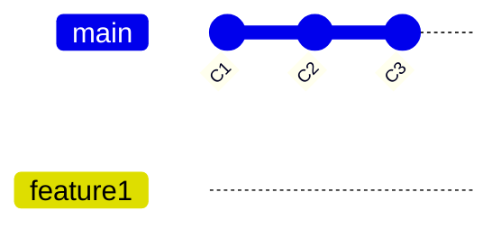
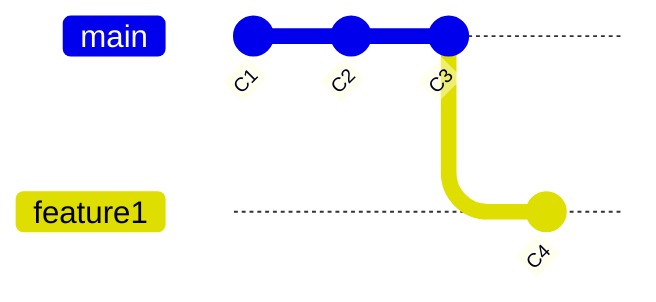
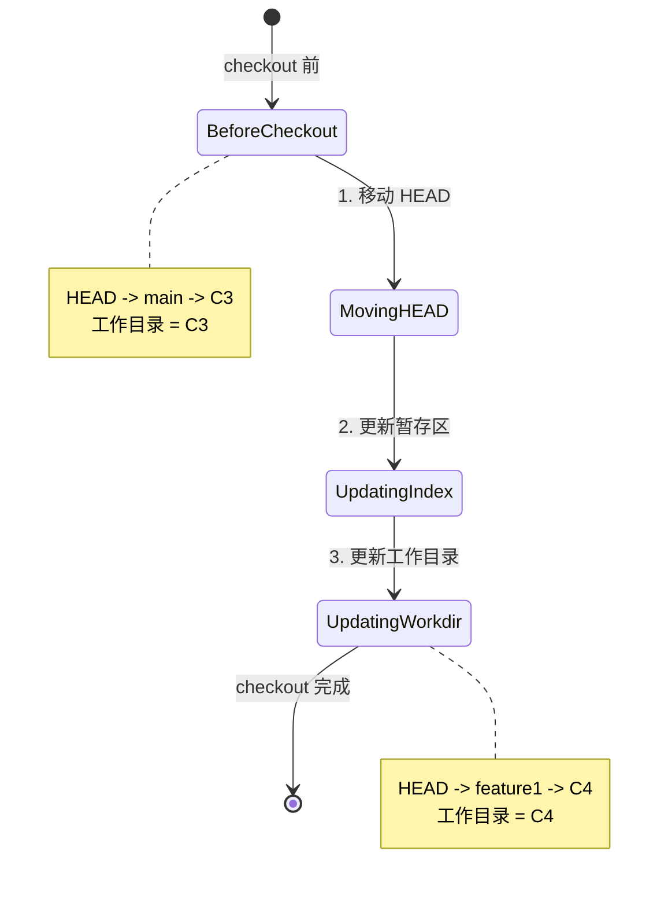
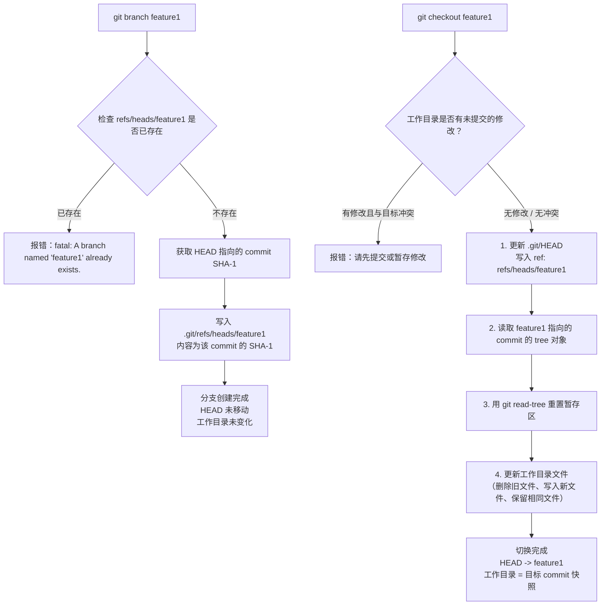
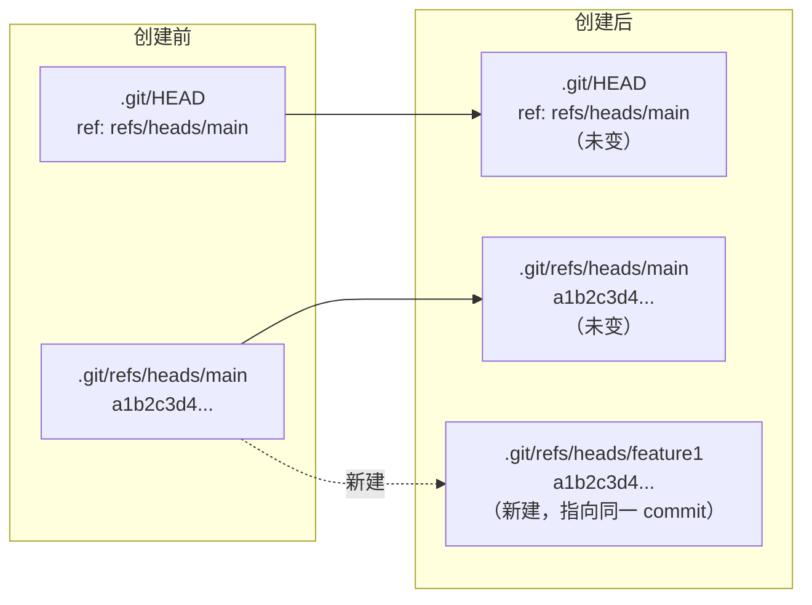
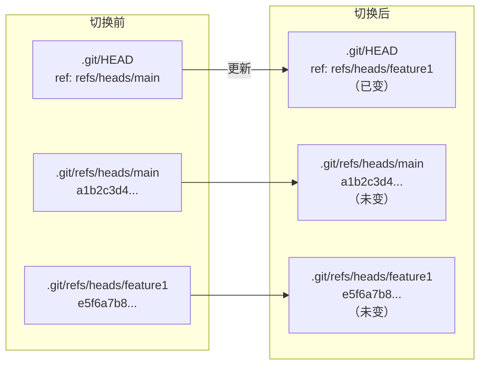
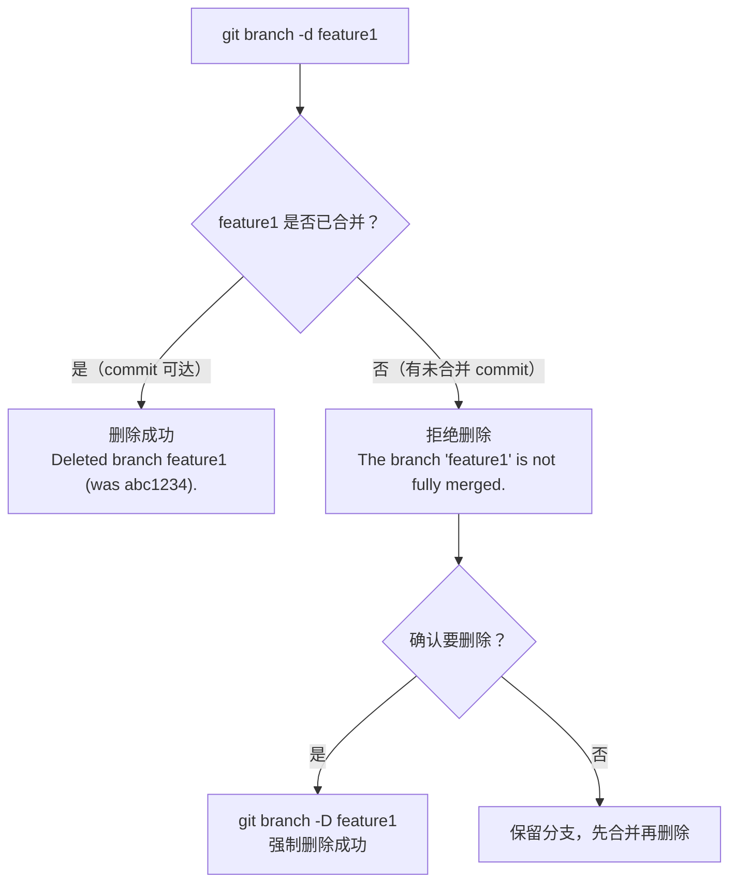
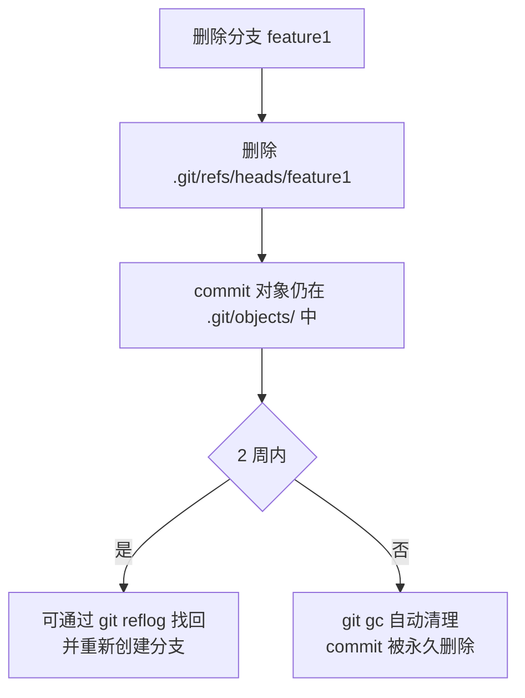

# 分支的创建、切换与删除

分支（branch）是 Git 最核心的能力之一。前面的章节我们已经理解了分支的本质——它只是一个指向 commit 的可移动引用。本节将深入讲解分支的三个基本操作：创建、切换与删除，并剖析它们在底层究竟做了什么。

---

## 一、创建分支：`git branch <name>`

### 1.1 基本用法

```bash
git branch feature1
```

这条命令会在**当前 HEAD 所指向的 commit** 上创建一个名为 `feature1` 的新分支引用。注意：它**只创建引用，不切换 HEAD**。执行后，你的工作目录、暂存区、HEAD 全都保持原样，唯一的区别是 `.git/refs/heads/` 目录下多了一个文件。



执行前后对比：

| 项目 | 执行前 | 执行后 |
|------|--------|--------|
| HEAD | 指向 `main` | 依然指向 `main` |
| 工作目录 | C3 的内容 | 依然是 C3 的内容 |
| 新增引用 | 无 | `feature1` -> C3 |

### 1.2 基于指定 commit 创建

`git branch` 默认基于 HEAD 创建，但你也可以指定任意 commit 作为起点：

```bash
# 基于某个 commit 的 SHA-1 创建
git branch hotfix abc1234

# 基于某个标签创建
git branch release-v2 v1.0

# 基于某个远程分支创建（本地跟踪分支）
git branch feature2 origin/feature2
```

这在实际开发中非常常见——比如你需要基于某个历史版本拉出一个修复分支，或者基于远程同事的分支创建本地副本。

### 1.3 底层操作：写入 refs/heads/ 文件

创建分支的底层操作极其简单——Git 只是在 `.git/refs/heads/` 目录下写入一个文本文件，文件名就是分支名，文件内容就是它所指向的 commit 的 SHA-1 值。

```bash
# 手动创建一个分支（与 git branch 等价）
echo "abc1234def56789012345678901234567890abcd" > .git/refs/heads/my-branch
```

你可以验证：

```bash
# 查看分支引用文件的内容
cat .git/refs/heads/feature1
# 输出类似：a1b2c3d4e5f6...

# 用 git rev-parse 验证
git rev-parse feature1
# 输出与上面一致
```

> **注意**：现代 Git 为了性能，会将引用打包到 `.git/packed-refs` 文件中。当你创建新分支时，Git 会在 `refs/heads/` 下创建独立文件；当执行 `git gc` 或 `git pack-refs` 后，这些引用可能被合并到 `packed-refs` 中。但逻辑上，每个分支仍然对应一个引用。

---

## 二、切换分支：`git checkout <name>`

### 2.1 基本用法

```bash
git checkout feature1
```

切换分支是一个**多步操作**，它做了以下三件事：

1. **移动 HEAD**：将 HEAD 从当前分支指向目标分支
2. **更新暂存区**：将暂存区（index）重置为目标 commit 的树对象
3. **更新工作目录**：将工作目录的文件内容替换为目标 commit 对应的快照



切换前后的状态变化：



### 2.2 切换时的安全检查

Git 在切换分支前会进行安全检查，防止你丢失未提交的修改。核心逻辑是：

- 如果工作目录中有**已修改的文件**，且这些文件在目标分支中与当前分支**内容不同**，Git 会拒绝切换并报错
- 如果已修改的文件在两个分支中**内容相同**，Git 允许切换，修改会被保留

```bash
# 典型的拒绝切换报错
error: Your local changes to the following files would be overwritten by checkout:
        src/main.js
Please commit your changes or stash them before you switch branches.
Aborting
```

应对方式有三种：

```bash
# 方式 1：提交修改后再切换
git add .
git commit -m "work in progress"
git checkout feature1

# 方式 2：暂存修改后切换
git stash
git checkout feature1
git stash pop  # 切回来后恢复

# 方式 3：强制切换（丢弃所有未提交的修改，慎用！）
git checkout -f feature1
```

### 2.3 底层操作：更新 HEAD + 重置工作目录

切换分支的底层操作可以拆解为：

```bash
# 1. 更新 HEAD 文件
echo "ref: refs/heads/feature1" > .git/HEAD

# 2. 读取目标 commit 的树对象
tree_hash=$(git cat-file -p $(git rev-parse feature1) | grep tree | awk '{print $3}')

# 3. 将暂存区重置为该树对象
git read-tree $tree_hash

# 4. 将工作目录更新为暂存区的内容
git checkout-index -a -f
```

其中，步骤 2-4 的核心是 `git read-tree` + `git checkout-index` 的组合，它们共同完成了"将工作目录和暂存区同步到目标 commit"的工作。

---

## 三、创建并切换：`git checkout -b <name>`

### 3.1 基本用法

```bash
git checkout -b feature1
```

这等价于依次执行：

```bash
git branch feature1
git checkout feature1
```

也可以基于指定 commit 创建并切换：

```bash
# 基于 v1.0 标签创建并切换
git checkout -b hotfix v1.0

# 基于某个远程分支创建并切换
git checkout -b local-feature origin/feature
```

### 3.2 为什么推荐 -b？

在实际开发中，创建分支后几乎总是需要立即切换过去。分开执行两条命令不仅繁琐，还容易忘记切换。`-b` 选项将两步合为一步，是最常用的分支创建方式。

---

## 四、Git 2.23+ 新命令：`switch` 与 `restore`

### 4.1 为什么拆分？

`git checkout` 是 Git 中最"超载"的命令之一——它同时承担了**切换分支**和**恢复文件**两种截然不同的职责。这种设计容易导致混淆和误操作（比如本想切换分支，却因为参数写错而恢复了文件）。

Git 2.23（2019 年 8 月发布）引入了两个新命令来拆分 `checkout` 的职责：

- **`git switch`**：专门负责分支切换
- **`git restore`**：专门负责文件恢复


### 4.2 `git switch` 详解

```bash
# 切换到已有分支
git switch feature1

# 创建并切换到新分支
git switch -c feature1

# 基于指定 commit 创建并切换
git switch -c hotfix abc1234

# 切换到上一个分支（类似 cd -）
git switch -

# 强制切换（丢弃本地修改，慎用）
git switch -f feature1
```

### 4.3 `git restore` 详解

```bash
# 恢复工作目录中的文件（从暂存区恢复）
git restore main.js

# 恢复暂存区中的文件（从 HEAD 恢复）
git restore --staged main.js

# 同时恢复工作目录和暂存区
git restore --staged --worktree main.js

# 从指定 commit 恢复
git restore --source=abc1234 main.js
```

### 4.4 对照表：checkout vs switch vs restore

| 功能 | `git checkout` | `git switch` | `git restore` |
|------|---------------|-------------|--------------|
| 切换分支 | `checkout <branch>` | `switch <branch>` | -- |
| 创建并切换分支 | `checkout -b <branch>` | `switch -c <branch>` | -- |
| 恢复工作目录文件 | `checkout -- <file>` | -- | `restore <file>` |
| 取消暂存 | `checkout HEAD -- <file>` | -- | `restore --staged <file>` |
| 从指定 commit 恢复 | `checkout <commit> -- <file>` | -- | `restore --source=<commit> <file>` |
| 切换到上一个分支 | `checkout -` | `switch -` | -- |
| 强制切换 | `checkout -f <branch>` | `switch -f <branch>` | -- |
| 分离 HEAD | `checkout <commit>` | `switch --detach <commit>` | -- |

> **兼容性说明**：`git checkout` 并未被废弃，它仍然可用且完全兼容。新命令 `switch` 和 `restore` 是更安全的替代方案，推荐在新项目中优先使用。但如果你在旧环境或团队中工作，`checkout` 依然是通用选择。

---

## 五、分支底层操作全景图

下面用一张完整的 mermaid 流程图，展示分支创建与切换的底层操作全貌：



### 5.1 创建分支的文件系统视角



### 5.2 切换分支的文件系统视角



---

## 六、删除分支：`git branch -d <name>`

### 6.1 基本用法

```bash
git branch -d feature1
```

删除分支看似简单，但背后有重要的安全机制。

### 6.2 `-d` vs `-D`：安全删除与强制删除

| 选项 | 含义 | 安全检查 | 适用场景 |
|------|------|---------|---------|
| `-d` | `--delete` | 有。只允许删除已合并的分支 | 常规删除，防止误删未合并的工作 |
| `-D` | `--delete --force` | 无。强制删除，不做任何检查 | 确认要丢弃未合并的工作 |

**`-d` 的安全检查机制**：

Git 在执行 `-d` 删除时，会检查该分支是否已经合并到其上游分支（upstream）或当前 HEAD 所在分支。如果该分支包含尚未合并的 commit，Git 会拒绝删除：

```bash
# 尝试删除未合并的分支
git branch -d feature1
# error: The branch 'feature1' is not fully merged.
# If you are sure you want to delete it, run 'git branch -D feature1'.
```

这个安全检查的判断依据是：目标分支是否可以从当前 HEAD（或上游分支）**可达**。换句话说，如果目标分支上的 commit 已经存在于当前分支的历史中，就视为"已合并"。



### 6.3 删除分支的限制

1. **不能删除当前分支**：HEAD 指向的分支无法删除，必须先切换到其他分支

```bash
git branch -d main
# error: Cannot delete branch 'main' checked out at '/path/to/repo'
```

2. **不能删除不存在的分支**：分支名不存在时会报错

```bash
git branch -d nonexistent
# error: branch 'nonexistent' not found.
```


### 6.4 删除分支的底层：删除 refs/heads/ 下的文件

删除分支的底层操作同样简单——Git 只是从 `.git/refs/heads/` 目录下删除对应的文件：

```bash
# 手动删除一个分支（与 git branch -d 等价，但跳过安全检查）
rm .git/refs/heads/feature1

# 如果引用在 packed-refs 中，需要用 git update-ref
git update-ref -d refs/heads/feature1
```

**关键问题：删除分支后，commit 会消失吗？**

答案是：**不会立即消失**。

分支只是一个引用，删除引用只是移除了指向 commit 的"路标"，commit 对象本身仍然存在于 `.git/objects/` 目录中。这些"无引用"的 commit 被称为**悬空 commit（dangling commit）**，它们会在以下条件下被 Git 的垃圾回收机制（`git gc`）清除：

- 默认情况下，超过 **2 周** 的悬空对象会被自动清理
- 在 2 周的宽限期内，你可以通过 `git reflog` 找回这些 commit

```bash
# 查看悬空 commit
git fsck --lost-found
# dangling commit abc1234...

# 通过 reflog 找回
git reflog
# abc1234 HEAD@{5}: checkout: moving from feature1 to main

# 恢复分支
git branch recovered-feature1 abc1234
```



> **实用技巧**：如果你误删了分支，不要慌张。只要在 2 周内，用 `git reflog` 找到对应的 commit SHA-1，然后 `git branch <name> <sha-1>` 就能恢复。这也是为什么 Git 的 reflog 机制如此重要——它是你的安全网。

---

## 七、分支列表与查看

### 7.1 `git branch`：查看本地分支

```bash
git branch
# * feature1
#   main
#   hotfix
```

输出中，`*` 标记表示当前 HEAD 所在的分支。

### 7.2 `git branch -a`：查看所有分支（含远程）

```bash
git branch -a
# * feature1
#   main
#   hotfix
#   remotes/origin/main
#   remotes/origin/feature2
#   remotes/origin/develop
```

`-a` 选项会同时显示本地分支和远程跟踪分支。远程分支以 `remotes/` 前缀标识。

### 7.3 `git branch -v`：查看分支及其最新 commit

```bash
git branch -v
# * feature1  a1b2c3d Add login page
#   main      e5f6a7b Update README
#   hotfix    9a8b7c6 Fix critical bug
```

`-v` 选项会在分支名后面显示每个分支最新 commit 的缩写 SHA-1 和提交信息的第一行。

### 7.4 更多查看选项

| 选项 | 含义 | 示例输出 |
|------|------|---------|
| `git branch` | 仅本地分支 | `* main` |
| `git branch -a` | 本地 + 远程分支 | `* main`, `remotes/origin/main` |
| `git branch -v` | 本地分支 + 最新 commit | `* main abc1234 Initial commit` |
| `git branch -vv` | 本地分支 + commit + 上游分支 + 领先/落后 | `* main abc1234 [origin/main] Initial commit` |
| `git branch -r` | 仅远程分支 | `origin/main`, `origin/develop` |
| `git branch --merged` | 已合并到当前分支的分支 | `feature1`, `hotfix` |
| `git branch --no-merged` | 未合并到当前分支的分支 | `feature2` |
| `git branch --contains <commit>` | 包含指定 commit 的分支 | `main`, `feature1` |

`-vv` 选项特别实用，它能显示每个本地分支跟踪的远程分支以及领先/落后的 commit 数：

```bash
git branch -vv
# * main      abc1234 [origin/main] Update README
#   feature1  def5678 [origin/feature1: ahead 2, behind 1] Add login
#   hotfix    90ab1c2 Fix critical bug
```

这告诉你 `feature1` 分支比远程领先 2 个 commit、落后 1 个 commit，需要同步。

### 7.5 分支查看的底层

`git branch` 命令本质上就是遍历 `.git/refs/heads/` 目录下的所有文件，读取每个文件的内容（commit SHA-1），然后格式化输出。`-a` 选项额外遍历 `.git/refs/remotes/` 目录。

```bash
# 手动列出所有本地分支
ls .git/refs/heads/
# feature1  main  hotfix

# 手动查看某分支指向的 commit
cat .git/refs/heads/main
# abc1234def56789012345678901234567890abcd
```

---

## 八、小结

本节详细讲解了分支的创建、切换与删除操作，以及 Git 2.23+ 引入的新命令。核心要点如下：

1. **创建分支**（`git branch <name>`）：只在 `.git/refs/heads/` 下新建一个引用文件，指向当前 HEAD 的 commit。不移动 HEAD，不改变工作目录。

2. **切换分支**（`git checkout <name>` / `git switch <name>`）：移动 HEAD 指向目标分支，重置暂存区和工作目录为目标 commit 的内容。Git 会进行安全检查，防止丢失未提交的修改。

3. **创建并切换**（`git checkout -b <name>` / `git switch -c <name>`）：创建与切换的合体，是最常用的分支创建方式。

4. **新命令体系**（Git 2.23+）：`git switch` 专管分支切换，`git restore` 专管文件恢复，替代了 `checkout` 的双重职责，语义更清晰，误操作风险更低。

5. **删除分支**（`git branch -d <name>`）：删除 `.git/refs/heads/` 下的引用文件。`-d` 有安全检查（拒绝删除未合并分支），`-D` 强制删除。删除分支不会立即删除 commit，commit 在 2 周内可通过 reflog 恢复。

6. **底层本质**：分支只是一个文本文件，创建是写文件，切换是改 HEAD + 重置工作目录，删除是删文件。Git 的分支操作之所以极快（毫秒级），正是因为这些操作只涉及文件读写，不涉及文件复制。

7. **分支查看**：`git branch` 系列命令提供了丰富的查看选项，`-v`、`-vv`、`--merged`、`--no-merged` 等在日常开发中非常实用。

