# merge 合并

## merge 的含义

`git merge` 是 Git 中将分叉的分支重新合拢的核心操作。其本质是：**从两个分支的分叉点（merge base）起，分别沿两条路径收集变更，将这些变更统一应用到当前 commit 上，最终生成一个新的 merge commit。**

更准确地说，merge 做了这些事：

1. 找到当前分支与目标分支的最近公共祖先（merge base）
2. 分别计算从 merge base 到当前 HEAD、从 merge base 到目标 commit 的差异
3. 将两组差异进行合并（三路合并算法）
4. 若无冲突，自动生成一个新的 merge commit，该 commit 拥有**两个父提交**

> **关键认知**：merge commit 与普通 commit 的区别在于它有**两个（或更多）父提交**。这是 Git 历史图中出现分叉再合拢的结构基础。

## merge 的 Mermaid 图解

一次完整的分支创建→分叉→合并过程如下：

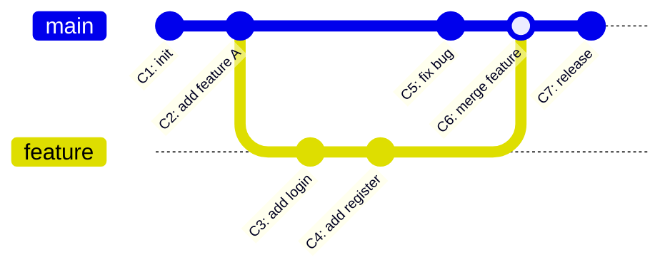

上图中：

- `C1`、`C2` 在 `main` 分支上
- 从 `C2` 处分叉出 `feature` 分支，产生了 `C3`、`C4`
- `main` 分支同时继续推进到 `C5`
- `C6` 是 merge commit，将 `feature` 的内容合入 `main`，它同时指向 `C5` 和 `C4`
- 合并后 `main` 继续推进

从提交对象的角度看，merge commit 的结构为：

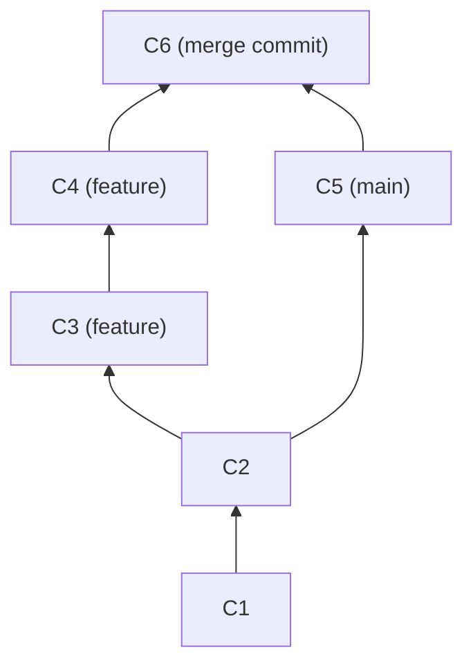

> C6 拥有两个父指针：first parent 指向 C5（当前分支），second parent 指向 C4（被合并分支）。

## 三路合并算法（3-way Merge）

### 为什么需要三路合并？

如果只是简单地做两路比较（diff HEAD vs target），就无法判断"某一方有改动、另一方没有"的情况下，这个改动到底是新增的内容还是原本就有的内容被另一方删除了。**必须有一个基准点**来做参照，这就是 merge base。

### merge base 的概念

merge base 是两个分支的**最近公共祖先（Lowest Common Ancestor, LCA）**。Git 通过提交图的拓扑关系来寻找它：

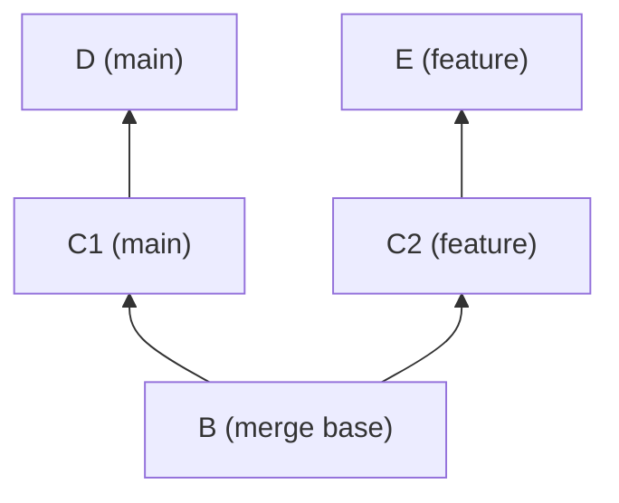

上图中，`B` 是 `main`（指向 `D`）和 `feature`（指向 `E`）的 merge base。

使用 `git merge-base` 命令可以手动查找：

```bash
# 查找两个分支的 merge base
git merge-base main feature

# 更直观地查看：输出 merge base 的简短哈希
git rev-parse --short $(git merge-base main feature)
```

### 三路比较的逻辑

三路合并算法同时比较**三个版本**的同一文件内容：

| 比较对象 | 含义 |
|---------|------|
| **Base** | merge base 中的文件版本 |
| **Ours** | 当前分支（HEAD）中的文件版本 |
| **Theirs** | 目标分支中的文件版本 |

合并决策规则如下：

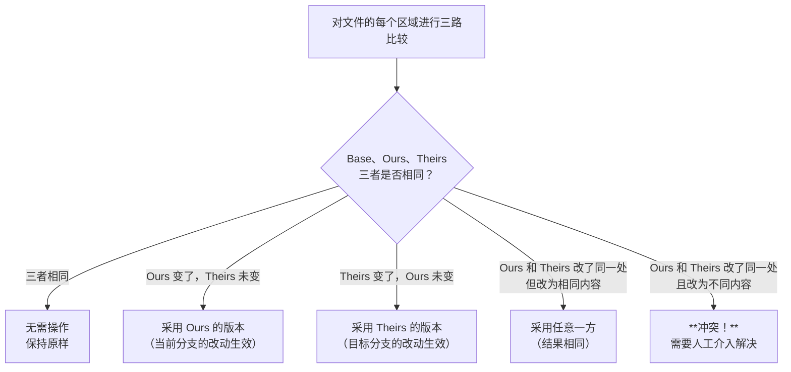

用一个具体例子来说明。假设某文件一行原始内容为 `color = red`：

| 场景 | Base | Ours | Theirs | 结果 |
|------|------|------|--------|------|
| 都没改 | `color = red` | `color = red` | `color = red` | `color = red` |
| 只有 Ours 改 | `color = red` | `color = blue` | `color = red` | `color = blue` |
| 只有 Theirs 改 | `color = red` | `color = red` | `color = green` | `color = green` |
| 改成一样 | `color = red` | `color = blue` | `color = blue` | `color = blue` |
| 改成不同 | `color = red` | `color = blue` | `color = green` | **冲突** |

> **核心原则**：只有当 Ours 和 Theirs 对同一处做了**不同修改**时才会产生冲突。如果只有一方修改，另一方保持原样，Git 可以自动合并。

## 三种特殊情况


### 1. 冲突（Conflict）

#### 产生原因

当两个分支对**同一文件的同一区域**做了不同修改时，Git 无法自动判断应该采用哪个版本，此时就会产生冲突。

注意区分两个概念：

- **同一文件的不同区域**被分别修改 → Git 可以自动合并，不会冲突
- **同一文件的同一区域**被分别修改 → 冲突，需要手动解决

#### 冲突标记解析

产生冲突后，Git 会在冲突文件中插入特殊标记：

```
<<<<<<< HEAD
color = blue
=======
color = green
>>>>>>> feature
```

各部分含义：

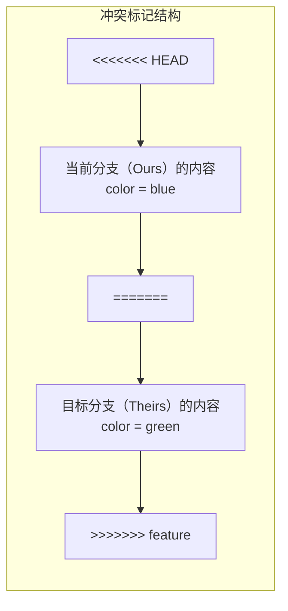

- `<<<<<<< HEAD`：冲突区域开始，以下是当前分支的内容
- `=======`：分隔线，上方是 Ours，下方是 Theirs
- `>>>>>>> feature`：冲突区域结束，feature 是被合并分支的名称

如果文件中有多个冲突区域，每个区域都会有自己的一组标记。

#### 手动解决冲突的步骤

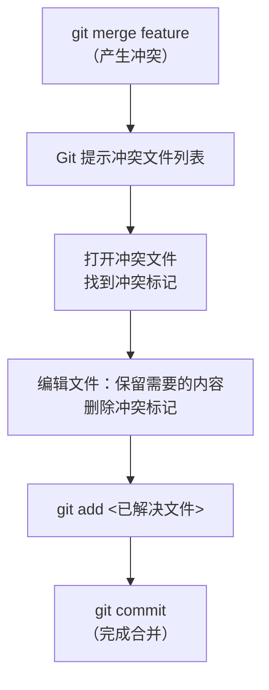

完整操作示例：

```bash
# 1. 执行合并，出现冲突
git merge feature
# Auto-merging config.txt
# CONFLICT (content): Merge conflict in config.txt
# Automatic merge failed; fix conflicts and then commit the result.

# 2. 查看冲突文件列表
git status
# Unmerged paths:
#   both modified:   config.txt

# 3. 打开文件，手动编辑解决冲突
# 将：
#   <<<<<<< HEAD
#   color = blue
#   =======
#   color = green
#   >>>>>>> feature
# 改为：
#   color = blue   （或 green，或重新写的其他值）

# 4. 标记冲突已解决
git add config.txt

# 5. 完成合并提交
git commit
# Git 会自动生成合并提交信息，通常可以直接保存
```

#### merge tool 配置

对于复杂冲突，手动编辑效率较低。Git 支持配置外部合并工具（merge tool）来可视化地解决冲突：

```bash
# 查看支持的合并工具列表
git mergetool --tool-help

# 设置默认合并工具（以 vimdiff 为例）
git config --global merge.tool vimdiff

# 使用合并工具解决冲突
git mergetool
```

常用合并工具对比：

| 工具 | 类型 | 特点 |
|------|------|------|
| `vimdiff` | 终端 | 轻量，无需额外安装，学习曲线陡峭 |
| `meld` | GUI | 直观的三栏对比，跨平台 |
| `kdiff3` | GUI | 功能强大，支持自动合并 |
| `VSCode` | GUI | `git config --global merge.tool vscode`，开发者友好 |
| `beyondcompare` | GUI | 商业软件，功能最全面 |

配置 VSCode 作为 merge tool 的完整设置：

```bash
git config --global merge.tool vscode
git config --global mergetool.vscode.cmd 'code --wait $MERGED'
```

运行 `git mergetool` 时，Git 会依次打开每个冲突文件，在工具中解决后保存退出即可。

### 2. HEAD 领先于目标（Already up to date）

当目标分支的所有 commit 已经完全包含在当前分支的历史中时，merge 操作什么也不做：

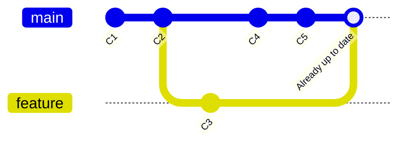

```bash
git merge feature
# Already up to date.
```

此时 `feature` 指向的 `C3` 是 `main` 的祖先，`main` 已经领先了，合并无意义。

> **典型场景**：你从 `main` 创建了 `feature`，但 `feature` 上还没有任何新提交，此时在 `main` 上合并 `feature` 就会提示 Already up to date。

### 3. HEAD 落后于目标（Fast-forward）

当当前分支（HEAD）是目标分支的直接祖先时，Git 不需要创建新的 merge commit，只需将 HEAD 指针直接移动到目标 commit 即可，这称为 **fast-forward**（快进合并）：

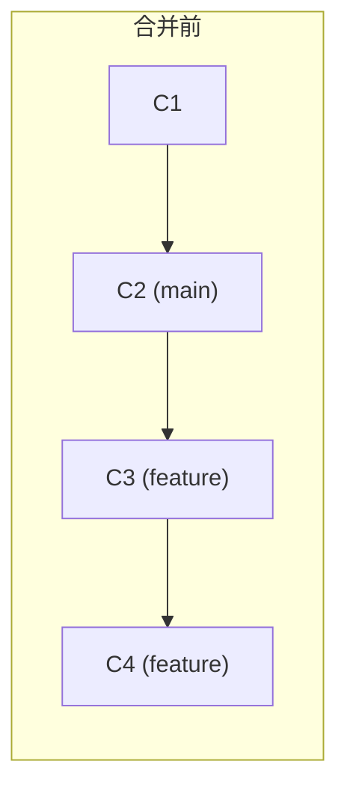

```mermaid
graph LR
    subgraph 合并后（fast-forward）
        B1["C1"] --> B2["C2"]
        B2 --> B3["C3"]
        B3 --> B4["C4 (main, feature)"]
    end
```

```bash
# main 停在 C2，feature 推进到了 C4
git checkout main
git merge feature
# Fast-forward
#  C2..C4
```

Fast-forward 的本质是**指针移动**，没有产生新的 commit。合并后的历史是一条直线，看不出曾经有过分支。

> **注意**：只有当当前分支在分叉后没有任何新提交时，才能 fast-forward。如果当前分支也有新提交，就必须走三路合并。

## --no-ff 与 --ff-only 的对比

### 默认行为

Git merge 的默认策略是：**能 fast-forward 就 fast-forward，不能就走三路合并创建 merge commit。**

### --no-ff：禁止快进，强制创建 merge commit

`--no-ff`（no fast-forward）即使可以 fast-forward，也强制创建一个 merge commit，保留分支存在过的历史痕迹。

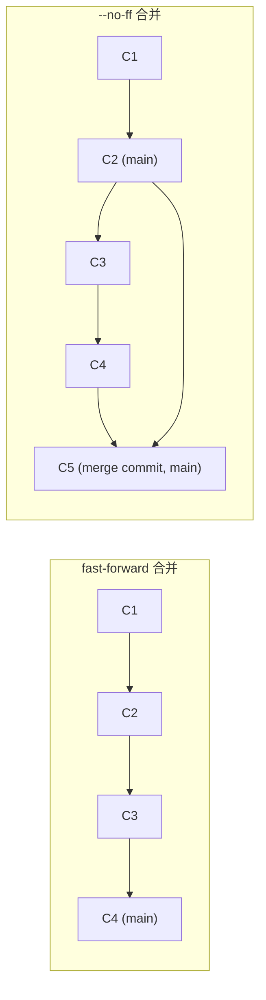

```bash
git merge --no-ff feature
# Merge made by the 'ort' strategy.
#  login.py | 30 +++++++++
#  register.py | 45 ++++++++++++++
#  2 files changed, 75 insertions(+)
```

**适用场景**：

- 合并功能分支到 `main`/`develop`，希望保留分支信息
- 需要在历史中清晰标识"这里完成了一个功能"
- 方便日后回滚整个功能的提交


### --ff-only：只允许快进，否则拒绝合并

`--ff-only` 要求合并必须能 fast-forward，如果不能就报错中止。

```bash
# 场景：main 和 feature 都有新提交，无法 fast-forward
git merge --ff-only feature
# fatal: Not possible to fast-forward, aborting.
```

**适用场景**：

- 拉取远程更新时（`git pull --ff-only`），确保不会意外产生 merge commit
- 保持主分支历史线性
- CI/CD 中的安全策略，避免合并引入意外的 merge commit

### 三种策略对比

| 策略 | 能 FF 时 | 不能 FF 时 | 历史形态 |
|------|---------|-----------|---------|
| 默认 | FF | 创建 merge commit | 混合 |
| `--no-ff` | 创建 merge commit | 创建 merge commit | 始终有分叉记录 |
| `--ff-only` | FF | 报错中止 | 线性 |

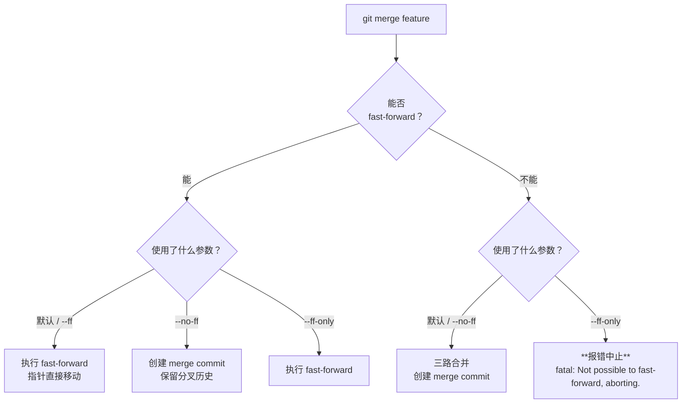

> **实践建议**：在团队协作中，合并功能分支到主干时推荐 `--no-ff`，拉取远程更新时推荐 `--ff-only`。可以在 Git 配置中设置默认行为：
>
> ```bash
> # pull 默认使用 ff-only
> git config --global pull.ff only
>
> # merge 默认使用 no-ff（不推荐全局设置，按需使用即可）
> # git config --global merge.ff false
> ```

## merge 的适用场景

### 1. 合并分支

最常见的用途——将功能分支的工作成果合入主干：

```bash
# 将 feature/login 合并到 main
git checkout main
git merge feature/login

# 合并时禁止快进，保留分支记录
git merge --no-ff feature/login
```

### 2. git pull 的内部操作

`git pull` 的本质是 `git fetch` + `git merge`：

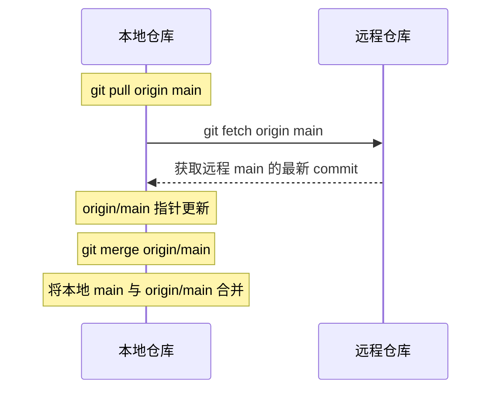

```bash
# 以下两条命令等价
git pull origin main

# 等价于：
git fetch origin main
git merge origin/main
```

`git pull` 可能产生的问题：

- 如果本地有新提交且远程也有新提交，pull 会自动产生一个 merge commit，可能污染历史
- 因此推荐使用 `git pull --ff-only` 或 `git pull --rebase`

```bash
# 安全的拉取方式：只允许快进
git pull --ff-only origin main

# 用 rebase 代替 merge 来拉取（保持线性历史）
git pull --rebase origin main
```

### 3. 其他合并场景

```bash
# 合并某个特定 commit（不是整个分支）
git merge <commit-hash>

# 合并时指定提交信息
git merge -m "Merge feature/login: add user authentication" feature/login

# 合并但不自动提交（可以自己修改后再提交）
git merge --no-commit feature
```

## 放弃 merge

当合并过程中出现冲突，或者你发现合并方向错误，可以在合并完成前随时放弃：

```bash
# 放弃本次合并，恢复到合并前的状态
git merge --abort
```

`--abort` 的作用是将工作区和索引完全恢复到合并操作之前的状态，就像合并从未发生过一样。

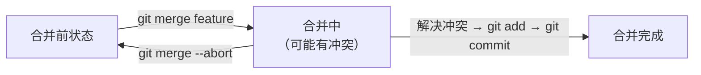

> **注意**：`git merge --abort` 只能在合并过程中使用（即合并尚未完成时）。如果已经执行了 `git commit` 完成了合并，则需要用 `git reset` 来回退。

如果只想放弃某个文件的冲突解决，而不是整个合并：

```bash
# 将某个冲突文件恢复到合并前的状态（使用当前分支版本）
git checkout --ours <file>

# 将某个冲突文件恢复到合并前的状态（使用目标分支版本）
git checkout --theirs <file>

# 重新检出冲突文件（撤销对该文件的冲突解决尝试）
git checkout -m <file>
```

## 小结

| 概念 | 要点 |
|------|------|
| **merge 本质** | 找到 merge base，三路合并两组差异，生成双父 merge commit |
| **三路合并** | 对 Base、Ours、Theirs 逐区域比较：单方改动自动合并，双方同处不同改动产生冲突 |
| **冲突** | 手动编辑解决 → `git add` → `git commit`；可用 `git mergetool` 辅助 |
| **Already up to date** | HEAD 领先于目标，无需操作 |
| **Fast-forward** | HEAD 是目标的祖先，指针直接快进，无新 commit |
| **--no-ff** | 禁止快进，始终创建 merge commit，保留分支历史 |
| **--ff-only** | 只允许快进，不能 FF 则报错，保持线性历史 |
| **pull = fetch + merge** | 拉取远程更新会触发合并，推荐 `--ff-only` 或 `--rebase` |
| **--abort** | 合并过程中放弃，恢复到合并前状态 |

**核心记忆口诀**：

> merge 找基点，三路来比较；一方改听改，两方改看是否同；同则无碍不同则冲突，冲突手动解决再提交。
>
> FF 快进指针移，no-ff 留痕保历史，ff-only 求线性，pull 合并要当心。

