# rebase 变基：重新定义提交历史的起点

`merge` 会产生分叉，这是 Git 协作中不可避免的现象。但有些人偏爱线性历史——干净、清晰、一目了然。`rebase` 就是为这种偏好而生的工具。然而，`rebase` 也是 Git 中最容易误用、最容易引发问题的命令之一。理解它的原理，比记住它的用法更重要。

## 一、rebase 的含义：重新设置基础点

`rebase` 由 `re-`（重新）和 `base`（基础）组合而成，字面意思就是"重新设置基础"。在 Git 的语境下，**基础**指的是一个 commit 序列的父 commit（即起点），而 **rebase** 就是把这个序列的父 commit 从原来的位置，换到一个新的位置上。

但这里有一个关键点：rebase 并不是简单地"移动"commit，而是**在新位置重新提交**。这意味着 rebase 之后的 commit 虽然内容与原来相同，但它们的 SHA-1 哈希值已经完全不同了——它们是全新的 commit 对象。

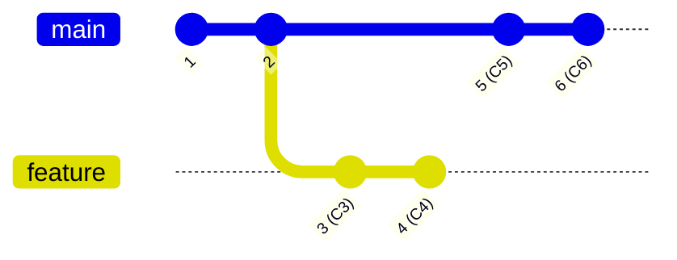

上图中，`feature` 分支从 commit `2` 分叉出去，之后 `main` 继续前进了两个 commit（`5` 和 `6`）。此时 `feature` 的基础点是 commit `2`。

如果我们对 `feature` 执行 `git rebase main`，效果如下：

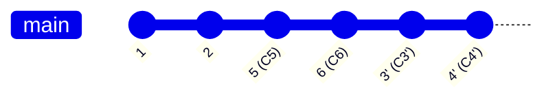

`feature` 分支的基础点从 `2` 变成了 `6`，commit `3` 和 `4` 被重新提交为 `3'` 和 `4'`（带撇号表示它们是新的 commit，SHA-1 已变），历史变成了一条直线。

## 二、rebase 的内部步骤详解

理解 rebase 的内部过程，是正确使用它的前提。rebase 并非一步到位，而是一个**逐 commit 衍合**的过程。下面用序列图逐步展示每个 commit 是如何被重新应用的。

### 2.1 初始状态

假设当前仓库状态如下：

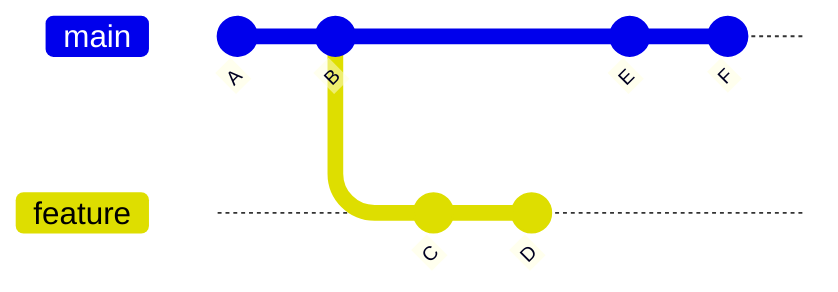

- `main` 指向 `F`
- `feature` 指向 `D`
- `feature` 从 `B` 处分叉

### 2.2 执行 `git checkout feature && git rebase main`

rebase 的内部过程可以分为以下步骤：

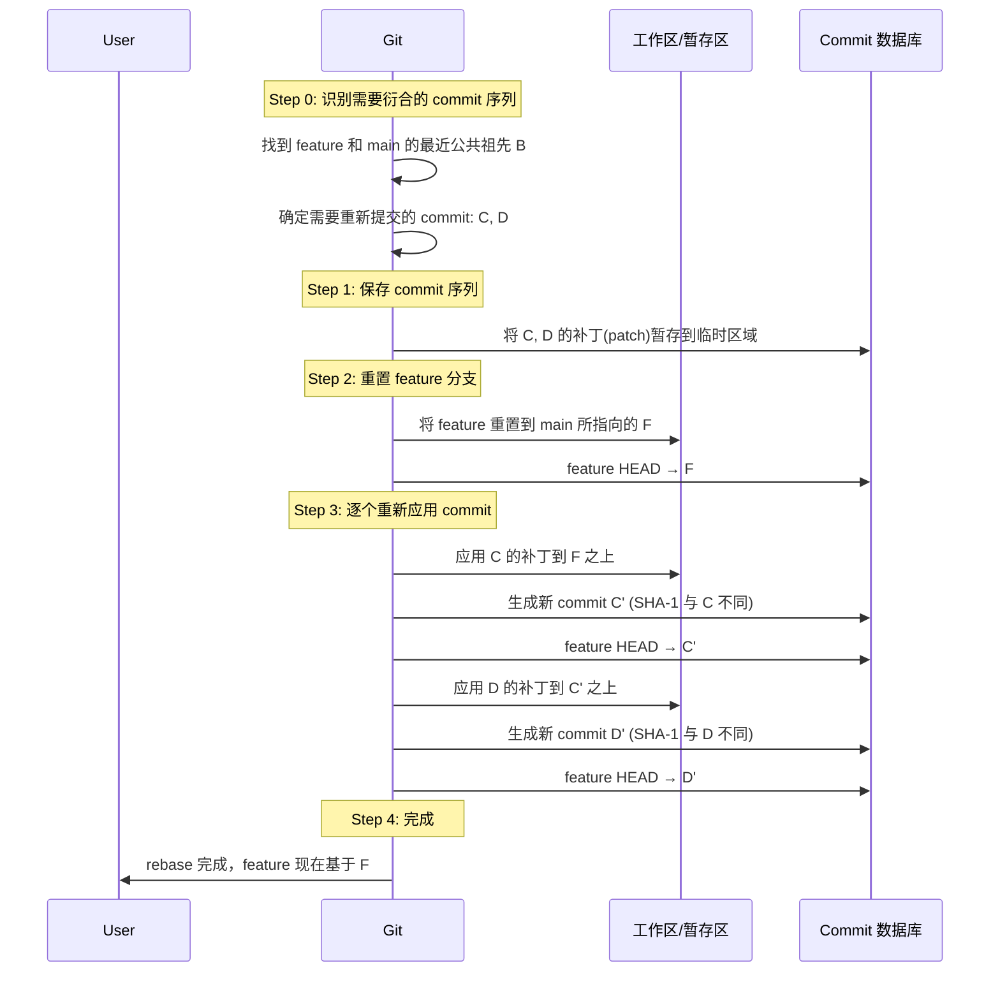

### 2.3 逐步图解

**Step 0 — 识别需要衍合的 commit**

Git 首先找到当前分支（`feature`）与目标分支（`main`）的最近公共祖先，即 commit `B`。然后确定从 `B` 之后 `feature` 上的所有 commit：`C` 和 `D`。

**Step 1 — 暂存补丁**

Git 将 `C` 和 `D` 的变更内容以补丁（patch）的形式保存到临时区域。这些补丁记录的是每个 commit 相对于其父 commit 的差异。

**Step 2 — 重置分支指针**

Git 将 `feature` 分支指针直接重置到 `main` 所指向的 `F`。此时工作区和暂存区的内容与 `F` 一致。

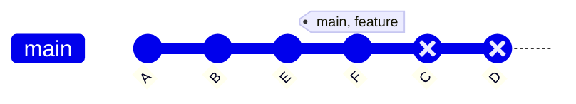

> 注：`C` 和 `D` 变灰表示它们已不在任何分支的路径上，但仍然存在于 Git 的对象数据库中（直到被垃圾回收）。

**Step 3 — 逐个重新应用**

Git 按照原来的顺序，依次将 `C` 的补丁应用到 `F` 之上，生成 `C'`；再将 `D` 的补丁应用到 `C'` 之上，生成 `D'`。

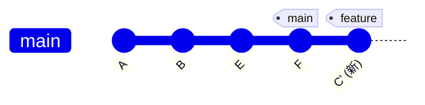

应用 `C` 的补丁后，生成 `C'`。

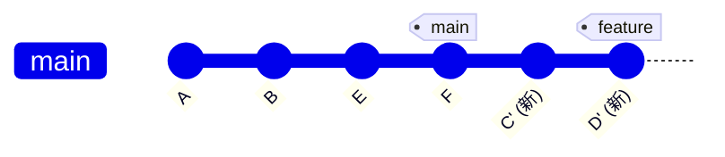

应用 `D` 的补丁后，生成 `D'`，rebase 完成。

### 2.4 关键理解：为什么 SHA-1 会变？

Git 的 commit 对象的 SHA-1 哈希值由以下内容计算得出：

- 文件快照（tree 对象）
- 父 commit 的 SHA-1
- 提交者信息
- 提交时间
- 提交信息

rebase 之后，虽然文件内容（快照）可能相同，但**父 commit 变了**（从 `B` 变成了 `F`），**提交时间也变了**，因此 SHA-1 必然不同。这就是为什么 rebase 产生的是全新的 commit，而不是对原有 commit 的移动。

## 三、rebase 的正确用法

### 3.1 操作方向：从被 rebase 的分支上操作

rebase 的操作方向与 merge 相反：

| 操作 | 执行位置 | 命令 |
|------|---------|------|
| merge | 目标分支（主分支） | `git checkout main && git merge feature` |
| rebase | 被合并分支 | `git checkout feature && git rebase main` |

**rebase 的标准流程：**

```shell
# 1. 切换到需要被 rebase 的分支
git checkout feature

# 2. 将 feature 变基到 main 的最新位置
git rebase main

# 3. 切回主分支
git checkout main

# 4. 合并 feature（此时是 fast-forward，不会产生分叉）
git merge feature
```

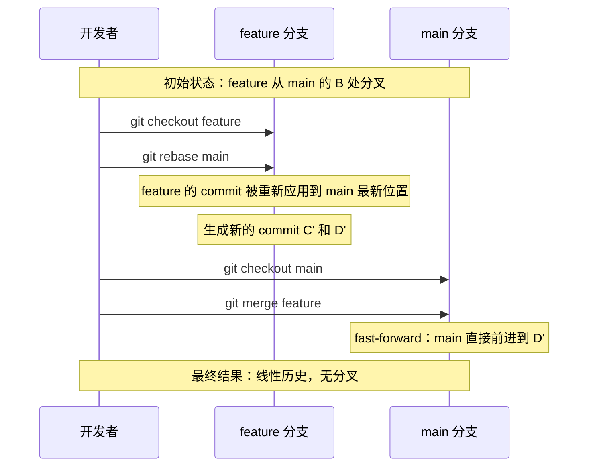

### 3.2 为什么不能反过来操作？

如果直接在 `main` 上执行 `git rebase feature`，效果是**把 main 上的 commit 重新应用到 feature 上**，这会导致 main 上原有的 commit 被替换为新的 commit（SHA-1 变化），而这些旧 commit 可能已经被推送到远程仓库并被其他人基于它们开发了新内容。

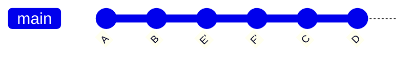

上图中，如果在 `main` 上执行 `git rebase feature`，`E` 和 `F` 会被重新应用为 `E'` 和 `F'`，出现在 `D` 之后。此时 `main` 指向 `F'`，而原来的 `E` 和 `F` 变成了悬空 commit。如果 `E` 和 `F` 已经推送到远程，就会产生严重的历史不一致问题。


## 四、黄金规则：不要 rebase 已推送到公共仓库的 commit

这是 rebase 最重要的规则，违反它会导致团队协作中的严重问题。

### 4.1 规则内容

**永远不要对已经推送到公共仓库（远程仓库）并且可能被他人基于其开发的 commit 执行 rebase。**

### 4.2 原因详解

问题的根源在于 rebase 会改变 commit 的 SHA-1。当你的 commit 已经推送到远程仓库后，其他团队成员可能已经基于这些 commit 进行了新的开发。如果你在本地 rebase 了这些 commit，就相当于你创建了一组全新的 commit，与远程仓库中的旧 commit 内容相同但 SHA-1 不同。

当你尝试 push 这些 rebase 后的 commit 时，Git 会拒绝，因为远程仓库的历史与你本地的历史已经分叉了。即使你使用 `git push --force` 强制推送，也会覆盖远程仓库中其他人基于旧 commit 开发的内容。

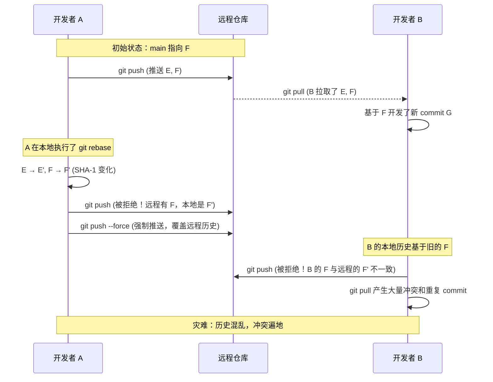

### 4.3 错误 rebase 的后果图示

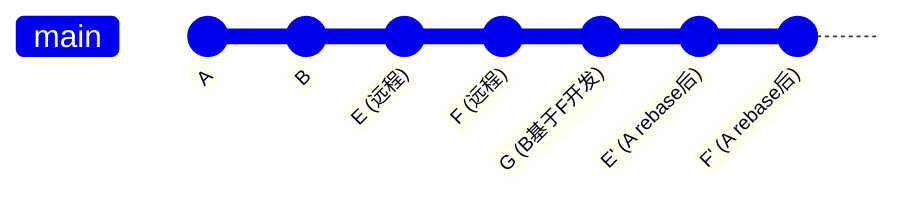

上图中，`E`/`F` 是远程仓库中的原始 commit，`G` 是开发者 B 基于 `F` 开发的新 commit，而 `E'`/`F'` 是开发者 A rebase 后产生的新 commit。此时历史出现了严重的分叉，`G` 仍然基于旧的 `F`，而 `F'` 是全新的 commit。合并时会产生大量冲突，甚至出现重复的变更内容。

### 4.4 如果已经 rebase 了已推送的 commit，怎么办？

如果已经不小心 rebase 了，且尚未推送，最简单的办法是放弃这次 rebase：

```shell
git rebase --abort
```

如果 rebase 已经完成但尚未推送，可以用 `git reflog` 找到 rebase 之前的 HEAD 位置，然后重置回去：

```shell
# 查看 reflog，找到 rebase 之前的 HEAD
git reflog

# 重置到 rebase 之前的位置（替换 <n> 为 reflog 中的序号）
git reset --hard HEAD@{<n>}
```

如果已经强制推送了……那就需要与团队成员沟通，协调修复历史。

### 4.5 安全使用 rebase 的原则

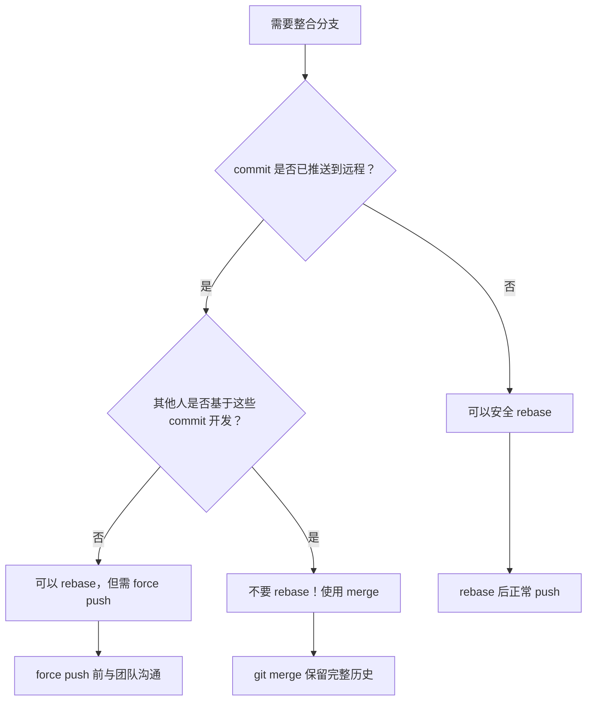

## 五、interactive rebase（git rebase -i）详解

交互式 rebase 是 Git 中最强大的历史编辑工具。它允许你在 rebase 的过程中对 commit 序列进行修改，包括合并、重写提交信息、编辑、删除和重排。

### 5.1 启动交互式 rebase

```shell
# 重新整理最近 3 个 commit
git rebase -i HEAD~3

# 重新整理从某个 commit 之后的所有 commit
git rebase -i <commit-hash>

# 重新整理从 main 分叉以来的所有 commit
git rebase -i main
```

执行后，Git 会打开编辑器，显示类似以下内容：

```
pick e3a1b35 添加用户登录功能
pick 7ac9a02 修复登录页面的样式问题
pick 4bd2f8c 添加登录日志记录

# Rebase instructions:
# p, pick <commit> = 使用该 commit
# r, reword <commit> = 使用该 commit，但修改提交信息
# e, edit <commit> = 使用该 commit，但暂停以便修改 commit 内容
# s, squash <commit> = 使用该 commit，但合并到前一个 commit
# f, fixup <commit> = 类似 squash，但丢弃该 commit 的提交信息
# x, exec <command> = 使用 shell 运行命令
# b, break = 暂停 rebase
# d, drop <commit> = 丢弃该 commit
# l, label <label> = 为当前 HEAD 打标签
# t, reset <label> = 将 HEAD 重置到标签
# m, merge [-C <commit> | -c <commit>] <label> [# <oneline>]
#       创建一个合并 commit
```


### 5.2 各命令详解与视觉效果

#### pick — 保持原样

最简单的操作，保持 commit 不变，直接重新应用。

```
pick e3a1b35 添加用户登录功能
pick 7ac9a02 修复登录页面的样式问题
pick 4bd2f8c 添加登录日志记录
```

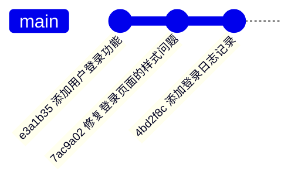

效果：三个 commit 原样保留（SHA-1 可能因 rebase 而变，但内容和信息不变）。

#### squash — 合并到前一个 commit

将当前 commit 的内容合并到前一个 commit 中，并将两个 commit 的提交信息合并编辑。

```
pick e3a1b35 添加用户登录功能
squash 7ac9a02 修复登录页面的样式问题
pick 4bd2f8c 添加登录日志记录
```

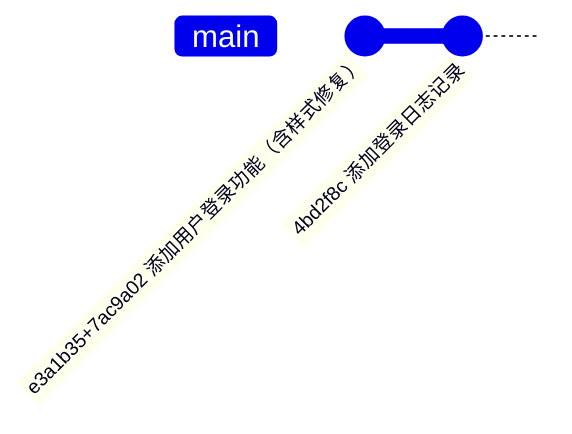

效果：原来的两个 commit 被压缩为一个，Git 会打开编辑器让你合并提交信息。

#### fixup — 合并并丢弃提交信息

与 squash 类似，但直接丢弃当前 commit 的提交信息，只保留前一个 commit 的信息。适合用于"小修复"类的 commit。

```
pick e3a1b35 添加用户登录功能
fixup 7ac9a02 修复登录页面的样式问题
pick 4bd2f8c 添加登录日志记录
```

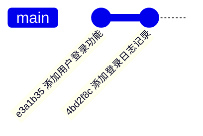

效果：`7ac9a02` 的内容被合并到 `e3a1b35` 中，但其提交信息"修复登录页面的样式问题"被丢弃。

#### reword — 修改提交信息

保留 commit 的内容，但修改其提交信息。

```
pick e3a1b35 添加用户登录功能
reword 7ac9a02 修复登录页面的样式问题
pick 4bd2f8c 添加登录日志记录
```

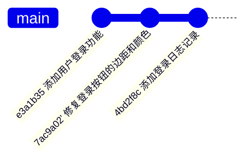

效果：`7ac9a02` 的内容不变，但提交信息被修改为更准确的描述。

#### edit — 暂停并修改 commit 内容

暂停 rebase 过程，允许你修改该 commit 的内容（而不仅仅是提交信息）。你可以添加或删除文件、修改代码，然后继续。

```
pick e3a1b35 添加用户登录功能
edit 7ac9a02 修复登录页面的样式问题
pick 4bd2f8c 添加登录日志记录
```

当 rebase 执行到 `7ac9a02` 时会暂停，你可以：

```shell
# 修改文件内容
vim login.css

# 将修改加入暂存区
git add login.css

# 用修改后的内容修正当前 commit
git commit --amend

# 继续 rebase
git rebase --continue
```

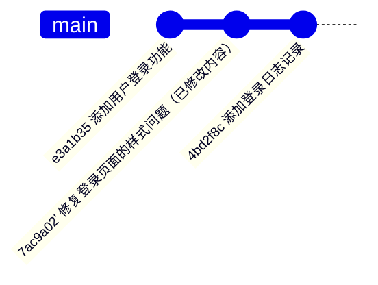

#### drop — 丢弃 commit

完全删除某个 commit，其内容变更将从历史中移除。

```
pick e3a1b35 添加用户登录功能
drop 7ac9a02 修复登录页面的样式问题
pick 4bd2f8c 添加登录日志记录
```


效果：`7ac9a02` 的所有变更被丢弃。注意：如果后续 commit 依赖于被丢弃 commit 的内容，可能会产生冲突。

> 也可以直接在编辑器中删除那一行来达到 drop 的效果。

#### reorder — 重排 commit 顺序

通过调整 commit 在列表中的顺序来改变它们在历史中的位置。

```
pick 4bd2f8c 添加登录日志记录
pick e3a1b35 添加用户登录功能
pick 7ac9a02 修复登录页面的样式问题
```

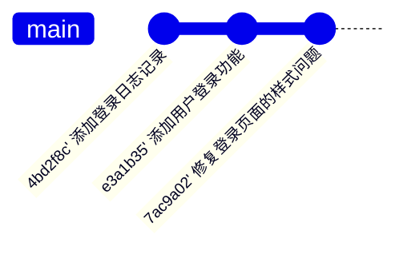

效果：commit 的顺序被重新排列。注意：重排可能导致冲突，特别是当 commit 之间存在依赖关系时。

### 5.3 交互式 rebase 的完整流程

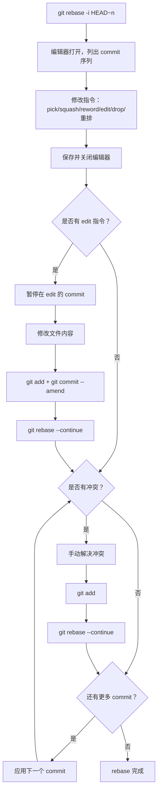

### 5.4 常见使用场景

**场景 1：整理提交历史后再推送**

开发过程中可能产生了许多细碎的 commit（"修复 typo"、"再修复一个 typo"等），在推送前用 interactive rebase 将它们合并为有意义的 commit：

```
pick a1b2c3d 实现用户注册功能
squash d4e5f6a 修复注册表单验证 bug
squash b8c9d0e 修复 typo
pick 1a2b3c4 实现邮箱验证
squash 5d6e7f8 补充邮箱验证的测试
```

**场景 2：修改某个历史 commit 的内容**

发现之前某个 commit 中有错误，需要修改：

```
pick a1b2c3d 实现用户注册功能
edit d4e5f6a 添加数据库索引
pick b8c9d0e 实现搜索功能
```

## 六、rebase 与 merge 的核心区别对比

| 维度 | merge | rebase |
|------|-------|--------|
| **历史形态** | 保留分叉，产生 merge commit | 线性历史，无分叉 |
| **commit SHA-1** | 不变，所有原有 commit 保持原样 | 被重新应用的 commit SHA-1 改变 |
| **操作方向** | 在目标分支上操作：`git checkout main && git merge feature` | 在被合并分支上操作：`git checkout feature && git rebase main` |
| **是否产生新 commit** | 是，产生一个 merge commit | 是，但产生的是被重新应用的 commit（替代原有 commit） |
| **历史真实性** | 完整保留真实的开发时间线和并行关系 | 重写了历史，看起来像是顺序开发，但实际并非如此 |
| **冲突处理** | 一次性解决所有冲突 | 逐 commit 解决冲突，可能需要多次处理 |
| **可逆性** | 容易回退：`git reset --hard` 或 `git merge --abort` | 可通过 `git rebase --abort` 或 `git reflog` 回退，但更复杂 |
| **对公共仓库的安全性** | 安全，不改变已有 commit | 危险，会改变已推送 commit 的 SHA-1 |
| **代码审查** | merge commit 可以清晰看到分支的合并点 | 历史线性，但丢失了分支信息 |
| **适用场景** | 合并公共分支、保留完整历史 | 整理本地私有分支、保持主分支线性 |


### 核心哲学差异

```mermaid
gitGraph
    commit id: "A"
    commit id: "B"
    branch feature
    checkout feature
    commit id: "C"
    commit id: "D"
    checkout main
    commit id: "E"
    commit id: "F"
    merge feature id: "M (merge commit)"
```

**merge 的哲学**：历史就是历史，应该如实记录。分支的存在、并行开发的事实、合并的时间点，都是项目演进的真实信息，不应被抹去。

```mermaid
gitGraph
    commit id: "A"
    commit id: "B"
    commit id: "E"
    commit id: "F"
    commit id: "C'"
    commit id: "D'"
```

**rebase 的哲学**：历史应该被整理成最易理解的形式。并行开发的细节不重要，重要的是每个变更的逻辑顺序。历史是项目的故事，应该被讲得清晰流畅。

两种哲学没有绝对的对错，选择取决于团队偏好和具体场景。

## 七、rebase 的冲突处理

由于 rebase 是逐 commit 重新应用的，冲突处理与 merge 有显著不同。

### 7.1 冲突的产生

当被重新应用的 commit 所修改的内容与目标分支上的内容有重叠时，就会产生冲突。由于是逐个应用，每个 commit 都可能产生冲突。

### 7.2 冲突处理流程

```mermaid
flowchart TD
    A[git rebase main] --> B[应用下一个 commit]
    B --> C{有冲突？}
    C -->|否| D{还有更多 commit？}
    D -->|是| B
    D -->|否| E[rebase 完成]
    C -->|是| F[Git 暂停，标记冲突文件]
    F --> G[手动编辑冲突文件]
    G --> H[git add <已解决文件>]
    H --> I[git rebase --continue]
    I --> B

    F --> J{想放弃？}
    J -->|是| K[git rebase --abort]
    K --> L[回到 rebase 前的状态]

    F --> M{想跳过当前 commit？}
    M -->|是| N[git rebase --skip]
    N --> D
```

### 7.3 具体操作步骤

**1. 查看冲突文件**

```shell
git status
```

冲突文件会被标记为 `both modified`。

**2. 打开冲突文件，解决冲突**

冲突文件的格式与 merge 相同：

```
<<<<<<< HEAD
目标分支的内容
=======
被 rebase 的 commit 的内容
>>>>>>> <commit-hash>
```

手动选择保留哪部分内容，删除冲突标记。

**3. 标记冲突已解决**

```shell
git add <已解决的文件>
```

注意：不要使用 `git commit`，这与 merge 的冲突处理不同。rebase 的冲突解决后只需 `git add`，然后继续 rebase。

**4. 继续 rebase**

```shell
git rebase --continue
```

Git 会继续应用下一个 commit。如果又有冲突，重复上述步骤。

### 7.4 其他冲突处理选项

| 命令 | 含义 |
|------|------|
| `git rebase --continue` | 冲突已解决，继续 rebase |
| `git rebase --abort` | 放弃整个 rebase，回到操作前的状态 |
| `git rebase --skip` | 跳过当前 commit（丢弃该 commit 的变更） |

### 7.5 rebase 冲突 vs merge 冲突

| 维度 | merge 冲突 | rebase 冲突 |
|------|-----------|-------------|
| 冲突次数 | 一次性解决 | 可能逐 commit 多次解决 |
| 解决后操作 | `git add` + `git commit` | `git add` + `git rebase --continue` |
| 放弃操作 | `git merge --abort` | `git rebase --abort` |
| 复杂度 | 相对简单，一次搞定 | 可能更繁琐，但每次冲突范围更小 |

rebase 冲突可能需要多次处理，但每次冲突的范围通常更小（只涉及单个 commit 的变更），这使得每次冲突的解决更聚焦。merge 冲突是一次性解决所有冲突，但冲突范围可能更大。

## 八、小结

| 要点 | 内容 |
|------|------|
| **rebase 的本质** | 重新设置 commit 序列的基础点，在新位置逐个重新提交，产生新的 commit（SHA-1 变化） |
| **内部过程** | 找公共祖先 → 暂存补丁 → 重置分支指针 → 逐个应用补丁 → 生成新 commit |
| **操作方向** | 在被 rebase 的分支上操作，然后切回主分支 merge（fast-forward） |
| **黄金规则** | 不要 rebase 已推送到公共仓库的 commit，否则会导致 SHA-1 变化、历史不一致、push 冲突 |
| **interactive rebase** | `git rebase -i` 提供了 pick/squash/fixup/reword/edit/drop/reorder 等操作，是整理提交历史的利器 |
| **与 merge 的区别** | merge 保留真实历史（有分叉），rebase 重写历史（线性）；merge 安全，rebase 需谨慎 |
| **冲突处理** | 逐 commit 解决，`git add` 后 `git rebase --continue`；可 `--abort` 放弃或 `--skip` 跳过 |

**一句话总结**：rebase 是一把锋利的刀——用得好，可以让提交历史干净利落；用得不好，会伤到整个团队。理解原理、遵守规则、谨慎使用，是掌握 rebase 的关键。

