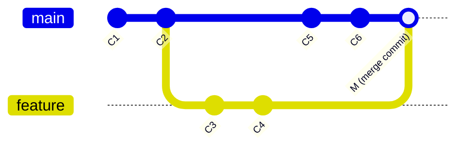
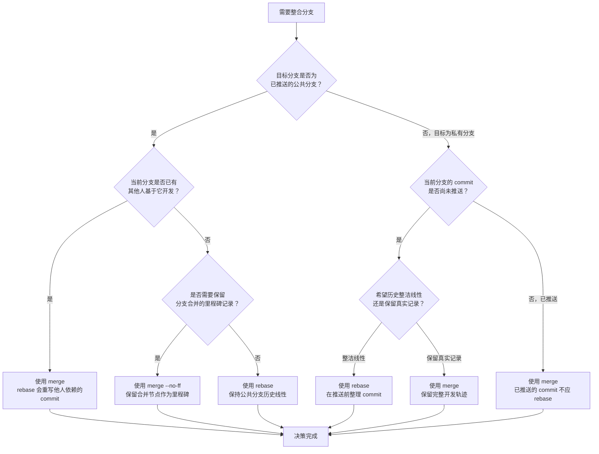
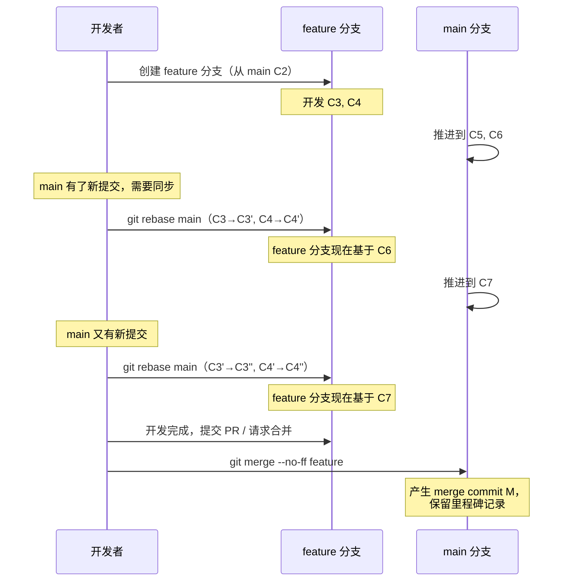
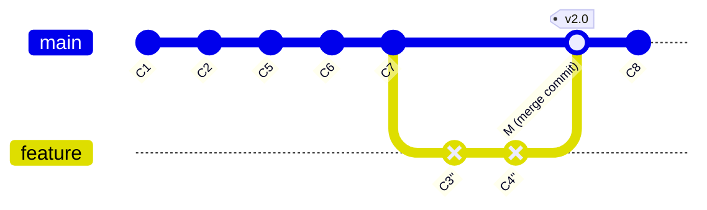

# merge vs rebase 选择策略

在前面的章节中，我们已经分别深入了解了 `git merge` 和 `git rebase` 的工作原理与操作细节。然而，在实际项目中，最令开发者困惑的问题往往不是"怎么用"，而是"该用哪个"。

本章将从本质差异出发，结合主流开源项目的真实实践，给出一套系统化的选择策略，帮助你在不同场景下做出合理决策，并在团队中建立统一规范。

---

## 1. 本质差异对比

merge 和 rebase 的根本分歧在于对"历史"的态度：merge 保留真实历史，rebase 重写历史以追求整洁。这一根本分歧在多个维度上产生连锁影响。

### 1.1 核心维度对比表

| 维度 | merge | rebase |
|------|-------|--------|
| **历史结构** | 保留分支分叉与合并节点，呈现真实的并行开发拓扑 | 将分支提交线性重放到目标分支顶端，消除分叉 |
| **Commit SHA** | 所有 commit 的 SHA 保持不变 | 被 rebase 的 commit 会生成新的 SHA（因为父节点变了） |
| **可追溯性** | 完整保留"何时从何处分叉、何时合并"的信息 | 丢失原始分叉点信息，历史被"展平" |
| **冲突处理** | 集中在一次合并中解决；若冲突复杂，解决压力大 | 逐 commit 解决冲突，冲突分散但可能反复处理同一冲突 |
| **历史可读性** | 并行分支多时图形复杂，merge commit 增多 | 历史呈线性，`git log` 简洁易读 |
| **回滚粒度** | 可通过 `git revert -m` 回滚整个合并，粒度粗 | 逐 commit 回滚，粒度细 |
| **安全性** | 非破坏性操作，不改变已有 commit | 破坏性操作，重写已存在的 commit 历史 |
| **适用范围** | 任何分支，尤其是已推送的公共分支 | 仅限未推送的私有分支或个人开发分支 |

### 1.2 图示：同一场景下 merge 与 rebase 的历史差异

假设你从 `main` 的 C2 处拉出 `feature` 分支，开发了 C3、C4，同时 `main` 推进了 C5、C6。

**merge 的结果：**



**rebase 的结果：**


> 注意：rebase 后的 C3' 和 C4' 是全新的 commit，SHA 与原始 C3、C4 不同，但内容一致。

---

## 2. 选择策略决策树

下面的决策树覆盖了最常见的场景，帮助你快速判断应该使用 merge 还是 rebase。



### 决策树核心原则提炼

1. **黄金法则：不要对已推送到公共仓库的 commit 执行 rebase。** 这是最重要的原则。如果其他人已经基于你的 commit 进行了开发，rebase 会让他们的历史与你的历史产生分叉，导致合并混乱。
2. **私有分支优先 rebase：** 在你个人的开发分支上，push 之前用 rebase 整理历史是安全的，也是推荐的做法。
3. **公共分支优先 merge：** 合并到 `main`/`master` 等长期分支时，使用 merge 保留完整的历史拓扑。

---

## 3. 主流开源项目的实际策略

理论终究要落地。我们来看看业界最具影响力的开源项目是如何在 merge 和 rebase 之间做选择的。

### 3.1 Linux Kernel —— 纯 merge 策略

Linux Kernel 是 Git 的诞生地，Linus Torvalds 本人就是 merge 策略的坚定拥护者。

**策略特点：**

- 严格使用 merge，几乎不使用 rebase
- 每个 subsystem maintainer 通过 pull request 提交合并请求
- Linus 执行 merge 时保留完整的分支拓扑
- merge commit 的提交信息承载重要的上下文信息（包含哪个子系统、由谁维护、覆盖了哪些变更）

**核心理念：**

> "I'm a big believer in merge commits. They show the history of *how* something got into the tree, not just *what* got into the tree." —— Linus Torvalds

Linux Kernel 选择纯 merge 的原因：

1. **规模决定策略：** Kernel 有数千名贡献者、数百个子系统，保留完整的合并拓扑是追溯变更来源的唯一可靠方式
2. **责任追溯：** merge commit 明确记录了"谁把什么合入了主线"，这对维护者责任制至关重要
3. **历史不可变性：** 在如此庞大的协作网络中，重写历史的代价不可承受

### 3.2 Git 项目本身 —— "merge for public, rebase for private"

Git 项目自身的开发策略堪称"中庸之道"的典范，也是业界最广泛采用的策略模式。

**策略特点：**

- 合入 `main`/`master` 时使用 merge（保留里程碑）
- 个人开发分支上使用 rebase（保持整洁）
- 具体而言：maintainer 在合并贡献者的 patch series 时，通常使用 `git merge --no-ff` 或 `git am`（apply mailbox，本质是线性应用，但保留作者信息）

**核心理念：**

> "Rebase your own patches, merge other people's patches." —— Junio C Hamano（Git 项目维护者）

这一策略的精妙之处在于：

1. **尊重他人：** 不重写他人提交的 commit，用 merge 保留其原始 SHA
2. **自律整洁：** 在自己的分支上用 rebase 整理 commit（squash、reorder、edit message），推送前确保历史干净
3. **公共记录：** 合入主线时用 merge 保留"这个功能是从哪个分支合入的"这一重要上下文

### 3.3 Rust 项目 —— rebase + merge 混合策略

Rust 项目采用了一种更精细的混合策略，根据变更的类型和规模灵活选择。

**策略特点：**

- 小型 bugfix：rebase 到主线顶端，通过 bors（自动化合并机器人）线性合入
- 大型 feature：在 feature 分支上 rebase 跟踪主线，最终以 merge 合入
- 所有合入主线的操作通过自动化 CI 门控，确保不引入回归
- 使用 `@bors r+` 命令触发合并，机器人负责最终的 merge 或 rebase 操作

**核心理念：**

Rust 项目的策略体现了"工具辅助决策"的思路：

1. **自动化优先：** 减少人工操作带来的不一致性
2. **分类处理：** 不同规模的变更采用不同的整合方式
3. **CI 门控：** 无论 merge 还是 rebase，都必须通过完整的测试套件

### 3.4 三种策略的对比总结

| 项目 | 策略 | 适用规模 | 核心优势 | 核心代价 |
|------|------|----------|----------|----------|
| Linux Kernel | 纯 merge | 超大型（数千人） | 完整追溯、责任明确 | 历史图形复杂 |
| Git | 公共 merge + 私有 rebase | 中大型（数百人） | 兼顾整洁与追溯 | 需要贡献者自律 |
| Rust | 混合 + 自动化 | 中型（百余人） | 灵活高效 | 工具链依赖重 |

---

## 4. 混合策略详解

在实际项目中，最实用的往往是"rebase 开发分支 + merge 保留里程碑"的混合策略。这一节我们详细拆解其工作方式。

### 4.1 混合策略的核心思想

混合策略的精髓可以用一句话概括：

> **在开发过程中用 rebase 保持分支与主线同步，在合入主线时用 merge 保留里程碑记录。**

这相当于取两者之长：rebase 让开发过程中的历史保持整洁（避免大量无意义的 merge commit），merge 让最终合入主线的动作留下清晰的里程碑。

### 4.2 混合策略的操作流程




### 4.3 混合策略的最终历史形态

经过上述流程后，`main` 分支的历史呈现如下形态：



**关键观察：**

1. `main` 分支的主体历史是线性的（C1 → C2 → C5 → C6 → C7 → M → C8），可读性好
2. merge commit M 作为一个里程碑节点，清晰标记了"feature 分支在此合入"
3. feature 分支上的 commit（C3''、C4''）经过了 rebase 整理，没有与 main 的中间合并噪声
4. 如果需要回滚整个 feature，只需 `git revert -m 1 M`，一步到位

### 4.4 混合策略中 rebase 的注意事项

在开发分支上反复 rebase main 时，需注意以下几点：

**（1）commit 可能被反复重写**

每次 rebase 都会生成新的 commit SHA。如果 feature 分支上有 10 个 commit，rebase 3 次就意味着产生了 30 个 commit 对象（虽然只有最新的 10 个在分支上）。这不是问题，但需要意识到 Git 的垃圾回收机制会清理不再被引用的旧 commit。

**（2）冲突可能反复出现**

如果 main 分支上修改了与 feature 分支相同的区域，每次 rebase 都可能需要重新解决冲突。应对策略：

- 使用 `git rerere`（reuse recorded resolution）自动复用之前的冲突解决方案
- 频繁 rebase（而非积累大量差异后一次性 rebase），减少每次冲突的量

**（3）已推送的 feature 分支 rebase 后需要 force push**

```bash
git rebase main
git push --force-with-lease origin feature
```

`--force-with-lease` 比 `--force` 更安全：它会在服务端检查是否有其他人的新提交，如果有则拒绝推送，避免覆盖他人的工作。

### 4.5 `--no-ff` 的意义

在混合策略中，最终合入主线时使用 `git merge --no-ff feature` 而非 `git merge feature`，原因如下：

- 默认的 `git merge` 在可以快进（fast-forward）时，会直接将 main 指针移动到 feature 的最新 commit，不产生 merge commit
- `--no-ff` 强制创建 merge commit，即使可以快进

这个 merge commit 的价值在于：

1. **里程碑标记：** 可以在 merge commit 上打 tag（如 `v2.0`），标记版本发布点
2. **回滚锚点：** 整个 feature 可以通过 revert 这一个 merge commit 来回滚
3. **上下文记录：** merge commit 的消息可以记录"这次合并包含了什么功能、为什么合并、由谁审批"
4. **拓扑信息：** 保留了"这是一个独立分支的合并"这一结构信息

---

## 5. 团队规范制定建议

策略再好，如果团队没有统一执行，也会陷入混乱。以下是制定团队 merge/rebase 规范的系统性建议。

### 5.1 规范制定的核心原则

**（1）一致性优先于偏好**

团队中 merge 和 rebase 混用是最大的隐患。同一项目的历史中，如果一半用 merge 一半用 rebase，既失去了 merge 的完整追溯性，也失去了 rebase 的线性整洁性。**选择哪种策略不如统一执行重要。**

**（2）工具强制优于文档约束**

写在 CONTRIBUTING.md 里的规范，不如 CI 检查和 Git hooks 强制执行可靠。能用工具自动化的，不要依赖人的自觉。

**（3）渐进式推行**

如果团队当前没有明确规范，不要试图一步到位。可以先从"公共分支禁止 rebase"这一条底线开始，逐步引入更细致的规则。

### 5.2 规范模板

以下是一份可直接采用的团队规范模板，基于"混合策略"（即业界最广泛采用的 Git 项目策略）：

---

**分支整合规范**

1. **公共分支（main/develop/release）**
   - 禁止对已推送的 commit 执行 rebase
   - 合入功能分支时使用 `git merge --no-ff`
   - merge commit 的消息格式：`Merge branch 'feature/xxx' into develop`

2. **功能分支（feature/*）**
   - 开发过程中使用 `git rebase develop` 保持与主线同步
   - 推送前使用 `git rebase -i` 整理 commit（squash 临时提交、完善提交信息）
   - 推送时使用 `git push --force-with-lease`（因为 rebase 改变了 SHA）
   - 功能分支的命名规范：`feature/<jira-id>-<brief-description>`

3. **修复分支（hotfix/*）**
   - 基于 main 创建，修复后同时 merge 到 main 和 develop
   - 小型修复可以 rebase 后 fast-forward 合入

4. **个人实验分支（scratch/*）**
   - 可以自由 rebase、amend、squash
   - 不设保护规则，但也不保证稳定性

---

### 5.3 工具化执行方案

**（1）Git hooks —— 防止违规 rebase**

在服务端（如 GitLab/GitHub）配置 pre-receive hook，拒绝 force push 到受保护分支：

```bash
# .git/hooks/pre-receive 示例
# 拒绝对 main/master 分支的 force push

while read oldrev newrev refname; do
    branch=$(echo "$refname" | sed 's|refs/heads/||')

    if [ "$branch" = "main" ] || [ "$branch" = "master" ]; then
        # 检查是否为 force push（oldrev 不是 newrev 的祖先）
        if ! git merge-base --is-ancestor "$oldrev" "$newrev" 2>/dev/null; then
            echo "ERROR: Force push to $branch is not allowed."
            exit 1
        fi
    fi
done
```

**（2）CI 检查 —— 验证提交信息与合并方式**

在 CI pipeline 中添加检查：

```yaml
# GitHub Actions 示例：检查 merge commit 格式
name: Check Merge Commit Format
on: [push]
jobs:
  check:
    runs-on: ubuntu-latest
    steps:
      - uses: actions/checkout@v4
        with:
          fetch-depth: 0
      - name: Check merge commit messages
        run: |
          git log --merges --format='%s' main |
          while read msg; do
            if ! echo "$msg" | grep -qE "^Merge branch '(feature|hotfix)/"; then
              echo "Invalid merge commit: $msg"
              exit 1
            fi
          done
```

**（3）分支保护规则**

在 GitHub/GitLab 中配置：

- `main`/`master`：禁止 force push，禁止直接 push，必须通过 PR/MR 合入
- `develop`：禁止 force push，允许开发者直接 push（视团队规模而定）
- `release/*`：禁止 force push，禁止直接 push

### 5.4 常见问题与应对

| 问题 | 原因 | 应对方案 |
|------|------|----------|
| 团队成员对已推送分支执行 rebase | 不了解规范或忘记 | 服务端 hook 拦截 force push |
| feature 分支 rebase 后与远程不同步 | rebase 改变了 SHA | 使用 `--force-with-lease` 推送，并在团队内通知 |
| merge commit 消息不规范 | 手动输入随意 | 配置 `git merge --log` 或使用 PR/MR 的标题自动填充 |
| rebase 过程中反复解决相同冲突 | 相同区域被多次修改 | 启用 `git config rerere.enabled true` |
| 历史中 merge commit 过多，图形混乱 | 频繁从 develop merge 到 feature | 改用 rebase 同步 develop，减少中间 merge |

---

## 6. 小结

merge 和 rebase 不是对立的选择，而是互补的工具。理解它们的本质差异，是做出正确决策的前提：

- **merge** 保留真实历史，提供完整追溯性，是公共分支整合的安全选择
- **rebase** 重写历史追求整洁，适合在私有分支上推送前整理 commit
- **混合策略**（rebase 开发 + merge 合入）是业界最广泛采用的实践，兼顾了整洁与追溯

选择策略时，记住三个层次：

1. **底线：** 永远不要对已推送的公共 commit 执行 rebase
2. **推荐：** 采用混合策略，私有分支 rebase，公共分支 merge
3. **进阶：** 根据项目规模和团队文化，参考 Linux Kernel（纯 merge）、Git（混合）、Rust（混合+自动化）的策略，制定适合自己的规范

最后，**一致性比策略本身更重要**。一个团队统一使用 merge，远好于一半人 merge 一半人 rebase 的混乱局面。制定规范、工具强制、持续执行，才是让策略真正落地的关键。

