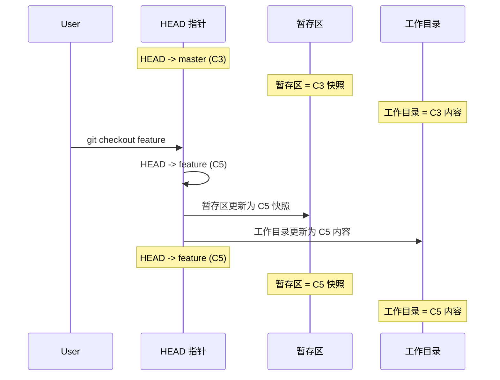
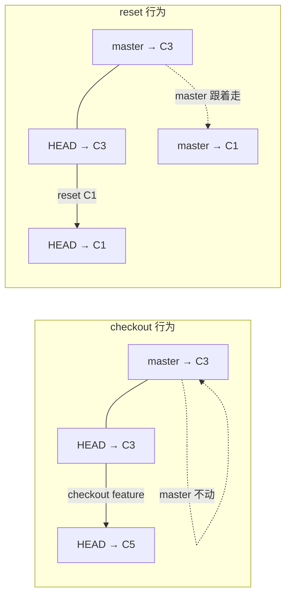
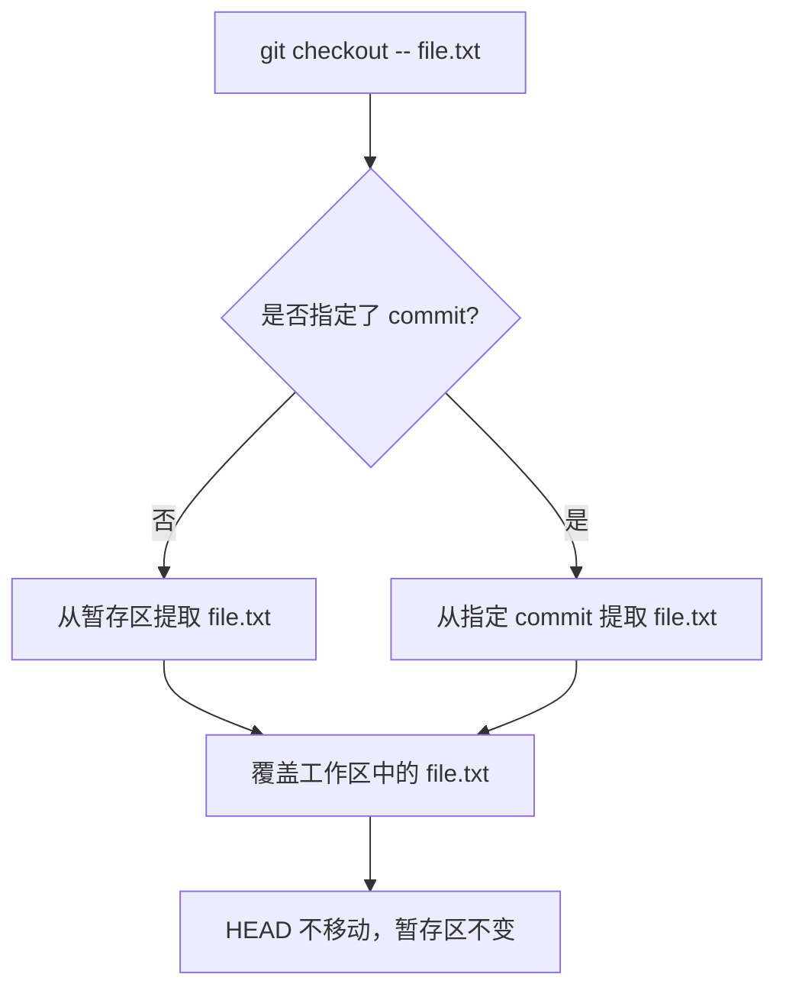
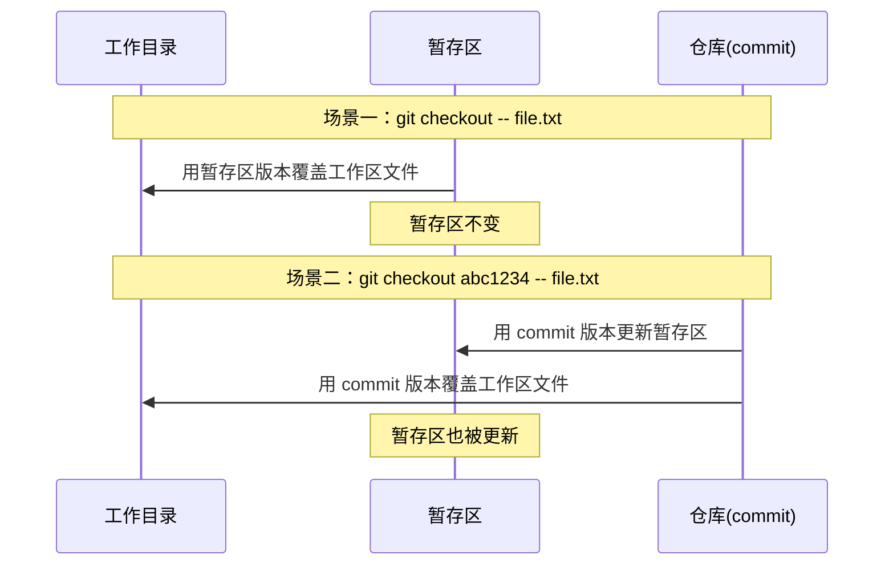
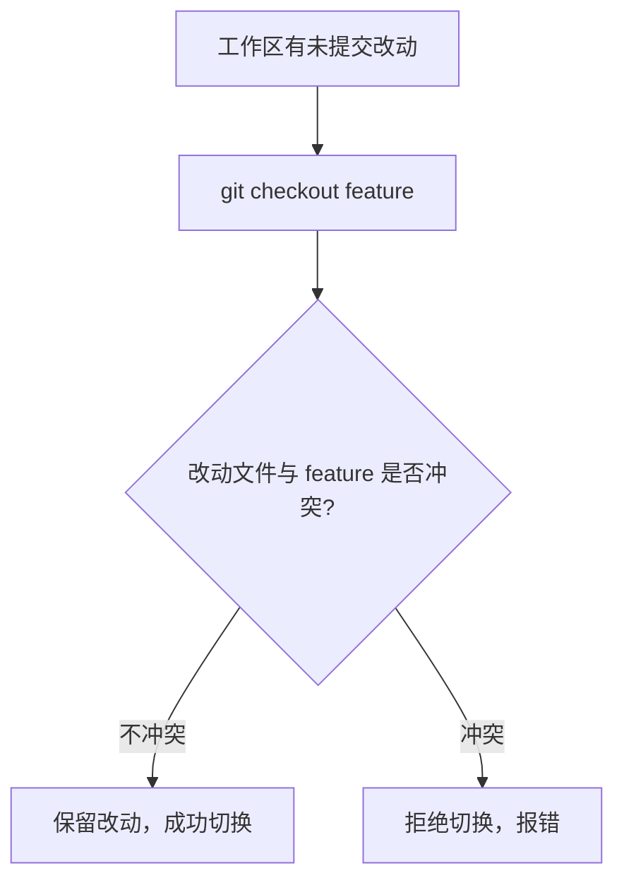
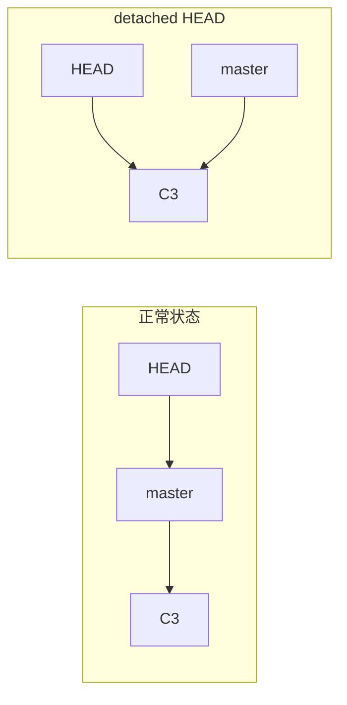
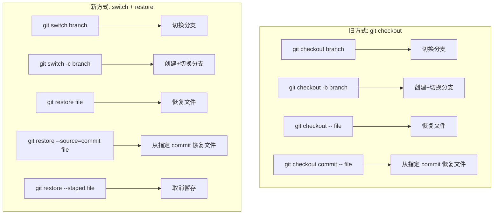
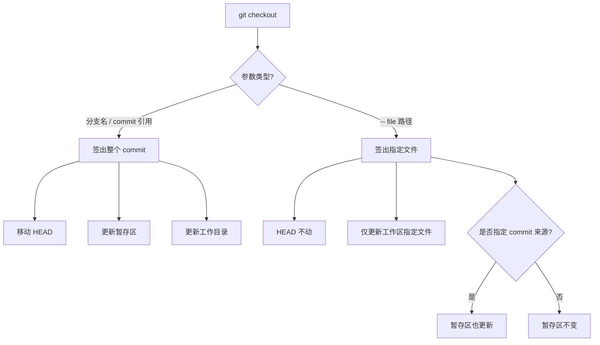

# checkout 的本质

`git checkout` 是 Git 中最古老、也最容易让人困惑的命令之一。初学者常常搞不清它到底是在「切换分支」还是在「恢复文件」，而这两件事看起来毫无关联——为什么同一个命令能做两件截然不同的事？

要回答这个问题，就必须回到 `checkout` 的本质：**签出（checkout）指定的 commit 或其内容**。当你签出一个分支时，你在签出该分支指向的 commit 所对应的完整工作目录；当你签出单个文件时，你在签出某次 commit 中该文件的特定版本。两者统一于「签出」这个核心语义。

---

## 一、checkout 的双重功能

`git checkout` 承担了两种职责：

| 功能 | 语法示例 | 核心行为 |
|------|---------|---------|
| 切换引用（分支 / commit） | `git checkout main` | 移动 HEAD 指向目标引用，并更新整个工作目录 |
| 还原文件 | `git checkout -- file.txt` | 从暂存区或指定 commit 恢复文件到工作区，不移动 HEAD |

这两种功能之所以共用一个命令，是因为它们共享同一种底层操作：**从 Git 仓库的对象数据库中提取内容，写入工作目录**。区别只在于提取的范围——是整个 commit 的快照，还是其中某个文件。

下面分别深入讲解。

---

## 二、checkout 切换分支

### 2.1 基本行为

当执行 `git checkout <branch>` 时，Git 做了三件事：

1. **移动 HEAD**：将 HEAD 指向目标分支（`refs/heads/<branch>`）
2. **更新暂存区**：将暂存区的内容替换为目标 commit 的快照
3. **更新工作目录**：将工作目录的文件替换为目标 commit 对应的内容



用 commit 图来展示更为直观：

```mermaid
gitGraph
    commit id: "C1"
    commit id: "C2"
    commit id: "C3" tag: "master"
    branch feature
    checkout feature
    commit id: "C4"
    commit id: "C5" tag: "feature"
    checkout master
```

执行 `git checkout feature` 之前，HEAD 指向 master（C3）；执行之后，HEAD 指向 feature（C5），工作目录和暂存区同步变为 C5 的内容。

### 2.2 checkout 也可以指向任意 commit

checkout 的目标不必是分支名，任何能解析到 commit 的引用都可以：

```shell
# 通过相对引用
git checkout HEAD^^
git checkout master~5

# 通过 commit SHA-1
git checkout 78a4bc
git checkout 78a4bc^

# 通过 tag
git checkout v1.0.0
```

当 checkout 的目标是某个具体的 commit 而非分支名时，HEAD 会直接指向该 commit，脱离任何分支——这就是所谓的 **detached HEAD** 状态（后文详述）。

### 2.3 checkout 与 reset 的关键区别

checkout 和 reset 都能移动 HEAD，但有一个根本差异：

| 维度 | `git checkout` | `git reset` |
|------|---------------|-------------|
| HEAD 移动方式 | HEAD 独自移动，**不带动**所指向的分支 | HEAD 移动时**捎带**所指向的分支一起移动 |
| 对分支的影响 | 原分支留在原地，HEAD 与分支脱离后重新指向目标 | 当前分支的指针跟着 HEAD 一起移动 |
| 工作目录 | 默认保留未提交修改（冲突时拒绝切换） | 行为由 `--hard`/`--soft`/`--mixed` 参数决定 |



简单说：**reset 是「连根拔起」，checkout 是「金蝉脱壳」**。

---

## 三、checkout 单文件

### 3.1 基本行为

当 checkout 后面跟着 `-- <file>` 时，Git 只还原指定文件的内容，**不移动 HEAD**，也不改变暂存区（除非从指定 commit 恢复并配合特定参数）。

```shell
# 从暂存区恢复文件到工作区（撤销工作区的修改）
git checkout -- file.txt

# 从指定 commit 恢复文件到工作区
git checkout HEAD -- file.txt
git checkout abc1234 -- file.txt
```

其行为流程如下：



### 3.2 两种来源的区别

```shell
# 场景一：从暂存区恢复（省略 commit 引用）
git checkout -- file.txt
```

这会将 `file.txt` 恢复为暂存区中的版本。如果文件已经被 `git add` 过，则恢复的是暂存区的版本；如果文件从未被 `git add`，则恢复的是当前 commit 的版本。效果等同于**丢弃工作区中对 `file.txt` 的修改**。

```shell
# 场景二：从指定 commit 恢复
git checkout abc1234 -- file.txt
```

这会将 `file.txt` 恢复为 commit `abc1234` 中的版本，并**同时更新暂存区**（该文件会被放入暂存区，处于 staged 状态）。注意这与场景一不同——场景一不会改变暂存区。



### 3.3 `--` 的作用

你可能注意到了命令中有一个 `--`。这是 Git 中的一个路径分隔符，用来告诉 Git：**`--` 后面的内容是文件路径，不是分支名或选项**。

```shell
# 如果恰好有一个分支也叫 file.txt，Git 会混淆
git checkout file.txt   # Git 会认为你要切换到 file.txt 分支

# 加上 -- 就明确表示这是文件路径
git checkout -- file.txt
```

在实际使用中，`--` 是一个良好的习惯，能有效避免歧义。

---

## 四、切换分支 vs 还原文件：本质区别对比

| 维度 | `git checkout <branch>` | `git checkout -- <file>` |
|------|------------------------|-------------------------|
| 操作对象 | 整个 commit 快照 | 单个/多个文件 |
| HEAD 是否移动 | 是，指向目标分支/commit | 否 |
| 暂存区是否变化 | 是，整体替换为目标 commit 快照 | 从暂存区恢复时不变；从 commit 恢复时更新 |
| 工作目录影响范围 | 全量更新 | 仅指定文件 |
| 是否改变当前分支 | 否（HEAD 与原分支脱离） | 否 |
| 典型用途 | 切换开发上下文 | 撤销误修改 / 恢复旧版本文件 |

**一句话总结**：切换分支是「搬全家」，还原文件是「搬一件家具」。

---

## 五、checkout 对未提交改动的处理

当你有未提交的改动时执行 `git checkout <branch>`，Git 的行为取决于改动是否与目标分支冲突。


### 5.1 无冲突：自动保留

如果工作区修改的文件在目标分支中没有变化（即两个分支在该文件上的内容一致），Git 会保留这些修改并成功切换。



### 5.2 同一文件冲突：拒绝切换

如果工作区修改的某个文件在目标分支中的版本与当前分支不同，Git 会拒绝切换，以防止你的未提交修改被覆盖：

```shell
error: Your local changes to the following files would be overwritten by checkout:
        config.js
Please commit your changes or stash them before you switch branches.
Aborting
```

这是 Git 的保护机制。此时你有三种选择：

```shell
# 方案一：提交改动
git add config.js
git commit -m "WIP: config changes"
git checkout feature

# 方案二：暂存改动（stash）
git stash
git checkout feature
# 之后恢复：git stash pop

# 方案三：强制丢弃改动
git checkout -- config.js   # 先丢弃该文件的修改
git checkout feature        # 再切换
```

### 5.3 已暂存但未提交

已 `git add` 但未 `git commit` 的改动同样受上述规则约束。如果已暂存的文件与目标分支冲突，切换同样会被拒绝。

---

## 六、detached HEAD 下的 checkout

### 6.1 什么是 detached HEAD

正常情况下，HEAD 指向某个分支名，而分支名指向某个 commit。当 HEAD 直接指向一个 commit 而非分支名时，就进入了 **detached HEAD**（游离 HEAD）状态。



### 6.2 进入 detached HEAD 的方式

```shell
# 直接 checkout 到某个 commit
git checkout abc1234

# checkout 到某个 tag
git checkout v1.0.0

# 显式进入 detached 状态（HEAD 与当前分支脱离，但不移动）
git checkout --detach
```

### 6.3 detached HEAD 下的行为特点

在 detached HEAD 状态下，你仍然可以查看代码、构建项目、甚至创建新的 commit。但有一个关键问题：**这些新 commit 没有任何分支指向它们**。

```mermaid
gitGraph
    commit id: "C1"
    commit id: "C2"
    commit id: "C3" tag: "master"
    branch feature
    checkout feature
    commit id: "C4"
    commit id: "C5" tag: "feature"
    checkout C3
    commit id: "C6"
    commit id: "C7"
```

上图中，C6 和 C7 是在 detached HEAD 状态下创建的 commit。一旦你 `checkout master` 切回分支，C6 和 C7 就成了「野生 commit」——没有任何引用指向它们，`git log` 看不到，但它们短期内仍存在于 Git 的对象数据库中。

### 6.4 保存或丢弃 detached commit

如果你在 detached HEAD 下创建了有价值的 commit，可以这样做：

```shell
# 在 detached HEAD 状态下，创建分支保存这些 commit
git checkout -b hotfix

# 或者回到分支后，用 reflog 找回
git checkout master
git reflog               # 找到 detached commit 的 SHA-1
git branch hotfix abc1234 # 用该 SHA-1 创建分支
```

如果你不需要这些 commit，什么都不用做——它们会在大约两周后被 Git 的垃圾回收机制（`git gc`）自动清理。

---

## 七、Git 2.23+ 新命令：switch 与 restore

`checkout` 的一命令两用长期以来饱受诟病：它功能过于复杂，参数组合繁多，初学者极容易误操作（比如本想恢复文件却切换了分支，或本想切换分支却恢复了文件）。

Git 2.23（2019 年 8 月发布）引入了两个新命令，将 `checkout` 的两种职责彻底拆分：

- **`git switch`**：专门用于切换分支
- **`git restore`**：专门用于恢复文件


### 7.1 git switch

`switch` 专注于分支切换操作，语义清晰、参数精简：

```shell
# 切换到已有分支
git switch feature

# 创建并切换到新分支（替代 git checkout -b）
git switch -c feature

# 从指定 commit 创建分支并切换
git switch -c hotfix abc1234

# 切换到上一个分支（类似 cd -）
git switch -

# 强制切换（丢弃工作区和暂存区的冲突修改）
git switch --force feature

# 进入 detached HEAD 状态
git switch --detach abc1234
```

### 7.2 git restore

`restore` 专注于文件恢复操作，来源和目标更加明确：

```shell
# 从暂存区恢复文件到工作区（撤销工作区修改，替代 git checkout -- file）
git restore file.txt

# 说明：restore 的默认来源就是暂存区（index），因此无需显式指定来源

# 从指定 commit 恢复文件到工作区（替代 git checkout abc1234 -- file）
git restore --source=abc1234 file.txt

# 从 HEAD（当前 commit）恢复文件到工作区
git restore --source=HEAD file.txt

# 将暂存区的文件恢复为 HEAD 的版本（即取消 git add，替代 git reset HEAD file）
git restore --staged file.txt

# 同时恢复暂存区和工作区（彻底还原为 HEAD 版本）
git restore --staged --worktree file.txt
```

`restore` 的 `--staged` 选项是其最重要的创新之一。在此之前，取消暂存（unstage）需要使用 `git reset HEAD -- file`，语义不直观；而 `git restore --staged file` 清晰地表达了「将暂存区的文件恢复为 HEAD 版本」的含义。

### 7.3 命令映射表

| 旧命令（checkout / reset） | 新命令（switch / restore） | 功能 |
|---------------------------|--------------------------|------|
| `git checkout <branch>` | `git switch <branch>` | 切换分支 |
| `git checkout -b <branch>` | `git switch -c <branch>` | 创建并切换分支 |
| `git checkout -` | `git switch -` | 切换到上一个分支 |
| `git checkout --detach` | `git switch --detach` | 进入 detached HEAD |
| `git checkout -- <file>` | `git restore <file>` | 从暂存区恢复文件到工作区 |
| `git checkout HEAD -- <file>` | `git restore --source=HEAD <file>` | 从 HEAD 恢复文件到工作区 |
| `git checkout <commit> -- <file>` | `git restore --source=<commit> <file>` | 从指定 commit 恢复文件 |
| `git reset HEAD -- <file>` | `git restore --staged <file>` | 取消暂存（unstage） |
| 无直接等价 | `git restore --staged --worktree <file>` | 同时恢复暂存区和工作区 |

### 7.4 为什么要拆分？



拆分的好处：

1. **语义清晰**：`switch` 只做切换，`restore` 只做恢复，各司其职
2. **减少误操作**：不会再因为漏写 `--` 而把文件名当成分支名
3. **参数更直观**：`--staged`、`--source`、`--worktree` 都比 checkout 的隐式行为更易理解
4. **推荐方向**：`switch` 和 `restore` 是官方为拆分职责而引入的命令，建议在新操作中优先使用（注意：两者目前仍被官方文档标注为实验性命令，`checkout` 本身并未废弃）

> 注意：`git checkout` 目前并未被移除，所有旧命令仍然可用。但在日常使用中，建议优先使用 `switch` 和 `restore`。

---

## 八、小结

`checkout` 的本质是**签出指定 commit 的内容**。根据签出范围的不同，它分化出两种功能：

1. **签出整个 commit（切换分支 / 游离 HEAD）**：移动 HEAD，更新暂存区和工作目录
2. **签出 commit 中的部分文件（还原文件）**：不移动 HEAD，仅将指定文件的内容写回工作区



关键要点回顾：

- **切换分支时**，HEAD 移动但原分支不动（与 `reset` 的区别）；工作区有冲突的未提交修改时，Git 会拒绝切换
- **还原文件时**，从暂存区恢复不改暂存区，从指定 commit 恢复会同步更新暂存区
- **detached HEAD** 状态下可以正常工作，但新创建的 commit 没有分支保护，需及时创建分支保存
- **Git 2.23+** 推荐使用 `git switch` 替代分支切换、`git restore` 替代文件恢复，语义更清晰、更安全

