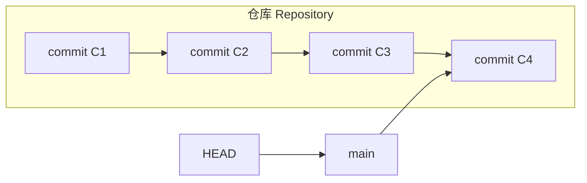
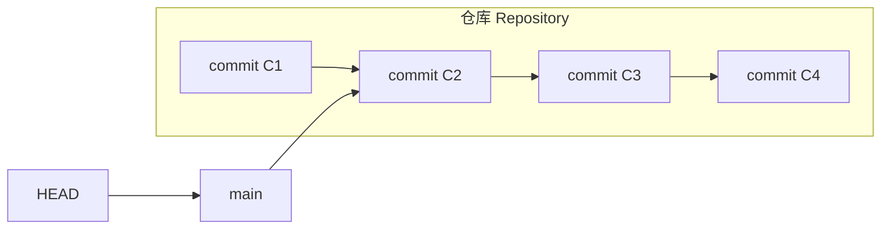
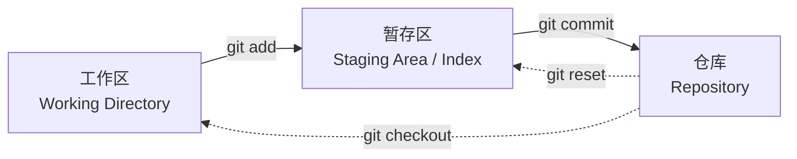
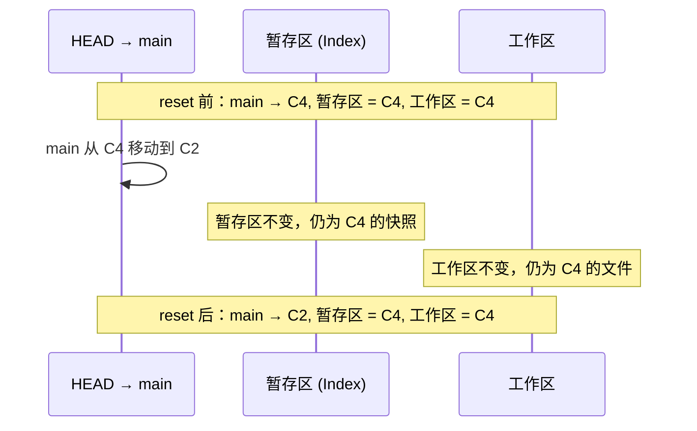
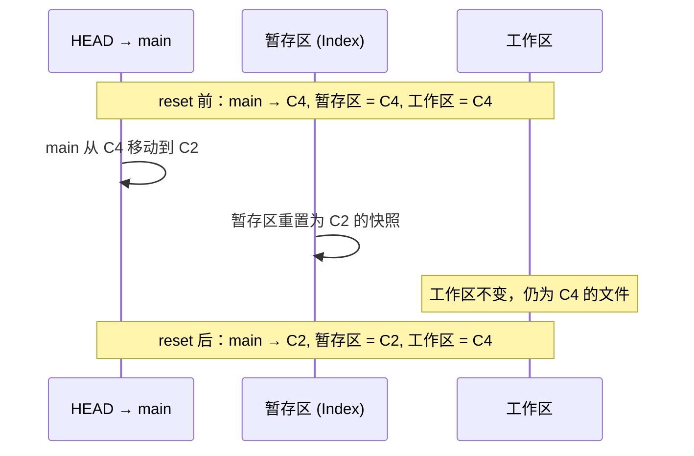
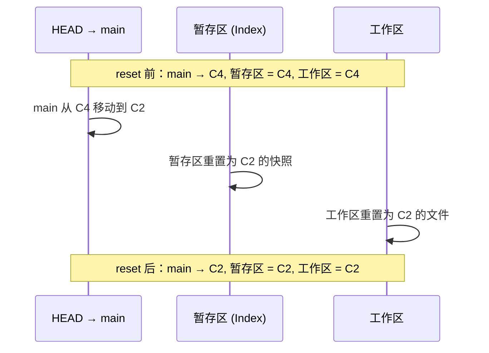
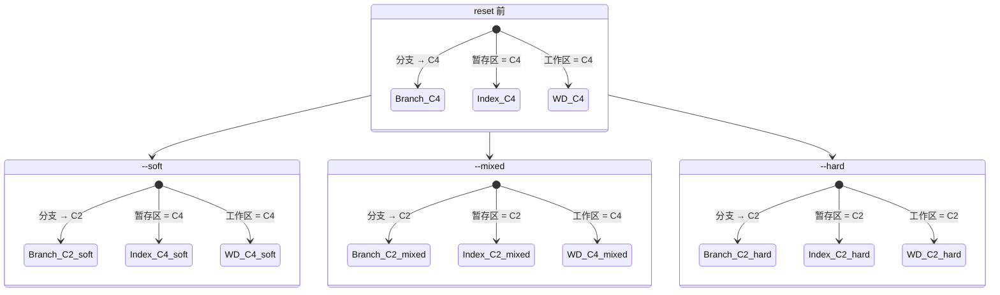
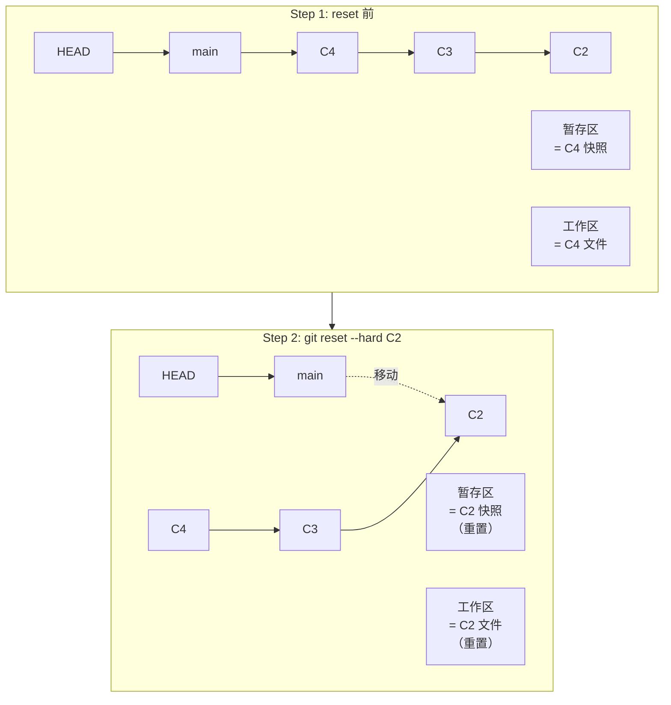
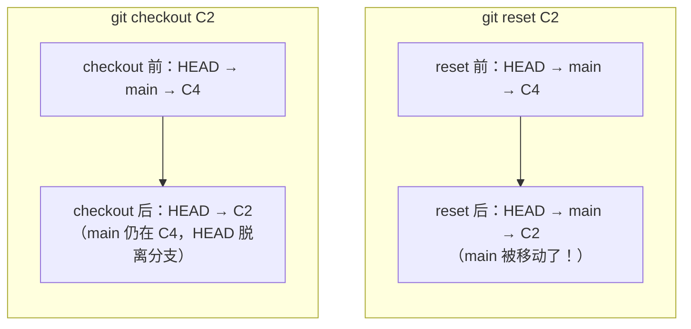
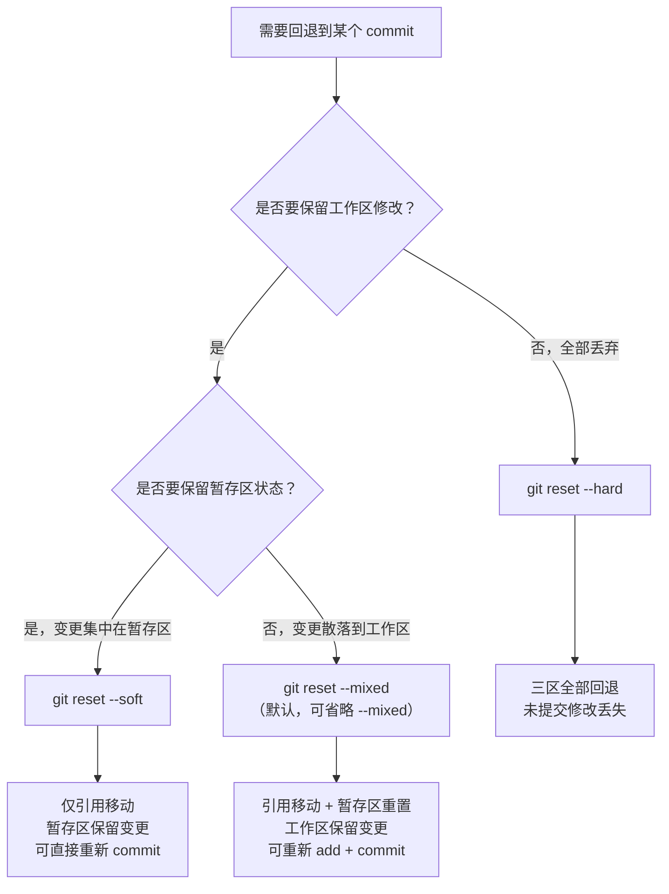

# reset 的本质

## 一句话概括

> `git reset` 的本质，就是**移动 HEAD 所指向的 branch 引用，让它指向另一个 commit**。
> 至于移动之后，暂存区和工作区要不要跟着变——那就是三种模式的区别所在。

---

## 1. reset 的本质：移动分支引用

Git 的 `reset` 命令，名字容易让人误解为"重置"或"恢复"。但它的核心动作极其简单——**把当前分支的引用指针挪到另一个 commit 上**。

先回顾一下 Git 的基本结构：



此时 `HEAD` 通过 `main` 分支间接指向 `C4`。执行 `git reset C2` 后：



`main` 分支的引用从 `C4` 移动到了 `C2`。`C3` 和 `C4` 并没有被删除，它们仍然存在于 Git 的对象库中，只是从 `main` 分支的可达路径上"消失"了。一段时间后，Git 的垃圾回收机制（GC）才会真正清理这些不可达的 commit。

> **关键认知**：`reset` 只做一件事——移动分支引用。三种模式（`--hard`、`--mixed`、`--soft`）的区别，仅仅在于移动引用之后，**要不要同步更新暂存区和工作区**。

---

## 2. 三区模型：理解 reset 的前提

在深入三种模式之前，必须先建立"三区"的清晰心智模型：



| 区域 | 别名 | 存储位置 | 内容 |
|------|------|----------|------|
| 工作区 | Working Directory | 磁盘上的项目目录 | 你实际编辑的文件 |
| 暂存区 | Index / Staging Area | `.git/index` 文件 | 下一次 commit 将要记录的文件快照 |
| 仓库 | Repository / HEAD | `.git/objects/` | 所有 commit 及其对应的完整项目快照 |

`reset` 的三种模式，本质上就是在移动分支引用之后，对这三个区域做不同程度的"同步"。

---

## 3. 三种模式详解

### 3.1 `--soft`：只动引用，不动暂存区，不动工作区

`git reset --soft <commit>` 的行为：

1. **移动分支引用**：让当前分支指向目标 commit
2. **暂存区**：保持不变（仍保留 reset 之前的状态）
3. **工作区**：保持不变



**效果**：相当于你把历史"倒回"了，但暂存区里还保留着 `C3` 和 `C4` 的所有变更。你可以直接再次 `git commit`，把 `C3`+`C4` 的变更合并成一个新 commit——这就是 `--soft` 最典型的用途：**压缩（squash）commit**。

```bash
# 典型场景：把最近 3 个 commit 压缩成 1 个
git reset --soft HEAD~3
git commit -m "feat: 完整功能实现"
```

> **注意**：`--soft` 之后暂存区的内容与工作区可能不一致——暂存区是 `C4` 的快照，而分支已经指向 `C2`。这意味着 `git status` 会显示暂存区中有"待提交的变更"（即 `C3` 和 `C4` 相对于 `C2` 的 diff），这正是我们想要的效果。

---

### 3.2 `--mixed`（默认）：动引用 + 重置暂存区 + 不动工作区

`git reset --mixed <commit>` 的行为（`--mixed` 可省略，因为它是默认模式）：

1. **移动分支引用**：让当前分支指向目标 commit
2. **重置暂存区**：用目标 commit 的快照覆盖暂存区
3. **工作区**：保持不变



**效果**：分支回退到 `C2`，暂存区也回退到 `C2`，但工作区的文件仍然是 `C4` 的状态。此时 `git status` 会显示工作区与暂存区的差异——即 `C3` 和 `C4` 的变更变成了"未暂存的修改"。

```bash
# 典型场景：撤销最近一次 commit，但保留修改在工作区
git reset HEAD~1
# 等同于 git reset --mixed HEAD~1
```

这是最常用的 reset 模式，适合"我想撤回上次 commit，重新整理后再提交"的场景。

---

### 3.3 `--hard`：动引用 + 重置暂存区 + 重置工作区

`git reset --hard <commit>` 的行为：

1. **移动分支引用**：让当前分支指向目标 commit
2. **重置暂存区**：用目标 commit 的快照覆盖暂存区
3. **重置工作区**：用目标 commit 的文件覆盖工作区



**效果**：三个区域全部回退到 `C2` 的状态。`C3` 和 `C4` 的所有变更——无论是已 commit 的、已暂存的、还是未暂存的——**全部丢失**。

```bash
# 典型场景：彻底放弃最近的所有修改，回到某个已知状态
git reset --hard HEAD~3
```

> **危险警告**：`--hard` 是唯一会**丢弃工作区未提交修改**的 reset 模式。一旦执行，工作区的未暂存修改和暂存区的已暂存修改都会被覆盖，且无法通过常规 Git 命令恢复。使用前务必确认工作区没有需要保留的内容。
>
> 如果误用了 `--hard`，唯一的补救方式是通过 `git reflog` 找回之前的 commit 引用，再 `git reset --hard <找回的commit>` 恢复。但 reflog 只能恢复已 commit 的内容，未 commit 的修改一旦被 `--hard` 覆盖，就真的丢失了。

---

## 4. 三种模式对三区的影响矩阵

### 表格形式

| 模式 | 分支引用（HEAD → branch） | 暂存区（Index） | 工作区（Working Dir） |
|------|:---:|:---:|:---:|
| `--soft` | 移动 | **不动** | **不动** |
| `--mixed` | 移动 | 重置为目标 commit | **不动** |
| `--hard` | 移动 | 重置为目标 commit | 重置为目标 commit |

### Mermaid 可视化

```mermaid
graph TD
    subgraph reset前
        direction LR
        B1["分支 → C4"] --- S1["暂存区 = C4"] --- W1["工作区 = C4"]
    end

    subgraph "--soft → C2"
        direction LR
        B2["分支 → C2"] --- S2["暂存区 = C4\n（不变）"] --- W2["工作区 = C4\n（不变）"]
    end

    subgraph "--mixed → C2"
        direction LR
        B3["分支 → C2"] --- S3["暂存区 = C2\n（重置）"] --- W3["工作区 = C4\n（不变）"]
    end

    subgraph "--hard → C2"
        direction LR
        B4["分支 → C2"] --- S4["暂存区 = C2\n（重置）"] --- W4["工作区 = C2\n（重置）"]
    end

    reset前 --> "--soft → C2"
    reset前 --> "--mixed → C2"
    reset前 --> "--hard → C2"
```


### 逐步变化对比图

以 `C4` 为起点，`reset` 到 `C2`，三种模式各区域的状态变化：



---

## 5. reset 各模式的 Mermaid 动态图

以下用更直观的方式，展示每个模式下 HEAD、分支引用、暂存区、工作区的变化过程。

### 5.1 `--soft` 模式


### 5.2 `--mixed` 模式


### 5.3 `--hard` 模式



---


## 6. reset 与 checkout 的本质区别

`reset` 和 `checkout` 都能"回到某个 commit"，但它们的本质行为截然不同，这是 Git 学习者最容易混淆的知识点之一。

### 核心区别

| 维度 | `git reset <commit>` | `git checkout <commit>` |
|------|----------------------|-------------------------|
| **移动的对象** | 移动**分支引用**（branch），HEAD 跟随分支 | 移动 **HEAD 本身**，分支引用不动 |
| **分支是否改变** | 改变当前分支指向的 commit | 不改变任何分支的指向 |
| **HEAD 状态** | 仍指向分支（attached HEAD） | 若 checkout 的是 commit 而非分支，进入 detached HEAD 状态 |
| **对暂存区的影响** | `--mixed`/`--hard` 会重置暂存区 | 会重置暂存区（类似 `--mixed`） |
| **对工作区的影响** | 仅 `--hard` 会重置工作区 | 会更新工作区文件（安全：有冲突时拒绝执行） |
| **安全性** | `--hard` 会丢弃未提交修改 | 更安全：如果工作区有未提交的修改与目标冲突，会拒绝执行 |
| **是否需要干净的工作区** | `--hard` 不需要（直接覆盖）；`--mixed`/`--soft` 不影响工作区 | 不强制要求，但有冲突时会拒绝 |
| **典型用途** | 撤销 commit、压缩 commit | 切换分支、查看历史 commit |

### Mermaid 对比图



### 一句话总结

> **`reset` 移动的是分支，`checkout` 移动的是 HEAD。**
> `reset` 让分支"改写历史"，`checkout` 只是让你"去看另一个地方"。

---

## 7. reset 的默认行为

当执行 `git reset <commit>` 而不指定模式时，Git 默认使用 `--mixed` 模式：

```bash
# 以下两条命令完全等价
git reset HEAD~1
git reset --mixed HEAD~1
```

这意味着，日常使用中最常见的 `git reset`，其效果是：

1. 移动分支引用到目标 commit
2. 用目标 commit 的快照重置暂存区
3. **不动工作区**

这个默认选择是经过深思熟虑的：`--mixed` 是最"平衡"的模式——它既回退了 commit 和暂存区，又保留了工作区的修改，让你有机会重新整理后再次提交。而 `--soft` 太保守（暂存区还留着旧内容），`--hard` 太激进（工作区修改全丢），都不适合作为默认行为。

### 常见默认行为的使用场景

```bash
# 撤销最近一次 commit，修改保留在工作区
git reset HEAD~1

# 撤销暂存区的 add 操作（将文件从暂存区移回工作区）
git reset HEAD <file>
# 等价于 git reset --mixed HEAD <file>
# 这是 git add 的逆操作

# 将分支引用和暂存区回退到某个 commit 的状态（不动工作区）
git reset <commit>
```

---

## 8. 小结

| 要点 | 说明 |
|------|------|
| **本质** | `reset` = 移动分支引用到目标 commit |
| **`--soft`** | 只动引用。暂存区和工作区不变，变更集中在暂存区，适合压缩 commit |
| **`--mixed`** | 动引用 + 重置暂存区。工作区不变，变更散落到工作区，适合撤回 commit 后重新整理 |
| **`--hard`** | 动引用 + 重置暂存区 + 重置工作区。三区全部回退，变更全部丢失，适合彻底放弃修改 |
| **默认模式** | 不指定模式时为 `--mixed` |
| **与 checkout 的区别** | `reset` 移动分支引用，`checkout` 移动 HEAD；`reset` 改写历史，`checkout` 只是切换视角 |
| **安全提示** | `--hard` 会丢弃未提交的修改，使用前务必确认；误用后可通过 `reflog` 尝试恢复已 commit 的内容 |

最后，用一个完整的流程图来总结 reset 的决策路径：



