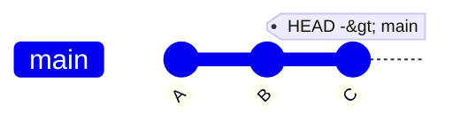
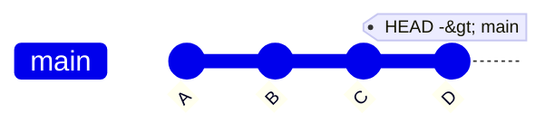
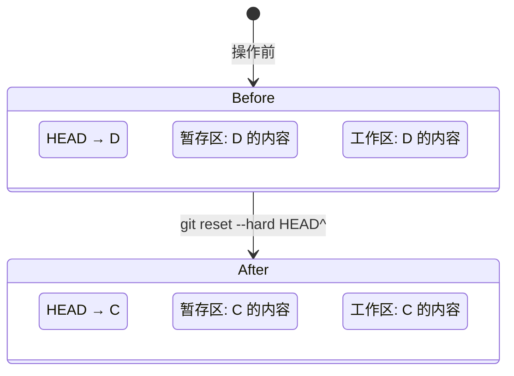
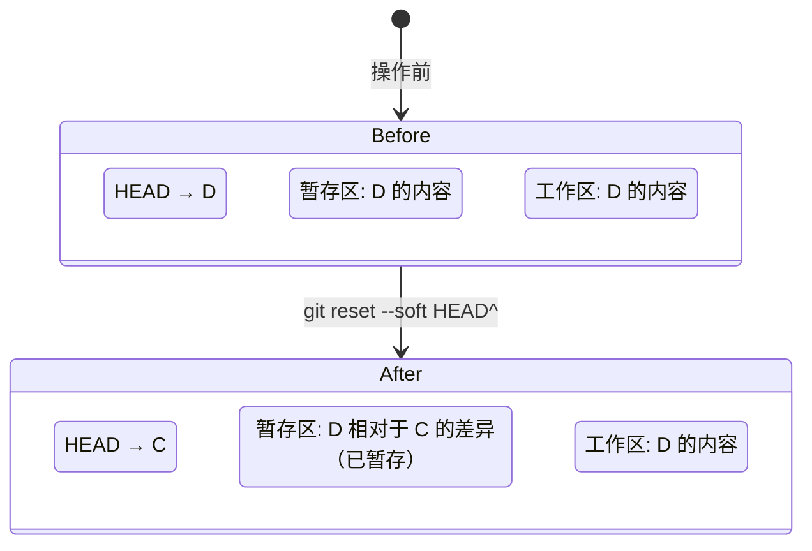
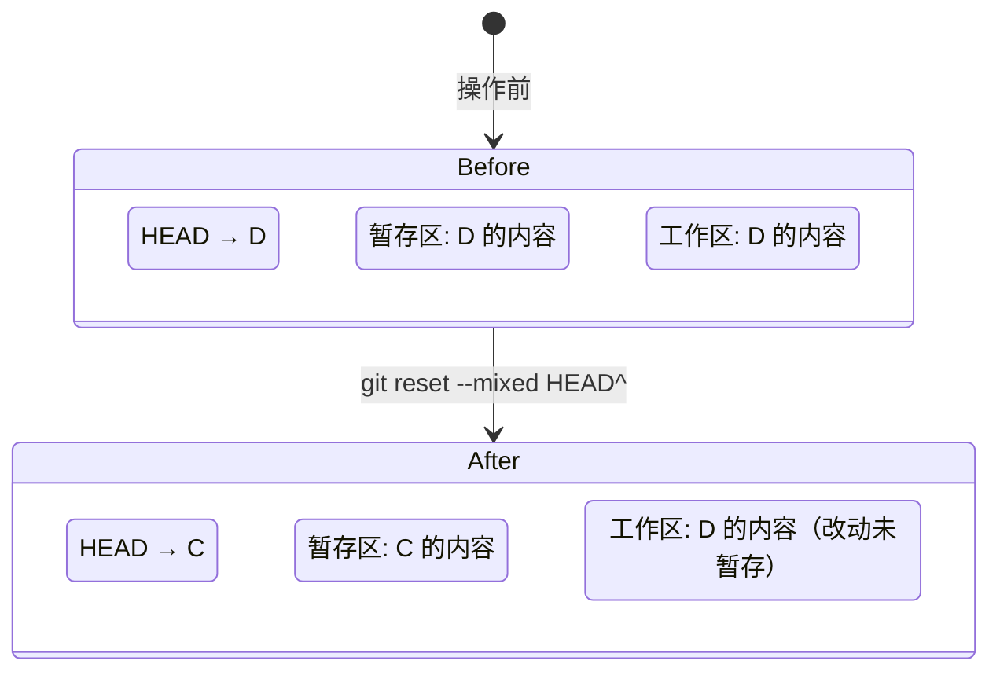
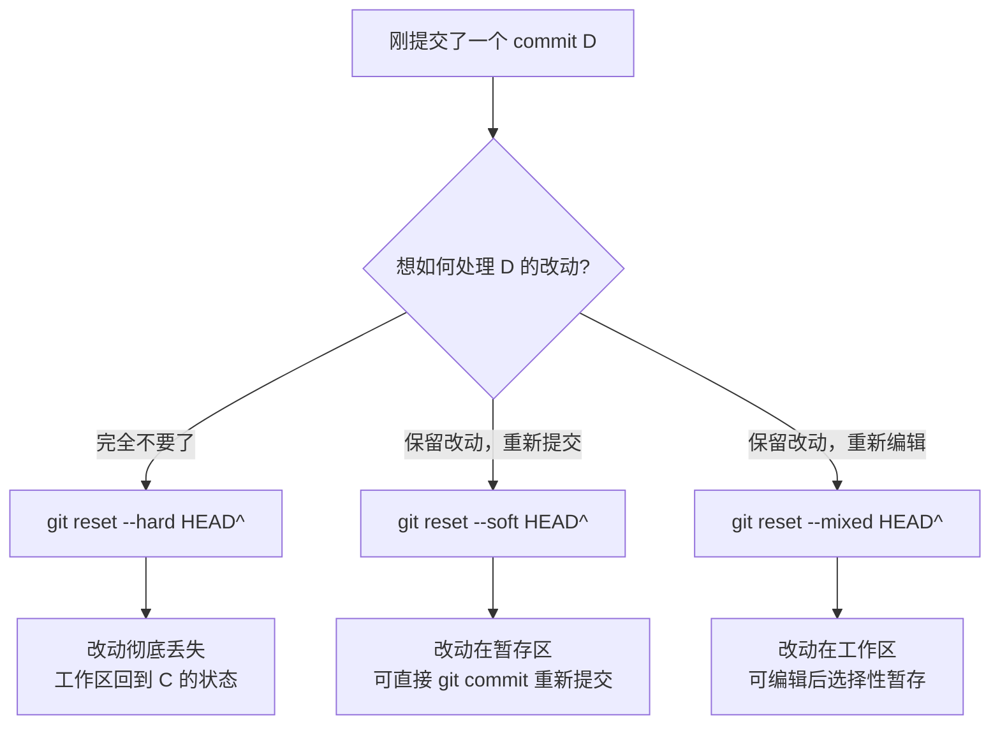
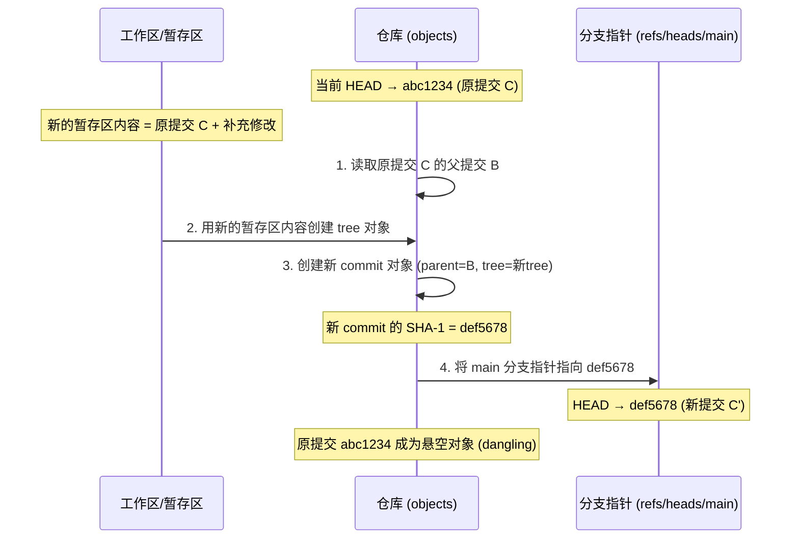
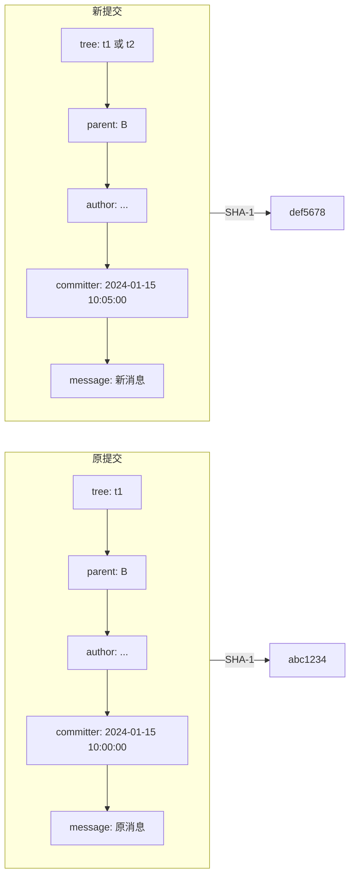
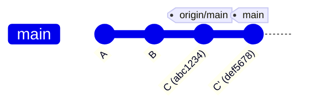
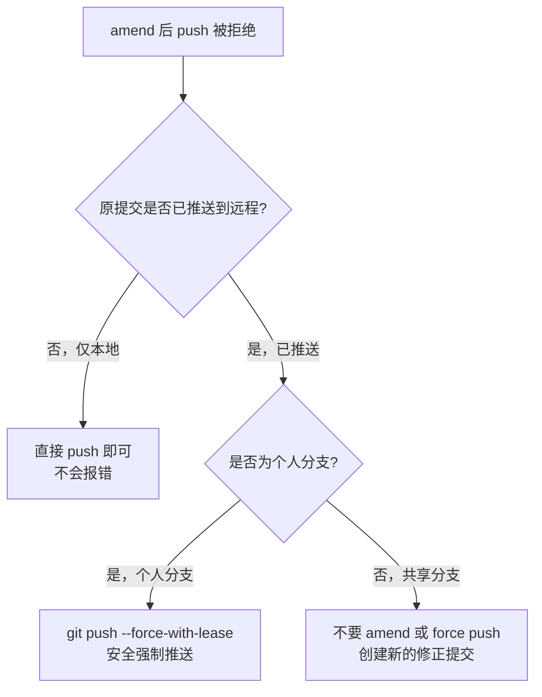

# 撤销最新提交

你刚敲下 `git commit -m "feat: add login module"`，回车还没凉透，就发现——

- 忘了暂存一个关键文件
- commit message 写错了
- 整个提交根本就不该存在

这是 Git 日常中最常见的"后悔时刻"。本文将系统讲解如何撤销最新一次提交，以及每种方式的底层原理与适用场景。

---

## 核心概念：HEAD 与提交链

在深入撤销操作之前，必须先理解 Git 中提交的链式结构和 `HEAD` 的定位。

Git 的每一次提交都通过父指针（parent）形成一条有向链表，`HEAD` 是一个指针，指向当前分支的最新提交：



当我们说"撤销最新提交"时，本质上是将 `HEAD`（以及分支指针）向后移动一个位置，使其指向目标提交的父提交。

---

## HEAD^ 的含义：如何引用父提交

`HEAD^` 是 Git 中引用父提交的语法，理解它对掌握撤销操作至关重要。

| 语法 | 含义 | 等价写法 |
|------|------|----------|
| `HEAD^` | HEAD 的第 1 个父提交 | `HEAD~1` |
| `HEAD^^` | HEAD 的父提交的父提交（往前 2 代） | `HEAD~2` |
| `HEAD^^^` | 往前 3 代 | `HEAD~3` |
| `HEAD~5` | 往前 5 代 | — |

> **`^` 与 `~` 的区别**：`^` 后跟数字表示选择第几个父提交（用于合并提交的多父节点场景），`~` 后跟数字表示向上回溯几代。对于普通线性提交链，`HEAD^` 和 `HEAD~1` 完全等价。



- `HEAD^` → 指向 C
- `HEAD^^` 或 `HEAD~2` → 指向 B
- `HEAD~3` → 指向 A

当然，你也可以直接使用提交的 SHA-1 哈希值（完整或缩写）来替代 `HEAD^`，例如 `git reset --soft a1b2c3d`。

---

## 方法一：git reset --hard HEAD^

**效果**：丢弃最新 commit，同时清空暂存区和工作区的所有改动。

### 操作过程

```bash
git reset --hard HEAD^
```

### 状态变化图



### 详细说明

执行 `git reset --hard HEAD^` 后，Git 会做三件事：

1. **移动分支指针**：将 `HEAD` 和当前分支指针从 D 回退到 C
2. **重置暂存区**：将暂存区（index）的内容更新为 C 的快照
3. **重置工作区**：将工作目录的文件全部恢复为 C 的状态

这意味着 D 提交引入的所有改动——无论是否已暂存——都会被彻底丢弃，工作目录会回到 C 提交时的干净状态。

### 适用场景

- 提交完全错误，代码不要了
- 想要彻底回退到上一个版本重新开始
- 本地实验性提交，确认不需要保留

> **警告**：`--hard` 是破坏性操作。一旦执行，D 提交的改动将很难恢复（除非你记住了 commit 的 SHA-1，或通过 `git reflog` 找回）。在生产环境中使用需格外谨慎。

---

## 方法二：git reset --soft HEAD^

**效果**：丢弃最新 commit，但保留所有改动在暂存区（staged 状态）。

### 操作过程

```bash
git reset --soft HEAD^
```

### 状态变化图



### 详细说明

执行 `git reset --soft HEAD^` 后，Git 只做一件事：

1. **移动分支指针**：将 `HEAD` 和当前分支指针从 D 回退到 C

暂存区和工作区的内容**不会被触碰**。由于分支指针回退了，但暂存区仍保留着 D 提交时的快照，所以 D 相对于 C 的所有差异改动会自动出现在暂存区中，处于 staged 状态。

此时执行 `git status`，你会看到所有 D 提交的改动都显示为 "Changes to be committed"。

### 适用场景

- 提交了但想修改 commit message（配合重新 commit）
- 提交了但忘了加某个文件，想补充后重新提交
- 想把最近几次提交合并为一次（squash）

**典型工作流**：

```bash
# 发现忘了暂存某个文件
git add forgotten_file.py
git reset --soft HEAD^
git commit -m "feat: add login module (complete)"
```

或者更简洁地，直接使用 `git commit --amend`（后文详解）。

---

## 方法三：git reset --mixed HEAD^

**效果**：丢弃最新 commit，改动放回工作区（unstaged 状态）。`--mixed` 是 `git reset` 的默认模式，可以省略。

### 操作过程

```bash
# 以下两条命令等价
git reset --mixed HEAD^
git reset HEAD^
```

### 状态变化图



### 详细说明

执行 `git reset --mixed HEAD^` 后，Git 会做两件事：

1. **移动分支指针**：将 `HEAD` 和当前分支指针从 D 回退到 C
2. **重置暂存区**：将暂存区的内容更新为 C 的快照

工作区的内容**不会被触碰**。由于暂存区被重置为 C 的状态，而工作区仍保留 D 的内容，所以 D 相对于 C 的所有差异改动会出现在工作区中，处于 unstaged 状态。

此时执行 `git status`，你会看到所有 D 提交的改动都显示为 "Changes not staged for commit"。


### 适用场景

- 提交了但想重新审视和编辑改动后再提交
- 需要对提交内容做部分修改（选择性暂存）
- 想把提交拆分成多个更小的提交

**典型工作流**：

```bash
git reset HEAD^
# 编辑文件，调整改动
git add -p  # 交互式选择部分改动暂存
git commit -m "feat: add login validation"
git add .
git commit -m "feat: add login UI"
```

---

## 三种撤销方式对比

### 状态对比表

| 维度 | `--hard` | `--soft` | `--mixed`（默认） |
|------|----------|----------|-------------------|
| 分支指针 | 回退到父提交 | 回退到父提交 | 回退到父提交 |
| 暂存区 | 重置为父提交状态 | 保留提交时的状态 | 重置为父提交状态 |
| 工作区 | 重置为父提交状态 | 保留提交时的状态 | 保留提交时的状态 |
| 改动去向 | **彻底丢失** | **暂存区（staged）** | **工作区（unstaged）** |
| 破坏性 | 高 | 无 | 低 |
| 可恢复性 | 仅 reflog | 直接可用 | 直接可用 |

### 流程对比图



### 选择决策表

| 你的场景 | 推荐方式 | 理由 |
|----------|----------|------|
| 提交完全错误，代码不要了 | `--hard` | 一步到位，干净回退 |
| 想修改 commit message | `--soft` 或 `--amend` | 保留改动，重新提交 |
| 忘了暂存某个文件 | `--soft` 或 `--amend` | 补充暂存后重新提交 |
| 想重新审视改动内容 | `--mixed` | 改动回到工作区，便于审查 |
| 想拆分提交为多个小提交 | `--mixed` | 选择性暂存，分批提交 |
| 想合并最近几次提交 | `--soft` | 多次改动合并为一次提交 |

---

## git commit --amend：修改最新提交

除了 `git reset` 系列，Git 还提供了一个更便捷的命令来"修改"最新提交：`git commit --amend`。

### 两种用法

**1. 修改 commit message**

```bash
git commit --amend -m "新的提交消息"
```

**2. 补充修改到最新提交**

```bash
# 忘了暂存某个文件
git add forgotten_file.py
git commit --amend --no-edit  # 不修改消息，只补充文件
```

### amend 前后的变化

```mermaid
gitGraph
    commit id: "A"
    commit id: "B"
    commit id: "C (原提交 abc1234)"
    branch main
```

执行 `git commit --amend -m "C 修正版"` 后：

```mermaid
gitGraph
    commit id: "A"
    commit id: "B"
    commit id: "C 修正版 (def5678)"
    branch main
```

可以看到，原来的提交 C（SHA-1: `abc1234`）消失了，取而代之的是一个新的提交 C 修正版（SHA-1: `def5678`）。

### amend 的底层原理

**关键认知：`--amend` 并不是修改现有 commit，而是创建一个全新的 commit 来替换它。**

这是理解 amend 本质的核心。Git 中的 commit 对象是不可变的（immutable），一旦创建，其 SHA-1 哈希值就固定了。`--amend` 的实际操作流程如下：



**为什么 SHA-1 会变？**

commit 对象的 SHA-1 哈希值由以下内容计算得出：

- 树对象（tree）的 SHA-1（代表目录快照）
- 父提交的 SHA-1
- 作者信息（name, email, timestamp）
- 提交者信息（name, email, timestamp）
- commit message

只要其中任何一项发生变化，SHA-1 就会不同。`--amend` 至少会改变提交者时间戳（committer date），所以即使内容完全相同，新 commit 的 SHA-1 也一定与原提交不同。




### amend 与 reset --soft 的等价性

从底层来看，`git commit --amend` 等价于：

```bash
git reset --soft HEAD^
git commit -m "新的提交消息"
```

两者都会创建一个新的 commit 对象来替换原来的最新提交。区别在于 `--amend` 是一个原子操作，更简洁方便。

---

## amend 后 push 被拒绝：non-fast-forward

### 问题场景

```bash
# 本地 amend 了提交
git commit --amend -m "修正后的消息"

# 尝试推送到远程
git push origin main
```

报错：

```
! [rejected]        main -> main (non-fast-forward)
error: failed to push some refs to 'origin'
hint: Updates were rejected because the tip of your current branch is behind
hint: its remote counterpart. Integrate the remote changes first...
```

### 原因分析

由于 amend 创建了新的 commit（新 SHA-1），本地和远程的提交历史产生了分叉：



远程的 `origin/main` 仍指向原提交 C（`abc1234`），而本地的 `main` 已指向新提交 C'（`def5678`）。C' 和 C 拥有相同的父提交 B，但它们是两个不同的 commit。Git 认为这不是快进（fast-forward）推送，拒绝执行以防止覆盖远程历史。

### 处理方式

**方式一：强制推送（仅限个人分支）**

```bash
git push --force-with-lease origin main
```

> `--force-with-lease` 比 `--force` 更安全：它会检查远程分支是否被其他人更新过，如果远程有了你不知道的新提交，推送会被拒绝，避免覆盖他人的工作。

**方式二：如果已推送到共享分支——不要 amend**

如果原提交已经推送到共享分支并被他人拉取，amend 会导致所有人的历史出现分叉，造成混乱。此时应该：

```bash
# 不使用 amend，而是创建新的修正提交
git add .
git commit -m "fix: correct previous commit"
git push origin main
```

### 决策流程



---

## reflog：撤销操作的"后悔药"

即使使用了 `--hard` 导致改动"丢失"，Git 的 reflog 机制仍然保留着操作记录，提供了恢复的可能。

```bash
# 查看操作日志
git reflog

# 输出示例：
# a1b2c3d HEAD@{0}: reset: moving to HEAD^
# d4e5f6a HEAD@{1}: commit: feat: add login module
# ...

# 恢复到 reset 之前的状态
git reset --hard d4e5f6a
```

reflog 默认保留 90 天，在此期间，即使是被 `--hard` 丢弃的提交，只要知道其 SHA-1，就可以恢复。

> **注意**：reflog 是本地机制，不会随 push 同步到远程。且一旦执行 `git gc`（垃圾回收）清理了悬空对象，reflog 中记录的提交也可能被永久删除。

---

## 小结

| 命令 | 效果 | 改动保留 | 改动状态 | 破坏性 |
|------|------|----------|----------|--------|
| `git reset --hard HEAD^` | 回退提交 | 否 | 丢失 | 高 |
| `git reset --soft HEAD^` | 回退提交 | 是 | 暂存区（staged） | 无 |
| `git reset --mixed HEAD^` | 回退提交 | 是 | 工作区（unstaged） | 低 |
| `git commit --amend` | 替换提交 | 是 | 合入新提交 | 低（本地）/ 高（已推送） |

**核心要点**：

1. **`--hard` 是核弹级操作**，只在确定不需要改动时使用，且优先考虑 reflog 兜底
2. **`--soft` 是最安全的回退**，改动完整保留在暂存区，随时可以重新提交
3. **`--mixed` 是默认行为**，适合需要重新审视和编辑改动的场景
4. **`--amend` 本质是"替换"而非"修改"**，会生成新的 SHA-1，已推送的提交不要轻易 amend
5. **已推送到共享分支的提交**，永远不要 `--force` 推送，用新提交来修正
6. **reflog 是安全网**，90 天内可恢复被 `--hard` 丢弃的提交

选择撤销方式时，始终先问自己两个问题：**改动还要不要？** 和 **提交是否已推送？**——这两个问题的答案决定了你应该使用哪种方式。

