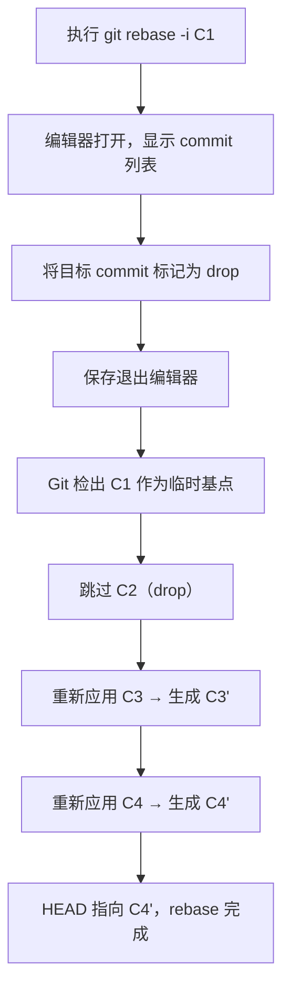
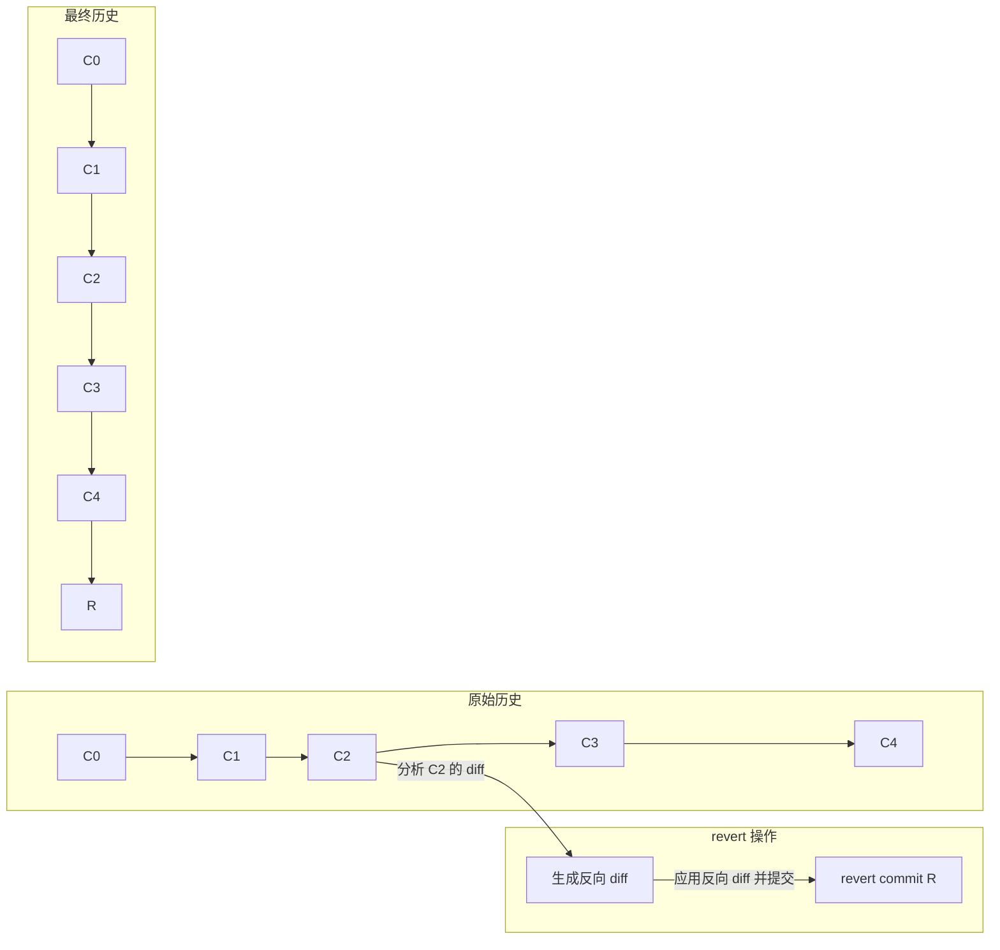
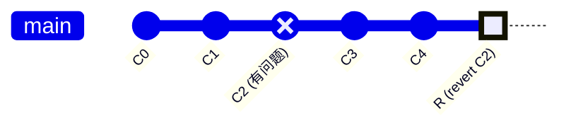
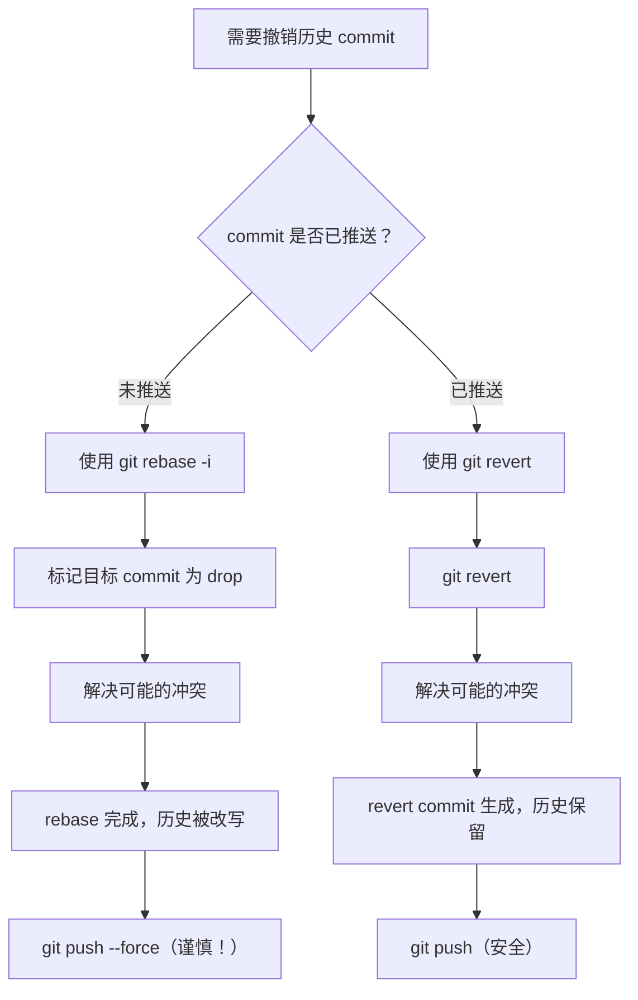
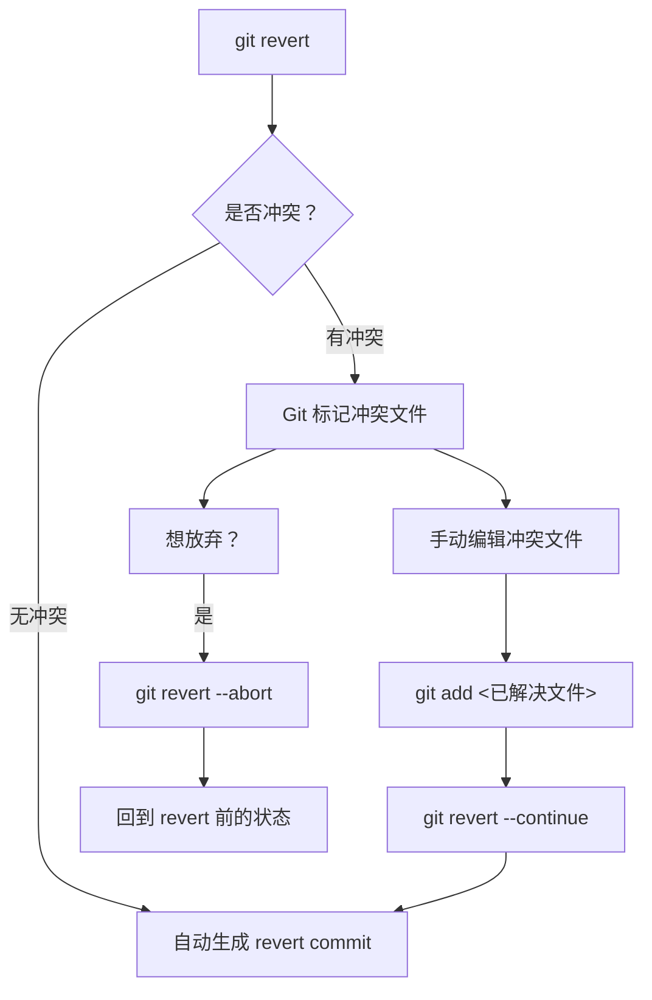
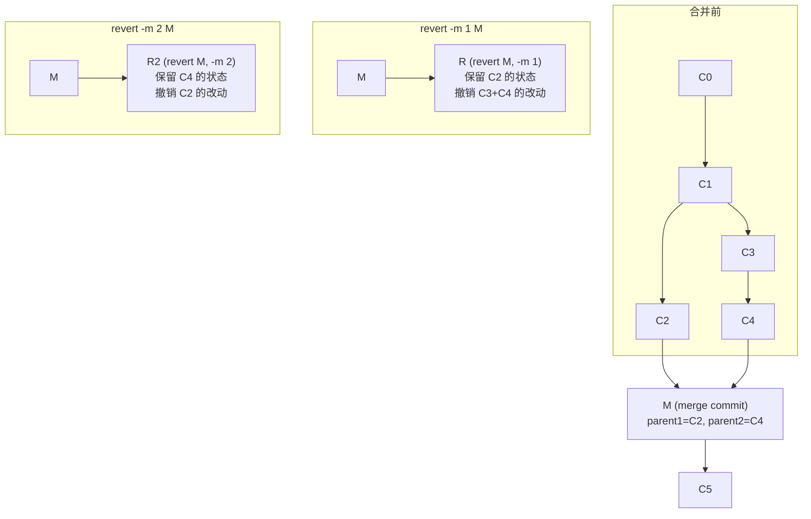
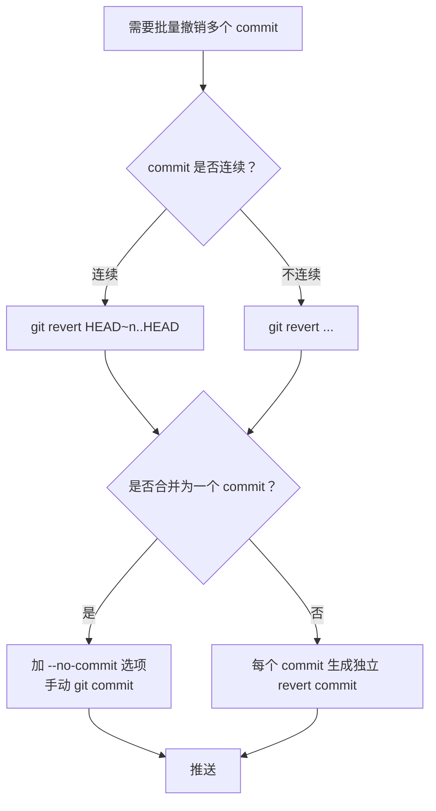

# 撤销历史提交

## 场景说明

上一篇文章讨论了如何撤销**最新的提交**（`git reset` 与 `git commit --amend`）。但现实中更棘手的场景是：你发现历史中某个**已经提交**的 commit 有问题——可能是引入了 bug，可能是泄露了敏感信息，也可能是方向完全走偏——而你希望将其撤销。

这里的关键区分在于：你要撤销的是**最新的 commit**，还是**历史中间某个 commit**？

- 如果是最新 commit，`git reset` 或 `git commit --amend` 即可胜任。
- 如果是历史中间某个 commit，问题就复杂得多——因为后续 commit 可能依赖于它，简单删除可能引发连锁反应。

本文聚焦后者：**如何撤销历史中间的某个 commit**，并深入分析两种核心方法的原理、适用场景与风险。

---

## 方法一：git rebase -i 删除指定 commit

### 基本原理

`git rebase -i`（interactive rebase，交互式变基）允许你以交互方式对一段提交历史进行"编辑"：你可以**删除**某个 commit、**合并**多个 commit、**修改**某个 commit 的内容、**调换** commit 的顺序等。

当你选择**删除**（drop）某个历史 commit 时，Git 的实际操作是：

1. 找到目标 commit 之前的基点
2. 将目标 commit **跳过**（不重新应用）
3. 将目标 commit **之后**的所有 commit 依次重新应用到新的基点上

这意味着被删除 commit 的改动会消失，而后续 commit 会被**重新生成**（hash 值改变）。

### 操作步骤

假设你的提交历史如下，你想删除 `C2` 这个 commit：

```
C0 ← C1 ← C2 ← C3 ← C4 (HEAD → main)
```

**第一步**：启动交互式 rebase，指定要编辑的范围。

```bash
# 方式一：指定从哪个 commit 之后开始（不包含该 commit）
git rebase -i C1

# 方式二：指定要回溯的 commit 数量
git rebase -i HEAD~3
```

**第二步**：Git 会打开编辑器，显示如下待编辑的 commit 列表（从旧到新排列）：

```
pick a1b2c3d C2: 添加了有问题的功能
pick d4e5f6a C3: 修复了某个小 bug
pick b8c9d0e C4: 更新了文档
```

将 `C2` 那一行的 `pick` 改为 `drop`（或直接删除该行）：

```
drop a1b2c3d C2: 添加了有问题的功能
pick d4e5f6a C3: 修复了某个小 bug
pick b8c9d0e C4: 更新了文档
```

保存并退出编辑器。

**第三步**：Git 自动执行 rebase 操作，跳过 `C2`，重新应用 `C3` 和 `C4`。

### 流程图解



rebase 完成后的历史变为：

```
C0 ← C1 ← C3' ← C4' (HEAD → main)
```

`C2` 被彻底移除，`C3` 和 `C4` 被重新生成为 `C3'` 和 `C4'`（hash 值不同，但内容差异仅在于不包含 `C2` 的改动）。

### 冲突处理

如果 `C3` 或 `C4` 的改动**依赖于** `C2` 的改动（例如 `C2` 添加了一个函数，`C3` 调用了该函数），那么在重新应用 `C3` 时就会产生冲突。此时需要：

1. 手动解决冲突
2. `git add` 标记冲突已解决
3. `git rebase --continue` 继续 rebase

如果冲突太多、难以解决，可以随时用 `git rebase --abort` 放弃整个 rebase，回到操作前的状态。

### 关键风险：改写历史

`git rebase -i` 的本质是**改写历史**——被删除的 commit 及其后续所有 commit 的 hash 都会改变。这意味着：

- 如果这些 commit **已经推送到远程仓库**，其他协作者可能已经基于旧的 commit 进行了开发
- 你用改写后的历史强制推送（`git push --force`）后，其他协作者的本地历史与远程不一致，会导致严重的合并问题

> **核心原则：rebase -i 仅适用于尚未推送的 commit。对于已推送的 commit，应使用 git revert。**

---

## 方法二：git revert <commit>

### 基本原理

与 `rebase -i` 直接删除 commit 不同，`git revert` 采用的是一种**反向抵消**的策略：它不修改历史，而是创建一个**新的 commit**，其改动恰好与目标 commit 的改动相反，从而将代码状态恢复到目标 commit 之前的状态。

这就像会计中的"红字冲账"——你不会擦掉原始的记账记录，而是新增一条等额反向的记录，使净效果为零。

### 操作步骤

假设同样的历史，你想撤销 `C2` 的改动：

```
C0 ← C1 ← C2 ← C3 ← C4 (HEAD → main)
```

执行：

```bash
git revert C2
```

Git 会生成一个 revert commit（记为 `R`），其改动是 `C2` 改动的"反操作"——`C2` 添加的行被删除，`C2` 删除的行被添加回来。

revert 后的历史变为：

```
C0 ← C1 ← C2 ← C3 ← C4 ← R (HEAD → main)
```

历史记录完整保留，`C2` 依然存在，但 `R` 抵消了 `C2` 的效果。

### 工作原理图解



更直观地理解 revert 的效果：



### 默认行为：编辑提交信息

执行 `git revert` 时，Git 会自动生成一条默认的提交信息，格式为：

```
Revert "C2: 添加了有问题的功能"

This reverts commit a1b2c3d...
```

并打开编辑器让你确认或修改。如果你想跳过编辑器直接提交，可以使用 `--no-edit` 选项：

```bash
git revert --no-edit C2
```

---

## rebase -i 与 revert 的对比

这是理解何时使用哪种方法的核心：

| 维度 | `git rebase -i` (drop) | `git revert` |
|------|----------------------|-------------|
| **对历史的影响** | 改写历史（删除 commit，后续 commit hash 改变） | 保留历史（新增 revert commit） |
| **是否安全推送** | 不安全，需要 `push --force`，影响协作者 | 安全，正常 `push` 即可 |
| **适用场景** | 本地未推送的 commit | 已推送的 commit，或需要保留审计记录 |
| **历史可追溯性** | 被删除的 commit 从历史中消失 | 原始 commit 和 revert commit 都保留，可追溯 |
| **冲突风险** | 后续 commit 重新应用时可能冲突 | 反向应用时可能冲突 |
| **可逆性** | 较难恢复（需用 reflog 找回旧 commit） | 容易恢复（revert 掉 revert commit 即可） |
| **对 CI/CD 的影响** | 无额外触发 | 会触发新的 CI 流水线 |



> **经验法则**：如果 commit 只存在于你的本地仓库，用 `rebase -i` 让历史更干净；如果 commit 已经被他人看到，用 `revert` 保证协作安全。

---


## revert 的冲突处理

### 何时会产生冲突

`git revert` 并非总是能顺利自动完成。当目标 commit 的改动与后续 commit 的改动存在**重叠**时，Git 无法自动生成反向 diff，就会产生冲突。

典型场景：

```
C0 ← C1 ← C2(修改了第10行) ← C3(也修改了第10行) ← C4 (HEAD)
```

如果你 `git revert C2`，Git 需要撤销 C2 对第10行的修改，但 C3 已经在第10行做了新的修改。Git 无法确定应该恢复成 C2 之前的版本还是保留 C3 的版本，因此产生冲突。

### 冲突解决流程



冲突文件中的标记格式与合并冲突一致：

```text
<<<<<<< HEAD
当前分支的内容（即 C4 中该行的状态）
=======
revert 操作想要恢复的内容（即 C2 之前该行的状态）
>>>>>>> parent of <C2-hash>
```

你需要根据实际需求决定保留哪部分内容，然后 `git add` 并 `git revert --continue`。

### --skip 选项

如果 revert 的改动在当前代码中已经不存在（例如后续 commit 已经手动修复了同样的问题），你可以使用 `git revert --skip` 跳过这个 revert commit 的生成。

---

## revert merge commit：-m 选项

### 问题背景

当你要 revert 的 commit 是一个 **merge commit** 时，情况会变得特殊。merge commit 有**两个（或更多）父 commit**，Git 需要知道 revert 时应该以哪个父 commit 的状态为基准来计算反向 diff。

```
C0 ← C1 ← C2 ← M ← C5 (HEAD)
               ↗
     C3 ← C4 ──┘
```

merge commit `M` 有两个父 commit：
- **第一父 commit（mainline）**：`C2`（被合并进来的目标分支上的最后一个 commit）
- **第二父 commit**：`C4`（要合并进来的源分支上的最后一个 commit）

### -m 选项的用法

`-m` 选项指定保留哪个父编号（从 1 开始计数）：

```bash
# 保留第一父 commit（即 mainline），撤销从第二父 commit 合并进来的改动
# 效果：撤销整个 feature 分支的合并
git revert -m 1 <merge-commit>

# 保留第二父 commit（即 feature 分支），撤销 mainline 的改动
# 极少使用，效果相当于回退到 feature 分支的状态
git revert -m 2 <merge-commit>
```

绝大多数情况下，你应该使用 `-m 1`，即保留主分支的演进，撤销被合并进来的 feature 分支的改动。

### 流程图解



### 如何确定父编号

如果你不确定 merge commit 的父编号，可以用以下命令查看：

```bash
git show <merge-commit> --format="%P" --no-patch
```

输出会列出所有父 commit 的 hash，空格分隔，第一个就是 parent 1。

或者更直观地：

```bash
git log --graph --oneline <merge-commit>~1..<merge-commit>
```

### 注意：revert merge commit 后的重新合并

一个常见的陷阱是：如果你 revert 了一个 merge commit，之后又想重新合并同一个 feature 分支，直接 `git merge` 不会生效——因为 Git 认为那些 commit 已经在历史中了（虽然被 revert 抵消了）。

解决方案是**先 revert 掉那个 revert commit**，然后再合并：

```bash
# 第一步：revert 掉之前的 revert commit
git revert <revert-commit>

# 第二步：重新合并 feature 分支
git merge feature-branch
```

这看起来有些绕，但逻辑是自洽的：revert commit 抵消了 merge，revert-of-revert 又抵消了 revert，净效果等于恢复了 merge，此时再合并新改动就能正常进行。

---

## 多 commit 批量 revert

### 撤销最近的连续多个 commit

如果你想撤销最近的 N 个 commit，可以指定范围：

```bash
# 撤销最近 3 个 commit（HEAD, HEAD~1, HEAD~2）
# 会生成 3 个 revert commit，从新到旧依次 revert
git revert HEAD~3..HEAD
```

注意 `HEAD~3..HEAD` 的含义：这是一个**左开右闭**区间，即 revert `HEAD~2`、`HEAD~1`、`HEAD` 这三个 commit，**不包含** `HEAD~3` 本身。

Git 默认按**从新到旧**的顺序依次 revert，这样可以减少冲突的概率——因为先 revert 最新的改动，再 revert 较旧的改动，每一步的"当前状态"都更接近目标 commit 时的状态。

### 撤销不连续的多个 commit

如果目标 commit 不是连续的，可以逐个指定：

```bash
# 同时 revert 两个不连续的 commit
git revert <commit-A> <commit-B>
```

### --no-commit 选项：合并为单个 revert commit

默认情况下，`git revert` 每个 commit 都会生成一个独立的 revert commit。如果你希望将多个 revert 的改动合并为一个 commit，可以使用 `--no-commit` 选项：

```bash
# 依次 revert，但不自动提交
git revert --no-commit HEAD~3..HEAD

# 检查所有改动是否正确后，手动提交
git commit -m "revert: 撤销最近 3 个 commit 的改动"
```

这样历史中只会出现一个 revert commit，而不是三个，保持历史更简洁。

### 批量 revert 的流程



---

## 小结

| 方法 | 命令 | 核心机制 | 适用场景 | 风险等级 |
|------|------|---------|---------|---------|
| 交互式变基 | `git rebase -i` | 删除目标 commit，重新应用后续 commit | 本地未推送的 commit | 中（改写历史） |
| 反向提交 | `git revert <commit>` | 新增 commit 抵消目标 commit 的改动 | 已推送的 commit | 低（保留历史） |

关键要点回顾：

1. **`git rebase -i`** 通过 drop 删除历史 commit，后续 commit 会被重新生成（hash 改变），属于**改写历史**操作，仅适用于未推送的 commit。
2. **`git revert`** 通过创建反向 commit 来抵消目标 commit 的效果，属于**保留历史**操作，安全适用于已推送的 commit。
3. revert 可能产生冲突，需要手动解决后 `git revert --continue`，或用 `--abort` 放弃。
4. revert merge commit 需要用 `-m` 选项指定保留哪个父分支，通常使用 `-m 1` 保留主分支。
5. 批量 revert 可用范围语法 `HEAD~n..HEAD`，配合 `--no-commit` 可将多个 revert 合并为一个 commit。
6. 如果 revert 了 merge commit 后又想重新合并，需要先 revert 掉那个 revert commit。

> **一句话总结**：本地未推送用 rebase 让历史更干净，已推送用 revert 让协作更安全。选择的标准不是哪个"更好"，而是哪个对你的团队和工作流更安全。

