# 丢弃提交

在 Git 的日常使用中，"撤销"和"丢弃"是两个经常被混淆的概念。理解它们的本质区别，是掌握 Git 版本回退操作的关键前提。本文将系统讲解丢弃提交的各种方式、适用场景以及潜在风险，帮助你在不同情境下做出正确的决策。

## "撤销"与"丢弃"的本质区别

| 维度 | 撤销（Revert） | 丢弃（Reset / Rebase） |
|------|----------------|------------------------|
| 历史记录 | 保留原有提交，新增一个"反向提交" | 从历史中移除目标提交 |
| SHA-1 变化 | 不影响已有提交的 SHA-1 | 后续所有提交的 SHA-1 会重新计算 |
| 安全性 | 安全，适用于已推送的公共分支 | 有风险，尤其对已推送的代码 |
| 操作可逆性 | 本身就是可逆的（再 revert 一次即可恢复） | 需借助 `reflog` 才能恢复 |
| 协作影响 | 不影响协作者的历史 | 会导致协作者的本地历史与远程不一致 |

简言之：

- **撤销（Revert）**——"承认错误发生过，用新提交抵消它"。历史是完整的，谁都能看到曾经做了什么、又修正了什么。
- **丢弃（Reset / Rebase）**——"让错误从未发生过"。从提交历史中直接抹去，仿佛那一步从未执行过。

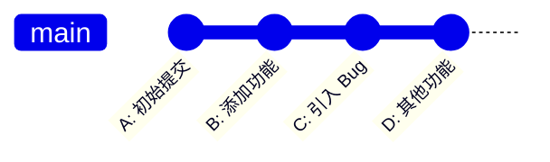

**撤销方式**——在 D 之后新增一个反向提交 C'，抵消 C 的改动：

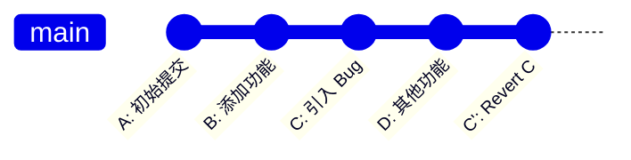

**丢弃方式**——直接将 C 从历史中移除，D 的 SHA-1 会发生变化（变为 D'）：

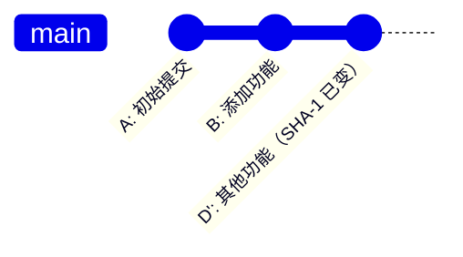

---

## 丢弃最新 Commit

当你发现最近一次提交完全错误、想要彻底移除时，可以使用 `git reset`。

### 基本命令

```bash
git reset --hard HEAD^
```

- `HEAD^` 表示当前提交的父提交，即"回退一步"。
- `--hard` 表示同时重置工作区和暂存区，丢弃所有改动。

### 图示

假设当前提交历史如下：

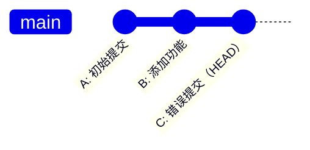

执行 `git reset --hard HEAD^` 后：

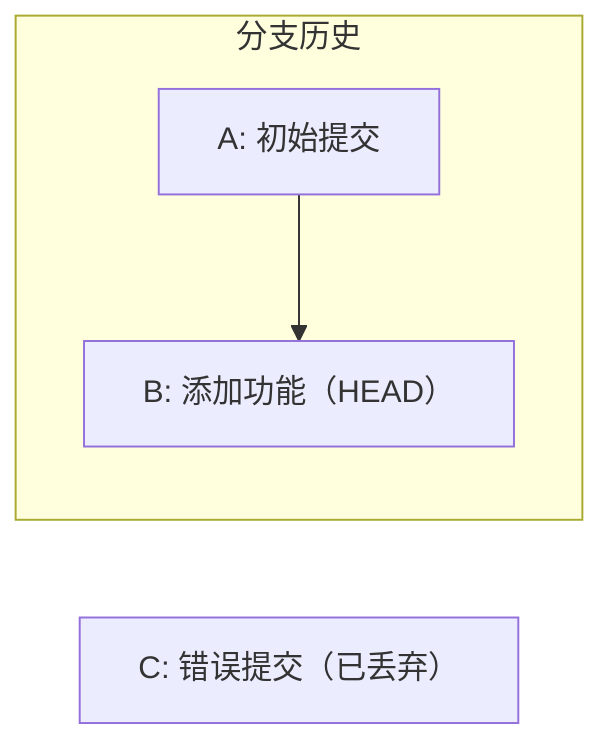

HEAD 指向了 B，C 从分支历史中消失。但 C 并未被 Git 立即删除——它仍然存在于对象库中，可以通过 `git reflog` 找回（默认保留 90 天）。

### reset 的三种模式对比

| 模式 | 工作区 | 暂存区 | 提交历史 | 典型用途 |
|------|--------|--------|----------|----------|
| `--soft` | 保留 | 保留 | 回退 | 拆分提交、修改提交信息 |
| `--mixed`（默认） | 保留 | 重置 | 回退 | 重新组织暂存区 |
| `--hard` | 重置 | 重置 | 回退 | 彻底丢弃，不保留任何改动 |

> **提示**：如果你只想修改最新提交的信息或内容，`git commit --amend` 比 `reset --soft` 更简洁。`reset --soft HEAD^` 的优势在于可以拆分一次提交为多次。

---

## 丢弃连续多个 Commit

当需要一次性丢弃最近 n 个提交时，使用 `HEAD~n` 语法。

### 基本命令

```bash
# 丢弃最近 3 个提交
git reset --hard HEAD~3
```

- `HEAD~n` 表示从 HEAD 往回数第 n 个祖先提交。
- `HEAD~1` 等价于 `HEAD^`，`HEAD~2` 等价于 `HEAD^^`。

### 图示

假设当前提交历史如下：

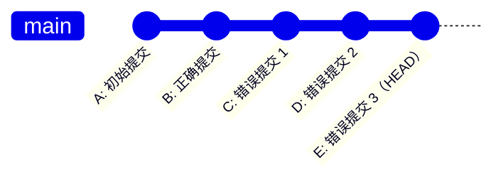

执行 `git reset --hard HEAD~3` 后，C、D、E 全部被丢弃：

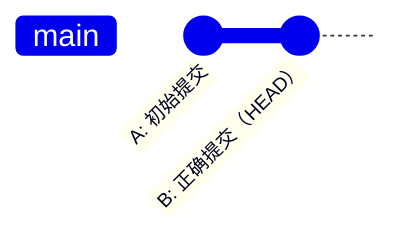

### HEAD~ 与 HEAD^ 的区别

对于线性历史，两者等价。但在合并提交上行为不同：

- `HEAD^`（第一父提交）：执行合并时所在的分支（通常是主分支 main）。
- `HEAD^2`（第二父提交）：被合并进来的分支（如 feature 分支）。

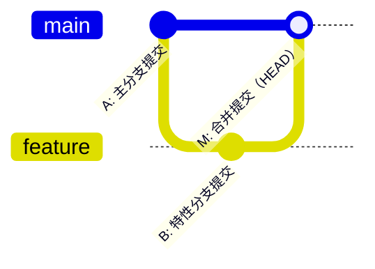

- `HEAD^` 或 `HEAD^1` → A（第一父提交）
- `HEAD^2` → B（第二父提交）
- `HEAD~2` → A 的父提交（沿第一父链回溯两步）

---

## 丢弃历史中间某个 Commit

`git reset` 只能从 HEAD 向前回退，无法精确移除历史中间的某个提交。这时需要使用交互式变基（interactive rebase）。

### 基本命令

```bash
# 回溯到目标提交之前，进入交互模式
git rebase -i <目标提交的父提交哈希>

# 或者使用 HEAD~n 表示回溯范围
git rebase -i HEAD~5
```

在打开的编辑器中，将目标提交的 `pick` 改为 `drop`（或直接删除该行）：

```
pick a1b2c3d 正确的提交 1
drop e4f5a6b 要丢弃的提交    ← 将 pick 改为 drop
pick 9a8b7c6 正确的提交 2
```

### 图示

假设当前提交历史如下，需要丢弃中间的 C：

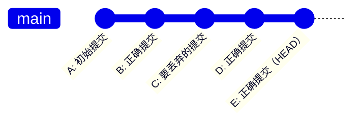

执行 `git rebase -i B`，将 C 标记为 `drop` 后：

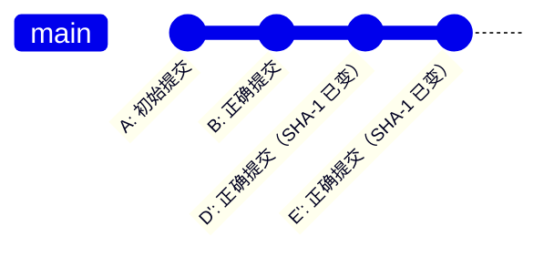

C 被移除，D 和 E 因为父提交发生了变化，被重新计算为 D' 和 E'（新的 SHA-1 哈希值）。

### drop 与删除行的等价性

在交互式 rebase 的待办列表中，以下两种操作效果完全相同：

1. 将 `pick` 改为 `drop`
2. 直接删除该行

两者都会使目标提交从历史中移除。`drop` 关键字是 Git 2.0 之后引入的显式写法，语义更清晰，推荐使用。


### 处理冲突

如果被丢弃的提交与后续提交存在依赖关系（例如 C 修改了某文件，D 基于该修改继续开发），rebase 过程中会产生冲突。解决策略：

1. 手动解决冲突后 `git add` 标记已解决。
2. 执行 `git rebase --continue` 继续。
3. 如果冲突过于复杂，可以 `git rebase --abort` 放弃整个操作。

> **重要**：如果被丢弃的提交引入的改动被后续提交依赖，丢弃后可能导致后续提交变为空提交（no-change commit）。Git 默认会自动丢弃这类空提交；如果希望保留它们，可以使用 `--keep-empty` 选项。

---

## 丢弃 Commit 的风险

### 1. SHA-1 哈希变化

Git 的提交哈希是根据提交内容、父提交哈希、作者信息、时间戳等计算得出的。一旦某个提交被丢弃，其所有后续提交的父指针都会改变，导致 SHA-1 重新计算。

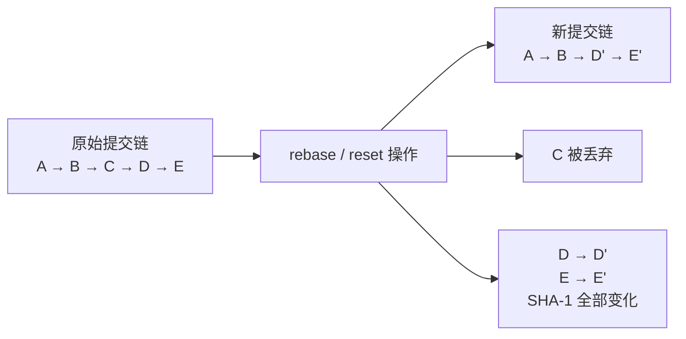

这意味着：
- 任何基于旧 SHA-1 的引用（如分支名、标签、`cherry-pick` 引用）都会失效。
- 代码审查工具中引用的提交链接可能变成死链。

### 2. 已推送代码的同步问题

这是最严重的风险。当你丢弃了一个已经推送到远程仓库的提交，你的本地历史与远程历史产生了分叉：

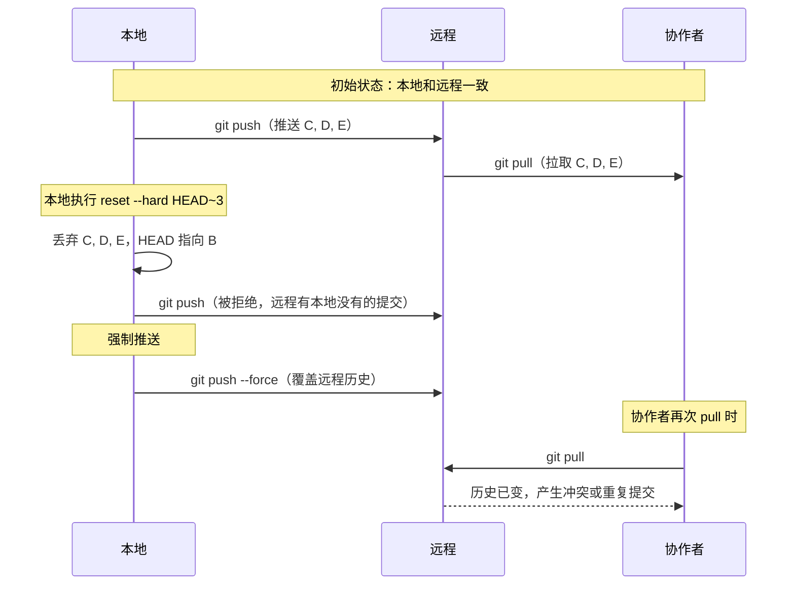

协作者遇到的问题：
- `git pull` 可能报错，提示本地历史与远程分叉。
- 如果协作者使用 `git pull --rebase`，可能产生重复的提交（因为旧的 D、E 仍然存在于本地）。
- 协作者必须手动执行 `git reset --hard origin/main` 来同步，**未提交的工作可能丢失**。

### 3. reflog 的保护与局限

Git 的 `reflog` 机制会记录 HEAD 的每一次移动，即使执行了 `reset --hard`，也可以通过 reflog 找回丢失的提交：

```bash
# 查看 reflog
git reflog

# 找到丢失提交的哈希后恢复
git reset --hard <哈希值>
```

但 reflog 有以下局限：
- **仅限本地**：reflog 不会同步到远程仓库。
- **有过期时间**：默认 90 天后，不可达对象会被 `git gc` 回收。
- **不保护协作者**：你强制推送后，协作者的 reflog 中没有你丢弃的提交记录。

---

## 已推送代码的安全撤销策略

对于已经推送到远程仓库的代码，**永远优先使用 `revert` 而非 `reset`**。

### 策略一：用 revert 代替 reset

```bash
# 撤销最新提交
git revert HEAD

# 撤销指定提交
git revert <commit-hash>

# 撤销连续多个提交（按从新到旧的顺序）
git revert HEAD~3..HEAD

# 撤销多个提交但只生成一个合并提交（更干净的历史）
git revert -n HEAD~3..HEAD
git commit -m "Revert the last 3 commits"
```

revert 的优势：
- 不改变已有历史，协作者只需正常 `git pull` 即可同步。
- 保留了完整的审计轨迹——谁在什么时候撤销了什么，一目了然。
- 完全可逆——如果 revert 本身也是错的，可以再 revert 一次恢复。

### 策略二：必须强制推送时使用 --force-with-lease

在某些场景下（如个人特性分支的清理），你可能确实需要强制推送。此时务必使用 `--force-with-lease` 替代 `--force`：

```bash
# 危险：直接覆盖远程，不管其他人是否有新提交
git push --force

# 安全：只有当远程分支仍指向你预期的提交时才允许覆盖
git push --force-with-lease
```

`--force-with-lease` 的工作原理：

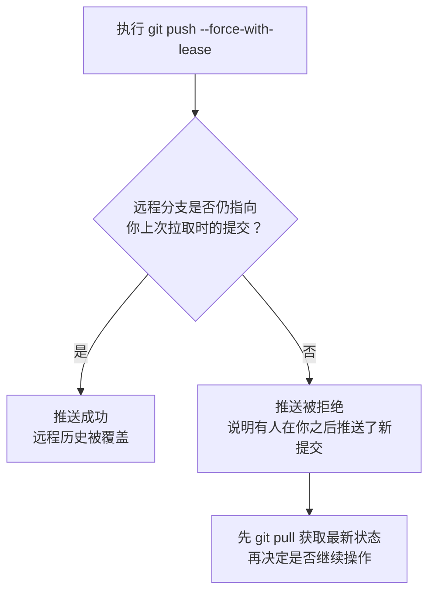

这相当于一个"乐观锁"机制——如果在你准备强制推送的期间，其他人已经推送了新的提交，`--force-with-lease` 会拒绝操作，避免意外覆盖他人的工作。

更精细的控制：

```bash
# 指定期望的远程提交哈希
git push --force-with-lease=refs/heads/main:expected-sha
```

### 策略三：特性分支的清理流程

对于尚未合并的个人特性分支，可以安全地使用 reset + force-push：

```bash
# 1. 确认分支只有你自己在用
git branch -r --contains HEAD  # 检查远程追踪

# 2. 本地 reset
git reset --hard HEAD~3

# 3. 强制推送（使用 --force-with-lease）
git push --force-with-lease
```

对于已合并到主分支的提交，**绝对不要**使用 reset + force-push，只能使用 revert。

---

## 决策流程图

面对一个需要"撤回"的提交，应该选择丢弃还是撤销？以下决策流程图帮助你做出正确判断：

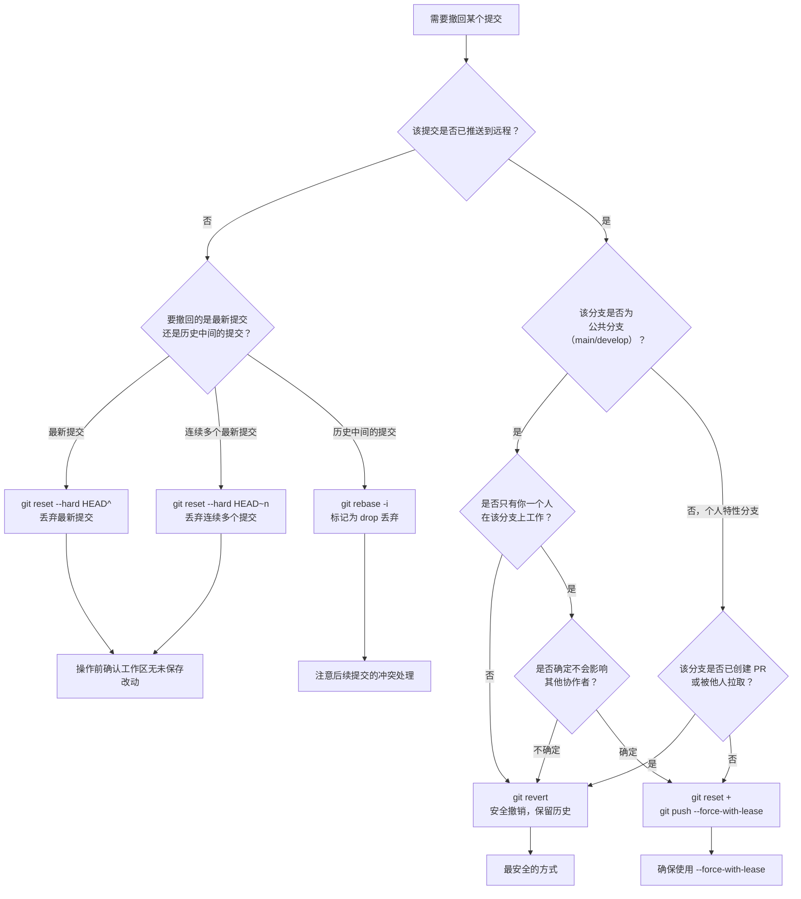

### 核心原则总结

1. **未推送的提交**：可以放心使用 `reset` 或 `rebase` 丢弃，因为不影响他人。
2. **已推送的公共分支**：永远使用 `revert`，不要用 `reset --force`。
3. **已推送的个人分支**：确认无他人基于该分支工作后，可使用 `reset` + `--force-with-lease`。
4. **拿不准时**：选 `revert`。`revert` 永远是安全的选择，最坏情况不过是多了一条撤销记录；而 `reset --force` 最坏情况是破坏整个团队的协作历史。

---

## 小结

| 操作 | 命令 | 适用场景 | 是否改变历史 | 风险等级 |
|------|------|----------|-------------|---------|
| 丢弃最新提交 | `git reset --hard HEAD^` | 本地未推送的错误提交 | 是 | 中 |
| 丢弃连续多个提交 | `git reset --hard HEAD~n` | 本地未推送的连续错误 | 是 | 中 |
| 丢弃中间提交 | `git rebase -i` + `drop` | 本地未推送的历史中间错误 | 是 | 中高 |
| 安全撤销 | `git revert` | 已推送的提交 | 否 | 低 |
| 强制推送 | `git push --force-with-lease` | 个人分支的已推送提交 | 是 | 中 |

丢弃提交是一把双刃剑：它让本地历史保持干净整洁，但一旦涉及已推送的代码，就可能引发协作灾难。牢记以下黄金法则：

> **如果提交已经推送到与他人共享的分支，永远使用 `revert`，不要使用 `reset`。**

这条法则没有例外。即使你确信自己是唯一在用该分支的人，也建议先确认再操作——因为"确信"可能出错，而 `revert` 永远安全。

