# 已推送代码的撤销

当你的 commit 已经推送到远程仓库，情况就与本地撤销截然不同了——你面对的不再只是自己的代码历史，而是整个团队的协作基础。一次不当的撤销操作，轻则让同事的本地仓库陷入混乱，重则导致代码永久丢失。本文将系统讲解已推送代码撤销的正确策略、工具使用及风险防范。

## 一、已推送代码撤销的特殊性

### 1.1 公共历史的不可变原则

本地未推送的 commit 只影响你自己，可以随意改写。但一旦推送到远程，这些 commit 就变成了**公共历史（public history）**——其他人可能已经基于这些 commit 进行了新的开发。

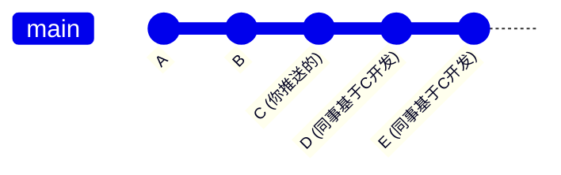

如果你用 `reset` 改写已推送的历史，同事的 commit D 和 E 就会失去根基，造成历史分叉和混乱。

### 1.2 两种撤销策略的本质区别

| 维度 | 改写历史（reset + force push） | 新增历史（revert） |
|------|-------------------------------|-------------------|
| 操作方式 | 删除旧 commit，替换为新 commit | 保留旧 commit，新增一个撤销 commit |
| 历史完整性 | 破坏公共历史 | 保持公共历史完整 |
| 对他人的影响 | 所有人必须重新同步，可能丢失工作 | 其他人正常 pull 即可 |
| 适用场景 | 仅限个人分支或确认无人基于该 commit 工作 | 公共分支、团队协作 |
| 风险等级 | 高 | 低 |

**核心原则：已推送的代码优先使用 revert，避免改写公共历史。**

---

## 二、git revert 单个 commit

### 2.1 基本用法

```bash
git revert <commit-hash>
```

`git revert` 会创建一个新的 commit，其内容是指定 commit 的"反向操作"——将那个 commit 引入的变更原样撤销。

### 2.2 工作原理

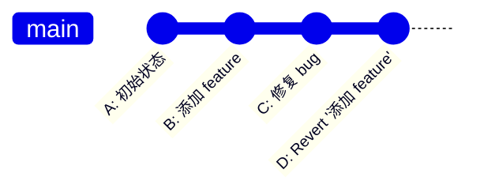

假设 commit B 添加了一个函数 `foo()`，那么 `git revert B` 会生成一个新的 commit D，删除函数 `foo()`，使代码恢复到 B 之前的状态。

具体来说：

```bash
# 查看历史，找到要撤销的 commit
git log --oneline
# e3a1b2f C: 修复 bug
# 7c4d9e2 B: 添加 feature
# a1f8c3d A: 初始状态

# 撤销 commit B
git revert 7c4d9e2
```

执行后，Git 会打开编辑器让你编写 revert commit 的消息（默认为 `Revert "B: 添加 feature"`），保存后即完成。

### 2.3 revert 不是"删除"而是"反转"

理解 revert 的关键在于：它**不会删除或修改原有的 commit**，而是新增一个 commit 来抵消原有变更。这就像会计账簿中的"红字冲销"——错误记录不撕掉，而是用一笔相反的记录来纠正。

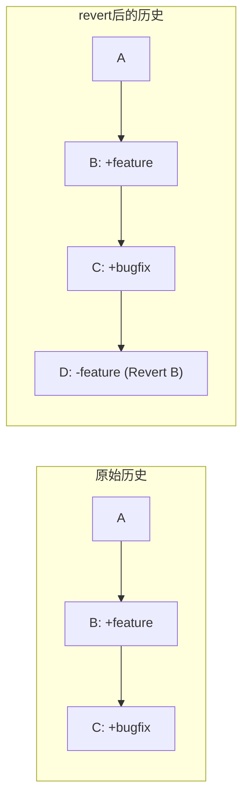

### 2.4 处理冲突

如果被 revert 的 commit 与后续 commit 有重叠修改，revert 过程可能产生冲突：

```bash
git revert 7c4d9e2
# error: could not revert 7c4d9e2... B: 添加 feature
# CONFLICT (content): Merge conflict in src/app.js

# 解决冲突后
git add src/app.js
git revert --continue

# 如果想放弃 revert
git revert --abort
```

冲突解决流程与 merge 冲突完全一致。

---

## 三、git revert 多个 commit

### 3.1 逐个 revert

最直接的方式是对每个 commit 分别执行 revert：

```bash
git revert commit3 commit2 commit1
```

注意：Git 会按**从新到旧**的顺序逐个 revert，避免中间 commit 产生不必要的冲突。每个 revert 会生成一个独立的 revert commit。

### 3.2 批量 revert：范围语法

使用范围语法可以一次 revert 一段连续的 commit：

```bash
# 撤销最近 3 个 commit
git revert HEAD~3..HEAD
```

**范围语法的关键细节**：

- `HEAD~3..HEAD` 是一个左开右闭区间——包含 HEAD，不包含 HEAD~3
- 也就是说，它 revert 的是 HEAD~2、HEAD~1、HEAD 这三个 commit
- Git 同样会按从新到旧的顺序依次 revert

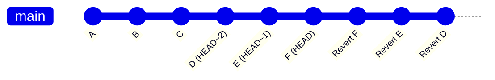

### 3.3 revert 顺序的重要性

为什么必须从新到旧？看下面的例子：

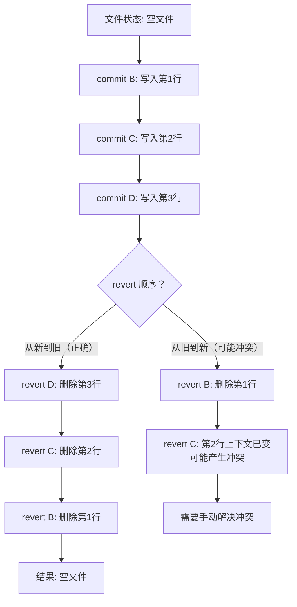

从旧到新 revert 时，每个后续 revert 都面对的是"已经部分被改动"的文件，冲突概率大大增加。Git 内部会自动按正确顺序执行，但如果手动逐个 revert，务必注意顺序。

---

## 四、git revert --no-commit：合并多个 revert

### 4.1 问题场景

当你需要 revert 多个 commit 时，默认每个 revert 都会产生一个独立的 commit。如果你需要 revert 5 个 commit，历史中就会多出 5 个 revert commit，这让历史变得冗长且难以阅读。

### 4.2 解决方案：--no-commit

`--no-commit` 选项让 revert 只修改工作区和暂存区，但不自动生成 commit。你可以将多个 revert 的效果合并为一个 commit：

```bash
# revert 第一个 commit，但不提交
git revert --no-commit HEAD~2

# revert 第二个 commit，也不提交
git revert --no-commit HEAD~1

# 此时暂存区中累积了两个 revert 的效果
# 一次性提交
git commit -m "revert: 撤销最近两个有问题的 feature commit"
```

### 4.3 效果对比

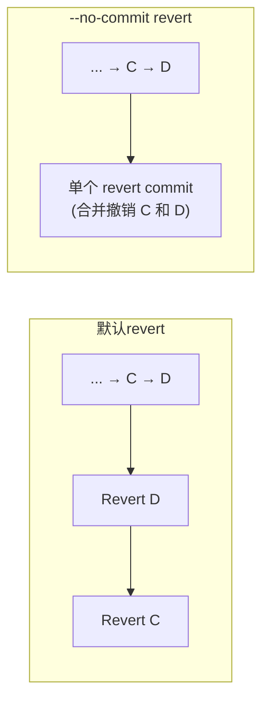

### 4.4 注意事项

- `--no-commit` 只是跳过了自动 commit 步骤，冲突处理逻辑与普通 revert 一致
- 如果中途某个 revert 产生冲突，解决后执行 `git revert --continue`，但此时仍不会自动 commit
- 如果想放弃所有累积的 revert 操作，使用 `git reset --hard` 清理暂存区和工作区
- 也可以使用 `git revert --no-commit HEAD~3..HEAD` 对范围进行批量操作

---

## 五、revert merge commit 的特殊性


### 5.1 merge commit 有两个父 commit

普通 commit 只有一个父 commit，但 merge commit 有两个（或更多）父 commit。当你 revert 一个 merge commit 时，Git 必须知道应该以哪个父分支的方向进行回退。

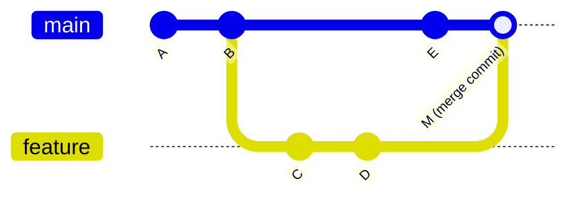

merge commit M 有两个父 commit：

- **第一父 commit（Parent 1）**：E，即 main 分支上的 commit
- **第二父 commit（Parent 2）**：D，即被合并进来的 feature 分支上的 commit

### 5.2 -m 选项的用法

`-m` 选项指定 revert 时保留哪个父编号。编号从 1 开始：

```bash
# 查看 merge commit 的父 commit 编号
git show M
# Merge: e5f1a2b d3c7e9f
# 第一个编号 e5f1a2b 是 Parent 1（main 分支）
# 第二个编号 d3c7e9f 是 Parent 2（feature 分支）

# 撤销合并，保留 main 分支（Parent 1）的状态
# 即：撤销 feature 分支带来的所有变更
git revert -m 1 M

# 撤销合并，保留 feature 分支（Parent 2）的状态
# 即：撤销 main 分支自分叉以来的变更（极少使用）
git revert -m 2 M
```

### 5.3 如何选择 -m 的值

绝大多数场景下，你想要**撤销被合并进来的分支的变更**，即保留主分支的状态：

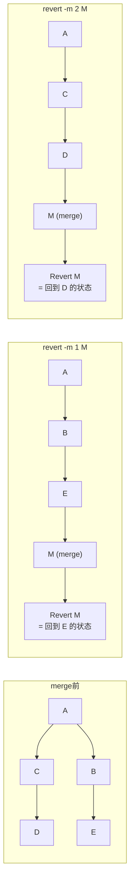

**经验法则**：`-m 1` 保留的是执行 merge 时你所在的分支（通常是 main），这是最常见的意图。

### 5.4 revert merge commit 后重新合并的陷阱

revert 一个 merge commit 后，如果你想再次合并同一分支，直接 merge 会失败——Git 认为这些 commit 已经被合并过了（虽然被 revert 了，但历史中确实存在）。

解决方案是先 revert 那个 revert commit：

```bash
# 第一次：合并 feature
git merge feature       # 产生 merge commit M

# 发现问题，撤销合并
git revert -m 1 M       # 产生 revert commit R

# 问题修复后，重新合并
git revert R             # 先撤销之前的 revert
git merge feature        # 现在可以正常合并了
```

这个"revert the revert"的模式在团队协作中非常常见，务必掌握。

---

## 六、force push 的风险详解

### 6.1 什么是 force push

当本地历史与远程历史出现分叉（本地做过了 reset、rebase 或 amend 等改写操作），普通的 `git push` 会被拒绝。此时 `--force` 选项可以强行用本地历史覆盖远程历史：

```bash
git push --force origin main
```

### 6.2 覆盖他人 commit 的场景

这是 force push 最危险的问题：

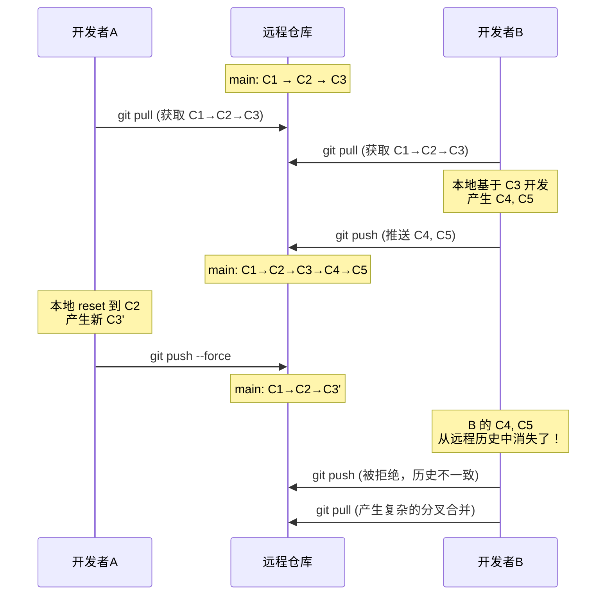

force push 后的远程仓库中，C4 和 C5 虽然还存在于 B 的本地，但已经不在任何分支的引用链上。如果 B 不知道发生了什么，很可能在困惑中丢失这些 commit。


### 6.3 团队成员历史不一致

force push 还会导致团队成员之间的历史不一致：

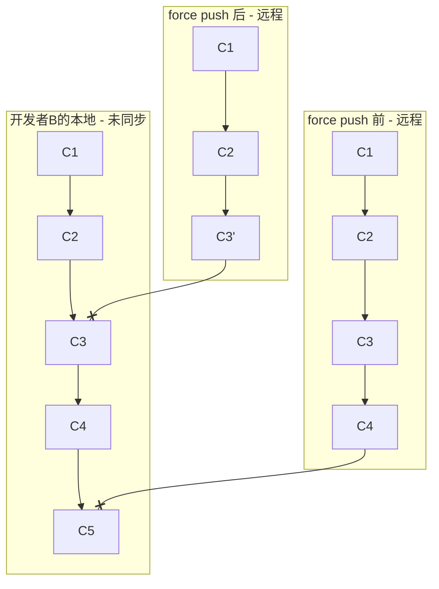

开发者 B 的本地仍然包含 C3、C4、C5，而远程已经变成了 C1→C2→C3'。当 B 尝试 push 或 pull 时，Git 会认为 C3 和 C3' 产生了分叉，需要合并——但这个"合并"毫无意义，因为 C3' 是对 C3 的替换，不是并行开发。

B 可能会做以下操作之一：

| B 的操作 | 后果 |
|----------|------|
| `git pull`（默认 merge） | 产生一个无意义的 merge commit，把 C3' 和 C3/C4/C5 合在一起 |
| `git pull --rebase` | 把 C4、C5 rebase 到 C3' 上，但可能产生大量冲突 |
| `git fetch` + 手动处理 | 最安全但最复杂，需要理解发生了什么 |
| 直接 `git reset --hard origin/main` | 丢失本地的 C4 和 C5 |

### 6.4 何时可以 force push

force push 并非绝对禁止，在以下场景中是安全的：

- **个人特性分支**：确认只有自己在使用该分支
- **已约定的 force push 流程**：团队明确约定在特定分支上使用 rebase 工作流
- **代码审查前的特性分支更新**：PR 还未被合并，且只有作者在该分支上工作

```bash
# 安全的 force push 场景：自己的 feature 分支上 rebase 后推送
git checkout feature/my-feature
git rebase main
git push --force-with-lease origin feature/my-feature
```

---

## 七、git push --force-with-lease：安全替代方案

### 7.1 问题：force push 太粗暴

`git push --force` 是一个"无条件覆盖"操作——它不检查远程引用是否被他人更新过，直接用本地版本替换远程版本。

### 7.2 --force-with-lease 的原理

`--force-with-lease` 在 force push 之前增加了一个前提条件：**检查远程引用的当前值是否与你的预期值一致**。

具体来说，当你执行 `git fetch` 时，Git 会在本地记录远程分支的引用值（`refs/remotes/origin/main`）。`--force-with-lease` 会对比：

1. 你本地的远程引用记录（你上次 fetch/pull 时看到的值）
2. 远程仓库中该分支的实际当前值

如果两者不一致，说明在你上次同步之后，有其他人推送了新的 commit——此时 push 会被拒绝。

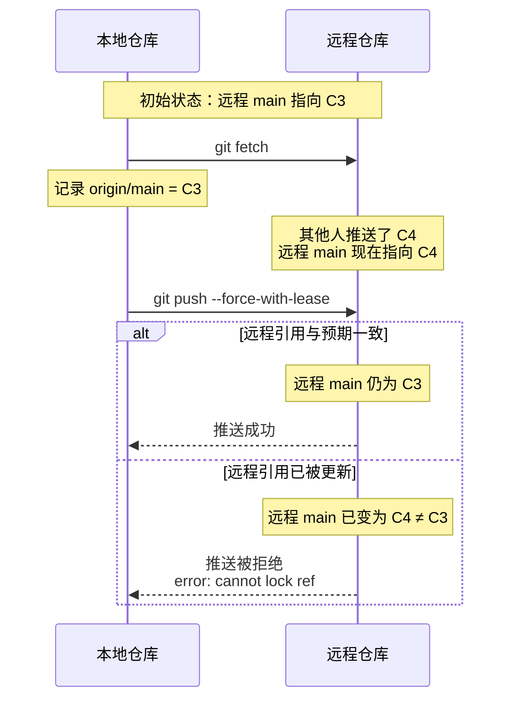

### 7.3 使用示例

```bash
# 基本用法
git push --force-with-lease origin main

# 指定期望的远程引用值（更严格的检查）
git push --force-with-lease=main:expected_sha origin main

# 如果 --force-with-lease 失败，先 fetch 再重试
git fetch origin
git push --force-with-lease origin main
```

### 7.4 --force-with-lease vs --force 对比

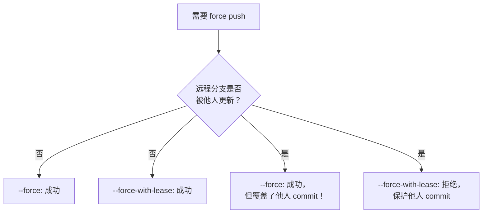

### 7.5 --force-with-lease 的局限性

虽然 `--force-with-lease` 比裸 `--force` 安全得多，但仍有注意点：

1. **依赖本地缓存的远程引用**：如果你在 force push 之前刚执行了 `git fetch`（而没有意识到他人已经推送），本地缓存会更新为最新值，此时 `--force-with-lease` 就不会提供保护
2. **不能替代沟通**：在团队中，即使使用 `--force-with-lease`，force push 前仍应通知相关同事
3. **不保护 reflog 中的 commit**：force push 后，被覆盖的 commit 只能通过 reflog 找回，如果远端已经 GC，则可能永久丢失

**最佳实践**：永远使用 `--force-with-lease` 替代 `--force`，即使在你认为很安全的场景下也保持这个习惯。

---

## 八、小结

| 场景 | 推荐操作 | 命令 |
|------|---------|------|
| 撤销单个已推送 commit | `git revert` | `git revert <commit>` |
| 撤销多个已推送 commit | 批量 `git revert` | `git revert HEAD~3..HEAD` |
| 多个 revert 合并为一个 commit | `git revert --no-commit` | `git revert --no-commit HEAD~3..HEAD && git commit` |
| 撤销已推送的 merge commit | `git revert -m 1` | `git revert -m 1 <merge-commit>` |
| 必须改写已推送的历史 | `--force-with-lease` | `git push --force-with-lease origin <branch>` |

**核心原则回顾**：

1. **已推送的代码优先使用 revert**——它通过新增 commit 来撤销变更，不改写公共历史
2. **永远不要在公共分支上 force push**——除非你有绝对把握且已通知所有相关人员
3. **必须 force push 时，使用 --force-with-lease**——它能在远程引用被他人更新时拒绝推送，防止覆盖他人工作
4. **revert merge commit 时务必使用 -m 选项**——通常 `-m 1` 保留主分支状态
5. **revert 后想重新合并，需要先 revert 那个 revert commit**——直接 merge 不会生效

已推送代码的撤销是 Git 操作中影响范围最广的一类操作。理解其原理、遵循"新增历史优于改写历史"的原则，是保证团队协作安全的基础。

