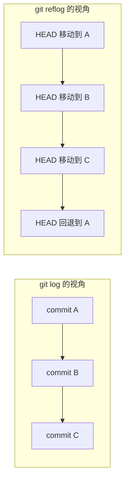
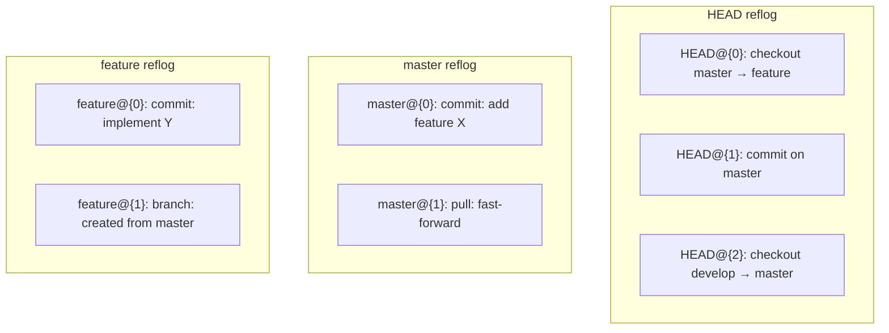
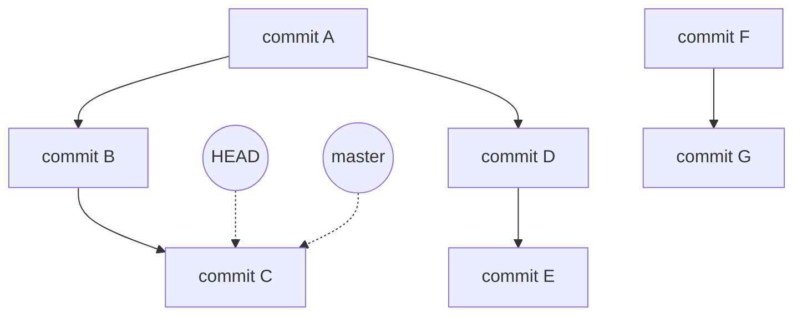
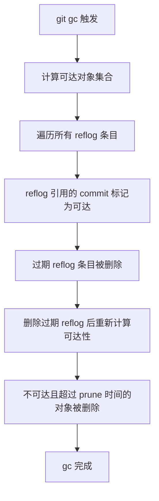
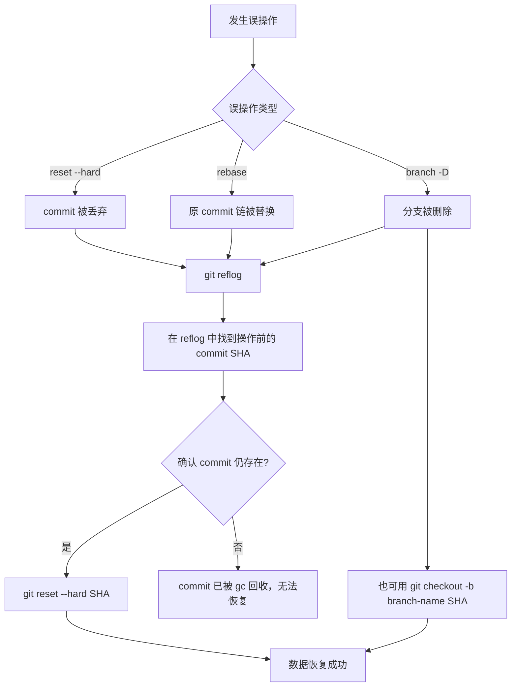
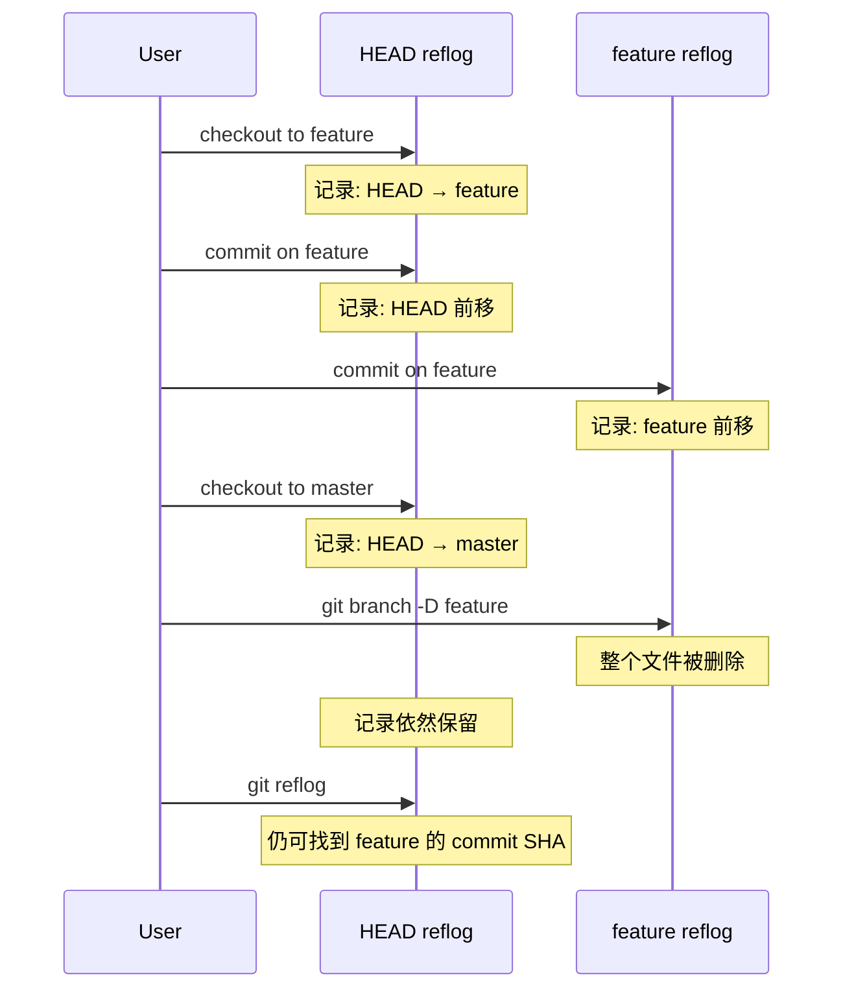
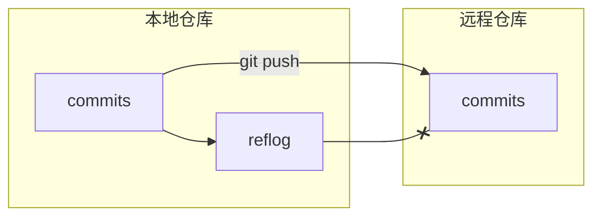

# reflog 与数据恢复

在 Git 的日常使用中，误操作几乎是不可避免的——你可能执行了 `git reset --hard` 把好几个 commit 弄丢了，可能一个 `git rebase` 把提交历史搅得一团糊涂，也可能手快删掉了一个还有用的 branch。这些操作看似"不可逆"，但 Git 其实为你留了一道后门：**reflog**。

reflog 是 Git 中最强大的数据恢复工具，理解它的工作原理和正确使用方式，是每一个 Git 用户从"会用"走向"精通"的关键一步。

## reflog 的概念：Git 的"操作日志"

### 什么是 reflog

reflog 是 "reference log" 的缩写，它记录的是 **引用（reference）的每一次移动**。所谓"引用"，在 Git 中就是指向某个 commit 的指针，比如 `HEAD`、`master`、`feature/login` 等等。每当这些引用的位置发生变化时，Git 就会在 reflog 中追加一条记录。

哪些操作会导致引用移动从而被 reflog 记录？几乎涵盖所有改变 HEAD 或分支指针位置的操作：

- `git commit` — HEAD 前移到新 commit
- `git checkout` / `git switch` — HEAD 指向不同的 branch
- `git reset` — HEAD 被强制移动到指定位置
- `git merge` — 当前 branch 指向合并后的新 commit
- `git rebase` — branch 指针被重新映射到新的 commit 链
- `git pull` — 本地 branch 跟随远程更新而前移
- `git clone` — 初始创建引用
- `git branch -f` — 强制移动 branch 指针

可以把 reflog 理解为 Git 的"黑匣子"——它忠实地记录了你在仓库中的一切操作轨迹，即使那些操作的结果已经被后续操作覆盖，reflog 中依然保留着历史痕迹。

### reflog 与 log 的区别

初学者容易混淆 `git log` 和 `git reflog`，但它们记录的是完全不同的东西：

| 维度 | `git log` | `git reflog` |
|------|-----------|--------------|
| 记录对象 | commit 历史 | 引用移动历史 |
| 视角 | 项目内容演变 | 用户的操作行为 |
| 可见范围 | 当前分支可达的所有 commit | 仅 HEAD/引用的移动事件 |
| 挂掉的 commit | 不可见 | 依然可见 |
| 持久性 | 永久（只要 commit 可达） | 有过期时间（默认 90 天） |

一个关键区别：`git log` 只能显示**当前分支可达**的 commit。如果你用 `reset --hard` 丢弃了几个 commit，`git log` 就再也看不到它们了——但这些 commit 在 `git reflog` 中依然有记录，因为 reflog 记录的是"HEAD 曾经指向过这里"这个事实。



如上图所示，当 `reset --hard` 将 HEAD 从 C 回退到 A 后，`git log` 只能看到 A，但 `reflog` 完整记录了 HEAD 曾经到过 C 的历史——这就是数据恢复的基础。

## reflog 的存储机制

### .git/logs/ 目录结构

reflog 的数据存储在 `.git/logs/` 目录下，其结构与 Git 的引用命名空间一一对应：

```
.git/logs/
├── HEAD              # HEAD 引用的 reflog
└── refs/
    ├── heads/
    │   ├── master    # master 分支的 reflog
    │   ├── develop   # develop 分支的 reflog
    │   └── feature/
    │       └── login # feature/login 分支的 reflog
    ├── remotes/
    │   └── origin/
    │       └── master # 远程追踪引用的 reflog
    └── stash          # stash 引用的 reflog
```

每个 reflog 文件都是纯文本格式，一行一条记录。来看一个 `HEAD` reflog 文件的实际内容：

```
c08de9a HEAD@{0}: checkout: moving from feature/login to master
a3f4b2c HEAD@{1}: commit: add login validation
7e1d8f4 HEAD@{2}: commit: add login form
5b2a9e0 HEAD@{3}: checkout: moving from master to feature/login
5b2a9e0 HEAD@{4}: pull: fast-forward
...
```

每行记录的格式为：

```
<旧SHA> <新SHA> <用户名> <邮箱> <时间戳> <操作描述>
```

### HEAD 的 reflog 与各 branch 的 reflog

Git 维护了两类 reflog：

**1. HEAD 的 reflog（`.git/logs/HEAD`）**

这是最常用的 reflog，记录了 HEAD 指针的一切移动。无论你是在分支间切换、创建新 commit、执行 reset 还是 rebase，只要 HEAD 的指向发生了变化，这里就会多一条记录。当你执行 `git reflog` 而不指定参数时，显示的就是 HEAD 的 reflog。

**2. 各分支的 reflog（`.git/logs/refs/heads/<branch-name>`）**

每个分支也有自己独立的 reflog，只记录该分支指针的移动。例如 `master` 分支的 reflog 只记录 master 指针何时前移、何时被 reset 等，不会记录你在其他分支上的操作。



这种分离存储的设计意味着：即使你删除了一个 branch，HEAD 的 reflog 中仍然保留着该 branch 相关的操作记录——这为数据恢复提供了可能。

## git reflog 命令详解

### 基本用法

最简单的形式，查看 HEAD 的 reflog：

```shell
git reflog
```

输出示例：

```
c08de9a (HEAD -> master) HEAD@{0}: reset: moving to HEAD^
a3f4b2c HEAD@{1}: commit: add login validation
7e1d8f4 HEAD@{2}: commit: add login form
5b2a9e0 HEAD@{3}: checkout: moving from develop to master
...
```

其中 `HEAD@{n}` 是一个合法的 Git 引用语法，表示"HEAD 的第 n 次之前的指向"。`HEAD@{0}` 是当前状态，`HEAD@{1}` 是上一次操作前的状态，以此类推。你可以直接在命令中使用这些引用：

```shell
# 查看某次操作前的提交内容
git show HEAD@{3}

# 回退到三次操作前的状态
git reset --hard HEAD@{3}

# 创建一个新分支指向某次历史位置
git branch recovered-branch HEAD@{5}
```

### 查看指定分支的 reflog

```shell
git reflog show master
```

等价于：

```shell
git reflog refs/heads/master
```

输出只包含 master 分支指针的移动记录，不会混入其他分支的操作。这在排查某个分支的变更历史时非常有用。

### --relative-date：显示相对时间

默认的 reflog 输出只显示序号，不显示时间。加上 `--relative-date` 可以看到每条记录距离现在多久：

```shell
git reflog --relative-date
```

输出示例：

```
c08de9a HEAD@{0}: reset: moving to HEAD^ (5 minutes ago)
a3f4b2c HEAD@{1}: commit: add login validation (12 minutes ago)
7e1d8f4 HEAD@{2}: commit: add login form (2 hours ago)
5b2a9e0 HEAD@{3}: checkout: moving from develop to master (3 days ago)
```

也可以使用 `--date=iso` 或 `--date=unix` 获取标准格式的时间戳：

```shell
git reflog --date=iso
git reflog --date=unix
```

### 其他实用选项

```shell
# 限制显示条数
git reflog -5          # 只显示最近 5 条

# 结合 log 的格式化选项
git reflog --oneline   # 简洁模式
git reflog --stat      # 显示文件变更统计

# 查看所有引用的 reflog
git reflog --all
```


### 引用语法速查

reflog 引用语法非常灵活，以下是一些常用写法：

| 语法 | 含义 |
|------|------|
| `HEAD@{0}` | HEAD 当前指向 |
| `HEAD@{1}` | HEAD 上一次指向 |
| `HEAD@{5}` | HEAD 往前数第 5 次指向 |
| `master@{0}` | master 当前指向 |
| `master@{yesterday}` | master 昨天指向的 commit |
| `master@{2.days.ago}` | master 2 天前指向的 commit |
| `HEAD@{2.hours.ago}` | HEAD 2 小时前指向的 commit |

时间语法特别实用——当你不记得具体的序号，但大致记得误操作发生的时间范围时，可以直接用时间定位：

```shell
# 查看昨天 master 指向的 commit
git show master@{yesterday}

# 恢复到 2 小时前 HEAD 的位置
git reset --hard HEAD@{2.hours.ago}
```

## reflog 与垃圾回收（gc）

### reflog 条目的过期策略

reflog 并非永久保存。Git 为 reflog 条目设定了过期时间，过期后条目会被清除。默认的过期策略如下：

| 配置项 | 默认值 | 适用范围 |
|--------|--------|----------|
| `gc.reflogExpire` | 90 天 | 所有 reflog 条目（正常情况下） |
| `gc.reflogExpireUnreachable` | 30 天 | 已不可达的 reflog 条目 |
| `gc.pruneExpire` | 2 周前 | gc 时清理不可达对象的时间阈值 |

这里的"可达"与"不可达"是关键概念：

- **可达（reachable）**：从某个当前引用（branch、tag、HEAD）出发，沿着 commit 的 parent 链可以遍历到的 commit
- **不可达（unreachable）**：不被任何当前引用直接或间接指向的 commit，即"悬空"的 commit



上图中，A、B、C、D、E 是可达的（从 HEAD/master 出发可以遍历到），而 F、G 是不可达的（没有任何引用指向它们）。不可达的 commit 在 reflog 过期后，就面临被 gc 回收的风险。

### gc 的 prune 机制

Git 的垃圾回收器（`git gc`）负责清理不再需要的对象。其工作流程如下：



关键点在于：**reflog 条目本身会使其引用的 commit 保持"可达"状态**。只要 reflog 中还有一条记录指向某个 commit，gc 就不会回收它。这就是为什么即使你执行了 `reset --hard` 丢弃了 commit，只要 reflog 还没过期，那些 commit 就依然安全。

### 手动过期 reflog

在某些场景下，你可能需要手动管理 reflog 的过期：

```shell
# 过期所有 reflog 中超过 90 天的条目
git reflog expire --expire=90.days.ago --all

# 过期所有 reflog 中超过 30 天的不可达条目
git reflog expire --expire-unreachable=30.days.ago --all

# 立即过期所有 reflog 条目（危险！慎用）
git reflog expire --expire=now --all

# 过期后立即执行 gc，清理悬空对象
git reflog expire --expire=now --all && git gc --prune=now
```

> **警告**：`git reflog expire --expire=now --all && git gc --prune=now` 这条命令组合会彻底清除所有 reflog 记录并立即回收所有不可达对象，执行后丢失的数据将**无法恢复**。仅在确认不再需要任何历史恢复能力时使用（例如清理包含敏感信息的误提交）。

也可以通过 Git 配置修改默认过期时间：

```shell
# 将 reflog 过期时间延长到 180 天
git config gc.reflogExpire 180.days

# 将不可达条目的过期时间延长到 60 天
git config gc.reflogExpireUnreachable 60.days
```

## 数据恢复完整流程

这是 reflog 最核心的应用场景。下面通过一个完整的流程图展示误操作后的数据恢复过程：



### 场景一：误执行 reset --hard

假设你当前在 `master` 分支上，有如下提交历史：

```
A -- B -- C -- D -- E (HEAD -> master)
```

你不小心执行了 `git reset --hard B`，导致 C、D、E 三个 commit 丢失：

```shell
# 误操作
git reset --hard B

# 现在 git log 只能看到 A -- B
git log --oneline
# a1b2c3d commit B
# f4e5d6a commit A
```

**恢复步骤：**

```shell
# 第一步：查看 reflog，找到误操作前的 commit
git reflog
# b2a1f0e HEAD@{0}: reset: moving to B        ← 这是误操作
# e5f6a7b HEAD@{1}: commit: commit E          ← 误操作前 HEAD 指向 E
# d4c3b2a HEAD@{2}: commit: commit D
# c3b2a1f HEAD@{3}: commit: commit C
# b2a1f0e HEAD@{4}: commit: commit B

# 第二步：恢复到误操作前的状态
git reset --hard HEAD@{1}
# 或者直接用 SHA
git reset --hard e5f6a7b
```

恢复后，C、D、E 全部回来了：

```
A -- B -- C -- D -- E (HEAD -> master)
```

### 场景二：误执行 rebase

假设你有两个分支：

```
A -- B -- C (master)
     \
      D -- E (feature)
```

你在 `feature` 分支上执行了 `git rebase master`，rebase 后 feature 的 commit 链变成了 D' -- E'，原来的 D 和 E 变成了不可达的 commit：

```
A -- B -- C (master)
           \
            D' -- E' (HEAD -> feature)
```

如果你发现 rebase 的结果不对，想回退到 rebase 前的状态：

```shell
# 查看 reflog
git reflog
# f1a2b3c HEAD@{0}: rebase finished: refs/heads/feature onto C
# 1c2d3e4 HEAD@{1}: checkout: moving from feature to C    ← rebase 过程中检出基点
# e5d4c3b HEAD@{2}: commit: commit E                      ← rebase 前的 feature 顶端

# 恢复到 rebase 前的状态
git reset --hard HEAD@{2}
# 或者
git reset --hard e5d4c3b
```


### 场景三：误删分支

```shell
# 误删了 feature 分支
git branch -D feature

# 查看 HEAD 的 reflog，找到 feature 被删除前指向的 commit
git reflog
# a3f4b2c HEAD@{0}: checkout: moving from feature to master  ← 切换到 master
# a3f4b2c HEAD@{1}: commit: add login form                   ← feature 的最后一个 commit

# 用找到的 SHA 重新创建分支
git checkout -b feature a3f4b2c
# 或者
git branch feature a3f4b2c
```

### 场景四：不确定具体 SHA 时的恢复策略

有时候你不记得误操作前 HEAD 指向的具体位置，可以结合时间语法来缩小范围：

```shell
# 查看带时间的 reflog
git reflog --relative-date

# 如果记得误操作大约发生在 1 小时前
git log HEAD@{1.hour.ago} --oneline -5

# 逐个检查可疑的 commit
git show HEAD@{3}
git show HEAD@{4}

# 确认后恢复
git reset --hard HEAD@{4}
```

### 恢复时的安全策略

在不确定要恢复到哪个 commit 时，不要急于使用 `reset --hard`，可以先用安全的方式验证：

```shell
# 方式一：用 git show 查看某个 commit 的内容
git show HEAD@{5}

# 方式二：用 git log 查看某个 reflog 位置的提交历史
git log HEAD@{5} --oneline -10

# 方式三：先创建一个临时分支指向目标 commit，确认无误后再操作
git branch temp-recovery HEAD@{5}
git log temp-recovery --oneline
# 确认无误后
git checkout master
git reset --hard temp-recovery
git branch -D temp-recovery
```

## reflog 与 branch 的关系

### 删除 branch 后 reflog 仍保留记录

这是 reflog 最"救命"的特性之一。当你删除一个 branch 时：

```shell
git branch -D feature
```

Git 做的事情是删除 `refs/heads/feature` 这个引用文件，以及 `logs/refs/heads/feature` 这个分支的 reflog 文件。但是，**HEAD 的 reflog（`.git/logs/HEAD`）中依然保留着你在 feature 分支上的所有操作记录**。



这意味着即使分支的 reflog 文件被删除了，你仍然可以通过 HEAD 的 reflog 找回被删分支的 commit SHA，然后重新创建分支。

### 分支 reflog 的独立生命周期

每个分支的 reflog 有自己独立的生命周期。当你切换到分支 A 并做了一些操作，再切换到分支 B 做操作，分支 A 的 reflog 不会记录你在 B 上的操作——它只记录 A 自身指针的移动。

```shell
# 查看 master 分支的 reflog
git reflog show master
# 只有 master 指针移动的记录

# 查看 feature 分支的 reflog（如果分支还存在）
git reflog show feature
# 只有 feature 指针移动的记录
```

## reflog 的局限

### 只在本地存在，不随 push 传输

这是 reflog 最重要的局限：**reflog 是纯粹的本地数据，永远不会被 `git push` 传输到远程仓库，也不会被 `git fetch` / `git pull` 拉取到本地**。



这意味着：

1. **你无法通过 reflog 恢复其他人的误操作**。如果同事误删了分支并 push 了，你本地的 reflog 中不会有他操作前的记录。
2. **克隆仓库后 reflog 从零开始**。`git clone` 不会复制远程的 reflog，新仓库的 reflog 只记录 clone 之后本地的操作。
3. **reflog 不能作为团队协作的"安全网"**。它只是个人的操作历史，不是共享的恢复机制。

### 其他局限

| 局限 | 说明 |
|------|------|
| 有过期时间 | 默认 90 天后 reflog 条目过期，过期后可能被 gc 清除 |
| 不记录文件级操作 | `git add` 等仅更新索引或工作区、不改变引用位置的操作不会被 reflog 记录 |
| detached HEAD 记录不完整 | detached HEAD 下的部分操作在 reflog 中记录可能不完整 |
| gc 可能随时触发 | 如果 `git gc` 在 reflog 过期后自动运行，不可达的 commit 可能被永久删除 |

### 针对局限的应对策略

```shell
# 策略一：延长 reflog 过期时间
git config --global gc.reflogExpire 180.days
git config --global gc.reflogExpireUnreachable 90.days

# 策略二：关闭自动 gc（不推荐长期使用）
git config --global gc.auto 0

# 策略三：重要操作前先创建备份分支
git branch backup-before-rebase
git rebase master
# 如果 rebase 出问题
git reset --hard backup-before-rebase
git branch -D backup-before-rebase

# 策略四：使用 tag 标记重要节点
git tag v1.0-stable
# tag 不会被 gc 回收，且会随 push 传输
```

## 小结

reflog 是 Git 中最容易被忽视却最强大的安全机制之一。核心要点回顾：

1. **reflog 记录引用的移动**，而非 commit 本身——它是操作日志，不是版本日志
2. **存储在 `.git/logs/` 目录下**，HEAD 和每个分支各有独立的 reflog 文件
3. **`git reflog` 查看 HEAD 的操作历史**，`git reflog show <branch>` 查看指定分支的历史
4. **reflog 条目有过期时间**（默认 90 天），过期后可能被 gc 清除
5. **数据恢复的核心流程**：`git reflog` 找到误操作前的 commit SHA → `git reset --hard <sha>` 恢复
6. **删除分支后 HEAD 的 reflog 仍保留记录**，这是找回已删分支的关键
7. **reflog 只存在于本地**，不随 push/fetch 传输，不能依赖它进行团队级的数据恢复

最后，记住一条黄金法则：**误操作后，第一时间执行 `git reflog`**。越早查看 reflog，数据被 gc 回收的风险就越小，恢复的成功率就越高。reflog 是 Git 给你的"后悔药"，但药效有时间限制——及时服用，方能药到病除。

