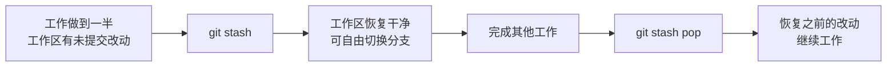
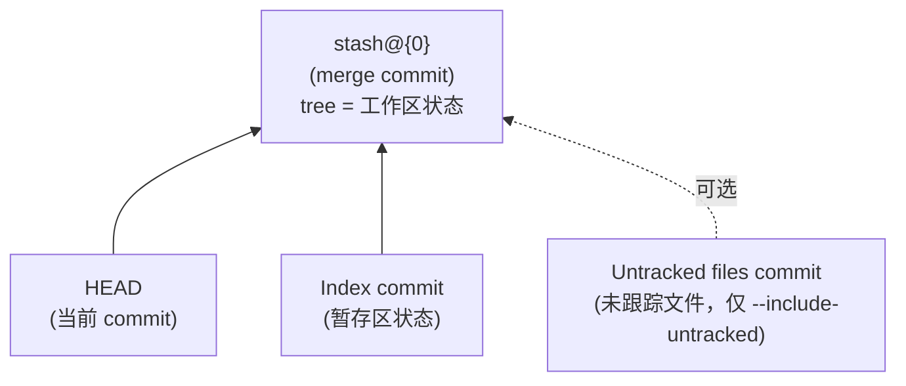
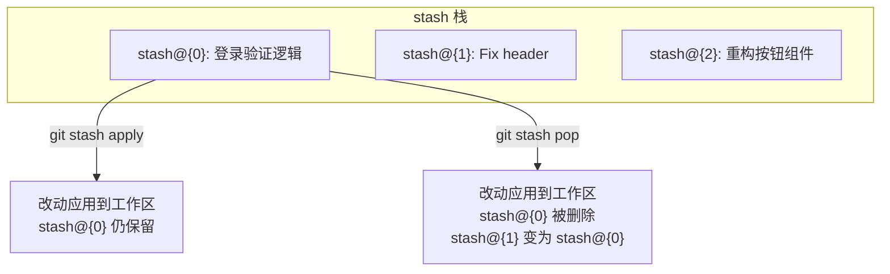
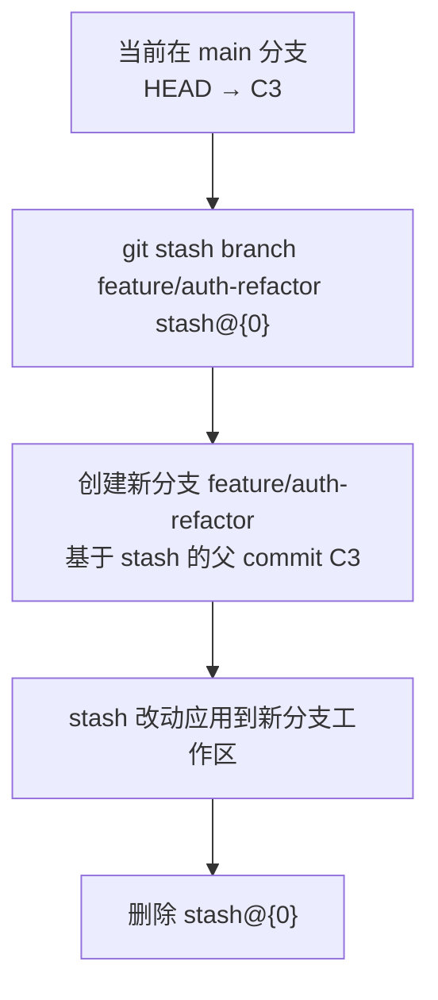
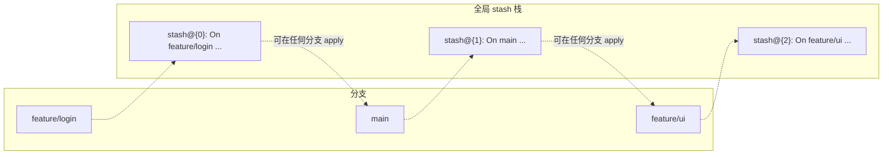
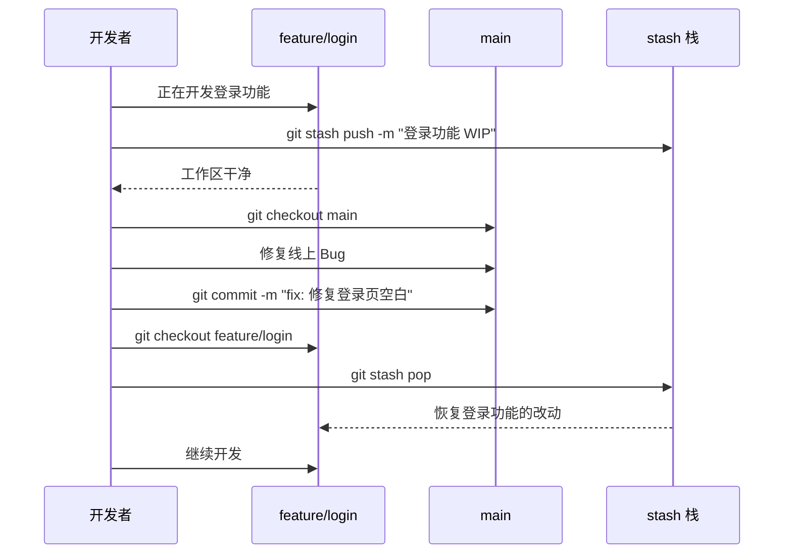

# git stash：暂存工作现场

## 为什么需要 stash？

想象这样一个场景：你正在 `feature/login` 分支上开发一个登录功能，代码写了一半，测试还没通过——此时产品经理紧急要求你修复 `main` 分支上的一个线上 Bug。你需要切换到 `main` 分支去工作，但当前工作区的改动还没完成，你不想创建一个"半成品"提交来污染提交历史。

这就是 `git stash` 的典型使用场景：**临时保存当前工作区和暂存区的改动，让工作目录恢复到干净状态，以便切换分支或执行其他操作，之后再把改动恢复回来。**



---

## git stash：基本用法

### 保存当前改动

```bash
git stash
```

这条命令会做两件事：

1. 将**工作区**（已跟踪文件的修改）和**暂存区**（已 `git add` 的改动）的改动全部保存到一个 stash 栈中
2. 将工作区恢复到当前 HEAD 的干净状态

注意：**默认情况下，`git stash` 不会保存未跟踪（untracked）的文件**，也不会保存被忽略（ignored）的文件。

来看一个具体例子：

```bash
# 当前在 feature/login 分支，有一些改动
$ git status
On branch feature/login
Changes to be committed:
  modified:   src/auth.py

Changes not staged for commit:
  modified:   README.md

Untracked files:
  notes.txt

# 执行 stash
$ git stash
Saved working directory and index state WIP on feature/login: a1b2c3d Add login form

# 工作区变干净了
$ git status
On branch feature/login
nothing to commit, working tree clean

# 未跟踪的 notes.txt 还在！
$ ls notes.txt
notes.txt
```

可以看到，`src/auth.py`（暂存区改动）和 `README.md`（工作区改动）被 stash 保存了，但未跟踪的 `notes.txt` 仍然留在工作区中。

---

## stash 的底层实现：一个特殊的 merge commit

理解 stash 的底层实现，能帮助你更深入地掌握它的工作方式。

`git stash` 并不是简单地把文件改动"搬"到某个临时存储区——它实际上创建了一个**特殊的 commit 对象**。这个 stash commit 本身的 **tree 保存了工作区的完整状态**，同时它是一个 merge commit，最多有三个父 commit：



- **第一父 commit（Parent 1）**：当前 HEAD 指向的 commit，即 stash 创建时的基底提交
- **第二父 commit（Parent 2）**：Index commit，保存了暂存区（index）的快照状态
- **可选的第三父 commit**：Untracked files commit，仅在使用 `--include-untracked` 时存在

你可以通过底层命令来验证这一点：

```bash
# 查看 stash 的 commit 信息
$ git cat-file -p stash@{0}
tree 8f2a3b...       # tree 即工作区状态的快照
parent a1b2c3d...    # Parent 1: HEAD commit
parent e4d5f6a...    # Parent 2: Index commit
author ...

# 查看完整的 parent 列表（默认只有两个）
$ git rev-parse stash@{0}^@
a1b2c3d...   # HEAD
e4d5f6a...   # Index
```

这种 merge commit 的设计非常巧妙：

- **恢复暂存区改动**时，只需要应用 Index commit（Parent 2）与 Parent 1 的差异
- **恢复工作区改动**时，直接读取 stash commit 自身的 tree（即工作区状态的快照）
- 如果使用了 `--keep-index`，可以只恢复部分改动

stash 条目存储在 `refs/stash` 引用中，并通过 reflog 机制管理历史记录（`stash@{0}`、`stash@{1}`、...）。

```bash
# stash 的 reflog
$ git reflog show stash
b7c8d9e stash@{0}: WIP on feature/login: a1b2c3d Add login form
8e9f0a1 stash@{1}: WIP on main: 5a6b7c8 Fix header
```

---

## git stash save "message"：带消息的 stash

默认的 stash 消息格式是 `WIP on <branch>: <hash> <commit message>`，信息量有限。当 stash 栈中积累了多条记录时，很难区分哪条对应哪个工作。

使用 `save` 可以附带自定义消息：

```bash
$ git stash save "实现登录验证逻辑，还差错误处理"
Saved working directory and index state On feature/login: 实现登录验证逻辑，还差错误处理
```

之后在 `git stash list` 中就能清楚地看到每条 stash 的含义：

```bash
$ git stash list
stash@{0}: On feature/login: 实现登录验证逻辑，还差错误处理
stash@{1}: WIP on main: 5a6b7c8 Fix header
stash@{2}: On feature/ui: 重构按钮组件
```

> **注意**：`git stash save` 已被标记为废弃（deprecated），官方推荐直接使用 `git stash push -m "message"`：
>
> ```bash
> git stash push -m "实现登录验证逻辑，还差错误处理"
> ```
>
> `push` 子命令更灵活，支持更多选项（如 `-p`、`--include-untracked` 等）。

---

## git stash list：查看 stash 栈

stash 采用**栈**（后进先出）的数据结构管理，最新的 stash 位于栈顶（`stash@{0}`）。

```bash
$ git stash list
stash@{0}: On feature/login: 实现登录验证逻辑，还差错误处理
stash@{1}: WIP on main: 5a6b7c8 Fix header
stash@{2}: On feature/ui: 重构按钮组件
```

查看某条 stash 的详细内容：

```bash
# 显示 stash 与其父 commit 的差异（默认显示工作区的改动）
$ git stash show stash@{0}
 src/auth.py | 12 ++++++------
 README.md   |  2 +-

# 显示详细差异（带 diff 内容）
$ git stash show -p stash@{0}

# 包含未跟踪文件的改动（如果有的话）
$ git stash show -u stash@{0}
```

也可以用 `git stash show` 查看 stash 的统计信息：

```bash
$ git stash show --stat stash@{0}
 src/auth.py | 4 ++--
 README.md   | 1 +
 2 files changed, 3 insertions(+), 2 deletions(-)
```

---

## git stash pop / git stash apply：恢复 stash

### git stash apply

`apply` 将 stash 中保存的改动重新应用到当前工作区，**但不会从 stash 栈中删除该条目**：

```bash
# 应用栈顶的 stash
$ git stash apply

# 应用指定的 stash
$ git stash apply stash@{2}
```


### git stash pop

`pop` = `apply` + `drop`，即应用改动后**自动从栈中删除该条目**：

```bash
$ git stash pop
```



### 选择哪个？

| 场景 | 推荐命令 | 原因 |
|------|---------|------|
| 确认 stash 只用一次 | `pop` | 一步到位，不留冗余 |
| 不确定改动是否完整 | `apply` | 保留备份，确认无误后再 `drop` |
| 需要在多个分支应用同一 stash | `apply` | apply 不删除，可反复使用 |
| stash 应用后可能冲突 | `apply` | 冲突时 pop 不会删除 stash，但 apply 更明确意图 |

### 处理冲突

当 stash 的改动与当前分支的代码冲突时：

```bash
$ git stash pop
CONFLICT (content): Merge conflict in src/auth.py
```

冲突发生后，stash **不会被删除**（即使使用 `pop`），需要你手动解决冲突后再删除：

```bash
# 解决冲突后
$ git add src/auth.py
$ git stash drop   # 手动删除已应用的 stash
```

---

## git stash drop / git stash clear：删除 stash

### git stash drop

删除 stash 栈中的指定条目：

```bash
# 删除栈顶
$ git stash drop

# 删除指定条目
$ git stash drop stash@{2}
Dropped stash@{2} (b7c8d9e...)
```

删除后，后面的条目索引会自动前移：`stash@{3}` 变为 `stash@{2}`，以此类推。

### git stash clear

清空整个 stash 栈，**删除所有 stash 条目**：

```bash
$ git stash clear
```

> **警告**：`clear` 是不可逆操作。一旦执行，所有 stash 都会丢失（除非你记住了 commit hash，可通过 `git fsck --dangling` 找回，但非常麻烦）。

---

## git stash -p：部分 stash（交互式选择）

有时你只想暂存部分改动，而不是全部。`git stash push -p`（或 `git stash -p`）会进入交互模式，逐个询问你是否要 stash 每个改动块（hunk）：

```bash
$ git stash push -p
diff --git a/src/auth.py b/src/auth.py
index 1a2b3c4..5d6e7f8 100644
--- a/src/auth.py
+++ b/src/auth.py
@@ -10,6 +10,8 @@ def authenticate(username, password):
     user = find_user(username)
+    if not user:
+        return None
     token = generate_token(user)
+    log_access(user)
     return token
Stash this hunk [y,n,q,a,d,/,s,e,?]?
```

### 交互式选项说明

| 选项 | 含义 |
|------|------|
| `y` | stash 这个 hunk |
| `n` | 不 stash 这个 hunk（保留在工作区） |
| `q` | 退出，不再 stash 剩余的 hunk |
| `a` | stash 这个文件及后续所有 hunk |
| `d` | 不 stash 这个文件及后续所有 hunk |
| `s` | 将当前 hunk 拆分为更小的 hunk |
| `e` | 手动编辑 hunk |
| `/` | 用正则搜索匹配的 hunk |
| `?` | 显示帮助 |

一个典型的使用场景——你同时修改了 Bug 修复和新功能代码，只想 stash 新功能部分：

```bash
# 只 stash 新功能相关的 hunk，Bug 修复的 hunk 输入 n 保留
$ git stash push -p -m "新功能 WIP"
```

> **注意**：被 stash 的 hunk 和保留在工作区的 hunk **不能属于同一个 hunk**——如果你需要更精细的控制，使用 `s`（split）拆分 hunk，或使用 `e`（edit）手动编辑。

---

## git stash branch \<name\>：从 stash 创建新分支

当 stash 中的改动与当前分支的代码产生冲突，或者你发现这些改动其实应该在一个新分支上完成时，`git stash branch` 可以一步到位：

```bash
$ git stash branch feature/auth-refactor stash@{0}
```

这条命令做了三件事：

1. 基于 stash 创建时的父 commit 创建新分支
2. 将 stash 的改动应用到新分支的工作区
3. 删除该 stash 条目



**为什么这个命令有用？** 因为 stash 的改动是基于创建时的 commit（即其 Parent 1）产生的。如果当前分支已经前进了很多，直接 `apply` 或 `pop` 可能产生大量冲突。而 `stash branch` 会在 stash 的原始 commit 上创建分支，确保改动能够干净地应用。

---

## stash 与 branch 的交互：stash 是全局的

这是一个容易被忽视但非常重要的点：**stash 不属于任何分支，它是仓库全局的。**



这意味着：

1. **在任何分支都可以看到所有 stash**：`git stash list` 的输出不随分支变化
2. **在任何分支都可以 apply 任何 stash**：你在 `feature/login` 上创建的 stash，可以在 `main` 上 apply
3. **stash 条目记录了创建时的分支名和 commit**：方便你识别来源，但不限制使用范围

实际应用示例：

```bash
# 在 feature/login 上 stash
$ git checkout feature/login
$ git stash push -m "登录功能 WIP"

# 切换到 main 修复 Bug
$ git checkout main
# ... 修复 Bug ...

# 也可以在 main 上查看并应用 feature/login 的 stash
$ git stash list
stash@{0}: On feature/login: 登录功能 WIP

# 但更好的做法是回到原分支恢复
$ git checkout feature/login
$ git stash pop
```

---

## git stash --include-untracked / --all


### --include-untracked（-u）

默认 `git stash` 不保存未跟踪的文件。使用 `--include-untracked`（简写 `-u`）可以将未跟踪文件也纳入 stash：

```bash
$ git status
On branch feature/login
Changes to be committed:
  modified:   src/auth.py

Changes not staged for commit:
  modified:   README.md

Untracked files:
  notes.txt
  draft.md

# 默认 stash：只保存已跟踪文件的改动
$ git stash
# notes.txt 和 draft.md 仍留在工作区

# --include-untracked：全部保存
$ git stash --include-untracked
# 工作区完全干净，notes.txt 和 draft.md 也被 stash 了
```

### --all（-a）

`--all` 比 `--include-untracked` 更进一步——它还会保存被 `.gitignore` 忽略的文件：

```bash
# 假设 build/ 和 node_modules/ 在 .gitignore 中
$ git stash --all
# build/ 和 node_modules/ 的内容也会被 stash
```

> **注意**：`--all` 会 stash 大量文件（包括 `node_modules`、`build` 输出等），通常这不是你想要的。大多数情况下 `--include-untracked` 就足够了。

### 三种模式对比

| 模式 | 已跟踪文件改动 | 未跟踪文件 | 被忽略文件 |
|------|--------------|-----------|-----------|
| `git stash`（默认） | 保存 | 不保存 | 不保存 |
| `git stash -u` / `--include-untracked` | 保存 | 保存 | 不保存 |
| `git stash -a` / `--all` | 保存 | 保存 | 保存 |

### --keep-index（-k）

另一个有用的选项是 `--keep-index`，它让 stash 后工作区保留暂存区的改动，只 stash 未暂存的改动：

```bash
# 暂存区有 2 个文件，工作区还有 1 个未暂存的修改
$ git add src/auth.py src/utils.py
# README.md 有修改但未 add

$ git stash --keep-index
# src/auth.py 和 src/utils.py 的改动仍在暂存区（保留）
# README.md 的修改被 stash 了
```

这在你想分阶段提交时很有用：先 stash 未暂存的改动，提交暂存区的内容，然后再恢复。

---

## stash 的注意事项

### 1. stash 不跨仓库

stash 是本地引用（`refs/stash`），**不会通过 `git push` 传输到远程仓库**。每个仓库有自己独立的 stash 栈。

```bash
# push 不会传输 stash
$ git push origin main
# stash 条目不会被推送

# clone 一个仓库后，stash 栈是空的
$ git clone <url>
$ git stash list
# （无输出）
```

这意味着：**不要用 stash 代替 commit 来做长期保存**。如果你需要在不同机器间同步改动，请创建 commit（可以是临时分支），而不是依赖 stash。

### 2. stash 栈不宜过大

stash 栈虽然可以存储很多条目，但没有有效的组织机制——只能通过索引 `stash@{n}` 和消息来识别。积累过多 stash 会导致管理困难，建议及时清理。

### 3. stash 后工作区可能不是完全干净

如果使用默认的 `git stash`，未跟踪文件和被忽略文件仍会留在工作区。如果需要完全干净的工作区，使用 `--include-untracked`。

### 4. stash apply 时注意当前分支

由于 stash 是全局的，你可能在错误的分支上 apply 了一个 stash。虽然 Git 不会阻止你，但这可能导致意料之外的冲突或代码混入。**apply 前务必确认当前分支。**

### 5. stash 的改动可能无法干净应用

如果 stash 创建后，其基准 commit 之后的代码发生了很大变化，apply 时可能产生冲突。这时可以考虑使用 `git stash branch` 在原始 commit 上创建分支。

### 6. 不要在 stash 上做 rebase

stash 是通过 reflog 管理的，`git rebase`、`git commit --amend` 等操作不会自动更新 stash 的引用。如果 stash 的父 commit 被 rebase 修改，stash 仍然指向旧的 commit，可能导致 apply 时找不到基准。

---

## 完整工作流示例

下面是一个使用 stash 的完整工作流：



对应的命令序列：

```bash
# 1. 在 feature/login 上工作到一半
$ git checkout feature/login
# ... 修改代码 ...

# 2. 紧急任务来了，暂存当前工作
$ git stash push -m "登录功能 WIP"

# 3. 切换到 main 修复 Bug
$ git checkout main
# ... 修复 Bug ...
$ git commit -m "fix: 修复登录页空白"

# 4. 回到 feature/login 继续
$ git checkout feature/login

# 5. 恢复之前的工作
$ git stash pop
# 继续开发...
```

---

## 小结

| 命令 | 作用 |
|------|------|
| `git stash` / `git stash push` | 保存工作区和暂存区的改动到 stash 栈 |
| `git stash push -m "msg"` | 带自定义消息的 stash |
| `git stash list` | 查看所有 stash 条目 |
| `git stash show [-p]` | 查看 stash 的改动内容 |
| `git stash pop` | 恢复栈顶 stash 并删除 |
| `git stash apply` | 恢复 stash 但不删除 |
| `git stash drop` | 删除指定 stash 条目 |
| `git stash clear` | 清空所有 stash |
| `git stash push -p` | 交互式部分 stash |
| `git stash branch <name>` | 从 stash 创建新分支 |
| `git stash -u` / `--include-untracked` | 包含未跟踪文件 |
| `git stash -a` / `--all` | 包含未跟踪和被忽略文件 |
| `git stash -k` / `--keep-index` | 保留暂存区改动，只 stash 未暂存部分 |

**核心要点**：

- stash 的本质是一个特殊的 merge commit，保存了工作区、暂存区相对于 HEAD 的差异
- stash 是全局的，不属于任何分支，可在任意分支上 apply
- stash 不随 push 传输，仅存在于本地仓库
- `pop` vs `apply` 的区别在于是否自动删除 stash 条目
- 对于可能产生冲突的场景，优先使用 `apply` 或 `stash branch`
- 不要用 stash 代替 commit 做长期保存，它只适合临时性的工作现场暂存

