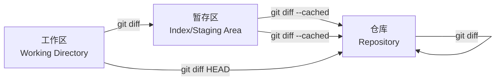
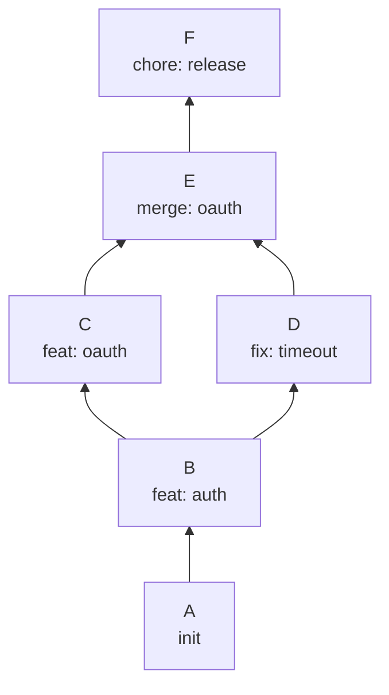
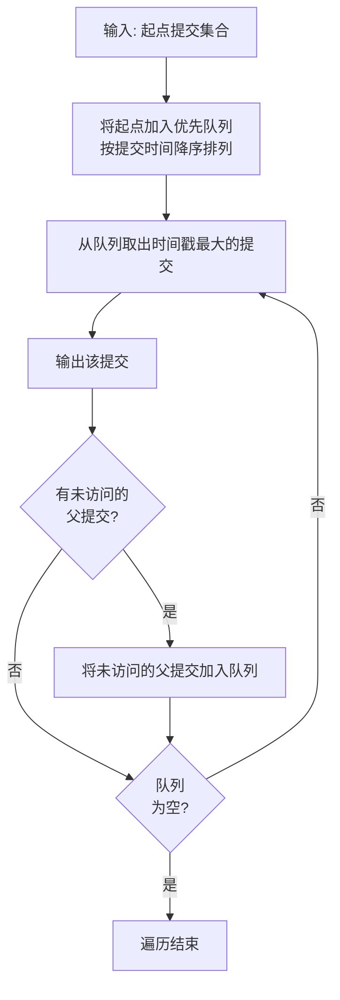
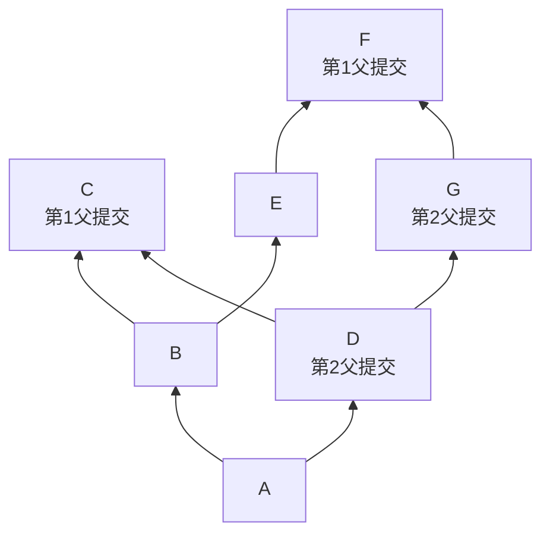
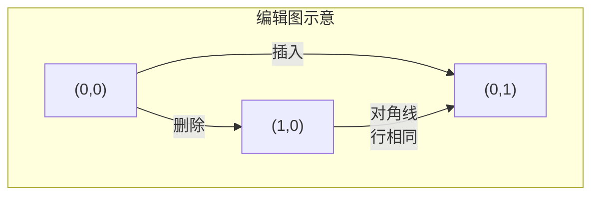
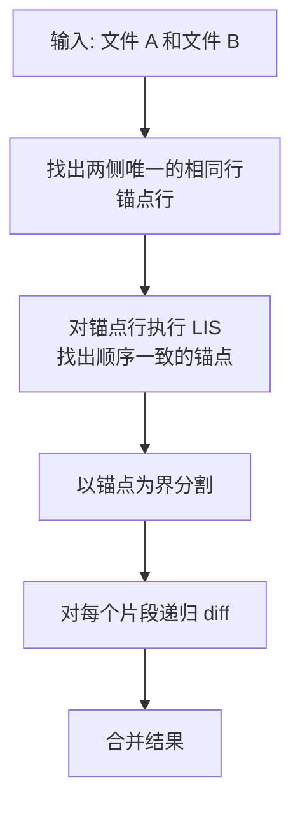
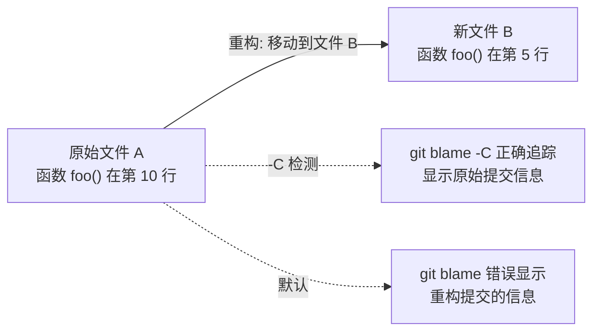
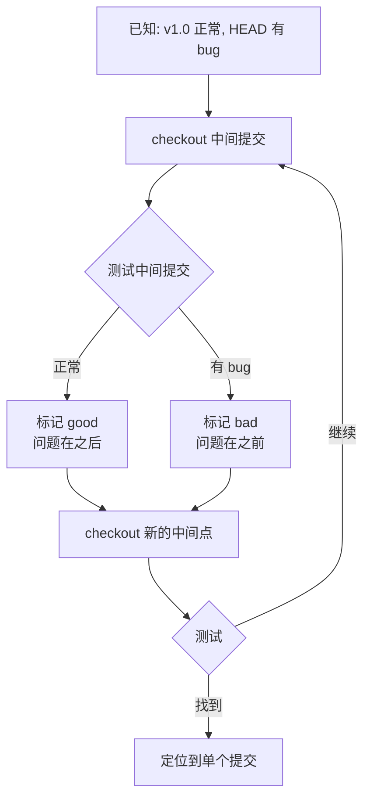

# 查看历史与差异

版本控制的核心价值之一，就是完整保留项目的演进轨迹，并让你随时回溯"谁在什么时候改了什么"。Git 提供了一组强大的历史查看与差异分析工具，从简单的提交列表到深层的算法级 diff，层层递进。本章将系统讲解这些命令的使用方式与底层原理。

---

## 1 git log：提交历史的窗口

### 1.1 基本用法

```bash
# 查看当前分支的完整提交历史
git log

# 限制显示条数
git log -5          # 最近 5 条
git log -1          # 最近 1 条（等同于 HEAD 所指提交）
```

默认输出格式包含完整的 commit hash、作者、日期和提交消息，信息量大但不利于快速浏览。

### 1.2 格式化选项

#### --oneline：单行摘要

```bash
git log --oneline
# e3a1b2f fix: 修复登录超时问题
# 7c9d4e1 feat: 添加 OAuth2 支持
# a1b2c3d chore: 升级依赖版本
```

每个提交压缩为一行，显示缩写 hash 和首行消息，适合快速纵览。

#### --graph：分支拓扑可视化

```bash
git log --oneline --graph --all
```

输出示例：

```
* e3a1b2f (HEAD -> main) fix: 修复登录超时问题
* 7c9d4e1 feat: 添加 OAuth2 支持
|\
| * a1b2c3d (feature/oauth) chore: 升级依赖版本
| * f4e5d6c feat: OAuth2 初版
|/
* b7c8d9e init: 项目初始化
```

`--graph` 用 ASCII 字符绘制 commit DAG 的拓扑结构，配合 `--all` 可查看所有分支。这是理解分支合并关系的最直观方式。

#### --format：自定义输出模板

`--format`（或 `--pretty=format:`）允许你精确控制输出字段：

```bash
git log --format="%h - %an, %ar : %s"
# e3a1b2f - 张三, 2 hours ago : fix: 修复登录超时问题
# 7c9d4e1 - 李四, 3 days ago : feat: 添加 OAuth2 支持
```

常用占位符：

| 占位符 | 含义 | 示例输出 |
|--------|------|----------|
| `%H` | 完整 commit hash | `e3a1b2f4c5d6...` |
| `%h` | 缩写 commit hash | `e3a1b2f` |
| `%T` | 完整 tree hash | — |
| `%t` | 缩写 tree hash | — |
| `%an` | 作者名字 | `张三` |
| `%ae` | 作者邮箱 | `zhangsan@example.com` |
| `%cn` | 提交者名字 | `张三` |
| `%ce` | 提交者邮箱 | — |
| `%ad` | 作者日期（可配合 `--date=`） | `2025-01-15` |
| `%cd` | 提交者日期 | — |
| `%ar` | 作者日期（相对格式） | `2 hours ago` |
| `%s` | 提交消息首行 | `fix: 修复登录超时问题` |
| `%b` | 提交消息正文 | — |
| `%d` | 引用装饰（分支/标签） | `(HEAD -> main)` |
| `%p` | 父提交缩写 hash | — |

> **作者（Author）vs 提交者（Committer）**：作者是实际编写代码的人，提交者是执行 `git commit` 的人。大多数情况下两者相同，但在 `rebase`、`cherry-pick`、`amend` 等操作后，提交者会变化而作者保持不变。

#### --decorate：引用装饰

```bash
# 自动显示分支名、标签名等引用
git log --decorate

# 禁用装饰（纯净输出）
git log --decorate=no

# 简短格式
git log --decorate=short   # 默认值，省略 refs/heads/ 等前缀

# 完整格式
git log --decorate=full    # 显示 refs/heads/main 等完整引用名
```

`--decorate` 控制是否在提交旁显示指向它的引用（分支、标签、HEAD）。从 Git 2.13 起，`--decorate` 默认启用，但了解其选项有助于定制输出。

#### 黄金组合

```bash
# 业界最常用的 log 命令组合
git log --oneline --graph --decorate --all
```

建议为它设置别名：

```bash
git config --global alias.lg "log --oneline --graph --decorate --all"
# 之后只需 git lg
```

### 1.3 过滤与搜索

#### 按时间过滤

```bash
# 指定日期之后
git log --since="2025-01-01"
git log --after="2 weeks ago"

# 指定日期之前
git log --until="2025-06-30"
git log --before="yesterday"

# 组合使用
git log --since="2025-01-01" --until="2025-06-30"
```

#### 按作者过滤

```bash
# 精确匹配
git log --author="张三"

# 正则匹配（匹配作者名或邮箱）
git log --author="@example\.com$"
git log --author="张\|李"
```

#### 按提交消息过滤

```bash
# 搜索消息中包含指定字符串的提交
git log --grep="修复"

# 取反：搜索不包含指定字符串的提交
git log --grep="修复" --invert-grep

# 正则匹配
git log --grep="feat\|fix"
```

#### 按文件路径过滤

```bash
# 只查看涉及特定文件的提交
git log -- src/auth/login.ts

# 查看涉及 src/auth 目录下所有文件的提交
git log -- src/auth/

# 组合：查看特定作者修改特定文件的提交
git log --author="张三" -- src/auth/
```

> **注意**：`--` 分隔符用于区分提交范围和文件路径，防止歧义。当路径名与分支名冲突时尤其重要。

#### 按内容变更搜索：-S 与 -G

这是极为强大但常被忽视的功能，用于搜索"某次提交增加或删除了特定字符串/模式"。

```bash
# -S：拾荒者搜索（pickaxe search）
# 查找"添加或删除了指定字符串"的提交
git log -S "OAuth2"

# -S 配合 --pickaxe-all 显示所有相关文件（默认只显示匹配文件）
git log -S "OAuth2" --pickaxe-all

# -G：正则搜索
# 查找"差异中匹配正则模式"的提交
git log -G "function\s+handle\w+"
```

**-S 与 -G 的关键区别**：

| 维度 | `-S <string>` | `-G <regex>` |
|------|--------------|--------------|
| 匹配方式 | 精确字符串 | 正则表达式 |
| 触发条件 | 字符串的出现次数**发生变化**（增→减或减→增） | diff 中**存在**匹配的行 |
| 典型场景 | 查找某个函数名/常量何时被引入或删除 | 查找符合某种模式的变更 |
| 性能 | 较快（字符串匹配） | 较慢（正则匹配） |

```bash
# 示例：查找某个配置项何时被引入
git log -S "MAX_RETRIES" --oneline

# 示例：查找所有涉及 error handler 变更的提交
git log -G "catch\s*\(" --oneline
```


### 1.4 范围与遍历

```bash
# 查看某个分支的提交
git log main

# 查看分支分叉点之后的提交（main 有而 feature 没有的）
git log main..feature

# 查看两个分支的对称差异
git log main...feature

# 只显示合并提交
git log --merges

# 排除合并提交
git log --no-merges

# 查看某个标签以来的提交
git log v1.0.0..
```

**范围语法总结**：

| 语法 | 含义 |
|------|------|
| `A..B` | 在 B 中但不在 A 中的提交 |
| `A...B` | 在 A 或 B 中但不同时在两者中的提交（对称差异） |
| `A^..B` | 从 A 的父提交到 B |
| `B^@` | B 的所有父提交（合并提交有多个父提交） |

---

## 2 git diff：差异分析的核心工具

`git diff` 是理解"代码到底改了什么"的终极工具。它的三种主要用法对应 Git 三个区域之间的比较。

### 2.1 三种核心用法



#### 用法一：工作区 vs 暂存区

```bash
# 查看工作区中尚未暂存的变更
git diff

# 查看特定文件的未暂存变更
git diff -- src/auth/login.ts

# 查看统计信息而非完整 diff
git diff --stat

# 只显示变更的文件名
git diff --name-only
```

这是最常见的用法——查看你编辑了但还没有 `git add` 的内容。

#### 用法二：暂存区 vs 仓库

```bash
# 查看已暂存但尚未提交的变更
git diff --cached
# 或
git diff --staged

# 比较暂存区与特定提交
git diff --cached HEAD~1

# 查看特定文件的暂存变更
git diff --cached -- src/auth/login.ts
```

`--cached` 和 `--staged` 是同义词。这个用法帮你确认 `git commit` 将会记录哪些变更。

#### 用法三：任意两个提交之间

```bash
# 比较两个提交
git diff abc1234 def5678

# 比较两个分支
git diff main feature/oauth

# 比较分支分叉点
git diff main...feature/oauth   # feature 相对于分叉点的变更

# 比较某个提交与其父提交
git diff HEAD~1 HEAD            # 最近一次提交引入的变更
```

> **`git diff A...B` 的含义**：找到 A 和 B 的最近公共祖先（merge base），然后比较该祖先与 B 之间的差异。这比 `git diff A B` 更能反映"在 B 分支上做了什么"。

### 2.2 输出格式详解

一个典型的 diff 输出：

```diff
diff --git a/src/auth/login.ts b/src/auth/login.ts
index a1b2c3d..e4f5a6b 100644
--- a/src/auth/login.ts
+++ b/src/auth/login.ts
@@ -15,7 +15,8 @@ export class LoginService {
   private maxRetries = 3;
   private timeout = 5000;

-  async login(username: string, password: string) {
+  async login(username: string, password: string, options?: LoginOptions) {
+    const opts = { timeout: this.timeout, ...options };
     const token = await this.authenticate(username, password);
     return this.validateToken(token);
   }
```

逐行解析：

| 行 | 含义 |
|-----|------|
| `diff --git a/... b/...` | diff 头部，a 为旧版本，b 为新版本 |
| `index a1b2c3d..e4f5a6b 100644` | 对象 hash 和文件模式（100644 = 普通文件） |
| `--- a/src/auth/login.ts` | 旧版本路径 |
| `+++ b/src/auth/login.ts` | 新版本路径 |
| `@@ -15,7 +15,8 @@` | 变更位置：旧文件第 15 行起 7 行，新文件第 15 行起 8 行 |
| `-` 前缀行 | 删除的行 |
| `+` 前缀行 | 新增的行 |
| 无前缀行 | 上下文行（未变更） |

### 2.3 有用的 diff 选项

```bash
# 忽略空白变更
git diff -w                # 忽略所有空白差异
git diff --ignore-blank-lines  # 忽略空行的增删

# 函数级别上下文
git diff -W                # 显示整个函数的上下文

# 统计摘要
git diff --stat            # 每个文件的增删行数统计
git diff --numstat         # 机器可读的增删行数
git diff --shortstat       # 只显示总计数

# 重命名检测
git diff -M                # 检测重命名（默认开启，可调阈值）
git diff -M50%             # 相似度 >= 50% 即视为重命名

# 拷贝检测
git diff -C                # 同时检测重命名和拷贝

# 词级别 diff（更细粒度）
git diff --word-diff       # 词级别高亮
git diff --word-diff=color # 彩色词级别 diff
git diff --color-words     # 同上，简写形式

# 前缀定制（适用于对比不同目录结构）
git diff --src-prefix=a/ --dst-prefix=b/

# 使用 patience 算法
git diff --patience        # 使用 patience 算法（见后文）
```

### 2.4 diff 算法选择

Git 支持多种 diff 算法，通过 `--diff-algorithm` 选项或配置选择：

```bash
# 命令行指定
git diff --diff-algorithm=histogram

# 全局配置
git config --global diff.algorithm histogram
```

可选值：`myers`（默认）、`minimal`、`patience`、`histogram`。

---

## 3 git show：查看单次提交详情

`git show` 用于查看某次提交（或其他对象）的完整信息。

### 3.1 基本用法

```bash
# 查看 HEAD 提交的详情
git show

# 查看指定提交
git show abc1234

# 查看缩写（同上，Git 会自动匹配）
git show abc1

# 查看某个标签指向的提交
git show v1.0.0
```

输出包含提交元数据（作者、日期、消息）和完整的 diff 内容。

### 3.2 格式化输出

```bash
# 只看统计信息，不显示完整 diff
git show --stat abc1234

# 只看提交消息，不显示 diff
git show --no-patch abc1234
# 或
git show -s abc1234

# 自定义格式
git show --format="%H %an %s" -s abc1234
```


### 3.3 查看特定文件在某次提交中的变更

```bash
# 只看某次提交中特定文件的 diff
git show abc1234 -- src/auth/login.ts
```

### 3.4 查看其他对象

```bash
# 查看标签对象（含打标签者信息和消息）
git show v1.0.0

# 查看树对象
git show HEAD^{tree}

# 查看某个 blob 的内容
git show HEAD:src/auth/login.ts
```

`git show` 的 `<object>:<path>` 语法非常实用，它可以在不切换分支的情况下查看任意提交中的文件内容：

```bash
# 查看 main 分支上的配置文件
git show main:package.json

# 查看上一次提交时的某个文件
git show HEAD~1:src/auth/login.ts

# 查看某个标签对应版本的文件
git show v2.0.0:CHANGELOG.md
```

---

## 4 git shortlog：按作者汇总提交

`git shortlog` 对提交历史按作者分组统计，是生成发布报告或团队贡献概览的利器。

### 4.1 基本用法

```bash
# 按作者汇总提交数
git shortlog

# 指定版本范围
git shortlog v1.0.0..v2.0.0
git shortlog v1.0.0..HEAD
```

输出示例：

```
张三 (15):
      fix: 修复登录超时问题
      feat: 添加 OAuth2 支持
      ...

李四 (8):
      refactor: 重构认证模块
      docs: 更新 API 文档
      ...
```

### 4.2 格式化选项

```bash
# 按提交数排序（从多到少）
git shortlog -n

# 只显示提交计数，不显示消息
git shortlog -s

# 同时排序和计数
git shortlog -sn

# 按邮箱而非名字分组
git shortlog -se

# 总结格式（计数 + 名字，一行一个作者）
git shortlog -sn --no-merges v1.0.0..v2.0.0
```

输出示例：

```
  15  张三
   8  李四
   3  王五
```

### 4.3 邮箱映射

当同一作者使用了不同名字或邮箱时，可通过 `.mailmap` 文件合并：

```bash
# .mailmap 文件内容
张三 <zhangsan@company.com> <zhangsan@gmail.com>
张三 <zhangsan@company.com> <zs@old-company.com>
```

之后 `git shortlog -sn` 会自动合并这些身份。

---

## 5 log 的图论遍历原理

### 5.1 Commit DAG

Git 的提交历史本质上是一个有向无环图（Directed Acyclic Graph，DAG）。每个提交节点包含零个或多个父提交指针：



- **普通提交**：1 个父提交
- **合并提交**：2 个或更多父提交
- **根提交**：0 个父提交（初始提交）

### 5.2 遍历策略

`git log` 的核心任务是从给定的起点（HEAD、分支名等）出发，沿父提交指针回溯，遍历 DAG 中的所有可达提交。Git 采用了高效的遍历策略：

#### 基本算法：优先队列遍历

Git 并不使用简单的 DFS 或 BFS，而是基于**优先队列**的遍历，优先级由提交的**时间戳**决定：



这种按时间排序的遍历保证了输出按时间降序排列——最近的提交最先出现。

#### 剪枝与限制

实际实现中，`git log` 还支持多种剪枝策略以提升性能：

- **`--ancestry-path`**：只保留从起点到终点的祖先路径上的提交
- **`--first-parent`**：只沿第一父提交链回溯（忽略被合并分支的历史）
- **`--skip`**：跳过前 N 个提交
- **日期截断**：遇到超出时间范围的提交时提前终止

```bash
# 只看主线历史（忽略被合并的分支）
git log --first-parent

# 只保留 A 到 B 路径上的提交
git log A..B --ancestry-path
```

#### --first-parent 的语义



在合并提交 C 中，第一父提交（B）是 `git merge` 时所在的分支，第二父提交（D）是被合并进来的分支。`--first-parent` 只沿 B 方向回溯，适合查看项目的"主线"演进。

### 5.3 性能考量

Git 的提交历史遍历是惰性的——只在需要时才解压提交对象。此外，Git 使用 commit graph 文件（`.git/objects/info/commit-graph`）缓存提交的拓扑信息，避免每次都要解析完整的提交对象：

```bash
# 生成 commit-graph 加速遍历
git commit-graph write --reachable

# 验证 commit-graph
git commit-graph verify
```

对于包含数十万提交的大型仓库，commit-graph 可以将 `git log` 的性能提升数倍。

---

## 6 diff 算法简述：Myers 与 Histogram

### 6.1 问题本质

diff 的核心问题是：给定两个文件 A 和 B，找到一个最短的编辑脚本（Shortest Edit Script，SES），将 A 变换为 B。编辑操作只有两种——插入和删除。

这是一个经典的动态规划问题，但朴素 DP 的时间复杂度为 O(mn)（m、n 分别为两个文件的行数），对于大文件不可接受。


### 6.2 Myers 算法

Myers 算法由 Eugene W. Myers 在 1986 年提出，是 Git 的默认 diff 算法。其核心思想是：

**在编辑图的"对角线"上贪心前进，尽量复用相同的行。**



算法在编辑图上逐轮扩展：

1. 每轮允许的编辑操作数 d 递增（d=0, 1, 2, ...）
2. 对于每个 d，沿对角线尽可能远地前进（遇到相同行就走对角线，不消耗编辑预算）
3. 当到达右下角时，当前 d 就是最短编辑距离

**时间复杂度**：O((m+n)D)，其中 D 是最短编辑距离。当两个文件差异较小时，性能极佳。

**Myers 算法的特点**：

- 输出是确定性的——同样的输入总是产生同样的 diff
- 倾向于将"删除"排在"插入"前面，即先删后增
- 当大段代码被移动时，可能产生不直观的 diff（大量删除 + 大量新增，而非移动）

### 6.3 Patience 算法

Patience 算法的灵感来自纸牌游戏 Patience（接龙）。它专门解决 Myers 算法在代码移动场景下的问题：

**核心步骤**：

1. 找出两个文件中**唯一**的相同行（即两侧各只出现一次的行），称为锚点行
2. 对锚点行执行最长递增子序列（LIS）算法，找出保持顺序一致的最大锚点集合
3. 以这些锚点为界，递归对每个片段做 diff



**优势**：当代码块被整体移动时，Patience 能正确识别为移动，而非"删除旧位置 + 新增新位置"。

### 6.4 Histogram 算法

Histogram 算法是 Patience 的增强版，也是 Git 目前推荐的 diff 算法：

- 在 Patience 的基础上，放宽了"唯一行"的限制
- 即使某行出现多次，只要频率较低，仍然可以作为锚点
- 使用直方图（histogram）统计行的出现频率来选择锚点

**三者对比**：

| 维度 | Myers | Patience | Histogram |
|------|-------|----------|-----------|
| 默认算法 | 是 | 否 | 否（但推荐） |
| 时间复杂度 | O((m+n)D) | 较高 | 较高 |
| 代码移动识别 | 差 | 好 | 最好 |
| 确定性 | 是 | 是 | 是 |
| 通用场景 | 好 | 代码场景优 | 代码场景最优 |
| 大文件性能 | 优 | 中 | 中 |

**实践建议**：

```bash
# 日常开发推荐使用 histogram
git config --global diff.algorithm histogram

# 临时使用其他算法
git diff --diff-algorithm=myers
git diff --diff-algorithm=patience
```

对于代码 review 场景，Histogram 算法能产生最符合人类直觉的 diff 输出。

---

## 7 git blame：逐行追踪代码归属

`git blame`（曾用名 `git annotate`）显示文件中每一行最后一次被修改的提交信息，是代码考古学的核心工具。

### 7.1 基本用法

```bash
# 查看文件每一行的归属
git blame src/auth/login.ts
```

输出格式：

```
^a1b2c3d (张三 2025-01-10 10:30:15 +0800  1) import { Injectable } from '@angular/core';
e4f5a6b7 (李四 2025-02-20 14:22:33 +0800  2) import { HttpClient } from '@angular/common/http';
e4f5a6b7 (李四 2025-02-20 14:22:33 +0800  3)
^a1b2c3d (张三 2025-01-10 10:30:15 +0800  4) @Injectable({ providedIn: 'root' })
a1b2c3d (张三 2025-03-05 09:15:42 +0800  5) export class LoginService {
```

各列含义：commit hash（`^` 前缀表示文件初始提交）、作者、时间、行号、行内容。

### 7.2 常用选项

```bash
# 只看指定行范围
git blame -L 10,30 src/auth/login.ts
git blame -L 10,+5 src/auth/login.ts    # 第 10 行起 5 行
git blame -L "/class LoginService/",+20 src/auth/login.ts  # 正则匹配起止

# 显示邮箱而非名字
git blame -e src/auth/login.ts

# 忽略空白变更
git blame -w src/auth/login.ts

# 忽略移动/拷贝的行
git blame -M src/auth/login.ts           # 检测同一文件内的移动
git blame -C src/auth/login.ts           # 检测从其他文件拷贝的行
git blame -CC src/auth/login.ts          # 更激进的拷贝检测
git blame -CCC src/auth/login.ts         # 最激进的拷贝检测
```

### 7.3 增量 blame 与代码移动追踪

`-M` 和 `-C` 选项对于理解代码演进至关重要：



不使用 `-C` 时，blame 会将移动的代码归因于执行移动的那次提交，而非最初编写代码的提交。加上 `-C` 后，Git 会追踪代码的来源文件，给出更准确的归属信息。

### 7.4 blame 的局限性与替代方案

- **格式化变更**：如果只调整了缩进或空行，blame 会归因于格式化提交而非逻辑变更提交。`-w` 选项可部分解决。
- **大范围重构**：重命名、拆分文件后，即使加 `-C` 也可能追踪不到。
- **合并提交**：blame 只追踪主线，可能遗漏合并进来的变更。

对于复杂的代码考古，建议结合 `git log -S` / `git log -G` 使用，先定位关键提交，再用 `git show` 查看完整 diff。

---

## 8 实用技巧


### 8.1 搜索历史中的关键变更

#### 用 -S 查找字符串的出现/消失

```bash
# 找出 MAX_RETRIES 常量何时被引入
git log -S "MAX_RETRIES" --oneline --all

# 找出某函数何时被删除
git log -S "handleLegacyAuth" --oneline --diff-filter=D

# 只搜索特定文件
git log -S "MAX_RETRIES" -- src/config.ts
```

#### 用 -G 搜索正则模式

```bash
# 找出所有修改了 async 函数签名的提交
git log -G "async\s+\w+\(" --oneline

# 找出所有涉及 TODO 注释变更的提交
git log -G "TODO|FIXME" --oneline
```

#### 用 --diff-filter 按变更类型筛选

```bash
# 只看新增文件的提交
git log --diff-filter=A

# 只看删除文件的提交
git log --diff-filter=D

# 只看重命名的提交
git log --diff-filter=R

# 组合：只看新增和修改
git log --diff-filter=AM

# 过滤器含义：
# A = Added, C = Copied, D = Deleted, M = Modified
# R = Renamed, T = Type changed, U = Unmerged
# X = Unknown, B = Broken (pair split)
```

### 8.2 git log 的高级格式

```bash
# 输出 JSON 格式（便于脚本处理）
git log --format='{"hash":"%H","author":"%an","date":"%aI","subject":"%s"}'

# 输出 CSV 格式
git log --format="%H,%an,%aI,%s"

# 每个提交的完整信息，包含 diff
git log -p

# 每个提交的文件级统计
git log --stat

# 定制统计宽度
git log --stat=120
```

### 8.3 使用 git rev-list 进行底层查询

`git rev-list` 是 `git log` 的底层命令，只输出 commit hash，适合脚本使用：

```bash
# 列出所有可达提交
git rev-list HEAD

# 计算提交数
git rev-list --count HEAD

# 查找两个分支的分叉点
git rev-list --ancestry-path $(git merge-base main feature)..feature

# 列出某个文件的所有变更提交
git rev-list HEAD -- src/auth/login.ts
```

### 8.4 二分查找定位问题提交（bisect 概述）

当项目出现回归 bug 时，`git bisect` 通过二分查找快速定位引入问题的提交。基本原理：



```bash
# 启动二分查找
git bisect start

# 标记当前版本有 bug
git bisect bad

# 标记已知正常的版本
git bisect good v1.0.0

# Git 自动 checkout 到中间点，测试后标记
git bisect good   # 或 git bisect bad

# 自动化：让 Git 自动运行测试脚本
git bisect run npm test

# 完成后重置
git bisect reset
```

> **bisect 的完整实践指南**（包括自动化脚本、复杂场景处理）见下一篇《二分查找与调试》。

### 8.5 查看引用日志（reflog）

虽然 reflog 不严格属于"查看历史"的范畴，但它是恢复误操作的关键工具：

```bash
# 查看 HEAD 的移动历史
git reflog

# 查看特定分支的 reflog
git reflog show main

# 查看所有引用的 reflog
git reflog --all
```

reflog 记录了 HEAD 和分支指针的每一次移动（包括 rebase、reset、checkout 等），即使提交已经不可达，也可以通过 reflog 找回。

---

## 9 小结

| 命令 | 核心用途 | 关键选项 |
|------|----------|----------|
| `git log` | 查看提交历史 | `--oneline --graph --decorate --all`、`--format`、`-S`/`-G`、`--first-parent` |
| `git diff` | 查看差异 | `--cached`、`--stat`、`-M`/`-C`、`--diff-algorithm` |
| `git show` | 查看单次提交详情 | `--stat`、`-s`、`<rev>:<path>` |
| `git shortlog` | 按作者汇总 | `-sn`、`-e` |
| `git blame` | 逐行代码归属 | `-L`、`-C`、`-M`、`-w` |
| `git bisect` | 二分查找定位 | `start`/`good`/`bad`/`run` |
| `git reflog` | 引用移动历史 | `--all` |

**核心要点回顾**：

1. `git log` 的本质是对 commit DAG 的遍历，理解 DAG 结构是高效使用 log 的前提
2. `git diff` 的三种用法对应三个比较维度：工作区/暂存区/仓库，掌握这一模型就不会混淆
3. diff 算法从 Myers 到 Histogram 的演进，核心驱动力是让 diff 输出更符合人类对"代码移动"的直觉
4. `-S`（pickaxe search）是代码考古的杀手级功能，远比 `--grep` 强大
5. `git blame -C` 能追踪代码的跨文件来源，是理解代码演进的重要工具
6. 对于大型仓库，`commit-graph` 缓存可以显著加速 log 遍历

这些命令看似简单，但组合使用后可以回答几乎所有"项目历史"相关的问题：谁改了这行代码、什么时候引入的这个 bug、这个函数经历了哪些变更、两个版本之间有什么差异——掌握它们，你就拥有了在 Git 历史中自由穿梭的能力。

