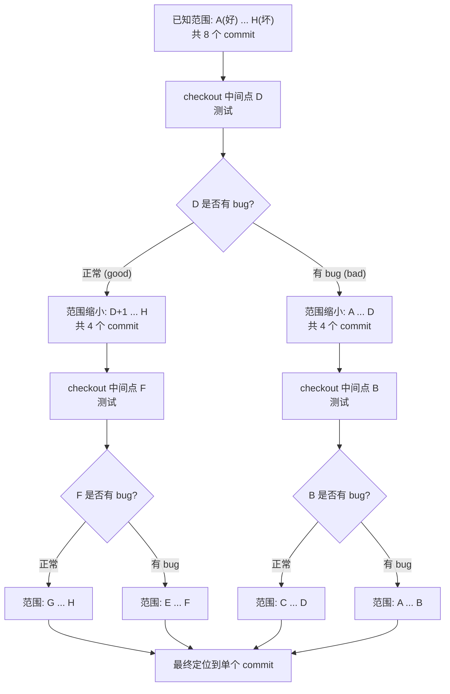
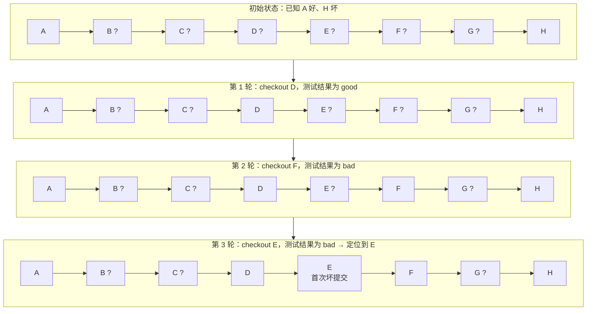
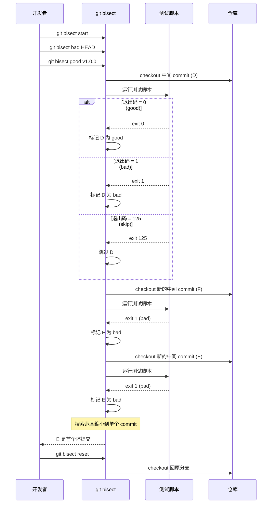
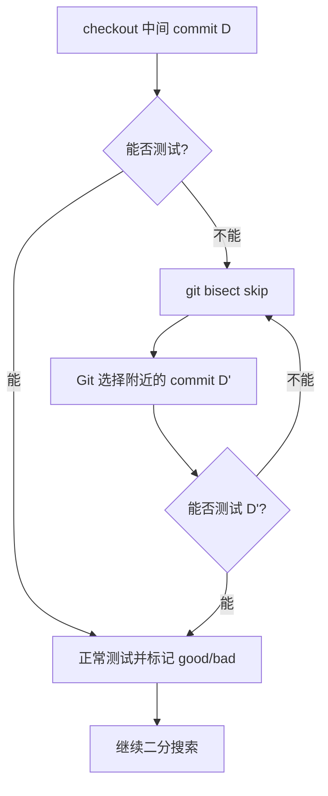
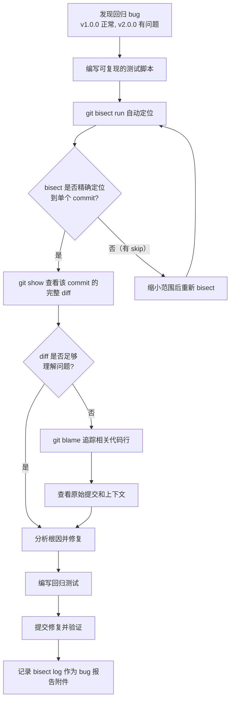
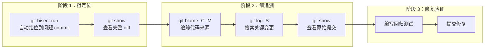

# 二分查找与调试

在大型项目中，bug 的引入往往悄无声息——某次看似无害的重构、某个不起眼的依赖升级，都可能在数周甚至数月后才被发现。当你面对一个回归 bug，只知道"以前是好的，现在坏了"，却不知道是哪次提交引入的问题时，逐个 commit 翻阅历史无异于大海捞针。Git 提供了两个强大的调试工具来应对这类场景：`git bisect` 通过二分查找精确定位问题提交，`git blame` 逐行追踪代码变更的来源。二者配合使用，构成了企业级代码调试的核心工作流。

---

## 1 git bisect：二分查找定位引入 bug 的 commit

### 1.1 原理

`git bisect` 的核心思想极其朴素：**在"好的 commit"和"坏的 commit"之间做二分搜索**。

假设你发现当前版本（commit H）存在 bug，而你记得两周前的版本（commit A）是正常的。那么引入 bug 的 commit 一定在 A 和 H 之间。如果这段区间内有 128 个 commit，逐个检查需要 128 次测试；而二分查找只需要 log2(128) = 7 次测试——效率提升近 20 倍。

Git 的做法是：每次自动 checkout 到当前搜索范围的中间 commit，让你测试该版本是否存在 bug。如果正常，说明问题在"后半段"；如果有 bug，说明问题在"前半段"。如此反复，搜索范围每次缩小一半，最终精确定位到引入问题的那一个 commit。



### 1.2 手动模式

手动模式是最基本的 bisect 使用方式，每一步都需要你手动测试并标记。

#### 完整流程

```bash
# 第 1 步：启动 bisect
git bisect start

# 第 2 步：标记当前版本为"坏"（有 bug）
git bisect bad                    # 当前 HEAD 有 bug

# 第 3 步：标记已知正常的版本为"好"
git bisect good v1.0.0            # v1.0.0 标签对应的版本正常
# 或使用 commit hash
git bisect good abc1234

# 此时 Git 自动 checkout 到中间 commit，并提示：
# "Bisecting: 3 revisions left to test after this (roughly 2 steps)"
```

之后进入循环：Git 每次自动 checkout 到中间 commit，你测试后标记结果。

```bash
# 测试当前 checkout 的版本...

# 如果正常：
git bisect good

# 如果有 bug：
git bisect bad

# Git 再次 checkout 到新的中间点，重复上述步骤
```

当搜索范围缩小到单个 commit 时，Git 输出定位结果：

```
abc1234 is the first bad commit
commit abc1234def5678901234567890abcdef12345678
Author: 张三 <zhangsan@example.com>
Date:   Fri Jan 15 14:30:00 2025 +0800

    refactor: 重构认证模块

:040000 040000 abc123 def456 M  src
```

最后，**务必重置**以回到原来的分支：

```bash
git bisect reset
```

> **重要**：`git bisect reset` 不仅将 HEAD 切回 bisect 之前的分支，还会清理 bisect 的内部状态。如果忘记 reset，后续的 Git 操作可能行为异常。

#### 二分搜索的逐步缩小过程

以下用一个 8 个 commit 的线性历史，完整展示 bisect 的搜索过程：



8 个 commit 只需 3 轮测试即可定位。推广到 N 个 commit，最多需要 log2(N) 轮——1000 个 commit 只需约 10 轮，100 万个 commit 也只需约 20 轮。


### 1.3 自动化模式：git bisect run

手动模式需要人工反复测试和标记，当测试过程可以脚本化时，`git bisect run` 可以全自动完成整个二分查找过程。

#### 语法

```bash
git bisect start
git bisect bad HEAD
git bisect good v1.0.0
git bisect run <test-script>
```

`<test-script>` 是一个可执行脚本（或命令），Git 会在每个中间 commit 上自动 checkout 并运行该脚本。脚本的退出码决定标记结果：

| 退出码 | 含义 | 等效命令 |
|--------|------|----------|
| `0` | 该版本正常 | `git bisect good` |
| `1` - `124` | 该版本有 bug | `git bisect bad` |
| `125` | 无法测试（跳过） | `git bisect skip` |
| `126` - `127` | 脚本不可执行 | bisect 中止 |

#### 自动化序列图



#### 实战示例

**示例 1：用单元测试定位回归 bug**

```bash
# 假设 npm test 在有 bug 的版本上会失败（退出码非 0）
git bisect start
git bisect bad HEAD
git bisect good v2.0.0
git bisect run npm test
# Git 自动运行 npm test，根据退出码判断好坏
# 最终输出首个坏提交
git bisect reset
```

**示例 2：自定义测试脚本**

```bash
#!/bin/bash
# test-login.sh — 测试登录功能是否正常

# 启动测试服务器（后台运行）
npm start &
SERVER_PID=$!

# 等待服务器启动
sleep 5

# 发送测试请求
HTTP_CODE=$(curl -s -o /dev/null -w "%{http_code}" \
  -X POST http://localhost:3000/api/login \
  -d '{"username":"test","password":"test123"}')

# 停止服务器
kill $SERVER_PID 2>/dev/null

# 判断结果
if [ "$HTTP_CODE" = "200" ]; then
    exit 0    # 正常 → good
elif [ "$HTTP_CODE" = "500" ]; then
    exit 1    # 有 bug → bad
else
    exit 125  # 无法测试（服务器未启动等）→ skip
fi
```

使用方式：

```bash
chmod +x test-login.sh
git bisect start
git bisect bad HEAD
git bisect good v1.0.0
git bisect run ./test-login.sh
```

**示例 3：用 grep 检查代码特征**

```bash
# 查找某个错误配置项何时被引入
git bisect start
git bisect bad HEAD
git bisect good v1.0.0
git bisect run sh -c 'grep -q "deprecated_option" config.yml && exit 1 || exit 0'
# 如果 config.yml 中包含 deprecated_option → bad (exit 1)
# 如果不包含 → good (exit 0)
```

### 1.4 skip：跳过无法测试的 commit

在 bisect 过程中，某些中间 commit 可能无法测试——例如编译失败、依赖缺失、数据库迁移未执行等。此时可以用 `skip` 跳过：

```bash
# 手动模式：跳过当前 commit
git bisect skip

# 自动化模式：测试脚本返回退出码 125
# Git 自动执行 skip
```

`skip` 的行为是：Git 从搜索范围中排除该 commit，然后选择附近的一个 commit 继续测试。



> **注意**：过多的 skip 会降低二分查找的效率。如果连续多个 commit 都无法测试，Git 可能无法精确定位到单个 commit，而是给出一个范围。此时可以尝试缩小 good 和 bad 之间的范围，或修复测试环境。

也可以一次性跳过多个已知的无法测试的 commit：

```bash
# 跳过指定的 commit
git bisect skip abc1234 def5678

# 跳过某个范围内的 commit（通过 rev-list）
git bisect skip $(git rev-list v1.0.0..v1.1.0 --grep="WIP")
```


### 1.5 bisect log / replay：记录和重放 bisect 过程

#### bisect log：记录过程

`git bisect log` 输出当前 bisect 会话的完整操作记录，包括每一步的 good/bad/skip 标记：

```bash
git bisect log
```

输出示例：

```
git bisect start
# bad: [abc1234] feat: 添加新支付模块
git bisect bad abc1234
# good: [v1.0.0] release: v1.0.0
git bisect good v1.0.0
# good: [def5678] fix: 修复缓存问题
git bisect good def5678
# bad: [8a9b0c1] refactor: 重构认证模块
git bisect bad 8a9b0c1
# good: [2d3e4f5] chore: 升级依赖
git bisect good 2d3e4f5
# first bad commit: [6a7b8c9] refactor: 修改密码验证逻辑
```

将日志保存到文件：

```bash
git bisect log > bisect-log.txt
```

#### bisect replay：重放过程

`git bisect replay` 从日志文件中重放整个 bisect 过程，自动执行所有标记操作。这在以下场景中非常有用：

- **误操作恢复**：标记错误后，可以 reset、修改日志文件、然后 replay
- **协作调试**：将 bisect 日志分享给同事，对方可以完整复现你的调试过程
- **文档记录**：将 bisect 日志纳入 bug 报告，作为问题定位的证据

```bash
# 先重置当前 bisect 状态
git bisect reset

# 从日志文件重放
git bisect replay bisect-log.txt
```

#### 典型工作流：修正误标记

```bash
# 1. 开始 bisect 并记录日志
git bisect start
git bisect bad HEAD
git bisect good v1.0.0
git bisect log > bisect-log.txt

# 2. 继续操作...但发现某一步标记错了
git bisect good   # 误标记！应该是 bad

# 3. 修正：重置并编辑日志
git bisect reset
# 编辑 bisect-log.txt，将误标记的 good 改为 bad
git bisect replay bisect-log.txt

# 4. 从修正后的状态继续 bisect
```

---

## 2 git blame：逐行追踪代码变更

如果说 `git bisect` 是"纵向"定位问题提交，那么 `git blame` 就是"横向"追踪每一行代码的来源。它显示文件中每一行最后一次被修改的提交信息，是代码考古和责任追溯的核心工具。

### 2.1 基本用法

```bash
# 查看文件每一行的归属
git blame src/auth/login.ts
```

输出格式：

```
^a1b2c3d (张三 2025-01-10 10:30:15 +0800  1) import { Injectable } from '@angular/core';
e4f5a6b7 (李四 2025-02-20 14:22:33 +0800  2) import { HttpClient } from '@angular/common/http';
e4f5a6b7 (李四 2025-02-20 14:22:33 +0800  3)
^a1b2c3d (张三 2025-01-10 10:30:15 +0800  4) @Injectable({ providedIn: 'root' })
a1b2c3d (张三 2025-03-05 09:15:42 +0800  5) export class LoginService {
c9d0e1f2 (王五 2025-04-12 16:45:00 +0800  6)   private maxRetries = 3;
c9d0e1f2 (王五 2025-04-12 16:45:00 +0800  7)   private timeout = 5000;
```

各列含义：

| 列 | 含义 | 说明 |
|----|------|------|
| commit hash | 最后修改该行的提交 | `^` 前缀表示该行自文件首次提交以来未变更 |
| 作者 | 修改者名字 | 可用 `-e` 显示邮箱 |
| 日期时间 | 修改时间 | 可用 `--date=` 自定义格式 |
| 行号 | 文件中的行号 | — |
| 行内容 | 该行的实际内容 | — |

### 2.2 -w：忽略空白变更

格式化代码、调整缩进等纯空白变更会"污染" blame 结果——明明只是改了缩进，blame 却将整段代码归因于格式化提交。`-w` 选项忽略空白差异，让 blame 追踪到真正有逻辑意义的修改：

```bash
# 忽略所有空白差异（空格、Tab、空行增删）
git blame -w src/auth/login.ts
```

**效果对比**：

```
# 不加 -w：缩进调整被归因于格式化提交
f1e2d3c4 (张三 2025-06-01 10:00:00  5)   export class LoginService {    # 仅改了缩进
f1e2d3c4 (张三 2025-06-01 10:00:00  6)     private maxRetries = 3;       # 仅改了缩进

# 加 -w：忽略缩进变更，追溯到原始逻辑修改
a1b2c3d (王五 2025-04-12 16:45:00  5)   export class LoginService {    # 真正的修改
c9d0e1f (王五 2025-04-12 16:45:00  6)     private maxRetries = 3;       # 真正的修改
```

### 2.3 -C：检测跨文件复制

当代码从一个文件复制到另一个文件时，默认的 blame 只能看到"复制操作"本身，而非原始代码的作者。`-C` 选项让 Git 追踪代码的跨文件来源：

```bash
# 检测从其他文件复制或移动来的代码行
git blame -C src/auth/login.service.ts

# 更激进的检测（检测更多来源文件）
git blame -CC src/auth/login.service.ts

# 最激进的检测（扫描所有文件）
git blame -CCC src/auth/login.service.ts
```

`-C`、`-CC`、`-CCC` 的区别在于检测的激进程度：

| 选项 | 检测范围 | 性能影响 | 适用场景 |
|------|----------|----------|----------|
| `-C` | 只检测在同一个 commit 中被修改的文件 | 低 | 常规使用 |
| `-CC` | 检测更多候选来源文件 | 中 | 文件拆分/合并场景 |
| `-CCC` | 扫描所有文件 | 高 | 大规模重构后的追溯 |

**典型场景**：文件拆分

```mermaid
flowchart LR
    subgraph 重构前
        A["auth.ts<br/>包含 Login + Register"]
    end
    subgraph 重构后
        B["login.ts<br/>包含 Login"]
        C["register.ts<br/>包含 Register"]
    end
    A -->|"拆分"| B
    A -->|"拆分"| C

    subgraph "blame 结果对比"
        D["默认 blame login.ts<br/>Login 代码归因于拆分提交"] -.->|不准确| F[""]
        E["blame -C login.ts<br/>Login 代码归因于原始提交"] -.->|准确| G[""]
    end
```

### 2.4 -M：检测行内移动

`-M` 检测同一文件内的代码行移动。当函数被重新排列、代码块被上下移动时，默认 blame 会将移动的行归因于"移动操作"本身，而 `-M` 能识别出这些行只是换了位置，追溯到原始修改：

```bash
# 检测同一文件内的行移动
git blame -M src/auth/login.ts

# 指定检测阈值（需被识别为移动的最少字母数字字符数，默认 20）
git blame -M80 src/auth/login.ts   # 至少匹配 80 个字母数字字符才视为移动
```

`-M` 和 `-C` 可以组合使用：

```bash
# 同时检测行内移动和跨文件复制
git blame -M -C src/auth/login.ts
```

### 2.5 -L start,end：限定行范围

对于大文件，只关注特定行范围的 blame 结果更高效：

```bash
# 查看第 10 到 30 行的归属
git blame -L 10,30 src/auth/login.ts

# 从第 10 行起 5 行
git blame -L 10,+5 src/auth/login.ts

# 使用正则匹配行范围
git blame -L "/class LoginService/",+20 src/auth/login.ts
# 从匹配 "class LoginService" 的行开始，显示 20 行

# 匹配函数范围
git blame -L "/function handleAuth/",/^}/ src/auth/login.ts
# 从 handleAuth 函数开始到下一个闭合大括号
```

`-L` 的语法总结：

| 语法 | 含义 | 示例 |
|------|------|------|
| `-L start,end` | 从 start 行到 end 行 | `-L 10,30` |
| `-L start,+count` | 从 start 行起 count 行 | `-L 10,+5` |
| `-L /regex/,end` | 从匹配 regex 的行到 end 行 | `-L "/class/",30` |
| `-L start,/regex/` | 从 start 行到匹配 regex 的行 | `-L 10,/^}/` |
| `-L /regex1/,/regex2/` | 从匹配 regex1 到匹配 regex2 | `-L "/class/","/^}/"` |


### 2.6 结合 GUI 工具使用

命令行的 blame 输出虽然信息完整，但阅读体验不佳。结合 GUI 工具可以获得更好的可视化效果：

#### git gui blame

Git 自带的图形化 blame 工具：

```bash
# 启动 GUI blame
git gui blame src/auth/login.ts
```

#### VS Code 内置 Git Blame

VS Code 通过扩展提供 blame 可视化：

- **GitLens**：最流行的 Git 增强扩展，在编辑器中逐行显示 blame 信息，点击可查看完整提交详情
- **内置 SCM**：在行号旁显示最后修改的提交信息

#### IntelliJ IDEA / WebStorm

JetBrains 系列 IDE 内置 Annotate 功能：右键文件左侧 gutter → Annotate，即可在编辑器中逐行显示 blame 信息。

#### 命令行增强工具

```bash
# git-quick-blame：快速 blame 当前文件的指定行
# 安装：npm install -g git-quick-blame

# delta：增强 diff 和 blame 的显示
# 安装：brew install git-delta
git config --global interactive.diffFilter "delta --color-only"
```

---

## 3 实战场景：bisect + test 自动化调试工作流

以下是一个完整的企业级调试工作流，展示如何将 `git bisect` 和 `git blame` 组合使用，高效定位和修复回归 bug。

### 3.1 场景描述

项目 `webapp` 在 v2.0.0 发布后，用户报告登录功能出现 500 错误。v1.0.0 时登录功能正常。v1.0.0 到 v2.0.0 之间有 200+ 个 commit，手动排查不现实。

### 3.2 完整工作流



### 3.3 逐步操作

#### 第 1 步：编写测试脚本

```bash
#!/bin/bash
# scripts/test-login-bug.sh
# 测试登录功能是否存在 500 错误

set -e

# 构建项目（如果构建失败，标记为 skip）
if ! npm install --quiet 2>/dev/null; then
    exit 125  # 无法测试
fi

if ! npm run build 2>/dev/null; then
    exit 125  # 构建失败，跳过
fi

# 启动服务器
npm start &
SERVER_PID=$!
sleep 8

# 检查服务器是否启动
if ! curl -s http://localhost:3000/health > /dev/null 2>&1; then
    kill $SERVER_PID 2>/dev/null || true
    exit 125  # 服务器未启动，跳过
fi

# 执行登录测试
HTTP_CODE=$(curl -s -o /dev/null -w "%{http_code}" \
    -X POST http://localhost:3000/api/login \
    -H "Content-Type: application/json" \
    -d '{"username":"testuser","password":"testpass123"}')

# 清理
kill $SERVER_PID 2>/dev/null || true
wait $SERVER_PID 2>/dev/null || true

# 判断结果
if [ "$HTTP_CODE" = "200" ]; then
    exit 0    # 正常
elif [ "$HTTP_CODE" = "500" ]; then
    exit 1    # 有 bug
else
    exit 125  # 无法确定，跳过
fi
```

#### 第 2 步：运行 bisect 自动定位

```bash
# 赋予脚本执行权限
chmod +x scripts/test-login-bug.sh

# 启动 bisect
git bisect start
git bisect bad v2.0.0
git bisect good v1.0.0

# 记录 bisect 日志
git bisect log > /tmp/bisect-log.txt

# 自动运行
git bisect run ./scripts/test-login-bug.sh
```

Git 自动执行二分查找，约 8 轮（log2(200) ≈ 8）后输出：

```
c9d0e1f2a3b4c5d6e7f8a9b0c1d2e3f4a5b6c7d8 is the first bad commit
commit c9d0e1f2
Author: 张三 <zhangsan@example.com>
Date:   Mon Feb 10 09:30:00 2025 +0800

    refactor: 重构密码验证逻辑

:100644 100644 abc123 def456 M  src/auth/password-validator.ts
:100644 100644 789abc 012def M  src/auth/login.service.ts
```

#### 第 3 步：查看问题 commit 的完整 diff

```bash
git show c9d0e1f2
```

#### 第 4 步：用 blame 追踪相关代码的来源

如果 diff 信息不足以理解问题，用 blame 追踪关键代码行的变更历史：

```bash
# 追踪问题文件中关键函数的归属
git blame -C -M -L "/validatePassword/",+30 src/auth/password-validator.ts

# 追踪特定行范围
git blame -C -L 45,65 src/auth/login.service.ts
```

#### 第 5 步：深入追溯

如果 blame 显示某行代码来自更早的提交，可以继续追溯：

```bash
# 查看该行代码在原始提交中的上下文
git show <original-commit> -- src/auth/password-validator.ts

# 查看该文件的完整变更历史
git log --follow -p -- src/auth/password-validator.ts

# 搜索特定函数名的变更历史
git log -S "validatePassword" --oneline -- src/auth/
```

#### 第 6 步：修复并验证

```bash
# 编写回归测试（确保此 bug 不会再次出现）
# ... 编辑测试文件 ...

# 提交修复
git add .
git commit -m "fix: 修复密码验证逻辑导致的 500 错误

问题由 c9d0e1f2 引入，该提交重构了密码验证逻辑，
遗漏了对空密码的边界检查。

添加回归测试以防止同类问题再次发生。"

# 重置 bisect 状态
git bisect reset
```


### 3.4 bisect + blame 协同工作的策略



**核心原则**：

1. **bisect 先行**：先用 bisect 定位到问题 commit，再用 blame 深入追溯。不要反过来——在 200 个 commit 中盲目 blame 效率极低
2. **自动化优先**：只要测试可以脚本化，就用 `bisect run` 而非手动标记
3. **blame 配合 -C -M**：追踪代码的跨文件来源和行内移动，避免被表面信息误导
4. **记录过程**：用 `bisect log` 记录调试过程，作为 bug 报告的附件，方便团队复现

---

## 4 小结

| 工具 | 核心用途 | 关键命令/选项 |
|------|----------|---------------|
| `git bisect` | 二分查找定位引入 bug 的 commit | `start` / `bad` / `good` / `run` / `skip` / `reset` |
| `git bisect run` | 自动化 bisect 过程 | 脚本退出码：0=good, 1-124=bad, 125=skip |
| `git bisect log` | 记录 bisect 操作日志 | `git bisect log > file.txt` |
| `git bisect replay` | 重放 bisect 日志 | `git bisect replay file.txt` |
| `git blame` | 逐行追踪代码变更来源 | `-w` / `-C` / `-M` / `-L` |

**核心要点回顾**：

1. `git bisect` 的本质是二分搜索，N 个 commit 最多需要 log2(N) 轮测试，效率远超线性扫描
2. 手动模式适合无法脚本化的测试场景，自动化模式（`bisect run`）适合可脚本化的测试
3. 测试脚本退出码 125 表示"无法测试"，Git 会自动 skip 该 commit
4. `bisect log` / `replay` 用于记录和重放调试过程，支持误操作修正和协作调试
5. `git blame -w` 忽略空白变更，`-C` 追踪跨文件来源，`-M` 检测行内移动——三者组合使用效果最佳
6. 企业级调试工作流：bisect 粗定位 → show 查看 diff → blame 细追溯 → 编写回归测试 → 提交修复
7. 务必在 bisect 结束后执行 `git bisect reset`，否则 Git 会处于异常状态

