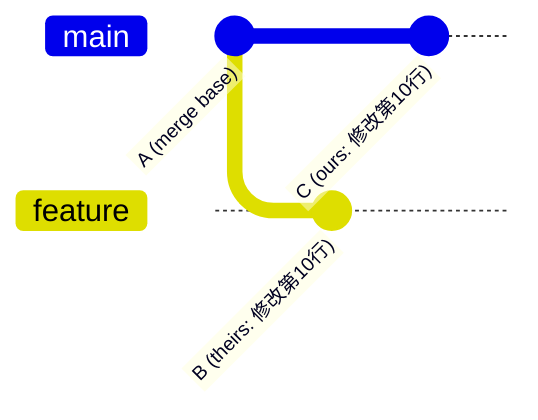
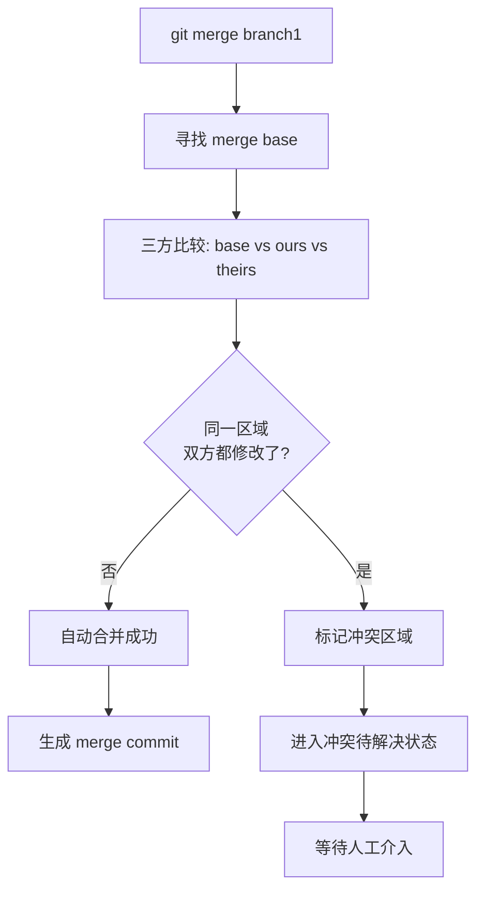
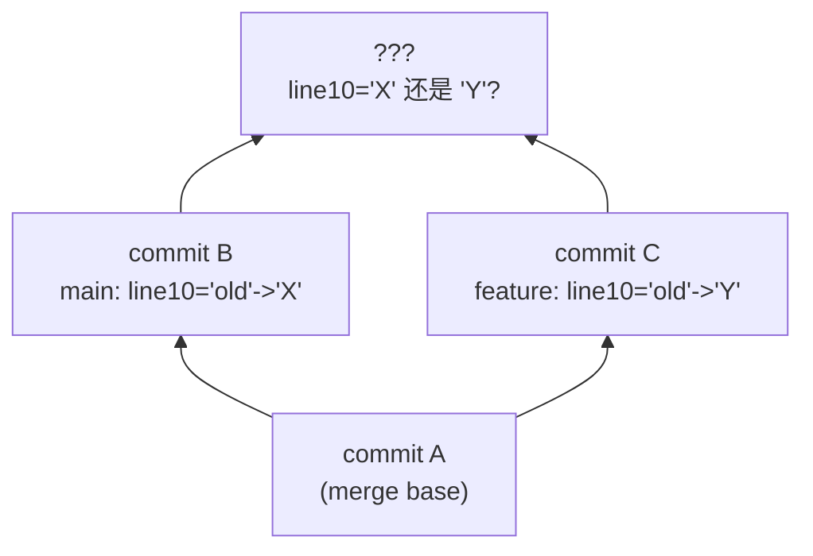
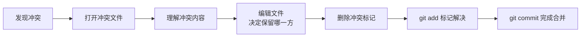
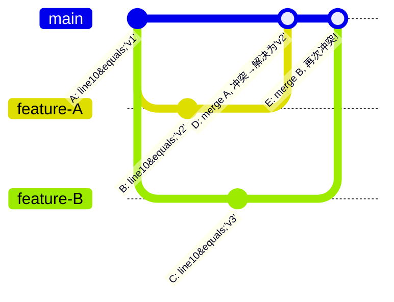
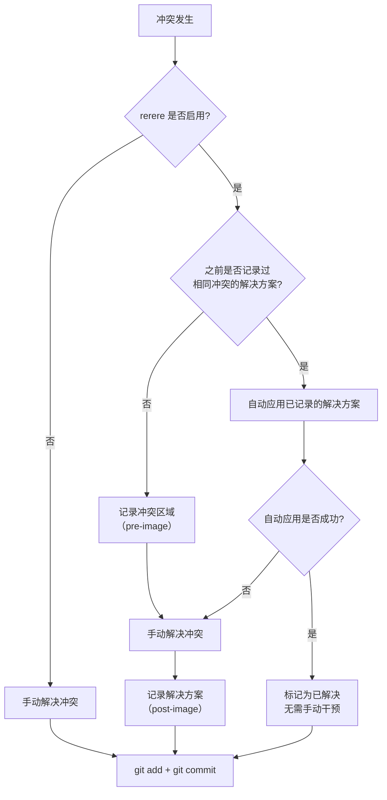
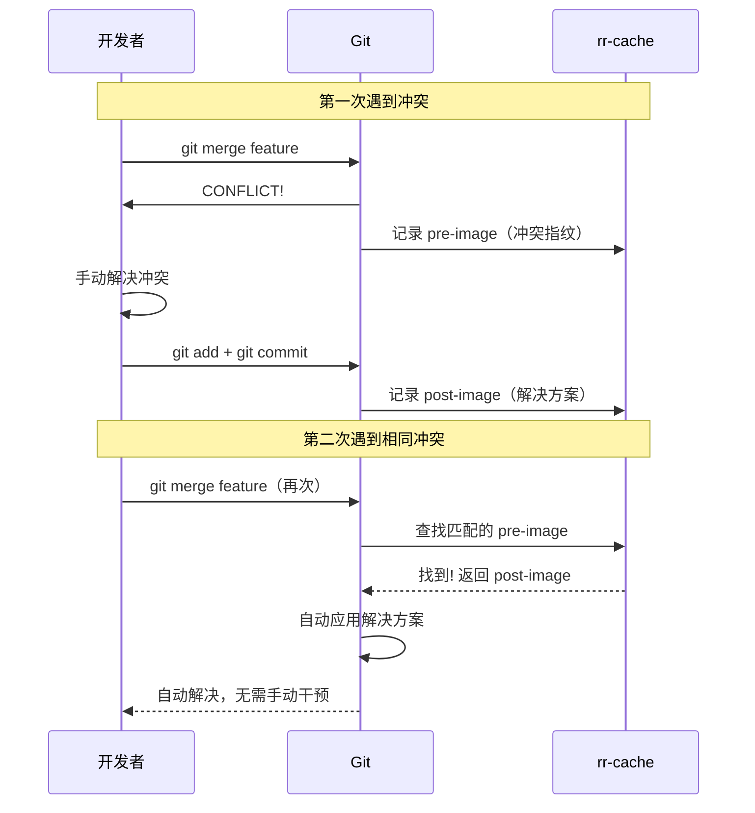
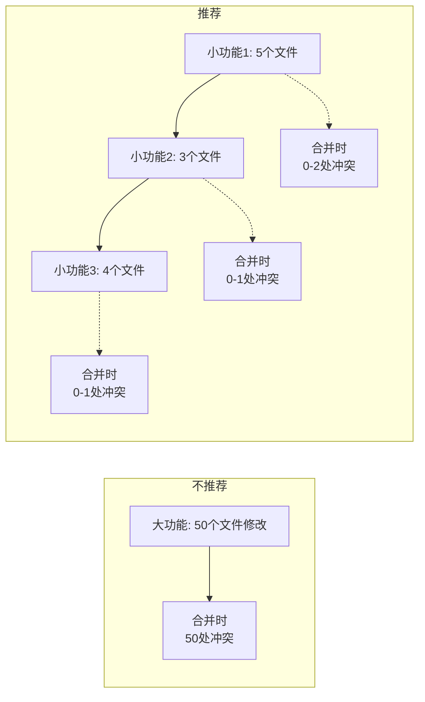

# 冲突解决实战

在前面的章节中我们了解了 `merge` 的基本原理（见《merge 合并》），也简单提到了冲突的存在。但当冲突真正出现在你的项目中时，尤其是面对复杂场景——多个文件冲突、嵌套冲突、二进制文件冲突——仅知道"手动编辑解决"是远远不够的。本节将从冲突的本质出发，系统讲解冲突的产生机制、检测方式、解决策略与预防手段，帮助你从"害怕冲突"进化为"驾驭冲突"。

## 冲突的产生机制

### 从三方合并说起

Git 的合并操作基于**三方合并（three-way merge）**算法。当执行 `git merge branch1` 时，Git 会找到当前分支（ ours ）和目标分支（ theirs ）的最近公共祖先（merge base），然后对三方进行逐行比较：



算法的核心逻辑如下：

| merge base | ours | theirs | 合并结果 |
|:---:|:---:|:---:|:---|
| 原文 | 修改为 X | 原文（未改） | 采用 X（自动合并） |
| 原文 | 原文（未改） | 修改为 Y | 采用 Y（自动合并） |
| 原文 | 修改为 X | 修改为 Y（X != Y） | **冲突！** |
| 原文 | 原文（未改） | 原文（未改） | 保留原文 |

简单来说：**当两分支相对于 merge base 对同一区域做了不同修改时，Git 无法自动判断应该以哪个为准，于是产生冲突。**

注意关键字"同一区域"——Git 的冲突检测不是按文件级别的，而是按**行级别**（更准确地说是按"差异块"，即 hunk）进行的。两个分支修改了同一文件的不同行，通常可以自动合并；修改了相邻行或同一行，则会产生冲突。

### 冲突产生的完整流程



## 冲突的图论本质

Git 的提交历史是一个**有向无环图（DAG）**。每个 commit 是节点，每个 parent 引用是有向边。在这个 DAG 上，分支是指向某个节点的可移动指针。

### DAG 中合并的唯一路径问题

当两个分支从同一个节点分叉后各自演进，合并操作本质上是在 DAG 中寻找一条"统一路径"，使得两个分支的修改都被保留。对于不重叠的修改，这条路径是唯一确定的（即自动合并）；但对于重叠的修改，存在多条候选路径，Git 无法确定唯一解。



节点 D（合并结果）处，line10 的值既可以是 X 也可以是 Y，DAG 的拓扑结构本身无法给出唯一答案。**冲突的本质就是：DAG 在合并节点处存在语义上的歧义，需要外部信息（人的决策）来消解。**

进一步来说，如果三方以上交叉合并，歧义会急剧增加——这也是后续"复杂冲突场景"一节要讨论的。

## 冲突标记解析

当冲突发生时，Git 会在冲突文件中插入特殊标记，将冲突区域划分为几个部分。理解这些标记的结构是解决冲突的基础。

### 完整标记结构

```
<<<<<<< HEAD
当前分支（ours）的内容
=======
目标分支（theirs）的内容
>>>>>>> branch-name
```

- `<<<<<<< HEAD`：冲突区域的起始标记，`HEAD` 表示当前分支的内容从此开始。
- `=======`：分隔线，ours 和 theirs 的分界。
- `>>>>>>> branch-name`：冲突区域的结束标记，`branch-name` 是被合并分支的名称。

### 多处冲突的标记

一个文件中可以有多处冲突，每处冲突都有独立的标记对：

```
第一段正常内容

<<<<<<< HEAD
ours 的第一处修改
=======
theirs 的第一处修改
>>>>>>> feature-login

中间的正常内容（自动合并成功）

<<<<<<< HEAD
ours 的第二处修改
=======
theirs 的第二处修改
>>>>>>> feature-login

末尾正常内容
```

Git 会逐 hunk 检测冲突，互不干扰。

### 理解 ours 与 theirs

一个容易混淆的点是：**ours 和 theirs 的含义取决于你执行的是哪个命令。**

| 命令 | ours | theirs |
|:---|:---|:---|
| `git merge branch1` | 当前 HEAD 所在分支 | branch1 |
| `git rebase main` | 被变基到的目标（main） | 你原来的分支 |
| `git cherry-pick commit` | 当前 HEAD | 被 cherry-pick 的 commit |

在 `rebase` 场景中，ours 和 theirs 是**反转**的！这是因为 rebase 的内部实现是逐个应用 commit，当前分支实际上是目标分支。这一点在解决 rebase 冲突时尤其需要注意。

## 简单冲突解决：手动编辑

### 基本流程



### 实战示例

假设我们有一个配置文件 `config.yml`，main 分支和 feature 分支都修改了端口配置：

冲突文件内容：

```yaml
server:
<<<<<<< HEAD
  port: 8080
  host: localhost
=======
  port: 3000
  host: 0.0.0.0
>>>>>>> feature
```

解决方式一——保留 ours：

```yaml
server:
  port: 8080
  host: localhost
```

解决方式二——保留 theirs：

```yaml
server:
  port: 3000
  host: 0.0.0.0
```

解决方式三——手动融合（最常见于实际开发）：

```yaml
server:
  port: 8080
  host: 0.0.0.0
```

编辑完成后：

```bash
git add config.yml
git commit
```

Git 会自动生成合并提交信息，你可以直接保存退出，也可以编辑提交信息以记录冲突解决的理由。

### 快速选择策略

对于简单的"选一方"场景，可以使用 `git checkout` 的 `--ours` / `--theirs` 选项快速解决：

```bash
# 对冲突文件采用当前分支的版本
git checkout --ours config.yml

# 对冲突文件采用目标分支的版本
git checkout --theirs config.yml

# 批量处理：所有冲突文件统一采用某一方的版本
git checkout --ours .
git checkout --theirs .
```

> **注意：** `--ours` 和 `--theirs` 只能用于冲突文件，对非冲突文件无效。同样地，在 rebase 场景下二者的含义也是反转的。务必确认你当前正在执行的命令类型。

## 复杂冲突场景


### 三方以上交叉合并

当多个分支各自对同一区域做了不同修改，然后依次合并时，冲突会反复出现：



第二次合并时，feature-B 的修改（v3）相对于 merge base（A，值为 v1）与当前 HEAD（D，值已被人工解决为 v2）产生了新的冲突。这次的 merge base 仍然是 A，所以 Git 会再次报告冲突。

应对策略：

1. **按合并顺序逐个解决**——不要试图一次性合并多个分支。
2. **每次合并后立即验证**——确保每次合并的结果是正确的，再进行下一次合并。
3. **考虑使用 `git rerere`**——后面会详细介绍，它可以记忆冲突解决方案。

### 嵌套冲突与连续冲突

有时一个文件中的冲突区域相互嵌套或紧密相连，使得冲突标记难以阅读。这通常发生在两分支对同一代码块做了大幅重构时：

```python
<<<<<<< HEAD
class UserService:
    def __init__(self, db):
        self.db = db

    def get_user(self, user_id):
        return self.db.query(
            "SELECT * FROM users WHERE id = ?", user_id
        )
=======
class UserService:
    def __init__(self, redis_client, db):
        self.redis = redis_client
        self.db = db

    def get_user(self, user_id):
        cached = self.redis.get(f"user:{user_id}")
        if cached:
            return cached
        return self.db.query(
            "SELECT * FROM users WHERE id = ?", user_id
        )
>>>>>>> feature-cache
```

这种情况下，简单的"选一方"往往不够，你需要理解两方的修改意图并手动融合。建议：

1. **先读懂两方的修改目的**——不要急于删代码。
2. **以一方为基础，逐步融入另一方的修改**——而非从头重写。
3. **合并后务必运行测试**——确保功能没有丢失。

### 二进制文件冲突

文本文件可以逐行比较，但二进制文件（图片、编译产物、Office 文档等）没有"行"的概念，Git 无法对其进行部分合并，只能给出"二选一"的冲突：

```bash
git merge feature
# 输出：
# CONFLICT (add/add): Merge conflict in assets/logo.png
# Automatic merge failed; fix conflicts and then commit the result.
```

解决方式：

```bash
# 保留当前分支的二进制文件
git checkout --ours assets/logo.png

# 或保留目标分支的二进制文件
git checkout --theirs assets/logo.png

# 或从某个特定 commit 取出
git checkout abc1234 -- assets/logo.png

# 标记解决
git add assets/logo.png
```

> **最佳实践：** 尽量避免在 Git 中追踪可自动生成的二进制文件（编译产物、node_modules 等），使用 `.gitignore` 排除它们。对于必须追踪的二进制文件（设计稿、图标等），团队应约定好修改规范，避免多人同时修改同一文件。

## merge tool 配置

手动编辑冲突标记虽然直接，但在冲突较多或代码较复杂时效率不高。Git 支持配置外部合并工具，提供图形化的三栏对比界面，大幅提升解决效率。

### 配置方法

```bash
# 设置合并工具
git config --global merge.tool vscode

# 设置工具的启动命令（--merge 开启 VS Code 的三方合并视图）
git config --global mergetool.vscode.cmd 'code --wait --merge $REMOTE $LOCAL $BASE $MERGED'

# 设置工具路径（如果不在 PATH 中）
git config --global mergetool.vscode.path '/Applications/Visual Studio Code.app/Contents/Resources/app/bin/code'
```

配置完成后，在冲突状态下执行：

```bash
git mergetool
```

Git 会依次打开每个冲突文件，使用你配置的工具进行可视化编辑。

### 常用工具对比

| 工具 | 配置名 | 特点 | 适用场景 |
|:---|:---|:---|:---|
| **vimdiff** | `vimdiff` | Git 内置支持，无需额外配置；三栏/四栏界面 | 终端党、服务器环境 |
| **VS Code** | 自定义 | 现代化 UI，丰富的快捷键，内联冲突编辑 | 前端/全栈开发者 |
| **IntelliJ IDEA** | `intellij`（需配置） | 深度集成 Java/Kotlin 项目，智能语法感知 | Java/Kotlin 开发者 |
| **Beyond Compare** | `bc` | 强大的三栏对比，支持二进制文件 | 专业对比需求 |
| **KDiff3** | `kdiff3` | 开源免费，自动合并能力强 | 通用 |
| **meld** | `meld` | Linux 原生风格，轻量 | Linux 用户 |
| **P4Merge** | `p4merge` | Perforce 出品，视觉直观 | 通用 |

### 各工具详细配置

**VS Code：**

```bash
git config --global merge.tool vscode
git config --global mergetool.vscode.cmd 'code --wait --merge $REMOTE $LOCAL $BASE $MERGED'
```

VS Code 会以三栏模式（ours / merge result / theirs）打开冲突文件，底部还有合并基准（base）供参考。

**IntelliJ IDEA / WebStorm：**

```bash
git config --global merge.tool intellij
git config --global mergetool.intellij.cmd 'idea merge $(cd $(dirname "$MERGED") && pwd)/$(basename "$MERGED") $(cd $(dirname "$BASE") && pwd)/$(basename "$BASE") $(cd $(dirname "$REMOTE") && pwd)/$(basename "$REMOTE") $(cd $(dirname "$LOCAL") && pwd)/$(basename "$LOCAL")'
```

> **提示：** JetBrains IDE 也可以通过内置的 Git 集成直接解决冲突，无需命令行配置。在 IDE 的 Git 面板中双击冲突文件即可打开可视化合并工具。

**vimdiff（四栏模式）：**

```bash
git config --global merge.tool vimdiff
```

vimdiff 会打开四个窗口——LOCAL（ours）、BASE（merge base）、REMOTE（theirs）、MERGED（编辑区）。在 MERGED 窗口中编辑最终结果。

### mergetool 的实用选项

```bash
# 解决冲突后不自动备份原始文件（默认会生成 .orig 备份）
git config --global mergetool.keepBackup false

# 逐个文件打开（默认行为）
git mergetool

# 指定只处理某个文件
git mergetool -- path/to/conflicted-file.txt

# 使用特定工具（不修改全局配置）
git mergetool --tool=vscode
```

## git rerere：自动记忆冲突解决方案

`rerere` 是 **Reuse Recorded Resolution** 的缩写，即"重用已记录的解决方案"。它是一个容易被忽视但极其强大的功能——当同样的冲突再次出现时，Git 会自动应用你之前的解决方案，无需手动重复解决。

### 为什么需要 rerere

考虑以下场景：

1. 你在一个长期分支上开发，需要频繁与 main 合并以保持同步。
2. 每次合并都会遇到相同的冲突（比如版本号、配置项）。
3. 每次你都要手动解决同样的冲突——枯燥且容易出错。

`rerere` 正是为了解决这个问题而诞生的。它的工作流程如下：



### 启用 rerere

```bash
# 全局启用
git config --global rerere.enabled true

# 或仅在当前仓库启用
git config rerere.enabled true
```

也可以在合并时使用 `--rerere-autoupdate` 选项，让 rerere 自动应用的解决方案直接进入暂存区（需先启用 rerere）：

```bash
git merge --rerere-autoupdate feature
```


### rerere 的工作原理

rerere 的数据存储在 `.git/rr-cache/` 目录下。其核心机制分为两步：

**第一步：记录冲突（pre-image）**

当冲突发生且 rerere 启用时，Git 会在 `rr-cache` 中记录冲突区域的原始内容（即带有冲突标记的内容），作为该冲突的"指纹"。

**第二步：记录解决方案（post-image）**

当你手动解决冲突并执行 `git add` 后，Git 会记录解决后的内容。这个"冲突指纹 → 解决方案"的映射被持久化保存。

**下次遇到相同冲突时**，Git 会：

1. 计算当前冲突区域的指纹。
2. 在 `rr-cache` 中查找是否有匹配的 pre-image。
3. 如果找到，将对应的 post-image 自动应用到冲突区域。



### rerere 的实际输出

当 rerere 自动应用了解决方案时，你会看到类似输出：

```bash
git merge --no-commit feature
# 输出：
# Resolved 'config.yml' using previous resolution.
# Automatic merge went well; stopped before committing as requested
```

如果 rerere 记录了解决方案但需要你确认：

```bash
git merge feature
# 输出：
# Reapplying resolution for 'config.yml'...
# CONFLICT (content): Merge conflict in config.yml
# Stopped at config.yml; you may need to fix the resolution manually
```

### rerere 的注意事项

1. **解决方案是按仓库存储的**——`rr-cache` 位于 `.git` 目录下，默认不会推送到远程。如果团队希望共享解决方案，可以通过拷贝、同步 `rr-cache` 目录（或符号链接等方式）在成员间共享。
2. **解决方案可能过时**——如果代码上下文发生了变化，之前记录的解决方案可能不再适用。Git 会在应用失败时回退到手动模式。
3. **rebase 场景尤为有用**——在 `git rebase` 过程中反复出现相同冲突时，rerere 可以自动解决，避免你在每个 commit 上都手动处理一遍。
4. **可以清除记录**——如果记录的解决方案不再适用：

```bash
# 清除所有 rerere 记录
git rerere gc

# 查看当前记录
git rerere status

# 查看某次冲突的解决差异
git rerere diff
```

## 冲突解决后的操作

### 标准流程

```bash
# 1. 编辑冲突文件，解决冲突

# 2. 将解决后的文件标记为已解决
git add <resolved-file>

# 如果有多个冲突文件，可以一次性添加
git add .

# 3. 完成合并提交
git commit
```

### 验证解决结果

在提交之前，建议进行以下验证：

```bash
# 确认没有残留的冲突标记
grep -rn "<<<<<<< HEAD" .

# 确认所有冲突文件已标记为已解决
git status

# 运行项目测试
npm test  # 或 make test, pytest 等
```

> **重要：** 搜索残留冲突标记是一个好习惯。有时候你在编辑时可能遗漏了某个冲突标记，或者自动合并工具没有完全清理干净。带着冲突标记提交会污染代码库。

### 关于 git commit 的细节

在冲突待解决状态下执行 `git commit` 时，Git 会自动生成合并提交信息（以 `Merge branch 'xxx'` 开头）。这个提交信息记录了合并的两个父节点，是 DAG 中合并节点的关键信息。

```bash
# 查看合并提交的完整信息
git show --stat HEAD

# 查看合并提交的两个父节点
git log --merges --oneline
git cat-file -p HEAD  # 查看 parent 信息
```

合并提交有两个 parent：第一个 parent 是当前分支（ours），第二个 parent 是被合并分支（theirs）。这个信息在后续分析提交历史时非常重要。

## 放弃解决冲突

如果你在解决冲突的过程中发现问题太复杂，或者合并本身就不应该进行，可以放弃整个合并操作：

### merge 场景

```bash
# 放弃合并，恢复到合并前的状态
git merge --abort
```

执行后，工作区和暂存区都会恢复到 `git merge` 之前的状态，所有冲突标记消失。

### rebase 场景

```bash
# 放弃变基，恢复到变基前的状态
git rebase --abort
```

### cherry-pick 场景

```bash
# 放弃 cherry-pick
git cherry-pick --abort
```


### 通用方法

如果上述 `--abort` 选项不可用，可以使用 `git reset` 回退：

```bash
# 查看操作前的 ORIG_HEAD 引用（Git 在可能改变 HEAD 的操作前自动保存）
git reset --hard ORIG_HEAD

# 或者使用 reflog 找到合并前的 commit
git reflog
git reset --hard <commit-hash>
```

> **警告：** `git reset --hard` 会丢弃所有未提交的修改，请确保你真的想放弃所有更改。如果只是想暂时保存，可以先用 `git stash` 暂存。

## 冲突预防策略

解决冲突的能力固然重要，但预防冲突才是更高效的做法。以下是经过实践验证的预防策略：

### 1. 小步提交

**核心原则：** 每次提交只做一件事，保持提交的原子性。



小步提交的好处：

- 冲突范围小，解决难度低。
- 每次解决冲突后的验证范围小，不易遗漏。
- 出问题时 `git revert` 的影响范围小。

### 2. 频繁同步

**核心原则：** 尽量缩短分支与主干分离的时间。

```bash
# 每天至少同步一次主干
git checkout feature
git fetch origin
git merge origin/main
# 或使用 rebase 保持线性历史
git rebase origin/main
```

分离时间越长，分叉越大，冲突概率和复杂度呈指数级增长。频繁同步将大冲突分解为多个小冲突，每次解决成本极低。

### 3. 明确的分支职责划分

不同分支修改不同区域，从根源上避免冲突。

| 分支 | 职责 | 修改范围 |
|:---|:---|:---|
| `main` | 稳定发布 | 仅通过合并接收修改 |
| `feature/*` | 功能开发 | 各功能模块独立 |
| `fix/*` | 缺陷修复 | 针对特定问题 |
| `refactor/*` | 重构 | 最好独占，避免与其他分支并行 |
| `release/*` | 发布准备 | 仅版本号、构建配置 |

**关键规则：**

- 两个人不要同时修改同一个文件——通过任务分配避免。
- 重构操作尽量独占一个迭代，不要与功能开发并行。
- 全局性的修改（如修改公共接口、重命名公共变量）需要提前通知所有分支。

### 4. 模块化与解耦

代码架构层面的预防——高内聚低耦合的代码天然冲突少：

- 不同模块修改不同文件，自然不会冲突。
- 公共接口稳定，减少跨模块修改的必要性。
- 配置项集中管理，避免散落在各处。

### 5. 使用 .gitattributes 减少不必要的冲突

```bash
# .gitattributes 文件内容

# 对合并无关紧要的文件，始终采用某一方的版本
package-lock.json merge=ours

# 对特定文件使用自定义合并驱动
*.properties merge=union
```

其中 `union` 合并驱动会同时保留两方的修改（适用于追加式内容，如 properties 文件）。`ours` 驱动则在冲突时自动选择 ours 的版本。

配置自定义合并驱动：

```bash
# union 是 Git 内置的合并驱动，无需额外配置

# ours 驱动不是内置的，需要自行定义（否则 merge=ours 不会生效）
git config --global merge.ours.driver true
```

### 6. Code Review 中检查冲突风险

在 Code Review 阶段，除了审查代码质量，还应注意：

- 该 PR 是否修改了其他未合并 PR 也修改的文件？
- 是否存在"大范围重构 + 功能开发"并行的风险？
- 是否需要调整合并顺序以降低冲突复杂度？

## 小结

本节系统讲解了 Git 冲突的方方面面：

1. **冲突的产生机制**——基于三方合并算法，当两分支对同一区域做了不同修改时产生冲突。
2. **冲突的图论本质**——DAG 中合并节点存在语义歧义，无法从拓扑结构唯一确定合并结果。
3. **冲突标记解析**——`<<<<<<< HEAD` / `=======` / `>>>>>>> branch-name` 的完整结构及多处冲突的标记方式。特别注意 rebase 场景下 ours 和 theirs 的反转。
4. **简单冲突解决**——手动编辑 + `git add` + `git commit` 的标准流程；`--ours` / `--theirs` 的快速选择。
5. **复杂冲突场景**——三方交叉合并、嵌套冲突、二进制文件冲突的应对策略。
6. **merge tool 配置**——`git mergetool` 的配置方法和常用工具对比（vimdiff / VS Code / IntelliJ 等）。
7. **git rerere**——自动记忆冲突解决方案，通过记录 pre-image 和 post-image 的映射，在相同冲突再次出现时自动应用。
8. **冲突解决后的操作**——标记已解决、验证无残留冲突标记、完成合并提交。
9. **放弃解决冲突**——`--abort` 选项及 `git reset --hard ORIG_HEAD` 的通用回退方法。
10. **冲突预防策略**——小步提交、频繁同步、明确的分支职责划分、模块化解耦、`.gitattributes` 配置、Code Review 中的冲突风险检查。

冲突不是 Git 的缺陷，而是分布式协作的必然产物。理解冲突的本质、掌握解决的工具、养成预防的习惯，三者结合，才能在团队协作中游刃有余。

