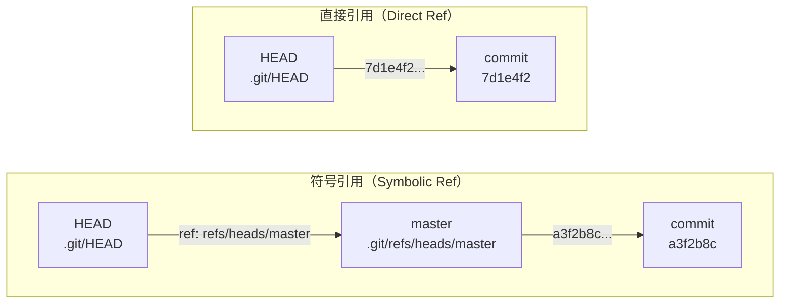
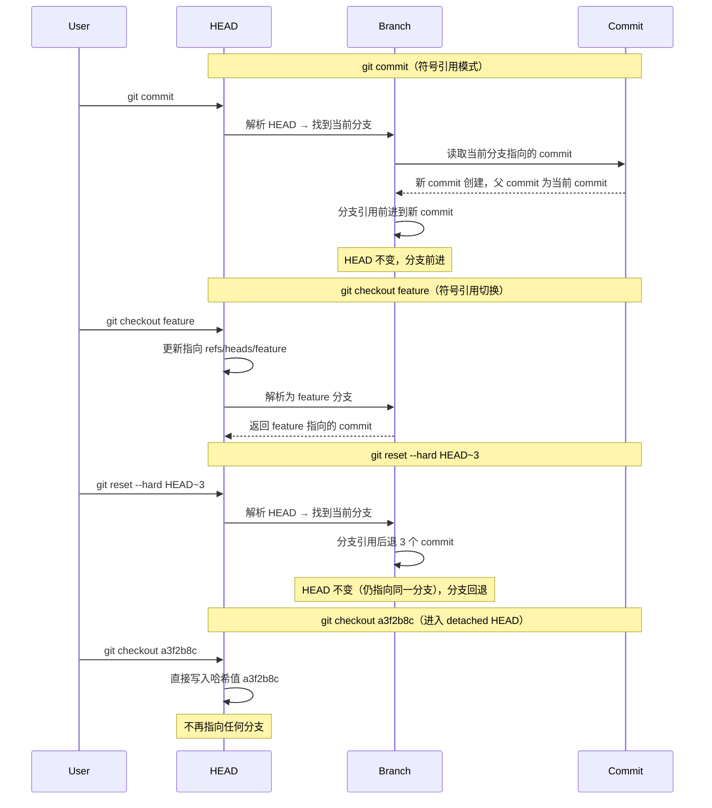
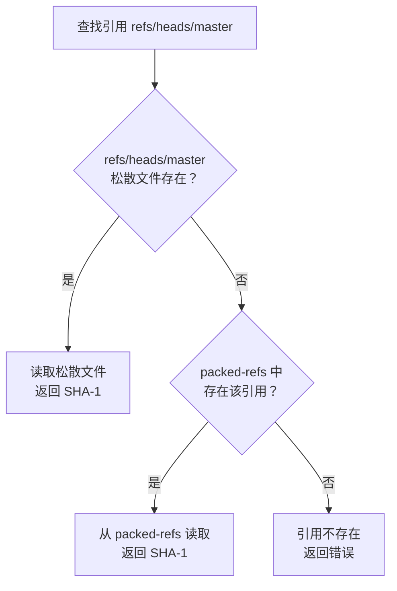
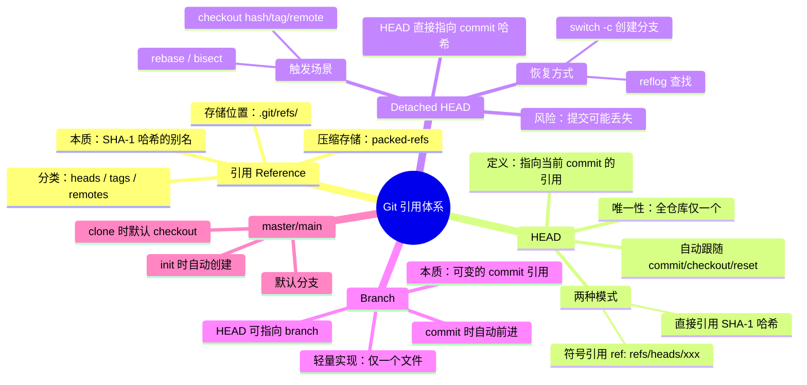

# 引用体系：HEAD 与 branch

在 Git 的内部世界里，所有的历史都是通过 SHA-1 哈希值来标识的——每一个 commit、每一个 tree、每一个 blob 都拥有一个 40 位的十六进制指纹。然而，人类并不擅长记忆 `a3f2b8c9d4e5f6a7b8c9d0e1f2a3b4c5d6e7f8a9` 这样的字符串。Git 的**引用（reference）**机制正是为了解决这一问题而诞生的：它为哈希值赋予可读的名字，让开发者可以用语义化的方式操作版本历史。

理解引用体系，是理解 Git 分支模型、合并策略、远程同步等一切高级操作的前提。本文将从底层原理出发，逐层剖析 HEAD、branch 以及引用的存储实现。

---

## 1. 引用（Reference）：指向 commit 的快捷方式

### 1.1 为什么需要引用

Git 的每一个 commit 对象都由其内容的 SHA-1 哈希值唯一确定。这是一个不可变的、全局唯一的标识符——但也是一个对人类极不友好的标识符：

```
$ git log --oneline
a3f2b8c feat: add user authentication
7d1e4f2 fix: resolve null pointer in parser
b9c0a3d chore: update dependencies
```

如果每次操作都需要输入完整的 SHA-1 哈希，日常工作将无法进行。引用的核心作用就是**为哈希值建立可读的别名**，使得我们可以用 `master`、`v1.0`、`origin/main` 这样的名字代替原始哈希。

### 1.2 引用的本质

从实现层面看，引用就是一个**文本文件**，其内容是一个 SHA-1 哈希值（或另一个引用的路径）。Git 通过解析这些文件来将名字映射到具体的 commit 对象。

```bash
# 查看一个引用指向的实际 commit
$ cat .git/refs/heads/master
a3f2b8c9d4e5f6a7b8c9d0e1f2a3b4c5d6e7f8a9

# 引用可以参与所有期望 commit 哈希的命令
$ git diff master~3 master    # 等价于 git diff <hash1> <hash2>
$ git log master --oneline    # 等价于 git log <hash> --oneline
```

### 1.3 引用的分类

Git 中的引用按用途可以分为以下几类：

| 类别 | 存储路径 | 用途 |
|------|---------|------|
| 分支引用（branch） | `.git/refs/heads/` | 指向本地分支的最新 commit |
| 标签引用（tag） | `.git/refs/tags/` | 指向特定 commit 的标记（轻量标签）或标签对象（附注标签） |
| 远程引用（remote） | `.git/refs/remotes/` | 指向远程仓库分支的最新已知 commit |
| HEAD | `.git/HEAD` | 指向当前工作区所基于的 commit 或分支 |

它们在文件系统中的组织方式如下：

```
.git/
├── HEAD                    # 当前位置引用
├── refs/
│   ├── heads/              # 本地分支
│   │   ├── master
│   │   ├── feature/login
│   │   └── hotfix/issue-42
│   ├── tags/               # 标签
│   │   ├── v1.0
│   │   └── v2.0
│   └── remotes/            # 远程追踪分支
│       └── origin/
│           ├── master
│           └── develop
```

---

## 2. HEAD：指向当前 commit 的引用

### 2.1 HEAD 的定义

HEAD 是 Git 中**最重要、最特殊**的引用。它始终指向当前工作区所基于的 commit，回答了"我现在在哪里"这个根本问题。在任何时刻，仓库中**有且仅有一个 HEAD**，它是所有分支操作的参照基准。

HEAD 的值决定了：

- `git commit` 的新 commit 的父 commit 是谁
- `git diff` 比较的基准是什么
- `git log` 默认展示的起点在哪里
- 工作区和暂存区相对于哪个 commit 状态

### 2.2 HEAD 的文件实现

HEAD 的实现位于 `.git/HEAD` 文件，该文件只有一行内容，存在两种格式：

**格式一：符号引用（指向分支）**

```
ref: refs/heads/master
```

这是最常见的格式。HEAD 并不直接记录 commit 哈希，而是指向一个分支引用，再由分支引用指向实际的 commit。此时 HEAD 是**间接的**——它通过分支来定位 commit。

**格式二：直接引用（指向 commit 哈希）**

```
a3f2b8c9d4e5f6a7b8c9d0e1f2a3b4c5d6e7f8a9
```

这种格式下，HEAD 直接指向一个 commit 哈希值，不经过任何分支。这就是**detached HEAD**（分离头指针）状态。

```bash
# 查看当前 HEAD 的内容
$ cat .git/HEAD
ref: refs/heads/master

# 查看 HEAD 指向的实际 commit（两种方式等价）
$ git rev-parse HEAD
a3f2b8c9d4e5f6a7b8c9d0e1f2a3b4c5d6e7f8a9

$ git rev-parse --short HEAD
a3f2b8c
```

### 2.3 符号引用 vs 直接引用

这两种模式构成了 HEAD 的核心区分，下图展示了它们的工作方式差异：



**关键区别：**

| 维度 | 符号引用 | 直接引用 |
|------|---------|---------|
| HEAD 内容 | 分支引用路径 | commit 哈希值 |
| commit 时 | 分支引用自动前进 | HEAD 自身移动，无分支跟踪 |
| 安全性 | 有分支保护，提交不会丢失 | 提交可能被垃圾回收丢失 |
| 典型场景 | 正常开发 | 查看历史、rebase、bisect |

### 2.4 HEAD 如何跟随操作移动

HEAD 的移动遵循严格的规则，不同命令对 HEAD 的影响不同：



总结各命令对 HEAD 的影响：

| 命令 | HEAD 指向 | 分支引用 | 工作区 |
|------|----------|---------|--------|
| `git commit` | 不变（仍指向分支） | 前进到新 commit | 更新 |
| `git checkout <branch>` | 切换到新分支 | 不变 | 更新 |
| `git checkout <hash>` | 直接指向哈希 | 不变 | 更新 |
| `git reset --soft` | 不变 | 移动 | 不变 |
| `git reset --mixed` | 不变 | 移动 | 不变（索引更新） |
| `git reset --hard` | 不变 | 移动 | 更新 |
| `git merge` | 不变 | 前进到合并 commit | 更新 |
| `git rebase` | 不变 | 前进到变基后的 commit | 更新 |

> **注意**：在符号引用模式下，HEAD 始终指向分支，真正移动的是分支引用。理解"HEAD 不变、分支前进"这一机制，是掌握 Git 引用体系的关键。

---

## 3. Detached HEAD 状态详解

### 3.1 什么是 Detached HEAD

当 HEAD 直接指向一个 commit 哈希而非分支引用时，Git 称之为 **detached HEAD**（分离头指针）状态。此时，你虽然处于某个 commit 的历史位置上，但没有分支在跟踪你的位置。

```bash
$ git checkout v1.0
Note: switching to 'v1.0'.

You are in 'detached HEAD' state. You can look around, make experimental
changes and commit them, and you can discard any commits you make in this
state without impacting any branches.

If you want to create a new branch to retain commits you create, you may
do so (now or later) by using -c with the switch command. Example:

  git switch -c <new-branch-name>

HEAD is now at a3f2b8c feat: add user authentication
```


### 3.2 进入 Detached HEAD 的场景

以下操作会进入 detached HEAD 状态：

| 触发方式 | 说明 |
|---------|------|
| `git checkout <hash>` | 检出某个历史 commit |
| `git checkout <tag>` | 检出标签（标签不是分支） |
| `git checkout origin/main` | 检出远程分支（远程追踪引用不是本地分支） |
| `git rebase` 过程中 | 重新应用 commit 时临时进入 |
| `git bisect` 过程中 | 二分查找时逐个检出 commit |
| `git submodule` 更新后 | 子模块默认处于 detached 状态 |
| `git commit` 在已 detached 的 HEAD 上 | 保持 detached 状态 |

### 3.3 Detached HEAD 的风险

在 detached HEAD 状态下创建的新 commit **没有分支引用保护**。一旦切换到其他分支，这些 commit 就变成了"悬空"的，最终可能被 `git gc` 垃圾回收永久删除。

```mermaid
stateDiagram-v2
    [*] --> Attached: git checkout master
    Attached --> Detached: git checkout <hash/tag/remote>
    Detached --> Detached: git commit<br/>(无分支跟踪)
    Detached --> Attached: git checkout <branch><br/>未保存 commit 变为悬空
    Detached --> Attached: git switch -c <new-branch><br/>保存 commit 到新分支
    Detached --> Attached: git merge <branch><br/>合并到已有分支

    state Detached {
        [*] --> CreatingCommits: git commit
        CreatingCommits --> Dangling: git checkout <branch><br/>不保存
        CreatingCommits --> Saved: git switch -c <branch>
    }

    state Dangling {
        Dangling --> GC: git gc --prune=now<br/>永久丢失
        Dangling --> Recoverable: git reflog<br/>有限时间内可恢复
    }

    note right of Detached
        风险：提交无分支保护
        可被垃圾回收永久删除
    end note
```

### 3.4 如何恢复 Detached HEAD 中的提交

如果在 detached HEAD 状态下创建了有价值的 commit，有几种方式可以挽救：

**方法一：创建新分支保存**

```bash
# 当前处于 detached HEAD，已创建若干 commit
$ git switch -c save-my-work
# 现在 HEAD → save-my-work → 最新 commit，提交安全了
```

**方法二：合并到已有分支**

```bash
# 记住当前 commit 哈希
$ git log --oneline -1
abc1234 my valuable work

# 切回目标分支
$ git checkout main

# 合并进来
$ git merge abc1234
```

**方法三：通过 reflog 找回**

即使已经离开了 detached HEAD，只要 commit 尚未被垃圾回收，reflog 中仍会保留记录：

```bash
$ git reflog
a3f2b8c HEAD@{0}: checkout: moving from abc1234 to main
abc1234 HEAD@{1}: commit: my valuable work    # 这就是我们要找回的
7d1e4f2 HEAD@{2}: checkout: moving from main to v1.0

# 基于该 commit 创建分支
$ git branch recovered-work abc1234
```

> **提示**：reflog 默认保留 90 天（对于可达 commit）或 30 天（对于不可达 commit），超过期限的条目会在 `git gc` 时被清除。

### 3.5 何时有意使用 Detached HEAD

虽然 detached HEAD 有风险，但在以下场景中它是合理甚至必要的：

- **代码审查**：检出特定 commit 查看历史代码状态
- **Bug 二分定位**：`git bisect` 需要逐个检出 commit
- **构建特定版本**：CI/CD 中检出标签对应的 commit 进行构建
- **子模块**：子模块默认以 detached HEAD 方式工作，因为它们指向特定的 commit
- **临时实验**：快速验证某个历史版本的行为，不打算保留修改

---

## 4. Branch：一类特殊的引用

### 4.1 Branch 的本质

在 Git 中，branch（分支）本质上就是**一个指向 commit 的可变引用**。它与其他引用的区别在于：

- branch 是 HEAD 的合法指向目标（tag、remote 不是）
- branch 会在 `git commit` 时自动前进
- branch 的移动遵循快进（fast-forward）规则

**Git 的分支只是一个文件，里面只有一行 40 个字符的 SHA-1 哈希值。** 这与 SVN 等系统将分支视为目录拷贝的设计截然不同。Git 的分支模型极度轻量——创建分支只是写入一个 40 字节的文件，删除分支只是删除一个文件。

```bash
# 创建分支的底层操作（等价于 git branch feature）
$ echo "a3f2b8c9d4e5f6a7b8c9d0e1f2a3b4c5d6e7f8a9" > .git/refs/heads/feature

# 查看分支指向的 commit
$ git rev-parse feature
a3f2b8c9d4e5f6a7b8c9d0e1f2a3b4c5d6e7f8a9
```

### 4.2 HEAD → Branch → Commit 的链路

当 HEAD 以符号引用模式指向分支时，形成了一条"HEAD → branch → commit"的间接链路。这是 Git 最核心的引用模型：

```mermaid
flowchart TB
    subgraph 初始状态["初始状态：master 分支"]
        HEAD0["HEAD<br/>ref: refs/heads/master"]
        master0["master<br/>a3f2b8c"]
        commitA["commit A<br/>a3f2b8c"]
        HEAD0 --> master0 --> commitA
    end

    subgraph 创建分支后["git branch feature 后"]
        HEAD1["HEAD<br/>ref: refs/heads/master"]
        master1["master<br/>a3f2b8c"]
        feature1["feature<br/>a3f2b8c"]
        commitB["commit A<br/>a3f2b8c"]
        HEAD1 --> master1 --> commitB
        feature1 --> commitB
    end

    subgraph 切换分支后["git checkout feature 后"]
        HEAD2["HEAD<br/>ref: refs/heads/feature"]
        master2["master<br/>a3f2b8c"]
        feature2["feature<br/>a3f2b8c"]
        commitC["commit A<br/>a3f2b8c"]
        HEAD2 --> feature2 --> commitC
        master2 --> commitC
    end

    subgraph 提交后["git commit 后（在 feature 上）"]
        HEAD3["HEAD<br/>ref: refs/heads/feature"]
        master3["master<br/>a3f2b8c"]
        feature3["feature<br/>7d1e4f2"]
        commitD["commit A<br/>a3f2b8c"]
        commitE["commit B<br/>7d1e4f2"]
        HEAD3 --> feature3 --> commitE
        master3 --> commitD
        commitE --> commitD
    end

```



### 4.3 Branch 创建时 HEAD 的联动行为

创建分支时，新分支会指向当前 HEAD 所指向的 commit（无论 HEAD 是符号引用还是直接引用）：

```bash
# 当前在 master 分支，HEAD → master → commit A
$ git branch feature
# feature 也指向 commit A，HEAD 不变

# 在 detached HEAD 状态下创建分支
$ git checkout a3f2b8c   # 进入 detached HEAD
$ git branch from-detached
# from-detached 指向 a3f2b8c，HEAD 不变（仍是直接引用）
```

`git checkout -b` / `git switch -c` 不仅创建分支，还会移动 HEAD：

```bash
$ git switch -c feature
# 等价于：
# 1. git branch feature    （创建分支，指向当前 HEAD 对应的 commit）
# 2. git checkout feature  （将 HEAD 指向 feature）
```

### 4.4 Branch 的移动规则

分支引用的移动遵循以下规则：

**规则一：commit 时自动前进**

当 HEAD 指向某分支时，`git commit` 会将该分支引用前进到新创建的 commit：

```bash
# HEAD → master → commit A
$ git commit -m "new work"
# HEAD → master → commit B → commit A
#                ^ master 前进了
```

**规则二：快进合并时前进**

当合并的源分支是目标分支的直接后继时，目标分支直接前进（fast-forward）：

```bash
$ git merge feature  # 如果 master 是 feature 的祖先
# master 前进到 feature 指向的 commit
```

**规则三：非快进合并时创建合并 commit**

当两个分支有分叉时，`git merge` 会创建一个新的合并 commit，分支引用前进到该合并 commit。

**规则四：reset 时可回退**

`git reset` 可以让分支引用回退到指定的历史 commit：

```bash
$ git reset --hard HEAD~3
# 当前分支回退 3 个 commit
```

---


## 5. master/main：默认分支的特殊性

### 5.1 初始 commit 自动创建

`master`（或 `main`）是 Git 仓库中第一个被创建的分支，它在第一次 `git commit` 时自动生成：

```bash
$ git init
# 初始化空仓库，此时没有任何分支

$ git commit --allow-empty -m "initial commit"
# 创建了第一个 commit，同时创建了 master 分支指向该 commit
# .git/refs/heads/master 被自动创建

$ cat .git/HEAD
ref: refs/heads/master    # HEAD 默认指向 master
```

在第一个 commit 之前，虽然 `.git/HEAD` 已经写入 `ref: refs/heads/master`，但 `.git/refs/heads/master` 文件尚不存在。Git 依靠 HEAD 的符号引用来"预知"默认分支名称，直到第一个 commit 创建后，分支引用文件才真正落盘。

### 5.2 master 与 main 的历史

Git 长期以来使用 `master` 作为默认分支名。2020 年发布的 Git 2.28 引入了 `init.defaultBranch` 配置，允许自定义初始分支名；此后 GitHub 等托管平台陆续将新建仓库的默认分支改为 `main`，以使用更包容的术语（Git 本身的默认值至今仍为 `master`，仅会输出提示信息）：

```bash
# 配置默认分支名（Git 2.28+）
$ git config --global init.defaultBranch main

# 查看当前默认分支名
$ git config --global init.defaultBranch
main
```

**技术层面**，`master` 和 `main` 完全等价，都是普通的分支引用，没有任何特殊逻辑。其"特殊性"仅体现在：

1. `git init` 时自动创建
2. `git clone` 时默认 checkout
3. 部分工具和平台（如 GitHub）默认以此作为 PR 的目标分支

### 5.3 clone 时的行为

`git clone` 时，Git 会：

1. 从远程仓库获取所有引用（包括所有分支和标签）
2. 将远程的默认分支（通常是 `main` 或 `master`）检出到工作区
3. 创建本地 `main` 分支追踪 `origin/main`
4. 将 HEAD 指向本地 `main`

```bash
$ git clone https://github.com/user/repo.git
# 等价于以下操作的组合：
# 1. git init
# 2. git remote add origin <url>
# 3. git fetch origin
# 4. git checkout main  （检出远程默认分支，创建本地追踪分支）
```

---

## 6. 引用的文件系统实现

### 6.1 .git/refs/ 目录结构

引用的物理存储位于 `.git/refs/` 目录下，采用层级目录结构组织：

```
.git/refs/
├── heads/                     # 本地分支引用
│   ├── master                 # 内容：a3f2b8c...
│   ├── main                   # 内容：7d1e4f2...
│   └── feature/
│       ├── login              # 内容：b9c0a3d...
│       └── dashboard          # 内容：e5f6a7b...
├── tags/                      # 标签引用
│   ├── v1.0                   # 内容：c9d0e1f...（轻量标签）
│   └── v2.0                   # 内容：d0e1f2a...（附注标签指向标签对象）
└── remotes/                   # 远程追踪引用
    └── origin/
        ├── master             # 内容：a3f2b8c...
        └── develop            # 内容：f2a3b4c...
```

每个引用文件的内容非常简单——只有一行，包含一个 40 字符的 SHA-1 哈希值加一个换行符：

```bash
$ cat .git/refs/heads/master
a3f2b8c9d4e5f6a7b8c9d0e1f2a3b4c5d6e7f8a9

$ wc -c .git/refs/heads/master
      41 .git/refs/heads/master    # 40 字符 + 1 换行符
```

### 6.2 分支名称的文件映射

分支名称中的 `/` 会被映射为目录层级，这使得引用的命名空间可以自然地用文件系统表达：

| 分支名称 | 文件路径 |
|---------|---------|
| `master` | `.git/refs/heads/master` |
| `feature/login` | `.git/refs/heads/feature/login` |
| `hotfix/issue-42/urgent` | `.git/refs/heads/hotfix/issue-42/urgent` |
| `release/v2.0` | `.git/refs/heads/release/v2.0` |

**注意事项**：

- 分支名不能以 `/` 结尾（因为那意味着目录而非文件）
- 分支名不能包含连续的 `..` 或 `~^:` 等特殊字符
- 分支名不能与 `.git` 或 `..` 冲突
- 不能同时存在 `feature`（文件）和 `feature/login`（feature 目录下的文件），因为文件系统不允许同名文件和目录共存

```bash
# 以下操作会失败
$ git branch feature
$ git branch feature/login
fatal: cannot lock ref 'refs/heads/feature/login': 'refs/heads/feature' exists; cannot create 'refs/heads/feature/login'

# 反过来也一样
$ git branch feature/login
$ git branch feature
fatal: cannot lock ref 'refs/heads/feature': 'refs/heads/feature/login' exists; cannot create 'refs/heads/feature'
```

### 6.3 引用文件的延迟创建

并非所有引用都会立即出现在 `.git/refs/` 目录中。在某些情况下，Git 会将引用存储在 `packed-refs` 文件中（见下节），而非单独的文件。此时 `.git/refs/` 目录下可能找不到对应的文件，但引用依然有效：

```bash
# 引用存在但文件不在 refs/ 目录下
$ git branch -a
* main
  feature/login
  remotes/origin/master

$ ls .git/refs/heads/
main
# feature/login 不在这里，可能在 packed-refs 中

$ git rev-parse feature/login
b9c0a3d4e5f6a7b8c9d0e1f2a3b4c5d6e7f8a9b0
# 但引用依然可以正常解析
```

### 6.4 直接操作引用文件的后果

理论上可以直接编辑 `.git/refs/` 下的文件来修改引用，但这**极度危险**且不推荐：

```bash
# 危险操作！不要这样做！
$ echo "7d1e4f2c9d0e1f2a3b4c5d6e7f8a9b0c1d2e3f4a" > .git/refs/heads/master
# 这会让 master 指向一个可能不存在的 commit，导致仓库损坏

# 安全的方式
$ git update-ref refs/heads/master 7d1e4f2c9d0e1f2a3b4c5d6e7f8a9b0c1d2e3f4a
# git update-ref 会进行合法性校验
```

`git update-ref` 是 Git 提供的底层命令，用于安全地更新引用。它会对目标 commit 的存在性进行校验，并正确处理锁机制以避免并发问题。

---

## 7. packed-refs：引用的压缩存储

### 7.1 为什么需要 packed-refs

当仓库拥有大量引用时（例如大型项目可能有数千个远程追踪分支和标签），将每个引用存储为独立文件会产生两个问题：

1. **文件系统开销**：每个文件至少占用一个文件系统块（通常 4KB），而引用内容只有 41 字节，空间浪费严重
2. **I/O 性能**：打开和读取数千个小文件比读取一个大文件慢得多

`packed-refs` 是 Git 的优化方案：将不常变动的引用打包到一个文件中，减少文件数量和 I/O 开销。

### 7.2 packed-refs 文件格式

`.git/packed-refs` 是一个纯文本文件，每行一个引用：

```
# pack-refs with: peeled fully-peeled sorted
a3f2b8c9d4e5f6a7b8c9d0e1f2a3b4c5d6e7f8a9 refs/heads/master
7d1e4f2c9d0e1f2a3b4c5d6e7f8a9b0c1d2e3f4a refs/heads/feature/login
b9c0a3d4e5f6a7b8c9d0e1f2a3b4c5d6e7f8a9b0 refs/remotes/origin/master
c9d0e1f2a3b4c5d6e7f8a9b0c1d2e3f4a5b6c7d8 refs/tags/v1.0
d9e0f1a2b3c4d5e6f7a8b9c0d1e2f3a4b5c6d7e8 refs/tags/v2.0
^e1f2a3b4c5d6e7f8a9b0c1d2e3f4a5b6c7d8e9f0
```

格式解析：

- 第一行是文件头 `# pack-refs with: peeled fully-peeled sorted`，声明该文件支持的功能标记
- 每行格式为 `<sha-1> <ref-path>`
- 以 `^` 开头的行表示前一个引用（附注标签）所指向的 commit，即"剥离"后的结果

### 7.3 引用查找优先级

当一个引用同时存在于松散文件和 packed-refs 中时，**松散文件优先**：



这个优先级机制确保了更新引用时不需要修改 packed-refs 文件——只需创建或更新对应的松散文件即可。松散文件"覆盖"packed-refs 中的同名引用。


### 7.4 引用更新的流程

```bash
# 当 master 分支前进时
$ git commit -m "update"

# Git 的内部操作：
# 1. 计算新 commit 的 SHA-1
# 2. 写入 .git/refs/heads/master（创建或覆盖松散文件）
# 3. packed-refs 中的旧条目被松散文件覆盖（不修改 packed-refs）
```

### 7.5 packed-refs 的自动触发

以下操作会触发引用打包：

```bash
# 手动触发
$ git pack-refs --all

# git gc 自动触发
$ git gc
# 内部会调用 git pack-refs --all

# git fetch 大量远程引用后可能触发
$ git fetch --all
```

`git pack-refs --all` 会将所有松散引用打包到 packed-refs 文件中，并删除对应的松散文件。但被 HEAD 指向的分支引用通常会保留松散文件，以确保频繁的 commit 操作不需要额外更新 packed-refs。

### 7.6 完整的引用解析流程

`git rev-parse` 是 Git 解析引用的底层命令，它展示了完整的引用查找链：

```bash
# HEAD 的解析过程
$ git rev-parse HEAD
# 1. 读取 .git/HEAD
# 2. 发现内容为 "ref: refs/heads/master"
# 3. 递归解析 refs/heads/master
#    a. 检查 .git/refs/heads/master 松散文件
#    b. 若不存在，检查 .git/packed-refs
# 4. 返回最终的 SHA-1 哈希值

# 任意引用的解析
$ git rev-parse feature/login
# 1. 补全为 refs/heads/feature/login
# 2. 检查 .git/refs/heads/feature/login
# 3. 若不存在，检查 .git/packed-refs
# 4. 返回 SHA-1

# 查看符号引用的目标
$ git symbolic-ref HEAD
refs/heads/master
# 只对符号引用有效，直接引用会报错
```

---

## 8. 小结

### 核心概念回顾



### 关键要点

1. **引用是 Git 的命名系统**：它将人类可读的名字映射到 SHA-1 哈希，是分支、标签、远程追踪的基础设施。

2. **HEAD 是 Git 的导航核心**：它始终回答"我在哪里"这个问题。理解 HEAD 的符号引用与直接引用两种模式，是理解 Git 所有分支操作的前提。

3. **分支只是引用的一种**：它的特殊性在于可以被 HEAD 指向、会在 commit 时自动前进。除此之外，它与标签、远程引用没有本质区别。

4. **detached HEAD 不是错误**：它是 Git 的正常状态，只是需要意识到提交不会被分支保护。使用 `git switch -c` 可以随时保存工作。

5. **引用有两层存储**：松散文件（`.git/refs/`）和压缩文件（`.git/packed-refs`），前者优先。理解这个机制有助于排查引用相关的异常问题。

6. **master/main 没有魔法**：它只是第一个被创建的分支引用，技术上与其他分支完全等价。其"默认"地位仅由约定和工具链保证。

### 命令速查

| 命令 | 作用 |
|------|------|
| `git rev-parse HEAD` | 查看 HEAD 指向的 commit 哈希 |
| `git symbolic-ref HEAD` | 查看 HEAD 指向的分支（仅符号引用） |
| `git symbolic-ref HEAD refs/heads/main` | 修改 HEAD 指向的分支 |
| `git update-ref refs/heads/feature <hash>` | 安全地更新引用 |
| `git show-ref` | 列出所有引用 |
| `git for-each-ref` | 遍历引用并格式化输出 |
| `git pack-refs --all` | 将松散引用打包到 packed-refs |
| `git reflog` | 查看 HEAD 的移动历史 |
| `git switch -c <branch>` | 创建并切换到新分支 |
| `git branch -f <branch> <hash>` | 强制移动分支引用 |

