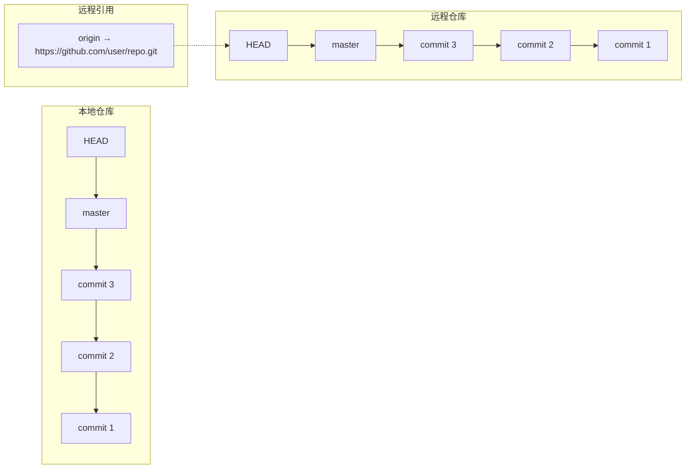
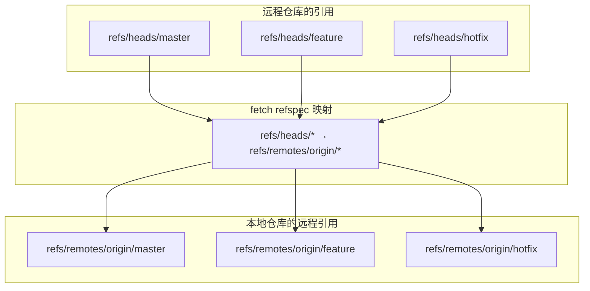
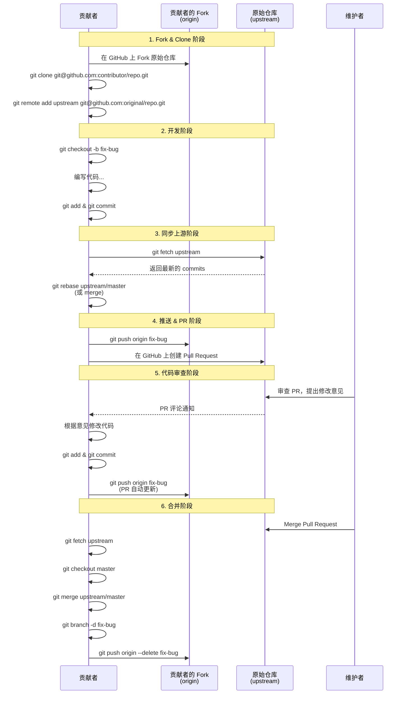
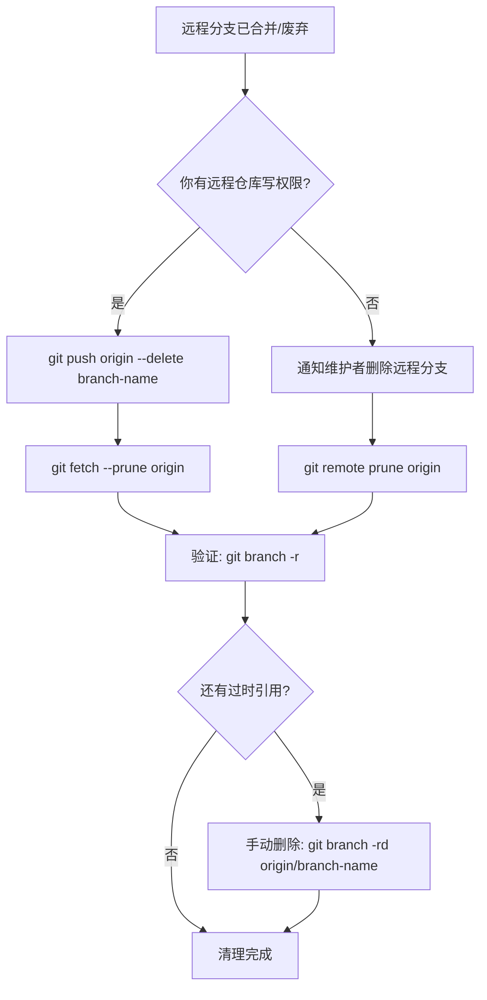
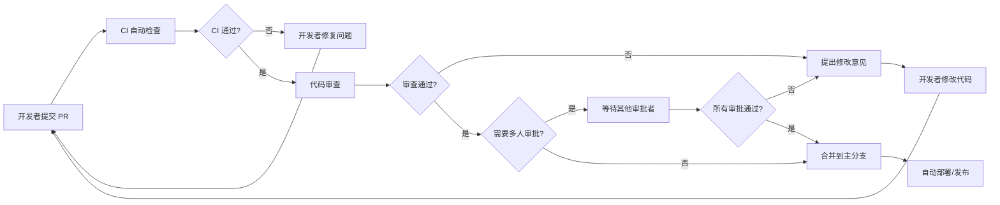
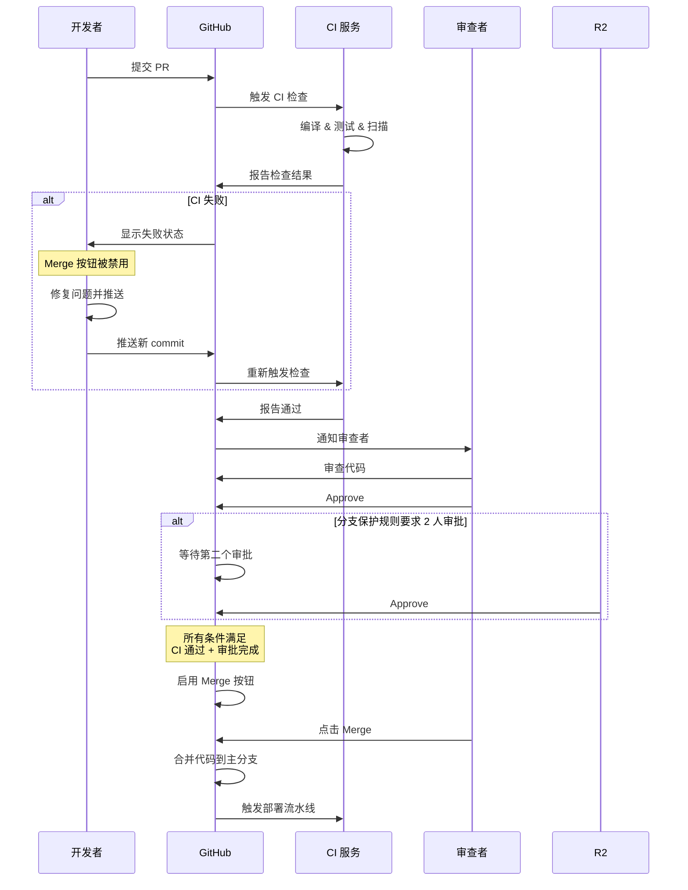
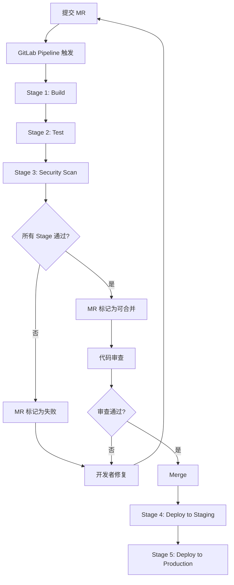

# 远程协作模型

在前面的内容中，我们已经了解了 `branch`、`merge`、`push`、`pull` 这些核心概念。但到目前为止，我们对「远程仓库」的理解还停留在「一个放在服务器上的代码备份」这种模糊的层面。这一节，我们将深入远程协作的底层机制，搞清楚远程仓库到底是什么、Git 是如何管理远程引用的，以及在实际团队协作中有哪些成熟的协作模型。

## 远程仓库的本质

很多人对远程仓库有一个误解：认为它是一个「中央权威」，本地仓库是从属于它的。但事实上，**远程仓库不过是另一个持有完整 `.git` 目录的仓库副本**——它和你本地的仓库在结构上没有任何区别。它拥有自己的 `HEAD`、自己的 `branch`、自己的 `commit` 历史，唯一的不同只是它碰巧运行在另一台机器上。

Git 的「分布式」本质就在于此：每一个 clone 下来的仓库都是完整的、独立的、自给自足的。你完全可以在断网的情况下完成所有的版本管理操作——创建分支、提交代码、查看历史、撤销修改——这些都不需要任何远程仓库的参与。

那么，本地仓库和远程仓库之间的关联是怎么建立的呢？答案是：**引用（remote）**。

当你执行 `git clone` 时，Git 做了两件事：

1. 把远程仓库的完整内容下载到本地，创建一个功能完备的本地仓库；
2. 在本地仓库中创建一个名为 `origin` 的**远程引用**，记录远程仓库的地址和分支映射关系。

这个 `origin` 就是一个「书签」——它记住了远程仓库在哪里、叫什么，让你在需要同步代码时可以方便地找到它。你可以把它理解为一个指向另一个仓库的快捷方式。



关键点在于：本地仓库并不「依赖」远程仓库。即使删掉 `origin` 这个引用，本地仓库依然可以正常工作——只是你没法再和那个远程仓库同步代码了。

## remote 的底层实现

理解了远程仓库的本质，我们来看看 Git 在底层是怎么管理 remote 的。

### .git/config 中的 [remote] 段

当你 clone 一个仓库后，Git 会在 `.git/config` 文件中写入一段配置，记录远程仓库的信息。执行 `cat .git/config`，你会看到类似这样的内容：

```ini
[remote "origin"]
    url = https://github.com/user/repo.git
    fetch = +refs/heads/*:refs/remotes/origin/*
```

这段配置的含义是：

- `[remote "origin"]`：定义了一个名为 `origin` 的远程引用。这个名字是约定俗成的，但并非强制——你可以叫它任何名字。
- `url`：远程仓库的地址。支持 HTTPS、SSH、Git 协议等多种格式。
- `fetch`：这是一个 **refspec（引用规格）**，定义了在执行 `git fetch` 时，远程仓库的哪些引用会被映射到本地的哪些引用。

### refspec 详解

refspec 是 remote 配置中最核心也最容易被忽视的部分。它的格式是：

```
[+]src:dst
```

其中：

- `src`：远程仓库的引用模式（源端）
- `dst`：本地仓库的引用模式（目标端）
- `+`：可选，表示强制更新（即使本地引用指向的 commit 不是远程引用的后代，也强制覆盖）

以默认的 `fetch = +refs/heads/*:refs/remotes/origin/*` 为例：

- `refs/heads/*`：匹配远程仓库的所有分支（`*` 是通配符）
- `refs/remotes/origin/*`：将它们映射到本地的 `refs/remotes/origin/` 目录下
- `+`：强制更新，即使本地记录的远程分支位置不是新位置的后代

所以，当远程仓库有一个分支 `feature` 时，`git fetch` 会把它的最新位置记录在本地的 `refs/remotes/origin/feature` 中——这就是你在 `git branch -r` 中看到的 `origin/feature`。



你也可以为 push 定义 refspec。默认情况下，push 的 refspec 遵循 `push.default` 配置项的规则（通常为 `simple`，即只 push 当前分支到同名的上游分支）。但你也可以手动指定，例如：

```ini
[remote "origin"]
    url = https://github.com/user/repo.git
    fetch = +refs/heads/*:refs/remotes/origin/*
    push = refs/heads/master:refs/heads/master
```

这表示 push 时只推送 `master` 分支。更极端的例子——如果你想把本地的 `dev` 分支 push 到远程的 `release` 分支：

```shell
git push origin dev:release
```

这就是 refspec 的灵活之处：源和目标不必同名。

### 手动管理 remote

除了 `clone` 时自动创建的 `origin`，你还可以手动添加、修改、删除 remote：

```shell
# 查看所有 remote
git remote -v

# 添加一个新的 remote
git remote add upstream https://github.com/original/repo.git

# 修改 remote 的 URL
git remote set-url origin git@github.com:user/repo.git

# 删除一个 remote
git remote remove mirror

# 重命名一个 remote
git remote rename old-name new-name
```

每一条 `git remote add` 命令，本质上就是在 `.git/config` 中新增一个 `[remote]` 段。

## 上游分支（upstream / tracking branch）

在前面介绍 `push` 的时候，我们提到过：对于本地新建的分支，需要用 `git push origin branch_name` 来指定目标仓库和分支。但如果你每次 push 都要手动输入这些参数，那就太麻烦了。上游分支（upstream branch，也叫 tracking branch）就是用来解决这个问题的。

### 什么是上游分支

上游分支是一个本地分支和远程分支之间的**绑定关系**。当一个本地分支设置了上游分支后，你在这个分支上执行 `git push` 或 `git pull` 时，Git 就会自动知道要和哪个远程仓库的哪个分支进行同步，不需要你再手动指定。

### 设置上游分支

设置上游分支有几种方式：

**方式一：在 push 时设置（最常用）**

```shell
# 首次 push 本地新分支时，用 -u 参数同时设置上游分支
git push -u origin feature
```

`-u` 是 `--set-upstream` 的简写。这条命令做了两件事：把 `feature` 分支 push 到 `origin/feature`，同时把 `origin/feature` 设置为本地 `feature` 分支的上游分支。之后，你在这个分支上只需要 `git push` 或 `git pull` 就行了。

**方式二：单独设置**

```shell
# 为当前分支设置上游分支
git branch --set-upstream-to=origin/feature

# 或者用更短的写法
git branch -u origin/feature
```

**方式三：在创建分支时设置**

```shell
# 基于远程分支创建本地分支，自动建立追踪关系
git checkout -b feature origin/feature

# Git 2.23+ 可以用 switch
git switch -c feature origin/feature
```

### .git/config 中的 [branch] 段

设置上游分支后，Git 会在 `.git/config` 中记录这个关系：

```ini
[branch "feature"]
    remote = origin
    merge = refs/heads/feature
```

这段配置的含义是：

- `remote = origin`：当前分支的上游远程仓库是 `origin`
- `merge = refs/heads/feature`：执行 `git pull` 时，要合并的远程引用是 `refs/heads/feature`

有了这段配置，Git 在执行 `git pull` 时就知道：先从 `origin` fetch，然后把 `origin/feature` 合并到当前分支。执行 `git push` 时也知道：把当前分支推送到 `origin` 的 `feature` 分支。

### 查看上游分支关系

```shell
# 查看所有分支及其上游分支
git branch -vv

# 输出示例：
#   feature    7a8b9c0 [origin/feature] Add new feature
# * master     a1b2c3d [origin/master] Fix bug
#   local-only d4e5f6a Local branch without upstream
```

方括号中的内容就是上游分支。注意 `local-only` 分支没有上游分支——这意味着在它上面执行 `git push` 或 `git pull` 会报错。

## Fork + Upstream 模式

前面介绍的协作模型，都是基于「所有人都有同一个仓库的写权限」这个前提的。但在开源世界里，情况完全不同——你不可能给每个想贡献代码的人都开放仓库的写权限。这就是 Fork + Upstream 模式诞生的背景。

### 什么是 Fork

Fork 是 GitHub/GitLab 等平台提供的一个功能：在你的账号下创建一个仓库的完整副本。这个副本完全属于你，你有完整的写权限。原始仓库通常被称为 **upstream**（上游仓库），而你 fork 出来的仓库就是你的 **origin**。


### Fork + Upstream 的完整流程

下面用一个完整的序列图来展示开源贡献的标准流程：



### 具体操作步骤

让我们把上面的流程拆解成具体的命令：

**第一步：Fork 并 Clone**

在 GitHub 上点击 Fork 按钮后：

```shell
# clone 你 fork 的仓库
git clone git@github.com:your-username/repo.git
cd repo

# 添加上游仓库
git remote add upstream git@github.com:original-owner/repo.git

# 验证 remote 配置
git remote -v
# origin    git@github.com:your-username/repo.git (fetch)
# origin    git@github.com:your-username/repo.git (push)
# upstream  git@github.com:original-owner/repo.git (fetch)
# upstream  git@github.com:original-owner/repo.git (push)
```

**第二步：创建功能分支**

```shell
# 先同步上游最新代码
git fetch upstream
git checkout master
git merge upstream/master

# 创建功能分支
git checkout -b fix-login-bug
```

**第三步：开发和提交**

```shell
# 编写代码...
git add .
git commit -m "Fix login validation bug"
```

**第四步：同步上游（保持分支最新）**

在提交 PR 之前，确保你的分支基于上游最新的代码：

```shell
git fetch upstream
git rebase upstream/master
```

使用 `rebase` 而不是 `merge`，可以让你的提交历史保持线性，方便维护者审查。如果 rebase 过程中出现冲突，解决后继续：

```shell
# 解决冲突后
git add <resolved-files>
git rebase --continue
```

**第五步：推送并创建 PR**

```shell
git push -u origin fix-login-bug
```

然后在 GitHub 上从你的 fork 仓库向原始仓库创建 Pull Request。

**第六步：根据审查意见修改**

如果维护者提出了修改意见，你只需要在本地继续修改并提交，然后再次 push：

```shell
# 修改代码...
git add .
git commit -m "Address review feedback"
git push origin fix-login-bug
```

PR 会自动更新，不需要重新创建。

**第七步：PR 合并后清理**

```shell
# 同步上游
git fetch upstream
git checkout master
git merge upstream/master

# 删除本地和远程的功能分支
git branch -d fix-login-bug
git push origin --delete fix-login-bug
```

### Fork + Upstream 的 .git/config 全貌

完成上述配置后，你的 `.git/config` 大致如下：

```ini
[remote "origin"]
    url = git@github.com:your-username/repo.git
    fetch = +refs/heads/*:refs/remotes/origin/*

[remote "upstream"]
    url = git@github.com:original-owner/repo.git
    fetch = +refs/heads/*:refs/remotes/upstream/*

[branch "master"]
    remote = origin
    merge = refs/heads/master
```

注意一个关键点：`master` 分支的上游是 `origin/master` 而不是 `upstream/master`。这意味着在 `master` 上执行 `git pull` 会从你的 fork 拉取，而不是从原始仓库拉取。要同步原始仓库的更新，你需要显式地 `git fetch upstream` 然后 `git merge upstream/master`。

## 多远程仓库场景

在实际工作中，你可能会遇到需要同时与多个远程仓库交互的场景。Fork + Upstream 模式就是一种双远程仓库的场景，但还有更多的情况。

### 常见的多远程仓库场景

| 场景 | remote 配置 | 说明 |
|------|------------|------|
| 开源贡献 | origin (fork) + upstream (原始) | 标准的 Fork + Upstream 模式 |
| 多平台部署 | origin (GitHub) + gitlab (GitLab) + gitee (Gitee) | 同一份代码推送到多个平台 |
| 镜像备份 | origin (主仓库) + mirror (备份仓库) | 代码的灾备镜像 |
| 企业内网 | origin (内网 GitLab) + upstream (开源项目) | 基于开源项目做内部定制 |

### 添加多个 remote

```shell
# 添加 GitLab 镜像
git remote add gitlab https://gitlab.com/user/repo.git

# 添加 Gitee 镜像
git remote add gitee https://gitee.com/user/repo.git

# 添加只读备份
git remote add mirror https://backup-server.com/repo.git
```


### 不同 remote 的 push/pull 策略

有了多个 remote 后，你需要明确每个 remote 的用途，并制定相应的 push/pull 策略：

**场景一：多平台同步推送**

```shell
# 推送到所有平台
git push origin master
git push gitlab master
git push gitee master
```

如果觉得每次都要推三次太麻烦，可以创建一个同时推送到多个 remote 的 URL：

```shell
# 给 origin 添加多个 pushurl
git remote set-url --add --push origin https://github.com/user/repo.git
git remote set-url --add --push origin https://gitlab.com/user/repo.git
git remote set-url --add --push origin https://gitee.com/user/repo.git
```

这样，执行 `git push origin master` 就会同时推送到所有配置的 pushurl。注意，`set-url --add --push` 会**替换**默认的 push URL，所以你需要把原始的 push URL 也重新添加一次。

配置完成后，`.git/config` 中会是这样：

```ini
[remote "origin"]
    url = https://github.com/user/repo.git
    fetch = +refs/heads/*:refs/remotes/origin/*
    pushurl = https://github.com/user/repo.git
    pushurl = https://gitlab.com/user/repo.git
    pushurl = https://gitee.com/user/repo.git
```

**场景二：只读上游仓库**

```shell
# 从 upstream 拉取最新代码
git fetch upstream
git merge upstream/master

# 只 push 到 origin，不 push 到 upstream（因为你没有写权限）
git push origin master
```

对于只读的 upstream，你可以通过配置防止误推：

```shell
# 设置 upstream 为不可推送（将 push URL 设为无效地址）
git remote set-url --push upstream no_push
```

这样，如果误操作 `git push upstream master`，Git 会报错而不会真的推送。

**场景三：镜像仓库**

```shell
# 添加镜像仓库时，使用 --mirror=push 参数
git remote add --mirror=push mirror https://backup-server.com/repo.git
```

`--mirror=push` 会在配置中写入 `mirror = true`，此后 push 该 remote 时行为等同于 `git push --mirror`，会把所有引用（包括 tags、notes 等）都推送到镜像仓库：

```ini
[remote "mirror"]
    url = https://backup-server.com/repo.git
    fetch = +refs/heads/*:refs/remotes/mirror/*
    mirror = true
```

## 远程引用管理

随着时间的推移，远程仓库的分支会不断增减，而你本地的远程引用（`refs/remotes/origin/` 下的内容）可能会变得过时。这就需要定期清理。

### 过时的远程引用

假设远程仓库的 `feature-A` 分支已经被合并并删除了，但你本地的 `origin/feature-A` 引用还在。这时执行 `git branch -r`，你会看到一个已经不存在的远程分支：

```shell
git branch -r
# origin/master
# origin/feature-A    ← 这个分支在远程已经不存在了
# origin/feature-B
```

这种过时的引用叫做 **stale remote tracking branch**。它不会影响你的工作，但会干扰你的视线，让你误以为远程还有这个分支。

### git remote prune

清理过时引用最直接的方式是 `git remote prune`：

```shell
# 清理 origin 的过时引用
git remote prune origin

# 输出：
# Pruning origin
# URL: https://github.com/user/repo.git
#  * [pruned] origin/feature-A
```

这条命令会检查 `origin` 对应的远程仓库上实际还有哪些分支，然后删除本地那些已经不在远程的引用。

如果你想在清理前先看看哪些引用会被删除，可以加上 `--dry-run`：

```shell
git remote prune --dry-run origin
```

### git fetch --prune

更方便的做法是在 fetch 时自动清理：

```shell
git fetch --prune origin
# 或者简写
git fetch -p origin
```

这条命令在拉取最新数据的同时，自动清理过时的远程引用。你可以把它设为默认行为：

```shell
git config fetch.prune true
```

这样以后每次 `git fetch` 或 `git pull` 都会自动清理过时引用。

### 手动删除远程分支

如果你是远程分支的维护者，需要删除远程仓库上已经不需要的分支：

```shell
# 删除远程分支
git push origin --delete feature-A

# 或者用冒号语法（更底层的方式）
git push origin :feature-A
```

冒号语法的原理是 refspec：`src:dst`，当 `src` 为空时，意味着「把空的引用推送到 dst」，效果就是删除远程的 `dst` 引用。

### 远程分支的完整清理流程



## 代码审查与 CI 集成

在现代软件开发中，代码合并从来不是「写完就合」这么简单。Pull Request（GitHub）/ Merge Request（GitLab）不仅是代码合并的入口，更是代码审查和自动化验证的枢纽。


### PR/MR 中的代码审查流程



### CI 集成的自动化检查

当开发者提交 PR 时，CI 系统会自动执行一系列检查。常见的检查项包括：

| 检查类型 | 工具示例 | 说明 |
|---------|---------|------|
| 代码编译 | Make, Gradle, npm build | 确保代码能成功编译 |
| 单元测试 | Jest, pytest, JUnit | 运行自动化测试用例 |
| 代码风格 | ESLint, Prettier, Black | 检查代码格式是否符合规范 |
| 安全扫描 | SonarQube, Snyk | 检测安全漏洞和依赖风险 |
| 构建产物 | Docker, APK, IPA | 验证构建产物是否正常 |

### GitHub 的分支保护与状态检查

GitHub 提供了分支保护规则（Branch Protection Rules），可以强制要求 PR 必须通过特定检查才能合并：



### 常见的分支保护配置

在 GitHub 仓库的 Settings → Branches → Branch protection rules 中，可以配置：

- **Require status checks to pass before merging**：要求 CI 检查全部通过
- **Require branches to be up to date before merging**：要求 PR 分支基于最新的主分支
- **Require pull request reviews before merging**：要求至少 N 人审批
- **Dismiss stale pull request approvals when new commits are pushed**：新 commit 推送后，之前的审批自动失效
- **Require signed commits**：要求 commit 必须带有可信签名（GPG、SSH 或 S/MIME）
- **Do not allow force pushes**：禁止 force push

这些保护规则确保了代码质量不是靠人的自觉性来维护，而是靠系统来强制保障的。

### GitLab 的 MR 与 Pipeline

GitLab 的 Merge Request 机制与 GitHub 的 PR 类似，但更深度地集成了 CI/CD Pipeline：



GitLab 还支持 **Merge Trains**——多个 MR 可以按顺序排队合并，每个 MR 都会在前一个 MR 合并后的代码基础上重新运行 Pipeline，确保合并顺序不会导致冲突或测试失败。

## 小结

这一节深入探讨了远程协作的底层机制和实际模型。核心要点如下：

1. **远程仓库的本质**：它只是另一个完整的仓库副本，通过 remote 引用与本地仓库关联。本地仓库是独立的，不依赖远程仓库也能正常工作。

2. **remote 的底层实现**：remote 的配置存储在 `.git/config` 的 `[remote]` 段中，核心是 refspec——它定义了 fetch/push 时远程引用和本地引用之间的映射规则。理解 refspec，就理解了 Git 远程同步的底层逻辑。

3. **上游分支**：通过 `-u` 或 `--set-upstream-to` 设置，本质是在 `.git/config` 的 `[branch]` 段中记录当前分支对应的远程仓库和远程分支。设置后，`git push` 和 `git pull` 就不需要再手动指定目标。

4. **Fork + Upstream 模式**：开源贡献的标准协作模型。核心是维护两个 remote——`origin`（你的 fork，有写权限）和 `upstream`（原始仓库，通常只读）。开发流程：fork → clone → add upstream → branch → develop → rebase → push → PR → review → merge。

5. **多远程仓库场景**：实际工作中经常需要同时与多个远程仓库交互。可以通过 `pushurl` 实现多平台同步推送，通过设置无效 push URL 防止误推到只读仓库，通过 `--mirror` 配置镜像备份。

6. **远程引用管理**：远程分支删除后，本地的远程引用可能过时。使用 `git remote prune` 或 `git fetch --prune` 来清理，也可以通过 `fetch.prune` 配置自动清理。

7. **代码审查与 CI 集成**：PR/MR 是代码审查和自动化验证的枢纽。通过分支保护规则和 CI Pipeline，可以在代码合并前强制执行质量检查，确保只有通过编译、测试、审查的代码才能进入主分支。

理解了这些远程协作的机制，你就能在各种协作场景中游刃有余——无论是公司内部的小团队开发，还是参与大型开源项目的贡献，都能清楚地知道每一步操作背后的原理和目的。

