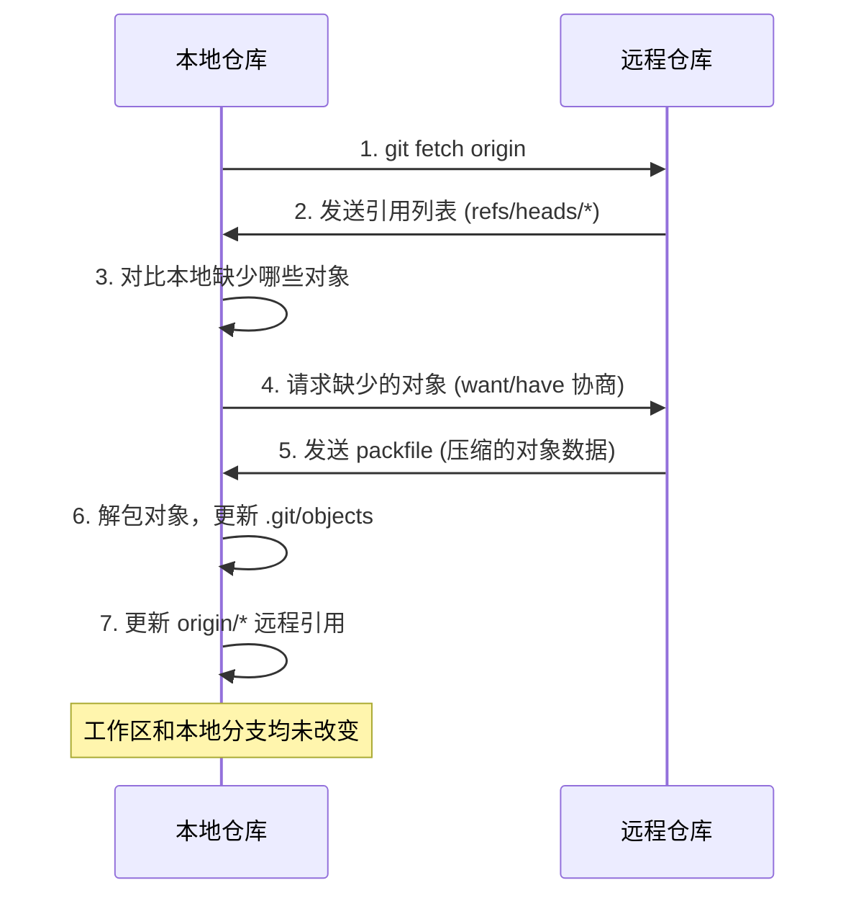
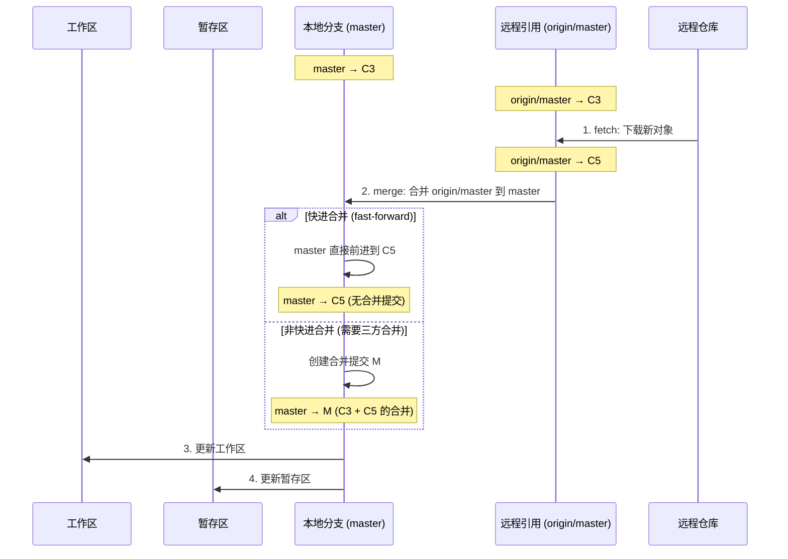
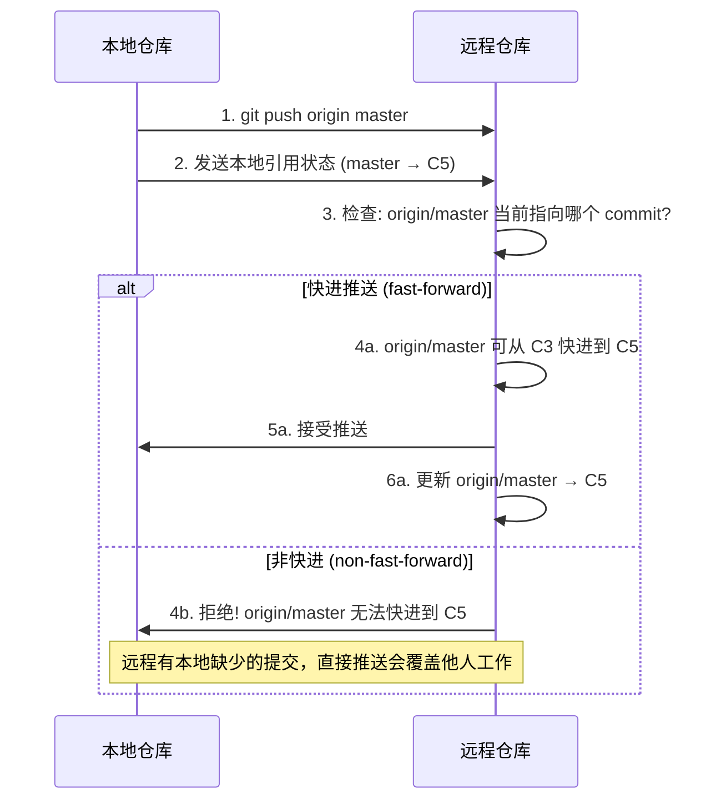
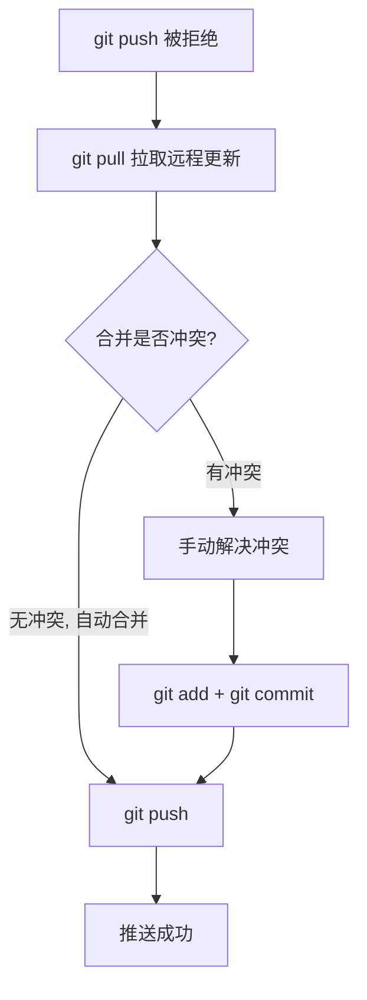
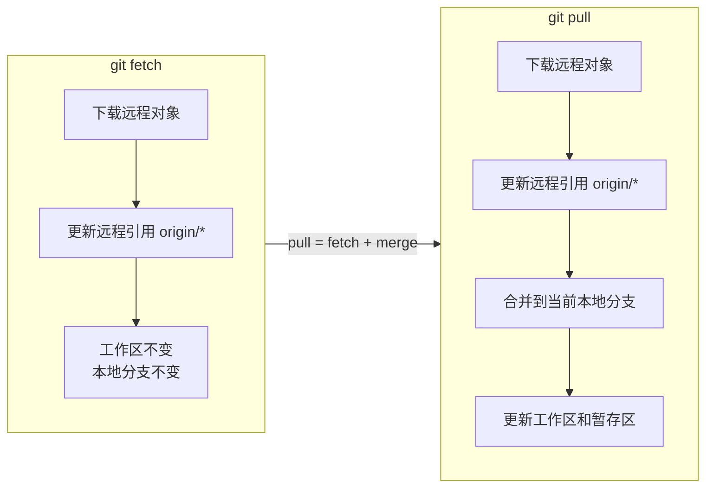
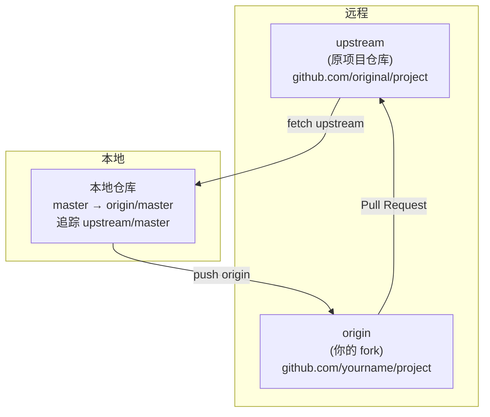
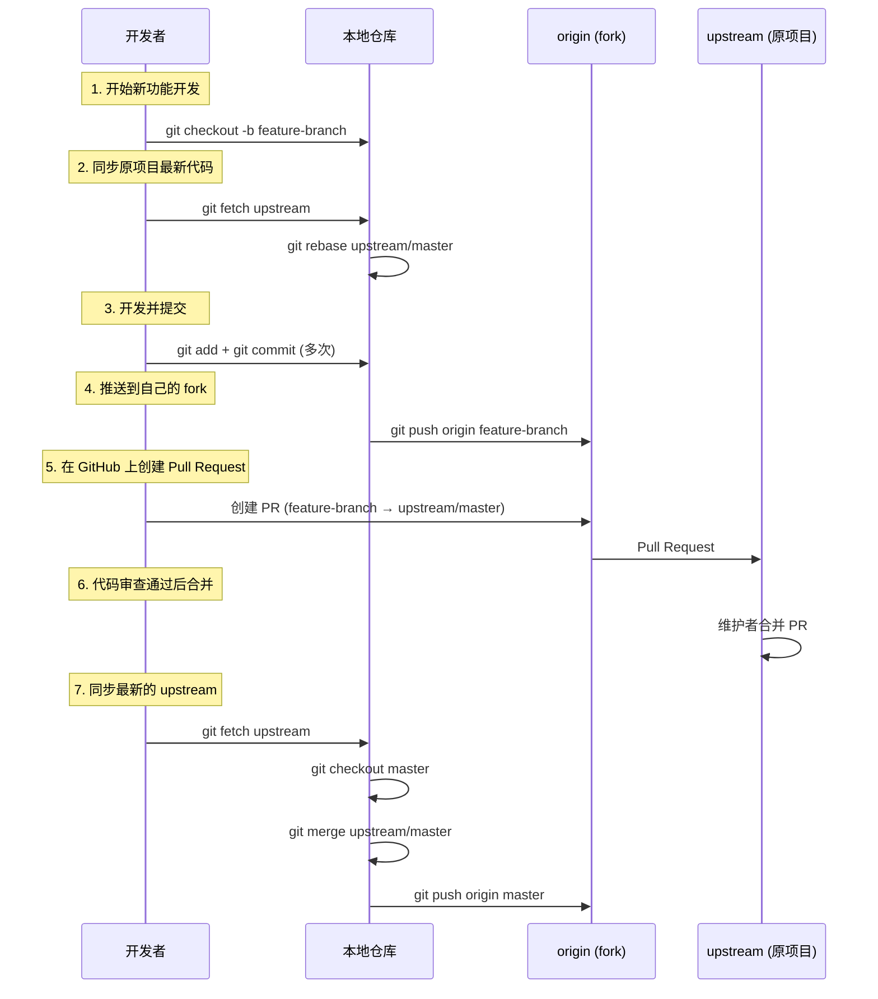

# 远程仓库与同步

Git 是分布式版本控制系统，每个开发者的本地仓库都是一个完整的版本库。但协作需要沟通——你需要把本地提交分享给他人，也需要获取他人的最新工作。远程仓库（Remote Repository）就是这种沟通的桥梁。本节将深入讲解远程仓库的核心概念、操作命令，以及 `fetch`、`pull`、`push` 三大同步命令的原理与最佳实践。

---

## 1. 远程仓库的概念

### 1.1 什么是远程仓库

远程仓库是托管在网络上的版本库，它可以是 GitHub、GitLab、Bitbucket 等平台上的仓库，也可以是你自己搭建的 Git 服务器。远程仓库的核心作用是作为团队协作的中转站：每个人把本地提交推送到远程，再从远程拉取他人的提交。

但需要理解一个关键点：**远程仓库和本地仓库在数据结构上没有本质区别**。它们都包含完整的对象数据库（objects）和引用（refs），区别仅在于"谁在哪儿"——本地仓库在你本机，远程仓库在网络上。

### 1.2 remote 与 origin

Git 用 **remote** 来管理远程仓库的连接信息。一个本地仓库可以关联多个远程仓库，每个远程仓库有一个简短的名称（shortname）用于标识。

当你执行 `git clone` 时，Git 会自动将克隆的源仓库命名为 **origin**：

```bash
$ git clone https://github.com/user/project.git
# Git 自动创建名为 origin 的 remote，指向该 URL
```

**origin 不是特殊关键字**，它只是一个默认名称。你可以自由改名或添加其他 remote。之所以叫 origin，是因为它通常是"原始"仓库——你从中克隆出来的那个仓库。

### 1.3 远程引用（Remote Refs）

Git 在本地保存了远程仓库的分支信息，称为**远程引用**（remote refs）。它们存储在 `.git/refs/remotes/` 目录下：

```
.git/refs/remotes/
└── origin/
    ├── HEAD
    ├── master
    └── feature
```

远程引用的完整写法是 `remotes/origin/master`，但日常使用中常简写为 `origin/master`。**这些引用指向的是远程仓库上各分支最后一次已知的位置**，它们不会自动更新——只有当你执行 `git fetch` 或 `git pull` 时才会更新。

这一点至关重要：`origin/master` 反映的不是远程仓库的**实时**状态，而是你**上次同步时**远程仓库的状态。

```mermaid
gitgraph
   commit id: "A"
   commit id: "B"
   commit id: "C" tag: "master (本地)"
   branch "origin/master"
   checkout main
   commit id: "D"
   commit id: "E" tag: "master (本地最新)"
```

上图中，本地 `master` 已经推进到 E，而 `origin/master` 仍停留在 C（上次 fetch 时的位置）。D 和 E 是尚未推送到远程的本地提交。

---

## 2. git remote：管理远程仓库

### 2.1 查看远程仓库

```bash
# 列出所有远程仓库的简写
$ git remote
origin

# 显示远程仓库的详细信息（包括 URL 和追踪的分支）
$ git remote -v
origin  https://github.com/user/project.git (fetch)
origin  https://github.com/user/project.git (push)
```

注意 `git remote -v` 会为每个 remote 显示两行——fetch URL 和 push URL。大多数情况下两者相同，但 Git 允许你为拉取和推送设置不同的 URL（只读镜像仓库就是一例）。

查看某个 remote 的更详细信息：

```bash
$ git remote show origin
* remote origin
  Fetch URL: https://github.com/user/project.git
  Push  URL: https://github.com/user/project.git
  HEAD branch: master
  Remote branches:
    master  tracked
    feature tracked
  Local branches configured for 'git pull':
    master   merges with remote master
  Local refs configured for 'git push':
    master   pushes to master   (up to date)
```

这条命令会显示远程分支列表、本地分支与远程分支的追踪关系、推送状态等，是排查远程连接问题的利器。

### 2.2 添加远程仓库

除了 `clone` 自动创建的 origin，你可以手动添加其他远程仓库：

```bash
# 基本格式
$ git remote add <shortname> <url>

# 示例：添加一个上游仓库
$ git remote add upstream https://github.com/original/project.git
```

添加后，就可以用 `upstream` 这个短名来代替完整的 URL：

```bash
$ git fetch upstream
# 等同于 git fetch https://github.com/original/project.git
```

### 2.3 修改与删除远程仓库

```bash
# 重命名 remote
$ git remote rename old-name new-name
$ git remote rename origin github-origin

# 修改 remote 的 URL（常用于从 HTTPS 切换到 SSH）
$ git remote set-url origin git@github.com:user/project.git

# 删除 remote（断开与远程仓库的连接，不影响本地提交）
$ git remote remove upstream
```

> **注意**：删除 remote 后，所有基于该 remote 的远程追踪分支（如 `upstream/master`）也会被清理。但你的本地分支和提交不受影响。

---

## 3. git fetch：下载远程对象与引用

### 3.1 fetch 做了什么

`git fetch` 从远程仓库下载本地缺少的对象（commits、trees、blobs），并更新远程引用，**但绝不修改你的工作区和本地分支**。

```bash
# 从 origin 拉取所有分支的更新
$ git fetch origin

# 只拉取特定分支
$ git fetch origin master

# 拉取所有远程仓库的更新
$ git fetch --all
```

fetch 的核心原则是**安全第一**：它只更新 `origin/*` 这些远程引用，你的 `HEAD`、工作区、暂存区都不会被触碰。你可以先 fetch 看看远程有什么新内容，再决定是否合并。

### 3.2 fetch 前后引用变化的 Mermaid 图

假设远程仓库有新的提交 C4、C5，而你的本地 `master` 停留在 C3，`origin/master` 也停留在 C3：

```mermaid
gitgraph
   commit id: "C1"
   commit id: "C2"
   commit id: "C3" tag: "master"
   branch "origin/master"
```

**fetch 之前**：本地 `master` 和 `origin/master` 都指向 C3。

执行 `git fetch origin` 后，远程的 C4、C5 被下载到本地，`origin/master` 引用前进到 C5，但本地 `master` 仍在 C3：

```mermaid
gitgraph
   commit id: "C1"
   commit id: "C2"
   commit id: "C3" tag: "master → C3"
   branch "origin/master"
   checkout "origin/master"
   commit id: "C4"
   commit id: "C5" tag: "origin/master → C5"
```

**fetch 之后**：`origin/master` 前进到 C5，本地 `master` 不动，工作区不变。

### 3.3 fetch 的内部过程



fetch 使用了 Git 的**智能协议**（smart protocol）进行协商：本地告诉远程"我有哪些对象"（have），远程据此计算出"你需要哪些对象"（want），只传输差量数据。这比下载整个仓库高效得多。


### 3.4 查看 fetch 到的内容

fetch 之后，你可以用多种方式查看远程的新提交：

```bash
# 查看 origin/master 相对于本地 master 的新提交
$ git log master..origin/master

# 查看差异
$ git diff master..origin/master

# 查看远程分支列表
$ git branch -r
  origin/master
  origin/feature

# 查看所有分支（本地 + 远程）
$ git branch -a
* master
  remotes/origin/master
  remotes/origin/feature
```

> **提示**：你可以直接 checkout 远程引用来查看代码，这会进入"detached HEAD"状态，但不会影响任何分支：
> ```bash
> $ git checkout origin/master
> # 查看完毕后切回本地分支
> $ git checkout master
> ```

---

## 4. git pull：fetch + merge 的组合

### 4.1 pull 的本质

`git pull` 等价于依次执行两个操作：

1. `git fetch` —— 从远程仓库下载最新数据
2. `git merge` —— 将远程分支合并到当前本地分支

```bash
# 基本用法（当前分支已设置上游时）
$ git pull

# 等价于
$ git fetch origin
$ git merge origin/master  # 假设当前在 master 分支，上游是 origin/master
```

### 4.2 pull 的完整流程 Mermaid 序列图



### 4.3 pull 的变体：rebase 模式

默认情况下，`git pull` 使用 merge 策略。但你也可以使用 rebase 策略：

```bash
# 使用 rebase 代替 merge
$ git pull --rebase

# 等价于
$ git fetch origin
$ git rebase origin/master
```

rebase 模式会将你的本地提交"变基"到远程最新提交之上，产生线性历史，避免产生合并提交。这在团队协作中常被推荐，因为它让提交历史更清晰。

你也可以配置默认使用 rebase：

```bash
# 对当前仓库设置
$ git config pull.rebase true

# 全局设置
$ git config --global pull.rebase true
```

### 4.4 pull 可能遇到的问题

**工作区有未提交的修改**：如果 pull 需要更新的文件与工作区修改的文件冲突，Git 会拒绝 pull：

```bash
$ git pull
error: Your local changes to the following files would be overwritten by merge:
        src/main.js
Please commit your changes or stash them before you merge.
```

解决方案：先 `stash` 或 `commit` 本地修改，再 pull。

**合并冲突**：当远程和本地修改了同一文件的同一区域时，merge 会产生冲突，需要手动解决：

```bash
$ git pull
CONFLICT (content): Merge conflict in src/main.js
Automatic merge failed; fix conflicts and then commit the result.
```

解决步骤：
1. 打开冲突文件，手动选择保留的内容
2. `git add` 标记冲突已解决
3. `git commit` 完成合并

---

## 5. git push：推送本地提交到远程

### 5.1 push 的基本用法

```bash
# 推送当前分支到对应的上游分支
$ git push

# 推送指定分支到指定远程仓库
$ git push origin master

# 推送所有本地分支
$ git push --all origin

# 推送标签
$ git push origin v1.0
$ git push origin --tags   # 推送所有标签
```

### 5.2 push 的协商过程

push 并非简单地上传文件，它也使用了智能协议进行协商：



### 5.3 non-fast-forward 错误

这是 push 最常见的错误场景：远程仓库有你本地没有的提交，你的推送不是快进（fast-forward），Git 拒绝推送以保护他人的工作。

```bash
$ git push origin master
To https://github.com/user/project.git
 ! [rejected]        master -> master (non-fast-forward)
error: failed to push some refs to 'https://github.com/user/project.git'
hint: Updates were rejected because the tip of your current branch is behind
hint: its remote counterpart. Integrate the remote changes (e.g.
hint: 'git pull ...') before pushing again.
```

**为什么拒绝？** 因为如果允许这种推送，远程上已有的提交会被"覆盖"，导致其他协作者的工作丢失。Git 的设计哲学是：宁可拒绝，也不丢数据。

**正确的解决流程**：



```bash
# 第一步：拉取并合并远程更新
$ git pull origin master

# 如果有冲突，解决后：
$ git add .
$ git commit

# 第二步：再次推送
$ git push origin master
```


### 5.4 强制推送（force push）

在某些场景下（如 rebase 后、修复错误提交后），你可能确实需要覆盖远程历史。这时可以使用 `--force`：

```bash
# 危险：强制推送，覆盖远程历史
$ git push --force origin master

# 更安全：只有当远程引用指向你预期的 commit 时才强制推送
$ git push --force-with-lease origin master
```

> **强烈建议**：永远优先使用 `--force-with-lease` 而非 `--force`。`--force-with-lease` 会检查远程分支是否被他人更新过——如果有人在你 rebase 期间推送了新提交，`--force-with-lease` 会拒绝推送，保护他人的工作不被意外覆盖。而 `--force` 则是无条件覆盖，可能造成数据丢失。
>
> **绝对不要**对公共分支（如 master/main）执行 force push，除非团队有明确约定。

---

## 6. fetch vs pull 的对比

`fetch` 和 `pull` 都从远程获取数据，但行为有本质区别：



| 维度 | git fetch | git pull |
|------|-----------|----------|
| 下载远程数据 | 是 | 是 |
| 更新远程引用 | 是 | 是 |
| 修改本地分支 | **否** | **是** |
| 修改工作区 | **否** | **是** |
| 可能产生合并冲突 | **否** | 是 |
| 安全性 | 高（只读操作） | 中（可能引入冲突） |
| 适用场景 | 查看远程更新、审查代码后再决定合并 | 确信远程更新无冲突时快速同步 |

**最佳实践建议**：

- 在不确定远程有什么变化时，先用 `fetch` 查看再决定是否合并
- 在 CI/CD 脚本中，优先使用 `fetch` 而非 `pull`，避免自动合并带来的不确定性
- 日常开发中，如果确定要同步远程更新，`pull` 更便捷
- 使用 `git pull --rebase` 保持线性历史

---

## 7. 上游分支（upstream）与追踪关系

### 7.1 什么是追踪关系

追踪关系（tracking relationship）是本地分支和远程分支之间的关联。当一个本地分支追踪了某个远程分支时，该远程分支称为本地分支的**上游分支**（upstream branch）。

追踪关系带来的便利：
- `git pull` / `git push` 无需指定远程仓库和分支名
- `git status` 能显示本地分支与上游分支的领先/落后状态
- `git branch -vv` 能查看追踪关系和同步状态

### 7.2 追踪关系的建立

**自动建立**：`git clone` 后，本地 `master` 自动追踪 `origin/master`。`git checkout` 一个远程分支时也会自动建立追踪：

```bash
# 检出远程分支 feature，自动创建本地分支并追踪
$ git checkout feature
branch 'feature' set up to track 'origin/feature'.
Switched to a new branch 'feature'
```

**手动设置**：

```bash
# 方法一：推送时设置上游
$ git push -u origin feature
# 或
$ git push --set-upstream origin feature

# 方法二：为已有分支设置上游
$ git branch -u origin/feature
# 或
$ git branch --set-upstream-to=origin/feature

# 方法三：创建分支时指定上游
$ git checkout -b feature origin/feature
```

### 7.3 查看追踪状态

```bash
# 查看所有分支的追踪关系和同步状态
$ git branch -vv
* master    8e3a2f1 [origin/master] Add login feature
  feature   3b7c1d0 [origin/feature: ahead 2, behind 1] Implement search
  hotfix    a1b2c3d Fix critical bug

# git status 也会显示追踪状态
$ git status
On branch master
Your branch is ahead of 'origin/master' by 2 commits.
  (use "git push" to publish your local commits)
```

`ahead 2, behind 1` 表示本地分支比上游分支领先 2 个提交、落后 1 个提交。

### 7.4 取消追踪关系

```bash
# 取消当前分支的上游设置
$ git branch --unset-upstream

# 取消指定分支的上游设置
$ git branch --unset-upstream feature
```

---

## 8. 多远程仓库场景：fork + upstream 模式

### 8.1 为什么需要多远程仓库

在开源项目协作中，最常见的模式是 **fork + upstream**：

1. 你 fork 了原项目到自己的 GitHub 账号下
2. 你从自己的 fork 克隆到本地开发
3. 你需要从原项目（upstream）获取最新更新
4. 你通过 Pull Request 将修改贡献回原项目

这种模式下，你的本地仓库需要同时连接两个远程仓库。

### 8.2 配置 fork + upstream



```bash
# 第一步：从你的 fork 克隆
$ git clone https://github.com/yourname/project.git
$ cd project

# 第二步：添加原项目为 upstream
$ git remote add upstream https://github.com/original/project.git

# 验证
$ git remote -v
origin    https://github.com/yourname/project.git (fetch)
origin    https://github.com/yourname/project.git (push)
upstream  https://github.com/original/project.git (fetch)
upstream  https://github.com/original/project.git (push)
```


### 8.3 日常工作流程



详细步骤：

```bash
# 1. 从 upstream 获取最新代码
$ git fetch upstream

# 2. 将本地 master 更新到 upstream/master
$ git checkout master
$ git merge upstream/master
# 或使用 rebase 保持线性历史
$ git rebase upstream/master

# 3. 创建功能分支开发
$ git checkout -b feature-branch

# 4. 开发完成后推送到 origin（你的 fork）
$ git push -u origin feature-branch

# 5. 在 GitHub 上从 origin/feature-branch 向 upstream/master 发起 Pull Request

# 6. PR 被合并后，同步 upstream 并更新 origin
$ git fetch upstream
$ git checkout master
$ git merge upstream/master
$ git push origin master

# 7. 清理已合并的功能分支
$ git branch -d feature-branch
$ git push origin --delete feature-branch
```

### 8.4 保持 fork 与 upstream 同步的技巧

随着时间推移，你的 fork 的 master 可能会落后于 upstream 很多。定期同步是良好习惯：

```bash
# 方法一：merge（保留完整历史）
$ git fetch upstream
$ git checkout master
$ git merge upstream/master
$ git push origin master

# 方法二：rebase（保持线性历史，推荐）
$ git fetch upstream
$ git checkout master
$ git rebase upstream/master
$ git push origin master

# 方法三：直接重置到 upstream（慎用，会丢失 fork 上的独有提交）
$ git fetch upstream
$ git checkout master
$ git reset --hard upstream/master
$ git push origin master --force
```

### 8.5 多远程仓库的引用管理

添加多个 remote 后，远程引用会按 remote 名称组织：

```bash
# 查看所有远程分支
$ git branch -r
  origin/master
  origin/feature
  upstream/master
  upstream/develop

# 比较不同 remote 的同一分支
$ git diff origin/master upstream/master

# 从 upstream 的特定分支创建本地分支
$ git checkout -b local-develop upstream/develop
```

---

## 9. 小结

### 核心概念回顾

| 概念 | 说明 |
|------|------|
| remote | 远程仓库的连接配置，包含名称和 URL |
| origin | 默认的 remote 名称，clone 时自动创建 |
| 远程引用 (origin/master) | 本地保存的远程分支位置，fetch 时更新 |
| 上游分支 (upstream) | 本地分支追踪的远程分支 |
| fetch | 下载远程数据，只更新远程引用，不改变工作区 |
| pull | fetch + merge，同步远程更新到本地分支 |
| push | 将本地提交推送到远程，需满足快进条件 |

### 命令速查

```bash
# 远程仓库管理
git remote -v                          # 查看所有远程仓库
git remote add <name> <url>            # 添加远程仓库
git remote remove <name>               # 删除远程仓库
git remote set-url <name> <new-url>    # 修改远程仓库 URL

# 同步操作
git fetch <remote>                     # 下载远程数据（安全，不修改工作区）
git pull                               # fetch + merge（可能产生合并提交）
git pull --rebase                      # fetch + rebase（保持线性历史）
git push <remote> <branch>             # 推送本地提交到远程
git push --force-with-lease            # 安全的强制推送

# 追踪关系
git branch -u <remote>/<branch>        # 设置上游分支
git branch -vv                         # 查看追踪关系和同步状态
git push -u origin <branch>            # 推送并设置上游
```

### 关键原则

1. **先 fetch 再决定**：不确定远程变化时，用 fetch 查看后再 merge，比直接 pull 更安全可控
2. **理解 non-fast-forward**：push 被拒绝不是错误，而是 Git 在保护协作者的数据
3. **优先使用 --force-with-lease**：需要强制推送时，永远用 `--force-with-lease` 替代 `--force`
4. **fork + upstream 模式**：开源协作的标准模式，掌握多 remote 操作是参与开源项目的基础
5. **远程引用是快照**：`origin/master` 不是实时的，它反映的是你上次 fetch 时的状态

