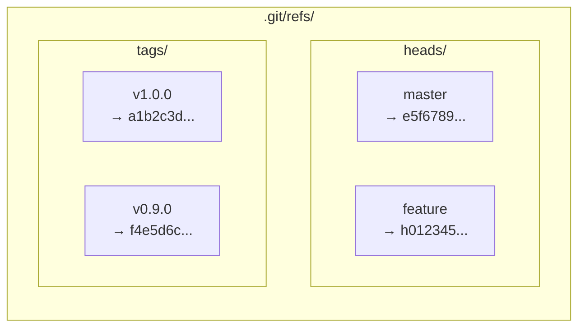
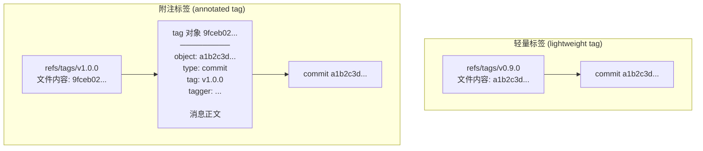
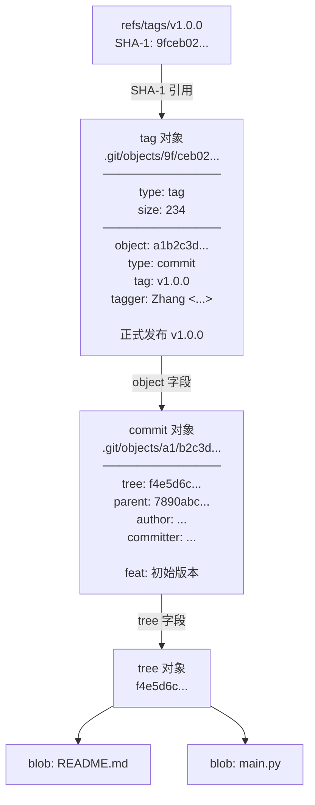
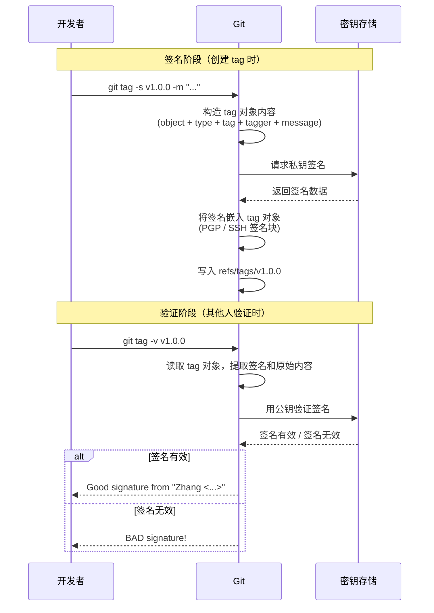
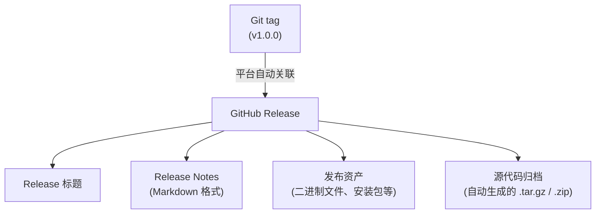
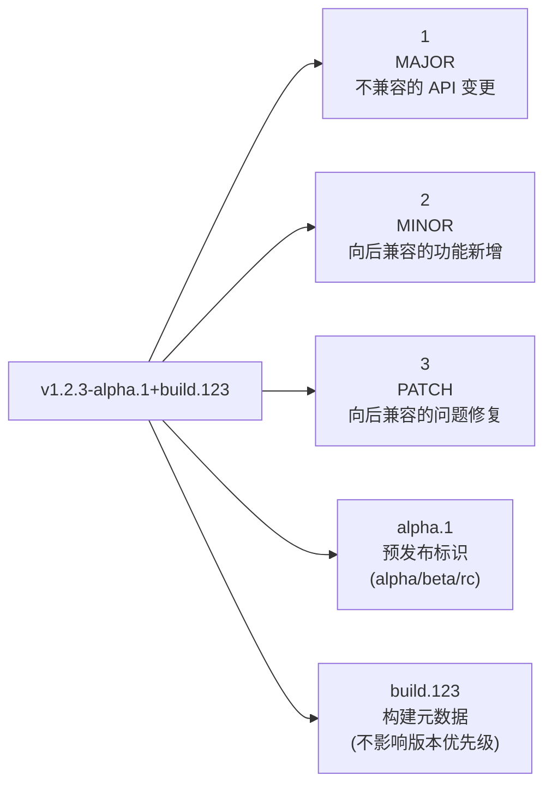

# 标签 tag：给重要 commit 打上永久书签

在项目开发过程中，有些 commit 具有特殊意义——比如 v1.0.0 正式发布、v2.1.0 里程碑达成。你当然可以用一个 branch 指向这些 commit，但 branch 是会移动的，它并不适合充当一个"永久锚点"。Git 提供了一种专门的机制来满足这个需求：**tag（标签）**。

## tag 与 branch 的核心区别

tag 和 branch 在底层都是"引用"，都指向某个 commit，但它们的行为有本质区别：

| 特性 | tag | branch |
|------|-----|--------|
| 可移动性 | **不可移动**——创建后永远指向同一个 commit | **可移动**——每次提交自动前移到新 commit |
| 语义 | 标记历史中的某个固定点（快照） | 代表一条开发线（动态前进） |
| 典型用途 | 版本发布、里程碑标记 | 功能开发、bug 修复 |
| 存储位置 | `.git/refs/tags/` | `.git/refs/heads/` |

用一个直观的比喻：**branch 像是书签夹在"你正在读的那一页"，每次翻页它跟着走；tag 像是你在某一页上用荧光笔写下的批注，永远留在那一页，不会移动。**

```mermaid
gitgraph
  commit id: "A"
  commit id: "B"
  commit id: "C" tag: "v1.0.0"
  commit id: "D"
  commit id: "E" tag: "v1.1.0"
  commit id: "F" type: REVERSE
  branch feature
  commit id: "G"
  commit id: "H"
```

上图中，`v1.0.0` 和 `v1.1.0` 是 tag，它们分别永远钉在 C 和 E 上；而 `feature` 是 branch，随着新提交 G、H 的产生，它不断前移。

关键点：**即使你在 tag 所指向的 commit 之后继续开发，tag 也不会跟着移动。** 这正是 tag 存在的意义——它为历史提供了一个不可变的参照点。

## 轻量标签（lightweight tag）

轻量标签是最简单的标签形式，它**仅仅是一个指向某个 commit 的引用文件**，不包含任何额外信息。

### 创建轻量标签

```shell
git tag v1.0.0
```

就这么简单——不需要 `-a`，不需要 `-m`，只需要一个名字。此时 `.git/refs/tags/v1.0.0` 文件的内容就是它所指向的 commit 的 SHA-1 值：

```shell
cat .git/refs/tags/v1.0.0
# 输出类似：a1b2c3d4e5f6789012345678901234567890abcd
```

### 轻量标签的本质

轻量标签的底层存储和 branch 几乎一模一样——一个文本文件，里面写着一个 40 字符的 SHA-1 值。区别仅在于：

- branch 的文件存放在 `.git/refs/heads/` 目录下
- 轻量标签的文件存放在 `.git/refs/tags/` 目录下
- branch 的引用会在提交时自动前移，tag 的引用不会



轻量标签适合个人项目或临时标记，但由于不包含创建者、日期、说明等信息，在正式项目中**不推荐**使用轻量标签来标记发布版本。

## 附注标签（annotated tag）

附注标签是 Git 推荐的标签方式。它不仅仅是一个引用，而是一个**独立的 Git 对象**，存储在 Git 的对象数据库中，包含丰富的元数据。

### 创建附注标签

```shell
git tag -a v1.0.0 -m "正式发布 v1.0.0 版本"
```

- `-a`：表示创建 annotated tag
- `-m`：标签消息，类似于 commit message

如果不加 `-m`，Git 会打开编辑器让你输入标签消息，和 commit 的行为一致。

### 附注标签的内部结构

附注标签创建后，`.git/refs/tags/v1.0.0` 文件的内容**不再是直接指向 commit 的 SHA-1，而是指向一个 tag 对象的 SHA-1**。这个 tag 对象再指向目标 commit。

可以用 `git cat-file -p` 来查看 tag 对象的内部结构：

```shell
# 先找到 tag 对象的 SHA-1
cat .git/refs/tags/v1.0.0
# 输出：9fceb02d0ae598e3dc0e02f8fba6e2c3a4b5d6e7

# 查看 tag 对象的内容
git cat-file -p 9fceb02d
```

输出类似：

```
object a1b2c3d4e5f6789012345678901234567890abcd
type commit
tag v1.0.0
tagger Zhang San <zhang@example.com> 1700000000 +0800

正式发布 v1.0.0 版本
```

各字段含义：

| 字段 | 含义 |
|------|------|
| `object` | tag 指向的目标对象（通常是 commit）的 SHA-1 |
| `type` | 目标对象的类型（通常是 `commit`） |
| `tag` | 标签名称 |
| `tagger` | 创建标签的人（姓名 + 邮箱） |
| 时间戳 | 创建标签的时间（Unix 时间戳 + 时区） |
| 空行之后 | 标签消息正文 |

### 轻量标签 vs 附注标签的存储对比



核心区别一目了然：

- **轻量标签**：引用文件 → 直接指向 commit（一步到位）
- **附注标签**：引用文件 → 指向 tag 对象 → 再指向 commit（多一层间接）

这多出来的一层，正是附注标签能携带作者、日期、消息等元数据的原因——tag 对象本身就是一个完整的 Git 对象，有自己的 SHA-1、类型和内容。

### 查看标签详细信息

```shell
# 查看某个标签的详细信息（附注标签会显示完整元数据）
git show v1.0.0

# 仅查看标签本身的信息（不显示指向的 commit 的 diff）
git cat-file -p v1.0.0
```

对于轻量标签，`git show` 只会显示它指向的 commit 的信息，因为轻量标签本身没有额外数据。

## tag 的底层存储

### refs/tags/ 目录结构

所有标签的引用都存储在 `.git/refs/tags/` 目录下：

```
.git/refs/tags/
├── v0.9.0          # 轻量标签，内容为 commit SHA-1
├── v1.0.0          # 附注标签，内容为 tag 对象 SHA-1
├── v1.1.0
└── release/
    └── 2024-01     # 带层级的标签名（用 / 分隔）
```

标签名中如果包含 `/`，Git 会在 `refs/tags/` 下创建对应的子目录。例如 `release/2024-01` 会存储在 `.git/refs/tags/release/2024-01`。

> 注意：当引用数量较多时，Git 可能会将 refs 打包到 `.git/packed-refs` 文件中以节省空间。此时 `.git/refs/tags/` 下可能看不到某些标签文件，但 `git tag -l` 依然能正常列出。新创建的标签会先写入 `refs/tags/`，在下次 `git gc` 或 `git pack-refs` 时被合并到 `packed-refs` 中。

### tag 对象在 Git 对象库中的位置

tag 对象和 commit 对象、tree 对象、blob 对象一样，都存储在 `.git/objects/` 目录下，按照 SHA-1 值的前两位作为子目录、后 38 位作为文件名：

```
.git/objects/
├── 9f/
│   └── ceb02d0ae598e3dc0e02f8fba6e2c3a4b5d6e7   # tag 对象
├── a1/
│   └── b2c3d4e5f6789012345678901234567890abcd  # commit 对象
└── ...
```

### 完整的 tag 引用链路



## 签名标签

在正式的项目发布流程中，仅仅给 commit 打一个 tag 还不够——你怎么证明这个 tag 确实是你打的，而不是有人冒充你打的？Git 提供了**签名标签**机制来解决这个问题。

签名标签在附注标签的基础上，额外附加了一个密码学签名。任何人都可以用你的公钥来验证这个标签的真实性和完整性。


### GPG 签名标签

GPG（GNU Privacy Guard）是 Git 最早支持的签名方式，也是最广泛使用的。

#### 配置 GPG 签名

```shell
# 1. 生成 GPG 密钥（如果还没有）
gpg --full-generate-key

# 2. 列出你的 GPG 密钥，获取密钥 ID
gpg --list-secret-keys --keyid-format=long
# 输出类似：
# sec   rsa4096/ABCD1234ABCD5678 2024-01-01 [SC]
# uid                          Zhang San <zhang@example.com>

# 3. 告诉 Git 使用哪个 GPG 密钥
git config user.signingkey ABCD1234ABCD5678

# 4.（可选）让所有标签默认使用签名
git config tag.gpgSign true
```

#### 创建 GPG 签名标签

```shell
git tag -s v1.0.0 -m "正式发布 v1.0.0 版本"
```

`-s` 选项表示使用 GPG 签名。Git 会调用 GPG 对标签内容进行签名，签名结果嵌入到 tag 对象中。

签名后的 tag 对象内容会在消息正文之后附带一段 PGP 签名块（与 commit 对象将签名存放在 `gpgsig` 头部不同，tag 对象的签名直接追加在对象内容末尾）：

```
object a1b2c3d4e5f6789012345678901234567890abcd
type commit
tag v1.0.0
tagger Zhang San <zhang@example.com> 1700000000 +0800

正式发布 v1.0.0 版本

-----BEGIN PGP SIGNATURE-----

iQIzBAABCAAdFiEEabcd1234...
...多行 Base64 编码的签名数据...
-----END PGP SIGNATURE-----
```

#### 验证 GPG 签名

```shell
# 验证单个标签
git tag -v v1.0.0

# 输出类似：
# object a1b2c3d4e5f6789012345678901234567890abcd
# type commit
# tag v1.0.0
# tagger Zhang San <zhang@example.com>
# Good signature from "Zhang San <zhang@example.com>"
```

如果签名验证失败，Git 会输出 `BAD signature` 警告。

### SSH 签名标签（Git 2.34+）

从 Git 2.34 开始，Git 原生支持使用 SSH 密钥对标签进行签名。对于已经配置了 SSH 密钥的 GitHub/GitLab 用户来说，这比 GPG 更加方便——你不需要额外安装和维护 GPG 密钥。

#### 配置 SSH 签名

```shell
# 1. 生成 SSH 签名密钥（如果还没有合适的）
ssh-keygen -t ed25519 -C "zhang@example.com" -f ~/.ssh/id_ed25519_signing

# 2. 告诉 Git 使用 SSH 签名
git config gpg.format ssh

# 3. 指定 SSH 签名密钥路径
git config user.signingkey ~/.ssh/id_ed25519_signing.pub

# 4.（可选）让所有标签默认使用签名
git config tag.gpgSign true
```

> 注意：虽然配置项名称中仍然包含 "gpg"（如 `gpg.format`、`tag.gpgSign`），这是历史遗留的命名。当 `gpg.format` 设为 `ssh` 时，Git 实际使用的是 SSH 签名。

#### 创建 SSH 签名标签

```shell
git tag -s v1.0.0 -m "正式发布 v1.0.0 版本"
```

命令和 GPG 签名完全一样——`-s` 选项会根据 `gpg.format` 的配置自动选择签名方式。

#### 配置允许的签名者

验证 SSH 签名时，Git 需要知道哪些公钥是可信的。你需要创建一个"允许的签名者"文件：

```shell
# 创建允许的签名者文件
echo "zhang@example.com ssh-ed25519 AAAAC3NzaC1lZDI1NTE5AAAAI..." >> ~/.ssh/allowed_signers

# 告诉 Git 这个文件的位置
git config gpg.ssh.allowedSignersFile ~/.ssh/allowed_signers
```

`allowed_signers` 文件的格式与 SSH 的 `authorized_keys` 类似，每行一个公钥，格式为：

```
邮箱 公钥类型 公钥内容
```

#### 验证 SSH 签名

```shell
git tag -v v1.0.0
# 输出类似：
# Good "git" signature for zhang@example.com with ED25519 key SHA256:abcd1234...
```

### 签名验证流程



### GPG 签名 vs SSH 签名对比

| 特性 | GPG 签名 | SSH 签名 |
|------|----------|----------|
| 最低 Git 版本 | 标签签名 1.4.0+，提交签名 1.7.9+ | 2.34+ |
| 密钥管理 | 需要维护 GPG 密钥环 | 复用已有的 SSH 密钥 |
| 信任模型 | Web of Trust（信任网络） | allowedSignersFile（显式列表） |
| GitHub 支持 | 支持，显示 "Verified" 标记 | 支持，显示 "Verified" 标记 |
| 配置复杂度 | 较高（需安装 GPG、生成密钥、上传公钥） | 较低（大多数开发者已有 SSH 密钥） |
| 签名形式 | PGP 签名块（附于 tag 对象末尾） | SSH 签名块（附于 tag 对象末尾） |
| 适用场景 | 传统项目、需要 Web of Trust | 新项目、已有 SSH 基础设施 |

## tag 与 release 的关系

在 GitHub 和 GitLab 等平台上，tag 和 release 是两个经常被混淆的概念。它们的关系可以概括为：**tag 是 Git 原生概念，release 是平台在 tag 之上构建的附加功能。**

### GitHub 中的 tag 与 release



核心要点：

1. **每个 release 必须关联一个 tag**——你不能在没有 tag 的情况下创建 release。
2. **但不是每个 tag 都必须是 release**——你可以创建纯 tag 而不发布 release。
3. **在 GitHub 上创建 release 时，平台会自动创建对应的 tag**（如果 tag 不存在的话）。
4. **release 可以携带额外的发布资产**（编译好的二进制文件、安装包等），这是纯 tag 做不到的。

### 创建 GitHub Release 的方式

**方式一：通过 GitHub Web 界面**

在仓库的 "Releases" 页面点击 "Draft a new release"，选择或创建 tag，填写 Release Notes，上传资产文件。

**方式二：通过 GitHub CLI**

```shell
# 创建 release（会自动创建 tag）
gh release create v1.0.0 \
  --title "v1.0.0 正式发布" \
  --notes "## 新功能\n- 功能 A\n- 功能 B\n\n## 修复\n- 修复了问题 C"

# 上传发布资产
gh release upload v1.0.0 ./dist/app-1.0.0.tar.gz ./dist/checksums.txt
```

**方式三：先创建 tag，再基于 tag 创建 release**

```shell
# 先在本地创建 tag 并推送
git tag -a v1.0.0 -m "正式发布 v1.0.0"
git push origin v1.0.0

# 然后基于已推送的 tag 创建 release
gh release create v1.0.0 --title "v1.0.0" --notes "发布说明..."
```

### GitLab 中的 tag 与 release

GitLab 的逻辑与 GitHub 类似，但术语略有不同：

- GitLab 中 release 可以通过 `.gitlab-ci.yml` 中的 `release` 关键字自动创建
- GitLab 的 release 同样必须关联一个 tag
- GitLab 支持在 release 中添加里程碑（Milestone）关联


### tag 与 release 的选择策略

| 场景 | 使用 tag | 使用 release |
|------|----------|-------------|
| 标记内部里程碑 | 推荐 | 不必要 |
| 正式版本发布 | 必须有 | 推荐（附带 Release Notes 和资产） |
| 持续集成中的构建标记 | 推荐 | 可选 |
| 预发布版本（alpha/beta/rc） | 推荐 | 推荐（方便用户下载测试版） |

## 常用操作

### 创建标签

```shell
# 轻量标签——指向当前 HEAD
git tag v1.0.0

# 轻量标签——指向指定 commit
git tag v0.9.0 abc1234

# 附注标签——指向当前 HEAD
git tag -a v1.0.0 -m "正式发布 v1.0.0 版本"

# 附注标签——指向指定 commit
git tag -a v0.9.0 -m "预发布版本" abc1234

# 签名标签（GPG 或 SSH，取决于 gpg.format 配置）
git tag -s v1.0.0 -m "正式发布 v1.0.0 版本"
```

### 查看标签

```shell
# 列出所有标签
git tag

# 按模式筛选标签
git tag -l "v1.*"

# 查看标签详细信息
git show v1.0.0

# 仅查看标签指向的 commit
git rev-parse v1.0.0

# 查看标签类型（commit 还是 tag 对象）
git cat-file -t v1.0.0
# 轻量标签输出：commit
# 附注标签输出：tag
```

### 删除标签

```shell
# 删除本地标签
git tag -d v1.0.0

# 删除远程标签
git push origin --delete v1.0.0
# 或者使用更简洁的语法
git push origin :refs/tags/v1.0.0
```

> 注意：删除本地标签不会自动删除远程标签，反之亦然。两者需要分别操作。

### 推送标签

标签不会随 `git push` 自动推送（这是 Git 的设计——标签是显式的标记，不应被随意推送）。你需要显式推送：

```shell
# 推送单个标签
git push origin v1.0.0

# 推送所有标签
git push origin --tags

# 仅推送附注标签（不推送轻量标签）
git push origin --follow-tags
```

`--follow-tags` 是一个值得关注的选项：它只推送同时满足以下两个条件的标签：

1. 是附注标签（轻量标签不会被推送）
2. 可从本次推送的分支到达（且远程尚不存在该标签）

这个选项比 `--tags` 更安全，可以避免意外推送临时创建的轻量标签。你可以将它设为默认行为：

```shell
# 让 git push 默认使用 --follow-tags 行为
git config push.followTags true
```

### 检出标签

标签不是 branch，你不能直接"切换到"一个标签上进行开发。但你可以查看标签所对应的代码快照：

```shell
# 方式一：查看标签对应的代码（进入 detached HEAD 状态）
git checkout v1.0.0

# 方式二：基于标签创建一个新分支（推荐，可以在上面继续开发）
git checkout -b fix-v1.0.0 v1.0.0
```

方式一会让你进入 **detached HEAD** 状态——HEAD 直接指向一个 commit 而不是 branch。在这种状态下你可以查看代码、运行测试，但不应该直接提交（提交后切换分支会丢失这些提交）。如果你需要在某个标签的基础上进行修复，应该使用方式二创建一个新分支。

### 修改标签

Git 的设计理念是 tag 一旦创建就不应修改。但如果你确实需要（比如标签打错了 commit），只能先删除再重建：

```shell
# 删除旧标签
git tag -d v1.0.0
git push origin :refs/tags/v1.0.0

# 在正确的 commit 上重新创建
git tag -a v1.0.0 -m "正式发布 v1.0.0 版本" correct_commit_hash
git push origin v1.0.0
```

> 警告：修改已推送的标签是一种破坏性操作。如果其他人已经基于这个标签进行了工作，修改标签会导致他们的本地引用与远程不一致。在团队协作中，修改标签前务必与团队成员沟通。

## tag 的命名规范与语义化版本（SemVer）

### 语义化版本（Semantic Versioning）

语义化版本（SemVer）是目前最广泛使用的版本号规范，由 Tom Preston-Werner 于 2011 年提出。其格式为：

```
MAJOR.MINOR.PATCH[-PRERELEASE][+BUILD]
```



版本号递增规则：

- **MAJOR**：当你做了不兼容的 API 修改（破坏性变更）
- **MINOR**：当你做了向后兼容的功能新增
- **PATCH**：当你做了向后兼容的问题修复

预发布版本的优先级低于正式版本：

```
1.0.0-alpha < 1.0.0-beta < 1.0.0-beta.2 < 1.0.0-rc.1 < 1.0.0
```

### tag 命名规范

```shell
# 推荐格式：v + 语义化版本
v1.0.0
v2.1.3
v3.0.0-alpha.1
v3.0.0-beta.2
v3.0.0-rc.1

# 预发布版本常用标识
alpha   # 内部测试版，功能不完整
beta    # 公开测试版，功能基本完整，可能有 bug
rc      # Release Candidate，候选发布版，若无重大问题则成为正式版
```

### 常见的 tag 命名策略

| 策略 | 示例 | 适用场景 |
|------|------|----------|
| v 前缀 + SemVer | `v1.2.3` | 最常见，GitHub/GitLab 生态推荐 |
| 纯 SemVer | `1.2.3` | Go 模块、部分 Java 项目 |
| 日期版本 | `2024.01.15` | 日更/周更的发布周期 |
| 产品名 + 版本 | `myapp-1.2.3` | 多产品共用一个仓库 |
| 带前缀的分层 | `release/1.2.3` | 区分不同类型的标签 |

### 自动化版本号管理

手动管理版本号容易出错，推荐使用工具自动化：

```shell
# 使用 standard-version、release-please 等工具
# （standard-version 已停止维护，新项目可采用 release-please 或 semantic-release）
npx standard-version --release-as minor  # 自动递增 MINOR 版本
```

`git describe` 是一个非常有用的命令，它能基于最近的 tag 自动生成一个描述当前 commit 位置的字符串：

```shell
git describe --tags --abbrev=0  # 最近的 tag 名
git describe --tags              # 完整描述，如 v1.2.0-3-gabc1234
                                  # 含义：距 v1.2.0 有 3 个 commit，当前 commit 简写为 abc1234
```

## 小结

1. **tag 与 branch 的核心区别**：tag 创建后不可移动，永远指向同一个 commit；branch 会随着新提交不断前移。tag 是历史中的"永久锚点"，branch 是"动态指针"。

2. **轻量标签**：仅是一个指向 commit 的引用文件，不包含额外信息，适合临时标记。

3. **附注标签**：是一个独立的 Git 对象，包含作者、日期、消息等元数据，引用文件指向 tag 对象，tag 对象再指向 commit。正式发布推荐使用附注标签。

4. **底层存储**：标签引用存储在 `.git/refs/tags/` 目录下；附注标签的 tag 对象存储在 `.git/objects/` 中，和 commit、tree、blob 对象一样由 SHA-1 索引。

5. **签名标签**：通过 GPG（`-s`）或 SSH（Git 2.34+，`gpg.format=ssh`）对标签进行密码学签名，确保标签的真实性和完整性。验证使用 `git tag -v`。

6. **tag 与 release**：tag 是 Git 原生概念，release 是 GitHub/GitLab 等平台在 tag 之上构建的附加功能。每个 release 必须关联一个 tag，但 tag 不一定需要成为 release。release 可以携带 Release Notes 和发布资产。

7. **常用操作**：
   - 创建：`git tag`（轻量）/ `git tag -a`（附注）/ `git tag -s`（签名）
   - 查看：`git tag -l` / `git show`
   - 删除：`git tag -d`（本地）/ `git push origin --delete`（远程）
   - 推送：`git push origin <tag>` / `git push origin --tags` / `git push origin --follow-tags`

8. **命名规范**：推荐使用 `v` 前缀 + 语义化版本（SemVer），格式为 `vMAJOR.MINOR.PATCH[-PRERELEASE]`。预发布版本使用 `alpha`、`beta`、`rc` 等标识。

