# 传输协议

当你在终端输入 `git clone`、`git fetch` 或 `git push` 时，Git 需要在本地仓库与远程仓库之间传输数据。这看似简单的"上传下载"背后，实际上是一套精心设计的协议体系——从最原始的纯文件下载，到支持增量协商、差量传输的智能协议，Git 为不同的网络环境和安全需求提供了多种传输方案。

理解 Git 的传输协议，不仅有助于排查网络问题、优化仓库性能，更是深入理解 Git 分布式架构的关键一环。

---

## 1. Git 支持的传输协议

Git 支持四种传输协议，每种协议在安全性、性能、认证方式和网络穿透能力上各有侧重。

### 1.1 本地协议（Local Protocol）

本地协议使用本地文件系统路径作为仓库地址：

```bash
# 直接使用路径（硬链接或复制）
git clone /path/to/repo.git

# 使用 file:// 前缀（强制走协议层）
git clone file:///path/to/repo.git
```

这两种写法的行为截然不同：

- **裸路径**（`/path/to/repo.git`）：Git 直接在本地文件系统上操作。如果源仓库和目标仓库在同一文件系统上，Git 会使用硬链接共享对象，效率极高；如果不在同一文件系统，则复制对象。
- **`file://` 前缀**：强制通过 Git 的网络协议层传输数据，如同操作远程仓库。获取的是完全独立的对象副本，不共享存储。

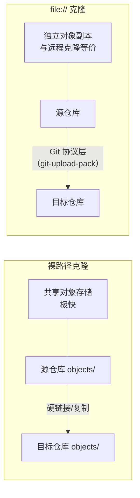

本地协议的典型使用场景：在本地搭建裸仓库作为"远程"中心节点，供同一台机器上的多个工作区共享。

### 1.2 SSH 协议

SSH 是最常用的安全传输协议：

```bash
# 标准 SSH 格式
git clone git@github.com:user/repo.git

# 显式指定端口
git clone ssh://git@github.com:22/user/repo.git

# 使用自定义 SSH key
GIT_SSH_COMMAND="ssh -i ~/.ssh/id_custom" git clone git@github.com:user/repo.git
```

SSH 协议的工作方式：客户端通过 SSH 连接到服务器后，在远程端执行 `git-upload-pack`（用于 fetch/clone）或 `git-receive-pack`（用于 push）命令，然后通过 SSH 通道进行智能协议交互。

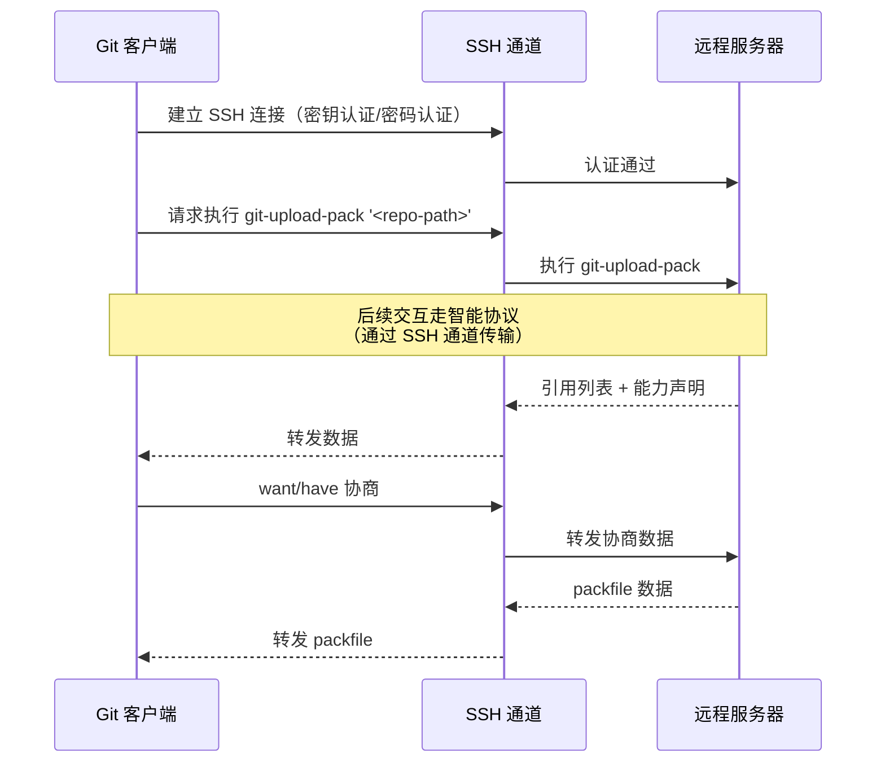

SSH 的优势在于认证与加密一体化——无需额外配置，只要 SSH 连接建立，数据传输就是加密的，身份也是经过验证的。

### 1.3 HTTP/HTTPS 协议

HTTP 协议是穿透防火墙能力最强的协议：

```bash
# HTTPS 克隆
git clone https://github.com/user/repo.git

# HTTP 克隆（不加密，不推荐）
git clone http://github.com/user/repo.git
```

HTTP 协议在 Git 历史上经历了重大演进：

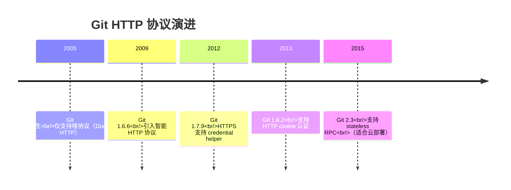

**智能 HTTP 协议**的工作方式：服务端使用一个 CGI 程序 `git-http-backend`，内部调用 `git-upload-pack`（服务 fetch/clone）与 `git-receive-pack`（服务 push），客户端通过 HTTP GET 和 POST 请求完成协议交互。HTTPS 在此基础上增加 TLS 加密层。

HTTP 协议的认证方式多样：基本认证（用户名/密码）、令牌认证（Personal Access Token）、OAuth、Kerberos 等。Git 提供了 `credential helper` 机制来缓存和管理凭据：

```bash
# 使用系统钥匙串缓存凭据（macOS）
git config --global credential.helper osxkeychain

# 使用 libsecret 缓存凭据（Linux）
git config --global credential.helper libsecret

# 使用 Git Credential Manager（Windows）
git config --global credential.helper manager

# 内存缓存（15 分钟后过期）
git config --global credential.helper 'cache --timeout=900'
```

### 1.4 Git 协议（git://）

Git 协议是 Git 自有的专用协议，使用 9418 端口：

```bash
git clone git://github.com/user/repo.git
```

这是四种协议中最快的一种——没有加密和认证的开销，数据传输效率最高。但这也意味着它**没有任何安全机制**：数据明文传输，任何人都可以连接，无法进行 push 操作的权限控制。

Git 协议通常只用于公开仓库的只读镜像，且需要服务器上运行 `git-daemon`：

```bash
# 启动 git-daemon（默认监听 9418 端口）
git daemon --reuseaddr --base-path=/path/to/repos /path/to/repos

# 为特定仓库启用 git:// 访问（需创建标记文件）
touch /path/to/repo.git/git-daemon-export-ok
```

由于安全缺陷，Git 协议在业界的使用越来越少，GitHub 已于 2022 年 3 月停止支持 `git://` 协议。

### 1.5 协议对比总览

| 特性 | 本地协议 | SSH | HTTP/HTTPS | Git 协议 (git://) |
|------|---------|-----|------------|-------------------|
| **安全性** | 取决于文件系统权限 | 高（加密 + 认证） | HTTPS：高（TLS + 认证）；HTTP：低 | 低（无加密、无认证） |
| **性能** | 最高（硬链接/本地 I/O） | 高（加密有少量开销） | 中（HTTP 开销较大） | 最高（无加密开销） |
| **认证方式** | 文件系统权限 | 公钥/密码 | 用户名/密码/令牌/OAuth | 无 |
| **穿透防火墙** | 不适用 | 差（22 端口常被封） | 好（443/80 端口通常开放） | 差（9418 端口常被封） |
| **支持 push** | 是 | 是 | 是 | 通常只读 |
| **协议类型** | 智能协议 | 智能协议 | 智能协议/哑协议 | 智能协议 |
| **典型场景** | 本地开发/测试 | 团队内部协作 | 开源项目/企业环境 | 公开只读镜像 |
| **服务器要求** | 文件系统访问 | SSH 服务 + shell 访问 | Web 服务器 + git-http-backend | git-daemon |

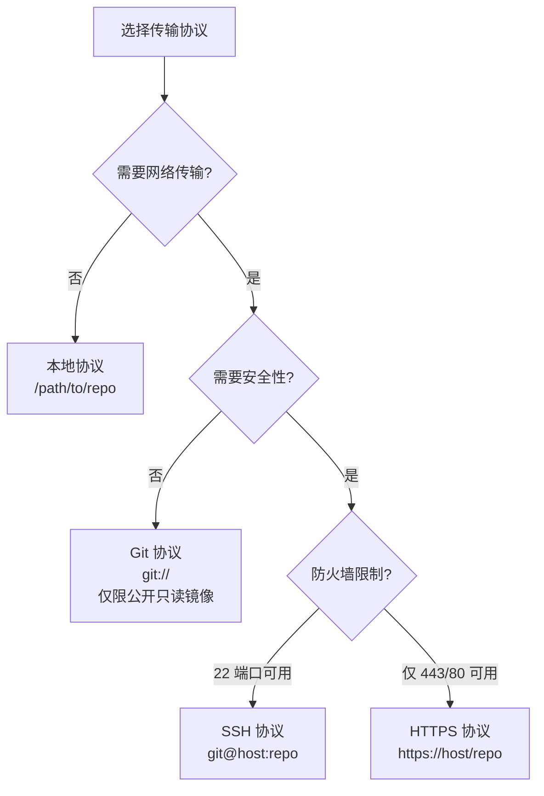

---

## 2. 智能协议 vs 哑协议

Git 的传输协议分为两大类：**哑协议（Dumb Protocol）** 和 **智能协议（Smart Protocol）**。两者的核心区别在于——服务端是否具备"思考"能力。

### 2.1 哑协议（Dumb Protocol）

哑协议是最原始的传输方式，服务端不运行任何 Git 特定的程序，只提供静态文件下载。客户端通过 HTTP GET 请求逐个获取所需文件。

**工作流程**：

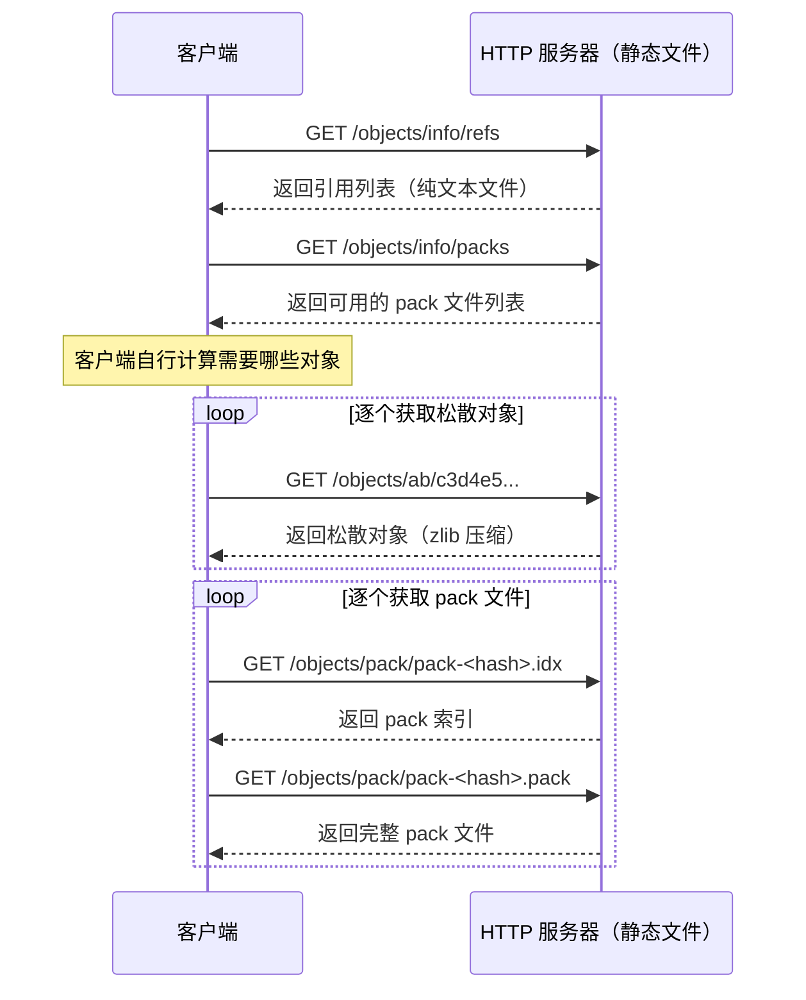

哑协议的致命缺陷：

1. **无协商**：客户端无法告诉服务端"我已有这些对象"，只能盲目下载整个 pack 文件或逐个获取松散对象
2. **效率极低**：即使只需要一个提交的差异，也必须下载完整的 pack 文件
3. **不支持 push**：哑协议只能 fetch，无法 push
4. **依赖服务端预处理**：服务端必须运行 `git update-server-info` 生成辅助文件（`info/refs`、`objects/info/packs` 等），否则客户端无法发现对象

哑协议在 Git 1.6.6 引入智能 HTTP 协议后已基本被淘汰，但 Git 仍保留了对它的支持，以兼容极少数只提供静态文件服务的场景。


### 2.2 智能协议（Smart Protocol）

智能协议的核心思想是**协商**：客户端和服务端通过对话确定需要传输哪些对象，只传输差异部分，避免不必要的数据传输。

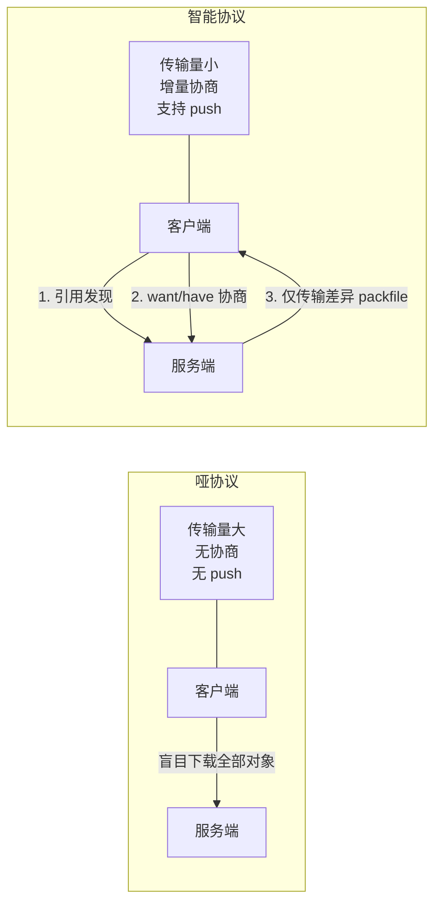

智能协议在 fetch 和 push 两个方向上使用不同的服务端程序：

| 操作方向 | 服务端程序 | 客户端调用 | 说明 |
|---------|-----------|-----------|------|
| fetch / clone | `git-upload-pack` | `git fetch-pack` | 客户端下载对象 |
| push | `git-receive-pack` | `git send-pack` | 客户端上传对象 |

智能协议的三个阶段：

1. **引用发现（Reference Discovery）**：双方交换各自拥有的引用列表
2. **对象协商（Negotiation）**：通过 want/have 机制确定需要传输的对象集合
3. **Packfile 传输**：服务端将所需对象打包为 packfile 传输给客户端

下面分别详细解析 fetch 和 push 的智能协议交互过程。

---

## 3. Fetch 的智能协议交互过程

Fetch（包括 clone）使用 `git-upload-pack` 服务端程序。客户端从服务端获取对象。

### 3.1 完整交互序列图

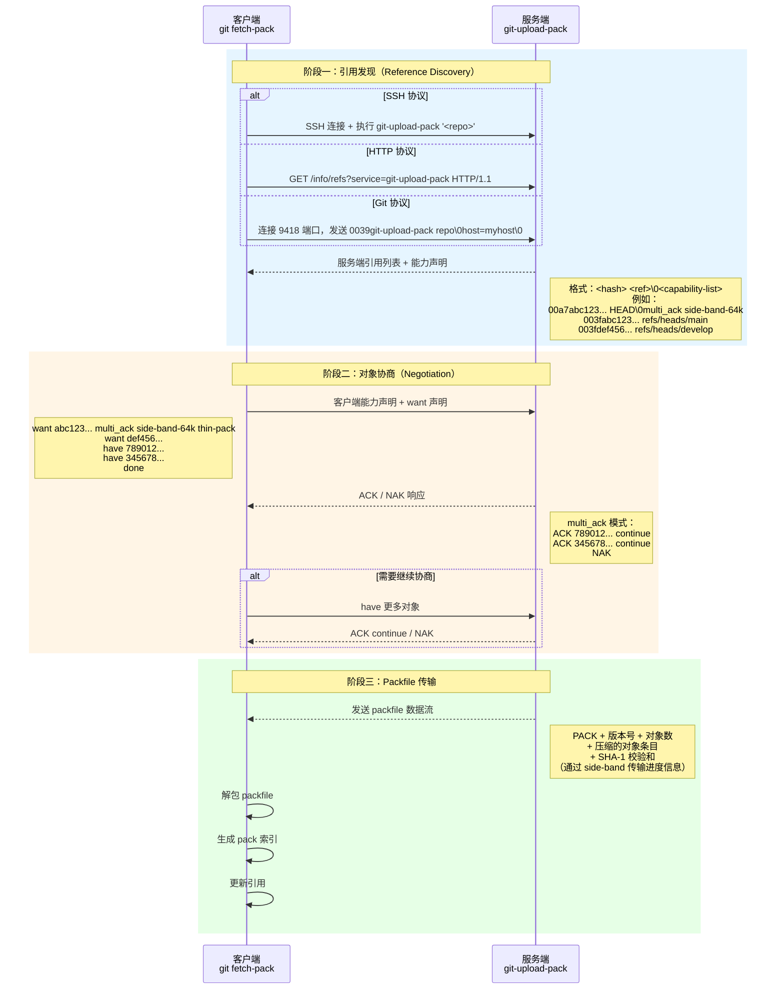

### 3.2 阶段一：引用发现（Reference Discovery）

引用发现是所有智能协议交互的第一步，目的是让客户端了解服务端有哪些分支、标签，以及它们分别指向哪个提交。

**服务端响应格式**（使用 pkt-line 编码）：

```
001e# service=git-upload-pack\n
0000
0067abc123def4567890123456789012345678901ab0 HEAD\0multi_ack_detailed side-band-64k thin-pack ofs-delta\n
003dabc123def4567890123456789012345678901ab0 refs/heads/main\n
003ddef4567890123456789012345678901234567890 refs/heads/develop\n
003c7890123456789012345678901234567890123456 refs/tags/v1.0\n
0000
```

**pkt-line 编码**：Git 智能协议使用 pkt-line 格式传输数据。每行以 4 位十六进制数开头，表示该行（含前缀本身）的字节长度。`0000` 是特殊的 flush 包，表示一个逻辑段的结束。

```
pkt-line 格式：
+--------+------------------+
| 4 hex  |     data         |
| digits |     bytes        |
+--------+------------------+
  长度      数据内容
（含自身4字节）
```

首行引用（通常是 HEAD）后面紧跟 `\0` 和能力声明列表，后续引用行不再重复能力声明。能力声明告诉客户端服务端支持哪些协议扩展，客户端据此决定使用哪些优化特性。

### 3.3 阶段二：对象协商（Negotiation）

对象协商是智能协议的核心——通过 want/have 机制，客户端和服务端共同确定需要传输的最小对象集合。

**协商原理**：

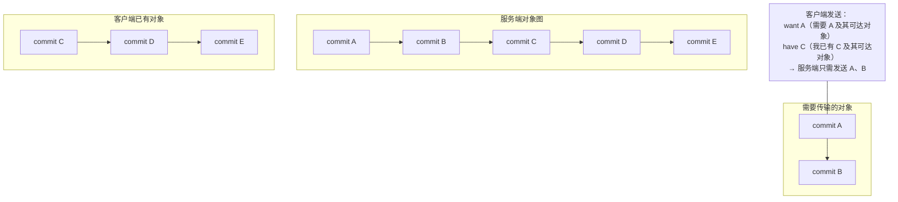

协商过程详解：

1. **want 声明**：客户端声明需要哪些提交。对于每个想要获取的远程引用（分支/标签），客户端发送一个 `want <hash>` 行。want 声明的含义是"我需要这个提交及其所有可达对象"。

2. **have 声明**：客户端声明自己已有哪些提交。客户端遍历本地的引用和 reflog，将已有的提交哈希通过 `have <hash>` 行发送给服务端。have 声明的含义是"我已经有这个提交及其所有可达对象了，你不需要再发送"。

3. **ACK/NAK 响应**：服务端检查客户端的 have 声明，如果发现某个 have 是服务端也有的提交，就回复 `ACK <hash>`，表示"确认你已有这个对象"。如果所有 have 都不匹配，或者协商结束，服务端回复 `NAK`。

4. **done 信号**：客户端发送 `done` 表示协商结束，服务端可以开始打包传输。

**协商示例**（完整对话）：

```
客户端 → 服务端：
want abc123def4567890123456789012345678901ab0 multi_ack_detailed side-band-64k ofs-delta
want def4567890123456789012345678901234567890
have 7890123456789012345678901234567890123456
have 3456789012345678901234567890123456789ab0
done

服务端 → 客户端：
ACK 7890123456789012345678901234567890123456 common
ACK 3456789012345678901234567890123456789ab0 ready
NAK

（随后服务端发送 packfile）
```

### 3.4 阶段三：Packfile 传输

协商完成后，服务端计算需要传输的对象集合，将它们打包为 packfile 格式，流式传输给客户端。

**服务端计算传输集合的过程**：

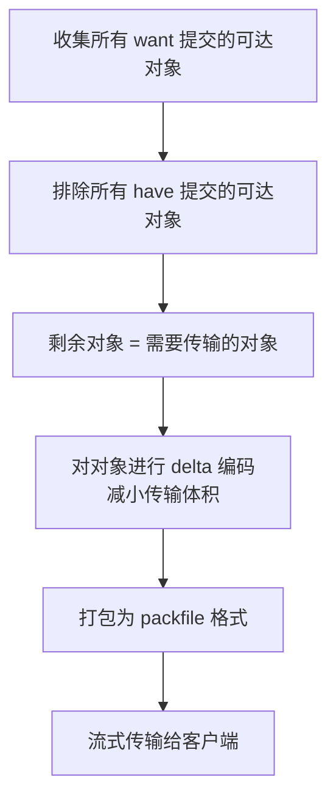

Packfile 的二进制格式：

```
  PACK                        4 字节魔数 "PACK"
  <network-byte-order-32>     4 字节版本号（通常为 2）
  <network-byte-order-32>     4 字节对象数量
  <object-entry>*             N 个对象条目
  <SHA-1-checksum>            20 字节 SHA-1 校验和
```

每个对象条目的编码方式：

| 类型 | 编码 | 说明 |
|------|------|------|
| commit / tree / blob | 原始对象 deflate 压缩 | 直接存储压缩后的完整对象 |
| OFS_DELTA | 偏移量 + delta 数据 | 引用同一 packfile 中偏移量为 X 的对象作为基础，存储 delta 差异 |
| REF_DELTA | SHA-1 + delta 数据 | 引用指定 SHA-1 的对象作为基础，存储 delta 差异 |

客户端接收到 packfile 后的处理流程：

1. 校验 SHA-1 校验和，确保数据完整
2. 保存到 `.git/objects/pack/pack-<hash>.pack`
3. 构建 pack 索引 `.git/objects/pack/pack-<hash>.idx`
4. 解析 delta 编码，还原完整对象
5. 更新本地引用（如 `refs/remotes/origin/main`）

---

## 4. Push 的智能协议交互过程

Push 使用 `git-receive-pack` 服务端程序。客户端向服务端上传对象并更新引用。


### 4.1 完整交互序列图

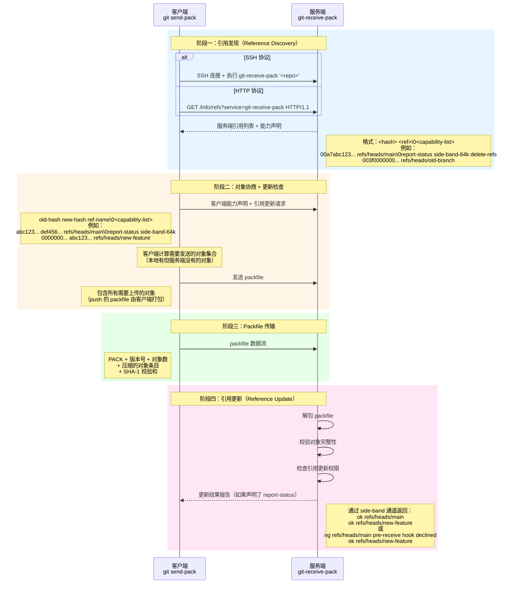

### 4.2 阶段一：引用发现

Push 的引用发现与 fetch 类似，但有两个关键区别：

1. 客户端调用的是 `git-receive-pack`（而非 `git-upload-pack`）
2. 服务端的能力声明不同，push 相关的能力包括：`report-status`（允许服务端返回更新结果）、`delete-refs`（允许删除引用）、`push-options`（支持 push 选项）等

### 4.3 阶段二：对象协商 + 更新检查

Push 的协商方向与 fetch 相反——客户端告诉服务端"我要把引用更新到哪个提交"，并自行计算需要发送哪些对象。

**引用更新请求格式**：

```
<old-hash> <new-hash> <ref-name>\0<capability-list>
```

- `old-hash`：引用当前在服务端指向的提交（客户端从引用发现阶段获知）。如果是新建引用，`old-hash` 为全零（`0000000000000000000000000000000000000000`）
- `new-hash`：引用要更新到的目标提交。如果是删除引用，`new-hash` 为全零
- `ref-name`：引用的完整名称，如 `refs/heads/main`

**客户端计算需要发送的对象**：

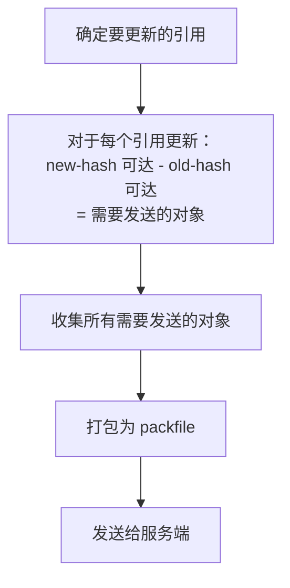

与 fetch 不同，push 的协商是"隐式"的——客户端不需要发送 want/have，而是直接通过 old-hash/new-hash 的差集来确定需要传输的对象。服务端在收到 packfile 后会验证这些对象是否足以支持引用更新。

### 4.4 阶段三：Packfile 传输

Push 的 packfile 由客户端打包并发送，格式与 fetch 相同。客户端将所有需要上传的对象打包为一个 packfile，流式传输给服务端。

### 4.5 阶段四：引用更新

服务端收到 packfile 后执行以下步骤：

1. **解包 packfile**：将对象存入对象库
2. **校验对象完整性**：确保所有引用更新所需的对象都已存在
3. **执行钩子检查**：运行 `pre-receive` 钩子，如果钩子拒绝，则所有更新被拒绝
4. **逐个更新引用**：对每个引用更新运行 `update` 钩子（如果存在），然后更新引用文件
5. **运行 post-receive 钩子**：通知外部系统（如 CI 触发）
6. **返回更新结果**：如果客户端声明了 `report-status` 能力，服务端通过 side-band 通道返回每个引用的更新结果

**更新结果格式**：

```
ok refs/heads/main
ok refs/heads/new-feature
ng refs/heads/protected-branch pre-receive hook declined
```

`ok` 表示更新成功，`ng` 表示更新失败并附带原因。

### 4.6 Push 的安全检查

Push 过程中服务端会执行多重安全检查：

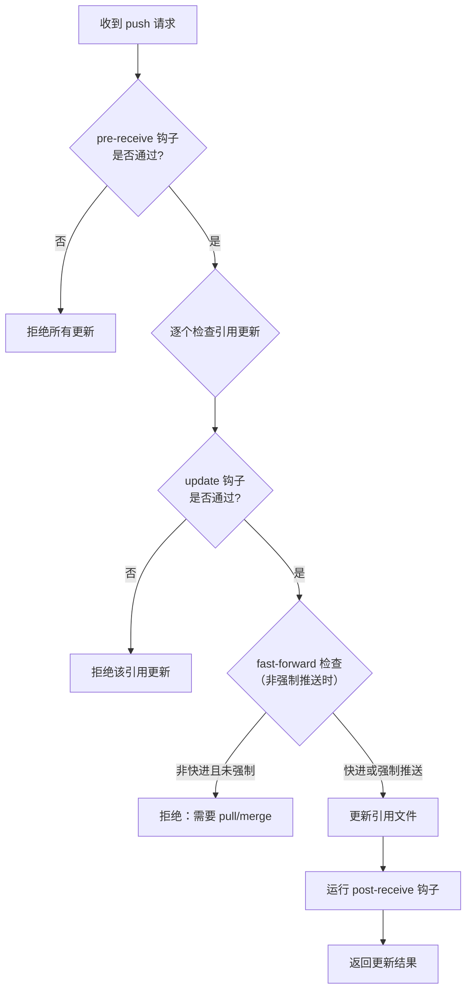

**fast-forward 检查**：如果新的提交不是旧提交的后代（即历史出现了分叉），默认情况下 Git 会拒绝 push，要求先 pull/merge。只有使用 `--force` 参数或服务端配置了 `receive.denyNonFastForwards = false` 时才允许非快进推送。

---

## 5. 浅克隆（Shallow Clone）

### 5.1 --depth=N 的原理

浅克隆通过 `--depth` 参数限制获取的提交历史深度：

```bash
# 只获取最近 1 层提交
git clone --depth 1 https://github.com/user/repo.git

# 获取最近 5 层提交
git clone --depth 5 https://github.com/user/repo.git
```

在智能协议的协商阶段，浅克隆引入了额外的协议扩展：

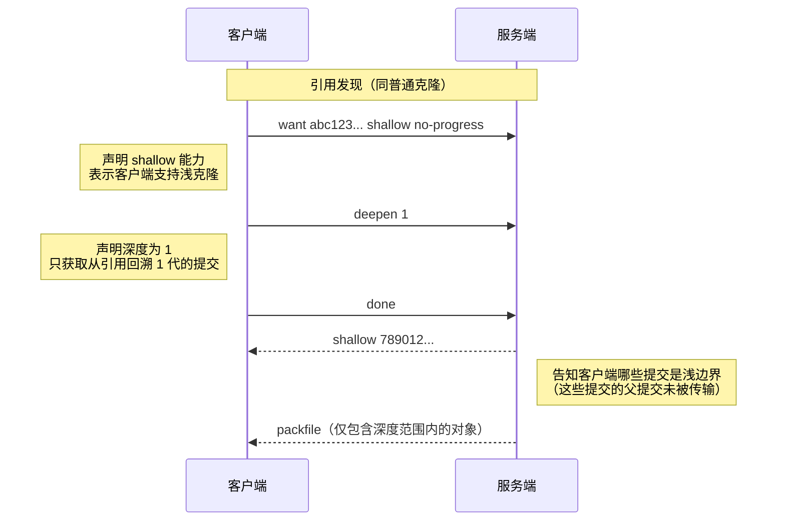

**关键协议扩展**：

- `shallow` 能力：客户端和服务端都声明支持浅克隆
- `deepen <n>`：客户端请求的深度
- `shallow <hash>`：服务端告知客户端哪些提交是浅边界（shallow commit）

### 5.2 shallow 文件

浅克隆完成后，Git 在 `.git/` 目录下创建 `shallow` 文件，记录所有浅边界提交的哈希：

```bash
# 查看 shallow 文件
cat .git/shallow
```

```
7890123456789012345678901234567890123c
abc123def4567890123456789012345678901a
```

**shallow 文件的作用**：

1. **标记历史截断点**：列出的提交是"浅提交"——它们有父提交，但父提交不在本地对象库中
2. **影响后续操作**：Git 在执行 fetch、push、merge 等操作时会检查 shallow 文件，避免访问不存在的父提交
3. **协商依据**：后续 fetch 时，客户端会将 shallow 文件中的哈希作为 `shallow <hash>` 发送给服务端，告知服务端"我的历史在这些点被截断了"

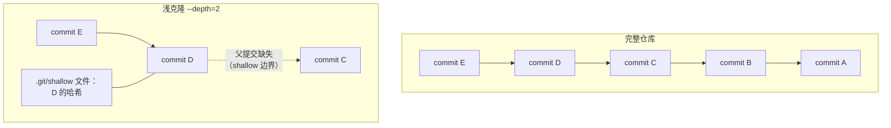


### 5.3 浅克隆的深化

浅克隆可以逐步深化，获取更多历史：

```bash
# 增加深度到 50
git fetch --depth=50

# 完全深化，获取所有历史
git fetch --unshallow

# 按日期深化（获取指定日期之后的所有提交）
git fetch --shallow-since=2024-01-01

# 按引用排除（深化时排除指定分支/标签可达的提交）
git fetch --shallow-exclude=main
```

深化过程在协议层面的交互：

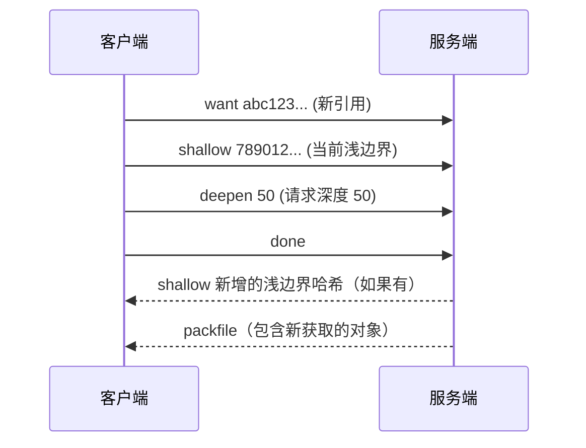

### 5.4 浅克隆的限制

| 操作 | 是否受限 | 说明 |
|------|---------|------|
| `git log` | 受限 | 只能看到深度范围内的提交 |
| `git blame` | 受限 | 无法追溯到浅边界之前的提交 |
| `git merge` | 受限 | 如果合并基础在浅边界之外，无法完成 |
| `git push` | 部分受限 | 某些服务器支持，但可能被拒绝 |
| `git rebase` | 受限 | 需要访问浅边界之外的提交 |
| `git cherry-pick` | 受限 | 如果目标提交不在浅范围内 |
| 子模块操作 | 受限 | 子模块可能需要完整历史 |

---

## 6. 协议优化

Git 智能协议在基础协商机制之上，提供了多种优化扩展，显著提升传输效率。

### 6.1 multi_ack / multi_ack_detailed

**问题**：基础协议中，服务端只发送一个 ACK，协商效率低——客户端需要发送大量 have 才能找到共同祖先，尤其当客户端和服务端的历史分叉较远时。

**multi_ack 优化**：允许服务端同时确认多个 have，加速协商收敛。

**multi_ack_detailed 优化**（更先进）：在 multi_ack 基础上，区分三种 ACK 类型：

| ACK 类型 | 含义 |
|----------|------|
| `ACK <hash> continue` | 确认该 have 有效，但还需要更多 have 来确定最小传输集 |
| `ACK <hash> common` | 确认该 have 是共同祖先，可以用于计算传输集 |
| `ACK <hash> ready` | 已找到足够的共同祖先，客户端可以发送 done |

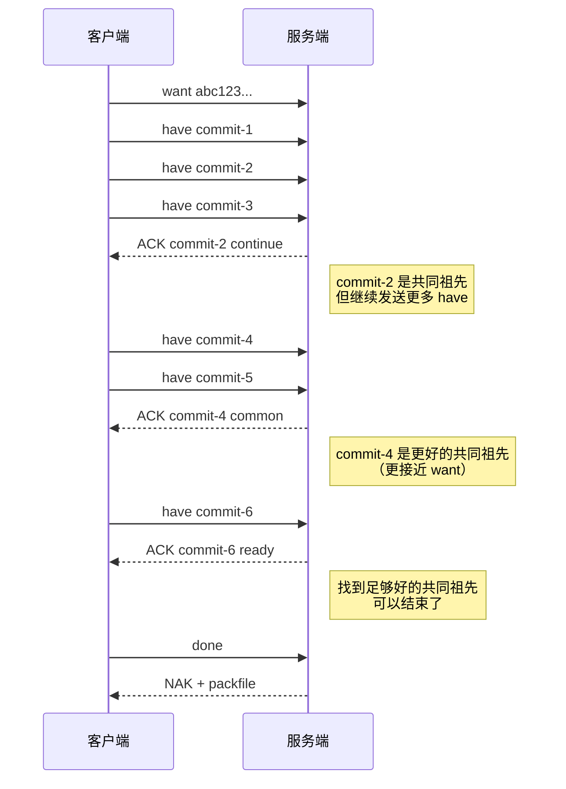

### 6.2 side-band / side-band-64k

**问题**：在 packfile 传输过程中，客户端无法获取进度信息和错误信息——数据流被 packfile 二进制数据独占。

**side-band 优化**：在数据流中复用多个"频带"（band），允许同时传输 packfile 数据、进度信息和错误信息。

| Band 编号 | 用途 | 说明 |
|-----------|------|------|
| 1 | packfile 数据 | 主数据通道 |
| 2 | 进度信息 | `Remote: Counting objects: 1234, done.` 等进度输出 |
| 3 | 错误信息 | 服务端错误消息 |

**side-band** 的单条消息最大 1000 字节，**side-band-64k** 将上限提升到 65520 字节，减少分片开销，在大仓库传输中性能更优。

**数据格式**：

```
+----------+----------+---------+
| pkt-line | band     | data    |
| header   | (1 byte) |         |
+----------+----------+---------+
```

客户端根据 band 编号将数据分发到不同处理逻辑：band 1 写入 packfile，band 2 显示在终端，band 3 输出到 stderr。

### 6.3 thin pack

**问题**：标准的 packfile 要求自包含——每个 delta 编码的对象，其基础对象也必须在同一个 packfile 中。这导致即使客户端已有基础对象，服务端仍需重复传输。

**thin pack 优化**：允许 packfile 中的 delta 对象引用不在 packfile 中的基础对象（前提是客户端已拥有这些基础对象）。

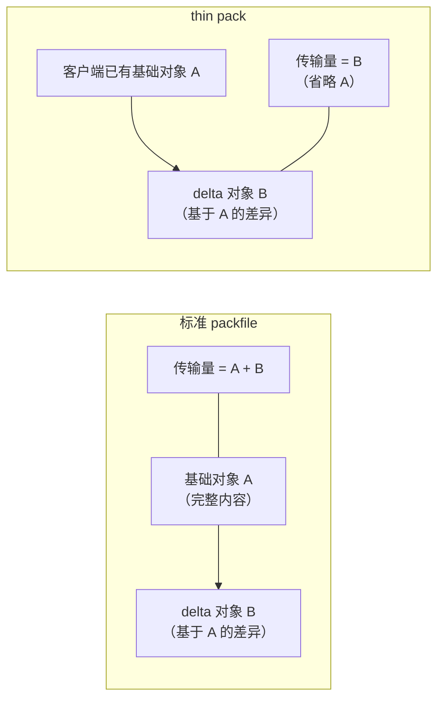

**工作流程**：

1. 服务端声明 `thin-pack` 能力
2. 服务端发送 thin pack：delta 对象引用的基础对象可能不在 packfile 中
3. 客户端收到 thin pack 后，执行 `index-pack --fix-thin`，从本地对象库中找到缺失的基础对象，将 delta 解析为完整对象，使 packfile 自包含

thin pack 在增量 fetch（非首次 clone）时效果最显著，因为客户端通常已有大量基础对象。

### 6.4 其他协议优化

| 优化 | 说明 |
|------|------|
| **ofs-delta** | delta 编码使用 packfile 内偏移量引用基础对象（而非 SHA-1），节省 16 字节/条目，解析更快 |
| **no-done** | 客户端在发送完 want/have 后不需要发送 done，服务端自动开始传输（减少一次往返） |
| **no-progress** | 客户端请求服务端不在 side-band 中发送进度信息（减少数据量） |
| **include-tag** | 服务端自动包含被请求提交所指向的标签对象 |
| **symref** | 服务端可以声明符号引用（如 HEAD 指向哪个分支），而非只返回直接引用 |
| **agent** | 声明客户端/服务端的 Git 版本，用于兼容性判断 |

### 6.5 协议优化组合效果

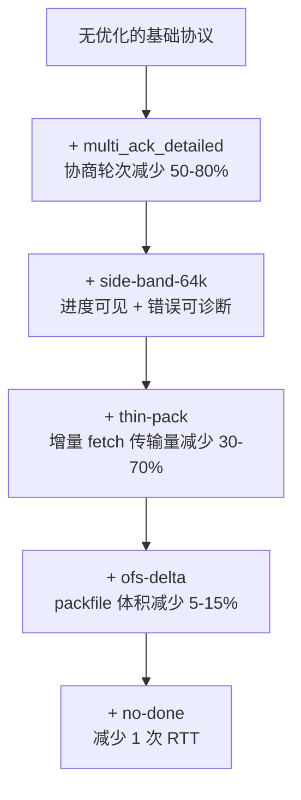

实际场景中的优化效果对比：

| 场景 | 无优化 | 全部优化 | 改善 |
|------|--------|---------|------|
| 首次 clone（大型仓库） | 传输 2GB | 传输 1.5GB | 25%（thin-pack 无效，ofs-delta 有效） |
| 增量 fetch（少量变更） | 传输 200MB | 传输 30MB | 85%（thin-pack 效果显著） |
| 协商轮次（历史分叉远） | 20 轮 | 3 轮 | 85%（multi_ack_detailed） |

> 注：本节流程图与上表中的百分比及传输量均为示意性示例数值，非实测数据；实际效果取决于仓库规模、对象特征与网络条件。

---

## 7. 小结

| 概念 | 核心要点 |
|------|---------|
| **传输协议** | Git 支持本地、SSH、HTTP/HTTPS、Git 四种协议，各有适用场景；HTTPS 穿透防火墙能力最强，SSH 安全性最好 |
| **哑协议 vs 智能协议** | 哑协议无协商、全量下载、不支持 push；智能协议通过 want/have 协商只传输差异，是现代 Git 的标准 |
| **Fetch 智能协议** | 引用发现 → want/have 对象协商 → packfile 传输；服务端运行 `git-upload-pack` |
| **Push 智能协议** | 引用发现 → 引用更新声明 + packfile 传输 → 引用更新 + 结果报告；服务端运行 `git-receive-pack` |
| **浅克隆** | `--depth=N` 限制提交深度，shallow 文件记录截断边界；可逐步深化，但部分操作受限 |
| **协议优化** | `multi_ack_detailed` 加速协商，`side-band-64k` 复用数据通道，`thin-pack` 省略已有基础对象，`ofs-delta` 减小 pack 体积 |

**关键理解**：

1. Git 的传输效率核心在于**协商**——智能协议通过 want/have 机制精确计算需要传输的对象集合，避免全量传输。
2. Push 和 Fetch 的协议方向对称但不同：Fetch 由服务端打包发送，Push 由客户端打包发送；Fetch 通过 want/have 显式协商，Push 通过 old/new hash 隐式计算。
3. 协议优化是渐进式的——每种优化解决一个特定问题，它们可以组合使用，效果叠加。
4. 浅克隆和部分克隆从不同维度减少传输量：浅克隆在时间维度截断历史，部分克隆在空间维度过滤对象。
5. 选择协议时，安全性、性能、网络环境三者需要权衡——大多数场景下 HTTPS 是最佳选择，SSH 适合有密钥管理能力的团队。

