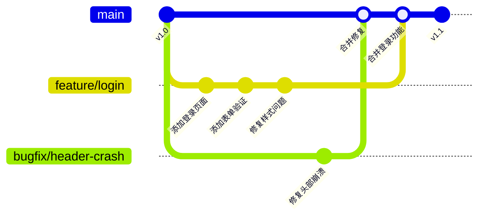
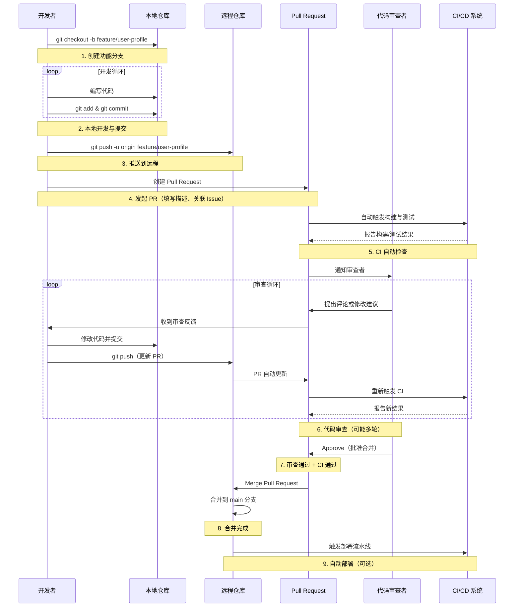
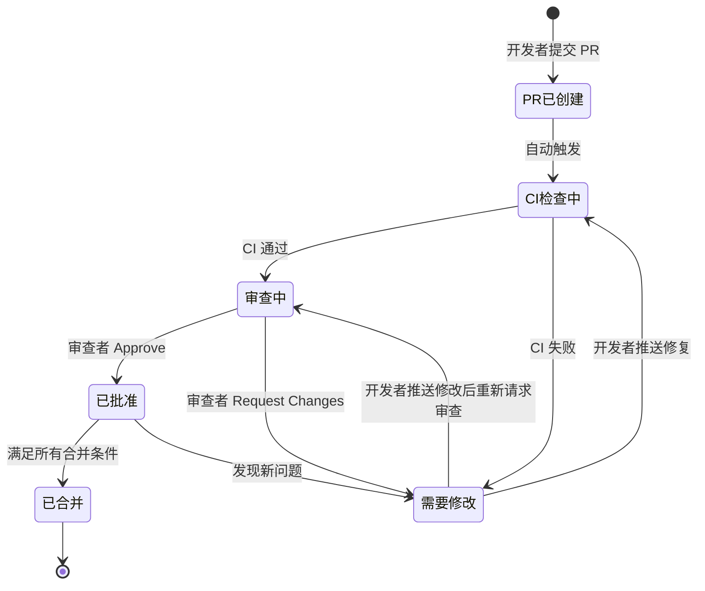
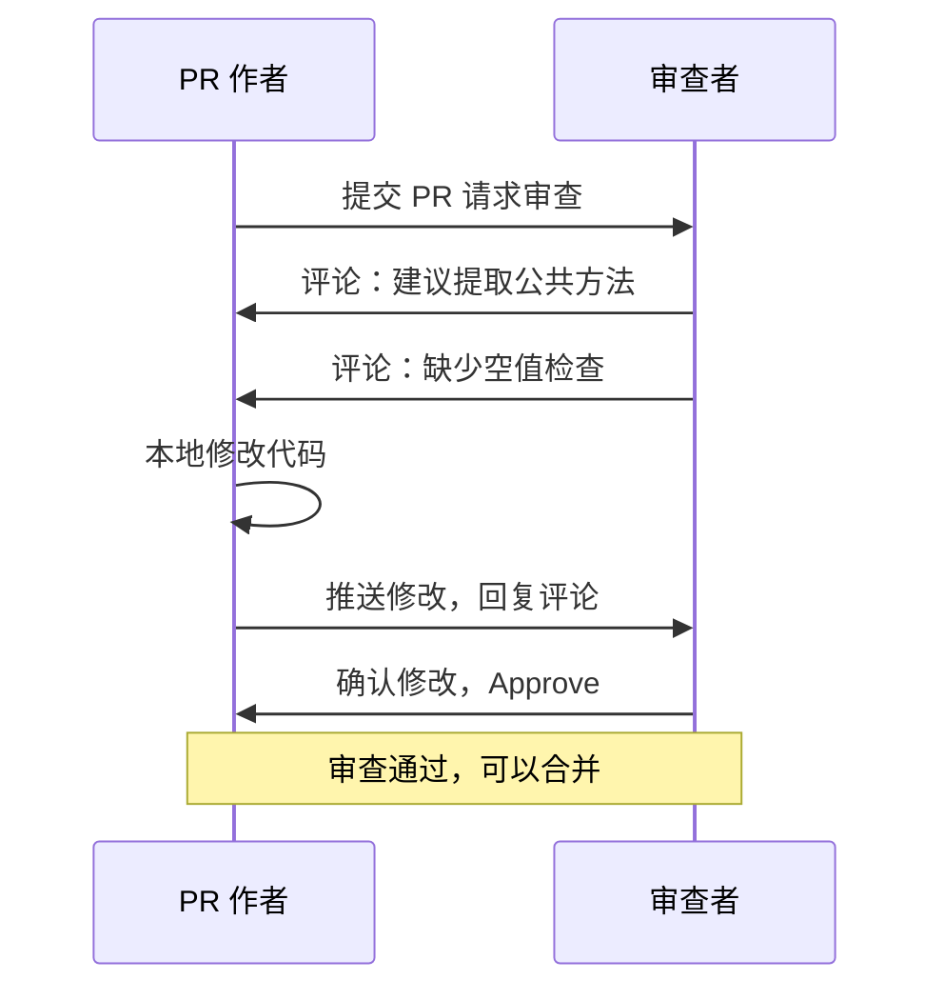
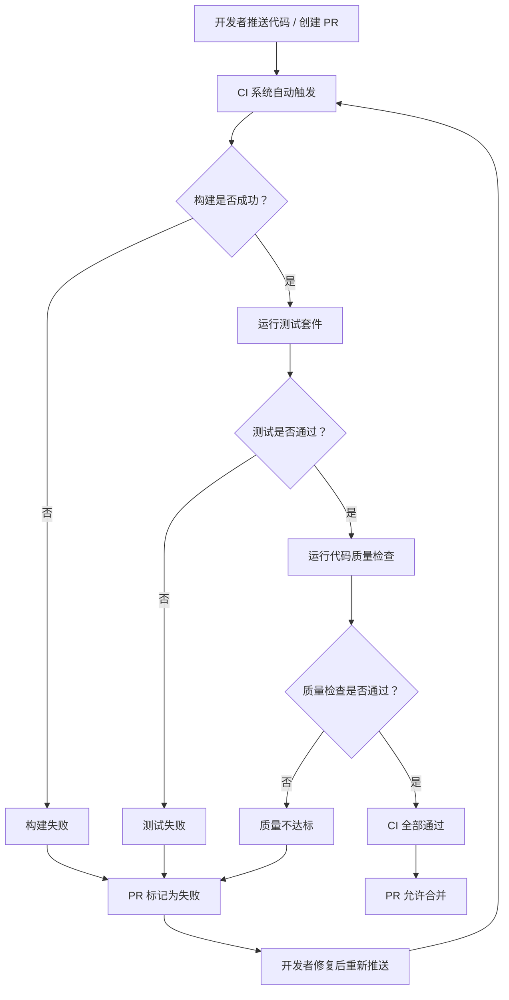
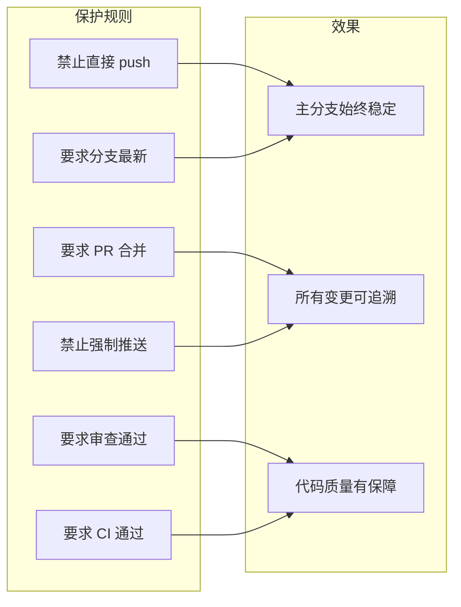
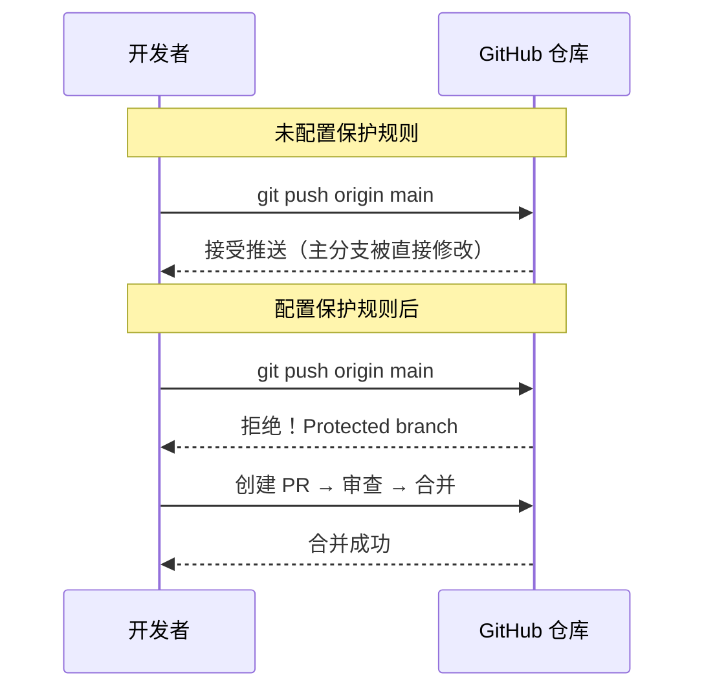
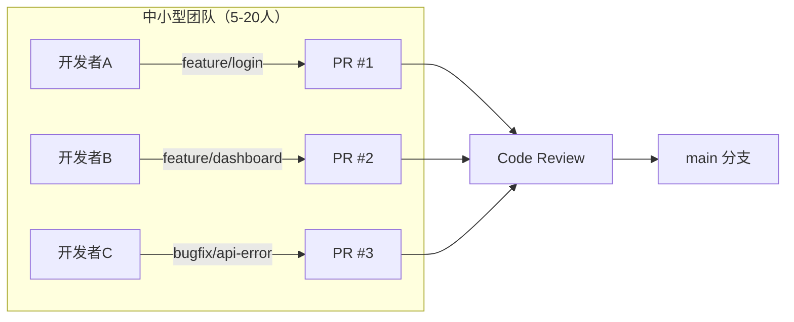
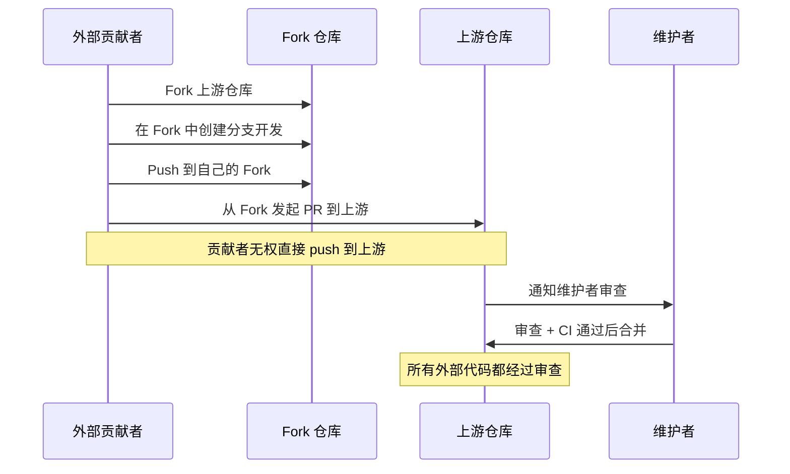

# Feature Branching 工作流

## 核心思想

Feature Branching（功能分支工作流）是当今业界最广泛采用的 Git 协作模式之一。它的核心理念极其简洁：

> **每个功能、修复或任务都在独立的分支上开发，完成后通过 Pull Request（或 Merge Request）合并回主分支。**

这意味着主分支（`main` / `master`）上的每一次提交，都经过了审查与验证——永远不会有人直接在主分支上"裸写"代码。

与 Centralized Workflow（所有人直接在 main 上提交）相比，Feature Branching 引入了一道关键隔离：**开发中的代码与已稳定的代码互不干扰**。每个分支是一个独立的工作空间，开发者可以自由提交、随时中断、反复修改，而不影响团队其他人的工作。



从上图可以看到：`feature/login` 和 `bugfix/header-crash` 两条分支各自独立推进，互不阻塞，最终按各自节奏合入主分支。

---

## 完整工作流程

下面用序列图展示 Feature Branching 从创建分支到最终合并的完整生命周期：



**流程要点总结：**

| 步骤 | 操作 | 关键命令 / 动作 |
|------|------|-----------------|
| 1. 创建分支 | 从最新的 main 创建功能分支 | `git checkout -b feature/xxx main` |
| 2. 本地开发 | 在分支上自由提交 | `git add` & `git commit` |
| 3. 推送远程 | 将分支推到远程仓库 | `git push -u origin feature/xxx` |
| 4. 创建 PR | 在 GitHub/GitLab 上发起合并请求 | 填写标题、描述、关联 Issue |
| 5. CI 检查 | 自动构建和测试 | CI 系统自动触发 |
| 6. 代码审查 | 团队成员评审代码 | 评论、建议、讨论 |
| 7. 审查通过 | 审查者批准 + CI 绿灯 | Approve + Status Check 通过 |
| 8. 合并 | 将 PR 合入主分支 | Merge / Squash / Rebase |
| 9. 清理 | 删除已合并的分支 | 本地 + 远程分支清理 |

---

## 分支命名规范

统一的分支命名是团队协作的基础设施。好的命名让所有人一眼看出分支的用途和上下文。

### 推荐命名模式

```
<类型>/<简短描述>
```

### 常见类型前缀

| 前缀 | 用途 | 示例 |
|------|------|------|
| `feature/` | 新功能开发 | `feature/user-profile`、`feature/shopping-cart` |
| `bugfix/` | 非紧急 Bug 修复 | `bugfix/login-validation`、`bugfix/table-sort` |
| `hotfix/` | 线上紧急修复 | `hotfix/payment-crash`、`hotfix/security-patch` |
| `chore/` | 杂项任务（构建、依赖、文档等） | `chore/upgrade-webpack`、`chore/update-deps` |
| `refactor/` | 代码重构（不改变外部行为） | `refactor/api-layer` |
| `test/` | 添加或修改测试 | `test/integration-checkout` |
| `docs/` | 文档变更 | `docs/api-reference` |

### 进阶命名：加入 Issue 编号

在团队协作中，将分支与 Issue 关联可以极大提升可追溯性：

```
feature/1234-user-profile
bugfix/5678-login-validation
hotfix/9012-payment-crash
```

这样在 PR 标题或描述中引用 `#1234`，GitHub 会自动关联对应的 Issue。

### 命名规范要点

- 使用小写字母和连字符（kebab-case），避免下划线和驼峰
- 描述简洁明确，控制在 3-5 个单词
- 不要使用模糊名称如 `feature/update` 或 `bugfix/fix`
- hotfix 分支应从生产分支（或 tag）拉出，而非从 main

---

## 代码审查（Code Review）流程

代码审查是 Feature Branching 工作流的灵魂。它不仅是发现 Bug 的手段，更是知识共享、架构对齐和代码质量保障的核心机制。

### 审查流程状态图



### PR 评审要点

审查者在评审 PR 时，应关注以下几个维度：

**1. 正确性**
- 代码逻辑是否正确实现了需求？
- 边界条件和异常情况是否处理？
- 是否存在明显的 Bug？

**2. 可读性与可维护性**
- 命名是否清晰、一致？
- 函数/方法是否职责单一、长度合理？
- 是否有必要的注释？注释是否准确？

**3. 设计与架构**
- 修改是否符合现有架构模式？
- 是否引入了不必要的耦合？
- 是否有更简洁的实现方式？

**4. 测试**
- 是否添加了对应的测试？
- 测试覆盖了关键路径和边界情况吗？
- 测试本身是否可靠（无 flaky test）？

**5. 安全与性能**
- 是否存在安全隐患（SQL 注入、XSS 等）？
- 是否引入了明显的性能问题？
- 敏感信息是否被正确处理？


### 审查循环：评论 → 修改 → 再审查

代码审查很少一轮通过，多轮迭代是正常且健康的：



**审查礼仪要点：**

- **审查者**：评论要具体、建设性，说明"为什么"而不只是"改一下"；区分"必须修改"（Must）和"建议优化"（Nice to have）
- **作者**：对每条评论给予回应（修改、解释或礼貌讨论）；不要把审查意见视为对个人的批评
- **团队**：设定审查响应时间 SLA（如 24 小时内完成首轮审查），避免 PR 长时间积压

---

## CI/CD 集成

Feature Branching 与 CI/CD 的结合是现代开发流程的标配。核心原则是：**每次 Push 或 PR 都自动触发构建和测试，CI 状态作为合并的硬性门禁。**

### CI/CD 在 PR 中的工作方式



### 常见 CI 检查项

| 检查类型 | 说明 | 工具示例 |
|----------|------|----------|
| 编译构建 | 确保代码可以成功编译 | Maven、Gradle、webpack |
| 单元测试 | 运行项目单元测试 | Jest、pytest、JUnit |
| 集成测试 | 验证模块间交互 | Testcontainers、Cypress |
| 代码覆盖率 | 检查测试覆盖率是否达标 | Istanbul、Codecov、JaCoCo |
| Lint / 格式化 | 代码风格一致性 | ESLint、Prettier、Black |
| 安全扫描 | 检测已知漏洞 | Snyk、Trivy、SonarQube |
| 类型检查 | 静态类型验证 | TypeScript、mypy |

### 状态检查作为合并门禁

在 GitHub 中，这通过 **Status Checks** 和 **Required Checks** 实现：

```yaml
# .github/workflows/ci.yml 示例
name: CI
on:
  pull_request:
    branches: [main]

jobs:
  build:
    runs-on: ubuntu-latest
    steps:
      - uses: actions/checkout@v4
      - name: Install dependencies
        run: npm ci
      - name: Build
        run: npm run build
      - name: Test
        run: npm test
      - name: Lint
        run: npm run lint
```

当仓库配置了 Required Checks 后，PR 必须等所有检查通过才能合并——即使你是仓库管理员，也无法绕过这道门禁。

---

## 保护分支（Branch Protection）

保护分支是 Feature Branching 的制度保障。没有分支保护，"所有代码必须通过 PR 合并"就只是一句君子协定——任何人都可以直接 push 到 main，规则形同虚设。

### main/master 分支的保护规则



### GitHub 中的典型保护配置

在仓库的 **Settings → Branches → Branch protection rules** 中，对 `main` 分支进行如下配置：

| 规则 | 说明 | 推荐设置 |
|------|------|----------|
| Require a pull request before merging | 禁止直接 push，必须通过 PR | **开启** |
| Require approvals | PR 必须获得指定人数的批准 | **1-2 人** |
| Dismiss stale reviews on push | PR 有新推送时清除之前的批准 | **开启** |
| Require status checks to pass | CI 检查必须通过才能合并 | **开启** |
| Require branches to be up to date | 合并前必须与目标分支同步 | **开启** |
| Require signed commits | 提交必须带有可信签名（GPG/SSH/S/MIME） | 视团队需求 |
| Do not allow force pushes | 禁止 `git push --force` | **开启** |
| Do not allow deletions | 禁止删除保护分支 | **开启** |


### 禁止直接 push 的实际效果



配置保护规则后，即使是仓库管理员直接 push 也会被拒绝。这确保了所有代码变更都经过完整的审查和 CI 流程。

---

## Feature Branching 的优缺点

### 优点

| 优点 | 说明 |
|------|------|
| **主分支始终稳定** | 未完成的代码在独立分支上，main 永远处于可发布状态 |
| **并行开发无冲突** | 多人同时开发不同功能，互不干扰 |
| **代码质量有保障** | 通过 Code Review 和 CI 门禁，所有代码都经过审查和验证 |
| **变更可追溯** | 每个功能/修复都有独立的分支和 PR，关联 Issue 和讨论 |
| **支持随时中断** | 功能开发到一半可以暂停，切换到其他分支处理紧急任务 |
| **便于回滚** | 如果某个功能有问题，可以精准 revert 对应的合并提交 |
| **知识共享** | Code Review 过程本身就是团队成员互相学习的机会 |

### 缺点

| 缺点 | 说明 |
|------|------|
| **分支管理开销** | 分支数量可能膨胀，需要定期清理已合并的分支 |
| **合并冲突风险** | 长期存活的分支与 main 差异越大，合并冲突越严重 |
| **审查瓶颈** | 如果审查者响应慢，PR 积压会阻塞整个团队 |
| **集成延迟** | 代码在独立分支上"孤立"开发，可能与其他功能产生架构冲突，直到合并时才发现 |
| **过度碎片化** | 极小的修改也要走完整 PR 流程，可能降低效率 |
| **合并策略选择** | Merge Commit / Squash / Rebase 三种策略各有取舍，团队需统一规范 |

### 缓解策略

- **频繁同步**：定期将 main 的更新 rebase/merge 到功能分支，减少最终合并时的冲突
- **小而短的 PR**：每个 PR 控制在 200-400 行变更以内，审查更快、冲突更少
- **审查 SLA**：设定审查响应时间（如 24 小时），避免 PR 长时间等待
- **自动化**：CI 自动检查 + 自动合并（Auto-merge），减少人工等待
- **分支清理**：合并后自动删除远程分支，GitHub 可在仓库设置中开启

---

## 适用场景

### 最佳适用：中小型团队

Feature Branching 是 5-20 人团队最自然的工作流选择。这个规模下，并行开发的功能数量适中，审查者有足够的上下文理解代码变更，沟通成本可控。



### 最佳适用：开源项目

开源项目的核心挑战是**贡献者来自外部，不可控且不可信**。Feature Branching + Fork 的工作模式完美解决了这个问题：



开源项目中，外部贡献者只能在自己的 Fork 中开发，然后向上游发起 PR。维护者完全掌控合并权，主分支的安全性得到绝对保障。

### 其他场景的考量

| 场景 | 是否推荐 | 说明 |
|------|----------|------|
| 个人项目 | 可选 | 一个人开发时审查无意义，但 CI 门禁仍有价值 |
| 大型团队（50+人） | 需要增强 | 基础流程不变，但需引入更细粒度的 CODEOWNERS、分层审查 |
| 持续部署高频发布 | 需要增强 | 考虑 Trunk-Based Development 或 Feature Flag 配合 |
| 紧急修复 | 适配 | hotfix 分支从生产 tag 拉出，走快速审查通道 |

---

## 小结

Feature Branching 工作流的核心可以用三句话概括：

1. **隔离开发**：每个功能在独立分支上开发，主分支始终稳定。
2. **审查准入**：所有代码必须通过 Pull Request、Code Review 和 CI 检查才能合入主分支。
3. **制度保障**：通过分支保护规则，将"必须走 PR"从君子协定变为技术强制。

它不是最简单的工作流（Centralized Workflow 更简单），也不是最高频的工作流（Trunk-Based Development 支持更快的集成节奏），但它在**代码质量**和**开发效率**之间取得了最佳平衡——这正是它成为业界最广泛采用的工作流的原因。

对于中小型团队和开源项目，Feature Branching 是默认推荐的工作流。掌握它，你就掌握了现代 Git 协作的基本盘。

