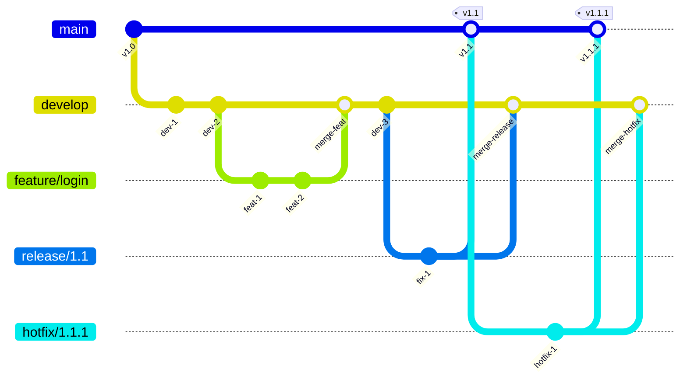
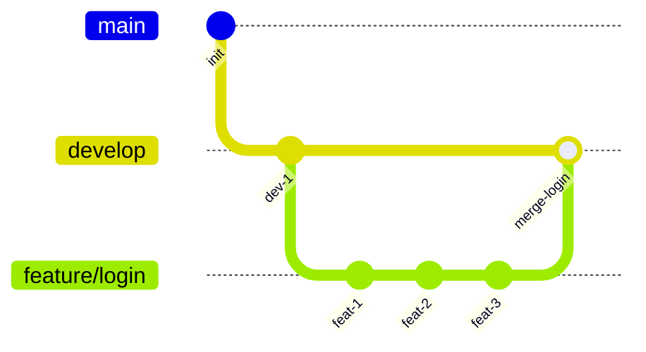
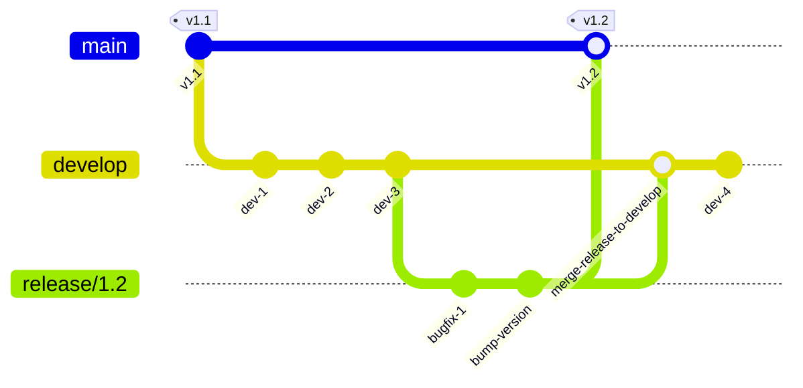
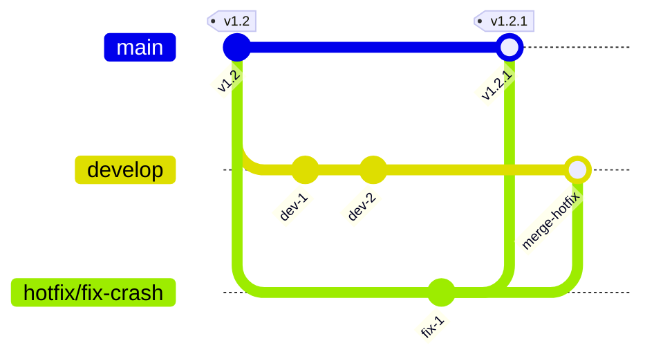
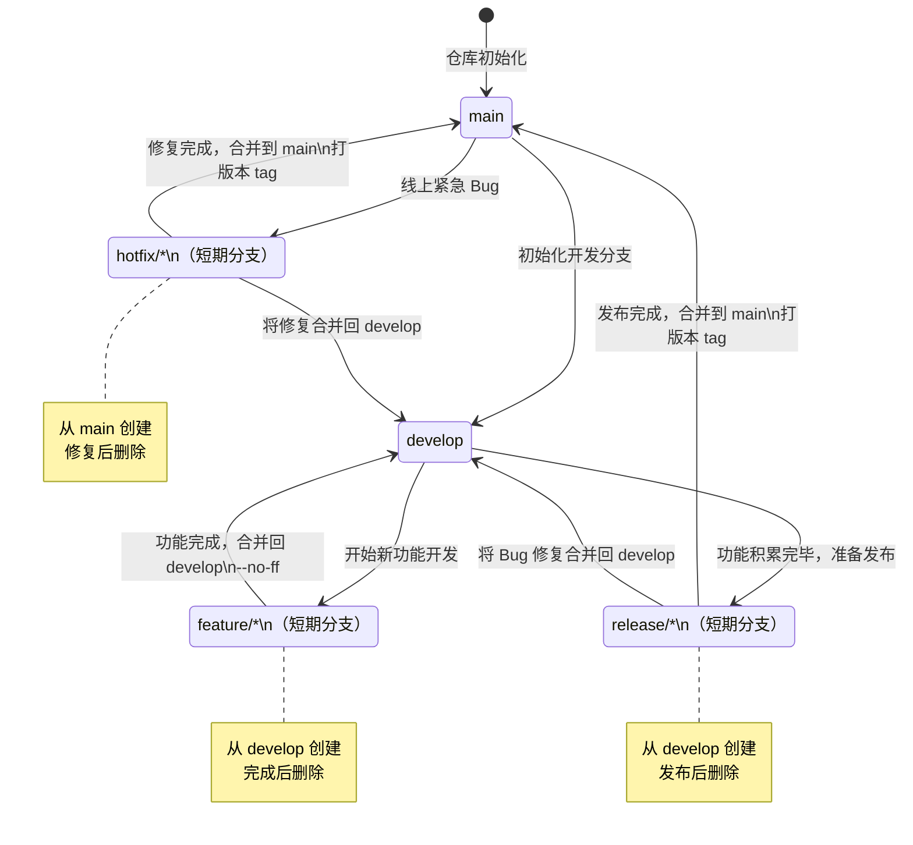
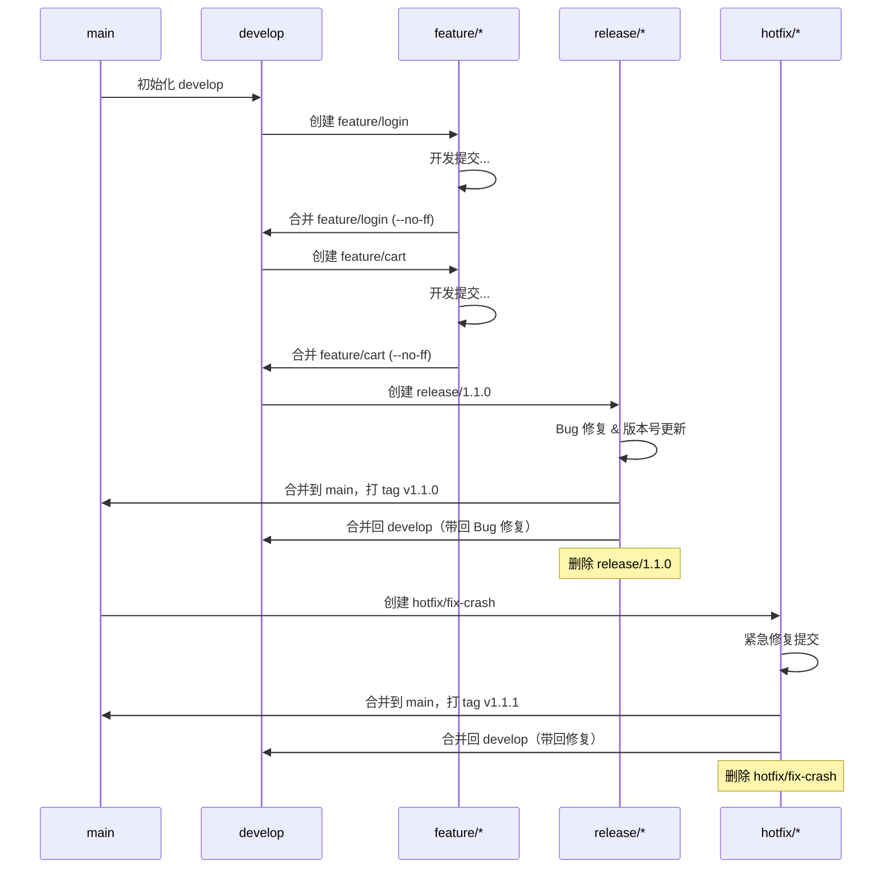

# Git Flow 工作流

在前面的文章中，我们了解了 Feature Branching 工作流——它的核心是"每个功能开一个分支，写完合并回主分支"。这种模型简洁高效，是当今最流行的团队协作方式之一。

但在实际项目中，你可能会遇到一些更复杂的需求：产品有明确的版本发布计划、需要同时维护多个生产版本、线上出了紧急 Bug 要立刻修但不能把未完成的功能带上线……这些场景下，仅靠 `main` 和 `feature` 两条分支就显得力不从心了。

2010 年，Vincent Driessen 发表了一篇文章《A successful Git branching model》，提出了一个围绕发布周期的多分支协作模型——**Git Flow**。它通过定义五种不同角色的分支，为项目从开发、发布到维护的全生命周期提供了清晰的操作规范。

这一节，我们就来系统地学习 Git Flow。

## 核心思想：围绕发布周期的多分支模型

Git Flow 的核心理念可以概括为一句话：**用分支的角色分工来隔离不同阶段的工作**。

它不是对 Feature Branching 的否定，而是在其基础上的扩展。Feature Branching 只关注"功能开发"这一个维度，而 Git Flow 在此之外，还考虑了"发布准备"和"线上紧急修复"这两个维度。为此，Git Flow 引入了五种不同角色的分支，每种分支都有明确的创建来源、合并目标和生命周期。

在深入每种分支之前，先通过一张全景图来直观感受 Git Flow 的整体结构：



从图中可以看到，不同的分支有不同的"出身"和"归宿"，它们各司其职，形成了一套完整的协作闭环。

## 五种分支类型详解

Git Flow 定义了五种分支，分为**长期分支**和**短期分支**两大类：

| 类别 | 分支 | 生命周期 | 命名规范 |
|------|------|----------|----------|
| 长期分支 | main | 永久存在 | main（或 master） |
| 长期分支 | develop | 永久存在 | develop |
| 短期分支 | feature/* | 功能完成后删除 | feature/功能名称 |
| 短期分支 | release/* | 发布完成后删除 | release/版本号 |
| 短期分支 | hotfix/* | 修复完成后删除 | hotfix/修复描述 |

下面逐一详解。

### 1. main：生产代码的绝对权威

`main`（一些旧项目中仍叫 `master`）是 Git Flow 中最"严肃"的分支。它上面的每一个 commit，都应该对应一个可以部署到生产环境的版本。

关于 `main`，有几个关键规则：

- **永远不要直接在 main 上开发**。所有代码都通过合并进入 main，无论是来自 release 分支还是 hotfix 分支。
- **每次合并到 main 都必须打 tag**。tag 的名称就是版本号（如 `v1.0.0`、`v2.1.3`），这确保了 main 上的每一个 commit 都有明确的版本标识，方便随时回溯或回滚到任意历史版本。
- **main 是唯一的"生产真相"**。任何时候，main 上的代码都应该与当前生产环境运行的代码一致。

```
main:  ●──●──●──●──●──●
        ^  ^  ^  ^  ^  ^
       v1.0 v1.1 v1.1.1 v1.2 v1.2.1 v1.3
```

### 2. develop：开发集成的汇聚点

如果说 `main` 是生产的权威，那 `develop` 就是开发的汇聚点。它反映了项目最新的开发成果——所有已经完成的功能都会合并到这里，进行集成测试和整体验证。

关于 `develop`：

- **它是所有 feature 分支的起点和终点**。新功能从 develop 分出，完成后合并回 develop。
- **develop 上的代码应该是可运行的**。虽然它不必像 main 那样"随时可上线"，但应该保持基本的可编译、可运行状态，避免团队成员 pull 下来后无法工作。
- **当 develop 上的功能积累到可以发布时，从它创建 release 分支**。

```
develop:  ●──●──●──●──●──●──●──●
               ↑           ↑
          merge feature  merge feature
```

main 和 develop 的关系可以理解为：**develop 是"下一版本"的工作区，main 是"当前版本"的快照**。当 develop 成熟到可以发布时，就通过 release 分支把代码从 develop 过渡到 main。

### 3. feature/*：功能开发的独立空间

`feature/*` 是开发者日常打交道最多的分支。每一个新功能、新特性，都应该在独立的 feature 分支上开发。

关于 feature 分支的规则：

- **从 develop 分出**，完成后合并回 develop。
- **命名建议使用小写字母和连字符**，如 `feature/user-login`、`feature/shopping-cart`。
- **功能完成后删除分支**。feature 分支是短命的，一旦合并回 develop，它的历史使命就结束了。
- **不要跨功能**。一个 feature 分支只做一件事，保持变更的原子性，便于 Code Review 和回滚。



合并时通常使用 `--no-ff`（非快进合并），这样即使在可以快进的情况下，也会保留一个合并节点，明确记录"这里曾有一个 feature 分支被合并进来"：

```shell
git checkout develop
git merge --no-ff feature/login
```

### 4. release/*：从开发到生产的过渡桥梁

当 develop 上的功能积累到一个里程碑，准备发布新版本时，就从 develop 创建 release 分支。

release 分支的意义在于：**它将"发布准备"和"新功能开发"解耦**。一旦 release 分支创建，develop 就可以继续接收新的 feature，不受发布流程的影响；而 release 分支则专注于发布前的最后打磨——修复测试中发现的 Bug、更新版本号、完善文档等。

关于 release 分支：

- **从 develop 分出**。
- **命名使用版本号**，如 `release/1.2.0`。
- **只做发布相关的修复，不再接收新功能**。这是 release 分支的铁律——如果发现了一个需要大量代码修改的 Bug，正确的做法是回到 develop 上修，而不是在 release 分支上大动干戈。
- **发布完成后，合并到 main 和 develop**。合并到 main 是为了更新生产代码并打 tag；合并到 develop 是为了把 release 分支上的 Bug 修复带回开发分支，避免同样的 Bug 在下一个版本中再次出现。
- **合并后删除分支**。



> **为什么要合并回 develop？** 这是初学者常问的问题。假设在 release/1.2 分支上修复了一个 Bug，如果不把这个修复合并回 develop，那么 develop 中仍然存在这个 Bug，下次发布时（比如 release/1.3）这个 Bug 就会重新出现在生产环境中。将 release 合并回 develop，正是为了确保修复不会丢失。

### 5. hotfix/*：线上紧急修复的快速通道

生产环境出了紧急 Bug，需要立刻修复——这就是 hotfix 分支存在的意义。

hotfix 分支是 Git Flow 中唯一从 main 分支创建的短期分支，也是唯一能直接合并到 main 的分支（除了 release）。这种设计的核心考量是**速度**：线上问题刻不容缓，不能等 develop 上的功能开发完再一起发，必须从当前生产版本直接拉出分支来修。

关于 hotfix 分支：

- **从 main 分出**，基于当前生产版本的 tag。
- **命名反映修复内容**，如 `hotfix/fix-login-crash`、`hotfix/fix-payment-error`。
- **修复完成后，合并到 main 和 develop**（与 release 分支的合并逻辑相同）。
- **合并到 main 后必须打 tag**，版本号递增（如从 v1.2.0 变为 v1.2.1）。
- **合并后删除分支**。



> **如果 develop 上已经有人改动了 hotfix 涉及的同一个文件怎么办？** 合并回 develop 时可能会产生冲突，需要手动解决。这是 Git Flow 中一个已知的痛点——hotfix 合并回 develop 时的冲突处理。


## Git Flow 完整生命周期

把五种分支放在一起，就是一个完整的 Git Flow 生命周期。下面的状态机图展示了各分支从创建到消亡的全过程：



再用一张时序图来展示一个完整的 Git Flow 周期中，各分支之间的事件顺序：



## 各分支的合并规则与保护策略

Git Flow 的顺利运转，离不开对分支的严格管控。以下是各分支的合并规则和保护策略建议：

### 分支合并规则一览

| 源分支 | 目标分支 | 合并方式 | 说明 |
|--------|----------|----------|------|
| feature/* | develop | `--no-ff` | 保留功能分支的合并记录 |
| develop | release/* | 分支创建 | 不是合并，而是创建分支 |
| release/* | main | `--no-ff` + tag | 发布到生产，打版本 tag |
| release/* | develop | merge | 将 Bug 修复带回开发分支 |
| main | hotfix/* | 分支创建 | 基于 main 的 tag 创建 |
| hotfix/* | main | `--no-ff` + tag | 紧急修复上线，打版本 tag |
| hotfix/* | develop | merge | 将修复合并回开发分支 |

### 分支保护策略

在实际项目中，建议通过 Git 平台（如 GitHub、GitLab）的分支保护功能来强制执行以下规则：

**main 分支保护**：
- 禁止直接 push，只允许通过 Pull Request / Merge Request 合入。
- 合并前必须通过 CI（持续集成）检查。
- 至少需要一名 Code Reviewer 批准。
- 禁止 force push。

**develop 分支保护**：
- 禁止直接 push，所有变更通过 feature 分支合入。
- 合并前需要通过 CI 检查。
- 建议至少一名 Reviewer 批准（可适当放宽）。

**release 分支保护**：
- 创建后锁定，只允许 Bug 修复提交，不接受新功能。
- 合并到 main 和 develop 时需通过 CI。

**feature 分支**：
- 开发者可自由 push，但合并前需通过 Code Review。
- 合并后立即删除，保持分支列表整洁。

**hotfix 分支**：
- 创建后需尽快完成修复并合并，不宜长时间存在。
- 合并时需特别关注与 develop 的冲突。

## git-flow 扩展工具（AVH Edition）

虽然 Git Flow 的所有操作都可以用原生 Git 命令完成，但手动执行不仅繁琐，还容易遗漏步骤（比如忘记合并回 develop、忘记打 tag）。为此，社区开发了 `git-flow` 扩展工具，将 Git Flow 的完整流程封装为简洁的命令。

目前维护最活跃的版本是 **git-flow AVH Edition**（petervanderdoes/gitflow），它是对原版 nvie/gitflow 的增强维护版。

### 安装

macOS（通过 Homebrew）：

```shell
brew install git-flow-avh
```

Ubuntu / Debian：

```shell
sudo apt-get install git-flow
```

### 初始化

在已有仓库中初始化 Git Flow：

```shell
git flow init
```

该命令会交互式地询问各分支的命名约定，通常直接使用默认值即可：

```
Which branch should be used for bringing forth production releases?
   - main
Branch name for production releases: [main]

Which branch should be used for integration of the "next release"?
   - develop
Branch name for "next release" development: [develop]

How to name your supporting branch prefixes?
Feature branches? [feature/]
Release branches? [release/]
Hotfix branches? [hotfix/]
Support branches? [support/]
Version tag prefix? [] v
```

初始化完成后，Git Flow 的配置会保存在 `.git/config` 中。

### feature 相关命令

**开始新功能**：

```shell
git flow feature start login
```

这个命令会自动：从 develop 创建 `feature/login` 分支，并切换到该分支。

**完成功能**：

```shell
git flow feature finish login
```

这个命令会自动：切换到 develop，用 `--no-ff` 合并 `feature/login`，然后删除 `feature/login` 分支。

**发布功能分支（供 Code Review）**：

```shell
git flow feature publish login
```

等价于 `git push origin feature/login`，方便团队协作和 Code Review。

**拉取远程功能分支**：

```shell
git flow feature pull origin login
```


### release 相关命令

**开始发布**：

```shell
git flow release start 1.2.0
```

自动从 develop 创建 `release/1.2.0` 分支并切换过去。

**完成发布**：

```shell
git flow release finish 1.2.0
```

这个命令会依次执行：
1. 将 `release/1.2.0` 合并到 main；
2. 在 main 上打 tag `v1.2.0`；
3. 将 `release/1.2.0` 合并回 develop；
4. 删除 `release/1.2.0` 分支；
5. 切换回 develop。

这是 git-flow 工具最有价值的命令之一——手动执行这五步既繁琐又容易出错。

### hotfix 相关命令

**开始紧急修复**：

```shell
git flow hotfix start fix-crash
```

自动从 main 创建 `hotfix/fix-crash` 分支并切换过去。

**完成紧急修复**：

```shell
git flow hotfix finish fix-crash
```

自动执行：
1. 将 `hotfix/fix-crash` 合并到 main；
2. 在 main 上打 tag（版本号需要你来确定）；
3. 将 `hotfix/fix-crash` 合并回 develop；
4. 删除 `hotfix/fix-crash` 分支。

### 命令速查表

| 操作 | 命令 |
|------|------|
| 初始化 | `git flow init` |
| 开始功能 | `git flow feature start <name>` |
| 完成功能 | `git flow feature finish <name>` |
| 发布功能 | `git flow feature publish <name>` |
| 拉取功能 | `git flow feature pull origin <name>` |
| 开始发布 | `git flow release start <version>` |
| 完成发布 | `git flow release finish <version>` |
| 发布 release | `git flow release publish <version>` |
| 开始修复 | `git flow hotfix start <version> [<base>]` |
| 完成修复 | `git flow hotfix finish <name>` |

> **不使用 git-flow 工具可以吗？** 当然可以。git-flow 工具只是对原生 Git 命令的封装，理解了 Git Flow 的原理后，完全可以用原生命令手动完成所有操作。工具的意义在于减少手动操作的出错概率，特别是在 release finish 和 hotfix finish 这类多步骤操作中。

## 适用场景分析

Git Flow 并非万能银弹，它有其最适合的场景，也有不太适合的情况。

### 适合 Git Flow 的场景

**有明确发布周期的产品**：比如一个 App 每 2 个月发一个大版本，或者一个 SaaS 产品按季度发布新功能。Git Flow 的 release 分支机制与这种节奏天然契合——开发团队在 develop 上持续积累功能，到了发布窗口就从 develop 拉 release 分支进入发布准备阶段。

**版本号驱动的项目**：如果你的项目需要严格的语义化版本管理（Semantic Versioning），Git Flow 的 tag 机制和 release 分支命名规范能很好地支撑这一点。

**需要同时维护多个版本的项目**：Git Flow 的 main 分支上的 tag 可以随时 checkout 出任意历史版本，这对需要同时维护多个生产版本的项目（如企业级软件）非常关键。

**线上稳定性要求极高的项目**：hotfix 分支确保了紧急修复可以快速上线，而不受 develop 上未完成功能的影响。

### 不太适合 Git Flow 的场景

**持续部署的 Web 项目**：如果你的项目采用持续部署（Continuous Deployment），代码合并到 main 后几分钟内就自动部署到生产环境，那 release 分支就显得多余了——你不需要"准备发布"这个阶段，因为发布是自动的、持续的。这种场景更适合 GitHub Flow 或 Trunk-Based Development。

**没有明确版本概念的内部工具**：如果一个内部工具不需要对外发布版本号，也不需要回溯到特定的历史版本，Git Flow 的分支体系就过于笨重了。

**小团队或个人项目**：5 人以下的团队如果项目节奏较快，Git Flow 的多分支管理可能反而成为负担。Feature Branching 已经足够。

**开源项目**：开源项目的贡献者通常是社区成员而非核心团队，维护者无法控制贡献者的分支策略。GitHub Flow 的 Pull Request 模式更适合这种场景。

## 优缺点对比

### 优点

1. **角色分明，职责清晰**：五种分支各司其职，开发者只需关注自己手头的 feature 分支，发布经理负责 release 分支，运维关注 hotfix 分支。每个人都能快速找到自己应该操作的分支。

2. **发布与开发解耦**：release 分支让"准备发布"和"继续开发新功能"可以并行进行，互不阻塞。这是 Git Flow 最核心的优势。

3. **生产代码有保障**：main 分支上的每一个 commit 都对应一个经过验证的生产版本，配合 tag 可以快速回滚到任意历史版本。

4. **紧急修复有专用通道**：hotfix 分支确保线上问题可以在最短时间内修复上线，不受开发中功能的影响。

5. **历史记录清晰**：`--no-ff` 合并和 tag 让项目的历史记录非常清晰，可以方便地追溯每个版本包含哪些功能、做了哪些修复。

### 缺点

1. **分支管理复杂**：五种分支类型、多条合并路径，对新手来说学习成本较高。团队需要确保每个人都理解各分支的用途和操作规范。

2. **合并冲突风险**：release 和 hotfix 都需要合并回 develop，如果 develop 上已有大量新的提交，合并时容易产生冲突，增加维护成本。

3. **不适合持续部署**：对于需要频繁部署的项目，release 分支的存在反而拖慢了发布节奏。

4. **短期分支堆积**：如果功能开发周期长，feature 分支可能与 develop 偏离过远，合并时冲突严重。需要养成频繁从 develop 同步更新的习惯。

5. **流程偏重**：对于小团队或快速迭代的项目，Git Flow 的流程显得过于正式和繁琐，简单的 Feature Branching 可能更高效。

## Git Flow 与其他工作流的对比

为了更全面地理解 Git Flow 的定位，这里简要对比三种常见的工作流：

| 维度 | Git Flow | GitHub Flow | Trunk-Based |
|------|----------|-------------|-------------|
| 分支数量 | 多（5 种） | 少（2 种） | 极少（1-2 种） |
| 发布模式 | 版本发布 | 持续部署 | 持续集成 |
| release 分支 | 有 | 无 | 无 |
| hotfix 分支 | 有 | 无（直接在 main 上修） | 无 |
| 复杂度 | 高 | 低 | 低 |
| 适用节奏 | 按版本迭代 | 随时部署 | 频繁集成 |
| 典型场景 | 桌面/移动 App | Web 服务 | 高频交付团队 |

选择哪种工作流，取决于项目的发布节奏、团队规模和稳定性要求，没有绝对的好坏。

## 小结

Git Flow 是一套围绕发布周期的多分支协作模型，它通过五种不同角色的分支，为项目从开发、发布到维护的全生命周期提供了清晰的操作规范：

1. **main**：生产代码，每个 commit 对应一个生产版本，通过 tag 标识。是最严肃的分支，永远不要直接在上面开发。
2. **develop**：开发集成分支，反映最新的开发成果。所有 feature 分支从这里分出，完成后合并回来。
3. **feature/***：功能分支，从 develop 分出，完成后用 `--no-ff` 合并回 develop，然后删除。
4. **release/***：发布分支，从 develop 分出，用于发布前的 Bug 修复和版本号更新。完成后合并到 main（打 tag）和 develop，然后删除。
5. **hotfix/***：紧急修复分支，从 main 分出，修复后合并到 main（打 tag）和 develop，然后删除。

Git Flow 最适合有明确发布周期、版本号驱动、对生产稳定性要求高的项目。对于持续部署的 Web 项目或小团队，GitHub Flow 或 Feature Branching 可能是更轻量的选择。

最后，无论你是否使用 git-flow 扩展工具，理解 Git Flow 背后的分支协作思想才是关键——**用分支的角色分工来隔离不同阶段的工作，让每个阶段的人都能专注于自己手头的事**。这个思想不仅适用于 Git Flow，也适用于任何一种 Git 工作流的设计。

