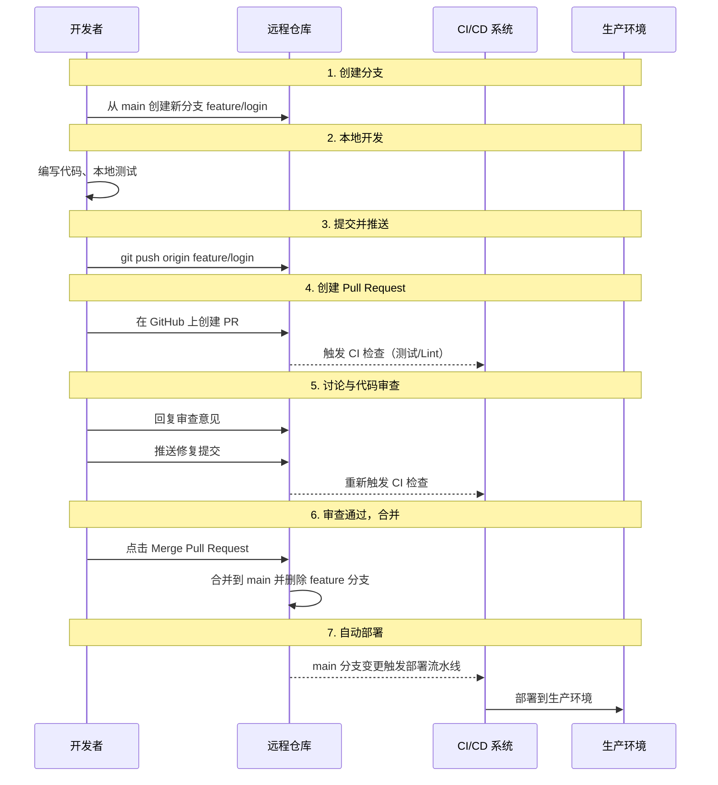
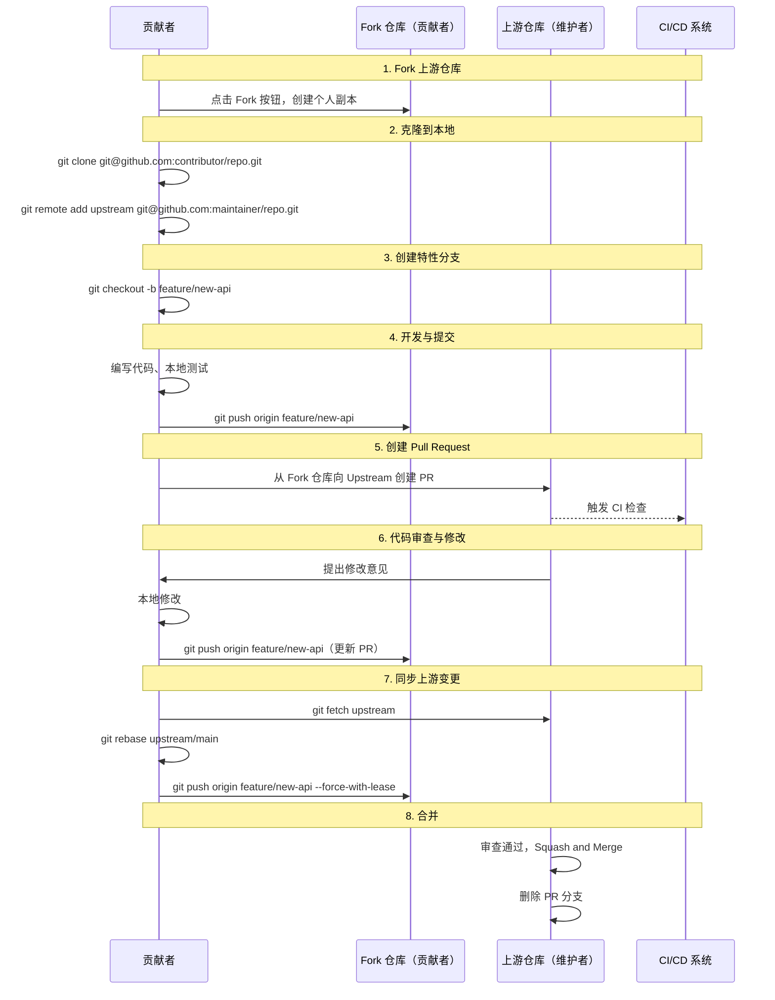
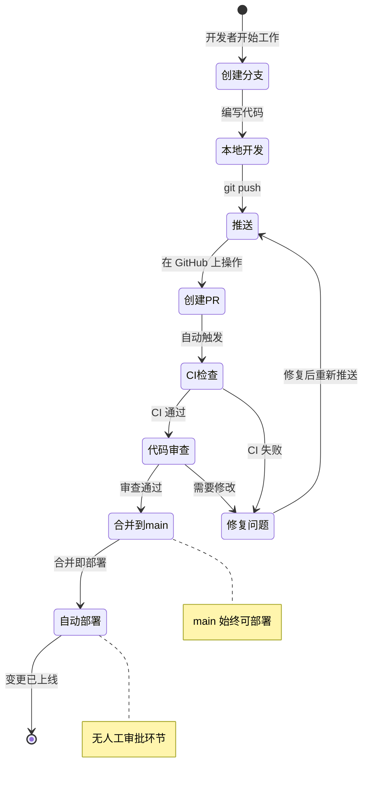
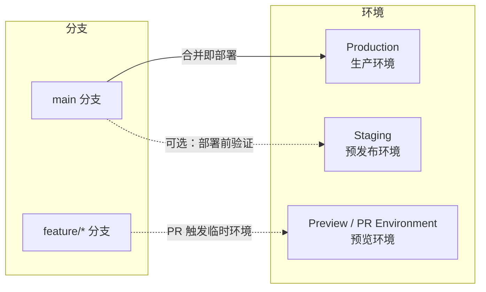
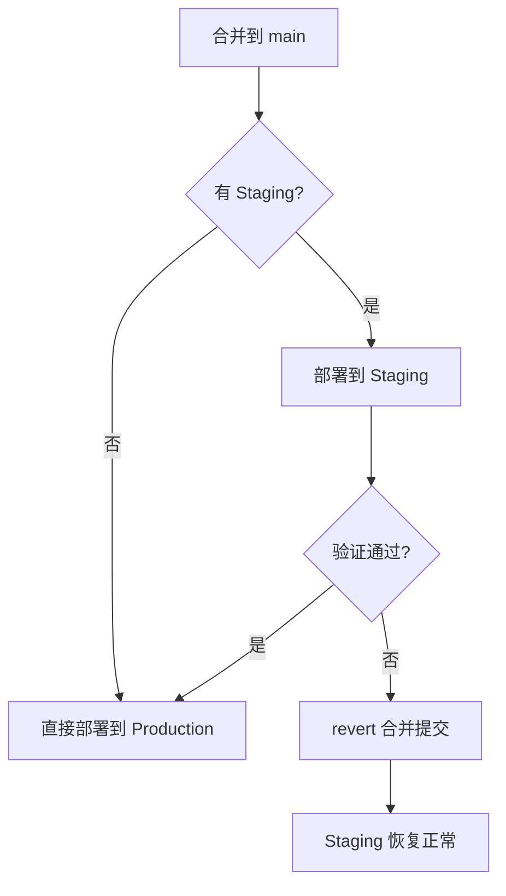
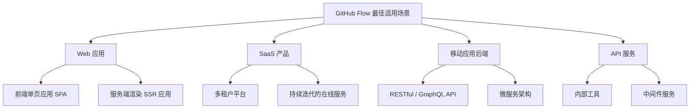
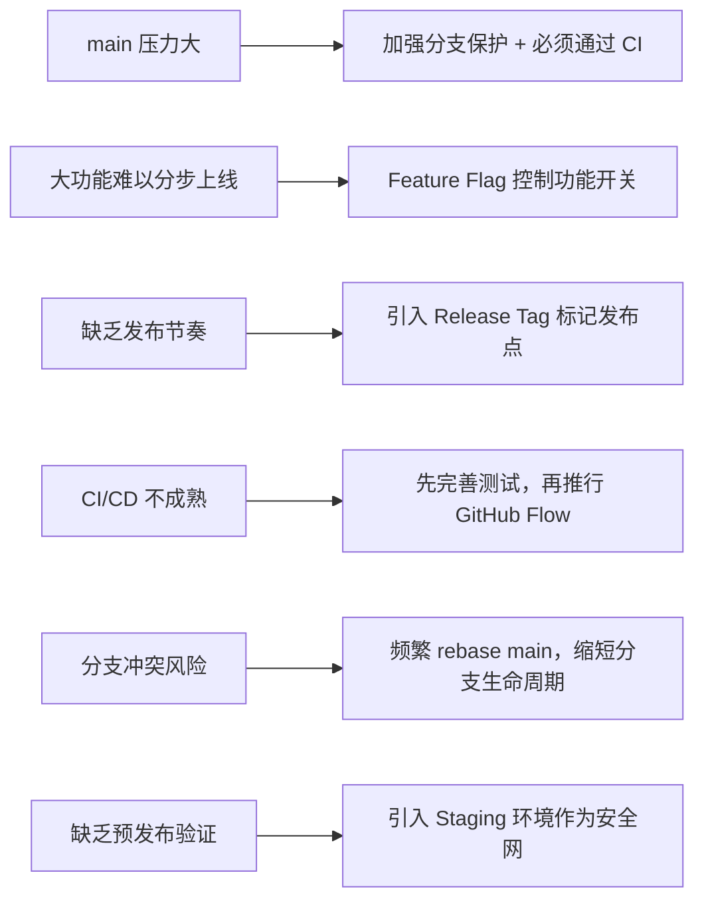

# GitHub Flow：最简洁的协作工作流

## 核心思想

GitHub Flow 是由 GitHub 提出并实践的一种轻量级分支工作流。它的哲学可以用一句话概括：

> **`main` 分支始终处于可部署状态，所有变更通过短生命周期的分支完成，合并即部署。**

与 Git Flow 那套复杂的分支体系不同，GitHub Flow 删除了 `develop`、`release`、`hotfix` 等预设分支，只保留一条长期分支 `main`。开发者的全部工作围绕一个简单循环展开：

**从 `main` 创建分支 → 开发 → 提交 → 创建 Pull Request → 讨论与审查 → 合并到 `main` → 自动部署**

这种极简设计并非偷懒，而是对现代 Web 开发节奏的精确回应——当部署从"按月发布"变为"每天多次发布"时，传统工作流中那些为发布阶段设计的分支就成了负担。

---

## 完整流程

### 流程序列图



### 每一步的关键要点

| 步骤 | 操作 | 关键要点 |
|------|------|----------|
| 创建分支 | `git checkout -b feature/login main` | 分支名应清晰表达意图，如 `feature/`、`fix/`、`chore/` 前缀 |
| 开发 | 本地编写代码 | 频繁提交，保持小步推进；每一步都应可编译 |
| 推送 | `git push origin feature/login` | 尽早推送，即使尚未完成——这会触发 CI 并让团队看到你的进度 |
| 创建 PR | 在 GitHub 上操作 | PR 描述应说明"做了什么"和"为什么做"，而非"怎么做的" |
| 讨论与审查 | 团队成员 Review | PR 是对话场所，不是审批关卡；鼓励提问和建议 |
| 合并 | 点击 Merge | 合并后立即删除远端分支，保持仓库整洁 |
| 部署 | 自动触发 | 合并到 `main` 即触发部署流水线，无需人工干预 |

---

## 与 Git Flow / Trunk-Based 的三角对比

```mermaid
graph TB
    subgraph GitFlow["Git Flow"]
        direction TB
        GF1["长期分支: main + develop"]
        GF2["辅助分支: feature / release / hotfix"]
        GF3["发布周期: 计划性发布"]
        GF4["复杂度: 高"]
    end

    subgraph GitHubFlow["GitHub Flow"]
        direction TB
        GHF1["长期分支: main"]
        GHF2["辅助分支: feature（短生命周期）"]
        GHF3["发布周期: 持续部署"]
        GHF4["复杂度: 低"]
    end

    subgraph TrunkBased["Trunk-Based Development"]
        direction TB
        TB1["长期分支: trunk（即 main）"]
        TB2["辅助分支: 极短生命周期分支 或 直接提交"]
        TB3["发布周期: 持续集成 + Feature Flag"]
        TB4["复杂度: 中（依赖基础设施）"]
    end
```



| 维度 | Git Flow | GitHub Flow | Trunk-Based |
|------|----------|-------------|-------------|
| **长期分支** | `main` + `develop` | `main` | `main`（trunk） |
| **辅助分支** | `feature` / `release` / `hotfix` | `feature`（短生命周期） | 极短分支或直接提交 |
| **发布机制** | `release` 分支冻结 → 测试 → 合并到 `main` | 合并到 `main` 即部署 | 合并到 `main` + Feature Flag 控制 |
| **hotfix 处理** | 专用 `hotfix` 分支，从 `main` 拉出 | 与普通 feature 相同流程 | 与普通 feature 相同流程 |
| **部署频率** | 低（按版本计划） | 高（持续部署） | 极高（持续部署） |
| **分支生命周期** | 长（数天到数周） | 短（数小时到数天） | 极短（数小时以内） |
| **代码审查** | 可选 | 强制（通过 PR） | 强制（通过 PR 或 Pair Programming） |
| **回滚策略** | `revert` 提交或重新发布 | `revert` PR 后重新部署 | `revert` 提交或关闭 Feature Flag |
| **学习成本** | 高 | **低** | 中 |
| **基础设施要求** | 低 | 中（需要 CI/CD） | 高（CI/CD + Feature Flag 系统） |
| **典型适用** | 有版本号的传统软件 | Web 应用、SaaS | 大规模团队、高频发布 |

**一句话总结**：Git Flow 为发布流程而设计，GitHub Flow 为持续部署而设计，Trunk-Based 为极致集成频率而设计。

---

## 开源项目协作模型：Fork → Branch → PR

GitHub Flow 在组织内部协作时，开发者直接在同一个仓库创建分支。但在开源项目中，外部贡献者没有仓库的写权限，因此需要一套扩展流程：**Fork 模型**。

### Fork 协作流程序列图



### Fork 模型 vs 直接分支模型

| 维度 | 直接分支模型（团队内部） | Fork 模型（开源协作） |
|------|--------------------------|----------------------|
| 仓库权限 | 开发者有写权限 | 贡献者无写权限 |
| 分支位置 | 同一仓库内 | 贡献者的 Fork 仓库 |
| PR 方向 | 仓库内分支 → `main` | Fork 仓库分支 → 上游 `main` |
| 同步上游 | `git pull origin main` | `git fetch upstream && git rebase upstream/main` |
| 合并方式 | 通常 Merge 或 Squash | 推荐 Squash and Merge（保持提交历史整洁） |
| 分支保护 | 可设置 | 必须设置（防止未授权推送） |

### 关键操作速查

```bash
# 1. Fork 后设置远程仓库
git clone git@github.com:YOUR_USERNAME/repo.git
cd repo
git remote add upstream git@github.com:ORIGINAL_OWNER/repo.git

# 2. 开始新工作前，同步上游
git fetch upstream
git checkout main
git rebase upstream/main

# 3. 创建分支并开发
git checkout -b feature/new-api
# ... 编写代码 ...
git add .
git commit -m "feat: add new API endpoint"

# 4. 推送并创建 PR
git push origin feature/new-api
# 在 GitHub 上从 YOUR_USERNAME:feature/new-api 向 ORIGINAL_OWNER:main 创建 PR

# 5. 收到审查意见后修改
# ... 修改代码 ...
git add .
git commit -m "fix: address review feedback"
git push origin feature/new-api

# 6. 如果上游 main 有新变更，先同步
git fetch upstream
git rebase upstream/main
git push origin feature/new-api --force-with-lease
```

---


## 部署即合并

GitHub Flow 最具颠覆性的理念是：**合并到 `main` 就等于部署到生产环境**。



### 这意味着什么

1. **`main` 的每一次提交都是一个潜在的发布**。因此 `main` 分支的保护至关重要——所有变更必须通过 PR 和审查，直接推送到 `main` 应被禁止。
2. **部署不再是独立事件**，而是合并的自然结果。不存在"准备发布"的状态——要么在分支上开发，要么已经在生产环境。
3. **回滚就是 `revert`**。如果线上出问题，`revert` 对应的合并提交，重新部署即可，无需特殊的热修复流程。

### 实现自动部署的典型配置

```yaml
# .github/workflows/deploy.yml
name: Deploy to Production

on:
  push:
    branches: [main]  # 只有 main 分支的推送触发部署

jobs:
  deploy:
    runs-on: ubuntu-latest
    steps:
      - uses: actions/checkout@v4
      - name: Run tests
        run: |
          npm install
          npm test
      - name: Deploy
        run: |
          # 部署到生产环境
          ./deploy.sh production
```

---

## 环境管理

在 GitHub Flow 中，环境与分支的映射关系非常简单：



### 各环境的作用

| 环境 | 对应分支 | 触发方式 | 用途 |
|------|----------|----------|------|
| **Production** | `main` | 合并到 `main` 自动触发 | 对外服务的正式环境 |
| **Staging** | `main` | 每次部署到 Production 前先部署到 Staging | 可选的预验证环境，用于最终检查 |
| **Preview** | `feature/*` | 创建或更新 PR 时触发 | 临时环境，供审查者实际体验变更效果 |

### 是否需要 Staging 环境？

GitHub Flow 的纯理论模型中，**不需要 Staging**——合并即部署。但在实践中，许多团队会引入一个 Staging 环境作为安全网：

- **无 Staging（纯 GitHub Flow）**：适合有完善自动化测试和监控的成熟团队。CI 全部通过 + 代码审查通过 = 足够的信心直接部署。
- **有 Staging（改良版）**：适合对稳定性要求极高或缺乏自动化测试覆盖的团队。合并后先部署到 Staging，人工验证后再推广到 Production。



### Preview 环境的价值

Preview 环境（也叫 Ephemeral Environment）是近年来的最佳实践。每当一个 PR 被创建或更新时，CI 系统会自动部署一个临时的预览环境：

- Vercel 的 Preview Deployments
- Netlify 的 Deploy Previews
- 自建方案：基于 Kubernetes 的临时命名空间

审查者可以直接在浏览器中体验变更效果，而不需要在本地拉取代码并启动服务。PR 合并或关闭后，预览环境自动销毁。

---

## 适用场景

### 最佳适用：Web 应用与 SaaS

GitHub Flow 天生适合以下场景：



**共同特征**：
- 部署是可控的——你掌控服务器，可以随时推送新版本
- 不存在"版本号"概念——用户永远使用最新版
- 回滚成本低——重新部署上一版本即可
- 变更频率高——每天甚至每小时都有新功能上线

### 不太适用：需要版本号的软件

以下场景不建议使用纯 GitHub Flow：

| 场景 | 原因 | 推荐替代 |
|------|------|----------|
| 桌面应用 / 移动端 App | 有版本号审核流程，无法持续部署 | Git Flow |
| 嵌入式固件 | 刷机成本高，回滚困难 | Git Flow |
| 开源库 / SDK | 需要语义化版本管理，API 兼容性承诺 | Git Flow + 语义化发布 |
| 大规模微服务团队 | 需要更细粒度的集成控制 | Trunk-Based + Feature Flag |

---

## 优缺点对比

### 优点

| 优点 | 说明 |
|------|------|
| **极简** | 只有一条长期分支，规则简单，新人快速上手 |
| **持续部署** | 合并即部署，从代码完成到上线的时间极短 |
| **强制代码审查** | 所有变更必须通过 PR，审查成为流程的固有环节 |
| **分支整洁** | 短生命周期分支 + 合并后删除，仓库不会积累大量陈旧分支 |
| **历史可追溯** | 每个 PR 对应一次完整的功能变更，通过 PR 编号即可定位上下文 |
| **回滚简单** | `revert` 合并提交即可回滚，不需要专门的热修复流程 |

### 缺点

| 缺点 | 说明 |
|------|------|
| **`main` 压力大** | 只有一条长期分支，所有变更都汇聚于此，任何问题直接影响生产环境 |
| **缺乏发布节奏** | 没有版本号概念，难以向客户承诺"下一个版本包含什么" |
| **不适合大功能** | 一个开发数周的大功能，在合并前一直在分支上，无法部分上线 |
| **依赖 CI/CD 成熟度** | 如果自动化测试覆盖不足，"合并即部署"就变成了"合并即冒险" |
| **缺乏预发布验证** | 纯理论模型没有 Staging 环境，对某些业务场景风险过高 |
| **冲突风险** | 多个长期存活的 feature 分支可能产生合并冲突，分支存活越久风险越大 |

### 缓解策略



---

## 小结

GitHub Flow 的本质是用**最少的分支规则**换取**最快的交付速度**。它的核心约束只有两条：

1. **`main` 分支始终可部署**——任何时刻，你都可以将 `main` 部署到生产环境。
2. **所有变更通过 PR**——没有人可以直接推送到 `main`，每一次变更都经过审查和验证。

这两条约束看似简单，实则对团队提出了隐性要求：自动化测试必须可靠，代码审查必须认真，部署流水线必须成熟。GitHub Flow 不是删掉 Git Flow 的分支就完事了——它是用工程能力替代流程约束。

当你团队的 CI/CD 体系足够健壮、代码审查文化足够成熟时，GitHub Flow 就是最自然、最高效的选择。反之，如果自动化测试覆盖不足、审查流于形式，那再简洁的工作流也只是把风险从流程转移到了生产环境。

**选择工作流的本质不是选择一种分支策略，而是选择与团队工程能力相匹配的协作节奏。**

