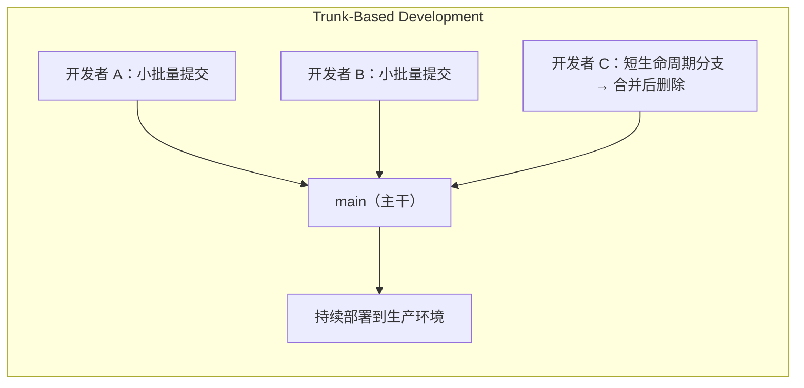
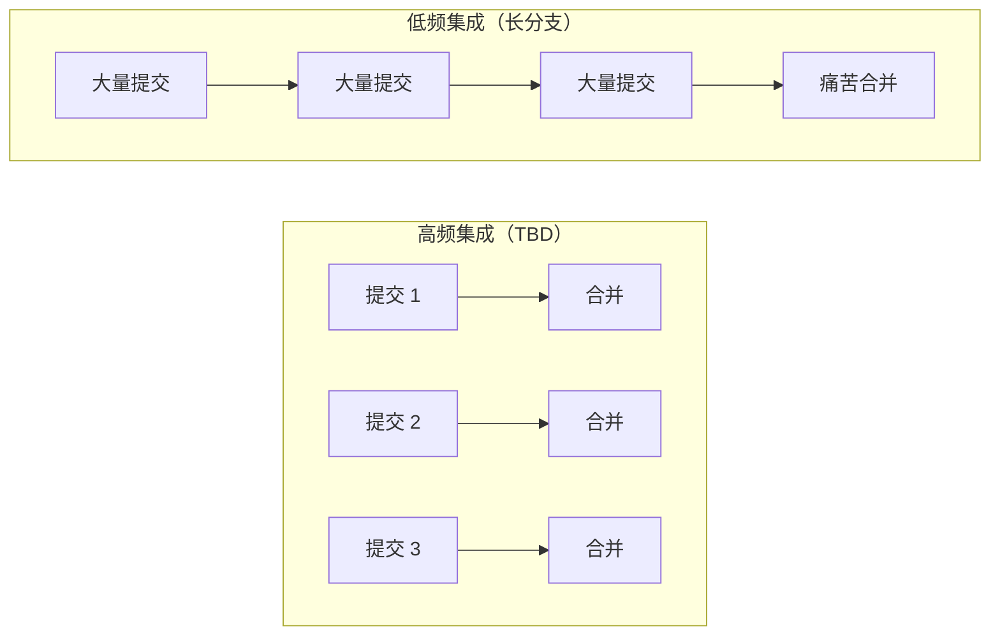
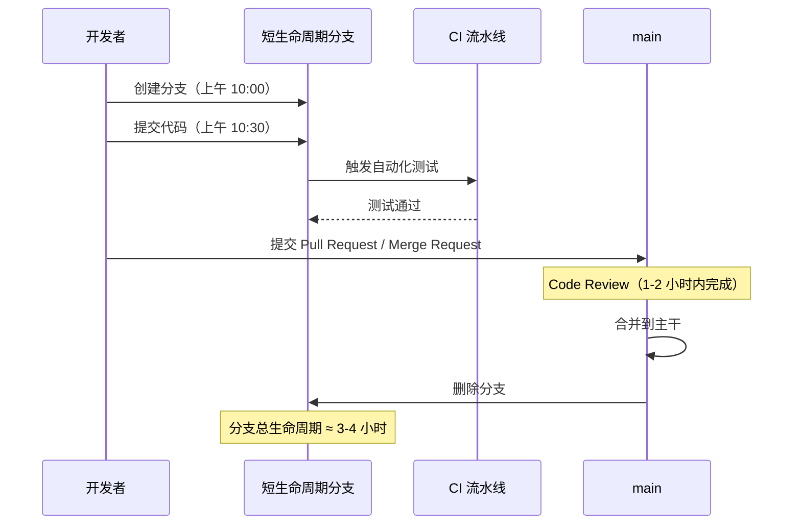
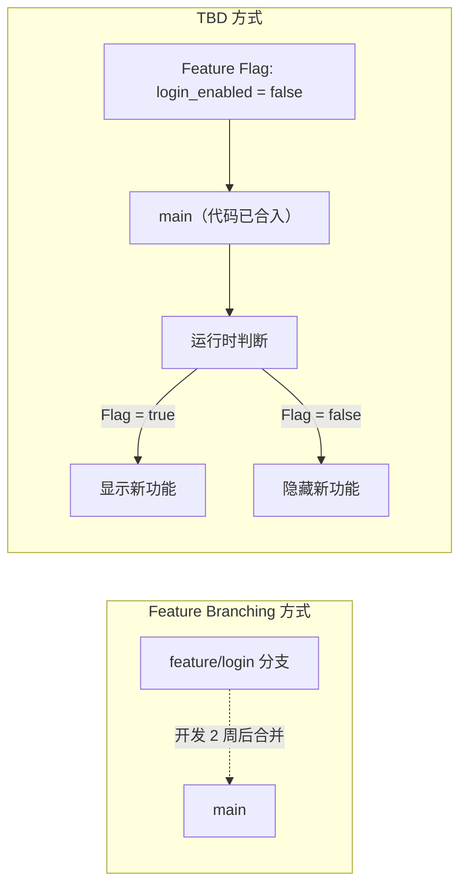
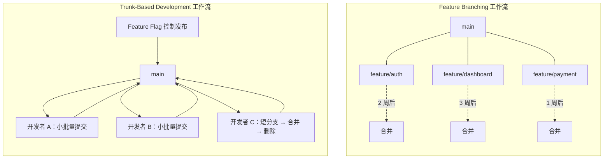
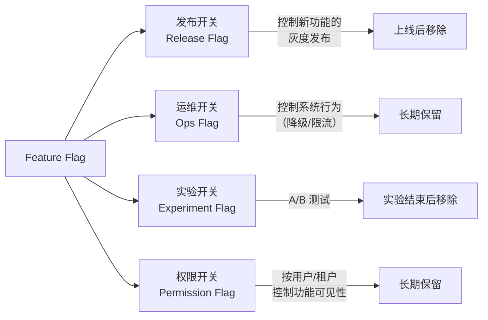
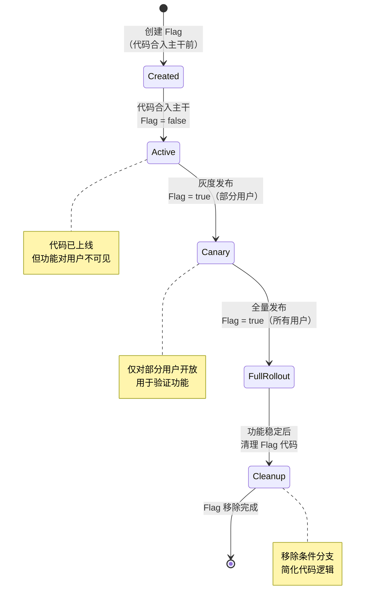
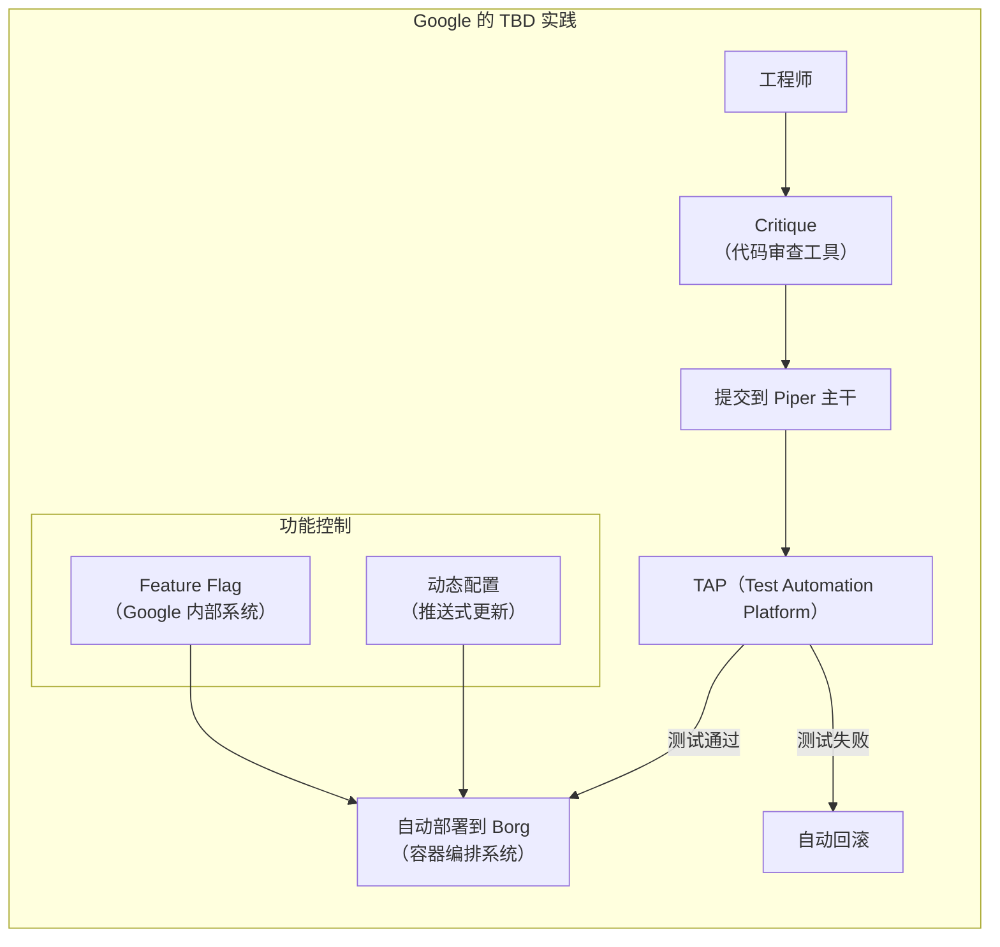
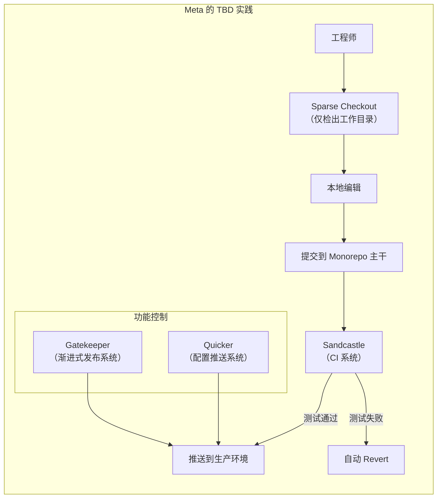
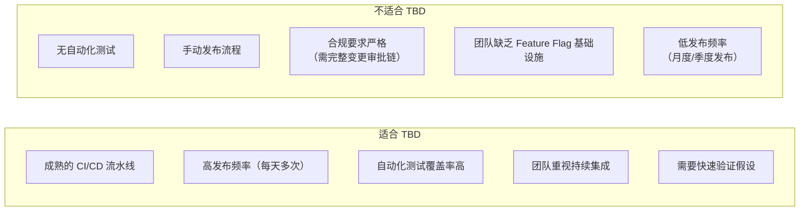

# Trunk-Based Development（主干开发）

## 核心思想

Trunk-Based Development（主干开发，简称 TBD）是一种版本控制协作策略，其核心主张极为简洁：**所有开发者在主干（main/master）分支上直接开发，或者使用极短生命周期的分支（通常不超过一天），完成后立即合并回主干并删除分支。**

这种策略的核心哲学是——**持续集成即是安全网**。与其通过长生命周期分支隔离变更、在后期合并时承受冲突代价，不如让所有人频繁地向主干集成，让问题在最小增量下暴露和修复。



TBD 不是近年来才出现的新概念。它是最早的版本控制协作方式之一——在分布式版本控制系统（如 Git）普及之前，集中式 VCS（如 CVS、SVN）时代，开发者们本质上就是在主干上工作的。TBD 在持续集成/持续交付（CI/CD）运动中焕发了新生，因为它的核心理念与 CI/CD 的自动化流水线天然契合。

---

## 核心实践

### 1. 频繁向主干集成——每天至少一次

每个开发者每天至少应该向主干集成一次代码。这不是一个宽松的建议，而是 TBD 得以运作的**硬性前提**。集成间隔越长，合并冲突的概率和复杂度呈指数级增长——这就是所谓的"集成地狱"（Integration Hell）。



**关键要点**：频繁集成降低了每次集成的风险，使问题定位变得容易——如果第 N 次提交破坏了构建，那问题一定出在第 N 次提交中，而非一个包含数十次提交的大合并里。

### 2. 极短生命周期分支——不超过一天

TBD 并不绝对禁止分支，但对分支的存活时间有严格限制：

- **分支存活时间 < 1 天**：创建分支 → 完成小功能 → 通过 CI → 合并回主干 → 删除分支
- **分支合并后立即删除**：代码库中不应存在长期悬挂的分支
- **分支的目的仅限于代码审查**：分支存在的意义是为 Code Review 提供一个审查单元，而非隔离开发



### 3. 特性开关（Feature Flag）代替长生命周期分支

这是 TBD 中最具颠覆性的实践。传统 Feature Branching 中，未完成的功能通过独立分支与主干隔离；而在 TBD 中，未完成的功能代码**已经合入主干**，但通过特性开关（Feature Flag）在运行时控制其可见性。



**特性开关的核心价值**：

| 维度 | 长生命周期分支 | 特性开关 |
|------|--------------|---------|
| 代码集成 | 延迟集成，冲突风险高 | 即时集成，冲突风险低 |
| 发布控制 | 分支合并才能发布 | 随时可以开关 |
| 回滚方式 | revert 提交或重新合并 | 关闭开关即可，秒级生效 |
| 测试策略 | 分支测试 + 合并后回归测试 | 始终在主干上下文中测试 |
| 团队协作 | 各自隔离，信息滞后 | 持续可见，即时同步 |

### 4. 小批量提交

TBD 要求每次提交的变更范围尽可能小——通常是一个逻辑完整的微小功能点、一次 bugfix、或一次重构。小批量提交带来的好处：

- **CI 反馈快速**：小变更构建快，测试快，问题定位快
- **Code Review 高效**：审查者可以在 15-30 分钟内完成审查
- **回滚成本低**：如果某个提交引入问题，revert 的影响范围可控
- **心理负担轻**：开发者不需要维护一个庞大的未合并变更集

一个实用的判断标准：**如果一次提交的 diff 超过了 400 行，就应该考虑拆分。**

---

## 与 Feature Branching 的对比

Feature Branching（特性分支）是目前业界采用最广泛的 Git 工作流，但它与 TBD 代表了两种截然不同的协作哲学。



| 对比维度 | Feature Branching | Trunk-Based Development |
|---------|-------------------|------------------------|
| 分支生命周期 | 数天到数周 | < 1 天 |
| 代码集成时机 | 功能完成后合并 | 持续集成，每天多次 |
| 未完成功能处理 | 保留在独立分支 | 合入主干，用 Feature Flag 控制 |
| 合并冲突频率 | 低频但高烈度 | 高频但极轻微 |
| 发布控制方式 | 分支合并触发 | Feature Flag + 持续部署 |
| 对 CI/CD 的要求 | 中等 | 极高 |
| 适合团队规模 | 中小团队 | 任何规模（需配套工具） |
| 代码审查方式 | Pull Request（异步） | 结对编程 / 短生命周期 PR |

**核心分歧**：Feature Branching 认为**隔离是安全的**，TBD 认为**集成才是安全的**。TBD 的观点是——延迟集成只是推迟了问题，而非消除了问题；问题越早暴露，修复成本越低。

---

## 特性开关（Feature Flag）集成

Feature Flag 是 TBD 得以实施的关键使能技术。没有 Feature Flag，TBD 就无法安全地将未完成代码合入主干。

### Feature Flag 的分类



### Feature Flag 的生命周期

Feature Flag 不是永久的——特别是发布开关和实验开关，必须在功能稳定后清理。否则，代码中会堆积大量废弃的条件分支，形成"Flag Debt"。




### 主流 Feature Flag 工具对比

| 工具 | 类型 | 特点 | 适用场景 |
|------|------|------|---------|
| **LaunchDarkly** | 商业 SaaS | 功能最完善，支持高级定向、A/B 测试、审计日志 | 大型企业，需要高级功能 |
| **Unleash** | 开源自托管 | 数据自主可控，支持多种策略引擎 | 对数据安全有要求的企业 |
| **Flagsmith** | 开源 | 轻量级，支持自托管和 SaaS | 中小团队 |
| **自建方案** | 自研 | 完全定制，与内部系统深度集成 | 有专门基础设施团队的大型公司 |

**代码示例——Feature Flag 的典型使用模式**：

```python
# 使用 Feature Flag 控制新功能的发布
def process_order(order):
    # 旧逻辑（始终执行）
    validate_order(order)

    # 新逻辑（由 Feature Flag 控制）
    if feature_flag.is_enabled("new_payment_flow", user=order.user):
        process_with_new_payment_flow(order)
    else:
        process_with_legacy_payment_flow(order)

    # 旧逻辑（始终执行）
    send_confirmation(order)
```

当 `new_payment_flow` Flag 被清理后，代码简化为：

```python
# Flag 清理后的代码
def process_order(order):
    validate_order(order)
    process_with_new_payment_flow(order)
    send_confirmation(order)
```

> **最佳实践**：发布开关的存活时间不应超过 2 周。建立 Flag 清理的定期审查机制，将 Flag 债务纳入技术债务管理。

---

## 大厂实践案例

### Google：Piper + Git

Google 是 TBD 的标杆实践者。其内部代码仓库 Piper 包含了超过 10 亿个文件，数万名工程师在同一个仓库中工作，所有变更直接提交到主干。



**关键机制**：

- **Critique**：Google 的代码审查工具，审查速度快（通常数小时内完成），确保主干变更的质量
- **TAP**：自动化测试平台，每次提交触发大规模测试，测试不通过则自动回滚
- **只读快照**：Piper 支持为任意提交创建只读快照，用于发布和审计
- **CitC（Clients in the Cloud）**：开发者本地工作区只是一个轻量级客户端，文件按需从 Piper 下载
- **自动回滚**：如果某个提交导致测试失败或性能回退，系统自动 revert，无需人工干预

Google 的 TBD 实践揭示了一个重要事实：**TBD 在超大规模下的可行性，取决于自动化基础设施的成熟度。**

### Meta：Monorepo + Sparse Checkout

Meta（原 Facebook）同样采用 TBD，其代码仓库也是一个巨型 Monorepo。Meta 的特殊之处在于通过 **Sparse Checkout** 和 **定制化工具链** 解决了巨型仓库的性能问题。



**关键机制**：

- **Gatekeeper**：Meta 的渐进式发布系统，功能从 1% 用户开始，逐步扩展到 100%。每个阶段都有自动化的指标监控，指标异常则自动回退
- **Sparse Checkout**：开发者只检出自己需要的目录，避免了巨型仓库的克隆开销
- **自动 Revert**：与 Google 类似，Meta 也有自动回滚机制。任何破坏主干的提交都会在几分钟内被 revert
- **Phabricator/DiffReview**：代码审查工具（Meta 曾开发并开源了 Phabricator），审查流程高效快速

> **两大厂的共同经验**：Google 和 Meta 的实践表明，TBD 在大规模团队中的成功依赖三个要素——**自动化测试、自动回滚、功能控制（Feature Flag / Gatekeeper）**。没有这三个要素，TBD 在大规模团队中将无法安全运作。

---

## 适用场景

TBD 并非银弹，它有明确的适用边界。



**最适合 TBD 的团队画像**：

- 持续部署团队：每次合入主干的变更都可以在数分钟内到达生产环境
- SaaS 产品团队：可以随时发布，无需协调发布窗口
- 高发布频率团队：每天多次发布，快速迭代
- 拥有成熟 CI/CD 体系的团队：自动化测试、自动部署、自动回滚一应俱全

**渐进式采用 TBD 的路径**：如果你的团队目前使用 Feature Branching，但不希望一步切换到 TBD，可以采取以下渐进策略：

1. **缩短分支生命周期**：从数周缩短到数天
2. **引入 Feature Flag**：先在现有 Feature Branching 工作流中使用 Feature Flag，建立基础设施
3. **增加集成频率**：从每周集成一次提升到每天集成一次
4. **加强自动化测试**：提高 CI 的覆盖率和速度
5. **逐步取消长生命周期分支**：当 CI 和 Feature Flag 都就绪后，自然过渡到 TBD

---

## 优缺点对比

| 维度 | 优点 | 缺点 |
|------|------|------|
| **集成风险** | 持续集成，几乎不存在合并冲突 | 对 CI 依赖极高，CI 故障则全团队阻塞 |
| **发布速度** | 代码合入即可发布，发布频率极高 | 未完成代码在主干中，需 Feature Flag 保护 |
| **代码质量** | 每次提交都经过完整 CI 验证 | 小提交可能导致主干频繁波动 |
| **团队协作** | 所有人始终在同一代码基础上工作 | 需要高度自律和文化认同 |
| **回滚能力** | Feature Flag 秒级关闭，或 revert 小提交 | revert 可能影响其他合入的提交 |
| **基础设施** | — | 需要 Feature Flag 系统、自动化测试、CI/CD 流水线 |
| **学习曲线** | 实践本身简单 | 思维转变困难，从"隔离安全"到"集成安全" |
| **合规审计** | 主干历史清晰，每个提交可追溯 | 某些行业合规要求可能不适应持续部署 |

---

## 小结

Trunk-Based Development 是一种以**持续集成为安全网**的协作策略，其核心实践可以归纳为四条：

1. **频繁集成**——每天至少一次向主干提交代码
2. **短生命周期分支**——分支存活不超过一天，合并后立即删除
3. **Feature Flag 代替长分支**——未完成功能通过运行时开关控制，而非代码分支隔离
4. **小批量提交**——每次提交的变更范围尽可能小，便于审查和回滚

TBD 不是一种可以独立采用的工作流——它的成功运作依赖于成熟的 CI/CD 流水线、自动化测试覆盖、Feature Flag 基础设施以及自动回滚机制。Google 和 Meta 等大厂的实践证明，TBD 在大规模团队中同样可行，但前提是自动化基础设施足够完善。

对于尚未具备这些条件的团队，建议采用渐进式过渡策略——先缩短分支生命周期、引入 Feature Flag、加强自动化测试，再逐步向 TBD 演进。**TBD 是目标状态，而非起点。**

