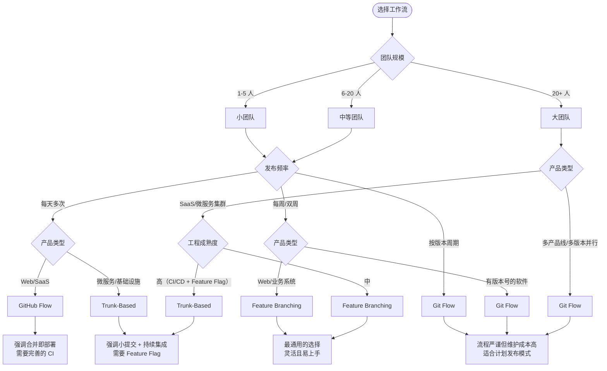
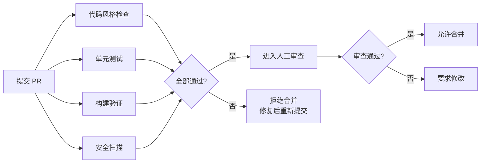
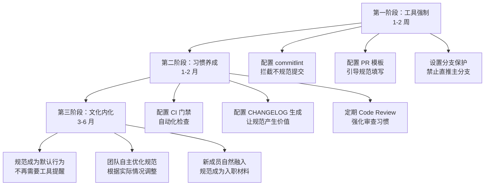

# 工作流选择与团队规范

在前面的章节中，我们分别介绍了 Feature Branching、Git Flow、Trunk-Based Development 和 GitHub Flow 这四种工作流。每种工作流都有它的适用场景，没有"最好的工作流"，只有"最适合的工作流"。

但问题来了：面对一个具体的团队和项目，你该怎么选？选完之后，又该怎么让团队真正用起来？

这一节，我将从横向对比出发，帮你建立一套工作流选择的决策框架，然后深入讲解团队 Git 规范的制定方法——从 Commit 规范到分支命名，从 PR 规范到 CHANGELOG 自动生成，最后给出从零落地团队规范的完整路径。

## 四种工作流横向对比

先来看一张总览表，把四种工作流放在一起比一比：

| 维度 | Feature Branching | Git Flow | Trunk-Based | GitHub Flow |
|------|-------------------|----------|-------------|-------------|
| **复杂度** | 低 | 高 | 中 | 低 |
| **核心分支** | `master` + 临时功能分支 | `master` + `develop` + `feature` + `release` + `hotfix` | `master`（或 `main`） | `master` + 临时功能分支 |
| **分支数量** | 少（2-5 个活跃） | 多（10+ 个活跃） | 极少（1-2 个长期） | 少（2-5 个活跃） |
| **发布方式** | 合并即发布 | release 分支统一发布 | 持续集成后自动发布 | 合并即部署 |
| **发布频率** | 中等 | 低（按版本周期） | 高（每天多次） | 高（持续部署） |
| **适用团队规模** | 2-15 人 | 5-50 人 | 2-20 人 | 2-15 人 |
| **适用产品类型** | Web 应用、常规业务系统 | 有明确版本号的软件（桌面/移动端） | SaaS、微服务、基础设施 | Web 应用、持续部署产品 |
| **学习成本** | 低 | 高 | 中 | 低 |
| **代码审查** | PR 审查 | PR 审查 + release 审查 | 强制 PR 审查 | PR 审查 |
| **回滚难度** | 简单（revert 合并提交） | 中等（需处理 release 分支） | 简单（feature flag 或 revert） | 简单（revert 合并提交） |

### 简要解读

**Feature Branching** 是最朴素的分支模型——每个功能一个分支，写完合并回主分支。它简单、灵活，是大多数中小团队的自然选择。

**Git Flow** 是最"重"的工作流，它为功能开发、版本发布、紧急修复分别设计了独立的分支通道，流程严谨但维护成本高。它最适合那些有明确版本号、按计划发布的产品——比如桌面软件、移动端 App。

**Trunk-Based Development** 走了另一个极端：所有人都在主干上开发，通过极小的提交和持续集成来保证质量。它对工程能力要求最高，但一旦跑通，发布效率也是最高的。

**GitHub Flow** 可以看作 Feature Branching 的"持续部署版"——分支模型和 Feature Branching 一样简单，但强调合并即部署，适合 Web 产品和 SaaS 服务。

## 工作流选择决策矩阵

光看对比表还不够，实际选择时需要根据团队的具体情况来决策。下面这张流程图，从团队规模、发布频率和产品类型三个维度帮你做出选择：



### 决策要点

1. **小团队 + 高频发布**：优先 GitHub Flow 或 Trunk-Based，别用 Git Flow——它的分支管理开销会拖慢你
2. **中等团队 + 常规业务系统**：Feature Branching 是最稳妥的选择，简单够用
3. **大团队 + 多版本并行**：Git Flow 的 release 分支机制能帮你管理版本，但要做好流程培训
4. **工程成熟度高**：无论团队大小，都可以考虑 Trunk-Based，它的效率上限最高

> 一个常见的误区：认为团队大了就必须用 Git Flow。实际上，Google、Facebook 等超大规模团队用的恰恰是 Trunk-Based。工作流的选择取决于工程能力，而不仅仅是人数。

## 团队 Git 规范制定指南

选好了工作流，接下来就是制定团队规范。规范不是束缚，而是让团队协作更顺畅的"交通规则"。没有规范的团队，就像没有红绿灯的十字路口——每个人都在按自己的方式走，迟早会撞车。

### Commit 规范：Conventional Commits

Commit 规范是所有 Git 规范的基石。一个清晰的提交历史，能让代码审查、版本回溯、CHANGELOG 生成都变得轻松。

目前最广泛采用的 Commit 规范是 **Conventional Commits**，它的格式如下：

```
<type>(<scope>): <subject>

<body>

<footer>
```

#### Type（提交类型）

| Type | 含义 | 是否影响 CHANGELOG | 示例 |
|------|------|-------------------|------|
| `feat` | 新功能 | 是（Minor） | `feat(user): add avatar upload` |
| `fix` | Bug 修复 | 是（Patch） | `fix(login): correct redirect after login` |
| `docs` | 文档变更 | 否 | `docs(api): update authentication guide` |
| `style` | 代码格式（不影响逻辑） | 否 | `style: fix indentation in utils.js` |
| `refactor` | 重构（不是新功能也不是修复） | 否 | `refactor(db): extract connection pool` |
| `perf` | 性能优化 | 否 | `perf(list): virtualize large list rendering` |
| `test` | 添加或修改测试 | 否 | `test(user): add login unit tests` |
| `chore` | 构建过程或辅助工具变动 | 否 | `chore: upgrade webpack to v5` |
| `ci` | CI 配置变动 | 否 | `ci: add GitHub Actions workflow` |
| `build` | 构建系统或外部依赖变动 | 否 | `build: update npm dependencies` |
| `revert` | 回退之前的提交 | 是 | `revert: revert feat(user): add avatar upload` |

#### Scope（影响范围）

Scope 是可选的，用于说明提交影响的模块或包。例如：

- `feat(auth): add OAuth2 support` —— 认证模块新增 OAuth2
- `fix(api): handle timeout error` —— API 模块修复超时
- `docs(readme): update installation steps` —— README 更新

#### Subject（简要描述）

- 使用祈使句、现在时："add feature" 而非 "added feature" 或 "adds feature"
- 首字母小写，结尾不加句号
- 控制在 50 个字符以内

#### Body（详细描述）

- 使用祈使句、现在时
- 说明"为什么"做这个改动，而不是"做了什么"（做什么已经由 diff 展示了）
- 与 subject 之间空一行

#### Footer（脚注）

- **Breaking Change**：以 `BREAKING CHANGE:` 开头，描述不兼容变更
- **关闭 Issue**：使用 `Closes #123` 或 `Fixes #456`

#### 完整示例

```
feat(pay): add WeChat Pay integration

WeChat Pay is the most popular payment method in China.
This commit adds the SDK integration and the payment
flow for QR-code based transactions.

Closes #289
```

```
fix(auth): prevent session fixation attack

The previous session ID was not regenerated after login,
which could allow session fixation attacks. Now a new
session ID is generated upon successful authentication.

BREAKING CHANGE: `SessionManager.init()` now requires
a `regenerateId` option to be set to `true`
```

#### 工具保障：commitlint + husky

规范光靠自觉是不够的，需要工具来强制执行。`commitlint` 可以在提交时检查 Commit Message 是否符合规范，配合 `husky` 的 `commit-msg` 钩子，不符合规范的提交会被直接拒绝：

```shell
# 安装
npm install --save-dev @commitlint/cli @commitlint/config-conventional husky

# 配置 commitlint
echo "module.exports = { extends: ['@commitlint/config-conventional'] };" > commitlint.config.js

# 配置 husky 钩子（husky v9+ 直接创建钩子文件）
echo "npx --no -- commitlint --edit \$1" > .husky/commit-msg
```

配置完成后，如果你写了一个不符合规范的提交信息：

```shell
git commit -m "修复了一个bug"
# ⧗   input: 修复了一个bug
#    subject must not be sentence-case, start-case, pascal-case, or upper-case [subject-case]
#    type must be one of [feat, fix, docs, style, refactor, perf, test, chore, ci, build, revert] [type-enum]
#
#    found 2 problems, 0 warnings
```

只有改成规范格式才能提交成功：

```shell
git commit -m "fix(auth): prevent session fixation attack"
# [main abc1234] fix(auth): prevent session fixation attack
```


### 分支命名规范

分支命名规范能让团队成员一眼看出分支的用途、关联的 Issue 和负责人。

#### 基本格式

```
<type>/<ticket-id>-<short-description>
```

#### 各类型分支的前缀

| 前缀 | 用途 | 示例 |
|------|------|------|
| `feature/` | 新功能 | `feature/PROJ-123-add-wechat-pay` |
| `fix/` | Bug 修复 | `fix/PROJ-456-login-redirect` |
| `hotfix/` | 紧急线上修复 | `hotfix/PROJ-789-payment-timeout` |
| `release/` | 发布分支（Git Flow） | `release/v2.1.0` |
| `refactor/` | 重构 | `refactor/PROJ-101-extract-connection-pool` |
| `docs/` | 文档 | `docs/PROJ-202-api-guide` |
| `chore/` | 杂项 | `chore/PROJ-303-upgrade-webpack` |
| `experiment/` | 实验性功能 | `experiment/new-auth-flow` |

#### 命名规则

1. **全部小写**：用 `-` 分隔单词，不用 `_` 或驼峰
2. **包含 Ticket ID**：关联 Jira/GitHub Issue，方便追溯
3. **简短描述**：控制在 3-5 个单词以内
4. **避免人名**：分支属于功能，不属于个人

```shell
# 好的命名
feature/PROJ-123-add-wechat-pay
fix/PROJ-456-login-redirect
hotfix/PROJ-789-payment-timeout

# 不好的命名
zhangsan-branch
fix-bug
feature/new-stuff
my-work
```

### PR 规范

PR（Pull Request）是代码进入主分支的最后一道关卡。好的 PR 规范能大幅提升代码审查的效率和质量。

#### PR 标题规范

PR 标题应遵循与 Commit 规范相同的格式：

```
<type>(<scope>): <subject>
```

例如：

- `feat(pay): add WeChat Pay integration`
- `fix(auth): prevent session fixation attack`
- `refactor(db): extract connection pool logic`

#### PR 描述模板

一个完善的 PR 模板应该包含以下内容：

```markdown
## 变更类型

- [ ] feat: 新功能
- [ ] fix: Bug 修复
- [ ] refactor: 重构
- [ ] docs: 文档
- [ ] style: 格式
- [ ] test: 测试
- [ ] chore: 构建/工具

## 变更说明

<!-- 简要描述本次变更的内容和原因 -->

## 关联 Issue

Closes #

## 变更详情

<!-- 详细说明改了什么、为什么这样改 -->

## 测试情况

- [ ] 单元测试已通过
- [ ] 集成测试已通过
- [ ] 手动测试已通过

<!-- 描述测试方法和结果 -->

## 截图/录屏

<!-- 如果是 UI 变更，附上截图或录屏 -->

## 检查清单

- [ ] 代码遵循项目编码规范
- [ ] 没有引入新的 warning
- [ ] 对用户文档做了相应更新（如需要）
- [ ] 变更不涉及 Breaking Change（或已在描述中说明）
```

在 GitHub 仓库中，将这个模板保存为 `.github/PULL_REQUEST_TEMPLATE.md`，创建 PR 时就会自动填充。

#### 审查要求

| 要求 | 说明 |
|------|------|
| **审查人数** | 至少 1 人 approve 才能合并，核心模块建议 2 人 |
| **审查范围** | 代码逻辑、命名规范、边界条件、安全性、性能 |
| **审查时限** | 小 PR（< 200 行）24 小时内完成，大 PR 48 小时内 |
| **PR 大小** | 单个 PR 控制在 400 行以内，超过则拆分 |
| **自审** | 提交 PR 前先自己审查一遍，确保没有低级错误 |

#### CI 门禁

PR 合并前必须通过的自动化检查：



典型的 GitHub Actions CI 配置：

```yaml
name: PR Check

on:
  pull_request:
    branches: [main]

jobs:
  lint:
    runs-on: ubuntu-latest
    steps:
      - uses: actions/checkout@v4
      - uses: actions/setup-node@v4
        with:
          node-version: 20
      - run: npm ci
      - run: npm run lint

  test:
    runs-on: ubuntu-latest
    steps:
      - uses: actions/checkout@v4
      - uses: actions/setup-node@v4
        with:
          node-version: 20
      - run: npm ci
      - run: npm test

  build:
    runs-on: ubuntu-latest
    steps:
      - uses: actions/checkout@v4
      - uses: actions/setup-node@v4
        with:
          node-version: 20
      - run: npm ci
      - run: npm run build
```

在 GitHub 仓库的 Settings > Branches > Branch protection rules 中，将 `main` 分支设置为：

- Require a pull request before merging
- Require approvals (1-2)
- Require status checks to pass before merging
- Require branches to be up to date before merging


### CHANGELOG 自动生成

当团队严格执行了 Conventional Commits 规范后，CHANGELOG 就可以自动生成了——因为每个提交的类型已经明确标注了它是新功能、修复还是破坏性变更。

#### standard-version

`standard-version` 是最简单的选择，它同时处理版本号升级和 CHANGELOG 生成：

> 注：`standard-version` 已进入维护模式，官方建议新项目改用 `release-please` 或 `semantic-release`；但对于理解"提交规范驱动自动发布"的机制，它依然是最直接的参考。

```shell
# 安装
npm install --save-dev standard-version

# 在 package.json 中添加脚本
# "scripts": { "release": "standard-version" }

# 首次发布（生成 CHANGELOG.md）
npm run release -- --first-release

# 后续发布
npm run release        # Patch: 1.0.0 -> 1.0.1
npm run release -- --release-as minor   # Minor: 1.0.0 -> 1.1.0
npm run release -- --release-as major   # Major: 1.0.0 -> 2.0.0
npm run release -- --release-as 2.0.0   # 指定版本号
```

执行 `npm run release` 时，`standard-version` 会：

1. 根据 Conventional Commits 判断版本号应该升 Major、Minor 还是 Patch
2. 更新 `package.json` 中的版本号
3. 生成/更新 `CHANGELOG.md`
4. 创建一个 `chore(release): vX.Y.Z` 的提交
5. 创建 `vX.Y.Z` 的 Git Tag

生成的 CHANGELOG 格式如下：

```markdown
# Changelog

## [1.2.0](https://github.com/.../compare/v1.1.0...v1.2.0) (2025-03-15)

### Features

* **pay:** add WeChat Pay integration ([abc1234](...)), closes [#289](...)
* **user:** support avatar upload ([def5678](...))

### Bug Fixes

* **auth:** prevent session fixation attack ([ghi9012](...)), closes [#312](...)
* **login:** correct redirect after login ([jkl3456](...))

### BREAKING CHANGES

* **auth:** `SessionManager.init()` now requires a `regenerateId` option
```

#### conventional-changelog

如果需要更精细的控制，可以使用 `conventional-changelog`：

```shell
# 安装
npm install --save-dev conventional-changelog-cli

# 生成 CHANGELOG
npx conventional-changelog -p angular -i CHANGELOG.md -s

# 在 package.json 中添加脚本
# "scripts": { "changelog": "conventional-changelog -p angular -i CHANGELOG.md -s" }
```

`conventional-changelog` 支持多种预设（preset），最常用的是 `angular`，它和 Conventional Commits 完全兼容。

#### 两者对比

| 维度 | standard-version | conventional-changelog |
|------|-----------------|----------------------|
| 功能范围 | 版本号 + CHANGELOG + Git Tag | 仅 CHANGELOG |
| 配置复杂度 | 低（开箱即用） | 中（需要自行组合工具链） |
| 灵活性 | 中 | 高 |
| 适合场景 | 中小项目、快速上手 | 大型项目、需要定制化 |

> 对于大多数团队，建议从 `standard-version` 开始。等团队成熟后，如果需要更灵活的发布流程（比如 monorepo 多包发布），再迁移到 `conventional-changelog` + `lerna` / `changesets` 等工具。

## 从零开始制定团队规范

了解了各项规范的内容后，接下来是实操：如何从零开始，为团队制定一套 Git 规范。

### 第一步：评估现状

在制定规范之前，先搞清楚团队现在是什么状态：

- 团队有多少人？预计未来会增长到多少？
- 目前在用什么工作流？有没有明确的规范？
- 代码仓库的提交历史是否混乱？
- 有没有 CI/CD 流程？
- 团队成员的 Git 水平如何？

### 第二步：选择工作流

根据前面的决策矩阵，结合团队现状选择工作流。选择时遵循一个原则：**选最简单的那个**。简单的工作流可以逐步增强，但复杂的工作流一旦建立就很难简化。


### 第三步：制定 Commit 规范

这是优先级最高的规范，因为它是其他规范的基础：

1. 确定 type 列表：从 `feat`、`fix`、`docs`、`style`、`refactor`、`test`、`chore` 这 7 个基础类型开始
2. 确定 scope 列表：根据项目模块划分，比如 `auth`、`pay`、`api`、`ui`
3. 配置 `commitlint` + `husky`，强制执行

### 第四步：制定分支命名规范

1. 确定分支前缀：`feature/`、`fix/`、`hotfix/` 是必须的，其他根据工作流需要添加
2. 确定 Ticket ID 格式：Jira 用 `PROJ-123`，GitHub Issue 用 `#123`
3. 在团队文档中明确命名规则，并给出正反例

### 第五步：制定 PR 规范

1. 编写 PR 模板，保存到 `.github/PULL_REQUEST_TEMPLATE.md`
2. 确定审查人数和审查时限
3. 配置 CI 门禁（lint + test + build）
4. 设置分支保护规则


### 第六步：配置 CHANGELOG 自动生成

1. 安装 `standard-version`
2. 在 `package.json` 中添加 `release` 脚本
3. 首次运行生成 `CHANGELOG.md`
4. 将 `CHANGELOG.md` 纳入版本管理

### 第七步：编写团队文档

将所有规范整理成一份团队文档，放在仓库的 `docs/git-conventions.md` 或 `CONTRIBUTING.md` 中。文档应包含：

- 工作流说明和分支模型图
- Commit 规范及示例
- 分支命名规范及示例
- PR 流程和模板
- 常见问题 FAQ

### 第八步：培训与试运行

1. 组织一次团队培训，讲解规范内容和工具使用
2. 选择 1-2 个项目试运行 2-4 周
3. 收集反馈，调整规范中不合理的部分
4. 全团队推广

## 规范的渐进式落地策略

规范制定容易，落地难。很多团队的规范文档写得很好，但实际执行时却形同虚设。问题通常出在两个地方：一是规范太复杂，二是没有工具保障。

### 渐进式落地的三个阶段



### 第一阶段：工具强制（1-2 周）

这个阶段的目标是**用工具拦截不合规的操作**，让团队成员"不得不"遵守规范。

| 动作 | 工具 | 效果 |
|------|------|------|
| 拦截不规范的 Commit Message | commitlint + husky | 不符合 Conventional Commits 的提交被拒绝 |
| 引导规范填写 PR | PR 模板 | 创建 PR 时自动填充模板 |
| 禁止直推主分支 | GitHub Branch Protection | 所有变更必须通过 PR |
| 自动检查代码风格 | ESLint/Prettier + CI | 风格不合规的 PR 无法合并 |

这个阶段团队成员可能会觉得"麻烦"，这是正常的。关键是让工具做"坏人"，而不是让人做"坏人"——被工具拒绝和被同事拒绝，感受完全不同。

### 第二阶段：习惯养成（1-2 月）

当工具强制运行了一段时间后，团队成员开始适应规范，这个阶段的目标是**让规范产生可见的价值**。

| 动作 | 效果 |
|------|------|
| 配置 CHANGELOG 自动生成 | 团队看到规范的 Commit 带来了自动化的 CHANGELOG，感受到规范的"回报" |
| 配置 CI 门禁 | 自动化检查减少了人工审查的负担，审查者可以专注于逻辑而非格式 |
| 定期 Code Review | 通过审查讨论强化规范意识，让规范从"规则"变成"共识" |
| 发布版本时使用 `standard-version` | 一条命令完成版本号升级 + CHANGELOG 生成 + Tag 创建，效率提升明显 |

这个阶段的关键是让团队感受到规范带来的好处，而不仅仅是约束。当 CHANGELOG 可以自动生成、版本发布可以一键完成时，大家就会从"被迫遵守"转向"主动遵守"。

### 第三阶段：文化内化（3-6 月）

当规范执行了足够长的时间后，它会逐渐成为团队的默认行为。

| 标志 | 说明 |
|------|------|
| 不需要工具提醒 | 团队成员写 Commit Message 时自然使用 `feat:`/`fix:` 前缀 |
| 新成员自然融入 | 规范文档成为入职材料，新人在老成员的带动下自然遵守 |
| 团队自主优化 | 团队根据实际经验主动提出规范调整建议 |
| 规范成为常识 | "为什么要这样写 Commit"不再需要解释 |

### 落地过程中的常见问题

**Q：团队有人抵触规范怎么办？**

A：先确保规范是合理的，然后让工具做执行者。如果有人觉得规范太繁琐，可以讨论简化，但不能跳过。关键是：规范是团队共识，不是个人偏好。

**Q：历史项目怎么推行规范？**

A：不要试图一次性改造历史提交。从某个时间点开始执行新规范即可，历史提交保持原样。可以在 CHANGELOG 中标注"从此版本开始采用 Conventional Commits 规范"。

**Q：规范太严格导致效率下降怎么办？**

A：规范应该服务于效率，而不是阻碍效率。如果某条规范确实造成了明显的效率问题，就应该调整。渐进式落地的意义就在于：先跑通最小规范，再逐步增强。

**Q：紧急修复时还要遵守规范吗？**

A：是的，但可以简化。紧急修复的 Commit 至少要有 `fix:` 前缀和简要描述，PR 可以简化审查流程（比如只要求 1 人 approve），但不能跳过。

## 小结

这一节覆盖了工作流选择和团队规范制定的完整内容：

1. **工作流选择**：没有最好的工作流，只有最适合的。通过横向对比和决策矩阵，根据团队规模、发布频率和产品类型来选择。核心原则是——选最简单的那个。

2. **Commit 规范**：Conventional Commits 是基石。`feat`/`fix`/`docs`/`refactor`/`test`/`chore` 等 type 让提交历史一目了然，配合 `commitlint` + `husky` 强制执行。

3. **分支命名规范**：`<type>/<ticket-id>-<short-description>` 格式，让分支用途和关联 Issue 一目了然。

4. **PR 规范**：模板引导 + 审查要求 + CI 门禁，三道关卡保证代码质量。

5. **CHANGELOG 自动生成**：规范的 Commit 是自动化的前提，`standard-version` 让版本发布一键完成。

6. **渐进式落地**：工具强制 -> 习惯养成 -> 文化内化，三个阶段逐步推进，让规范从"约束"变成"习惯"。

记住：规范的目的是让团队协作更高效，而不是制造流程负担。好的规范应该是"用起来自然，不用反而不习惯"的。

