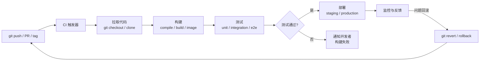
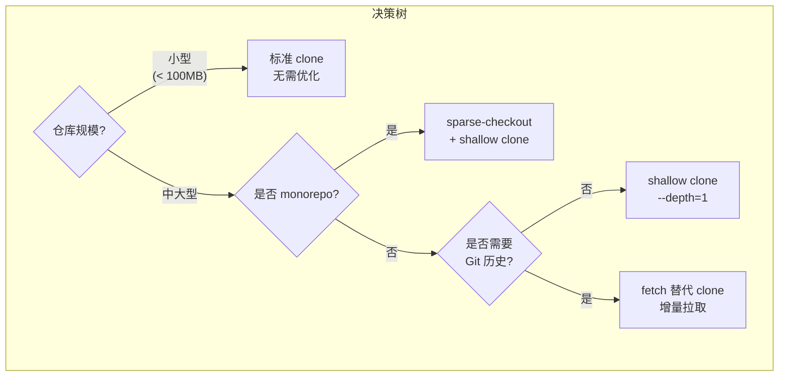
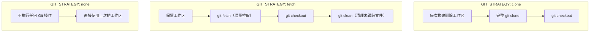
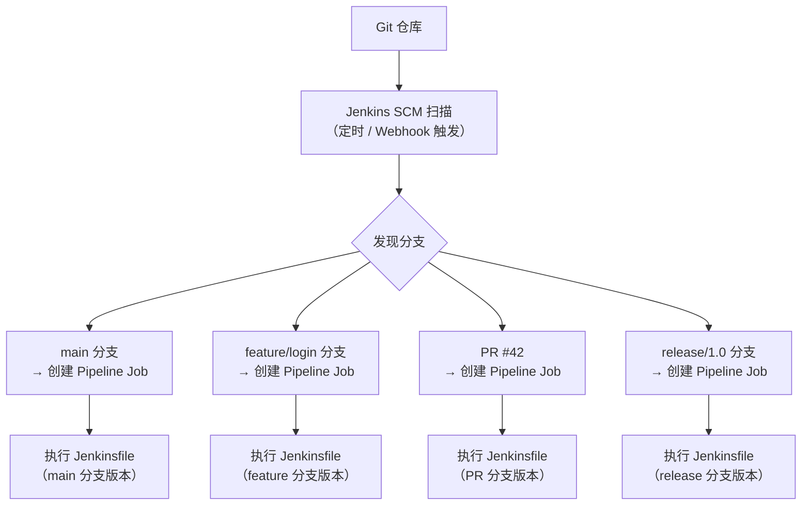
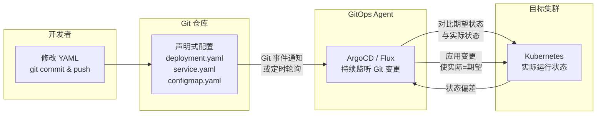
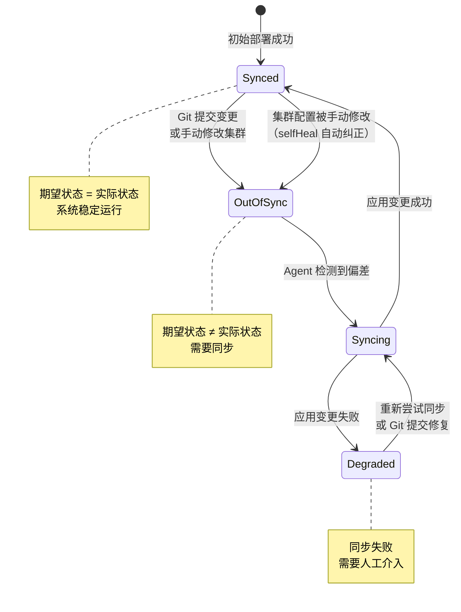
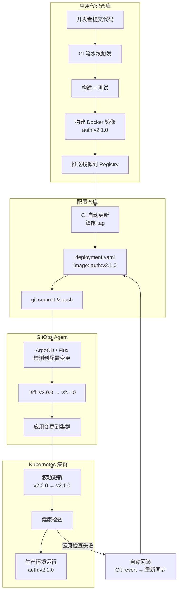

# CI/CD 集成：让 Git 驱动自动化流水线

在现代软件开发中，代码从提交到上线之间的每一步都应当是自动化的、可重复的、可追溯的。CI/CD（持续集成 / 持续交付）正是实现这一目标的核心实践，而 Git 作为版本控制的基础设施，是整个 CI/CD 流水线的起点和枢纽。每一次 `git push` 都可以触发构建、测试、部署；每一条分支都可以对应一个独立的验证环境；每一个 tag 都可以标记一次正式发布。

本节将从 Git 在 CI/CD 中的角色出发，系统讲解主流 CI/CD 平台中的 Git 集成方式，以及 GitOps 这一将 Git 推向极致的运维范式。

## CI/CD 中 Git 操作的核心流程

Git 在 CI/CD 中的核心角色是**事件源**和**代码载体**。开发者的每一次提交、每一次合并、每一次打 tag，都是 CI/CD 系统的触发信号。系统响应这些信号，拉取代码、执行流水线、交付产物。整个流程可以概括如下：



这个流程中有几个关键点值得注意：

1. **触发粒度**：可以基于分支、tag、PR 事件等不同粒度触发，不同粒度对应不同的流水线策略。
2. **代码拉取**：CI 环境中的 Git 操作需要优化——每次构建都完整克隆仓库是低效的。
3. **回滚即 Git 操作**：生产环境出问题时，最可靠的回滚方式就是 `git revert` 后重新走一遍流水线，而不是手动修改服务器。

## CI 环境中的 Git 优化

在 CI 环境中，Git 操作的效率直接影响构建速度。一个大型仓库完整克隆可能需要数分钟，而 CI 流水线通常只需要当前提交的代码来执行构建和测试。以下是三种核心优化手段。

### 浅克隆（Shallow Clone）

默认的 `git clone` 会拉取仓库的完整历史，但在 CI 中，构建和测试通常不需要历史记录。浅克隆只拉取指定深度的提交历史：

```bash
# 只拉取最近一次提交
git clone --depth=1 https://github.com/org/repo.git

# 拉取最近 5 次提交（某些场景需要少量历史，如 changelog 生成）
git clone --depth=5 https://github.com/org/repo.git
```

`--depth=1` 是 CI 中最常用的配置，它将克隆时间从分钟级降到秒级。但需要注意其局限性：

- **无法执行 `git log`**：只有一条历史记录，无法查看完整提交历史。
- **无法 `git blame`**：追溯代码变更来源需要完整历史。
- **无法 `git diff` 两个非最新提交**：浅克隆中不存在历史提交对象。
- **rebase / merge 可能失败**：这些操作需要共同祖先，浅克隆中可能缺失。

因此，浅克隆适用于"只构建不回溯"的场景。如果流水线中需要执行代码分析、changelog 生成等依赖历史的操作，应适当增大 `--depth` 或放弃浅克隆。

### Sparse Checkout

当仓库采用 monorepo 策略时，仓库可能包含数十个模块，但单次构建只需要其中一两个。Sparse checkout 允许只检出仓库中的部分目录：

```bash
# 初始化仓库但不检出
git clone --no-checkout https://github.com/org/monorepo.git
cd monorepo

# 启用 sparse checkout
git sparse-checkout init --cone

# 只检出 services/auth 和 libs/core 两个目录
git sparse-checkout set services/auth libs/core

# 执行检出
git checkout
```

Git 2.25+ 引入的 cone 模式（`--cone`）显著提升了 sparse checkout 的性能，它通过跳过不需要的目录树来加速检出。在大型 monorepo 中，sparse checkout 可以将检出时间从数十秒降到几秒，同时大幅减少磁盘占用。

### Fetch 替代 Clone

CI Runner 通常会在多次构建之间保留工作区。与其每次都 `git clone`，不如复用已有仓库，只拉取增量变更：

```bash
# 首次构建：完整克隆
git clone https://github.com/org/repo.git
cd repo

# 后续构建：只拉取增量
git fetch origin main
git checkout FETCH_HEAD

# 或者更精确地：拉取特定提交
git fetch origin abc1234
git checkout FETCH_HEAD
```

这种策略的优势在于：

- **网络传输量最小化**：只传输新增的提交和对象，而非整个仓库。
- **本地对象复用**：已存在的 Git 对象不需要重新传输和解压。
- **构建缓存友好**：配合构建缓存（如 Docker layer cache、Maven local repo），可以实现接近增量的构建。

大多数 CI 平台在底层已经实现了这种优化——当你在配置中看到 `fetch-depth` 或 `GIT_DEPTH` 时，平台实际上是在已有仓库上执行 `git fetch --depth=N`，而非每次从头克隆。

### 三种优化策略的对比



## GitHub Actions 中的 Git 集成

GitHub Actions 是 GitHub 原生的 CI/CD 平台，与 Git 的集成最为紧密。它的配置文件 `.github/workflows/*.yml` 直接存放在仓库中，实现了"流水线即代码"。

### checkout action 配置

`actions/checkout` 是几乎所有 GitHub Actions 工作流的第一步，它负责将仓库代码拉取到 Runner 的工作区。其核心参数与 Git 操作直接相关：

```yaml
steps:
  # 基础用法：浅克隆，depth=1
  - uses: actions/checkout@v4

  # 完整克隆：获取全部历史（用于 changelog、blame 等）
  - uses: actions/checkout@v4
    with:
      fetch-depth: 0

  # 拉取最近 10 条历史
  - uses: actions/checkout@v4
    with:
      fetch-depth: 10

  # 检出子模块
  - uses: actions/checkout@v4
    with:
      submodules: true          # 检出一层子模块
      # 或
      submodules: recursive     # 递归检出所有嵌套子模块

  # 检出其他仓库的代码（跨仓库操作）
  - uses: actions/checkout@v4
    with:
      repository: org/other-repo
      ref: v2.0.0               # 检出特定 tag
      token: ${{ secrets.PAT }} # 需要权限令牌
      path: other-repo          # 检出到子目录
```

`fetch-depth` 的默认值是 1，即浅克隆。这是 GitHub Actions 的设计哲学——大多数构建只需要当前代码，不需要历史。但以下场景需要调整：

| 场景 | fetch-depth | 原因 |
|------|-------------|------|
| 常规构建与测试 | 1（默认） | 只需当前代码 |
| 生成 changelog | 0 | 需要完整历史来比较版本差异 |
| 代码覆盖率对比 | 2+ | 需要对比当前提交与上一提交的覆盖率 |
| Git blame 分析 | 0 | 需要完整历史追溯每一行代码 |
| 基于 commit message 的条件执行 | 0 或较大值 | 需要读取多个 commit message |


### 分支触发规则

GitHub Actions 的触发规则决定了哪些 Git 事件会启动流水线。这是 Git 与 CI/CD 集成中最关键的配置——触发规则直接决定了流水线的执行频率和资源消耗。

```yaml
on:
  # push 触发：指定分支
  push:
    branches:
      - main                    # main 分支的任何 push
      - 'release/*'             # 匹配 release/1.0, release/2.1 等
      - '!release/experimental' # 排除特定分支（取反）
    tags:
      - 'v*'                    # 匹配 v1.0, v2.3.1 等 tag

  # PR 触发
  pull_request:
    types: [opened, synchronize, reopened]
    branches:
      - main                    # 目标分支为 main 的 PR

  # 手动触发
  workflow_dispatch:
    inputs:
      ref:
        description: 'Git ref to build'
        required: true
        default: 'main'
```

几个重要的细节：

1. **`synchronize` 事件**：PR 中每次新的 `git push` 都会触发 `synchronize` 事件，确保 PR 的每次更新都被验证。
2. **tag 触发**：通常用于发布流水线——只在打 tag 时构建正式版本。
3. **路径过滤**：`on.push.paths` / `on.pull_request.paths` 支持按路径过滤触发；在 monorepo 中若需要"按目录决定哪些 Job 执行"，可以配合 `dorny/paths-filter` 等 action 在流水线内部实现更细粒度的条件执行：

```yaml
jobs:
  changes:
    runs-on: ubuntu-latest
    outputs:
      auth: ${{ steps.filter.outputs.auth }}
      core: ${{ steps.filter.outputs.core }}
    steps:
      - uses: actions/checkout@v4
      - uses: dorny/paths-filter@v2
        id: filter
        with:
          filters: |
            auth:
              - 'services/auth/**'
            core:
              - 'libs/core/**'

  build-auth:
    needs: changes
    if: ${{ needs.changes.outputs.auth == 'true' }}
    runs-on: ubuntu-latest
    steps:
      - run: echo "Building auth service..."
```

### 矩阵构建中的分支策略

矩阵构建允许在多个维度上并行执行流水线（如多操作系统、多语言版本）。在 Git 上下文中，矩阵构建常用于在不同分支上执行不同的验证策略：

```yaml
jobs:
  test:
    strategy:
      matrix:
        # 维度一：运行环境
        os: [ubuntu-latest, macos-latest, windows-latest]
        # 维度二：Node.js 版本
        node-version: [18, 20, 22]
        # 排除特定组合
        exclude:
          - os: windows-latest
            node-version: 18
    runs-on: ${{ matrix.os }}
    steps:
      - uses: actions/checkout@v4
      - uses: actions/setup-node@v4
        with:
          node-version: ${{ matrix.node-version }}
      - run: npm ci && npm test

  # 基于分支的条件构建
  deploy:
    needs: test
    runs-on: ubuntu-latest
    # 只有 main 分支和 release 分支才部署
    if: |
      github.ref == 'refs/heads/main' ||
      startsWith(github.ref, 'refs/heads/release/')
    steps:
      - uses: actions/checkout@v4
      - run: ./deploy.sh
```

GitHub Actions 提供了丰富的上下文变量来获取 Git 信息：

| 变量 | 含义 | 示例值 |
|------|------|--------|
| `github.ref` | 触发事件的完整 ref | `refs/heads/main`、`refs/tags/v1.0` |
| `github.sha` | 触发提交的 SHA | `abc1234def5678...` |
| `github.head_ref` | PR 的源分支（仅 PR 事件） | `feature/login` |
| `github.base_ref` | PR 的目标分支（仅 PR 事件） | `main` |
| `github.event_name` | 触发事件类型 | `push`、`pull_request` |

## GitLab CI 中的 Git 集成

GitLab CI 是 GitLab 内置的 CI/CD 系统，配置文件 `.gitlab-ci.yml` 同样存放在仓库根目录。与 GitHub Actions 不同，GitLab CI 的 Git 策略通过特殊变量控制，而非 action 参数。

### GIT_STRATEGY 与 GIT_DEPTH

GitLab CI 提供了两个核心变量来控制 Runner 的 Git 行为：

```yaml
variables:
  # Git 策略：clone / fetch / none
  GIT_STRATEGY: fetch

  # 浅克隆深度：0 表示完整克隆
  GIT_DEPTH: 1

  # 子模块策略：none / normal / recursive
  GIT_SUBMODULE_STRATEGY: recursive

  # checkout 路径
  GIT_CHECKOUT: "true"

  # 清理策略：flags 控制清理行为
  GIT_CLEAN_FLAGS: -ffdx -e cache/
```

三种 `GIT_STRATEGY` 的行为差异：



**`fetch` 策略是生产环境的推荐选择**。它复用已有仓库，只拉取增量变更，构建速度最快。但需要注意：

- 工作区可能残留上次构建的文件，需要 `GIT_CLEAN_FLAGS` 配合清理。
- 如果仓库结构发生重大变化（如分支被 force push），fetch 可能失败，此时应回退到 clone。

**`none` 策略**适用于不需要代码的场景，如部署阶段——只需要从上游 Job 下载构建产物，不需要再次拉取代码。

### 多阶段流水线的分支保护

GitLab 的多阶段流水线天然支持分支级别的权限控制。结合 Git 的分支保护规则，可以实现严格的发布管控：

```yaml
stages:
  - build
  - test
  - review
  - staging
  - production

# 所有分支都执行的构建和测试
build:
  stage: build
  script:
    - make build
  rules:
    - if: $CI_PIPELINE_SOURCE == "push"

test:
  stage: test
  script:
    - make test
  rules:
    - if: $CI_PIPELINE_SOURCE == "push"

# 仅 main/release 分支部署到 staging
deploy:staging:
  stage: staging
  script:
    - ./deploy.sh staging
  rules:
    - if: $CI_COMMIT_BRANCH == "main"
    - if: $CI_COMMIT_BRANCH =~ /^release\//
  environment:
    name: staging

# 仅 tag 触发生产部署，且需要手动确认
deploy:production:
  stage: production
  script:
    - ./deploy.sh production
  rules:
    - if: $CI_COMMIT_TAG =~ /^v\d+\.\d+\.\d+$/
  when: manual                    # 需要手动点击确认
  environment:
    name: production
```

GitLab 的分支保护与 CI/CD 的配合体现在两个层面：

1. **Git 层面**：在 Settings > Repository > Protected Branches 中，限制谁可以 push 到 `main` 和 `release/*` 分支，强制通过 MR 合入。
2. **CI 层面**：通过 `rules` 和 `when: manual`，确保只有经过完整验证的代码才能进入生产环境。

这两个层面共同构成了"代码必须经过审查和验证才能合入主干并发布"的闭环。

## Jenkins 中的 Git 集成

Jenkins 是最老牌的 CI/CD 平台，其 Git 集成通过插件实现，配置方式与 GitHub Actions 和 GitLab CI 有较大差异。


### Pipeline 中的 checkout 步骤

Jenkins Pipeline 使用 `checkout` 步骤来拉取代码，它提供了细粒度的 Git 配置：

```groovy
pipeline {
    agent any

    stages {
        stage('Checkout') {
            steps {
                checkout([
                    $class: 'GitSCM',
                    branches: [name: '*/main'],           // 要检出的分支
                    extensions: [
                        // 浅克隆
                        [$class: 'CloneOption',
                         depth: 1,
                         shallow: true,
                         noTags: false,
                         honorRefspec: true],
                        // 子模块
                        [$class: 'SubmoduleOption',
                         recursiveSubmodules: true,
                         trackingSubmodules: false],
                        // sparse checkout
                        [$class: 'SparseCheckoutPaths',
                         sparseCheckoutPaths: [
                             [path: 'services/auth/'],
                             [path: 'libs/core/']
                         ]],
                        // 清理策略
                        [$class: 'CleanBeforeCheckout'],
                        // 检出到子目录
                        [$class: 'RelativeTargetDirectory',
                         relativeTargetDir: 'src']
                    ],
                    userRemoteConfigs: [
                        url: 'https://github.com/org/repo.git',
                        credentialsId: 'github-token'
                    ]
                ])
            }
        }

        stage('Build') {
            steps {
                dir('src') {
                    sh 'make build'
                }
            }
        }
    }
}
```

Jenkins 的 `checkout` 步骤虽然配置繁琐，但提供了最灵活的 Git 控制。其中 `extensions` 列表可以组合使用，实现浅克隆 + 子模块 + sparse checkout 的组合优化。

对于简单场景，可以使用简写形式：

```groovy
pipeline {
    agent any
    stages {
        stage('Build') {
            steps {
                // 简写：自动从 SCM 触发配置中获取仓库信息
                checkout scm

                sh 'make build && make test'
            }
        }
    }
}
```

`checkout scm` 会自动使用 Jenkins Job 配置中定义的仓库信息，适合大多数标准场景。

### Multibranch Pipeline 的自动发现

Multibranch Pipeline 是 Jenkins 对 Git 分支策略的最佳支持方式。它会自动扫描仓库的分支和 PR，为每个分支创建独立的 Pipeline Job：



Multibranch Pipeline 的关键配置：

1. **分支源（Branch Sources）**：指定 Git 仓库和发现策略。
2. **过滤器（Filter）**：控制哪些分支被发现——可以按名称模式（如 `feature/*`）或 PR 状态过滤。
3. **扫描触发器（Scan Triggers）**：定期扫描或通过 Webhook 实时触发。
4. **Jenkinsfile 位置**：默认从仓库根目录读取 `Jenkinsfile`，也可以自定义路径。

一个典型的 Multibranch Pipeline Jenkinsfile 会根据分支类型执行不同逻辑：

```groovy
pipeline {
    agent any

    // 所有分支共用的构建和测试
    stages {
        stage('Build & Test') {
            steps {
                sh 'make build && make test'
            }
        }

        // 仅 main 和 release 分支部署
        stage('Deploy') {
            when {
                anyOf {
                    branch 'main'
                    branch pattern: 'release/*', comparator: 'GLOB'
                }
            }
            steps {
                sh './deploy.sh'
            }
        }

        // 仅 tag 触发正式发布
        stage('Release') {
            when {
                buildingTag()
            }
            steps {
                sh './release.sh'
            }
        }
    }
}
```

Multibranch Pipeline 的核心价值在于：**分支即环境**。每个 feature 分支自动获得独立的 CI 验证，PR 自动获得构建状态反馈，而开发者不需要手动创建或配置任何 Job。

## GitOps 模式：ArgoCD / Flux 的核心思想

前面讨论的 CI/CD 模式可以概括为"Push 模式"——CI 系统主动将构建产物推送到目标环境。而 GitOps 是一种"Pull 模式"——部署目标上运行一个 Agent，持续地从 Git 仓库拉取期望状态，并与实际状态对比，自动收敛差异。

### Git 作为唯一事实来源

GitOps 的核心原则只有一条：**Git 仓库是系统期望状态的唯一事实来源（Single Source of Truth）**。

这意味着：

- 任何环境（dev / staging / production）的配置都存储在 Git 仓库中。
- 任何对环境的变更都必须通过 Git 提交来实施——不允许手动修改集群配置。
- 环境的实际状态应当与 Git 中的声明状态一致，任何偏差都会被自动纠正。




### 声明式配置 -> 自动同步 -> 集群状态收敛

GitOps 的工作流程可以分解为三个阶段：

**1. 声明式配置**

开发者将期望的集群状态以声明式 YAML 写入 Git 仓库：

```yaml
# k8s/production/deployment.yaml
apiVersion: apps/v1
kind: Deployment
metadata:
  name: auth-service
  namespace: production
spec:
  replicas: 3
  selector:
    matchLabels:
      app: auth-service
  template:
    spec:
      containers:
        - name: auth-service
          image: registry.example.com/auth:v2.1.0   # 镜像版本
          ports:
            - containerPort: 8080
```

当需要升级版本时，开发者只需修改 `image` 字段中的 tag，然后 `git commit && git push`。这就是全部操作——不需要运行 `kubectl apply`，不需要登录集群。

**2. 自动同步**

ArgoCD / Flux 持续监听 Git 仓库的变更。当检测到新的提交时，Agent 会：

1. 拉取最新的声明式配置。
2. 与集群当前状态进行 diff。
3. 如果发现差异，自动应用变更。

ArgoCD 的同步策略配置：

```yaml
# ArgoCD Application 定义
apiVersion: argoproj.io/v1alpha1
kind: Application
metadata:
  name: auth-service
  namespace: argocd
spec:
  project: default
  source:
    repoURL: https://github.com/org/k8s-configs.git
    targetRevision: main          # 监听 main 分支
    path: k8s/production          # 配置路径
  destination:
    server: https://kubernetes.default.svc
    namespace: production
  syncPolicy:
    automated:
      prune: true                 # 自动删除 Git 中已不存在的资源
      selfHeal: true              # 自动纠正手动修改（状态收敛）
      allowEmpty: false
    syncOptions:
      - CreateNamespace=true
```

`selfHeal: true` 是 GitOps 的精髓——如果有人手动 `kubectl edit` 修改了集群配置，ArgoCD 会检测到偏差并自动恢复为 Git 中的声明状态。这确保了"Git 是唯一事实来源"不被绕过。

**3. 集群状态收敛**

状态收敛是一个持续的过程，可以用状态图来描述：



### GitOps 工作流全景

将上述概念整合，一个完整的 GitOps 工作流如下：



这个工作流的关键设计是**应用代码仓库与配置仓库分离**：

- **应用代码仓库**：存放源代码、Dockerfile、CI 配置。CI 流水线负责构建镜像。
- **配置仓库**：存放 Kubernetes YAML、Helm values 等声明式配置。GitOps Agent 监听此仓库。

分离的好处是：应用代码的变更不会直接触发部署，而是通过"更新配置仓库中的镜像 tag"这一中间步骤来间接触发。这使得部署决策与代码变更解耦——你可以构建新镜像但不立即部署，也可以回滚部署而不需要重新构建镜像。

### ArgoCD 与 Flux 的对比

| 特性 | ArgoCD | Flux |
|------|--------|------|
| 核心理念 | 声明式 + 可视化 UI | 轻量级 + GitOps Toolkit |
| 配置方式 | Application CRD | GitRepository + Kustomization CRD |
| 多集群支持 | 原生支持 | 支持（需配置） |
| Web UI | 丰富的可视化界面 | 无原生 UI（可集成 Grafana） |
| 同步策略 | Auto Sync / Manual Sync | 自动 reconcile |
| 回滚方式 | UI 一键回滚 / Git revert | Git revert |
| 生态集成 | RBAC、SSO、Notification | CNCF Flux 项目生态 |
| 适用场景 | 需要可视化管理的团队 | 偏好纯 Git 工作流的团队 |

两者都遵循 GitOps 核心原则，选择更多取决于团队的工作习惯和运维需求。

## 小结

本节系统讲解了 Git 在 CI/CD 中的集成方式，从基础优化到 GitOps 范式，核心要点如下：

1. **Git 是 CI/CD 的起点**：每一次 `git push` 都可以触发自动化流水线，从构建、测试到部署，Git 事件驱动整个交付流程。

2. **CI 环境中的 Git 需要优化**：浅克隆（`--depth=1`）减少历史传输，sparse checkout 只检出需要的目录，fetch 替代 clone 实现增量拉取。三种策略可以组合使用，根据仓库规模和流水线需求选择。

3. **GitHub Actions** 通过 `actions/checkout` 的 `fetch-depth` 和 `submodules` 参数控制 Git 行为，通过 `on.push` / `on.pull_request` 配置触发规则，通过矩阵策略实现多维度并行验证。

4. **GitLab CI** 通过 `GIT_STRATEGY`（clone / fetch / none）和 `GIT_DEPTH` 变量控制 Git 行为，`fetch` 策略是生产环境的推荐选择，配合 `rules` 实现分支级别的流水线控制。

5. **Jenkins** 通过 `checkout` 步骤的 `extensions` 提供最灵活的 Git 控制，Multibranch Pipeline 实现了"分支即环境"的自动化发现和验证。

6. **GitOps** 将 Git 推向了运维的核心——Git 仓库是系统期望状态的唯一事实来源。ArgoCD / Flux 作为 GitOps Agent，持续监听 Git 变更，自动同步集群状态，实现声明式配置到实际状态的自动收敛。应用代码仓库与配置仓库的分离，使得部署决策与代码变更解耦，回滚只需 `git revert`。

从 CI/CD 到 GitOps，Git 的角色从"代码版本管理工具"升级为"系统状态的事实来源"。这一演变的本质是：**将一切可追溯、可审计、可回滚的操作都交给 Git 来管理**——因为 Git 天然具备版本历史、分支隔离、合并审查和回滚能力，这些正是可靠交付所需要的基础保障。

