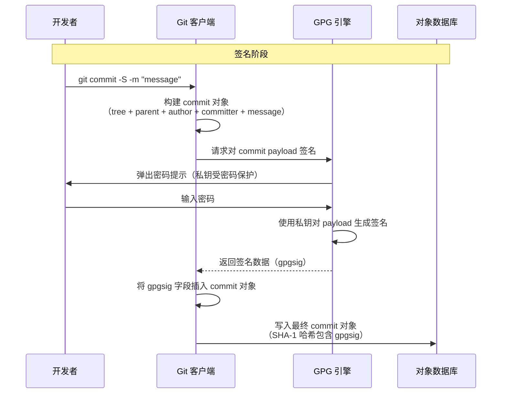
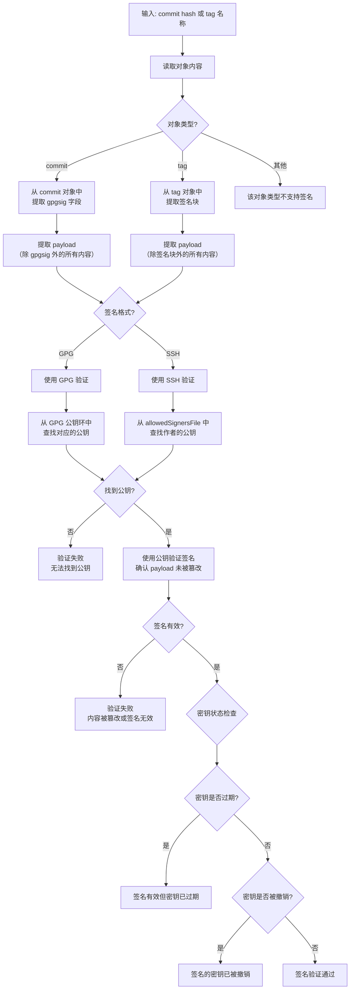
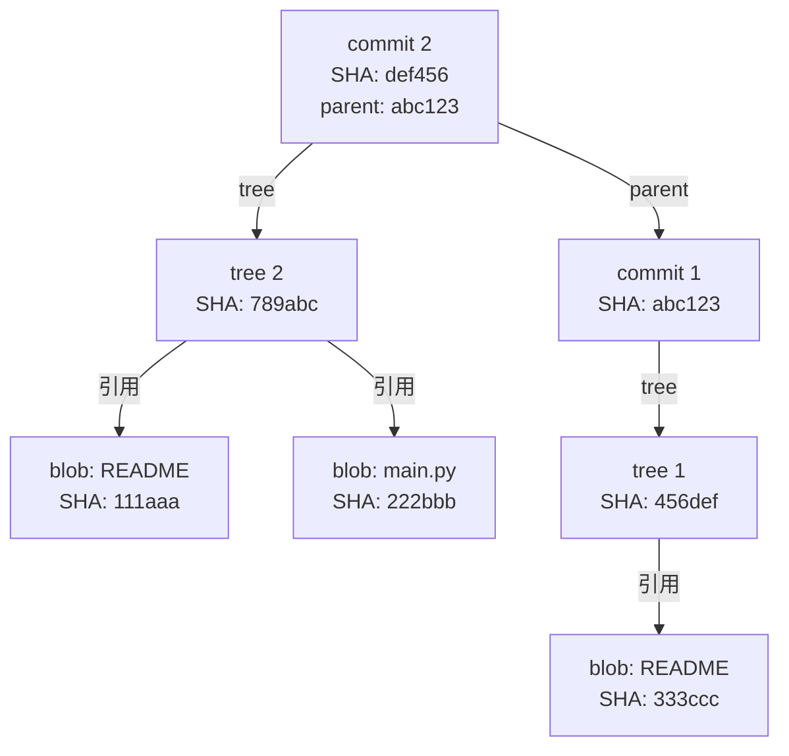
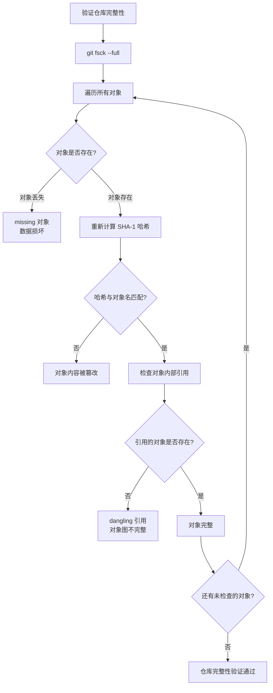
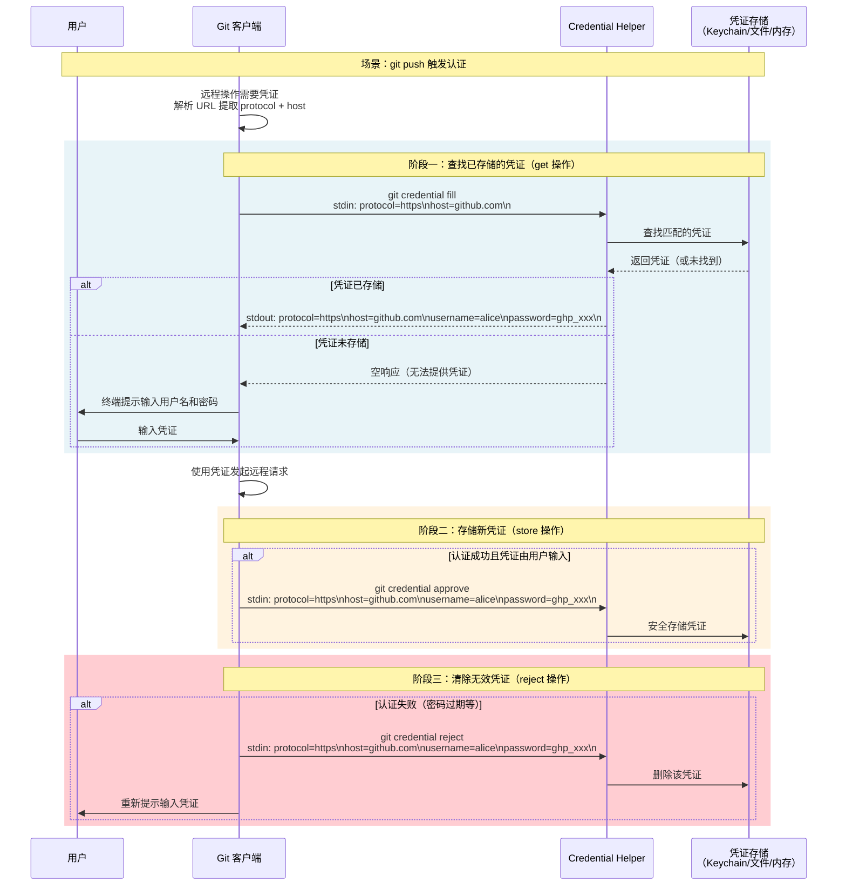
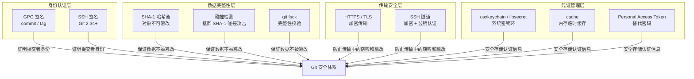

# 签名与安全

Git 作为一个分布式版本控制系统，其安全模型建立在两个不同层面的保障之上：**身份认证层面的签名机制**（证明"谁做了这次提交"）和**数据完整性层面的哈希链机制**（保证"存储的内容没有被篡改"）。前者解决信任问题，后者解决防篡改问题。此外，在远程协作场景中，传输层安全和凭证管理同样不可忽视。

本文将从底层原理出发，系统讲解 Git 的签名机制、内置完整性保障、传输层安全以及凭证管理体系。

---

## 1. 为什么需要签名

在 Git 中，提交者身份是由 `user.name` 和 `user.email` 配置项决定的——任何人都可以设置任意姓名和邮箱：

```bash
# 任何人都可以冒充他人
git config user.name "Alice"
git config user.email "alice@example.com"
git commit -m "fix: some issue"
```

这意味着，一条提交记录中显示的作者信息**没有任何密码学证明**，它只是一种声明。在开源协作或企业审计场景中，这构成了严重的身份伪造风险：

| 风险场景 | 后果 |
|---------|------|
| 恶意贡献者冒充维护者提交后门代码 | 代码审计时难以追溯到真实责任人 |
| 内部人员伪造他人提交记录 | 违反合规审计要求，法律取证困难 |
| 供应链攻击中篡改历史提交 | 引入安全漏洞而无法通过签名验证发现 |

签名机制的核心目的就是：**用密码学手段证明提交确实由声称的作者创建，防止身份伪造**。签名不可伪造，验证公开透明——这正是 Git 签名的设计哲学。

---

## 2. GPG 签名 Commit

### 2.1 基本用法

GPG（GNU Privacy Guard）是 Git 最早支持的签名方式。使用 `git commit -S` 可以对提交进行 GPG 签名：

```bash
# 对本次提交进行 GPG 签名（会弹出 GPG 密码输入提示）
git commit -S -m "feat: add authentication module"

# 指定使用的 GPG 密钥
git commit -S <key-id> -m "feat: add authentication module"

# 也可以配置为默认签名
git config commit.gpgsign true
```

### 2.2 签名在 Commit 对象中的存储

签名并不是一个独立文件，而是嵌入在 commit 对象的头部。让我们观察一个已签名的 commit 对象的原始内容：

```bash
# 查看签名信息（git log 展示）
git log --show-signature -1

# 查看 commit 对象的原始内容
git cat-file -p <commit-hash>
```

一个签名后的 commit 对象结构如下：

```
tree a1b2c3d4e5f6...
parent f6e5d4c3b2a1...
author Zhang San <zhang@example.com> 1700000000 +0800
committer Zhang San <zhang@example.com> 1700000000 +0800
gpgsig -----BEGIN PGP SIGNATURE-----
 iQIzBAABCAAdFiEE...（多行 Base64 编码的签名数据）
 ...
 -----END PGP SIGNATURE-----

feat: add authentication module
```

关键点在于 **`gpgsig` 字段**：它位于 author/committer 信息之后、提交消息之前，以 `-----BEGIN PGP SIGNATURE-----` 和 `-----END PGP SIGNATURE-----` 包裹。签名覆盖的范围是 commit 对象中除 `gpgsig` 字段本身以外的所有内容——即 tree、parent、author、committer 和提交消息。

这意味着：**签名绑定了提交的完整元信息和消息内容**。任何对作者、时间、父提交或消息的篡改都会导致签名验证失败。

### 2.3 签名的工作原理



> **注意**：签名字段被包含在 commit 对象的 SHA-1 哈希计算中。因此，同一个 commit 内容，签名版本和未签名版本的哈希值是不同的。签名不是"贴"在对象外部的附加信息，而是对象内部的一部分。

### 2.4 验证签名

```bash
# 验证单个提交的签名
git verify-commit <commit-hash>

# 在 log 中显示签名状态
git log --show-signature

# 只显示签名状态摘要
git log --format="%h %G? %s"
# %G? 输出含义：
# G - 签名有效
# B - 签名无效（bad）
# U - 签名有效但信任度未知（unknown）
# X - 签名已过期
# Y - 签名的密钥已过期
# R - 签名的密钥已撤销
# E - 无法验证签名（找不到公钥）
# N - 没有签名
```

---

## 3. GPG 签名 Tag

### 3.1 轻量标签 vs 注解标签 vs 签名标签

Git 的标签有三种形态，安全级别逐级递增：

| 标签类型 | 命令 | 存储内容 | 安全性 |
|---------|------|---------|--------|
| 轻量标签 | `git tag v1.0` | 仅一个指向 commit 的引用 | 无任何验证 |
| 注解标签 | `git tag -a v1.0 -m "release"` | 一个 tag 对象（含作者、日期、消息） | 有元信息但无签名 |
| 签名标签 | `git tag -s v1.0 -m "release"` | 一个含 GPG 签名的 tag 对象 | 密码学验证 |

### 3.2 创建签名标签

```bash
# 创建 GPG 签名标签
git tag -s v1.0.0 -m "Release version 1.0.0"

# 指定 GPG 密钥（用 -u 而不是 -s，-s 不接受密钥参数）
git tag -u <key-id> v1.0.0 -m "Release version 1.0.0"
```

### 3.3 签名在 Tag 对象中的存储

签名标签同样将签名嵌入对象内部：

```bash
git cat-file -p v1.0.0
```

输出：

```
object a1b2c3d4e5f6...
type commit
tag v1.0.0
tagger Zhang San <zhang@example.com> 1700000000 +0800

Release version 1.0.0

-----BEGIN PGP SIGNATURE-----
 iQIzBAABCAAdFiEE...（签名数据）
-----END PGP SIGNATURE-----
```

Tag 对象的签名覆盖范围包括：object、type、tag、tagger 以及标签消息。与 commit 签名类似，签名字段本身不参与签名计算，但参与最终的 SHA-1 哈希计算。

### 3.4 验证标签签名

```bash
# 验证标签签名
git tag -v v1.0.0

# 验证时需要对应的公钥在 GPG 密钥环中
# 如果公钥不存在，验证会失败并提示找不到公钥
```

---

## 4. SSH 签名（Git 2.34+）

### 4.1 为什么引入 SSH 签名

GPG 签名虽然安全，但在实际使用中存在痛点：

- **GPG 密钥管理复杂**：生成、导入、导出、吊销密钥的命令晦涩难记
- **GPG 代理配置繁琐**：缓存密码、与 SSH agent 共存等问题常令人头疼
- **多数开发者已拥有 SSH 密钥**：用于 Git 远程访问的 SSH 密钥早已是标配
- **GPG 生态衰退**：相比 SSH，GPG 的用户基数和工具生态在萎缩

Git 2.34 引入的 SSH 签名允许开发者直接使用已有的 SSH 密钥对提交和标签进行签名，大幅降低了签名门槛。

### 4.2 配置 SSH 签名

```bash
# 1. 将签名格式切换为 SSH
git config gpg.format ssh

# 2. 指定用于签名的 SSH 公钥路径
git config user.signingkey ~/.ssh/id_ed25519.pub

# 3. 开启自动签名（可选）
git config commit.gpgsign true
git config tag.gpgsign true

# 现在 git commit -S 和 git tag -s 将使用 SSH 签名
git commit -S -m "feat: add SSH signing support"
git tag -s v2.0.0 -m "Release with SSH signature"
```


### 4.3 SSH 签名的验证——allowedSignersFile

SSH 签名验证需要一个"允许的签名者"文件（类似 GPG 的公钥环），明确列出哪些公钥是可信的：

```bash
# 创建 allowedSignersFile
cat > ~/.ssh/allowed_signers <<EOF
zhang@example.com ssh-ed25519 AAAAC3NzaC1lZDI1NTE5AAAAI...
alice@example.com ssh-ed25519 AAAAC3NzaC1lZDI1NTE5AAAAI...
EOF

# 配置 Git 使用此文件进行验证
git config gpg.ssh.allowedSignersFile ~/.ssh/allowed_signers
```

allowedSigners 文件每行格式为：

```
<email> <key-type> <public-key-data>
```

验证时，Git 会提取 commit/tag 中的作者邮箱，在 allowedSigners 文件中查找匹配的公钥，然后验证签名。

### 4.4 GPG 签名 vs SSH 签名对比

| 维度 | GPG 签名 | SSH 签名 |
|------|---------|---------|
| 最低 Git 版本 | 提交签名 1.7.9+，标签签名更早 | Git 2.34+ |
| 密钥类型 | GPG 密钥对 | SSH 密钥对（RSA/Ed25519 等） |
| 签名命令 | `git commit -S` / `git tag -s` | 相同（由 `gpg.format` 决定底层实现） |
| 验证依赖 | GPG 公钥环 | allowedSignersFile |
| 信任模型 | Web of Trust（信任网） | 显式白名单 |
| 密钥管理工具 | `gpg` 命令 | `ssh-keygen` 命令 |
| 现有密钥复用 | 需单独生成 GPG 密钥 | 可复用已有的 SSH 密钥 |
| GitHub 支持 | 显示 "Verified" 徽章 | 显示 "Verified" 徽章 |
| 适用场景 | 传统项目、强合规要求 | 新项目、简化密钥管理 |

---

## 5. 签名验证流程

无论是 GPG 签名还是 SSH 签名，验证的核心流程是一致的。以下流程图描述了完整的验证过程：



验证过程中的关键判断逻辑：

1. **提取签名和 payload**：从对象中分离签名数据与被签名内容
2. **查找公钥**：根据签名中的密钥标识（GPG key ID）或作者邮箱（SSH）查找对应公钥
3. **密码学验证**：用公钥验证签名是否与 payload 匹配
4. **密钥状态检查**：即使签名有效，还需检查密钥是否过期或被撤销

---

## 6. GitHub/GitLab 中的签名验证状态

主流代码托管平台都对签名提交提供了可视化的验证状态展示。

### 6.1 GitHub 的签名验证

GitHub 在 commit 和 tag 页面中显示签名状态徽章：

| 状态徽章 | 含义 |
|---------|------|
| **Verified** | 签名有效，且签名者公钥已上传至 GitHub 账户 |
| **Unverified** | 签名存在但验证失败（公钥不匹配、签名无效等） |
| **No signature** | 提交未签名 |

GitHub 支持的签名方式：

- **GPG 签名**：将 GPG 公钥上传到 GitHub 账户的 SSH and GPG keys 设置页
- **SSH 签名**：将 SSH 公钥上传并标记为 "Signing Key" 类型
- **S/MIME 签名**：企业用户使用 X.509 证书签名

GitHub 的验证逻辑：

```mermaid
flowchart LR
    A[接收 push 的 commit/tag] --> B{是否包含签名?}
    B -->|否| C[显示 "No signature"]
    B -->|是| D[提取签名中的密钥标识]

    D --> E{在提交者账户中<br/>查找匹配的公钥?}
    E -->|未找到| F[显示 "Unverified"]
    E -->|找到| G[使用公钥验证签名]

    G --> H{验证结果?}
    H -->|签名有效| I[显示 "Verified"]
    H -->|签名无效| F

```

> **重要细节**：GitHub 验证签名时，不仅检查签名的密码学有效性，还检查**签名密钥是否属于 commit 中声明的作者**。如果 Alice 的 GPG 密钥签名了一个声称由 Bob 提交的 commit，GitHub 会显示 "Unverified"，因为签名者与声称的作者不匹配。

### 6.2 GitLab 的签名验证

GitLab 同样在提交和标签详情页显示签名状态：

| 状态 | 含义 |
|------|------|
| Verified | 签名有效且密钥可信 |
| Unverified | 签名有效但密钥未验证 |
| Invalid | 签名无效 |
| Expired | 签名的密钥已过期 |
| Revoked | 签名的密钥已被撤销 |

GitLab 支持在项目或组级别设置**推送规则**（Push Rules，Premium 及以上计划的功能），强制要求所有提交必须签名：

```
项目 Settings → Repository → Push Rules → "Commit signature" → Require signed commits
```

### 6.3 强制签名策略

在团队协作中，推荐通过平台规则或 Git 钩子强制签名：

```bash
# 服务器端钩子示例：拒绝未签名的推送
# pre-receive 钩子
while read oldrev newrev refname; do
    for commit in $(git rev-list $oldrev..$newrev); do
        signature=$(git cat-file -p $commit | grep -c "^gpgsig")
        if [ "$signature" -eq 0 ]; then
            echo "ERROR: Commit $commit is not signed. Signed commits are required."
            exit 1
        fi
    done
done
```

---

## 7. Git 的内置完整性保障

签名机制解决的是"身份认证"问题，而 Git 的哈希链机制解决的是"数据完整性"问题——即使不使用任何签名，Git 的对象模型本身也具备强大的防篡改能力。

### 7.1 SHA-1 哈希作为对象身份

Git 中的每个对象（blob、tree、commit、tag）都由其内容的 SHA-1 哈希值唯一标识。哈希值不仅是"校验和"，更是对象的**唯一名称**：

```
对象内容 ──SHA-1──→ 对象名称（40 位十六进制）
```

这个设计的核心含义是：**内容决定身份**。两个内容完全相同的对象必定拥有相同的哈希值，内容哪怕只有一个比特的差异，哈希值也会完全不同。

### 7.2 哈希链：修改一个对象，所有父对象的哈希失效

Git 的对象之间通过哈希引用相互关联，形成一条不可断裂的哈希链：



篡改检测的传导机制：

1. 修改 `main.py`（blob `222bbb`）的内容 → blob 的 SHA-1 哈希改变
2. tree 2 (`789abc`) 内部引用了 blob `222bbb` → tree 的内容发生变化 → tree 的 SHA-1 哈希改变
3. commit 2 (`def456`) 内部引用了 tree 2 → commit 的内容发生变化 → commit 的 SHA-1 哈希改变
4. 任何后续 commit 引用了 commit 2 作为 parent → 其哈希也会改变

**篡改任何一个底层对象，都会导致整条链上所有对象的哈希失效**。要成功篡改历史，攻击者必须重新计算从被篡改对象到最新提交的所有哈希值——但所有持有仓库副本的人都可以通过比对哈希值发现这种篡改。


### 7.3 哈希链的完整性验证流程



```bash
# 完整性检查
git fsck --full

# 典型输出
# Checking object directories: 100% (256/256), done.
# Checking objects: 100% (1234/1234), done.
# （无输出 = 一切正常）

# 常见错误类型
# missing <type> <hash>     — 对象文件不存在
# corrupt <type> <hash>     — 对象内容损坏（哈希不匹配）
# dangling <type> <hash>    — 不可达的对象（不一定是错误，可能是未合并的暂存对象）
```

### 7.4 SHA-1 碰撞与 Git 的应对

2017 年，Google 和 CWI Amsterdam 的研究人员完成了首次 SHA-1 碰撞攻击（SHAttered），理论上可以构造两个内容不同但 SHA-1 哈希相同的文件。这对 Git 的哈希链安全性构成了理论威胁。

Git 的应对措施：

1. **碰撞检测**：Git 2.13.0 引入了 SHA-1 碰撞检测算法，在生成对象时会检查是否为已知的碰撞结构，拒绝可疑的碰撞输入
2. **SHA-256 过渡**：Git 已经实现了对 SHA-256 的支持（实验性），未来将提供从 SHA-1 到 SHA-256 的迁移路径

```bash
# 查看仓库使用的哈希算法
git config --get extensions.objectformat
# 默认不输出（即 SHA-1），如果输出 sha256 则使用 SHA-256
```

> 在实际威胁模型中，对 Git 仓库发起 SHA-1 碰撞攻击的成本仍然极高（需要约 6500 年的 CPU 计算），且碰撞检测机制已有效缓解了这一风险。SHA-1 哈希链在日常使用中的完整性保障仍然可靠。

---

## 8. 传输层安全

Git 的签名和哈希链保护的是"数据本身"的完整性和真实性，但在数据通过网络传输时，还需要防止**中间人攻击、窃听和篡改**——这是传输层安全的职责。

### 8.1 HTTPS 加密

HTTPS 是 Git 最常用的传输协议，它通过 TLS 层加密所有通信内容：

```bash
# 使用 HTTPS 克隆
git clone https://github.com/user/repo.git

# HTTPS 通信流程
客户端 ←──TLS 握手──→ 服务器
  │                        │
  │  ←──加密的 Git 协议──→  │
  │                        │
  │  ←──加密的对象数据──→   │
```

HTTPS 的安全保障：

| 保障 | 实现机制 |
|------|---------|
| 加密 | TLS 对称加密（如 AES-256） |
| 身份认证 | X.509 证书验证服务器身份 |
| 完整性 | TLS MAC（消息认证码）防篡改 |

### 8.2 SSH 隧道

SSH 协议同样为 Git 传输提供加密和认证：

```bash
# 使用 SSH 克隆
git clone git@github.com:user/repo.git

# SSH 的双重保障
1. 服务器认证：客户端验证服务器的 host key（~/.ssh/known_hosts）
2. 客户端认证：服务器验证客户端的公钥（~/.ssh/authorized_keys）
```

### 8.3 HTTPS vs SSH 对比

| 维度 | HTTPS | SSH |
|------|-------|-----|
| 认证方式 | 用户名 + 密码/Token | 公钥认证 |
| 凭证存储 | credential helper | ssh-agent / 密钥文件 |
| 防火墙友好 | 极佳（使用 443 端口） | 一般（使用 22 端口，可能被封锁） |
| 初始配置 | 简单（浏览器登录即可） | 需生成密钥对并上传公钥 |
| 企业代理兼容 | 好（HTTP 代理支持完善） | 差（需额外配置 ProxyCommand） |
| 适用场景 | 开源贡献、CI/CD | 日常开发、自动化脚本 |

---

## 9. 凭证安全：Credential Helper 体系

无论是 HTTPS 的用户名/密码还是 SSH 的密钥，Git 都需要安全地存储和获取认证凭证。Git 的 credential helper 体系正是为此设计的一套可扩展框架。

### 9.1 凭证请求的触发场景

每当 Git 需要访问远程仓库但缺少有效凭证时，就会触发凭证请求：

```bash
# 常见触发场景
git clone https://github.com/private/repo.git   # 克隆私有仓库
git push                                         # 推送需要认证
git fetch                                        # 拉取私有仓库更新
```

### 9.2 Credential Helper 的类型

Git 提供了多种 credential helper，适用于不同的安全级别和使用场景：

| Helper | 存储位置 | 持久性 | 安全性 | 适用平台 |
|--------|---------|--------|--------|---------|
| `cache` | 内存 | 临时（默认 15 分钟） | 中（进程结束后消失） | 全平台 |
| `store` | 明文文件 (`~/.git-credentials`) | 永久 | 低（明文存储密码） | 全平台 |
| `osxkeychain` | macOS Keychain | 永久 | 高（系统级加密） | macOS |
| `libsecret` | Linux 密钥环（GNOME Keyring 等） | 永久 | 高（系统级加密） | Linux |
| `manager-core` / `manager` | Windows Credential Manager | 永久 | 高（系统级加密） | Windows |
| `oauth` | 内存/系统密钥环 | 临时（OAuth token） | 高（短期 token） | 全平台 |

```bash
# 配置 credential helper
git config --global credential.helper cache          # 内存缓存
git config --global credential.helper store          # 明文存储（不推荐）
git config --global credential.helper osxkeychain    # macOS Keychain
git config --global credential.helper libsecret      # Linux 密钥环

# cache 模式可自定义超时时间
git config --global credential.helper 'cache --timeout=3600'  # 1 小时

# 可以配置多个 helper，Git 按顺序查找
git config --global credential.helper osxkeychain
git config --global credential.helper 'cache --timeout=300'
# 先查 osxkeychain，没找到再查 cache，都没有则交互式提示
```


### 9.3 凭证的存储与获取流程

Credential helper 遵循统一的 Git Credential 协议，通过标准输入输出与 Git 通信：



Credential 协议的三种操作：

| 操作 | 命令 | 触发时机 | 作用 |
|------|------|---------|------|
| `get` (fill) | `git credential fill` | 需要凭证时 | 从存储中查找匹配的凭证 |
| `store` (approve) | `git credential approve` | 凭证验证成功后 | 将凭证保存到存储 |
| `erase` (reject) | `git credential reject` | 凭证验证失败后 | 从存储中删除无效凭证 |

### 9.4 凭证匹配规则

Credential helper 使用**部分匹配**策略查找凭证。Git 将远程 URL 分解为多个字段，与存储的凭证进行匹配：

```
URL: https://alice@github.com/user/repo.git
分解为：
  protocol = https
  host     = github.com
  username = alice        （可选，URL 中包含时）
  path     = user/repo    （默认不参与匹配，设置 credential.useHttpPath 后才启用）
```

匹配优先级：

1. **精确匹配**：protocol + host + username + path 全部匹配
2. **主机匹配**：protocol + host + username 匹配（忽略 path）
3. **协议匹配**：仅 protocol + host 匹配

### 9.5 安全最佳实践

```bash
# 1. 优先使用系统密钥环（不要用 store）
git config --global credential.helper osxkeychain    # macOS
git config --global credential.helper libsecret      # Linux

# 2. 使用 Personal Access Token 替代密码（GitHub 已禁用密码认证）
# 在 GitHub Settings → Developer settings → Personal access tokens 生成
# 使用时密码字段填入 token

# 3. 使用 SSH 密钥替代 HTTPS 凭证（无需 credential helper）
git remote set-url origin git@github.com:user/repo.git

# 4. 为不同仓库配置不同的凭证
# 在 .git/config 中设置（仓库级别）
[credential]
    helper = cache --timeout=3600

# 5. 清除已存储的凭证
git credential reject <<EOF
protocol=https
host=github.com
EOF

# 6. 使用 credential.${URL}.helper 为特定域名指定 helper
git config --global credential.https://github.com.helper osxkeychain
git config --global credential.https://gitlab.com.helper cache
```

---

## 10. 安全机制全景

将本文讨论的所有安全机制放在一起，可以看到 Git 在不同层面提供了全方位的保障：



各层机制的协作关系：

| 安全威胁 | 抵御机制 | 所在层 |
|---------|---------|--------|
| 身份伪造（冒充他人提交） | GPG/SSH 签名 | 身份认证层 |
| 数据篡改（修改历史提交内容） | SHA-1 哈希链 | 数据完整性层 |
| 中间人攻击（传输中窃听/篡改） | HTTPS/SSH 加密 | 传输安全层 |
| 凭证泄露（密码被窃取） | 系统密钥环 + Token | 凭证管理层 |
| SHA-1 碰撞攻击 | 碰撞检测算法 | 数据完整性层 |

---

## 11. 小结

1. **签名机制**解决"谁做了这次提交"的问题——GPG 签名（`git commit -S`、`git tag -s`）是经典方案，SSH 签名（Git 2.34+）降低了使用门槛。签名嵌入在 commit/tag 对象内部（`gpgsig` 字段），与对象哈希绑定。

2. **哈希链机制**解决"内容是否被篡改"的问题——Git 的 SHA-1 哈希链保证修改任何一个对象都会导致所有上层引用的哈希失效，篡改成本随链长度指数级增长。`git fsck` 可随时校验仓库完整性。

3. **传输层安全**解决"传输过程中是否安全"的问题——HTTPS 和 SSH 协议为远程通信提供加密和身份认证，防止中间人攻击。

4. **凭证管理**解决"认证信息如何安全存储"的问题——credential helper 体系提供了从内存缓存到系统密钥环的多种方案，推荐优先使用系统级加密存储（osxkeychain、libsecret），避免明文存储（store）。

5. **平台验证**（GitHub/GitLab）将签名验证结果可视化——"Verified" 徽章为代码审计提供了直观的信任标记，团队可通过推送规则强制要求签名提交。

这四层机制从不同角度保障了 Git 仓库的安全性，共同构成了一个纵深防御体系：即使某一层被突破，其他层仍然能提供保护。

