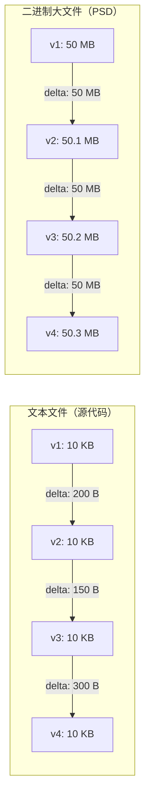
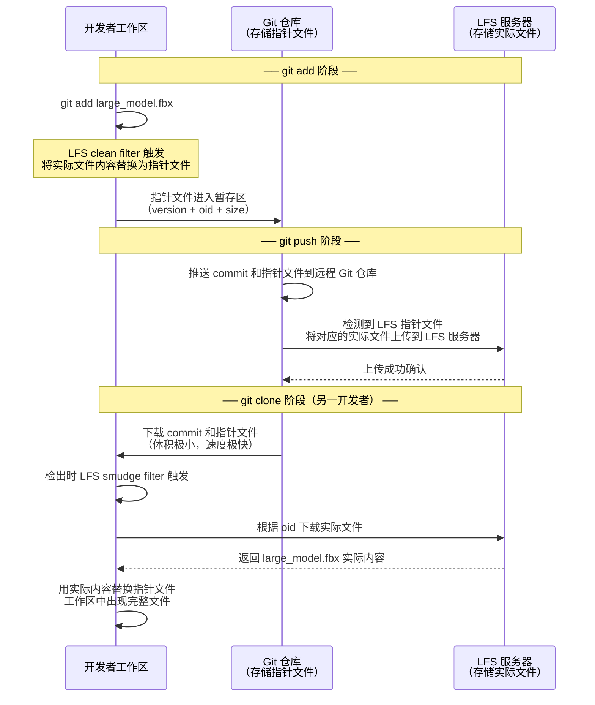
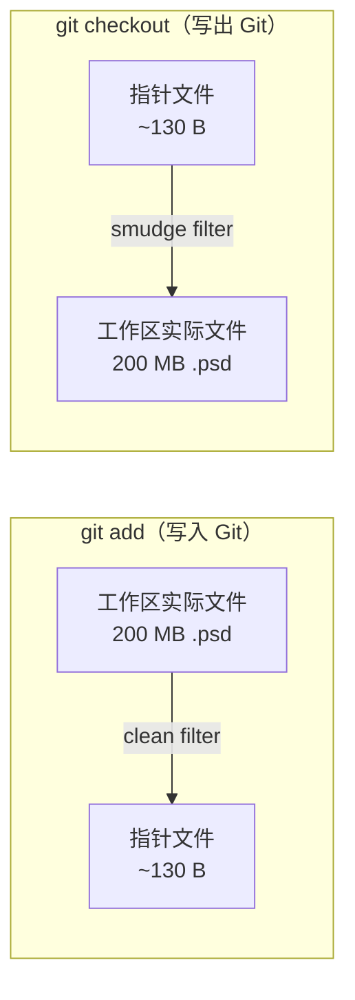
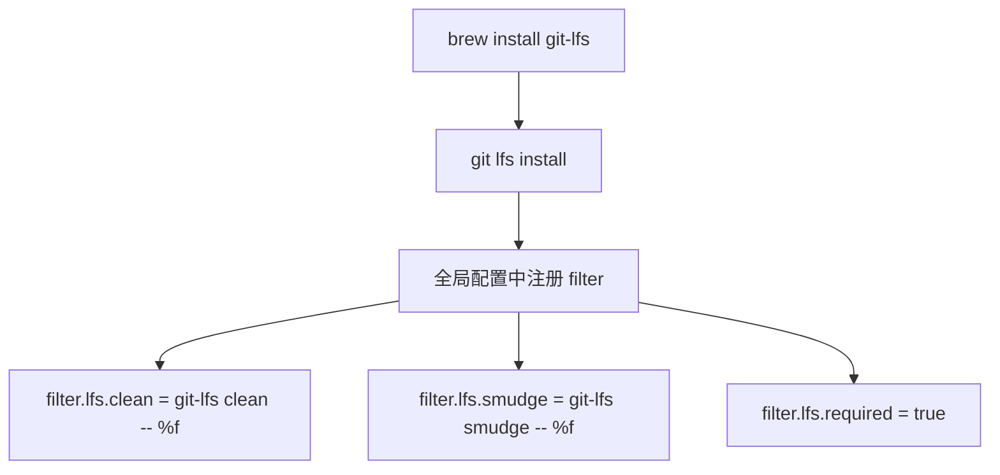
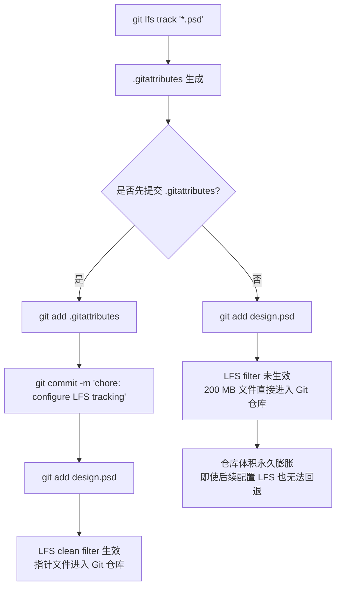
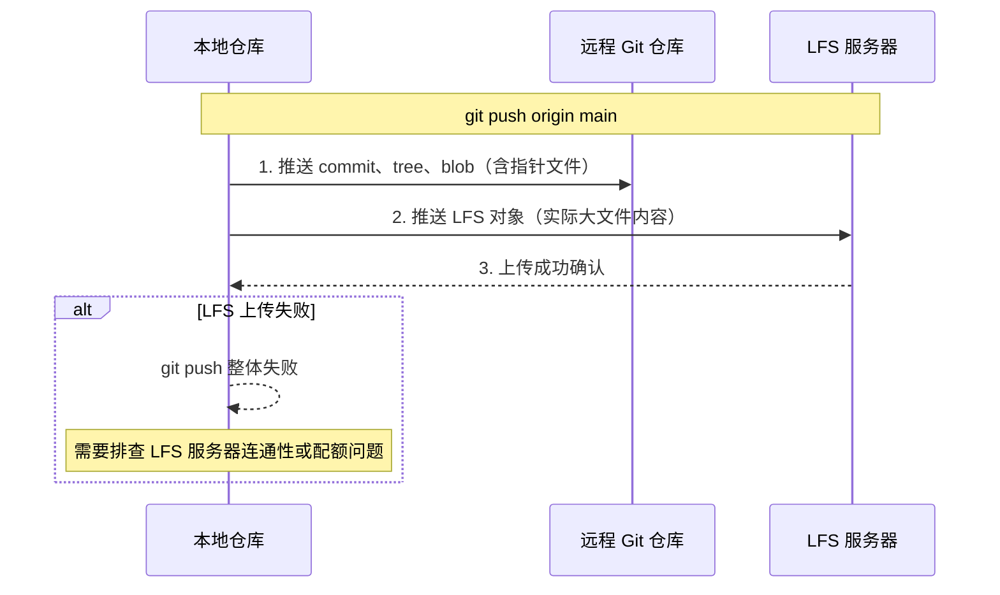
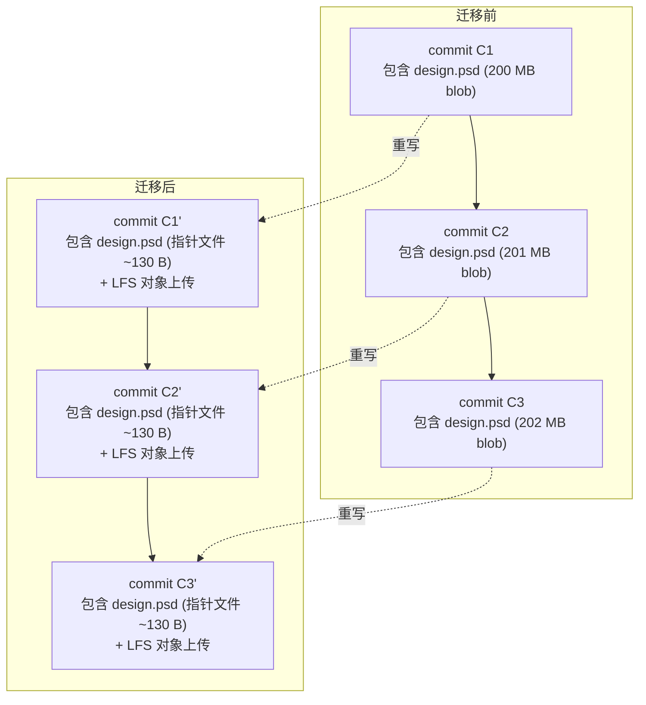
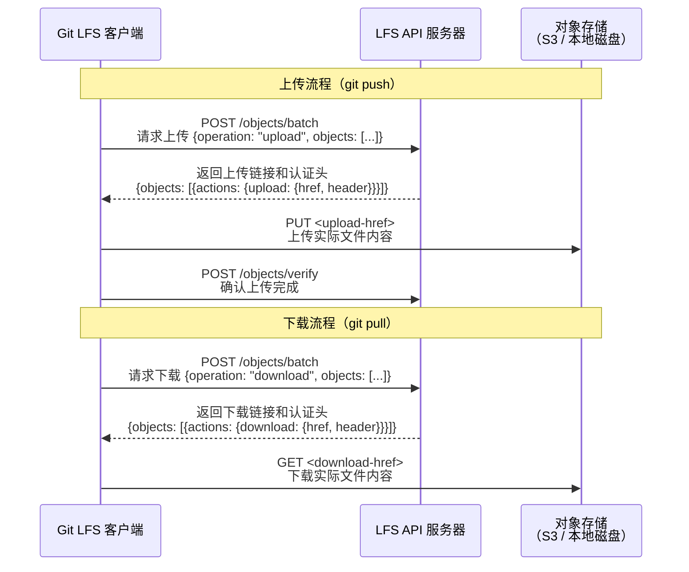
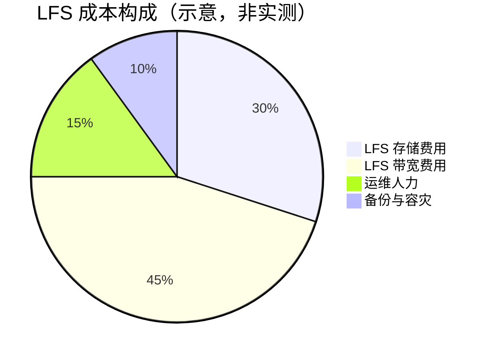
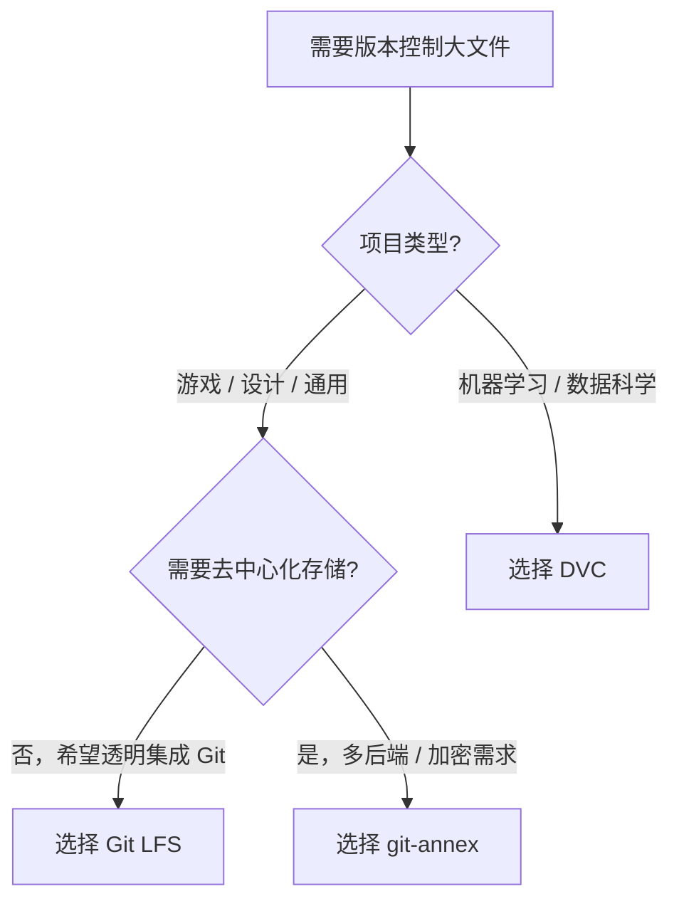

# Git LFS：大文件版本控制方案

Git 的设计初衷是高效管理源代码——文本文件、体积小、增量差异明显。但在实际项目中，我们经常需要版本化管理一些"大块头"：设计稿、3D 模型、数据集、编译产物、视频素材……这些文件动辄几十 MB 甚至数 GB，直接用 Git 管理会遭遇严重的性能问题。Git LFS（Large File Storage）正是为解决这一矛盾而诞生的扩展方案。

---

## 一、为什么 Git 不擅长处理大文件

Git 的核心存储模型基于**内容寻址**：每个文件以 blob 对象的形式存储在 `.git/objects/` 中，通过 SHA-1 哈希索引。这套机制对源代码极其高效，但面对大文件时会暴露三个根本性问题。

### 1.1 无法有效 Delta

Git 的打包格式（packfile）在存储文件历史时，会尝试计算相邻版本之间的差异（delta），只存储增量部分。这对文本文件效果极佳——一个 10KB 的源文件修改了几行，delta 可能只有几百字节。

但大文件通常是**二进制格式**（PSD、MP4、FBX 等），哪怕只改了一个像素、一帧画面，二进制层面的差异也可能覆盖整个文件。结果是：



四次提交，文本文件总存储开销约 10.65 KB，而二进制大文件的总存储开销高达 200+ MB。大文件几乎无法享受 delta 压缩的红利。

### 1.2 Clone 慢如噩梦

`git clone` 会将仓库的完整历史下载到本地。如果仓库中包含大文件，这意味着：

- **下载耗时极长**：一个包含 20 个版本、每个 200 MB 的 PSD 文件的仓库，clone 时需要下载约 4 GB 的历史数据
- **磁盘空间暴增**：所有历史版本的大文件都躺在 `.git/objects/` 中，即使你只关心最新版本
- **网络中断代价高**：clone 过程中网络断开，之前下载的数据可能无法复用，需要重新开始

| 场景 | 纯代码仓库 | 含大文件仓库 |
|------|-----------|-------------|
| 仓库大小 | 50 MB | 5 GB |
| clone 时间（10 Mbps） | ~40 秒 | ~70 分钟 |
| 磁盘占用 | 50 MB | 5 GB |
| 切换分支耗时 | 毫秒级 | 秒级甚至分钟级 |

### 1.3 空间持续膨胀

由于 Git 保留完整历史，即使你删除了工作区中的大文件，它的所有历史版本仍然占据 `.git/objects/` 的空间。唯一的回收手段是 `git gc` 和 `git prune`，但它们只能清理不再被任何引用指向的对象——被 commit 引用的大文件永远不会被回收。

这意味着仓库体积只增不减，并且增长速度远超纯代码仓库：

```
# 一个游戏项目 6 个月的仓库体积变化
月份    纯代码 + 资源（无 LFS）    纯代码 + LFS 管理资源
1月     200 MB                     50 MB
3月     1.2 GB                     55 MB
6月     5.8 GB                     60 MB
```

> **关键认知**：Git 的"完整历史"设计对源代码是优势，对大文件则是灾难。我们需要一种机制，让 Git 只管理大文件的"元信息"，而将实际内容存储在别处——这就是 Git LFS 的核心思路。

---

## 二、Git LFS 的架构原理

### 2.1 核心思想：指针文件替代实际文件

Git LFS 的核心设计非常优雅：**在 Git 仓库中，大文件被替换为一个轻量的"指针文件"（pointer file），而实际文件内容存储在独立的 LFS 存储服务器上。**

指针文件是一个文本文件，通常不超过 130 字节，格式如下：

```
version https://git-lfs.github.com/spec/v1
oid sha256:4d7a214614ab2935c943f9e0ff69ca223a8c7cd6b7c1c5e8e5e5e5e5e5e5e5e5
size 12345678
```

- `version`：LFS 规范版本
- `oid`：文件内容的 SHA-256 哈希（注意是 SHA-256，不是 Git 原生的 SHA-1），用于在 LFS 服务器上定位文件
- `size`：原始文件的字节大小

这个指针文件被 Git 当作普通文本文件管理，享受完整的版本控制能力（delta、branch、merge 等）。而真正的大文件内容，由 LFS 服务器独立管理。

### 2.2 存储与传输流程

Git LFS 的完整工作流程涉及三个角色：工作区、Git 仓库（存储指针文件）和 LFS 服务器（存储实际文件）。以下时序图展示了从提交到克隆的完整数据流：



### 2.3 Clean / Smudge Filter 机制

LFS 之所以能在 Git 的标准流程中透明工作，依赖的是 Git 的 **clean/smudge filter** 机制。这是一个在文件进出 Git 仓库时自动触发的数据转换管道：



- **clean filter**（`git add` 时触发）：读取工作区中的实际文件内容，计算 SHA-256，将实际内容缓存到 `.git/lfs/objects/`，然后输出指针文件内容给 Git 仓库
- **smudge filter**（`git checkout` 时触发）：检测到指针文件，根据 `oid` 从 `.git/lfs/objects/` 本地缓存或远程 LFS 服务器下载实际内容，输出到工作区

这两个 filter 在 `git lfs install` 时自动注册到 Git 配置中：

```bash
# 安装后，Git 配置中会出现以下条目
git config --list | grep lfs

# filter.lfs.clean = git-lfs clean -- %f
# filter.lfs.smudge = git-lfs smudge -- %f
# filter.lfs.required = true
```

### 2.4 指针文件 vs 实际文件的对比

| 维度 | 指针文件 | 实际文件 |
|------|---------|---------|
| 体积 | ~130 字节 | 数 MB ~ 数 GB |
| 存储位置 | Git 仓库（`.git/objects/`） | LFS 服务器（+ 本地缓存 `.git/lfs/objects/`） |
| 版本管理 | 享受 Git 完整的 delta、branch、merge | 由 LFS 服务器独立管理，按 oid 去重 |
| 网络传输 | 随 Git push/pull 传输，极快 | 按需从 LFS 服务器上传/下载 |
| 冲突处理 | 可 diff、可 merge | 二进制文件冲突需手动解决 |
| 离线可用 | 是 | 仅限已缓存到本地的版本 |

---

## 三、安装与初始化

### 3.1 安装 Git LFS

Git LFS 是一个独立的可执行文件，需要单独安装：

```bash
# macOS
brew install git-lfs

# Ubuntu / Debian
sudo apt-get install git-lfs

# CentOS / RHEL
sudo yum install git-lfs

# Windows（Scoop）
scoop install git-lfs

# Windows（Chocolatey）
choco install git-lfs
```

安装后，需要在用户级别执行一次初始化：

```bash
git lfs install
```

这一步会做以下事情：

1. 在全局 Git 配置中注册 clean/smudge filter
2. 设置 `filter.lfs.required = true`，确保 LFS filter 不可用时 Git 报错而非静默跳过
3. 安装配套的 Git hooks（`pre-push`、`post-checkout`、`post-commit`、`post-merge`），使 `git push`/`git checkout` 等操作自动同步 LFS 对象



> **注意**：如果你只想在某个特定仓库中启用 LFS（不影响全局配置），可以在仓库目录内执行 `git lfs install --local`。这在多项目协作中很有用，避免全局 filter 影响不需要 LFS 的仓库。

### 3.2 验证安装

```bash
git lfs version
# 输出示例：git-lfs/3.4.0 (GitHub; darwin arm64; go 1.21.3)
```

---

## 四、追踪大文件


### 4.1 `git lfs track` 命令

安装完成后，需要告诉 LFS 哪些文件应该由它来管理：

```bash
# 追踪所有 PSD 文件
git lfs track "*.psd"

# 追踪所有视频文件
git lfs track "*.mp4"
git lfs track "*.mov"

# 追踪整个目录
git lfs track "assets/**"

# 追踪特定文件
git lfs track "datasets/training_data.csv"

# 查看当前追踪规则
git lfs track
```

### 4.2 `.gitattributes` 文件的生成与含义

每次执行 `git lfs track`，LFS 都会向仓库根目录的 `.gitattributes` 文件追加一条规则。这个文件是 Git 的原生属性配置文件，LFS 借助它来匹配文件路径并触发 filter。

```bash
# 执行以下命令后：
git lfs track "*.psd"
git lfs track "assets/**"
git lfs track "*.zip"

# .gitattributes 内容变为：
*.psd filter=lfs diff=lfs merge=lfs -text
assets/** filter=lfs diff=lfs merge=lfs -text
*.zip filter=lfs diff=lfs merge=lfs -text
```

每条规则的各字段含义：

| 字段 | 值 | 含义 |
|------|-----|------|
| `filter=lfs` | - | 命中此规则的文件使用 LFS 的 clean/smudge filter |
| `diff=lfs` | - | 使用 LFS 自定义的 diff 驱动（显示"Binary files differ"而非乱码） |
| `merge=lfs` | - | 使用 LFS 自定义的 merge 驱动（二进制冲突时选择一方保留） |
| `-text` | - | 告诉 Git 不要对文件进行换行符转换（CRLF/LF），二进制文件必须禁用 |

### 4.3 `.gitattributes` 必须先于大文件提交

这是一个极其重要且容易出错的要点：**`.gitattributes` 文件必须在大文件之前提交到仓库**。如果顺序搞反了，大文件会被当作普通文件直接存入 Git 对象库，LFS filter 不会生效。



正确的初始化顺序：

```bash
# 1. 初始化 LFS
git lfs install

# 2. 配置追踪规则
git lfs track "*.psd"
git lfs track "*.mp4"

# 3. 先提交 .gitattributes
git add .gitattributes
git commit -m "chore: configure Git LFS tracking rules"

# 4. 然后才能添加大文件
git add assets/design.psd
git commit -m "feat: add product design mockup"
```

---

## 五、常用操作

### 5.1 查看被 LFS 管理的文件

```bash
# 列出当前仓库中所有被 LFS 管理的文件
git lfs ls-files

# 输出示例：
# 4d7a214614 - assets/design.psd
# 8f3b2c9e01 - assets/video/intro.mp4
# a1e5f7d3c2 - datasets/training.csv
```

输出格式为：`<oid 前缀> - <文件路径>`。

```bash
# 查看 LFS 管理的文件及其大小
git lfs ls-files --size

# 输出示例：
# 4d7a214614 - assets/design.psd (52.3 MB)
# 8f3b2c9e01 - assets/video/intro.mp4 (128.7 MB)
# a1e5f7d3c2 - datasets/training.csv (1.2 GB)
```

### 5.2 下载 LFS 文件

在多种场景下，你可能需要显式地从 LFS 服务器下载文件：

```bash
# 下载当前检出中所有 LFS 文件
git lfs pull

# 只下载指定文件
git lfs pull --include="assets/design.psd"

# 只下载指定模式的文件
git lfs pull --include="assets/*.psd"

# 下载但不替换工作区文件（仅填充本地缓存）
git lfs fetch

# 下载所有历史版本中的 LFS 文件（谨慎使用，可能非常庞大）
git lfs fetch --all
```

**`git lfs pull` vs `git lfs fetch` 的区别**：

| 命令 | 本地缓存 | 工作区 | 类比 |
|------|---------|--------|------|
| `git lfs fetch` | 填充 | 不替换 | `git fetch`（只下载，不合并） |
| `git lfs pull` | 填充 | 替换 | `git pull`（下载并合并到工作区） |

### 5.3 上传 LFS 文件

```bash
# 推送当前分支的所有 LFS 对象到远程服务器
git lfs push origin main

# 推送所有分支的所有 LFS 对象
git lfs push --all origin

# 强制推送（即使服务器上已存在相同 oid 的对象）
git lfs push --all origin --force
```

通常你不需要手动执行 `git lfs push`——`git push` 会自动触发 LFS 上传流程：



### 5.4 检出特定版本

默认情况下，`git checkout` 切换分支或回退版本时，LFS 的 smudge filter 会自动下载对应版本的大文件。但如果你关闭了 smudge filter（例如 `GIT_LFS_SKIP_SMUDGE=1`），则需要手动拉取：

```bash
# 关闭自动下载进行 clone（适合 CI/CD 或磁盘紧张的场景）
GIT_LFS_SKIP_SMUDGE=1 git clone https://github.com/example/project.git

# 进入仓库后，按需下载特定文件
cd project
git lfs pull --include="assets/design.psd"
```

### 5.5 常用命令速查

| 命令 | 用途 |
|------|------|
| `git lfs install` | 初始化 LFS（注册 filter） |
| `git lfs track "<pattern>"` | 添加追踪规则 |
| `git lfs track` | 查看当前追踪规则 |
| `git lfs ls-files` | 列出被 LFS 管理的文件 |
| `git lfs ls-files --size` | 列出文件及大小 |
| `git lfs pull` | 下载 LFS 文件到工作区 |
| `git lfs fetch` | 下载 LFS 文件到本地缓存 |
| `git lfs push origin <branch>` | 上传 LFS 文件到远程服务器 |
| `git lfs prune` | 清理本地不再被引用的 LFS 缓存 |
| `git lfs status` | 查看 LFS 文件的变更状态 |
| `git lfs env` | 查看 LFS 环境配置信息 |

---

## 六、从已有仓库迁移到 LFS

如果你的仓库已经在用普通 Git 管理大文件，仓库体积已经膨胀，此时再简单地添加 `.gitattributes` 规则是不够的——历史中已经存在的大文件不会自动迁移到 LFS。你需要使用 `git lfs migrate` 命令来重写历史。

### 6.1 `git lfs migrate info`：分析迁移范围

在执行迁移前，先分析仓库中有哪些大文件需要迁移：

```bash
# 分析所有分支中的大文件（前 20 个）
git lfs migrate info --everything --top=20

# 输出示例：
# *.psd   2.1 GB   324 files   main, develop
# *.mp4   800 MB   45 files    main
# *.zip   350 MB   12 files    main, feature/ui
```


### 6.2 `git lfs migrate import`：执行迁移

```bash
# 将所有 .psd 文件迁移到 LFS（只处理当前分支）
git lfs migrate import --include="*.psd"

# 迁移多种文件类型
git lfs migrate import --include="*.psd,*.mp4,*.zip"

# 迁移所有分支（refs）中的大文件
git lfs migrate import --everything --include="*.psd"

# 迁移指定分支中的大文件
git lfs migrate import --include="*.psd" --include-ref=refs/heads/main --include-ref=refs/heads/develop

# 迁移超过 50MB 的所有文件（不限于特定扩展名）
git lfs migrate import --above=50MB
```

### 6.3 迁移的底层原理

`git lfs migrate import` 会**重写 Git 历史**：



迁移过程：

1. 遍历指定范围内的所有 commit
2. 对于每个 commit，检查其中的 tree 对象，找到匹配 `--include` 规则的文件
3. 将这些文件的 blob 内容上传到 LFS 服务器
4. 用对应的指针文件替换原始 blob，创建新的 tree 和 commit 对象
5. 更新分支指针，指向新的 commit 链

### 6.4 迁移的注意事项

**重写历史意味着所有 commit SHA 都会改变**，这是一个破坏性操作：

```bash
# 迁移前
git log --oneline
# a1b2c3d feat: add design v3
# e4f5a6b feat: add design v2
# c7d8e9f feat: add design v1

# 迁移后（SHA 全部变化）
git lfs migrate import --include="*.psd"
git log --oneline
# 9f8e7d6 feat: add design v3    ← 新 SHA
# 8c7b6a5 feat: add design v2    ← 新 SHA
# 7a6b5c4 feat: add design v1    ← 新 SHA
```

因此，执行迁移时必须遵循以下原则：

| 原则 | 说明 |
|------|------|
| **提前通知** | 迁移会改变所有 commit SHA，所有协作者都需要重新 clone 仓库 |
| **备份仓库** | 执行迁移前，对仓库做完整备份 |
| **清理旧引用** | 迁移后执行 `git reflog expire --expire=now --all && git gc --prune=now`，清理指向旧 commit 的 reflog |
| **协调推送** | 迁移后使用 `git push --force` 推送到远程，所有协作者需要重新 clone |

### 6.5 `git lfs migrate export`：反向迁移

如果某些文件不再需要 LFS 管理（例如项目调整后文件变小了），可以将其从 LFS 迁回普通 Git 管理：

```bash
# 将 .psd 文件从 LFS 迁回普通 Git 对象
git lfs migrate export --include="*.psd" --everything
```

---

## 七、LFS 服务端选型

Git LFS 是一个客户端规范，服务器端可以有不同的实现。选择合适的 LFS 服务端是企业落地的关键决策。

### 7.1 主流方案对比

| 方案 | 适用场景 | 存储后端 | 认证方式 | 成本 |
|------|---------|---------|---------|------|
| **GitHub LFS** | 开源项目 / 小型团队 | GitHub 托管存储 | GitHub OAuth | 按配额收费 |
| **GitLab LFS** | 自托管 / GitLab.com | 本地磁盘 / 对象存储 | GitLab 认证 | 自托管免费 |
| **Artifactory** | 企业级 / 需要制品管理 | 可配置多种后端 | 多种认证方式 | 商业许可 |
| **自建 11-Nginx基础概述 + lfs-server** | 极致控制 / 特殊合规要求 | 自定义 | 自定义 | 运维成本 |

### 7.2 GitHub LFS

GitHub 为所有仓库提供 LFS 支持，但有配额限制：

| 计划 | LFS 带宽（每月） | LFS 存储 | 超出后购买数据包（Data Pack） |
|------|-----------------|---------|------------------------------|
| Free | 1 GB | 1 GB | $5 / 50 GB 带宽 + 50 GB 存储 |
| Pro | 2 GB | 2 GB | 同上 |
| Team | 2 GB | 2 GB | 同上 |
| Enterprise Cloud | 50 GB | 50 GB | 同上 |

> 以上为截至 2026-09 的官方配额（数据包为一次性购买、不过期，带宽用量每月重置）；配额可能随时间调整，以 GitHub 官方定价文档为准。

对于包含大量设计稿、数据集的项目，GitHub LFS 的配额很容易耗尽。一个 10 人团队每月可能产生数十 GB 的 LFS 流量。

**使用方式**：GitHub LFS 开箱即用，无需额外配置。推送时 LFS 对象自动上传到 GitHub 的 LFS 端点。

### 7.3 GitLab LFS

GitLab 同样内置 LFS 支持，且自托管版本无硬性配额限制（仅受磁盘空间约束）：

```ruby
# GitLab 配置文件 /etc/gitlab/gitlab.rb
# 启用 LFS
gitlab_rails['lfs_enabled'] = true

# 配置 LFS 存储路径（本地磁盘）
gitlab_rails['lfs_storage_path'] = "/var/opt/gitlab/gitlab-rails/shared/lfs-objects"

# 或配置对象存储（如 S3）
gitlab_rails['lfs_object_store_enabled'] = true
gitlab_rails['lfs_object_store_remote_directory'] = "gitlab-lfs"
gitlab_rails['lfs_object_store_connection'] = {
  'provider' => 'AWS',
  'region' => 'us-east-1',
  'aws_access_key_id' => 'YOUR_KEY',
  'aws_secret_access_key' => 'YOUR_SECRET',
}
```

### 7.4 自建 LFS 服务器

对于有特殊合规要求（如数据不出内网）的场景，可以自建 LFS 服务器。Git LFS 服务端只需要实现一个简单的 HTTP API 规范：



**开源实现选择**：

- **官方规范与参考**：自建可参考 [Git LFS 项目仓库](https://github.com/git-lfs/git-lfs)中附带的 LFS API 规范文档（早期官方曾提供 Go 语言参考服务器，现已下线归档）
- **[Artifactory](https://jfrog.com/artifactory/)**：商业制品仓库，内置 LFS 支持，适合企业级部署
- **11-Nginx基础概述 + 自定义后端**：用 11-Nginx基础概述 做 LFS API 的反向代理，后端对接 S3 或本地文件系统

最小化自建示例（11-Nginx基础概述 反向代理 + 本地文件存储）：

```11-Nginx基础概述
# 11-Nginx基础概述.conf 示例（极简 LFS 代理）
server {
    listen 8080;
    server_name lfs.example.com;

    location / {
        # LFS batch API 代理到后端服务
        proxy_pass http://127.0.0.1:9999;
        proxy_set_header Host $host;
        proxy_set_header X-Real-IP $remote_addr;

        # LFS 对象可能很大，需要设置足够的超时和缓冲
        client_max_body_size 5G;
        proxy_read_timeout 300s;
    }
}
```

> **生产环境警告**：自建 LFS 服务器需要自行处理认证、高可用、数据备份、监控告警等运维问题。除非有明确的合规需求，否则建议优先选择 GitLab 自托管或 GitHub 托管方案。

---

## 八、带宽和存储成本考量

LFS 解决了大文件对 Git 仓库的膨胀问题，但引入了新的成本维度——LFS 服务端的存储和带宽费用。在企业级落地时，这些成本需要仔细评估。

### 8.1 成本构成



| 成本项 | 说明 | 优化方向 |
|--------|------|---------|
| **存储费用** | LFS 服务器上存储所有版本的大文件 | 去重（相同 oid 只存一份）、定期清理不再被引用的对象 |
| **带宽费用** | 每次 clone/pull/checkout 产生的下载流量 | 按需下载（`GIT_LFS_SKIP_SMUDGE`）、本地缓存复用 |
| **运维人力** | LFS 服务器部署、监控、故障恢复 | 选择托管方案、自动化运维 |
| **备份与容灾** | LFS 数据的备份和灾难恢复 | 增量备份、跨区域复制 |


### 8.2 带宽优化策略

带宽通常是 LFS 最大的运营成本。以下策略可以显著降低带宽消耗：

**策略一：跳过自动下载**

CI/CD 场景中，构建任务通常只需要代码和配置文件，不需要设计稿、视频等大文件：

```bash
# CI 中 clone 时跳过 LFS 下载
GIT_LFS_SKIP_SMUDGE=1 git clone https://github.com/example/project.git

# 仅下载构建所需的文件
cd project
git lfs pull --include="configs/*.json"
```

**策略二：按需检出**

开发者切换分支时，不自动下载 LFS 文件，只在需要时手动拉取：

```bash
# 关闭 smudge filter
git lfs install --skip-smudge

# 切换分支（LFS 文件不自动下载）
git checkout feature/new-design

# 需要时手动下载
git lfs pull --include="assets/design.psd"
```

**策略三：本地缓存复用**

LFS 在 `.git/lfs/objects/` 中维护本地缓存，相同 oid 的文件不会重复下载。但 `git lfs prune` 会清理不再被当前分支引用的缓存。可以通过调整保留策略来平衡磁盘和带宽：

```bash
# 调整本地缓存保留窗口（lfs.pruneoffsetdays，默认 3 天）
# 例如保留最近 30 天内访问过的 LFS 对象
git config lfs.pruneoffsetdays 30

# 执行清理（--verify-remote 确认对象已上传远程后再删除本地缓存）
git lfs prune --verify-remote
```

### 8.3 存储优化策略

**策略一：去重**

LFS 天然按 oid（SHA-256）去重——内容相同的文件无论叫什么名字、在哪个路径，在 LFS 服务器上只存一份。这对设计团队的"另存为"工作流非常友好。

**策略二：生命周期管理**

对于不再活跃的项目，可以将 LFS 对象归档到低成本存储（如 S3 Glacier）：

```
活跃项目 → LFS 服务器（高性能存储）
    ↓ 项目归档
归档项目 → 对象存储归档层（低成本存储）
    ↓ 需要访问时
临时恢复 → LFS 服务器
```

**策略三：文件拆分**

将不需要版本控制的大文件（如编译产物）从 LFS 追踪规则中移除，改用制品仓库（如 Artifactory）管理，LFS 只管理确实需要版本追踪的文件。

---

## 九、LFS 的替代方案

Git LFS 并非管理大文件的唯一选择。根据项目特点，以下方案可能更合适：

### 9.1 方案对比

| 方案 | 核心思路 | 优势 | 劣势 |
|------|---------|------|------|
| **Git LFS** | 指针文件 + 独立存储服务器 | 透明集成 Git、社区支持好 | 服务端成本、需要额外基础设施 |
| **git-annex** | 符号链接 + 多后端存储 | 极其灵活、去中心化、支持加密 | 学习曲线陡峭、与 Git 集成不如 LFS 透明 |
| **DVC** | 元数据文件 + 数据管道 | 专为 ML 设计、内置数据管道 | 偏向 ML 场景、非通用大文件方案 |

### 9.2 git-annex

[git-annex](https://git-annex.branchable.com/) 是一个比 Git LFS 更早出现的大文件管理方案，设计哲学更加去中心化：

- **不在 Git 中存储文件内容**：与 LFS 类似，git-annex 将实际文件存储在 Git 之外
- **使用符号链接**：工作区中的大文件是指向 `.git/annex/` 的符号链接
- **多后端支持**：文件可以存储在本地磁盘、S3、rsync 远程主机、甚至 USB 硬盘上
- **加密支持**：可以对远程存储的文件进行 GPG 加密

```bash
# git-annex 基本用法
git annex init "my laptop"
git annex add large_dataset.tar.gz       # 管理大文件
git commit -m "add dataset"
git annex addurl https://example.com/data.zip  # 直接从 URL 添加

# 将文件同步到远程存储
git annex sync --content
```

git-annex 适合需要将大文件分散存储在多个异构后端（本地磁盘、NAS、云存储、移动硬盘）的场景，尤其是对数据主权和隐私有严格要求的场景。

### 9.3 DVC（Data Version Control）

[DVC](https://dvc.org/) 是专为机器学习项目设计的数据版本控制工具：

- **元数据文件**：类似 LFS 的指针文件，DVC 使用 `.dvc` 文件记录数据的哈希和路径
- **数据管道**：内置 DAG 管道，支持定义数据预处理、训练、评估的完整流程
- **实验管理**：与 Git 分支结合，支持实验对比和复现
- **多存储后端**：支持 S3、Azure Blob、GCS、HDFS 等

```bash
# DVC 基本用法
dvc init                                    # 初始化 DVC
dvc remote add -d myremote s3://my-bucket   # 配置远程存储
dvc add datasets/training.csv               # 追踪数据文件
git add datasets/training.csv.dvc .gitignore
git commit -m "track training dataset with DVC"

# 定义数据管道
dvc stage add -n preprocess -d data/raw -o data/processed python preprocess.py
dvc stage add -n train -d data/processed -o model.pkl python train.py
dvc push                                    # 推送数据到远程存储
```

DVC 的定位不是通用的"Git 大文件扩展"，而是"机器学习项目的版本控制与实验管理平台"。如果你的项目是 ML/DL 方向，DVC 提供的端到端方案比单独使用 Git LFS 更完整。

### 9.4 选型决策



---

## 十、小结

Git LFS 是解决 Git 大文件管理问题的主流方案，其核心设计可以概括为一句话：**让 Git 只管理指针，让 LFS 服务器管理内容**。

| 主题 | 核心要点 |
|------|----------|
| **问题根源** | Git 的 blob + delta 模型对二进制大文件无效，导致仓库体积膨胀、clone 缓慢 |
| **LFS 原理** | clean/smudge filter 将大文件替换为指针文件，实际内容存储在独立的 LFS 服务器上 |
| **初始化** | `git lfs install` 注册 filter，`git lfs track` 配置追踪规则，**必须先提交 `.gitattributes` 再提交大文件** |
| **常用操作** | `ls-files` 查看、`pull/fetch` 下载、`push` 上传、`prune` 清理缓存 |
| **历史迁移** | `git lfs migrate import` 重写历史，将已有大文件转为 LFS 管理；注意这是破坏性操作，需团队协调 |
| **服务端选型** | GitHub LFS 开箱即用但有配额；GitLab 自托管无硬性限制；自建适合特殊合规需求 |
| **成本优化** | 带宽是最大成本，通过跳过自动下载、按需检出、本地缓存复用来优化 |
| **替代方案** | git-annex（去中心化、多后端）、DVC（ML 专用、含数据管道） |

**核心认知**：Git LFS 本质上是一种"代理"模式——它在 Git 的标准流程中插入了一个透明的转换层，让 Git 以为自己管理的是小文件，而真正的大文件在幕后由独立的系统处理。这种设计既保留了 Git 完整的版本控制能力，又解决了大文件带来的性能问题，是"最小侵入"的解决方案。但 LFS 引入了额外的服务端依赖和运营成本，在落地时需要权衡存储、带宽、运维等多方面的投入。

