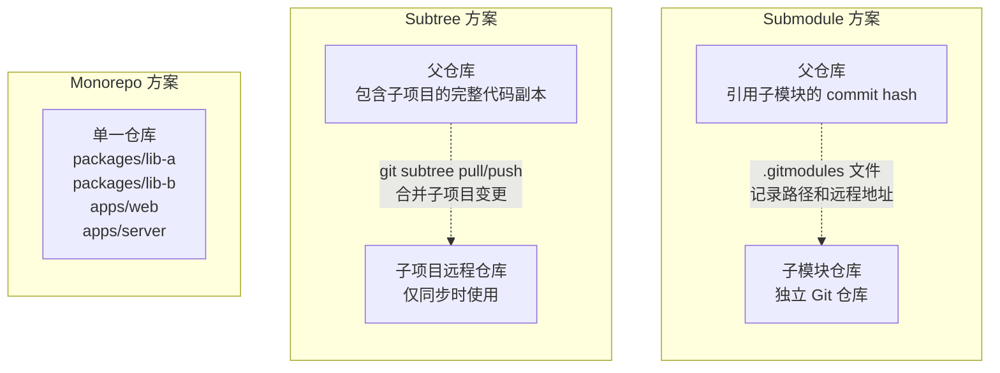
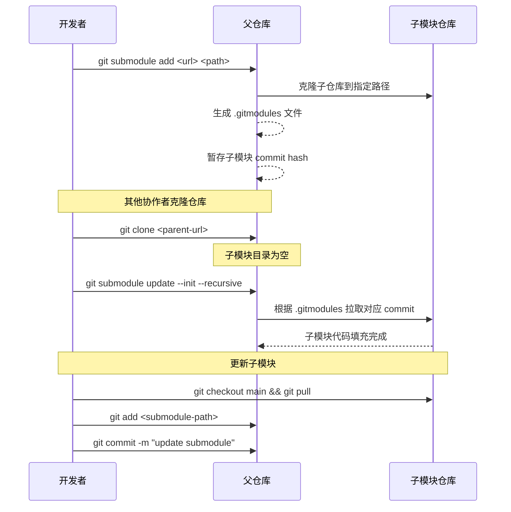
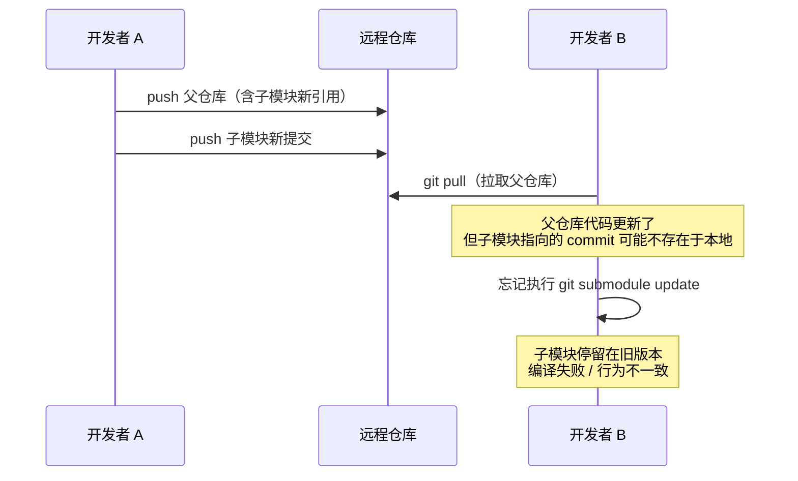
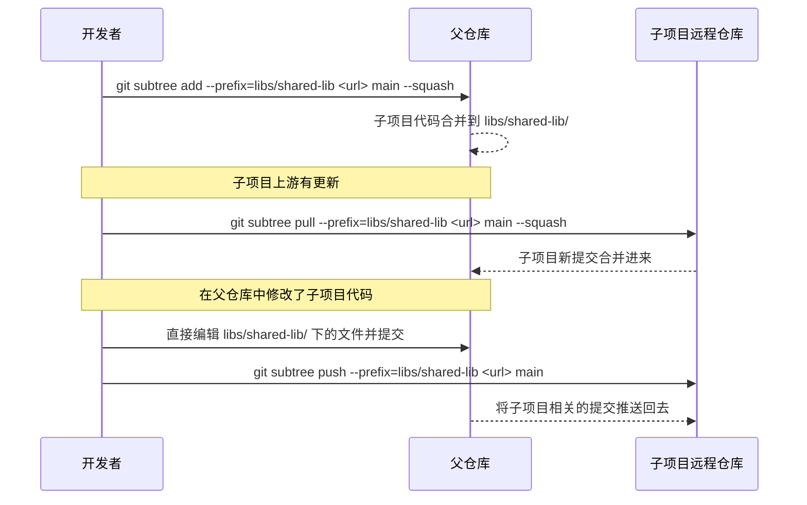
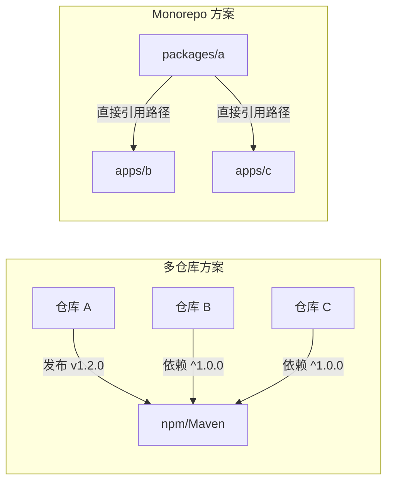
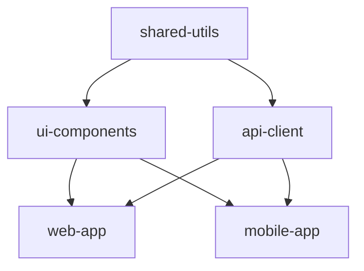
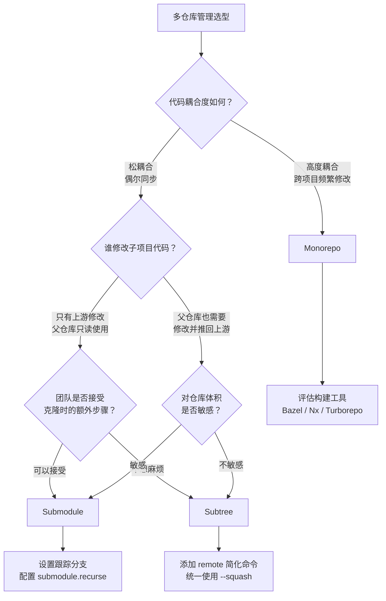

# 子模块与多仓库

当一个项目逐渐长大，代码库的边界问题就会浮出水面：公共库要不要独立仓库？微服务的共享协议怎么管理？前端和后端的依赖如何同步？这些问题本质上都在问同一件事——**多仓库之间怎么协作**。

Git 提供了两种内置的跨仓库协作机制：`submodule` 和 `subtree`。而在更大的组织尺度上，业界还有另一种截然不同的思路——**Monorepo**，把所有代码放进同一个仓库。

这三种方案各有取舍，没有银弹。本章会逐一剖析它们的原理、操作和陷阱，最后给出选型建议。

---

## 三种方案架构总览

在深入细节之前，先从架构层面理解三者的本质区别：



核心差异在于**代码存放的位置**：

| 维度 | Submodule | Subtree | Monorepo |
|------|-----------|---------|----------|
| 代码存储 | 子仓库独立存在，父仓库只存引用 | 子项目代码直接嵌入父仓库 | 全部代码在同一仓库 |
| 仓库数量 | 多个独立仓库 | 多个独立仓库 | 一个仓库 |
| 引用方式 | commit hash 指针 | 合并提交 | 文件系统路径 |
| 克隆复杂度 | 需要 `--recurse-submodules` | 普通克隆即可 | 普通克隆即可 |
| 历史独立性 | 完全独立 | 可合并或剥离 | 统一历史 |

---

## 一、git submodule

`git submodule` 是 Git 内置的跨仓库引用机制。它允许你将一个 Git 仓库作为另一个 Git 仓库的子目录嵌入，同时保持两者的提交历史完全独立。

### 1.1 添加子模块

```bash
# 语法：git submodule add <repository-url> <path>
git submodule add https://github.com/example/shared-lib.git libs/shared-lib
```

执行后会发生两件事：

1. 在指定路径克隆子仓库
2. 在仓库根目录生成 `.gitmodules` 文件，记录子模块的映射关系

`.gitmodules` 文件长这样：

```ini
[submodule "libs/shared-lib"]
    path = libs/shared-lib
    url = https://github.com/example/shared-lib.git
```

同时，Git 会在暂存区中添加一条特殊记录——子模块路径对应的 commit hash 指针（而非文件内容）：

```bash
git status
# Changes to be committed:
#   new file:   .gitmodules
#   new file:   libs/shared-lib    # ← 注意，这里显示为 new file，但实际存储的是 commit hash
```

> **关键理解**：父仓库并不存储子模块的代码内容，只存储子模块当前指向的 commit hash。这是 submodule 一切行为的根源。

### 1.2 初始化与更新

当其他协作者克隆了父仓库后，子模块目录默认是空的。需要手动初始化和更新：

```bash
# 克隆时自动初始化子模块（推荐）
git clone --recurse-submodules https://github.com/example/main-project.git

# 或者，已经克隆了父仓库，事后补初始化
git submodule init          # 注册子模块：读取 .gitmodules 中的配置
git submodule update        # 拉取子模块代码到对应 commit

# 一步到位（等价于 init + update）
git submodule update --init --recursive
```

`--recursive` 参数很重要——如果子模块里面还嵌套了子模块，不加它就无法拉取嵌套的子模块。

**日常更新子模块到最新提交**：

```bash
# 方法一：进入子模块目录手动拉取
cd libs/shared-lib
git checkout main
git pull origin main
cd ../..
git add libs/shared-lib
git commit -m "chore: update shared-lib to latest"

# 方法二：使用 git submodule update --remote
git submodule update --remote libs/shared-lib
# 这会将子模块更新到其跟踪分支的最新提交
git add libs/shared-lib
git commit -m "chore: update shared-lib to latest"
```

下面是子模块操作的完整工作流：




### 1.3 子模块的坑

Submodule 是 Git 中最容易踩坑的功能之一。以下是最常见的几个问题：

#### 坑 1：游离 HEAD 状态（Detached HEAD）

当你执行 `git submodule update` 时，Git 会将子模块 checkout 到父仓库记录的那个特定 commit，而不是任何分支。这意味着子模块处于**游离 HEAD** 状态。

```bash
cd libs/shared-lib
git status
# HEAD detached at a1b2c3d
# nothing to commit, working tree clean
```

在这种状态下，如果你直接修改子模块代码并提交，这些提交不属于任何分支，一旦你执行 `git submodule update` 切换到其他 commit，这些提交可能会丢失（被垃圾回收）。

**正确做法**：在子模块中工作时，始终先切换到一个分支：

```bash
cd libs/shared-lib
git checkout main        # 先切到分支
# ... 修改代码 ...
git add .
git commit -m "fix: some bug"
git push origin main
cd ../..
git add libs/shared-lib  # 在父仓库中更新子模块引用
git commit -m "chore: update shared-lib"
```

#### 坑 2：不同步的子模块引用

这是团队协作中最容易出问题的地方。场景如下：



**结果**：开发者 B 的子模块停留在旧版本，而父仓库的代码已经依赖了子模块的新功能，导致编译失败或运行时错误。

**防范措施**：

```bash
# 在 pull 父仓库后，始终更新子模块
git pull
git submodule update --init --recursive

# 或者配置 Git 自动更新（推荐加入团队规范）
git config submodule.recurse true
```

#### 坑 3：克隆忘加 `--recurse-submodules`

直接 `git clone` 不会自动拉取子模块，新手经常会遇到子模块目录为空的问题。

```bash
# 错误：子模块目录为空
git clone https://github.com/example/main-project.git
ls libs/shared-lib    # 空目录！

# 正确
git clone --recurse-submodules https://github.com/example/main-project.git

# 补救
git submodule update --init --recursive
```

#### 坑 4：子模块有未提交的修改时切换分支

如果子模块中有未提交的修改，在父仓库中切换分支可能会导致子模块的工作目录被覆盖或丢失。

```bash
# 安全做法：在切换父仓库分支前，先处理子模块状态
cd libs/shared-lib
git stash        # 暂存子模块修改
cd ../..
git checkout other-branch
cd libs/shared-lib
git stash pop    # 恢复子模块修改（可能需要解决冲突）
```

### 1.4 子模块最佳实践

总结以上踩坑经验，形成以下最佳实践：

| 实践 | 命令/方法 | 原因 |
|------|-----------|------|
| 始终跟踪分支 | `git config -f .gitmodules submodule.<name>.branch main` | 避免 detached HEAD |
| 及时提交子模块变更 | 先 push 子模块，再更新父仓库引用 | 确保引用的 commit 在远程存在 |
| 克隆时带上 `--recurse-submodules` | `git clone --recurse-submodules` | 避免子模块为空 |
| pull 后立即 update | `git pull && git submodule update --init --recursive` | 保持子模块与父仓库同步 |
| 开启 recurse 配置 | `git config submodule.recurse true` | 自动处理子模块 |
| 在 CI 中加检查 | `git submodule foreach git status` | 及时发现子模块异常 |

**设置子模块跟踪分支**（强烈推荐）：

```bash
# 添加子模块时直接指定跟踪分支
git submodule add -b main https://github.com/example/shared-lib.git libs/shared-lib

# 为已有子模块设置跟踪分支
git config -f .gitmodules submodule.libs/shared-lib.branch main
git submodule sync
```

设置跟踪分支后，`git submodule update --remote` 就会自动拉取该分支的最新提交，而不是停留在某个游离的 commit 上。

---

## 二、git subtree

`git subtree` 是另一种跨仓库协作方案。与 submodule 不同，subtree 将子项目的代码**直接合并进父仓库**，不再维护外部引用。

### 2.1 添加子树

```bash
# 语法：git subtree add --prefix=<path> <repository-url> <ref> --squash
git subtree add --prefix=libs/shared-lib https://github.com/example/shared-lib.git main --squash
```

`--squash` 参数会将子项目的全部历史压缩成一个合并提交，避免子项目的完整提交历史污染父仓库。不加 `--squash` 则会保留子项目的完整历史。

执行后的仓库结构：

```
main-project/
├── libs/
│   └── shared-lib/      # 子项目的代码直接在这里
│       ├── src/
│       ├── package.json
│       └── ...
├── src/
├── .gitignore
└── ...
```

**与 submodule 的关键区别**：这里没有 `.gitmodules` 文件，`libs/shared-lib` 下的文件就是普通的 Git 跟踪文件，和仓库中其他文件没有任何区别。

### 2.2 合并子树更新与推送

当子项目上游有新的提交时，可以将更新拉取到父仓库：

```bash
# 拉取子项目的更新
git subtree pull --prefix=libs/shared-lib https://github.com/example/shared-lib.git main --squash
```

当你在父仓库中修改了子项目的代码，需要推回子项目仓库时：

```bash
# 推送子项目的修改回上游
git subtree push --prefix=libs/shared-lib https://github.com/example/shared-lib.git main
```

为了不用每次都输入远程地址，可以添加一个 remote：

```bash
# 添加子项目的 remote
git remote add shared-lib https://github.com/example/shared-lib.git

# 之后就可以用 remote 名称了
git subtree pull --prefix=libs/shared-lib shared-lib main --squash
git subtree push --prefix=libs/shared-lib shared-lib main
```

### 2.3 Subtree 工作流示意



### 2.4 Subtree 与 Submodule 的对比

| 对比维度 | Submodule | Subtree |
|----------|-----------|---------|
| 代码存储 | 父仓库只存 commit hash 引用 | 代码直接嵌入父仓库 |
| `.gitmodules` | 需要，管理子模块映射 | 不需要 |
| 克隆体验 | 需要 `--recurse-submodules` | 普通克隆即可，开箱即用 |
| 子项目修改 | 需进入子模块目录操作 | 直接修改，与普通文件无异 |
| 推回上游 | 在子模块中 push 即可 | 需要 `git subtree push`，且速度较慢 |
| 历史管理 | 子模块历史完全独立 | 可选 squash 或保留完整历史 |
| 仓库体积 | 父仓库体积小 | 父仓库包含子项目完整代码，体积较大 |
| 权限控制 | 子模块可有独立权限 | 子项目代码在父仓库中，权限统一 |
| 切换分支 | 子模块可能不同步 | 无此问题 |


### 2.5 Subtree 的优缺点

**优点**：

- 克隆和拉取体验好，无需额外操作
- 没有 detached HEAD 问题
- 没有 `.gitmodules` 引用不同步问题
- 旧版本 Git 也能很好地支持
- 对 CI/CD 系统友好，不需要特殊处理

**缺点**：

- `git subtree push` 操作较慢（Git 需要遍历提交历史，分离出子项目相关的变更）
- 子项目代码在父仓库中占空间，如果子项目很大，会显著增加仓库体积
- 多个父仓库引用同一子项目时，各仓库中的子项目代码是独立副本，修改需要手动同步
- 命令语法较复杂，记忆成本高

---

## 三、Monorepo

Monorepo 是与前两种方案截然不同的思路：**不再拆分仓库，把所有相关项目的代码都放在同一个 Git 仓库中**。

这不是什么新概念——Linux 内核就是一个巨大的 Monorepo。但近年来，随着 Google、Meta、Microsoft 等公司的大规模实践，Monorepo 成为了一种被广泛讨论的架构模式。

### 3.1 概念与优势

典型的 Monorepo 目录结构：

```
my-monorepo/
├── packages/
│   ├── ui-components/     # 共享 UI 组件库
│   ├── shared-utils/      # 共享工具库
│   └── api-client/        # API 客户端
├── apps/
│   ├── web/               # Web 前端
│   ├── mobile/            # 移动端
│   └── server/            # 后端服务
├── tools/
│   ├── build-scripts/     # 构建脚本
│   └── eslint-config/     # 统一 lint 配置
├── package.json           # 根级 package.json
└── turbo.json             # 构建工具配置
```

**核心优势**：

1. **统一版本管理**：所有包共享同一个仓库，不存在版本不同步问题。一次提交可以同时修改多个包，不会出现 A 包更新了但 B 包还在用旧版 API 的情况。

2. **原子化提交**：跨包的重构可以在一个 commit 中完成。对比多仓库方案，跨仓库的重构需要分别提交 PR、协调合并顺序，容易出问题。

3. **代码共享零成本**：包之间的引用就是文件系统路径，不需要发布到 npm 或 Maven 仓库，也不需要 submodule/subtree 这类桥接机制。

4. **统一的 CI/CD**：所有项目共享同一套构建和发布流程，降低维护成本。

5. **代码可见性**：所有代码都在一个仓库中，搜索、引用、重构都更方便。



### 3.2 工具链简述

Monorepo 的核心挑战是**构建效率**——当仓库中有几百个包时，每次提交不能重新构建所有包。以下是主流的 Monorepo 构建工具：

| 工具 | 语言生态 | 核心特性 | 适用场景 |
|------|----------|----------|----------|
| **Bazel** | 多语言 | 增量构建、远程缓存、分布式执行 | 大规模、多语言项目（Google 开源） |
| **Nx** | TypeScript/JS | 依赖图分析、受影响的智能构建 | 前端/全栈 TypeScript 项目 |
| **Turborepo** | TypeScript/JS | 并行构建、远程缓存、零配置 | 中小型前端 Monorepo |
| **Lerna** | TypeScript/JS | 包版本管理和发布 | 需要独立发布 npm 包的项目 |

**依赖图与增量构建**的核心原理：



当你只修改了 `shared-utils` 时，工具会自动分析依赖图，知道需要重新构建 `ui-components`、`api-client`、`web-app` 和 `mobile-app`，而不需要重新构建未受影响的包。

### 3.3 Google / Meta 的 Monorepo 实践概要

**Google**：

- 仓库规模：数十亿行代码、数十 TB 级（2016 年公开分享的数据约为 86 TB）
- 自研构建系统：Blaze（Bazel 的内部版本），支持增量构建和分布式执行
- 自研代码审查工具：Critique
- 自研源代码索引：基于 Tricorder 的静态分析
- 关键基础设施：Piper（版本控制系统）、CitC（云端工作区）
- 核心理念：所有代码在一个仓库中，配合强大的工具链来管理规模

**Meta**：

- 仓库规模：数亿行代码
- 自研版本控制扩展：Sapling，在 Monorepo 上提供类 Git 的工作流
- 构建系统：Buck2，基于 Starlark 语言的增量构建系统
- 代码搜索：Glean，支持跨仓库级别的代码搜索
- 核心理念：通过工具链让开发者感知不到仓库的巨大规模

这些公司的实践揭示了一个关键事实：**Monorepo 在大规模下的可行性，严重依赖于专用工具链的投入**。没有强大的构建系统和代码搜索基础设施，大规模 Monorepo 只会变成开发效率的黑洞。

### 3.4 Monorepo 的挑战

| 挑战 | 描述 | 应对策略 |
|------|------|----------|
| 仓库体积 | 随时间增长，克隆耗时增加 | Git 部分克隆（`--filter=blob:none`）、浅克隆 |
| CI 效率 | 全量构建太慢 | 增量构建、依赖图分析、远程缓存 |
| 权限管理 | 所有人能看到所有代码 | CODEOWNERS 文件、路径级权限控制 |
| 发布复杂度 | 各包可能需要独立版本号 | 变更集（Changesets）、Lerna version |
| IDE 性能 | 大型项目索引慢 | 项目级配置、虚拟文件系统 |
| 学习曲线 | 新人需要理解整个仓库结构 | 良好的文档和目录约定 |

**Git 部分克隆**示例（缓解仓库体积问题）：

```bash
# 只克隆仓库结构和提交历史，不下载文件内容
git clone --filter=blob:none https://github.com/example/monorepo.git

# 只克隆最近 N 次提交的历史
git clone --depth=1 https://github.com/example/monorepo.git

# 只克隆特定目录（稀疏检出）
git clone --filter=blob:none --sparse https://github.com/example/monorepo.git
cd monorepo
git sparse-checkout set packages/shared-utils apps/web
```

---

## 四、选型决策

三种方案各有利弊，选型的核心在于理解团队的具体情况。以下决策流程图可以帮助你做出选择：



**更具体的选型参考**：

| 场景 | 推荐方案 | 理由 |
|------|----------|------|
| 前端微服务 + 共享组件库 | Monorepo（Turborepo/Nx） | 组件库和业务代码高度耦合，需要原子化提交 |
| 后端微服务 + 共享协议定义 | Submodule | 协议文件独立演进，各服务按需更新 |
| 公司级公共库被多个产品引用 | Subtree | 下游不需要关心公共库的仓库结构，开箱即用 |
| 全栈项目（前端 + 后端 + 共享类型） | Monorepo | 类型定义的修改需要前后端同步更新 |
| 第三方库的本地定制 | Subtree | 不想依赖外部仓库的可用性，需要直接修改 |
| 开源项目的可选扩展模块 | Submodule | 用户可选择性拉取，不增加基础安装体积 |

---

## 五、小结

| 方案 | 一句话总结 | 适合谁 |
|------|-----------|--------|
| **Submodule** | 轻量引用，坑多但灵活 | 子项目独立演进、父仓库只读引用的团队 |
| **Subtree** | 代码嵌入，简单但笨重 | 追求克隆体验、不需要频繁推回上游的团队 |
| **Monorepo** | 统一仓库，强依赖工具链 | 代码高度耦合、需要原子化提交的团队 |

没有完美的方案，只有最适合当前阶段的方案。对于大多数中小团队，如果代码确实紧密耦合，Monorepo 配合 Turborepo/Nx 是当前最主流的选择；如果确实需要仓库隔离，Subtree 在使用体验上优于 Submodule，而 Submodule 则在仓库体积和权限控制上更有优势。

最后，一个经常被忽视的建议：**如果不确定，先从最简单的方案开始**。很多团队在项目初期就引入 Submodule 或搭建复杂的 Monorepo 工具链，但实际上代码量还远没到需要这些机制的程度。先写代码，等痛点出现了再迁移——Git 的灵活性足以支撑你随时调整策略。

