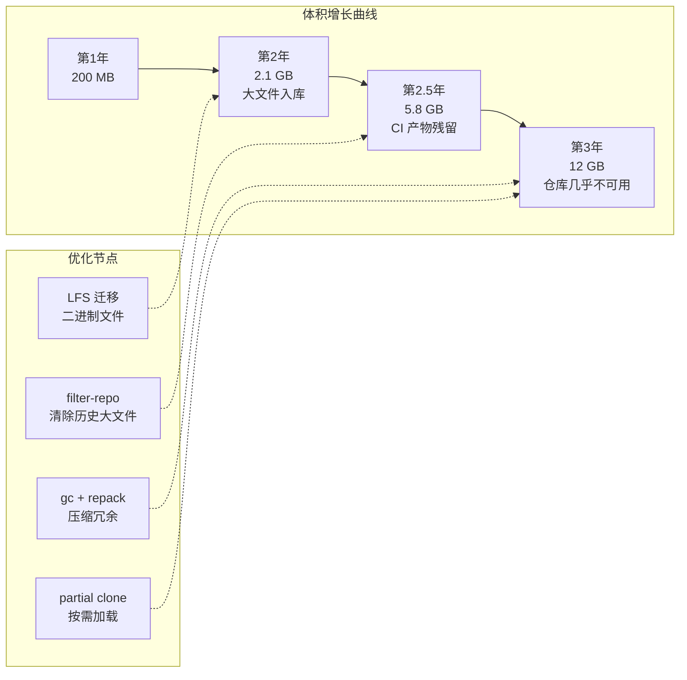
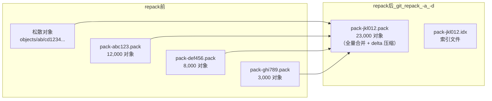
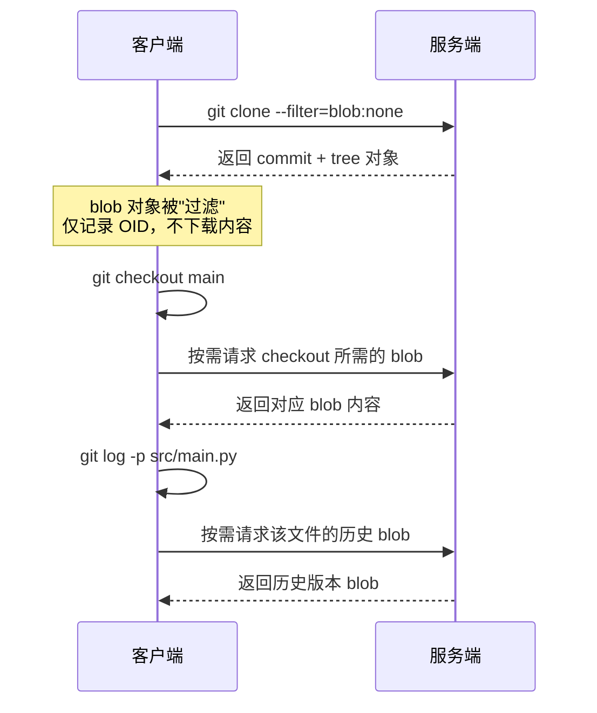
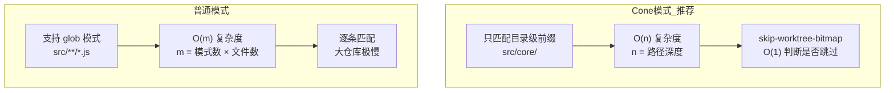
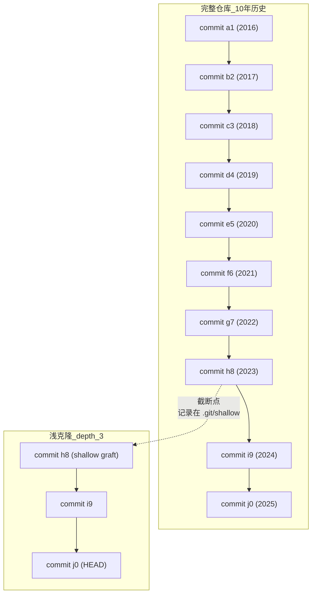
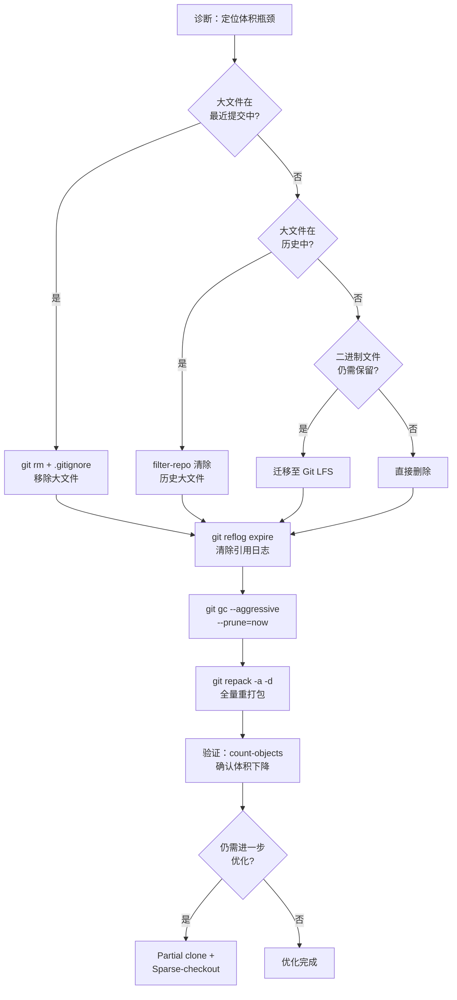
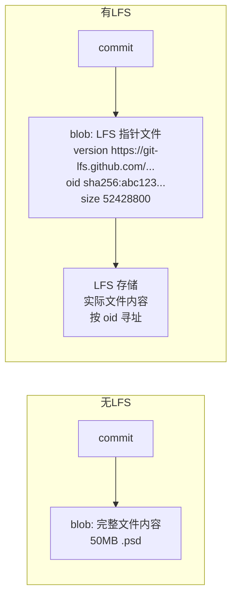

# 大仓库性能优化

当仓库体积膨胀到数 GB 甚至 10 GB 以上时，几乎每一个 Git 操作——clone、fetch、status、log——都会变得迟缓。这不是 Git 本身的设计缺陷，而是历史数据不断累积的必然结果。本章将从诊断、治理、预防三个维度，系统讲解大仓库性能优化的方法论与实操步骤。

---

## 1. 仓库膨胀的诊断方法

优化之前，先要搞清楚"胖在哪里"。盲目执行 `git gc` 往往收效甚微，因为真正占空间的通常是少数大文件的历史版本。

### 1.1 git count-objects -v

这是 Git 内置的仓库体积诊断工具，输出每一项都对应 `.git` 目录下的具体存储结构：

```bash
$ git count-objects -v
count: 4821           # 松散对象数量（.git/objects/??/ 目录下的文件数）
size: 23856           # 松散对象占用的磁盘空间（KiB）
in-pack: 183402       # pack 文件中的对象数量
packs: 12             # pack 文件数量
size-pack: 892340     # pack 文件占用的磁盘空间（KiB）
prune-packable: 0     # 已在 pack 中但仍以松散形式存在的对象数量
garbage: 0            # 损坏或不可访问的对象数量
size-garbage: 0       # 损坏对象占用的空间（KiB）
```

**关键判读规则：**

| 指标 | 健康值 | 异常信号 |
|------|--------|----------|
| `count`（松散对象数） | < 5000 | 过大说明 auto gc 未正常触发 |
| `packs`（pack 文件数） | 1-3 | 过多说明 repack 不充分，查找效率低 |
| `size-pack` | 取决于项目 | 持续增长且与源码体量不匹配，说明有大文件残留 |

> **注意**：`size` 和 `size-pack` 的单位是 KiB。一个 `size-pack: 892340` 的仓库，pack 文件实际占用约 871 MB。

### 1.2 定位大文件：git rev-list + git ls-tree

`count-objects` 只告诉你"胖了"，但不告诉你"胖在哪"。以下命令可以按体积排序，找出历史中最大的 blob 对象：

```bash
# 找出历史中体积最大的 10 个 blob
git rev-list --objects --all \
  | git cat-file --batch-check='%(objecttype) %(objectname) %(objectsize) %(rest)' \
  | awk '/^blob/ {print $3, $4}' \
  | sort -rn \
  | head -10
```

输出示例：

```
52428800  datasets/training_data_v2.csv
31457280  assets/videos/intro.mp4
20971520  build/output/app-debug.apk
10485760  assets/images/hero.png
5242880   assets/fonts/custom.ttf
```

这会列出每个 blob 的字节数及其对应的文件路径。一旦定位到"元凶"，就可以针对性地用 LFS 或 filter-repo 清除。

### 1.3 .git 目录结构分析

手动检查 `.git` 各子目录的体积，有助于快速定位问题区域：

```bash
du -sh .git/*/ .git/objects/*/ 2>/dev/null | sort -rh | head -10
```

典型输出：

```
820M  .git/objects/
150M  .git/objects/pack/
670M  .git/objects/??/       # 松散对象，异常！
45M   .git/lfs/
12M   .git/refs/
```

如果松散对象目录（`objects/??/`）体积远大于 pack 目录，说明 gc 长期未执行或执行失败。

---

## 2. 仓库体积增长曲线与优化节点

下图展示了一个典型企业仓库在 3 年生命周期中的体积变化，以及各优化手段介入的时机：



**核心规律**：仓库体积增长通常不是线性的，而是在某次"大文件入库"事件后出现阶跃式跳升。因此，优化的最佳时机不是"仓库已经卡得用不了"，而是"首次出现异常跳升"时。

---

## 3. git gc 详解

`git gc`（Garbage Collector）是 Git 仓库维护的核心命令，它本质上是一个编排器，内部依次调用 `git repack`、`git prune`、`git pack-refs` 等子命令。

### 3.1 触发条件

Git 的自动 gc 由以下配置控制：

```bash
# 查看当前配置
git config --get gc.auto
git config --get gc.autopacklimit
```

| 配置项 | 默认值 | 含义 |
|--------|--------|------|
| `gc.auto` | 6700 | 松散对象数超过此值时触发 auto gc |
| `gc.autopacklimit` | 50 | pack 文件数超过此值时触发 auto gc |
| `gc.autoDetach` | true | auto gc 是否在后台运行 |
| `gc.pruneExpire` | "2.weeks.ago" | 超过此时间的不可达对象才被清理 |

**手动触发方式**：

```bash
# 前台执行，可观察详细输出
GIT_TRACE=1 git gc --aggressive

# 仅清理，不 repack
git gc --prune=now

# 强制执行（即使 auto 条件未满足）
git gc --force
```

### 3.2 执行流程

`git gc` 的内部执行流程如下：

```mermaid
flowchart TD
    A["git gc 启动"] --> B{"松散对象数 > gc.auto<br/>或 pack 数 > gc.autopacklimit?"}
    B -- 否且非 --force --> Z["跳过，输出 auto gc 信息"]
    B -- 是或 --force --> C["git repack -d -l"]
    C --> D["git prune --expire <gc.pruneExpire>"]
    D --> E["git pack-refs --all --prune"]
    E --> F["git rerere gc"]
    F --> G["git commit-graph write<br/>（如果启用）"]
    G --> H["完成"]

```

**各步骤说明**：

1. **repack**：将松散对象和多个 pack 文件合并为新的 pack，删除旧的冗余 pack
2. **prune**：删除不可达的松散对象（受 `gc.pruneExpire` 时间限制）
3. **pack-refs**：将松散的引用文件（`.git/refs/` 下的零散文件）打包为 `.git/packed-refs`
4. **rerere gc**：清理过期的冲突解决记录
5. **commit-graph write**：生成提交图索引，加速 `git log` 等遍历操作

### 3.3 关键配置项

```bash
# 设置松散对象阈值（降低可更频繁触发，但增加开销）
git config gc.auto 100

# 设置过期时间（更激进的清理策略）
git config gc.pruneExpire 3.days.ago

# 禁用自动 gc（不推荐，但排查问题时有用）
git config gc.auto 0

# 打包时的内存上限（避免大仓库打包时占用过多内存）
git config pack.windowMemory 256m
```

> **`--aggressive` 的代价**：`git gc --aggressive` 会使用更大的 delta 压缩窗口（`pack.window=250` vs 默认 10），压缩率更高但耗时可能增加 10 倍以上。适合作为一次性深度优化，不适合日常使用。

---

## 4. git repack 详解

`git repack` 是 `git gc` 内部调用的核心子命令，负责将对象打包为 pack 文件。理解其参数，可以在 gc 之外进行更精细的控制。

### 4.1 核心参数

| 参数 | 含义 | 效果 |
|------|------|------|
| `-a` | 全量打包（all） | 将所有对象（松散 + 已有 pack 中的）打包为一个新 pack |
| `-d` | 删除冗余 pack（delete） | 打包完成后删除被合并的旧 pack 文件 |
| `-l` | 本地对象（local） | 不包含 `.git/objects/info/alternates` 指向的借用对象 |
| `-A` | 与 `-a` 类似但保留不可达对象 | 配合 `-d` 使用时，不可达对象被展开为松散对象而非直接丢弃，可交由后续 `git prune` 按 `gc.pruneExpire` 清理 |
| `--depth=N` | delta 链深度 | 默认 50，增大可提高压缩率但增加还原开销 |
| `--window=N` | delta 匹配窗口 | 默认 10，增大可找到更多相似对象但更慢 |

### 4.2 典型用法

```bash
# 日常维护：合并松散对象到已有 pack，删除冗余 pack
git repack -d

# 深度优化：全量重打包，最大化压缩
git repack -a -d --depth=50 --window=30

# 仅打包松散对象（不碰已有 pack）
git repack
```


### 4.3 repack 前后的对象结构变化



**关键点**：`-a -d` 组合是最常用的深度优化方式。它将所有对象重新做 delta 压缩后写入一个新 pack，然后删除旧 pack。这能最大化压缩率，但执行期间磁盘占用会先增后减（新旧 pack 同时存在），需确保磁盘有足够空间。

---

## 5. Partial Clone（部分克隆）

Partial clone 是 Git 2.19 引入的机制，允许在克隆时只下载部分对象，其余对象在需要时按需获取。这是解决"仓库太大、clone 太慢"的根本性方案。

### 5.1 工作原理



### 5.2 过滤器类型

| 过滤器 | 语法 | 下载内容 | 适用场景 |
|--------|------|----------|----------|
| 无 blob | `--filter=blob:none` | commit + tree，不下载任何 blob | CI/CD、代码审查、历史搜索 |
| 限制大小 | `--filter=blob:limit=1m` | commit + tree + 小于 1MB 的 blob | 日常开发（大文件按需获取） |
| 无 tree | `--filter=tree:0` | 仅 commit，不下载 tree 和 blob | 仅需提交历史的场景 |

### 5.3 实操示例

```bash
# 不下载任何 blob，最激进的 partial clone
git clone --filter=blob:none https://github.com/org/monorepo.git

# 下载小于 100KB 的 blob（源码通常能直接获取，大文件按需）
git clone --filter=blob:limit=100k https://github.com/org/monorepo.git

# 结合 bare 仓库做本地缓存
git clone --filter=blob:none --bare https://github.com/org/monorepo.git monorepo.git
git clone --reference-if-able monorepo.git https://github.com/org/monorepo.git work
```

### 5.4 按需获取的触发时机

Partial clone 中，被过滤的对象会在以下操作触发按需下载：

- `git checkout` / `git switch`：需要工作目录中的文件内容
- `git diff`：需要比较的 blob 内容
- `git blame`：需要文件每一行的历史 blob
- `git log -p` / `git show`：需要显示 diff 内容

**服务端要求**：partial clone 需要服务端支持 `upload-pack` 过滤协议。GitHub、GitLab、Bitbucket 均已支持。自建服务需确保 Git 版本 >= 2.19 且未禁用 `uploadpack.allowFilter`。

### 5.5 注意事项

- 按需获取需要网络连接，离线环境下部分操作会失败
- 已获取的对象会缓存在本地，后续访问不再请求服务端
- 可用 `git fetch --filter=blob:none` 将已有仓库转为 partial clone 模式

---

## 6. Sparse-Checkout（稀疏检出）

Sparse-checkout 让你只检出仓库中的部分目录，而不是整个工作树。与 partial clone 配合使用，可以实现"只下载和检出需要的部分"。

### 6.1 Cone 模式 vs 普通模式

Git 2.25 引入了 cone（锥形）模式，相比传统模式有显著性能优势：



**Cone 模式的限制**：只能指定目录前缀，不支持 glob 或否定模式。这是为了将稀疏检出的判断从"正则匹配"降级为"前缀匹配"，从而实现 O(1) 复杂度。

### 6.2 配置方式

#### Cone 模式（推荐）

```bash
# 初始化 sparse-checkout
git sparse-checkout init --cone

# 添加需要检出的目录
git sparse-checkout set src/core src/api docs

# 添加更多目录
git sparse-checkout add src/utils

# 查看当前配置
git sparse-checkout list

# 禁用 sparse-checkout（恢复完整检出）
git sparse-checkout disable
```

#### 普通模式

```bash
# 初始化为普通模式
git sparse-checkout init --no-cone

# 设置匹配模式
git sparse-checkout set \
  "src/core/**" \
  "docs/*.md" \
  "!docs/draft/**"

# 或直接编辑配置文件
cat > .git/info/sparse-checkout << 'EOF'
/*
!build/
!vendor/
!*.pdf
EOF
```

### 6.3 与 Partial Clone 联合使用的工作流

这是大仓库场景下的最佳实践组合：

```bash
# 1. partial clone：不下载 blob
git clone --filter=blob:none https://github.com/org/monorepo.git

cd monorepo

# 2. sparse-checkout：只检出需要的目录
git sparse-checkout init --cone
git sparse-checkout set src/core src/api

# 3. 此时工作目录只有 src/core 和 src/api
# 未检出的文件不会触发 blob 下载

# 4. 需要其他目录时，动态添加
git sparse-checkout add src/utils

# 5. 切换分支时，sparse-checkout 自动生效
git checkout feature-branch
```

**效果**：一个 10 GB 的 monorepo，如果只开发 `src/core` 模块，实际下载和检出的数据可能只有 200 MB。

---

## 7. 浅克隆（Shallow Clone）

浅克隆是最早出现的"轻量克隆"方案，通过截断提交历史来减少下载量。

### 7.1 原理



浅克隆的核心机制是 `.git/shallow` 文件，其中记录了截断点的 commit SHA。Git 在遍历提交图时，遇到 shallow 文件中记录的 commit 就会停止，不再向上追溯父提交。

```bash
# 查看浅克隆的截断点
cat .git/shallow
# h8a3b2c1d4e5f6...

# 查看浅克隆深度
git rev-list --count HEAD
# 3
```


### 7.2 使用方式

```bash
# 仅获取最近 1 次提交
git clone --depth=1 https://github.com/org/monorepo.git

# 获取最近 10 次提交
git clone --depth=10 https://github.com/org/monorepo.git

# 浅克隆特定分支
git clone --depth=1 --branch=release/v2 --single-branch https://github.com/org/repo.git

# 加深历史（将浅克隆转为更深的克隆）
git fetch --depth=100
git fetch --unshallow    # 获取全部历史，变为完整克隆
```

### 7.3 限制与风险

| 限制 | 说明 | 影响 |
|------|------|------|
| 无法 push | 浅克隆缺少完整历史，服务端可能拒绝 push | 不能用于日常开发推送 |
| blame 不完整 | 只能追溯浅克隆深度范围内的行历史 | 无法看到完整修改记录 |
| merge/rebase 受限 | 缺少共同祖先，无法自动合并 | 需先 `fetch --unshallow` |
| 子模块问题 | 浅克隆中子模块行为不可预测 | 需额外处理 |
| clone 不完整 | `--single-branch` 只克隆一个分支 | 其他分支需手动 fetch |

> **浅克隆 vs Partial Clone**：浅克隆截断的是**提交历史**，partial clone 过滤的是**对象类型**。Partial clone 保留了完整的提交图（commit + tree），因此 push、merge、blame 均可正常工作，只是 blob 按需获取。在大多数场景下，partial clone 是浅克隆的更好替代。

### 7.4 适用场景

浅克隆最适合以下只读或一次性场景：

- CI/CD 流水线：只需最新代码进行构建和测试
- 自动化脚本：批量分析仓库最新状态
- 临时查看：快速浏览某个仓库的当前代码

---

## 8. 单仓库 10GB+ 的真实优化策略

以下是一个经过实践验证的完整优化流程，适用于体积超过 10 GB 的企业级仓库。

### 8.1 完整优化流程



### 8.2 第一步：定位大文件

```bash
# 方法一：按 blob 体积排序（推荐）
git rev-list --objects --all \
  | git cat-file --batch-check='%(objecttype) %(objectname) %(objectsize) %(rest)' \
  | awk '/^blob/ {print $3, $4}' \
  | sort -rn \
  | head -20

# 方法二：按文件扩展名统计总占用
git rev-list --objects --all \
  | git cat-file --batch-check='%(objecttype) %(objectname) %(objectsize) %(rest)' \
  | awk '/^blob/ {split($4,a,"."); ext=a[length(a)]; size[ext]+=$3} END {for(e in size) print size[e], e}' \
  | sort -rn \
  | head -10
```

典型输出：

```
8589934592 .mp4
2147483648 .csv
1073741824 .apk
536870912  .so
268435456  .pdf
```

### 8.3 第二步：用 filter-repo 清除历史大文件

`git filter-repo` 是 `git filter-branch` 的官方推荐替代品，速度更快、更安全。

```bash
# 安装（pip）
pip install git-filter-repo

# 清除指定路径的所有历史
git filter-repo --path datasets/training_data_v2.csv --invert-paths

# 清除指定扩展名的所有历史
git filter-repo --path-glob '*.mp4' --invert-paths

# 清除大于 10MB 的 blob
git filter-repo --strip-blobs-bigger-than 10M
```

**重要**：`filter-repo` 会重写提交历史，所有 commit SHA 都会改变。团队需要协调重新克隆仓库。


### 8.4 第三步：迁移至 Git LFS

对于仍需保留在仓库中的二进制文件（设计稿、模型文件、视频素材），应迁移至 Git LFS：

```bash
# 安装 Git LFS
git lfs install

# 追踪大文件类型
git lfs track "*.psd"
git lfs track "*.mp4"
git lfs track "*.so"

# 查看追踪规则
cat .gitattributes
# *.psd filter=lfs diff=lfs merge=lfs -text
# *.mp4 filter=lfs diff=lfs merge=lfs -text

# 迁移已有文件到 LFS
git lfs migrate import --include="*.psd,*.mp4" --everything

# 验证 LFS 状态
git lfs ls-files
```

**LFS 的工作原理**：



LFS 指针文件通常只有 100-200 字节，替代了原始的大文件 blob。实际文件内容存储在 LFS 服务端（可以是 GitHub/GitLab 内置的 LFS 存储，也可以是自建的如 Artifactory）。

### 8.5 第四步：清理与压缩

```bash
# 1. 清除 reflog（引用日志会保留被删除对象的引用）
git reflog expire --expire=now --all

# 2. 清除 stash
git stash drop  # 逐个删除
# 或
git reflog expire --expire=now --all  # 已包含 stash 的引用

# 3. 激进 gc
git gc --aggressive --prune=now

# 4. 全量 repack
git repack -a -d --depth=50 --window=30

# 5. 清理 LFS 缓存
git lfs prune

# 6. 验证结果
git count-objects -v
du -sh .git
```

### 8.6 优化效果参考

以下是一组示例数值（示意，非实测），用于说明各项优化的典型效果量级：

| 指标 | 优化前 | 优化后 | 降幅 |
|------|--------|--------|------|
| `.git` 体积 | 12.3 GB | 1.8 GB | 85% |
| pack 文件数 | 47 | 1 | 98% |
| 松散对象数 | 128,000 | 0 | 100% |
| clone 时间 | 45 min | 3 min | 93% |
| `git log` 首次响应 | 8.2s | 0.3s | 96% |
| `git status` | 3.1s | 0.2s | 94% |

### 8.7 预防措施：持续守护仓库健康

优化一次不够，需要建立长效机制防止问题复发：

```bash
# 1. pre-commit 钩子：阻止大文件入库
# .git/hooks/pre-commit
#!/bin/sh
# 阻止超过 10MB 的文件提交
max_size=10485760  # 10MB
large_files=$(git diff --cached --name-only | while read f; do
  [ -f "$f" ] && [ $(wc -c < "$f") -gt $max_size ] && echo "$f"
done)
if [ -n "$large_files" ]; then
  echo "ERROR: 以下文件超过 10MB 限制，请使用 Git LFS："
  echo "$large_files"
  exit 1
fi

# 2. CI 检查：定期监控仓库体积
# .github/workflows/repo-health.yml
# - run: git clone --bare . /tmp/repo-check && du -sh /tmp/repo-check

# 3. 定期 gc（cron 或 CI 定时任务）
# 每周日凌晨执行
git gc --aggressive --prune=now
```

---

## 9. 小结

| 方案 | 解决的问题 | 优势 | 局限 |
|------|-----------|------|------|
| `git gc` | 松散对象堆积、pack 碎片化 | 内置、自动触发 | 无法清除历史大文件 |
| `git repack -a -d` | pack 碎片化、压缩率低 | 最大化压缩 | 执行期间磁盘占用翻倍 |
| `filter-repo` | 历史中的大文件残留 | 彻底清除、重写历史 | 改变所有 commit SHA |
| Git LFS | 需保留的二进制大文件 | 仓库只存指针、透明使用 | 需服务端支持、有存储成本 |
| Partial clone | clone 体积过大 | 按需获取、保留完整历史 | 需网络、服务端需支持 |
| Sparse-checkout | 工作目录过大 | 只检出需要的目录 | cone 模式仅支持目录前缀 |
| 浅克隆 | clone 体积过大 | 简单直接 | 无法 push、blame 不完整 |

**核心原则**：

1. **先诊断，后治理**：用 `count-objects` 和 `rev-list` 定位问题，不要盲目 gc
2. **预防优于治疗**：pre-commit 钩子 + LFS 追踪，从源头阻止大文件入库
3. **选择合适的方案**：partial clone + sparse-checkout 是日常开发的最优组合；浅克隆仅适合 CI 等只读场景
4. **重写历史是最后手段**：`filter-repo` 效果最好但代价最大，需团队协调
5. **建立长效机制**：定期 gc、CI 体积监控、LFS 追踪规则，缺一不可

