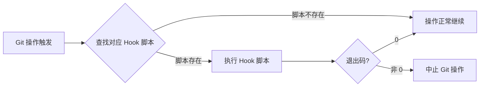
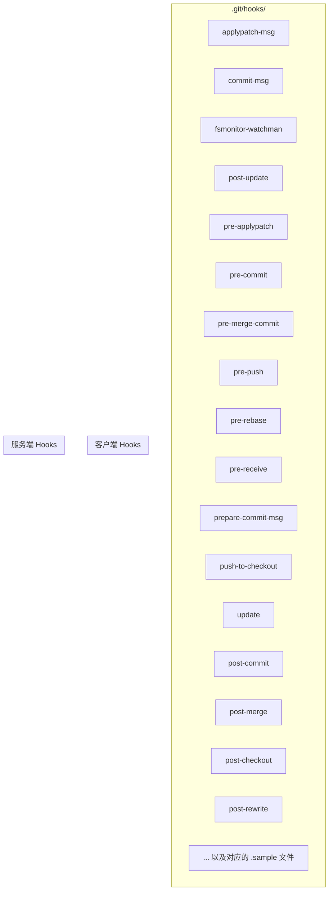
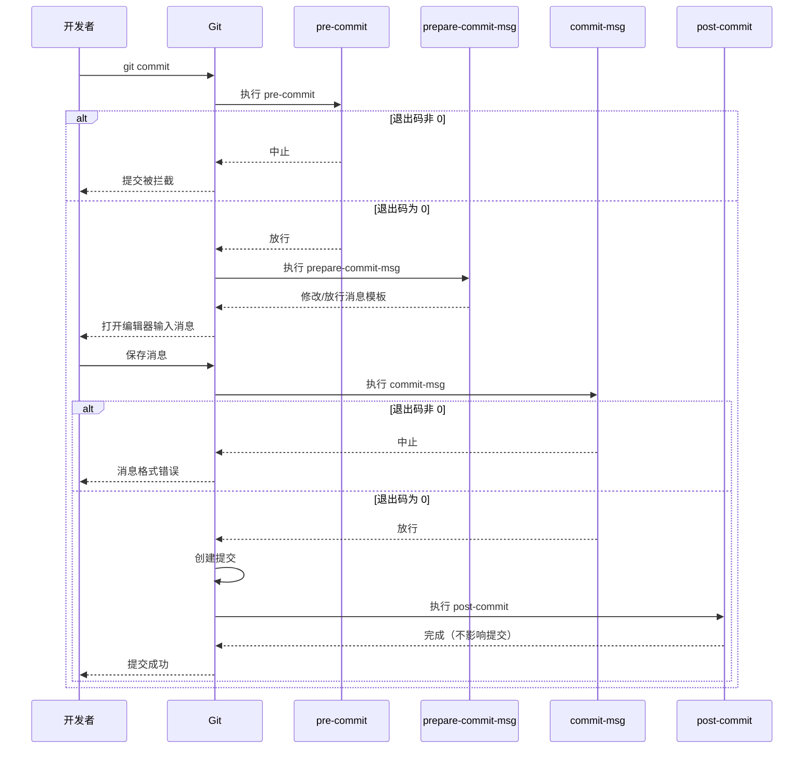
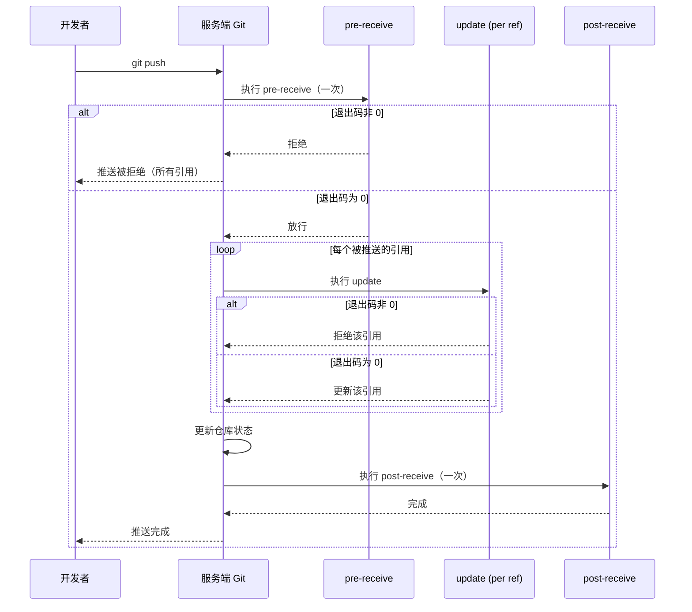
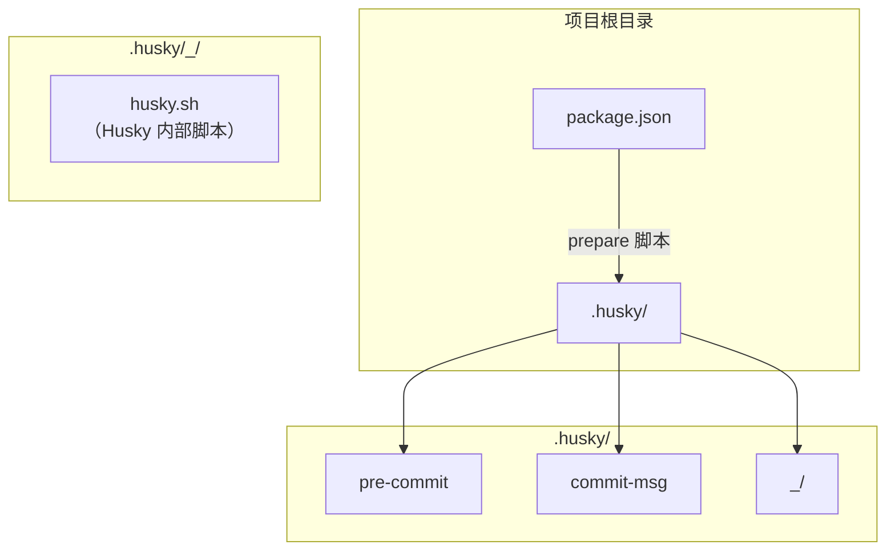
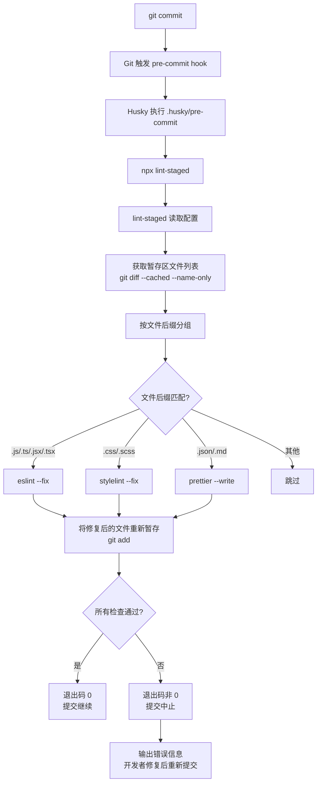
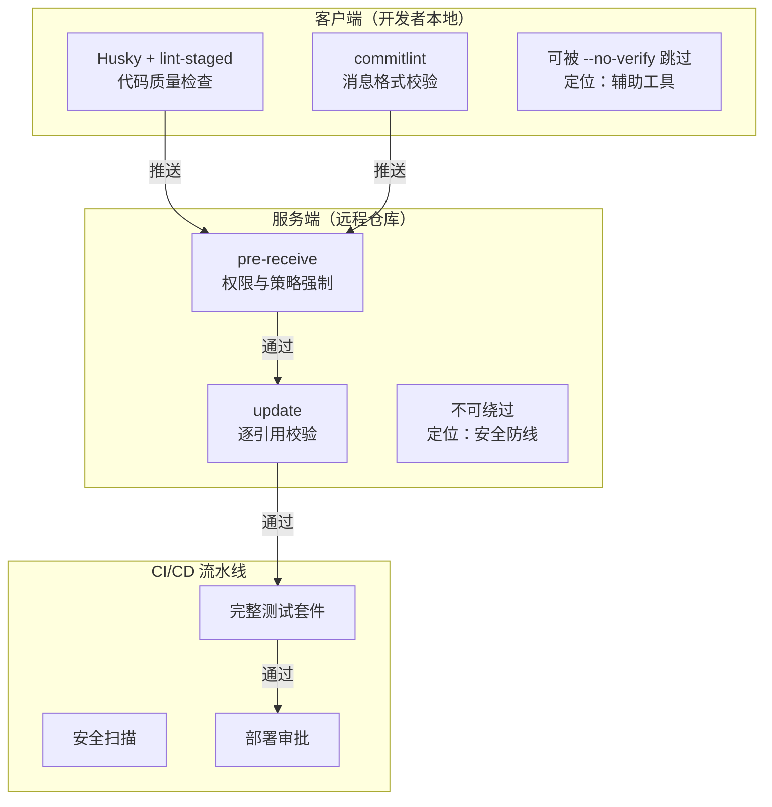

# Git Hooks：在关键节点自动执行脚本

在企业级 Git 工作流中，仅靠人工规范往往不够——总有开发者会忘记跑测试、提交消息写得不规范、或者把不合规的代码推到远程仓库。Git Hooks 正是解决这类问题的利器：它允许你在 Git 操作的特定节点上挂载自定义脚本，自动完成代码检查、消息校验、权限控制、部署触发等工作，将团队规范从"口头约定"升级为"强制执行"。

## Git Hooks 概述

Git Hooks 是 Git 内置的事件驱动机制。当特定的 Git 操作（如 commit、push、rebase 等）发生时，Git 会查找并执行对应的钩子脚本。如果脚本以非零退出码退出，对应的 Git 操作就会被中止；如果以零退出码退出，操作正常继续。



核心特点：

- **零配置激活**：只要 `.git/hooks/` 目录下存在同名可执行脚本，Hook 即自动生效，无需额外注册。
- **退出码即决策**：脚本返回 0 表示放行，返回非 0 表示拦截——这是 Hook 的核心控制机制。
- **客户端与服务端分离**：客户端 Hook 在开发者本地执行，侧重代码质量；服务端 Hook 在远程仓库执行，侧重权限与策略。
- **不随仓库传输**：`.git/hooks/` 目录不会被 `git push` 传输到远程仓库，也不会被 `git clone` 拉取。

## Hooks 目录结构

每个 Git 仓库的 `.git/hooks/` 目录下都存放着 Hook 脚本。Git 初始化时会自动生成一系列 `.sample` 示例文件，这些示例不会被执行，但包含了每个 Hook 的使用说明。



激活一个 Hook 的方式很简单：去掉 `.sample` 后缀，并确保脚本具有可执行权限：

```bash
# 激活 pre-commit hook
cp .git/hooks/pre-commit.sample .git/hooks/pre-commit
chmod +x .git/hooks/pre-commit
```

---

## 客户端 Hooks 详解

客户端 Hooks 在开发者本地仓库中执行，主要用于代码质量检查、提交规范校验等。它们可以被开发者跳过（通过 `--no-verify`），因此更适合作为"软性约束"而非安全防线。

### pre-commit：提交前检查

**触发时机**：`git commit` 执行后，在输入提交消息之前。

**参数**：无。

**退出码含义**：

| 退出码 | 效果 |
|--------|------|
| 0 | 允许提交继续 |
| 非 0 | 中止提交 |

**典型用途**：

- 代码 lint 检查（ESLint、Pylint 等）
- 代码格式化检查（Prettier、Black 等）
- 运行单元测试
- 检查是否有调试代码残留（`console.log`、`debugger` 等）
- 检查大文件是否被意外加入

**示例脚本**：

```bash
#!/bin/bash
# .git/hooks/pre-commit

# 检查是否有 console.log 残留
if git diff --cached --name-only | xargs grep -l "console.log"; then
    echo "ERROR: 发现 console.log 残留，请移除后再提交"
    exit 1
fi

# 检查是否有超过 1MB 的文件被暂存
large_files=$(git diff --cached --name-only | while read file; do
    if [ -f "$file" ] && [ $(wc -c < "$file") -gt 1048576 ]; then
        echo "$file"
    fi
done)

if [ -n "$large_files" ]; then
    echo "ERROR: 以下文件超过 1MB，不允许提交："
    echo "$large_files"
    exit 1
fi

exit 0
```

### prepare-commit-msg：自动生成提交消息模板

**触发时机**：`git commit` 编辑器启动之前，在 `pre-commit` 之后执行。

**参数**：

| 参数序号 | 含义 |
|----------|------|
| $1 | 提交消息文件路径（必选） |
| $2 | 提交消息来源：`message`（`-m` 参数）、`template`（`-t` 参数）、`merge`（合并提交）、`squash`（squash 提交）、`commit`（`-c`/`-C`/`--amend` 参数） |
| $3 | 仅当来源为 `commit` 或 `squash` 时存在，表示源提交的 SHA-1 |

**退出码含义**：

| 退出码 | 效果 |
|--------|------|
| 0 | 允许继续（可以修改消息文件） |
| 非 0 | 中止提交 |

**典型用途**：

- 自动在提交消息中添加分支名称
- 注入 Issue 编号模板
- 添加修改范围摘要

**示例脚本**：

```bash
#!/bin/bash
# .git/hooks/prepare-commit-msg

COMMIT_MSG_FILE=$1
COMMIT_SOURCE=$2

# 仅在交互式提交时添加模板（跳过 merge、squash 等场景）
if [ -z "$COMMIT_SOURCE" ]; then
    branch=$(git symbolic-ref --short HEAD 2>/dev/null)

    # 从分支名提取 Issue 编号（如 feature/JIRA-1234）
    issue=$(echo "$branch" | grep -oE "[A-Z]+-[0-9]+")

    if [ -n "$issue" ]; then
        # 在消息文件开头注入 Issue 编号
        echo "[$issue] " | cat - "$COMMIT_MSG_FILE" > temp && mv temp "$COMMIT_MSG_FILE"
    fi

    # 添加提交消息格式提示
    echo -e "\n# ------ 提交消息格式 ------" >> "$COMMIT_MSG_FILE"
    echo "# <type>(<scope>): <subject>" >> "$COMMIT_MSG_FILE"
    echo "# type: feat|fix|docs|style|refactor|test|chore" >> "$COMMIT_MSG_FILE"
    echo "# scope: 可选，影响范围" >> "$COMMIT_MSG_FILE"
fi

exit 0
```


### commit-msg：校验提交消息格式

**触发时机**：提交消息编辑完成后，在提交最终创建之前。

**参数**：

| 参数序号 | 含义 |
|----------|------|
| $1 | 提交消息文件路径 |

**退出码含义**：

| 退出码 | 效果 |
|--------|------|
| 0 | 消息格式合规，允许提交 |
| 非 0 | 消息格式不合规，中止提交 |

**与 prepare-commit-msg 的区别**：`prepare-commit-msg` 用于"辅助生成"消息，`commit-msg` 用于"最终校验"消息。

**典型用途**：

- 强制 Commit Message 规范（如 Conventional Commits）
- 检查消息长度
- 确保 Issue 编号存在

**示例脚本**：

```bash
#!/bin/bash
# .git/hooks/commit-msg

COMMIT_MSG_FILE=$1
COMMIT_MSG=$(cat "$COMMIT_MSG_FILE")

# Conventional Commits 格式校验
# 格式：type(scope): subject
PATTERN="^(feat|fix|docs|style|refactor|perf|test|build|ci|chore|revert)(\(.+\))?: .{1,100}"

if ! echo "$COMMIT_MSG" | grep -qE "$PATTERN"; then
    echo "ERROR: 提交消息不符合 Conventional Commits 规范"
    echo ""
    echo "期望格式：<type>(<scope>): <subject>"
    echo "  type: feat|fix|docs|style|refactor|perf|test|build|ci|chore|revert"
    echo "  scope: 可选"
    echo "  subject: 1-100 字符描述"
    echo ""
    echo "示例："
    echo "  feat(auth): 添加 OAuth2 登录支持"
    echo "  fix: 修复分页计算错误"
    echo "  docs(api): 更新接口文档"
    exit 1
fi

exit 0
```

### post-commit：提交后的通知或日志

**触发时机**：提交成功创建之后。

**参数**：无。

**退出码含义**：退出码不影响已完成的提交，但非零退出码会产生警告信息。

**典型用途**：

- 发送提交通知
- 记录提交日志到外部系统
- 触发本地自动化任务

**示例脚本**：

```bash
#!/bin/bash
# .git/hooks/post-commit

# 获取提交信息
commit_hash=$(git rev-parse HEAD)
commit_msg=$(git log -1 --pretty=%B)
author=$(git log -1 --pretty=%an)
branch=$(git symbolic-ref --short HEAD 2>/dev/null || echo "detached")

# 记录到本地日志文件
echo "[$(date '+%Y-%m-%d %H:%M:%S')] $author committed $commit_hash on $branch: $commit_msg" \
    >> ~/.git-commit-log.txt
```

### pre-rebase：rebase 前检查

**触发时机**：`git rebase` 执行之前。

**参数**：

| 参数序号 | 含义 |
|----------|------|
| $1 | rebase 目标分支的上游 |
| $2 | 正在 rebase 的分支（可选，当前分支为默认值） |

**退出码含义**：

| 退出码 | 效果 |
|--------|------|
| 0 | 允许 rebase |
| 非 0 | 中止 rebase |

**典型用途**：

- 阻止对主分支的 rebase
- 防止 rebase 已推送的提交
- 保护关键分支的提交历史

**示例脚本**：

```bash
#!/bin/bash
# .git/hooks/pre-rebase

target_branch=$1

# 禁止 rebase master/main 分支
if [ "$target_branch" = "master" ] || [ "$target_branch" = "main" ]; then
    echo "ERROR: 禁止对 $target_branch 分支执行 rebase 操作"
    exit 1
fi

# 检查当前分支是否已有推送记录，防止 rebase 已推送的提交
current_branch=$(git symbolic-ref --short HEAD)
upstream=$(git rev-parse --abbrev-ref --symbolic-full-name @{upstream} 2>/dev/null)

if [ -n "$upstream" ]; then
    # 获取本地与远程的分叉点
    merge_base=$(git merge-base "$upstream" HEAD 2>/dev/null)
    rebase_base=$(git merge-base "$target_branch" HEAD 2>/dev/null)

    if [ "$merge_base" != "$rebase_base" ]; then
        echo "WARNING: 当前分支已推送到远程，rebase 可能导致历史冲突"
        echo "如确需 rebase，请先合并远程变更或与团队确认"
    fi
fi

exit 0
```

### post-rewrite：amend/rebase 后的操作

**触发时机**：在 `git commit --amend` 或 `git rebase` 重写提交之后。

**参数**：

| 参数序号 | 含义 |
|----------|------|
| $1 | 重写类型：`amend` 或 `rebase` |

**stdin 输入**：每行格式为 `<old-sha> <new-sha> [<extra-info>]`，表示旧提交到新提交的映射。

**退出码含义**：退出码不影响已重写的提交。

**典型用途**：

- 更新工作区缓存
- 同步依赖（如 amend 后重新生成 lock 文件）
- 通知外部系统提交哈希已变更

**示例脚本**：

```bash
#!/bin/bash
# .git/hooks/post-rewrite

rewrite_type=$1

echo "检测到提交重写 ($rewrite_type)，正在更新工作区..."

# 如果是 rebase 操作，可能需要重新安装依赖
if [ "$rewrite_type" = "rebase" ]; then
    # 检查 package-lock.json 是否变化
    if git diff --name-only | grep -q "package-lock.json"; then
        echo "检测到依赖变更，正在执行 npm ci..."
        npm ci --quiet
    fi
fi
```


### post-checkout：切换分支后更新依赖

**触发时机**：`git checkout` 或 `git switch` 成功切换分支后。

**参数**：

| 参数序号 | 含义 |
|----------|------|
| $1 | 前一个 HEAD 的 SHA-1 |
| $2 | 新 HEAD 的 SHA-1 |
| $3 | 是否为分支切换（1 = 分支切换，0 = 文件 checkout） |

**退出码含义**：退出码不影响已完成的 checkout，但非零退出码会产生警告。

**典型用途**：

- 自动安装/更新依赖（npm install、bundle install 等）
- 切换分支后重新生成配置文件
- 清理缓存

**示例脚本**：

```bash
#!/bin/bash
# .git/hooks/post-checkout

prev_head=$1
new_head=$2
is_branch_switch=$3

# 仅在分支切换时执行
if [ "$is_branch_switch" = "1" ]; then

    # 检查 package-lock.json 是否变化
    if [ "$(git diff $prev_head $new_head -- package-lock.json)" != "" ]; then
        echo "检测到依赖变更，正在执行 npm ci..."
        npm ci --quiet 2>/dev/null || npm install --quiet
    fi

    # 检查 Gemfile.lock 是否变化（Ruby 项目）
    if [ "$(git diff $prev_head $new_head -- Gemfile.lock)" != "" ]; then
        echo "检测到 Ruby 依赖变更，正在执行 bundle install..."
        bundle install --quiet 2>/dev/null
    fi

    # 检查 .env 文件模板是否变化
    if [ "$(git diff $prev_head $new_head -- .env.example)" != "" ]; then
        echo "检测到 .env.example 变更，请检查本地 .env 配置"
    fi
fi

exit 0
```

### pre-push：推送前运行远程测试

**触发时机**：`git push` 执行后，在远程仓库接收数据之前。

**stdin 输入**：每行格式为 `<local-ref> <local-sha> <remote-ref> <remote-sha>`。

**退出码含义**：

| 退出码 | 效果 |
|--------|------|
| 0 | 允许推送 |
| 非 0 | 中止推送 |

**典型用途**：

- 推送前运行完整测试套件
- 检查是否推送到受保护分支
- 确保本地代码与远程同步

**示例脚本**：

```bash
#!/bin/bash
# .git/hooks/pre-push

remote="$1"
url="$2"

# 读取 stdin 获取推送信息
while read local_ref local_sha remote_ref remote_sha; do

    # 检查是否推送到 master/main 分支
    if [ "$remote_ref" == refs/heads/master ] || [ "$remote_ref" == refs/heads/main ]; then
        # 检查是否是 force push
        if [ "$local_sha" != "0000000000000000000000000000000000000000" ] && \
           [ "$remote_sha" != "0000000000000000000000000000000000000000" ]; then
            merge_base=$(git merge-base "$local_sha" "$remote_sha" 2>/dev/null)
            if [ "$merge_base" != "$remote_sha" ]; then
                echo "ERROR: 禁止 force push 到 $remote_ref"
                exit 1
            fi
        fi
    fi

    # 运行测试套件（仅推送非零提交时）
    if [ "$local_sha" != "0000000000000000000000000000000000000000" ]; then
        echo "正在运行测试套件..."
        if ! npm test; then
            echo "ERROR: 测试未通过，推送已中止"
            exit 1
        fi
    fi
done

exit 0
```

### 客户端 Hooks 执行时序



---

## 服务端 Hooks 详解

服务端 Hooks 在远程仓库（如 GitLab、GitHub Enterprise、Gitea 等）上执行，是强制执行团队策略的最后一道防线。与客户端 Hooks 不同，服务端 Hooks 无法被开发者跳过——除非开发者对服务端仓库有管理权限。


### pre-receive：接收推送前校验

**触发时机**：远程仓库接收到 `git push` 请求后，在更新任何引用之前。这是整个推送流程中最先执行的服务端 Hook，一次推送只调用一次。

**stdin 输入**：每行格式为 `<old-sha> <new-sha> <ref-name>`。

- `old-sha` 为全零表示新建引用
- `new-sha` 为全零表示删除引用

**退出码含义**：

| 退出码 | 效果 |
|--------|------|
| 0 | 允许推送 |
| 非 0 | 拒绝整个推送（所有引用都不会更新） |

**典型用途**：

- 权限检查：谁有权限推送到哪些分支
- 策略强制：禁止 force push、禁止删除保护分支
- 提交消息格式校验（服务端兜底）
- 文件大小限制
- 提交签名验证

**示例脚本**：

```bash
#!/bin/bash
# 服务端 pre-receive hook

ZERO="0000000000000000000000000000000000000000"

while read old_sha new_sha ref_name; do

    # 仅检查分支推送
    if [[ ! "$ref_name" =~ ^refs/heads/ ]]; then
        continue
    fi

    branch="${ref_name#refs/heads/}"

    # 保护 master/main 分支
    if [[ "$branch" == "master" || "$branch" == "main" ]]; then

        # 禁止删除保护分支
        if [ "$new_sha" = "$ZERO" ]; then
            echo "ERROR: 禁止删除 $branch 分支"
            exit 1
        fi

        # 禁止 force push
        if [ "$old_sha" != "$ZERO" ]; then
            merge_base=$(git merge-base "$old_sha" "$new_sha" 2>/dev/null)
            if [ "$merge_base" != "$old_sha" ]; then
                echo "ERROR: 禁止 force push 到 $branch 分支"
                exit 1
            fi
        fi

        # 检查推送者是否在允许列表中
        pusher=$(git log -1 --pretty=%ae "$new_sha")
        # （此处可对接 LDAP/权限系统进行校验）
    fi

    # 检查提交消息格式
    if [ "$new_sha" != "$ZERO" ]; then
        commits=$(git rev-list "$old_sha".."$new_sha" 2>/dev/null)
        for commit in $commits; do
            msg=$(git log -1 --pretty=%s "$commit")
            if ! echo "$msg" | grep -qE "^(feat|fix|docs|style|refactor|perf|test|build|ci|chore|revert)(\(.+\))?: .{1,100}"; then
                echo "ERROR: 提交 $commit 的消息不符合 Conventional Commits 规范"
                echo "  消息内容: $msg"
                exit 1
            fi
        done
    fi

    # 检查文件大小（单文件不超过 10MB）
    if [ "$new_sha" != "$ZERO" ]; then
        large_files=$(git diff-tree --no-commit-id -r "$new_sha" | \
            awk '{print $4}' | while read blob; do
                size=$(git cat-file -s "$blob" 2>/dev/null)
                if [ -n "$size" ] && [ "$size" -gt 10485760 ]; then
                    echo "超过 10MB"
                fi
            done)
        if [ -n "$large_files" ]; then
            echo "ERROR: 推送中包含超过 10MB 的文件"
            exit 1
        fi
    fi
done

exit 0
```

### update：逐引用校验

**触发时机**：与 `pre-receive` 类似，在远程仓库接收推送时触发。区别在于 `update` 会为每个被推送更新的引用分别调用一次。

**参数**：

| 参数序号 | 含义 |
|----------|------|
| $1 | 引用名称（如 `refs/heads/feature/login`） |
| $2 | 旧 SHA-1 |
| $3 | 新 SHA-1 |

**退出码含义**：

| 退出码 | 效果 |
|--------|------|
| 0 | 允许该引用的更新 |
| 非 0 | 拒绝该引用的更新（其他引用可能仍然更新） |

**与 pre-receive 的关键区别**：

| 特性 | pre-receive | update |
|------|-------------|--------|
| 调用次数 | 每次推送 1 次 | 每个引用 1 次 |
| 失败影响 | 拒绝整个推送 | 仅拒绝当前引用 |
| 共享状态 | 可以跨引用关联判断 | 各引用独立判断 |

**示例脚本**：

```bash
#!/bin/bash
# 服务端 update hook

ref_name=$1
old_sha=$2
new_sha=$3

ZERO="0000000000000000000000000000000000000000"

# 仅处理分支引用
if [[ ! "$ref_name" =~ ^refs/heads/ ]]; then
    exit 0
fi

branch="${ref_name#refs/heads/}"

# 对 release/* 分支，只允许 merge commit
if [[ "$branch" =~ ^release/ ]]; then
    if [ "$new_sha" != "$ZERO" ] && [ "$old_sha" != "$ZERO" ]; then
        # 检查每个新提交是否都是 merge commit
        for commit in $(git rev-list "$old_sha".."$new_sha"); do
            parents=$(git rev-list --parents -n 1 "$commit" | awk '{$1=""; print $0}' | wc -w)
            if [ "$parents" -lt 2 ]; then
                echo "ERROR: release/ 分支只允许 merge commit，提交 $commit 不是 merge commit"
                exit 1
            fi
        done
    fi
fi

exit 0
```

### post-receive：推送后触发部署/通知

**触发时机**：推送被接收并完成所有引用更新之后。此时远程仓库的状态已经更新完毕。

**stdin 输入**：与 `pre-receive` 相同，每行格式为 `<old-sha> <new-sha> <ref-name>`。

**退出码含义**：退出码不影响已完成的推送。

**典型用途**：

- 触发 CI/CD 流水线
- 自动部署到测试环境
- 发送 Slack/钉钉通知
- 更新外部系统的仓库状态

**示例脚本**：

```bash
#!/bin/bash
# 服务端 post-receive hook

while read old_sha new_sha ref_name; do

    if [[ "$ref_name" != "refs/heads/master" && "$ref_name" != "refs/heads/main" ]]; then
        continue
    fi

    branch="${ref_name#refs/heads/}"

    # 触发 CI/CD 流水线
    curl -X POST "https://ci.example.com/api/trigger" \
        -H "Authorization: Bearer $CI_TOKEN" \
        -d "{\"branch\": \"$branch\", \"commit\": \"$new_sha\"}" \
        --silent --max-time 10 &

    # 发送通知
    commit_msg=$(git log -1 --pretty=%s "$new_sha")
    author=$(git log -1 --pretty=%an "$new_sha")

    curl -X POST "https://hooks.slack.com/services/$SLACK_WEBHOOK" \
        -H "Content-Type: application/json" \
        -d "{\"text\": \"[$branch] $author 推送了新代码: $commit_msg ($new_sha)\"}" \
        --silent --max-time 10 &

    # 自动部署到测试环境
    ssh deploy@staging.example.com "cd /app && git pull origin $branch && npm install && npm run build && pm2 restart app" &

done

# 等待所有后台任务完成
wait
```


### 服务端 Hooks 执行时序



---

## Husky + lint-staged 集成实战

手动管理 `.git/hooks/` 目录存在几个问题：脚本不会随仓库传输、新成员需要手动配置、多仓库难以统一标准。Husky 和 lint-staged 的组合是当前业界最流行的解决方案。

### 为什么需要 Husky + lint-staged

| 问题 | 解决方案 |
|------|----------|
| Hooks 不随仓库传输 | Husky 将 Hook 脚本纳入仓库版本管理 |
| 新成员需要手动配置 | `npm install` 时自动安装 Hooks |
| pre-commit 检查全量代码太慢 | lint-staged 只检查暂存区的文件 |
| 不同文件类型需要不同检查 | lint-staged 按文件后缀配置不同命令 |

### 安装配置

```bash
# 安装 Husky
npm install --save-dev husky

# 初始化 Husky（创建 .husky/ 目录并配置 Git hooksPath）
npx husky init

# 安装 lint-staged
npm install --save-dev lint-staged
```

`npx husky init` 会做以下事情：

1. 在项目根目录创建 `.husky/` 目录
2. 创建 `.husky/pre-commit` 示例脚本
3. 在 `package.json` 中添加 `prepare` 脚本
4. 执行 `git config core.hooksPath .husky`，将 Git 的 hooks 目录指向 `.husky/`

### .husky/ 目录结构



创建各个 Hook 脚本：

```bash
# 创建 pre-commit hook（配合 lint-staged）
echo "npx lint-staged" > .husky/pre-commit

# 创建 commit-msg hook
echo 'npx --no -- commitlint --edit "$1"' > .husky/commit-msg
```

`package.json` 中的 `prepare` 脚本确保每次 `npm install` 后自动安装 Hooks：

```json
{
  "scripts": {
    "prepare": "husky"
  }
}
```

### lint-staged 配置

在 `package.json` 中添加 `lint-staged` 配置：

```json
{
  "lint-staged": {
    "*.{js,jsx,ts,tsx}": [
      "eslint --fix",
      "prettier --write"
    ],
    "*.{css,scss,less}": [
      "stylelint --fix",
      "prettier --write"
    ],
    "*.{json,md,yaml,yml}": [
      "prettier --write"
    ],
    "*.{py}": [
      "black",
      "flake8"
    ]
  }
}
```

或者使用独立的配置文件 `.lintstagedrc.json`：

```json
{
  "*.{js,jsx,ts,tsx}": ["eslint --fix", "prettier --write"],
  "*.{css,scss,less}": ["stylelint --fix", "prettier --write"],
  "*.{json,md,yaml,yml}": ["prettier --write"]
}
```

### pre-commit 钩子的执行流程




### 完整项目配置示例

`package.json` 完整配置：

```json
{
  "name": "my-project",
  "version": "1.0.0",
  "scripts": {
    "prepare": "husky",
    "lint": "eslint . --ext .js,.ts,.tsx",
    "format": "prettier --write .",
    "test": "jest"
  },
  "lint-staged": {
    "*.{js,jsx,ts,tsx}": [
      "eslint --fix",
      "prettier --write"
    ],
    "*.{css,scss,less}": [
      "stylelint --fix",
      "prettier --write"
    ],
    "*.{json,md,yaml,yml}": [
      "prettier --write"
    ]
  },
  "devDependencies": {
    "husky": "^9.0.0",
    "lint-staged": "^15.0.0",
    "eslint": "^8.0.0",
    "prettier": "^3.0.0",
    "stylelint": "^15.0.0",
    "@commitlint/cli": "^18.0.0",
    "@commitlint/config-conventional": "^18.0.0"
  }
}
```

`commitlint.config.js`（配合 `commit-msg` Hook 使用）：

```javascript
module.exports = {
  extends: ['@commitlint/config-conventional'],
  rules: {
    'type-enum': [
      2,
      'always',
      ['feat', 'fix', 'docs', 'style', 'refactor', 'perf', 'test', 'build', 'ci', 'chore', 'revert'],
    ],
    'subject-max-length': [2, 'always', 100],
    'subject-case': [0], // 不限制 subject 大小写
  },
};
```

---

## Hooks 的安全注意事项

### Hooks 不随仓库传输

`.git/hooks/` 目录不在 Git 的版本管理范围内，它不会被 `git push` 推送，也不会被 `git clone` 拉取。这意味着：

- **新克隆的仓库没有自定义 Hooks**：新成员需要手动配置或通过工具（如 Husky）自动安装。
- **服务端 Hooks 需要单独部署**：必须由管理员直接在服务器上配置。
- **安全性保障**：恶意 Hook 不会通过仓库克隆自动传播。

### 不可信的 Hooks

由于客户端 Hooks 运行在开发者本地的完整权限下，存在以下安全风险：

**风险一：恶意仓库中的 Hooks**

虽然 `.git/hooks/` 不会随仓库传输，但以下场景仍有风险：

- 使用 `git clone --template` 时，模板中的 Hooks 会自动注入。
- 某些工具（如 Husky）会在 `npm install` 时自动安装 Hooks，恶意包可能借此注入脚本。
- `core.hooksPath` 配置可能指向不可信目录。

**防范措施**：

```bash
# 检查当前 hooks 目录配置
git config core.hooksPath

# 检查实际生效的 hooks 目录
git rev-parse --git-path hooks

# 检查是否有可疑的 hook 脚本
ls -la .git/hooks/ | grep -v sample

# 临时禁用所有 hooks
git -c core.hooksPath=/dev/null commit
```

**风险二：开发者绕过 Hooks**

客户端 Hooks 可以通过以下方式被绕过：

```bash
# 跳过所有客户端 hooks
git commit --no-verify
git push --no-verify

# 临时修改 hooksPath
git -c core.hooksPath=/dev/null commit -m "bypass hooks"

# 直接操作 Git 对象（极端情况）
git hash-object -w file.txt
```

因此，**客户端 Hooks 是质量保障工具，不是安全防线**。所有必须在企业层面强制执行的策略，都应通过服务端 Hooks 或 CI/CD 流水线来实现。

### 安全最佳实践



| 层级 | 工具 | 定位 | 可绕过? |
|------|------|------|---------|
| 客户端 | Husky / lint-staged / commitlint | 辅助工具，提升开发体验 | 是 |
| 服务端 | pre-receive / update | 强制策略，安全防线 | 否（需要服务端管理权限） |
| CI/CD | 流水线检查 | 最终兜底，完整验证 | 否 |

---

## 小结

Git Hooks 是将团队规范从"口头约定"升级为"自动执行"的核心机制，它在 Git 操作的关键节点提供了拦截和扩展能力。

**核心要点回顾**：

1. **客户端 Hooks 侧重质量**：`pre-commit` 检查代码质量，`commit-msg` 校验消息格式，`pre-push` 运行测试——它们在开发者本地执行，帮助在问题进入仓库之前就被拦截。

2. **服务端 Hooks 侧重策略**：`pre-receive` 是权限和策略的最终防线，`update` 提供逐引用的精细控制，`post-receive` 负责推送后的自动化——它们无法被开发者绕过。

3. **Husky + lint-staged 是最佳实践**：解决了 Hooks 不随仓库传输的问题，配合 lint-staged 只检查暂存区文件，兼顾了速度和覆盖率。

4. **分层防御是关键原则**：客户端 Hooks 做质量辅助，服务端 Hooks 做策略强制，CI/CD 做最终兜底——三层防线各司其职，不依赖任何单一环节。

5. **安全意识不可缺失**：客户端 Hooks 可被 `--no-verify` 跳过，因此任何必须强制执行的规则都不应仅依赖客户端 Hooks；同时要注意防范不可信的 Hook 脚本注入。

