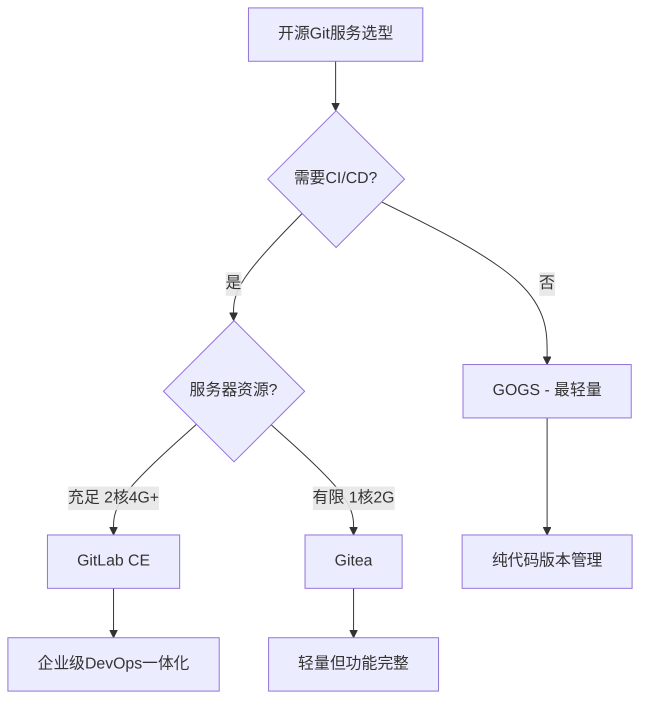
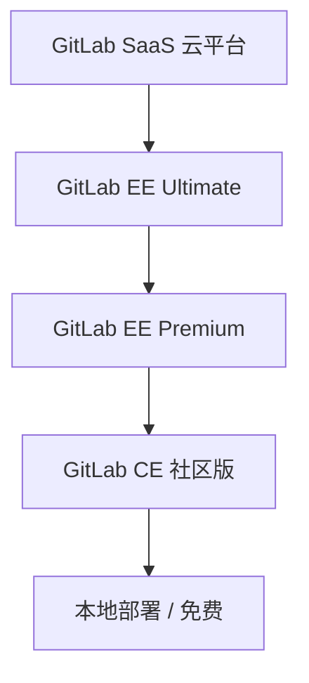

# 开源Git服务对比与选型

## 概述

自建 Git 服务是企业代码资产管理的核心基础设施。本文系统对比 GitLab、Gitea、GOGS、GitBucket 四大主流开源方案，从功能特性、资源需求、技术栈、商业版本等维度进行深度分析，并提供基于团队规模和业务需求的选型决策框架。

## 前置知识

- Git 版本控制基础（参见 01-Git基础操作）
- Docker 容器化部署基础（参见 Docker入门）
- Linux 服务器基本运维（参见 Linux基础）

## 学习目标

- 理解自建 Git 服务的核心驱动力与适用场景
- 掌握四大开源方案的技术栈差异与功能边界
- 能够根据团队规模、资源条件、功能需求做出合理选型
- 了解 GitLab 商业版本体系与功能分层

---

## 一、自建Git服务的驱动力

### 1.1 核心痛点

| 维度 | 具体问题 | 影响 |
|------|----------|------|
| **网络稳定性** | GitHub 国内访问不稳定 | 团队协作效率下降 |
| **代码安全** | 商业代码需私密性，敏感数据不能存公有云 | 合规风险 |
| **权限控制** | 需与内部系统（OA/LDAP）集成 | 管理成本高 |
| **定制化** | 公有平台无法满足内部流程定制 | 流程受限 |

### 1.2 适用场景矩阵

| 场景 | 推荐方案 | 理由 |
|------|----------|------|
| 个人学习项目 | GitHub / Gitee 公开仓库 | 零成本，社区生态好 |
| 小团队协作（5人内） | Gitee 免费私有仓库 | 免运维，功能够用 |
| 中大型企业 | 自建 GitLab / Gitea | 完全可控，功能完善 |
| 安全合规要求极高 | 完全内网部署 | 数据不出内网 |

---

## 二、四大开源方案全景对比

### 2.1 技术栈概览

| 项目 | 开发语言 | 官网 | GitHub Stars | 定位 |
|------|----------|------|:------------:|------|
| **GitLab** | Ruby on Rails | gitlab.com | 45k+ | 企业级 DevOps 平台 |
| **Gitea** | Go | gitea.io | 40k+ | 轻量级全能方案 |
| **GOGS** | Go | gogs.io | 43k+ | 极致轻量代码托管 |
| **GitBucket** | Java / Scala | gitbucket.github.io | 9k+ | 插件化扩展方案 |

> Star 数为约数，随时间变化，仅供参考。

### 2.2 方案特点深度分析



#### GitLab — 企业级首选

**优势：**
- 功能最完善：代码管理 + CI/CD + Container Registry 一体化
- 商业生态成熟：社区版（CE）+ 企业版（EE）+ 云平台
- 第三方集成丰富：LDAP、OAuth、Webhook 等
- DevOps 全流程覆盖：从代码到部署

**劣势：**
- 资源占用大：最低 2核4G + 2GB Swap
- 部署复杂度高：组件众多（PostgreSQL、Redis、Sidekiq 等）
- 社区版部分高级功能缺失

**推荐场景：** 中大型企业、需要 CI/CD 集成、DevOps 团队

#### Gitea — 轻量级首选

**优势：**
- 极致轻量：1核2G 即可运行，内存占用约 50-100MB
- Go 语言开发：性能优秀，跨平台，单二进制部署
- 内置 CI/CD（Actions）和容器镜像仓库
- 支持多种数据库：MySQL / PostgreSQL / SQLite3
- 升级简便：替换二进制文件即可

**劣势：**
- 功能相比 GitLab 略少
- 生态不如 GitLab 成熟

**推荐场景：** 初创团队、资源有限的服务器、需要 CI/CD 但预算有限

#### GOGS — 极致轻量

**优势：**
- 资源占用最低：1核512MB 即可运行
- 国人开发，中文文档友好
- 部署极简：单二进制文件

**劣势：**
- 无内置 CI/CD
- 无容器镜像仓库
- 社区活跃度下降，更新频率低

**推荐场景：** 仅需代码版本管理、资源极度受限、个人项目

#### GitBucket — 插件化方案

**优势：**
- GitHub 风格界面，上手快
- Java 开发，插件系统可扩展

**劣势：**
- 社区活跃度较低
- 资源占用中等

**推荐场景：** Java 技术栈团队、需要插件扩展能力

---

## 三、功能特性深度对比

### 3.1 核心功能矩阵

| 功能特性 | Gitea | GOGS | GitLab CE | GitBucket |
|----------|:-----:|:----:|:---------:|:---------:|
| 开源免费 | ✓ | ✓ | ✓ | ✓ |
| 低资源开销 | ✓ | ✓ | ✗ | ◐ |
| 多数据库支持 | ✓ | ✓ | ✗ | ◐ |
| 跨平台部署 | ✓ | ✓ | ✗ | ✓ |
| 升级简便 | ✓ | ✓ | ✗ | ✓ |
| Pull Request | ✓ | ✓ | ✓ | ✓ |
| 工单管理 | ✓ | ✓ | ✓ | ✓ |
| 内置 CI/CD | ✓ | ✗ | ✓ | ✗ |
| 容器镜像仓库 | ✓ | ✗ | ✓ | ✗ |
| 第三方登录集成 | ✓ | ◐ | ✓ | ◐ |

> 图例：✓ 完全支持 | ◐ 部分支持/需插件 | ✗ 不支持

### 3.2 资源需求对比

| 方案 | 最低配置 | 启动时间 | 数据库 |
|------|----------|----------|--------|
| **GOGS** | 1核 512MB | ~5秒 | SQLite3/MySQL/PostgreSQL |
| **Gitea** | 1核 2GB | ~10秒 | SQLite3/MySQL/PostgreSQL |
| **GitBucket** | 2核 2GB | ~30秒 | H2/MySQL/PostgreSQL |
| **GitLab CE** | 2核 4GB + 2GB Swap | 3-5分钟 | PostgreSQL（内置） |

> 生产环境建议配置翻倍，Docker 部署需额外资源开销。


### 3.3 数据库支持

| 方案 | MySQL | PostgreSQL | SQLite | 内置数据库 |
|------|:-----:|:----------:|:------:|:----------:|
| Gitea | ✓ | ✓ | ✓ | — |
| GOGS | ✓ | ✓ | ✓ | — |
| GitLab CE | ✗ | ✓ | ✗ | PostgreSQL |
| GitBucket | ✓ | ✓ | ✗ | H2 |

---

## 四、GitLab商业版本体系

### 4.1 版本层级



| 版本 | 费用 | 部署方式 | 核心差异 |
|------|------|----------|----------|
| **CE（社区版）** | 免费 | 本地部署 | 代码管理 + CI/CD + 镜像仓库 |
| **EE Premium** | 收费 | 本地/云 | + 价值流管理、部分安全扫描 |
| **EE Ultimate** | 收费 | 本地/云 | + 全部高级安全扫描、合规管理 |
| **SaaS** | 免费/收费 | GitLab 云 | 注册即用，无需部署 |

### 4.2 功能差异

| 功能 | CE | EE Premium | EE Ultimate |
|------|:--:|:----------:|:-----------:|
| 代码管理 + CI/CD | ✓ | ✓ | ✓ |
| 容器镜像仓库 | ✓ | ✓ | ✓ |
| 高级安全扫描（SAST/DAST） | ✗ | ◐ | ✓ |
| 合规管理框架 | ✗ | ◐ | ✓ |
| 价值流管理 | ✗ | ✓ | ✓ |
| 高可用 / Geo 灾备 | ◐ | ✓ | ✓ |

> 图例：✓ 包含 | ◐ 部分包含（需按版本核对官方功能表） | ✗ 不包含

---

## 五、选型决策框架

### 5.1 团队规模推荐

| 团队规模 | 推荐方案 | 理由 |
|----------|----------|------|
| 1-5人 | Gitea / GOGS | 资源占用低，功能够用 |
| 5-20人 | Gitea | 平衡功能与资源，内置 CI/CD |
| 20-50人 | GitLab CE | 功能完善，支持复杂工作流 |
| 50人以上 | GitLab EE | 企业级安全、合规、高可用 |

### 5.2 部署方式快速参考

```bash
# Gitea 一键部署
docker run -d --name=gitea \
  -p 10022:22 -p 3000:3000 \
  -v gitea_data:/data \
  gitea/gitea:latest

# GitLab CE 一键部署
docker run -d --name=gitlab \
  --hostname gitlab.example.com \
  -p 80:80 -p 443:443 -p 22:22 \
  -v gitlab_config:/etc/gitlab \
  -v gitlab_logs:/var/log/gitlab \
  -v gitlab_data:/var/opt/gitlab \
  gitlab/gitlab-ce:latest

# GOGS 一键部署
docker run -d --name=gogs \
  -p 10022:22 -p 3000:3000 \
  -v gogs_data:/data \
  gogs/gogs:latest
```

> 生产环境推荐使用 Docker Compose 进行编排管理，详见 14-GitLab的Docker安装部署。

---

## 六、迁移注意事项

| 迁移项 | 说明 |
|--------|------|
| **代码仓库** | 使用 `git clone --mirror` 完整迁移（含所有分支和标签） |
| **用户账号** | 需重新创建或通过 LDAP 同步 |
| **Issue / PR** | 大部分平台支持导入导出 |
| **CI/CD 配置** | 需要重新配置（语法可能不同） |
| **SSH 密钥** | 用户需重新配置 |
| **Webhook** | 需重新注册并验证 |

---

## 常见问题

| 问题 | 解决方案 |
|------|----------|
| GitLab 内存不足崩溃 | 增加 Swap 分区，优化 `puma` 和 `sidekiq` 配置参数 |
| Gitea/GOGS 无法启动 | 检查数据库连接，确认端口未被占用 |
| SSH 克隆失败 | 检查 SSH 端口映射，确认密钥配置正确 |
| Web 界面加载慢 | 增加服务器资源，启用 Nginx 反向代理缓存 |
| 邮件通知不生效 | 配置 SMTP 服务器信息，检查防火墙出站规则 |
| 升级后数据丢失 | 升级前务必备份数据卷（参见 16-GitLab版本升级与自动化脚本） |

## 最佳实践

1. **选型核心三要素**：团队规模 + 功能需求 + 服务器资源
2. **轻量级首选 Gitea**：资源占用低，功能完善，支持 CI/CD 和镜像仓库
3. **企业级首选 GitLab**：功能最全，DevOps 一体化，生态成熟
4. **推荐 Docker 部署**：便于管理、升级和迁移，所有方案均支持
5. **部署前规划清单**：评估团队增长 → 确定功能需求 → 评估资源 → 选择数据库 → 规划备份策略 → 准备域名和 SSL → 考虑 LDAP 集成

## 延伸阅读

- [Gitea 官方文档](https://docs.gitea.com)
- [GitLab 官方文档](https://docs.gitlab.com)
- [GitLab 系统要求](https://docs.gitlab.com/ee/install/requirements.html)

---


